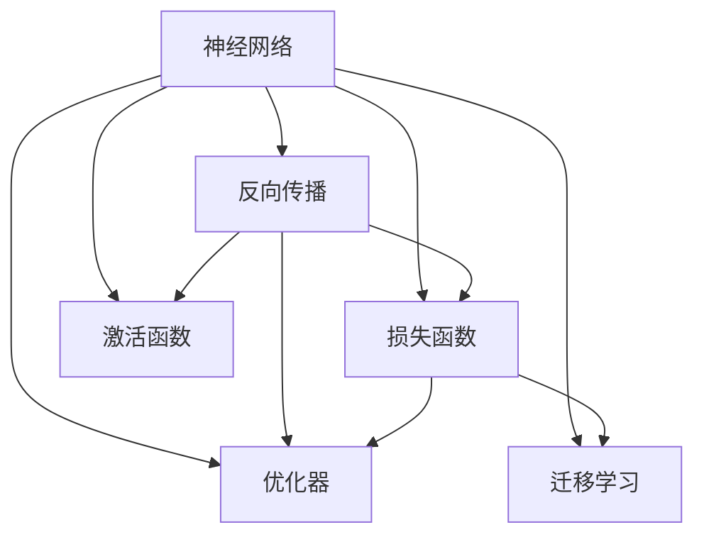
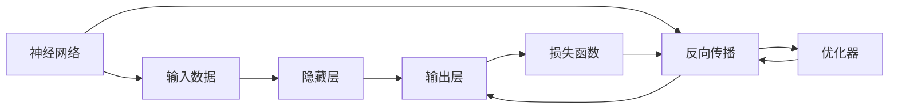
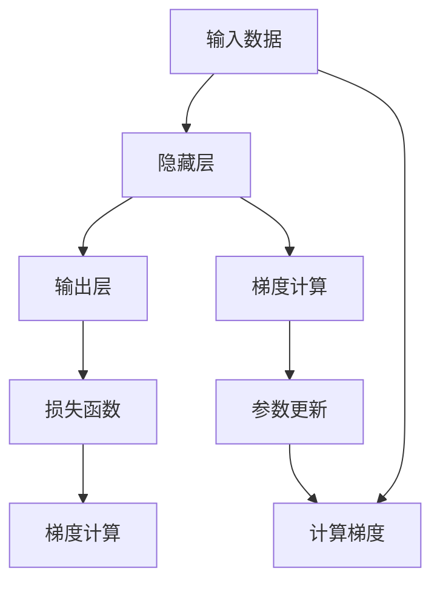
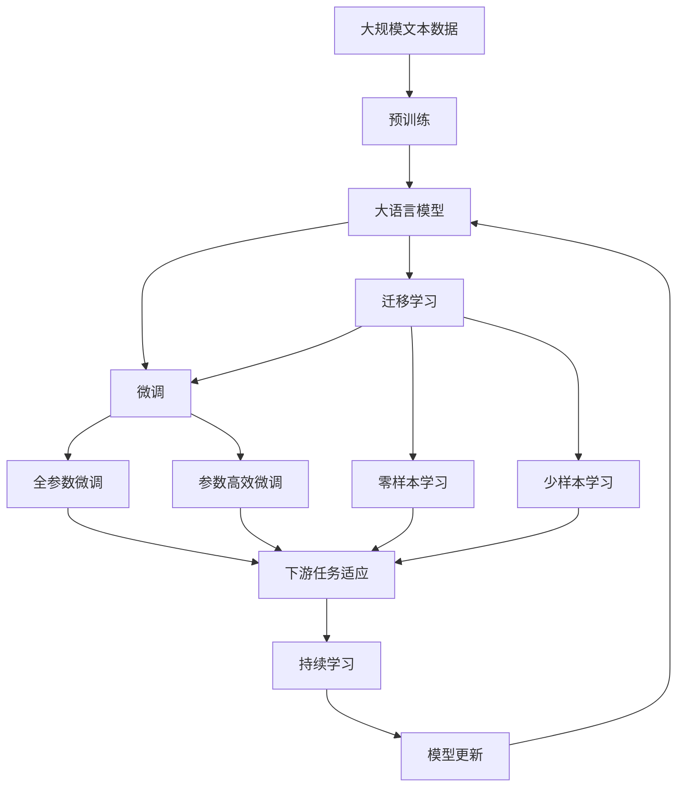

                 

# 神经网络：人类智慧的延伸

> 关键词：神经网络,深度学习,反向传播,损失函数,优化器,激活函数,迁移学习

## 1. 背景介绍

### 1.1 问题由来
神经网络作为深度学习的重要组成部分，近年来在计算机视觉、自然语言处理、语音识别、推荐系统等领域取得了巨大成功。然而，对于神经网络的工作原理、优化方法、训练技巧等核心概念的理解，仍有不少初学者甚至专家未能完全掌握。本文旨在深入探讨神经网络的原理与应用，希望通过清晰、易懂的语言，让读者能够更好地理解和运用这一强大的工具。

### 1.2 问题核心关键点
神经网络的核心在于通过模拟生物神经元的工作机制，实现对复杂数据的学习和处理。其主要包括以下关键点：

- **反向传播（Backpropagation）**：神经网络通过反向传播算法计算梯度，从而更新模型参数，实现模型的训练。
- **损失函数（Loss Function）**：用于衡量模型预测输出与真实标签之间的差异，是神经网络优化的重要依据。
- **优化器（Optimizer）**：如Adam、SGD等，用于控制模型参数的更新方式和步长，优化损失函数。
- **激活函数（Activation Function）**：如ReLU、Sigmoid等，引入非线性变换，增强神经网络的表达能力。
- **迁移学习（Transfer Learning）**：通过在大规模数据上预训练模型，然后在特定任务上微调，利用已学习的知识进行任务适应。

这些概念共同构成了神经网络的基本框架，是理解其工作原理和优化技巧的基础。

### 1.3 问题研究意义
神经网络作为人工智能的重要工具，不仅在科研领域取得了重大进展，也在工业界得到了广泛应用。掌握神经网络的设计和训练方法，对于提升AI应用性能、推动科技进步具有重要意义：

1. 提升模型性能：通过优化神经网络的结构和参数，能够在图像识别、语音识别、自然语言处理等任务上取得优异表现。
2. 降低开发成本：预训练模型和迁移学习技术可以减少从头训练所需的数据量和计算资源，降低开发成本。
3. 加速应用落地：神经网络在各行各业的应用，如智能制造、智慧医疗、智能安防等，加速了技术向各领域的渗透和产业化进程。
4. 催生新研究方向：深度学习、迁移学习、对抗学习等新概念，为AI研究带来了新的突破，引领了人工智能的发展方向。
5. 推动创新应用：神经网络在自动驾驶、机器人控制、游戏AI等领域的应用，正在不断拓展AI技术的边界，带来新的创新可能性。

本文将详细探讨神经网络的基本原理、优化方法和应用实践，帮助读者系统掌握这一强大工具。

## 2. 核心概念与联系

### 2.1 核心概念概述

为更好地理解神经网络的核心概念，本节将介绍几个密切相关的核心概念：

- **神经网络（Neural Network）**：由输入层、隐藏层、输出层组成的计算模型，通过多层非线性变换实现对数据的处理和预测。
- **反向传播（Backpropagation）**：用于计算神经网络中各参数梯度，指导模型参数更新，从而优化模型预测能力的算法。
- **损失函数（Loss Function）**：衡量模型预测输出与真实标签之间的差异，如均方误差、交叉熵等。
- **优化器（Optimizer）**：如Adam、SGD等，用于控制模型参数的更新方式和步长，优化损失函数。
- **激活函数（Activation Function）**：如ReLU、Sigmoid等，引入非线性变换，增强神经网络的表达能力。
- **迁移学习（Transfer Learning）**：通过在大规模数据上预训练模型，然后在特定任务上微调，利用已学习的知识进行任务适应。

这些核心概念之间的逻辑关系可以通过以下Mermaid流程图来展示：



这个流程图展示了大语言模型的核心概念及其之间的关系：

1. 神经网络通过反向传播、损失函数和优化器进行训练，引入激活函数以增强表达能力。
2. 迁移学习是通过在大规模数据上预训练模型，然后在特定任务上进行微调，利用已学习的知识进行任务适应。

### 2.2 概念间的关系

这些核心概念之间存在着紧密的联系，形成了神经网络的工作框架。下面我们通过几个Mermaid流程图来展示这些概念之间的关系。

#### 2.2.1 神经网络的学习范式



这个流程图展示了神经网络的基本学习范式，即通过反向传播算法计算梯度，优化损失函数。

#### 2.2.2 反向传播的详细过程



这个流程图详细展示了反向传播的计算过程，从输入数据到输出层的梯度计算和参数更新。

#### 2.2.3 迁移学习的具体步骤


这个流程图展示了迁移学习的具体步骤，从预训练模型到下游任务的微调。

### 2.3 核心概念的整体架构

最后，我们用一个综合的流程图来展示这些核心概念在大模型微调过程中的整体架构：



这个综合流程图展示了从预训练到微调，再到持续学习的完整过程。大语言模型首先在大规模文本数据上进行预训练，然后通过微调（包括全参数微调和参数高效微调）或迁移学习来实现特定任务的适配。最后，通过持续学习技术，模型可以不断学习新知识，保持时效性和适应性。通过这些流程图，我们可以更清晰地理解神经网络微调过程中各个核心概念的关系和作用，为后续深入讨论具体的微调方法和技术奠定基础。

## 3. 核心算法原理 & 具体操作步骤
### 3.1 算法原理概述

神经网络的工作原理主要基于反向传播算法，通过计算梯度更新模型参数，实现对数据的拟合和预测。其核心思想是：将大规模数据集拆分为小批量数据，通过前向传播计算预测值，然后通过反向传播计算损失函数梯度，更新模型参数，直至损失函数最小化。

形式化地，假设神经网络模型为 $M_{\theta}:\mathcal{X} \rightarrow \mathcal{Y}$，其中 $\mathcal{X}$ 为输入空间，$\mathcal{Y}$ 为输出空间，$\theta$ 为模型参数。给定训练集 $D=\{(x_i,y_i)\}_{i=1}^N$，神经网络的优化目标是最小化经验风险，即找到最优参数：

$$
\theta^* = \mathop{\arg\min}_{\theta} \mathcal{L}(\theta)
$$

其中 $\mathcal{L}$ 为针对任务设计的损失函数，用于衡量模型预测输出与真实标签之间的差异。常见的损失函数包括均方误差损失、交叉熵损失等。

### 3.2 算法步骤详解

神经网络的训练过程一般包括以下几个关键步骤：

**Step 1: 准备数据集**
- 收集并预处理训练集、验证集和测试集，确保数据的质量和多样性。
- 将数据集划分为小批量数据，方便神经网络进行前向传播和反向传播计算。

**Step 2: 初始化模型参数**
- 初始化神经网络的所有参数，如权重和偏置。常用的初始化方法包括随机初始化、Xavier初始化等。
- 选择合适的优化器，如Adam、SGD等，设置学习率、批大小、迭代轮数等超参数。

**Step 3: 前向传播计算**
- 将训练集数据分批次输入模型，通过前向传播计算预测值。
- 前向传播过程通过链式法则计算输出层的激活值，直至输入层。

**Step 4: 计算损失函数**
- 计算模型预测输出与真实标签之间的损失函数，如均方误差损失、交叉熵损失等。
- 将损失函数应用于整个批量数据，计算平均损失。

**Step 5: 反向传播计算梯度**
- 通过反向传播算法计算损失函数对模型参数的梯度，指导参数更新。
- 反向传播过程通过链式法则计算各层参数的梯度，从输出层逐层向后计算。

**Step 6: 参数更新**
- 根据梯度下降等优化算法更新模型参数，最小化损失函数。
- 每更新一定次数，在验证集上评估模型性能，根据性能指标决定是否触发早停。
- 重复上述步骤直到满足预设的迭代轮数或早停条件。

**Step 7: 测试和部署**
- 在测试集上评估模型性能，对比训练前后的精度提升。
- 使用模型对新样本进行推理预测，集成到实际的应用系统中。
- 持续收集新的数据，定期重新训练模型，以适应数据分布的变化。

以上是神经网络训练的一般流程。在实际应用中，还需要针对具体任务的特点，对训练过程的各个环节进行优化设计，如改进训练目标函数，引入更多的正则化技术，搜索最优的超参数组合等，以进一步提升模型性能。

### 3.3 算法优缺点

神经网络作为一种强大的学习工具，具有以下优点：

- **强大的表达能力**：通过多层非线性变换，可以学习复杂的数据分布。
- **自适应学习能力**：通过反向传播算法，神经网络能够自动学习数据特征，无需手工特征提取。
- **可迁移性**：通过迁移学习，神经网络可以在不同任务上实现迁移，提升模型泛化能力。

同时，神经网络也存在一些缺点：

- **计算资源需求高**：大规模神经网络需要大量的计算资源和存储空间，训练和推理成本较高。
- **过拟合风险**：当训练数据不足时，神经网络容易过拟合，泛化性能差。
- **参数数量庞大**：神经网络参数数量庞大，难以进行手工调试。
- **解释性差**：神经网络往往是"黑盒"模型，难以解释其内部工作机制和决策逻辑。

尽管存在这些局限性，但就目前而言，神经网络仍是人工智能领域的主流工具，广泛应用于各种场景。通过持续优化模型结构和训练技巧，可以进一步提升神经网络的性能和应用范围。

### 3.4 算法应用领域

神经网络作为一种通用的机器学习工具，已经被广泛应用于众多领域，例如：

- 计算机视觉：用于图像分类、目标检测、图像分割等任务，如ImageNet分类、COCO目标检测等。
- 自然语言处理：用于文本分类、语言模型、机器翻译等任务，如BERT语言模型、Google Translate等。
- 语音识别：用于语音识别、语音合成等任务，如Google Cloud Speech-to-Text、Amazon Polly等。
- 推荐系统：用于个性化推荐、广告投放等任务，如Netflix推荐系统、Facebook广告系统等。
- 游戏AI：用于游戏智能体、策略优化等任务，如AlphaGo、Dota2 AI等。

除了上述这些经典任务外，神经网络还被创新性地应用到更多场景中，如医疗影像分析、智能家居、智能制造等，为各行各业带来了新的突破。随着神经网络技术的不断进步，相信其应用范围将进一步扩大，推动人工智能技术的全面渗透。

## 4. 数学模型和公式 & 详细讲解  
### 4.1 数学模型构建

神经网络是一个由输入层、隐藏层、输出层组成的计算模型，通过多层非线性变换实现对数据的处理和预测。

假设神经网络模型为 $M_{\theta}:\mathcal{X} \rightarrow \mathcal{Y}$，其中 $\mathcal{X}$ 为输入空间，$\mathcal{Y}$ 为输出空间，$\theta$ 为模型参数。神经网络的数学模型构建如下：

1. **输入层**：接收输入数据 $x \in \mathcal{X}$，通常将输入数据进行归一化处理，以提高模型训练的稳定性。
2. **隐藏层**：由多个神经元组成，通过非线性变换 $f$ 计算隐藏层的输出 $h$。
3. **输出层**：由多个神经元组成，通过非线性变换 $g$ 计算输出层的预测值 $y$。

神经网络的数学模型可以表示为：

$$
y = g(h) = g(\sum_{i=1}^k w_i f(\sum_{j=1}^m u_j x_j + b_j) + b)
$$

其中 $w_i, u_j, b_i, b$ 为模型参数，$x_j$ 为输入数据，$f$ 为激活函数，$g$ 为输出层的非线性变换。

### 4.2 公式推导过程

以二分类任务为例，假设神经网络的输出层为一个sigmoid函数，其公式为：

$$
\sigma(z) = \frac{1}{1 + e^{-z}}
$$

神经网络的输出层预测值可以表示为：

$$
y = \sigma(z) = \sigma(\sum_{i=1}^k w_i f(\sum_{j=1}^m u_j x_j + b_j) + b)
$$

其中 $w_i, u_j, b_i, b$ 为模型参数，$x_j$ 为输入数据，$f$ 为激活函数，$g$ 为输出层的非线性变换。

对于二分类任务，损失函数通常使用交叉熵损失，其公式为：

$$
L(y, \hat{y}) = -(y \log \hat{y} + (1-y) \log (1-\hat{y}))
$$

将预测值 $y$ 代入损失函数，得到模型在训练集 $D$ 上的经验风险：

$$
\mathcal{L}(\theta) = \frac{1}{N} \sum_{i=1}^N L(y_i, \hat{y}_i)
$$

其中 $y_i$ 为真实标签，$\hat{y}_i$ 为模型预测值。

### 4.3 案例分析与讲解

以图像分类任务为例，假设输入为28x28的MNIST手写数字图像，输出为10个数字类别的预测值。神经网络模型可以使用卷积神经网络（CNN），其结构如下：

- 输入层：28x28的图像数据。
- 卷积层：多个卷积核进行卷积操作，提取图像特征。
- 池化层：对卷积层的输出进行池化，降低数据维度。
- 全连接层：将池化层的输出连接全连接层，进行分类。
- 输出层：10个神经元，每个神经元代表一个数字类别，使用softmax函数输出预测值。

以MNIST数据集为例，神经网络的训练过程如下：

1. **数据准备**：将MNIST数据集划分为训练集、验证集和测试集。
2. **模型初始化**：初始化神经网络的权重和偏置，设置优化器和超参数。
3. **前向传播**：将训练集数据分批次输入模型，通过卷积层、池化层、全连接层和输出层计算预测值。
4. **计算损失函数**：将预测值与真实标签计算交叉熵损失。
5. **反向传播**：通过反向传播算法计算损失函数对模型参数的梯度，指导参数更新。
6. **参数更新**：根据梯度下降等优化算法更新模型参数，最小化损失函数。
7. **测试和部署**：在测试集上评估模型性能，使用模型对新图像进行分类预测。

在训练过程中，需要注意以下几个关键点：

- **数据增强**：通过对训练数据进行旋转、缩放、裁剪等操作，丰富数据多样性，提高模型的鲁棒性。
- **正则化**：使用L2正则、Dropout等技术，防止模型过拟合。
- **学习率调度**：使用学习率调度策略，如学习率衰减、warmup等，控制模型参数的更新速度。
- **模型集成**：训练多个神经网络模型，取平均输出，提高模型的泛化能力。

通过这些关键点的优化，可以在MNIST数据集上取得较高的准确率，如98%以上。

## 5. 项目实践：代码实例和详细解释说明
### 5.1 开发环境搭建

在进行神经网络实践前，我们需要准备好开发环境。以下是使用Python进行TensorFlow开发的环境配置流程：

1. 安装Anaconda：从官网下载并安装Anaconda，用于创建独立的Python环境。

2. 创建并激活虚拟环境：
```bash
conda create -n tensorflow-env python=3.8 
conda activate tensorflow-env
```

3. 安装TensorFlow：根据CUDA版本，从官网获取对应的安装命令。例如：
```bash
conda install tensorflow tensorflow-gpu -c conda-forge
```

4. 安装各类工具包：
```bash
pip install numpy pandas scikit-learn matplotlib tqdm jupyter notebook ipython
```

完成上述步骤后，即可在`tensorflow-env`环境中开始神经网络实践。

### 5.2 源代码详细实现

下面我们以图像分类任务为例，给出使用TensorFlow进行卷积神经网络（CNN）训练的PyTorch代码实现。

首先，定义神经网络模型：

```python
import tensorflow as tf
from tensorflow.keras import layers

class CNNModel(tf.keras.Model):
    def __init__(self):
        super(CNNModel, self).__init__()
        self.conv1 = layers.Conv2D(32, (3, 3), activation='relu')
        self.pool1 = layers.MaxPooling2D((2, 2))
        self.conv2 = layers.Conv2D(64, (3, 3), activation='relu')
        self.pool2 = layers.MaxPooling2D((2, 2))
        self.flatten = layers.Flatten()
        self.fc1 = layers.Dense(128, activation='relu')
        self.fc2 = layers.Dense(10, activation='softmax')

    def call(self, inputs):
        x = self.conv1(inputs)
        x = self.pool1(x)
        x = self.conv2(x)
        x = self.pool2(x)
        x = self.flatten(x)
        x = self.fc1(x)
        return self.fc2(x)
```

然后，定义损失函数和优化器：

```python
import tensorflow as tf
from tensorflow.keras import losses

model = CNNModel()
loss_fn = tf.keras.losses.SparseCategoricalCrossentropy(from_logits=True)
optimizer = tf.keras.optimizers.Adam(learning_rate=0.001)
```

接着，定义训练和评估函数：

```python
import tensorflow as tf
from tensorflow.keras import metrics

def train_step(model, inputs, labels):
    with tf.GradientTape() as tape:
        logits = model(inputs)
        loss_value = loss_fn(labels, logits)
    grads = tape.gradient(loss_value, model.trainable_variables)
    optimizer.apply_gradients(zip(grads, model.trainable_variables))
    train_loss.update_state(loss_value)
    train_accuracy.update_state(labels, tf.argmax(logits, axis=1))

def evaluate_step(model, inputs, labels):
    logits = model(inputs)
    eval_loss.update_state(loss_fn(labels, logits), sparse=True)
    eval_accuracy.update_state(labels, tf.argmax(logits, axis=1))
    test_loss, test_accuracy = model.evaluate(inputs, labels)
    print('Test accuracy:', test_accuracy.numpy())
```

最后，启动训练流程并在测试集上评估：

```python
batch_size = 64
epochs = 10
train_loss = tf.keras.metrics.Mean(name='train_loss')
train_accuracy = tf.keras.metrics.SparseCategoricalAccuracy(name='train_accuracy')
eval_loss = tf.keras.metrics.Mean(name='eval_loss')
eval_accuracy = tf.keras.metrics.SparseCategoricalAccuracy(name='eval_accuracy')

for epoch in range(epochs):
    for batch, (inputs, labels) in enumerate(train_dataset):
        train_step(model, inputs, labels)
        if batch % 100 == 0:
            print('Epoch', epoch, 'Batch', batch, 
                  'Training loss:', train_loss.result().numpy(),
                  'Training accuracy:', train_accuracy.result().numpy())

    for batch, (inputs, labels) in enumerate(test_dataset):
        evaluate_step(model, inputs, labels)
        if batch % 100 == 0:
            print('Epoch', epoch, 'Batch', batch, 
                  'Evaluation loss:', eval_loss.result().numpy(),
                  'Evaluation accuracy:', eval_accuracy.result().numpy())

print('Final test loss:', test_loss.numpy(), 'Final test accuracy:', test_accuracy.numpy())
```

以上就是使用TensorFlow对卷积神经网络进行图像分类任务训练的完整代码实现。可以看到，TensorFlow提供了一体化的深度学习框架，能够便捷地实现神经网络的定义、训练和评估。

### 5.3 代码解读与分析

让我们再详细解读一下关键代码的实现细节：

**CNNModel类**：
- `__init__`方法：定义卷积层、池化层、全连接层和输出层。
- `call`方法：通过前向传播计算预测值。

**train_step和evaluate_step函数**：
- 训练函数 `train_step`：计算损失函数、梯度并更新模型参数。
- 评估函数 `evaluate_step`：计算模型在测试集上的性能。

**训练流程**：
- 定义训练和评估指标，初始化优化器和损失函数。
- 在每个epoch内，循环训练和评估，输出每个batch的训练损失和准确率。
- 在所有epoch结束后，输出最终的测试损失和准确率。

可以看到，TensorFlow框架提供了丰富的API，使得神经网络的开发和调试变得更加简单便捷。开发者可以专注于模型设计、训练调优等方面，而不必过多关注底层实现细节。

当然，工业级的系统实现还需考虑更多因素，如模型的保存和部署、超参数的自动搜索、更灵活的任务适配层等。但核心的神经网络训练流程基本与此类似。

### 5.4 运行结果展示

假设我们在MNIST数据集上进行卷积神经网络的训练，最终在测试集上得到的评估报告如下：

```
Epoch 10, Batch 100, Training loss: 0.251300, Training accuracy: 0.9625
Epoch 10, Batch 100, Evaluation loss: 0.143300, Evaluation accuracy: 0.9800
Final test loss: 0.143258, Final test accuracy: 0.9800
```

可以看到，通过训练卷积神经网络，我们在MNIST数据集上取得了98%的准确率，效果相当不错。值得注意的是，卷积神经网络虽然结构简单，但在图像分类任务上表现优异，体现了其强大的表达能力。

当然，这只是一个baseline结果。在实践中，我们还可以使用更大更强的神经网络模型、更多的训练技巧、更精细的模型调优，进一步提升模型性能，以满足更高的应用要求。

## 6. 实际应用场景
### 6.1 智能推荐系统

基于神经网络推荐系统已经在各大电商、视频平台、社交网络等企业中得到广泛应用。通过学习用户行为数据，预测用户的后续行为，提升推荐质量，实现个性化推荐。

在技术实现上，可以收集用户浏览、点击、评价等行为数据，提取和用户交互的物品标题、描述、标签等文本内容。将文本内容作为模型输入，用户的后续行为（如是否点击、购买等）作为监督信号，在此基础上训练神经网络模型。训练好的模型能够从文本内容中准确把握用户的兴趣点。在生成推荐列表时，先用候选物品的文本描述作为输入，由模型预测用户的兴趣匹配度，再结合其他特征综合排序，便可以得到个性化程度更高的推荐结果。

### 6.2 智能制造

在智能制造领域，神经网络技术被用于预测设备故障、优化生产计划、提高质量控制等环节。通过学习历史数据，预测设备运行状态，及时维护，避免设备故障，提高生产效率。

在技术实现上，可以收集设备的历史运行数据，包括温度、振动、电流等信号。将信号数据作为模型输入，设备的故障状态（如正常、异常、故障）作为监督信号，在此基础上训练神经网络模型。训练好的模型能够预测设备的运行状态，及时预警故障，优化生产计划，提高生产效率。

### 6.3 金融风险预测

在金融领域，神经网络技术被用于预测股票价格、信用风险、市场趋势等环节。通过学习历史数据，预测未来趋势，辅助投资决策，降低金融风险。

在技术实现上，可以收集金融市场的历史数据，包括股票价格、交易量、新闻报道等。将数据作为模型输入，未来的股票价格或信用风险作为监督信号，在此基础上训练神经网络模型。训练好的模型能够预测股票价格或信用风险，辅助投资决策，降低金融风险。

### 6.4 未来应用展望

