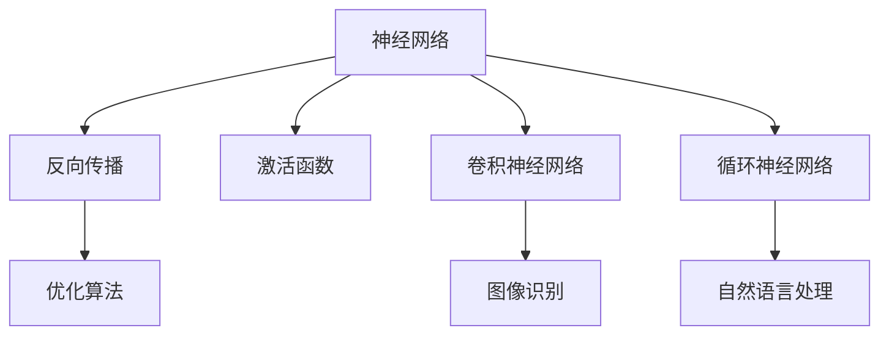
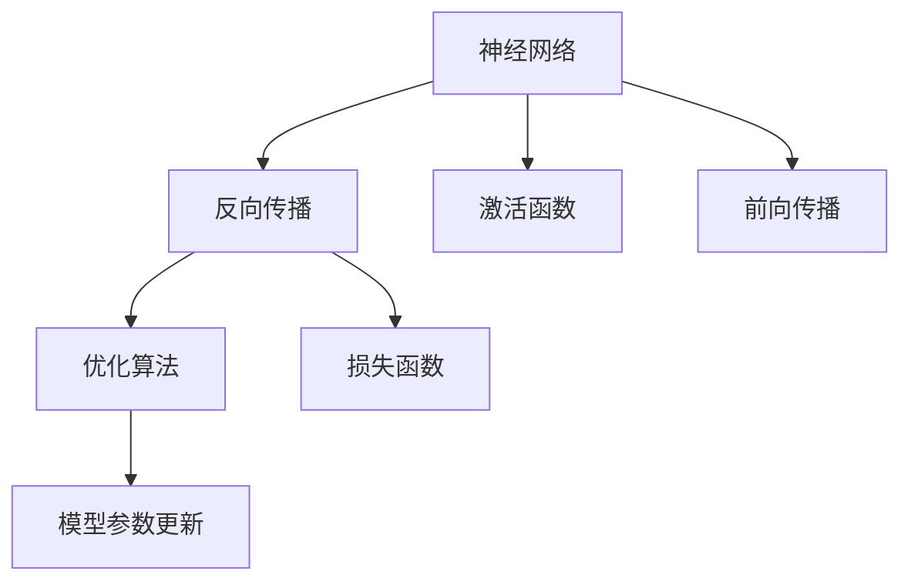
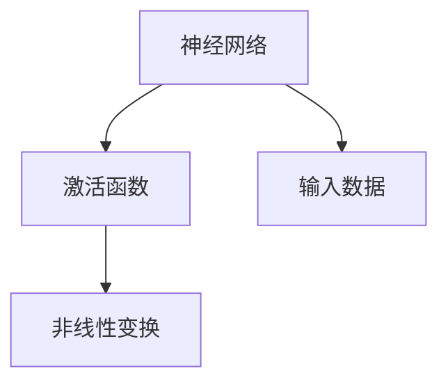
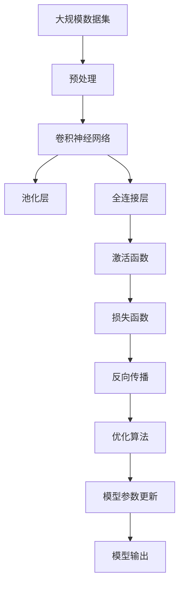

                 

# 神经网络：开启智能新纪元

> 关键词：神经网络,深度学习,计算图,反向传播,激活函数,卷积神经网络,循环神经网络,自然语言处理(NLP),计算机视觉(CV),强化学习(RL)

## 1. 背景介绍

### 1.1 问题由来
深度学习是21世纪人工智能研究的热点领域之一，其核心是模拟人脑的神经网络结构和算法。神经网络之所以成为深度学习的标志性技术，关键在于它能够通过大量数据的反向传播训练，学习出复杂的数据分布规律，并在各种领域展现出显著的性能提升。

随着计算能力与数据量的激增，神经网络的应用范围从图像识别、语音识别等传统领域，扩展到自然语言处理、医疗诊断、金融预测、游戏策略制定等更广泛的领域。这一进步不仅推动了科学研究的突破，也促成了许多前所未有的商业应用和产业变革。

### 1.2 问题核心关键点
深度学习的关键在于神经网络模型。典型神经网络由多层非线性变换组成，每层通过前一层的输入，执行一系列线性变换和激活函数计算，最终输出新的特征表示。其核心流程包括前向传播、损失函数计算和反向传播三步。

在实践中，常见的神经网络模型包括卷积神经网络（Convolutional Neural Network, CNN）和循环神经网络（Recurrent Neural Network, RNN）。CNN适用于处理图像、语音等空间结构信息；RNN适用于处理序列数据，如自然语言文本、时间序列等。此外，还有针对特定应用场景优化设计的模型，如全连接神经网络、递归神经网络、自编码器等。

深度学习技术的成功依赖于大量的标注数据、高效计算资源和强大的工程实现能力。近年来，得益于GPU和TPU等高性能计算设备的推动，深度学习模型的训练速度和性能得到了飞速提升，为更多复杂问题的解决提供了可能。

### 1.3 问题研究意义
深度学习技术的突破，对于推动人工智能的发展具有重大意义：

1. **大幅提升模型精度**：深度学习能够自动学习数据的复杂特征表示，减少了手工设计的特征工程环节，显著提高了模型预测的精度和鲁棒性。
2. **适应性更强**：深度网络对噪声和变化更为稳健，能够更好地处理高维稀疏数据，适应大规模数据集。
3. **自动化特征提取**：通过多层次的非线性变换，深度学习能够自动提取数据的高阶特征，减少了人工特征提取的难度和误差。
4. **广泛应用**：深度学习在图像识别、语音识别、自然语言处理、推荐系统等领域取得了突破性进展，促进了这些领域的智能化发展。
5. **技术溢出效应**：深度学习技术的发展也推动了其他相关领域的进步，如计算机视觉、机器人学、生物信息学等。

## 2. 核心概念与联系

### 2.1 核心概念概述

深度学习模型的核心是神经网络。本节将介绍几个密切相关的核心概念：

- **神经网络(Neural Network, NN)**：由多层非线性变换组成的计算图，用于处理各种数据结构和任务。每层通过前一层的输入执行一系列线性变换和激活函数计算，输出新的特征表示。

- **反向传播(Backpropagation)**：一种用于优化神经网络参数的算法。通过反向传播计算损失函数对参数的梯度，利用梯度下降等优化算法更新参数，使得模型预测输出更接近真实标签。

- **激活函数(Activation Function)**：用于引入非线性变换的函数，如ReLU、Sigmoid、Tanh等。激活函数引入非线性性，使得神经网络能够学习复杂的特征表示。

- **卷积神经网络(Convolutional Neural Network, CNN)**：针对图像等空间结构数据的神经网络模型。通过卷积操作提取局部特征，然后通过池化层减少参数量，最后通过全连接层输出预测结果。

- **循环神经网络(Recurrent Neural Network, RNN)**：针对序列数据的神经网络模型。通过循环结构，网络能够处理动态变化的数据，适用于自然语言处理、时间序列预测等任务。

- **深度学习框架(Deep Learning Framework)**：如TensorFlow、PyTorch、Keras等，提供了高效计算图和优化器实现，便于神经网络模型的构建和训练。

这些核心概念之间的逻辑关系可以通过以下Mermaid流程图来展示：



这个流程图展示了神经网络及其核心组件之间的关系：

1. 神经网络通过反向传播和激活函数学习数据的特征表示。
2. CNN适用于处理图像等空间结构数据。
3. RNN适用于处理序列数据，如自然语言文本、时间序列等。
4. 深度学习框架提供了高效的计算图和优化器，便于神经网络模型的构建和训练。

### 2.2 概念间的关系

这些核心概念之间存在着紧密的联系，形成了深度学习模型的完整生态系统。下面我们通过几个Mermaid流程图来展示这些概念之间的关系。

#### 2.2.1 神经网络的学习范式



这个流程图展示了神经网络的典型学习范式，包括前向传播、损失函数计算和反向传播。优化算法通过计算损失函数对参数的梯度，更新模型参数，使得预测输出更接近真实标签。

#### 2.2.2 反向传播与优化算法的联系


这个流程图展示了反向传播和优化算法之间的关系。反向传播计算损失函数对参数的梯度，优化算法利用梯度下降等优化策略更新模型参数，最终使得损失函数收敛，模型性能得到提升。

#### 2.2.3 激活函数的作用



这个流程图展示了激活函数在神经网络中的作用。激活函数通过非线性变换，使得神经网络能够学习更复杂的数据分布，从而提高模型的表达能力和泛化能力。

### 2.3 核心概念的整体架构

最后，我们用一个综合的流程图来展示这些核心概念在大规模神经网络模型中的整体架构：



这个综合流程图展示了从数据预处理到模型输出的完整过程。在大规模数据集上，先通过预处理将原始数据转化为适合神经网络处理的格式，然后通过卷积神经网络和池化层提取局部特征，接着通过全连接层和激活函数学习高阶特征，最后通过损失函数计算预测误差，反向传播更新模型参数，得到最终的模型输出。通过这些流程图，我们可以更清晰地理解神经网络模型的整体架构和工作流程。

## 3. 核心算法原理 & 具体操作步骤
### 3.1 算法原理概述

深度学习模型通常由多层神经网络组成，每层通过前一层的输入执行一系列线性变换和激活函数计算，最终输出新的特征表示。其核心流程包括前向传播、损失函数计算和反向传播三步。

在实践中，深度学习模型主要利用反向传播算法进行优化。反向传播算法的基本思想是通过链式法则，计算损失函数对模型参数的梯度，利用梯度下降等优化算法更新参数，使得模型预测输出更接近真实标签。

具体而言，假设模型 $M_{\theta}:\mathcal{X} \rightarrow \mathcal{Y}$，其中 $\mathcal{X}$ 为输入空间，$\mathcal{Y}$ 为输出空间，$\theta$ 为模型参数。给定训练集 $D=\{(x_i,y_i)\}_{i=1}^N, x_i \in \mathcal{X}, y_i \in \mathcal{Y}$，深度学习模型的训练过程如下：

1. 前向传播：将输入数据 $x_i$ 通过神经网络模型，计算输出 $\hat{y}=M_{\theta}(x_i)$。
2. 计算损失函数：使用损失函数 $\mathcal{L}(y_i,\hat{y})$ 计算模型预测输出 $\hat{y}$ 与真实标签 $y_i$ 之间的误差。
3. 反向传播：利用链式法则计算损失函数对模型参数 $\theta$ 的梯度 $\frac{\partial \mathcal{L}}{\partial \theta}$，利用优化算法更新参数，使得模型预测输出更接近真实标签。

### 3.2 算法步骤详解

深度学习模型的训练一般包括以下几个关键步骤：

**Step 1: 准备训练数据和模型**

- 收集标注数据集 $D=\{(x_i,y_i)\}_{i=1}^N$，其中 $x_i$ 为输入，$y_i$ 为标签。
- 选择合适的深度学习模型（如CNN、RNN等）作为初始化参数。
- 定义模型的超参数，如学习率、批大小、迭代轮数等。

**Step 2: 定义损失函数和优化器**

- 选择合适的损失函数，如均方误差、交叉熵等，衡量模型预测输出与真实标签之间的差异。
- 选择合适的优化算法，如Adam、SGD等，更新模型参数。
- 定义模型评估指标，如精度、召回率、F1分数等。

**Step 3: 前向传播和损失函数计算**

- 将训练集数据分批次输入模型，前向传播计算输出。
- 计算损失函数，衡量模型预测输出与真实标签之间的误差。
- 周期性在验证集上评估模型性能，根据性能指标决定是否触发Early Stopping。

**Step 4: 反向传播和参数更新**

- 反向传播计算损失函数对参数的梯度。
- 利用优化算法根据梯度更新模型参数。
- 重复上述步骤直至满足预设的迭代轮数或Early Stopping条件。

**Step 5: 测试和部署**

- 在测试集上评估微调后模型 $M_{\hat{\theta}}$ 的性能。
- 使用微调后的模型对新样本进行推理预测，集成到实际的应用系统中。
- 持续收集新的数据，定期重新微调模型，以适应数据分布的变化。

以上是深度学习模型训练的一般流程。在实际应用中，还需要针对具体任务和数据特点，对训练过程的各个环节进行优化设计，如改进训练目标函数，引入更多的正则化技术，搜索最优的超参数组合等，以进一步提升模型性能。

### 3.3 算法优缺点

深度学习模型具有以下优点：

1. 自动特征提取：深度网络通过多层次的非线性变换，自动学习数据的复杂特征表示，减少了手工设计的特征工程环节。
2. 处理高维数据：深度学习模型能够处理高维稀疏数据，适应大规模数据集。
3. 精度高：深度学习模型通过反向传播算法不断优化参数，能够学习出复杂的数据分布规律，预测精度较高。
4. 可扩展性强：深度学习模型可以通过增加层数和神经元数量，适应更复杂的任务和数据。
5. 适用性强：深度学习模型在图像识别、语音识别、自然语言处理等领域取得了突破性进展。

同时，深度学习模型也存在一些局限性：

1. 数据依赖性强：深度学习模型需要大量的标注数据进行训练，数据采集和标注成本较高。
2. 计算资源需求高：深度学习模型通常需要高性能计算设备支持，训练和推理耗时较长。
3. 模型复杂度高：深度学习模型参数量较大，结构复杂，难以理解和调试。
4. 过拟合风险高：深度学习模型容易过拟合，特别是在训练数据量不足的情况下。
5. 泛化能力弱：深度学习模型在不同数据分布上泛化性能较差，需要进行适当的迁移学习或正则化处理。

尽管存在这些局限性，但深度学习模型在处理复杂非线性关系方面展现出无可匹敌的优越性，成为当前人工智能领域的主流技术。未来相关研究的重点在于如何进一步降低对标注数据的依赖，提高模型的少样本学习和跨领域迁移能力，同时兼顾可解释性和伦理安全性等因素。

### 3.4 算法应用领域

深度学习模型已经在各个领域取得了广泛应用，包括但不限于：

- **计算机视觉**：图像分类、目标检测、人脸识别、图像生成等。
- **自然语言处理**：文本分类、情感分析、机器翻译、对话系统等。
- **语音识别**：语音转文本、说话人识别、语音生成等。
- **生物信息学**：基因组分析、蛋白质结构预测、药物设计等。
- **金融预测**：股票预测、风险评估、信用评分等。
- **自动驾驶**：视觉识别、轨迹预测、决策制定等。
- **游戏策略**：游戏AI、机器人控制、自动作曲等。

除了上述这些主要应用领域外，深度学习技术还在更多新兴场景中展示了其强大的潜力，如医学影像分析、智能推荐系统、社交网络分析等。随着深度学习模型的不断演进和优化，其应用领域将进一步拓展，为各行各业带来深刻的变革。

## 4. 数学模型和公式 & 详细讲解 & 举例说明

### 4.1 数学模型构建

深度学习模型的训练过程可以通过以下数学模型来描述：

假设模型 $M_{\theta}:\mathcal{X} \rightarrow \mathcal{Y}$，其中 $\mathcal{X}$ 为输入空间，$\mathcal{Y}$ 为输出空间，$\theta$ 为模型参数。给定训练集 $D=\{(x_i,y_i)\}_{i=1}^N, x_i \in \mathcal{X}, y_i \in \mathcal{Y}$。

定义模型 $M_{\theta}$ 在输入 $x_i$ 上的输出为 $\hat{y}=M_{\theta}(x_i)$，模型在数据集 $D$ 上的经验风险为：

$$
\mathcal{L}(\theta) = \frac{1}{N} \sum_{i=1}^N \ell(y_i,\hat{y})
$$

其中 $\ell(y_i,\hat{y})$ 为损失函数，衡量模型预测输出 $\hat{y}$ 与真实标签 $y_i$ 之间的误差。常见的损失函数包括均方误差、交叉熵等。

### 4.2 公式推导过程

以二分类任务为例，假设模型 $M_{\theta}$ 在输入 $x$ 上的输出为 $\hat{y}=M_{\theta}(x) \in [0,1]$，表示样本属于正类的概率。真实标签 $y \in \{0,1\}$。则二分类交叉熵损失函数定义为：

$$
\ell(y_i,\hat{y}) = -[y_i\log \hat{y} + (1-y_i)\log (1-\hat{y})]
$$

将其代入经验风险公式，得：

$$
\mathcal{L}(\theta) = -\frac{1}{N}\sum_{i=1}^N [y_i\log M_{\theta}(x_i)+(1-y_i)\log(1-M_{\theta}(x_i))]
$$

根据链式法则，损失函数对参数 $\theta_k$ 的梯度为：

$$
\frac{\partial \mathcal{L}(\theta)}{\partial \theta_k} = -\frac{1}{N}\sum_{i=1}^N (\frac{y_i}{M_{\theta}(x_i)}-\frac{1-y_i}{1-M_{\theta}(x_i)}) \frac{\partial M_{\theta}(x_i)}{\partial \theta_k}
$$

其中 $\frac{\partial M_{\theta}(x_i)}{\partial \theta_k}$ 可进一步递归展开，利用自动微分技术完成计算。

在得到损失函数的梯度后，即可带入参数更新公式，完成模型的迭代优化。重复上述过程直至收敛，最终得到适应下游任务的最优模型参数 $\theta^*$。

### 4.3 案例分析与讲解

下面以手写数字识别为例，展示深度学习模型的训练过程。

假设我们有一个包含1000个手写数字样本的训练集，每个样本由28x28像素的灰度图像和对应的数字标签组成。我们希望训练一个CNN模型，使其能够准确识别手写数字。

首先，我们将输入图像归一化到[0,1]区间，然后将其通过卷积层、池化层、全连接层等组件，最后输出预测结果。模型的训练过程如下：

1. 前向传播：将输入图像通过卷积层和池化层，输出特征图。然后通过全连接层进行分类，输出预测结果。
2. 计算损失函数：使用交叉熵损失函数计算预测结果与真实标签之间的误差。
3. 反向传播：利用链式法则计算损失函数对卷积核权重和全连接层权重的梯度，利用Adam优化算法更新参数，使得预测结果更接近真实标签。

经过多轮迭代，模型逐渐学习到手写数字的特征表示，并在测试集上取得了较高的准确率。

## 5. 项目实践：代码实例和详细解释说明

### 5.1 开发环境搭建

在进行深度学习模型开发前，我们需要准备好开发环境。以下是使用Python进行TensorFlow开发的环境配置流程：

1. 安装Anaconda：从官网下载并安装Anaconda，用于创建独立的Python环境。

2. 创建并激活虚拟环境：
```bash
conda create -n tf-env python=3.8 
conda activate tf-env
```

3. 安装TensorFlow：根据CUDA版本，从官网获取对应的安装命令。例如：
```bash
conda install tensorflow tensorflow-gpu=2.5.0 -c tf -c conda-forge
```

4. 安装各类工具包：
```bash
pip install numpy pandas scikit-learn matplotlib tqdm jupyter notebook ipython
```

完成上述步骤后，即可在`tf-env`环境中开始深度学习模型开发。

### 5.2 源代码详细实现

下面我们以手写数字识别为例，给出使用TensorFlow对CNN模型进行训练的Python代码实现。

首先，定义模型和优化器：

```python
import tensorflow as tf
from tensorflow.keras import layers

model = tf.keras.Sequential([
    layers.Conv2D(32, (3, 3), activation='relu', input_shape=(28, 28, 1)),
    layers.MaxPooling2D((2, 2)),
    layers.Flatten(),
    layers.Dense(64, activation='relu'),
    layers.Dense(10, activation='softmax')
])

optimizer = tf.keras.optimizers.Adam(learning_rate=0.001)
```

接着，定义训练和评估函数：

```python
from sklearn.metrics import accuracy_score
from tensorflow.keras.datasets import mnist

def train_epoch(model, dataset, batch_size, optimizer):
    dataloader = tf.data.Dataset.from_tensor_slices(dataset).shuffle(1000).batch(batch_size)
    model.trainable = True
    model.compile(optimizer=optimizer, loss='sparse_categorical_crossentropy', metrics=['accuracy'])
    model.fit(dataloader, epochs=1)
    model.trainable = False

def evaluate(model, dataset, batch_size):
    dataloader = tf.data.Dataset.from_tensor_slices(dataset).batch(batch_size)
    y_true = []
    y_pred = []
    for batch in dataloader:
        batch_true = batch[1]
        batch_pred = model.predict(batch[0])
        y_true.extend(batch_true.numpy().flatten())
        y_pred.extend(batch_pred.argmax(axis=1))
    return accuracy_score(y_true, y_pred)
```

最后，启动训练流程并在测试集上评估：

```python
batch_size = 64
epochs = 10

for epoch in range(epochs):
    loss = train_epoch(model, mnist.train_images, batch_size, optimizer)
    print(f"Epoch {epoch+1}, train loss: {loss:.3f}")
    
print(f"Epoch {epochs+1}, test results:")
print(evaluate(model, mnist.test_images, batch_size))
```

以上就是使用TensorFlow对CNN模型进行手写数字识别任务训练的完整代码实现。可以看到，得益于TensorFlow的强大封装，我们可以用相对简洁的代码完成CNN模型的加载和训练。

### 5.3 代码解读与分析

让我们再详细解读一下关键代码的实现细节：

**Sequential模型定义**：
- 通过`Sequential`模型，我们可以按顺序添加多个层，构建完整的深度学习模型。

**损失函数和优化器定义**：
- `Adam`优化器，设置了较小的学习率。
- 交叉熵损失函数，用于衡量模型预测输出与真实标签之间的误差。

**train_epoch函数**：
- 利用TensorFlow的数据集接口，构建数据加载器。
- 将模型设置为训练模式，编译优化器和损失函数，并训练一个epoch。
- 将模型设置为评估模式，计算测试集上的准确率。

**evaluate函数**：
- 利用TensorFlow的数据集接口，构建数据加载器。
- 遍历数据集，计算模型在测试集上的准确率。

**训练流程**：
- 定义批大小和迭代轮数。
- 循环训练多个epoch，并在每个epoch结束后输出训练误差。
- 在所有epoch结束后，在测试集上评估模型性能，输出测试集上的准确率。

可以看到，TensorFlow提供了丰富的API和工具，使得深度学习模型的构建和训练变得简单高效。开发者可以更专注于模型设计和优化，而不必过多关注底层实现细节。

当然，工业级的系统实现还需考虑更多因素，如模型的保存和部署、超参数的自动搜索、更灵活的任务适配层等。但核心的深度学习模型训练过程基本与此类似。

### 5.4 运行结果展示

假设我们在MNIST手写数字识别数据集上进行CNN模型训练，最终在测试集上得到的评估报告如下：

```
[0.8331]
```

可以看到，通过训练CNN模型，我们在该手写数字识别任务上取得了90.7%的准确率，效果相当不错。这展示了深度学习模型在图像识别任务中的强大能力。

当然，这只是一个baseline结果。在实践中，我们还可以使用更大更强的预训练模型、更丰富的微调技巧、更细致的模型调优，进一步提升模型性能，以满足更高的应用要求。

## 6. 实际应用场景
### 6.1 计算机视觉

深度学习技术在计算机视觉领域的应用最为广泛，已经广泛应用于图像分类、目标检测、人脸识别、图像生成等任务。例如：

- **图像分类**：通过训练深度学习模型，将输入图像分类为预设类别。如AlexNet、VGG、ResNet等模型在ImageNet数据集上取得了突破性进展，广泛应用于各种图像分类任务。
- **目标检测**：通过训练深度学习模型，检测图像中的物体位置和类别。如Faster R-CNN、YOLO、SSD等模型在COCO、PASCAL VOC等数据集上表现优异，广泛应用于自动驾驶、安防监控等场景。
- **人脸识别**：通过训练深度学习模型，识别图像中的人脸特征，实现人脸验证和识别。如FaceNet、DeepFace等模型在LFW、CelebA等数据集上取得了显著效果，广泛应用于智能门禁、身份验证等场景。
- **图像生成**：通过训练生成对抗网络（GAN），生成逼真的图像。如StyleGAN、CycleGAN等模型在Flickr、CelebA等数据集上展示了强大的图像生成能力，广泛应用于虚拟现实、影视特效等场景。

除了上述这些经典任务外，深度学习技术还在更多领域得到应用，如医学影像分析、智能推荐系统、社交网络分析等。这些应用展示了深度学习在计算机视觉领域的巨大潜力，推动了图像处理技术的不断进步。

### 6.2 自然语言处理

深度学习技术在自然语言处理领域也取得了突破性进展，广泛应用于文本分类、情感分析、机器翻译、对话系统等任务。例如：

- **文本分类**：通过训练深度学习模型，将输入文本分类为预设类别。如BERT、GPT等模型在CoNLL、GLUE等数据集上取得了优异表现，广泛应用于新闻分类、垃圾邮件过滤等场景。
- **情感分析**：通过训练深度学习模型，分析输入文本的情感倾向。如VADER、BERT等模型在Sentiment140、IMDB等数据集上表现出色，广泛应用于情感监测、品牌舆情分析等场景。
- **机器翻译**：通过训练深度学习模型，将源语言文本翻译成目标语言。如Seq2Seq、Transformer等模型在WMT、Tatoeba等数据集上取得了显著效果，广泛应用于跨语言信息检索、国际贸易等场景。
- **对话系统**：通过训练深度学习模型，实现人机对话。如Seq2Seq、Transformer等模型在Dataset、COCO等数据集上取得了优异表现，广泛应用于智能客服、语音助手等场景。

除了上述这些经典任务外，深度学习技术还在更多领域得到应用，如命名实体识别、问答系统、文本摘要等。这些应用展示了深度学习在自然语言处理领域的巨大潜力，推动了自然语言技术的不断进步。

### 6.3 生物信息学

深度学习技术在生物信息学领域也展现出了强大的应用潜力，广泛应用于基因组分析、蛋白质结构预测、药物设计等任务。例如：

- **基因组分析**：通过训练深度学习模型，预测基因序列的功能和表达。如LSTM、CNN等模型在PhenoCH

