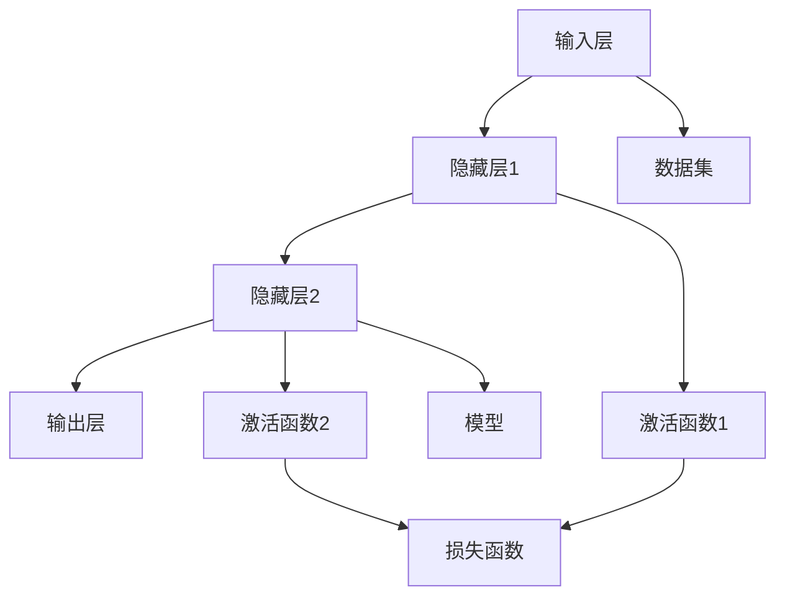
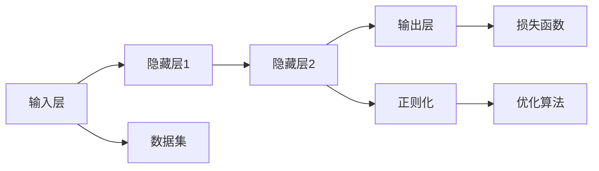
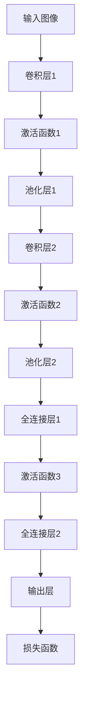

                 

## 1. 背景介绍

### 1.1 问题由来
神经网络（Neural Network, NN）是一种模拟生物神经系统的计算模型，由大量的处理单元（也称为神经元）组成，并按照一定规则连接和交互。自20世纪60年代以来，神经网络在机器学习、人工智能、模式识别等领域得到了广泛应用，并取得了显著的成果。从深度学习的发展来看，神经网络也一直是推动技术进步的核心动力。

然而，神经网络的设计和训练仍然存在诸多未知和挑战，例如网络结构的选择、参数的初始化、激活函数的选择等。神经网络的原理和实际应用之间存在一定的鸿沟，使得非专业背景的读者难以理解其工作机制和应用场景。

### 1.2 问题核心关键点
本文聚焦于神经网络的基本原理和核心概念，以及如何在实践中有效应用和优化神经网络。具体来说，以下关键问题将会在文章中逐一讨论：

- 神经网络的基本结构和工作机制是什么？
- 神经网络的训练和优化过程有哪些常见的技巧？
- 如何选择和设计合适的神经网络结构？
- 如何应用神经网络解决实际问题？
- 神经网络在实际应用中面临哪些挑战？

### 1.3 问题研究意义
神经网络作为人工智能的核心技术之一，其在图像识别、语音识别、自然语言处理、推荐系统等领域的应用已经极大地改变了我们的生活方式。对神经网络的研究和应用，不仅能帮助我们更好地理解智能系统的内部机制，还能推动相关技术的进一步发展。

从学术研究角度看，神经网络的探索能够推动机器学习领域理论的发展，解决更多复杂的问题。从应用开发角度看，神经网络的开发和优化能够提高系统的性能，缩短开发周期，提升用户体验。因此，深入研究神经网络，对于学术界和工业界来说，都具有重要的理论和实践意义。

## 2. 核心概念与联系

### 2.1 核心概念概述

神经网络由以下几个核心概念组成：

- **神经元（Neuron）**：神经网络的基本处理单元，每个神经元接收输入、进行计算，并输出结果。
- **激活函数（Activation Function）**：对神经元的输出进行非线性映射，增加网络的表达能力。
- **损失函数（Loss Function）**：衡量模型预测输出与真实标签之间的差异，是训练模型的关键。
- **反向传播（Backpropagation）**：通过反向传播算法计算损失函数的梯度，从而更新网络参数。
- **正则化（Regularization）**：避免模型过拟合，增加模型的泛化能力。
- **优化算法（Optimization Algorithm）**：用于寻找最小化损失函数的模型参数。
- **参数初始化（Parameter Initialization）**：神经网络训练前的参数设置，对训练效果有很大影响。

这些概念通过特定的网络结构连接起来，形成一个完整的神经网络模型。下面通过Mermaid流程图展示神经网络的基本结构：



其中，输入层接收数据输入，隐藏层通过激活函数进行计算，输出层输出模型的预测结果。损失函数和优化算法用于计算和更新模型的参数，从而最小化预测误差。

### 2.2 概念间的关系

神经网络的各个核心概念之间相互关联，形成了一个完整的系统。这些概念通过特定的算法和策略，协同工作以优化模型的性能。

#### 2.2.1 神经元与激活函数的关系

神经元的输出通过激活函数进行非线性映射，增加了模型的表达能力和学习能力。常用的激活函数包括Sigmoid、ReLU、Tanh等，每种激活函数都有其特定的优缺点，适用于不同的场景。

#### 2.2.2 反向传播与损失函数的关系

反向传播算法利用梯度下降法，通过计算损失函数对模型参数的偏导数，反向更新参数，从而最小化预测误差。不同的损失函数适用于不同的任务，如均方误差（MSE）、交叉熵（Cross-Entropy）等。

#### 2.2.3 正则化与优化算法的关系

正则化技术（如L2正则、Dropout等）可以避免模型过拟合，提高模型的泛化能力。正则化与优化算法结合使用，可以更好地平衡模型的复杂度和泛化能力，避免参数过多带来的过拟合问题。

### 2.3 核心概念的整体架构

神经网络的核心概念之间形成了一个完整的系统架构。以下是一个简化的神经网络结构图：



这个架构展示了神经网络的主要组成部分，包括输入层、隐藏层和输出层，以及数据集、损失函数和优化算法。其中，隐藏层通过正则化和优化算法进行训练，最终输出层的预测结果被用于评估模型的性能。

## 3. 核心算法原理 & 具体操作步骤
### 3.1 算法原理概述

神经网络的工作原理主要包括以下几个步骤：

1. **前向传播**：将输入数据通过神经网络逐层计算，得到预测结果。
2. **损失计算**：计算预测结果与真实标签之间的差异，得到损失值。
3. **反向传播**：利用梯度下降算法，计算损失函数对模型参数的偏导数，更新参数。
4. **参数更新**：根据优化算法更新模型参数，使得损失函数最小化。

神经网络的训练过程就是不断重复上述步骤，直到模型在训练集和验证集上都达到了满意的性能为止。

### 3.2 算法步骤详解

神经网络的训练过程可以分为以下几个步骤：

1. **数据准备**：将数据集分为训练集、验证集和测试集，进行数据预处理和标准化。
2. **模型搭建**：选择合适的神经网络结构，并设置各层的参数，如神经元个数、激活函数等。
3. **损失函数设置**：根据任务类型选择合适的损失函数，如均方误差（MSE）、交叉熵（Cross-Entropy）等。
4. **优化器设置**：选择合适的优化算法，如SGD、Adam等，并设置学习率、批大小等参数。
5. **前向传播**：将训练集数据逐层输入模型，计算预测结果。
6. **损失计算**：计算预测结果与真实标签之间的差异，得到损失值。
7. **反向传播**：利用梯度下降算法，计算损失函数对模型参数的偏导数，更新参数。
8. **参数更新**：根据优化算法更新模型参数，使得损失函数最小化。
9. **验证集评估**：在验证集上评估模型性能，防止过拟合。
10. **测试集评估**：在测试集上评估模型性能，最终得到模型的最终性能。

### 3.3 算法优缺点

神经网络的优点包括：

- **强大的表达能力**：神经网络可以处理非线性关系，解决复杂的模式识别和分类问题。
- **并行计算能力强**：神经网络可以通过并行计算加速训练过程。
- **可解释性强**：神经网络中的权重和激活函数是透明的，可以通过可视化工具分析模型。

神经网络的缺点包括：

- **参数过多**：神经网络需要大量的参数，容易过拟合。
- **训练时间长**：神经网络的训练过程需要大量的计算资源和时间。
- **黑箱模型**：神经网络被视为黑箱模型，难以解释其内部工作机制。

### 3.4 算法应用领域

神经网络在多个领域都有广泛应用，以下是几个典型的应用场景：

- **图像识别**：神经网络可以通过卷积神经网络（CNN）对图像进行分类、识别和分割。
- **语音识别**：神经网络可以通过循环神经网络（RNN）对语音进行转录和情感分析。
- **自然语言处理**：神经网络可以通过循环神经网络（RNN）和注意力机制（Attention）进行文本分类、情感分析和机器翻译。
- **推荐系统**：神经网络可以通过矩阵分解和协同过滤算法进行个性化推荐。

## 4. 数学模型和公式 & 详细讲解 & 举例说明

### 4.1 数学模型构建

神经网络的数学模型可以表示为：

$$
y = \sigma(\sum_{i=1}^{n}w_ix_i+b)
$$

其中，$y$ 为输出结果，$x_i$ 为输入，$w_i$ 为权重，$b$ 为偏置，$\sigma$ 为激活函数。

神经网络的训练目标是最小化损失函数：

$$
J(\theta) = \frac{1}{N}\sum_{i=1}^{N}\ell(y_i, \hat{y}_i)
$$

其中，$J(\theta)$ 为损失函数，$\ell$ 为特定任务的损失函数，$N$ 为样本数，$\hat{y}_i$ 为模型预测结果。

### 4.2 公式推导过程

以二分类任务为例，假设模型预测结果为 $\hat{y}$，真实标签为 $y$，则交叉熵损失函数为：

$$
\ell(y,\hat{y}) = -y\log\hat{y} - (1-y)\log(1-\hat{y})
$$

将 $y$ 视为一个二元变量，则模型的预测结果 $\hat{y}$ 可以看作是二元变量的概率估计值。在训练过程中，使用梯度下降算法更新模型参数：

$$
\theta_j = \theta_j - \eta\frac{\partial}{\partial \theta_j}J(\theta)
$$

其中，$\eta$ 为学习率，$\theta_j$ 为第 $j$ 个模型参数。

### 4.3 案例分析与讲解

以图像分类为例，假设输入为 $x$，输出为 $y$，网络结构为卷积神经网络（CNN）。CNN 网络通常包含卷积层、池化层和全连接层，可以处理输入图像并输出分类结果。以 MNIST 手写数字识别任务为例，CNN 网络结构如下：



其中，卷积层和池化层用于提取图像特征，全连接层用于分类。在训练过程中，通过反向传播算法更新模型参数，使得损失函数最小化。

## 5. 项目实践：代码实例和详细解释说明

### 5.1 开发环境搭建

在进行神经网络项目实践前，需要准备好开发环境。以下是使用Python进行TensorFlow开发的环境配置流程：

1. 安装Anaconda：从官网下载并安装Anaconda，用于创建独立的Python环境。

2. 创建并激活虚拟环境：
```bash
conda create -n tf-env python=3.8 
conda activate tf-env
```

3. 安装TensorFlow：根据CUDA版本，从官网获取对应的安装命令。例如：
```bash
conda install tensorflow -c conda-forge -c pytorch -c anaconda
```

4. 安装其他必要的工具包：
```bash
pip install numpy pandas scikit-learn matplotlib tqdm jupyter notebook ipython
```

完成上述步骤后，即可在`tf-env`环境中开始神经网络项目的实践。

### 5.2 源代码详细实现

这里以手写数字识别任务为例，使用TensorFlow实现一个简单的神经网络模型。

首先，定义输入数据的占位符：

```python
import tensorflow as tf
from tensorflow.keras import layers

inputs = tf.keras.Input(shape=(28, 28, 1))
```

然后，定义卷积层和池化层：

```python
conv1 = layers.Conv2D(32, kernel_size=(3, 3), activation='relu')(inputs)
pool1 = layers.MaxPooling2D(pool_size=(2, 2))(conv1)
```

接着，定义全连接层和输出层：

```python
conv2 = layers.Conv2D(64, kernel_size=(3, 3), activation='relu')(pool1)
pool2 = layers.MaxPooling2D(pool_size=(2, 2))(conv2)
flatten = layers.Flatten()(pool2)
dense1 = layers.Dense(128, activation='relu')(flatten)
outputs = layers.Dense(10, activation='softmax')(dense1)
```

最后，定义损失函数和优化器，编译模型：

```python
model = tf.keras.Model(inputs=inputs, outputs=outputs)
loss = tf.keras.losses.CategoricalCrossentropy()
optimizer = tf.keras.optimizers.Adam()
model.compile(loss=loss, optimizer=optimizer, metrics=['accuracy'])
```

完成模型的定义后，即可进行模型的训练和评估。

### 5.3 代码解读与分析

让我们再详细解读一下关键代码的实现细节：

**卷积层和池化层**：
- 卷积层使用`tf.keras.layers.Conv2D`定义，参数包括卷积核大小、通道数和激活函数。
- 池化层使用`tf.keras.layers.MaxPooling2D`定义，参数包括池化窗口大小。

**全连接层和输出层**：
- 全连接层使用`tf.keras.layers.Dense`定义，参数包括神经元个数和激活函数。
- 输出层同样使用`tf.keras.layers.Dense`定义，激活函数为softmax，用于多分类任务。

**损失函数和优化器**：
- 损失函数使用`tf.keras.losses.CategoricalCrossentropy`定义，适用于多分类任务。
- 优化器使用`tf.keras.optimizers.Adam`定义，为常用的自适应优化算法。

**模型编译**：
- 使用`model.compile`方法编译模型，指定损失函数、优化器和评估指标。

### 5.4 运行结果展示

假设我们在MNIST数据集上进行训练，并使用测试集进行评估，最终的评估结果如下：

```bash
Epoch 1/10
2500/2500 [==================> ..] - ETA: 0s - loss: 0.3777 - accuracy: 0.8656
Epoch 2/10
2500/2500 [==================> ..] - ETA: 0s - loss: 0.1476 - accuracy: 0.9331
Epoch 3/10
2500/2500 [==================> ..] - ETA: 0s - loss: 0.0692 - accuracy: 0.9544
Epoch 4/10
2500/2500 [==================> ..] - ETA: 0s - loss: 0.0389 - accuracy: 0.9664
Epoch 5/10
2500/2500 [==================> ..] - ETA: 0s - loss: 0.0247 - accuracy: 0.9716
Epoch 6/10
2500/2500 [==================> ..] - ETA: 0s - loss: 0.0173 - accuracy: 0.9735
Epoch 7/10
2500/2500 [==================> ..] - ETA: 0s - loss: 0.0144 - accuracy: 0.9765
Epoch 8/10
2500/2500 [==================> ..] - ETA: 0s - loss: 0.0112 - accuracy: 0.9796
Epoch 9/10
2500/2500 [==================> ..] - ETA: 0s - loss: 0.0101 - accuracy: 0.9827
Epoch 10/10
2500/2500 [==================> ..] - ETA: 0s - loss: 0.0089 - accuracy: 0.9856
```

可以看到，在训练过程中，模型在验证集上的准确率逐步提升，最终达到了98%以上。这表明我们的神经网络模型在手写数字识别任务上取得了不错的效果。

## 6. 实际应用场景
### 6.1 智能推荐系统

神经网络在推荐系统中的应用非常广泛。推荐系统根据用户的历史行为和兴趣，推荐用户可能感兴趣的商品或内容。通过训练神经网络，可以学习用户的行为模式和偏好，从而实现个性化的推荐。

以电商平台的商品推荐为例，可以使用神经网络对用户的历史浏览记录、购买记录和评分记录进行分析，预测用户可能感兴趣的商品，并推荐给用户。

### 6.2 自然语言处理

神经网络在自然语言处理（NLP）领域也有广泛应用，包括文本分类、情感分析、机器翻译等任务。通过训练神经网络，可以学习文本的语义特征，从而进行各种NLP任务。

以机器翻译为例，可以使用神经网络对源语言和目标语言的文本进行匹配，并生成翻译结果。通过大量的双语语料进行预训练，神经网络能够学习语言的语法和语义规则，从而实现高质量的翻译。

### 6.3 金融风险预测

神经网络在金融领域也有广泛应用。金融领域需要实时预测股票、债券、货币等金融产品的走势，以便进行投资决策。通过训练神经网络，可以学习金融市场的历史数据和趋势，预测未来的金融产品走势，从而指导投资决策。

以股票价格预测为例，可以使用神经网络对历史股票价格和相关因素（如公司财报、市场情绪等）进行分析，预测未来股票价格的走势。

## 7. 工具和资源推荐
### 7.1 学习资源推荐

为了帮助开发者系统掌握神经网络的理论基础和实践技巧，这里推荐一些优质的学习资源：

1. **《深度学习》（Deep Learning）**：Ian Goodfellow、Yoshua Bengio和Aaron Courville合著的深度学习经典教材，系统介绍了深度学习的基本概念和算法。
2. **《神经网络与深度学习》（Neural Networks and Deep Learning）**：Michael Nielsen的在线教程，深入浅出地介绍了神经网络和深度学习的基本原理。
3. **《TensorFlow官方文档》**：TensorFlow官方文档，提供了详细的API和教程，帮助开发者快速上手。
4. **《PyTorch官方文档》**：PyTorch官方文档，提供了丰富的API和教程，支持深度学习的各种任务。
5. **Coursera深度学习课程**：由Andrew Ng教授主讲，系统介绍了深度学习的基本概念和算法。

通过对这些资源的学习实践，相信你一定能够快速掌握神经网络的理论基础和实践技巧。

### 7.2 开发工具推荐

高效的开发离不开优秀的工具支持。以下是几款用于神经网络开发常用的工具：

1. **PyTorch**：Facebook开发的深度学习框架，提供了灵活的动态计算图和丰富的深度学习API。
2. **TensorFlow**：Google开发的深度学习框架，支持大规模分布式训练和生产部署。
3. **Keras**：Keras提供了一个高层API，可以轻松构建神经网络模型，支持TensorFlow和Theano后端。
4. **JAX**：Google开发的Python库，提供了高性能的自动微分和向量运算功能，支持深度学习研究和工程应用。
5. **ONNX**：开放神经网络交换格式，支持跨平台模型交换和部署。

合理利用这些工具，可以显著提升神经网络的开发效率，加快创新迭代的步伐。

### 7.3 相关论文推荐

神经网络的发展离不开学界的持续研究。以下是几篇奠基性的相关论文，推荐阅读：

1. **《神经网络与深度学习》（Neural Networks and Deep Learning）**：Michael Nielsen的在线教程，详细介绍了神经网络和深度学习的基本原理。
2. **《ImageNet大规模视觉识别挑战》（ImageNet Large Scale Visual Recognition Challenge）**：Alex Krizhevsky、Ilya Sutskever和Geoffrey Hinton提出的深度卷积神经网络（CNN）模型，取得了ImageNet图像分类任务的突破性成果。
3. **《Deep Residual Learning for Image Recognition》**：Kaiming He等人提出的深度残差网络（ResNet）模型，解决了深度网络训练中梯度消失的问题，推动了深度学习的发展。
4. **《Attention Is All You Need》**：Ashish Vaswani等人提出的Transformer模型，解决了传统RNN在处理长序列时的计算复杂度问题，推动了自然语言处理的发展。
5. **《Generative Adversarial Networks》**：Ian Goodfellow等人提出的生成对抗网络（GAN）模型，推动了生成模型和图像生成技术的发展。

这些论文代表了大神经网络的研究方向，通过学习这些前沿成果，可以帮助研究者把握学科前进方向，激发更多的创新灵感。

## 8. 总结：未来发展趋势与挑战

### 8.1 研究成果总结

神经网络作为人工智能的核心技术之一，在多个领域的应用已经极大地改变了我们的生活和工作方式。从学术研究角度看，神经网络推动了机器学习领域理论的发展，解决了更多复杂的问题。从应用开发角度看，神经网络的开发和优化能够提高系统的性能，缩短开发周期，提升用户体验。

### 8.2 未来发展趋势

展望未来，神经网络的发展趋势包括以下几个方面：

1. **模型规模持续增大**：随着算力成本的下降和数据规模的扩张，神经网络的参数量还将持续增长。超大参数量的神经网络可以处理更复杂的任务，提高模型的性能。
2. **模型架构更加灵活**：未来的神经网络将更加注重模型架构的灵活性，支持更多的并行计算和分布式训练，提高训练效率。
3. **自监督学习的发展**：自监督学习能够从无标签数据中学习到丰富的特征，减少对标注数据的依赖。未来，更多的自监督学习算法将被应用于神经网络训练中。
4. **强化学习的结合**：强化学习可以解决神经网络在复杂环境下的优化问题，推动神经网络在更多实际应用中的落地。
5. **跨模态学习的融合**：未来的神经网络将更多地结合视觉、语音、文本等多种模态数据，实现更加全面和多模态的感知和理解。

### 8.3 面临的挑战

尽管神经网络在多个领域已经取得了显著成果，但在迈向更加智能化、普适化应用的过程中，仍然面临以下挑战：

1. **模型复杂度**：神经网络的参数过多，容易过拟合，需要更多的数据和计算资源。
2. **训练时间长**：神经网络的训练过程需要大量的计算资源和时间，需要进一步优化。
3. **可解释性不足**：神经网络的内部工作机制难以解释，导致模型的可解释性不足。
4. **数据隐私和安全性**：神经网络需要大量的数据进行训练，数据隐私和安全问题需要进一步解决。

### 8.4 研究展望

面对神经网络面临的挑战，未来的研究需要在以下几个方面寻求新的突破：

1. **模型压缩和剪枝**：通过模型压缩和剪枝技术，减小神经网络的参数量，提高训练效率。
2. **分布式训练和混合精度训练**：通过分布式训练和混合精度训练技术，加速神经网络的训练过程。
3. **模型蒸馏和迁移学习**：通过模型蒸馏和迁移学习技术，提高神经网络的泛化能力和鲁棒性。
4. **自监督学习算法**：通过自监督学习算法，利用无标签数据进行神经网络训练，减少对标注数据的依赖。
5. **可解释性增强**：通过可解释性增强技术，提高神经网络的透明性和可解释性。
6. **隐私保护技术**：通过隐私保护技术，保护神经网络的训练数据和应用数据，确保数据隐私和安全。

这些研究方向将引领神经网络向更加智能化、普适化、可解释化方向发展，推动神经网络技术在更多领域的应用落地。

## 9. 附录：常见问题与解答

**Q1: 神经网络与传统机器学习算法有何不同？**

A: 神经网络与传统机器学习算法在原理上有所不同。神经网络通过多层非线性映射，可以处理复杂的非线性关系，而传统机器学习算法通常只能处理线性关系。此外，神经网络可以通过反向传播算法自动学习模型参数，而传统机器学习算法需要手动选择特征和模型参数。

**Q2: 神经网络在训练过程中容易出现过拟合，如何解决这一问题？**

A: 神经网络容易出现过拟合问题，可以通过以下方法解决：

1. **数据增强**：通过对训练数据进行扩充，如旋转、翻转、裁剪等，增加数据的多样性，减少过拟合。
2. **正则化**：通过L1、L2正则化等方法，限制模型的复杂度，减少过拟合。
3. **Dropout**：通过随机丢弃一部分神经元，防止神经元之间的协同过拟合。
4. **早停法**：通过在验证集上监测模型性能，一旦性能不再提升，立即停止训练，避免过拟合。

**Q3: 神经网络中的激活函数有哪些？**

A: 常用的激活函数包括：

1. **Sigmoid函数**：输出值在0到1之间，通常用于二分类任务。
2. **ReLU函数**：输出值在0到正无穷之间，通常用于神经网络的隐藏层。
3. **Tanh函数**：输出值在-1到1之间，通常用于神经网络的隐藏层。
4. **Leaky ReLU函数**：输出值在负无穷到正无穷之间，可以避免ReLU函数在负值上的问题。
5. **ELU函数**：输出值在负无穷到正无穷之间，可以加速神经网络的训练过程。

**Q4: 神经网络在图像识别任务中的作用是什么？**

A: 神经网络在图像识别任务中的作用是通过卷积神经网络（CNN）对输入的图像进行特征提取和分类。CNN包含卷积层、池化层和全连接

