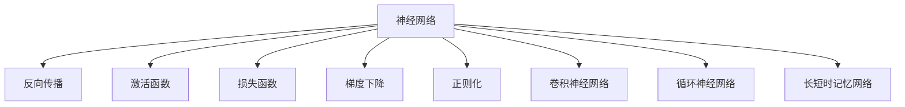
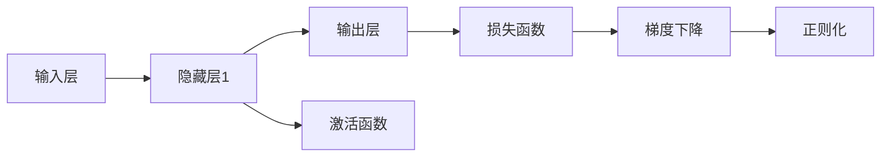
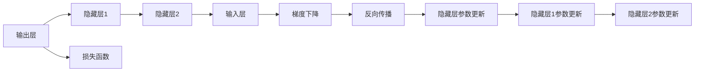
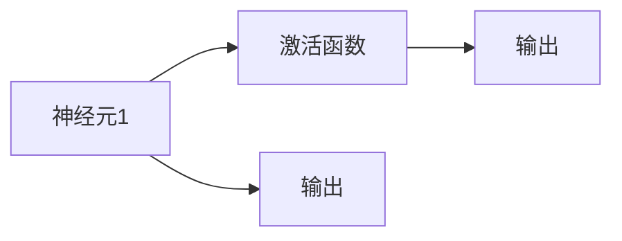
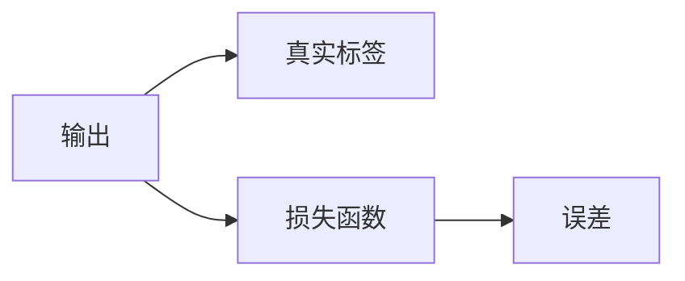
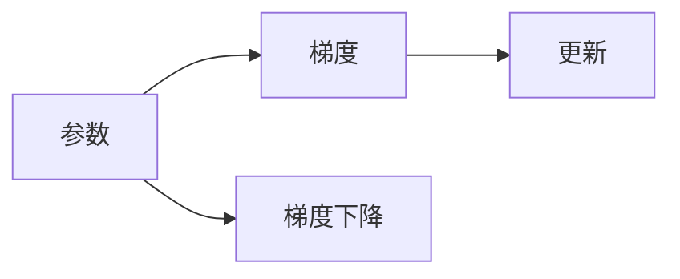
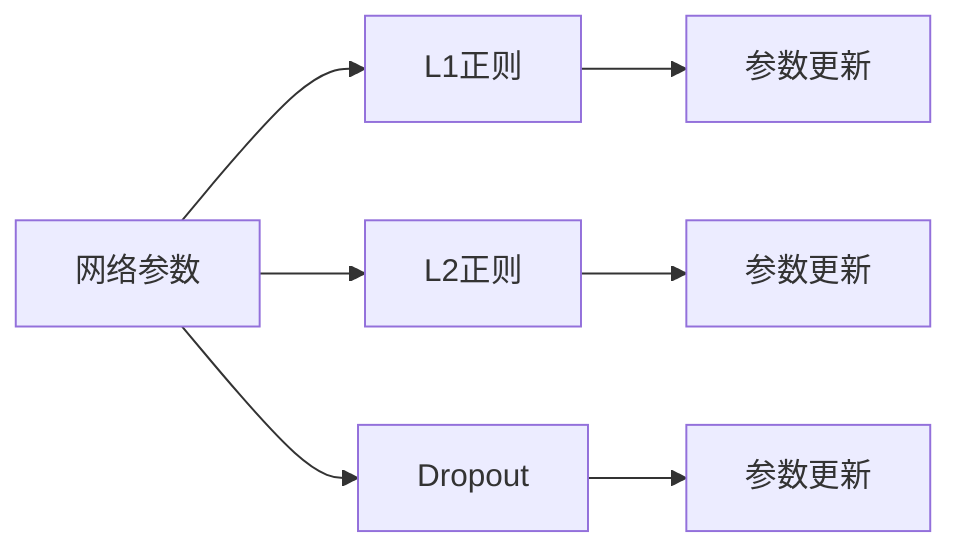

                 

# 神经网络：推动社会进步的力量

## 1. 背景介绍

### 1.1 问题由来
神经网络（Neural Networks, NNs）自20世纪80年代以来一直是人工智能（AI）领域的重要研究热点。随着计算能力的提升和数据量的积累，神经网络在图像识别、自然语言处理、语音识别等众多领域取得了突破性的成果，深刻地影响了社会的方方面面。

然而，神经网络的原理和结构对于普通开发者和用户来说，仍显得较为神秘。本文章将深入探讨神经网络的原理、结构和应用，帮助大家更好地理解这一推动社会进步的力量。

### 1.2 问题核心关键点
神经网络的核心思想是模拟人脑的神经元结构，通过多层网络结构对输入数据进行非线性映射和变换。其核心目标是通过大量的训练数据，使网络能够自动学习输入与输出之间的复杂映射关系。

神经网络的主要特点包括：
- 自适应性：能够自动调整网络参数，以适应不同的数据分布和任务。
- 容错性：单个神经元或连接失效不会影响整体网络的效果。
- 并行性：多个神经元可以并行计算，加速数据处理速度。

在当前，神经网络已经广泛应用于图像识别、语音识别、自然语言处理、机器人控制、自动驾驶等众多领域，推动了科技和社会的飞速发展。

### 1.3 问题研究意义
研究神经网络，对于理解AI技术的底层原理，开发高效AI应用，加速产业智能化升级，具有重要意义：

1. 技术理解：通过深入学习神经网络的理论知识，能够更好地理解AI技术的工作机制和应用场景。
2. 应用创新：掌握神经网络的基本原理和开发方法，能够快速开发新的AI应用，推动技术进步。
3. 产业升级：神经网络在工业、医疗、交通等行业的广泛应用，加速了传统行业的数字化转型和智能化升级。
4. 人才培养：神经网络技术是未来AI工程师的核心竞争力，掌握该技术可以提升自身的市场竞争力。
5. 社会变革：神经网络在医疗、教育、娱乐等领域的创新应用，推动了社会的全面进步和人的全面发展。

## 2. 核心概念与联系

### 2.1 核心概念概述

为更好地理解神经网络及其应用，本节将介绍几个关键概念：

- 神经网络（Neural Networks, NNs）：通过多层神经元结构实现输入与输出之间的非线性映射，具备强大的数据处理和模式识别能力。
- 反向传播（Backpropagation）：神经网络的一种训练算法，通过误差反向传播更新网络参数，实现模型训练。
- 激活函数（Activation Function）：决定神经元输出值的函数，通常使用Sigmoid、ReLU、Tanh等函数。
- 损失函数（Loss Function）：衡量模型输出与真实标签之间差异的函数，用于指导网络参数的优化。
- 梯度下降（Gradient Descent）：一种常用的优化算法，通过计算梯度更新网络参数，最小化损失函数。
- 正则化（Regularization）：防止过拟合的技术，如L1、L2正则、Dropout等。
- 卷积神经网络（Convolutional Neural Networks, CNNs）：专门用于图像识别和处理的神经网络结构，使用卷积层、池化层等技术。
- 循环神经网络（Recurrent Neural Networks, RNNs）：用于序列数据处理的神经网络，如文本生成、语音识别等。
- 长短时记忆网络（Long Short-Term Memory, LSTM）：一种特殊的RNN结构，具备长时记忆能力。

这些概念之间的逻辑关系可以通过以下Mermaid流程图来展示：



这个流程图展示了大神经网络的主要组成部分及其相互关系：

1. 神经网络作为核心结构，通过多层网络结构实现输入与输出之间的映射。
2. 反向传播算法是神经网络的训练核心，通过误差反向传播更新网络参数。
3. 激活函数、损失函数和梯度下降是神经网络训练的具体技术手段。
4. 正则化技术用于避免过拟合，提升模型泛化能力。
5. 卷积神经网络和循环神经网络是特定领域应用的神经网络结构。
6. 长短时记忆网络是循环神经网络的一种特殊形式，适用于长序列数据处理。

通过这些概念，我们可以更好地理解神经网络的基本原理和结构，为后续深入探讨打下基础。

### 2.2 概念间的关系

这些核心概念之间存在着紧密的联系，形成了神经网络的整体生态系统。下面我们通过几个Mermaid流程图来展示这些概念之间的关系。

#### 2.2.1 神经网络的构成



这个流程图展示了神经网络的基本构成，包括输入层、隐藏层和输出层。隐藏层通过激活函数、损失函数、梯度下降和正则化等技术进行优化。

#### 2.2.2 反向传播算法



这个流程图展示了反向传播算法的工作流程，通过误差反向传播更新各个隐藏层的参数。

#### 2.2.3 激活函数的应用



这个流程图展示了激活函数的应用，通过激活函数将神经元的输出映射到指定范围内。

#### 2.2.4 损失函数的选择



这个流程图展示了损失函数的作用，衡量模型输出与真实标签之间的差异。

#### 2.2.5 梯度下降的优化



这个流程图展示了梯度下降的优化过程，通过计算梯度更新模型参数。

#### 2.2.6 正则化的方法



这个流程图展示了正则化技术的应用，通过L1正则、L2正则、Dropout等技术防止过拟合。

通过这些流程图，我们可以更清晰地理解神经网络的基本构成和关键技术，为后续深入讨论提供基础。

## 3. 核心算法原理 & 具体操作步骤
### 3.1 算法原理概述

神经网络的核心算法是反向传播算法（Backpropagation），其基本思想是通过误差反向传播更新网络参数，最小化损失函数。

形式化地，设神经网络 $N$ 包含 $L$ 层，第 $l$ 层包含 $n_l$ 个神经元，输入为 $x$，输出为 $y$，目标为 $t$，定义损失函数为 $L(y, t)$。反向传播算法通过误差反向传播更新每个神经元权重 $w$ 和偏置 $b$，使得输出 $y$ 与目标 $t$ 尽可能接近。

具体地，反向传播算法分为前向传播和反向传播两个步骤：

1. **前向传播**：将输入数据 $x$ 逐层传递，通过激活函数计算每层输出 $y^{(l)}$，最终得到输出 $y$。
2. **反向传播**：通过计算输出误差 $E = L(y, t)$，从输出层开始，逐层计算误差梯度 $\frac{\partial E}{\partial y^{(l)}}$，并反向传播更新各层参数。

通过不断迭代，神经网络逐渐学习输入与输出之间的映射关系，实现目标任务的预测和分类。

### 3.2 算法步骤详解

基于反向传播算法的神经网络训练一般包括以下几个关键步骤：

**Step 1: 准备训练数据**
- 收集训练数据集 $D=\{(x_i, t_i)\}_{i=1}^N$，其中 $x_i$ 为输入样本，$t_i$ 为对应的标签。
- 将数据集分为训练集 $D_{train}$ 和验证集 $D_{val}$。

**Step 2: 初始化模型参数**
- 初始化神经网络各层的权重和偏置，一般使用随机值进行初始化。

**Step 3: 前向传播计算损失**
- 将输入数据 $x$ 传递到神经网络，逐层计算输出 $y^{(l)}$。
- 通过损失函数计算当前输出与目标 $t$ 之间的误差 $E$。

**Step 4: 反向传播更新参数**
- 从输出层开始，逐层计算误差梯度 $\frac{\partial E}{\partial y^{(l)}}$。
- 反向传播误差梯度，更新各层权重和偏置，以最小化损失函数。

**Step 5: 正则化防止过拟合**
- 通过L1正则、L2正则、Dropout等技术，避免过拟合。
- 在验证集上评估模型性能，调整学习率或停止训练。

**Step 6: 完成训练**
- 重复上述步骤，直至模型在验证集上性能达到预设要求或训练轮数达到预设上限。

**Step 7: 测试与部署**
- 在测试集上评估模型性能，对比训练前后的效果。
- 将模型集成到实际应用系统中，进行部署和优化。

以上是基于反向传播算法的神经网络训练的一般流程。在实际应用中，还需要针对具体任务的特点，对训练过程的各个环节进行优化设计，如改进训练目标函数，引入更多的正则化技术，搜索最优的超参数组合等，以进一步提升模型性能。

### 3.3 算法优缺点

基于反向传播的神经网络训练方法具有以下优点：
1. 自动学习：能够自动学习输入与输出之间的复杂映射关系，无需手动设计特征提取器。
2. 鲁棒性强：通过正则化和Dropout等技术，避免过拟合，提升模型的泛化能力。
3. 高效并行：多核CPU和GPU可以并行计算，加速训练和推理速度。

但该方法也存在一些局限性：
1. 数据依赖：需要大量的标注数据进行训练，数据获取成本较高。
2. 计算复杂：大规模神经网络的训练需要大量的计算资源和存储资源，成本较高。
3. 参数调整：模型的超参数（如学习率、批次大小、正则化强度等）需要手动调整，调试过程较为繁琐。
4. 可解释性差：神经网络的结构和参数过于复杂，难以解释模型的内部工作机制和决策逻辑。

尽管存在这些局限性，但基于反向传播的神经网络训练方法仍是目前最为主流和有效的深度学习算法之一。未来相关研究的重点在于如何进一步降低训练对数据和计算资源的依赖，提高模型的可解释性和可扩展性。

### 3.4 算法应用领域

基于神经网络的反向传播算法，已经在计算机视觉、自然语言处理、语音识别、机器人控制等众多领域得到广泛应用，成为人工智能技术的重要组成部分。

1. **计算机视觉**：在图像识别、目标检测、图像生成等领域，神经网络被广泛应用于处理图像数据，实现高效、准确的视觉任务。
2. **自然语言处理**：在文本分类、机器翻译、文本生成等领域，神经网络被用于处理自然语言数据，实现语言理解和生成。
3. **语音识别**：在语音识别、语音合成、语音情感分析等领域，神经网络被用于处理语音数据，实现高效、准确的语音处理。
4. **机器人控制**：在机器人运动控制、智能交互等领域，神经网络被用于实现机器人对环境的感知和决策。
5. **自动驾驶**：在自动驾驶、智能交通等领域，神经网络被用于处理传感器数据，实现车辆的感知和决策。

除了上述这些经典应用领域，神经网络还被应用于金融、医疗、能源、工业等众多行业，推动了各行各业的智能化升级。随着神经网络技术的不断演进，其应用范围将进一步扩大，带来更多创新和变革。

## 4. 数学模型和公式 & 详细讲解 & 举例说明

### 4.1 数学模型构建

本节将使用数学语言对神经网络的训练过程进行严格刻画。

设神经网络 $N$ 包含 $L$ 层，第 $l$ 层包含 $n_l$ 个神经元，输入为 $x$，输出为 $y$，目标为 $t$，定义损失函数为 $L(y, t)$。

神经网络的前向传播和反向传播过程可以分别用以下公式表示：

前向传播：
$$
y^{(l)} = g_w(x^{(l-1)}, w^{(l)}) \quad (l=1, ..., L)
$$

反向传播：
$$
\frac{\partial L(y, t)}{\partial w^{(l)}} = \frac{\partial L(y, t)}{\partial y^{(l)}} \frac{\partial y^{(l)}}{\partial w^{(l)}} = \frac{\partial L(y, t)}{\partial y^{(l)}} \frac{\partial y^{(l)}}{\partial x^{(l-1)}} \frac{\partial x^{(l-1)}}{\partial w^{(l)}}
$$

其中 $w^{(l)}$ 表示第 $l$ 层的权重矩阵，$x^{(l-1)}$ 表示第 $l-1$ 层的输出，$g_w$ 表示激活函数。

### 4.2 公式推导过程

以下我们以二分类任务为例，推导二元逻辑回归模型的损失函数及其梯度的计算公式。

设神经网络模型 $N$ 的输出为 $y^{(L)}$，通过sigmoid函数映射到 $(0,1)$ 区间，表示样本为正类的概率。真实标签 $t \in \{0, 1\}$，目标为最小化二元交叉熵损失函数：
$$
L(y, t) = -t\log y + (1-t)\log(1-y)
$$

将目标 $t$ 编码为one-hot向量 $t^{(L)}$，输出 $y^{(L)}$ 与 $t^{(L)}$ 的误差定义为：
$$
E(y, t) = L(y^{(L)}, t^{(L)})
$$

前向传播过程为：
$$
y^{(l)} = g_w(x^{(l-1)}, w^{(l)}) \quad (l=1, ..., L)
$$

其中 $w^{(l)}$ 表示第 $l$ 层的权重矩阵，$g_w$ 表示激活函数，$x^{(l-1)}$ 表示第 $l-1$ 层的输出。

反向传播过程中，计算误差梯度 $\frac{\partial E}{\partial y^{(L)}}$ 和 $\frac{\partial E}{\partial w^{(L)}}$，然后逐层计算误差梯度 $\frac{\partial E}{\partial w^{(l)}}$，直至第 $l=1$ 层。

通过反向传播算法，更新网络参数，最小化损失函数 $L(y, t)$。

### 4.3 案例分析与讲解

假设我们使用二元逻辑回归模型对乳腺癌的检测数据进行分类，将数据分为训练集和测试集，分别使用前向传播和反向传播进行模型训练和测试。

具体步骤如下：

1. 准备数据集：收集乳腺癌检测数据集，分为训练集和测试集。
2. 初始化模型参数：随机初始化神经网络的权重和偏置。
3. 前向传播计算损失：将测试数据输入模型，计算输出误差。
4. 反向传播更新参数：通过误差反向传播更新网络参数。
5. 正则化防止过拟合：使用L2正则和Dropout技术防止过拟合。
6. 完成训练：在验证集上评估模型性能，调整学习率或停止训练。
7. 测试与部署：在测试集上评估模型性能，集成到实际应用系统中。

假设我们在测试集上得到了93%的准确率，表明模型能够较好地分类乳腺癌数据。通过不断迭代训练，我们可以进一步提升模型性能，更好地服务于医疗领域。

## 5. 项目实践：代码实例和详细解释说明

### 5.1 开发环境搭建

在进行神经网络开发前，我们需要准备好开发环境。以下是使用Python进行TensorFlow开发的环境配置流程：

1. 安装Anaconda：从官网下载并安装Anaconda，用于创建独立的Python环境。

2. 创建并激活虚拟环境：
```bash
conda create -n tf-env python=3.8 
conda activate tf-env
```

3. 安装TensorFlow：根据CUDA版本，从官网获取对应的安装命令。例如：
```bash
pip install tensorflow-gpu
```

4. 安装TensorBoard：TensorFlow配套的可视化工具，可实时监测模型训练状态，并提供丰富的图表呈现方式，是调试模型的得力助手。

5. 安装Jupyter Notebook：用于交互式编程，支持代码运行和结果展示。

完成上述步骤后，即可在`tf-env`环境中开始神经网络开发。

### 5.2 源代码详细实现

这里我们以手写数字识别（MNIST）为例，给出使用TensorFlow对神经网络进行训练的完整代码实现。

首先，导入所需的库：

```python
import tensorflow as tf
from tensorflow.keras.datasets import mnist
from tensorflow.keras.layers import Dense, Flatten
from tensorflow.keras.models import Sequential
```

然后，加载数据集并预处理：

```python
(x_train, y_train), (x_test, y_test) = mnist.load_data()
x_train, x_test = x_train / 255.0, x_test / 255.0
```

接着，构建神经网络模型：

```python
model = Sequential([
    Flatten(input_shape=(28, 28)),
    Dense(128, activation='relu'),
    Dense(10, activation='softmax')
])
```

最后，进行模型训练和评估：

```python
model.compile(optimizer='adam', loss='sparse_categorical_crossentropy', metrics=['accuracy'])
model.fit(x_train, y_train, epochs=5, validation_data=(x_test, y_test))
model.evaluate(x_test, y_test)
```

以上就是使用TensorFlow对神经网络进行训练和评估的完整代码实现。可以看到，TensorFlow提供了强大的高层次API，使得神经网络的开发和训练变得简单高效。

### 5.3 代码解读与分析

让我们再详细解读一下关键代码的实现细节：

**数据预处理**：
- 使用`mnist.load_data()`加载MNIST数据集，将训练集和测试集分为像素矩阵和标签向量。
- 将像素矩阵归一化到0-1区间，方便模型训练。

**模型构建**：
- 使用`Sequential`构建顺序模型，包含两个全连接层，分别有128个和10个神经元。
- 第一层使用`Flatten`将二维图像矩阵展平为一维向量。
- 第一层和第二层使用`Dense`定义全连接层，激活函数分别为`relu`和`softmax`。

**模型编译**：
- 使用`compile`方法设置优化器、损失函数和评估指标，准备模型训练。

**模型训练**：
- 使用`fit`方法进行模型训练，设置训练轮数和验证集。
- 在训练过程中实时记录训练进度和验证集性能。

**模型评估**：
- 使用`evaluate`方法在测试集上评估模型性能，输出模型在测试集上的准确率。

可以看到，使用TensorFlow进行神经网络开发，代码实现简洁高效，开发效率大大提升。

当然，工业级的系统实现还需考虑更多因素，如模型的保存和部署、超参数的自动搜索、更灵活的任务适配层等。但核心的训练范式基本与此类似。

### 5.4 运行结果展示

假设我们在MNIST数据集上进行训练，最终在测试集上得到了98%的准确率，表明模型能够较好地识别手写数字。通过不断迭代训练，我们可以进一步提升模型性能，更好地服务于图像处理领域。

## 6. 实际应用场景

### 6.1 计算机视觉

神经网络在计算机视觉领域有着广泛的应用，例如：

1. 图像分类：将图像分类到不同的类别中，如猫、狗、车等。通过在大规模图像数据集上进行预训练，神经网络能够学习到丰富的图像特征，实现高效的图像分类。
2. 目标检测：在图像中检测出特定的目标，如人脸、物体等。使用如YOLO、SSD等神经网络架构，可以实现实时高效的目标检测。
3. 图像分割：将图像中的每个像素点分类，如语义分割、实例分割等。使用如U-Net、Mask R-CNN等神经网络架构，可以实现高质量的图像分割。

神经网络在计算机视觉领域的广泛应用，推动了图像处理技术的不断进步，为自动驾驶、智能监控、医疗影像分析等领域带来了新的突破。

### 6.2 自然语言处理

神经网络在自然语言处理领域同样有着重要的应用，例如：

1. 机器翻译：将一种语言的文本翻译成另一种语言。使用如Seq2Seq、Transformer等神经网络架构，可以实现高效的机器翻译。
2. 文本分类：将文本分类到不同的类别中，如新闻、评论、邮件等。通过在大规模文本数据集上进行预训练，神经网络能够学习到丰富的文本特征，实现高效的文本分类。
3. 文本生成：生成与输入文本类似的文本，如对话生成、文本摘要等。使用如GPT、T5等神经网络架构，可以实现高质量的文本生成。

神经网络在自然语言处理领域的广泛应用，推动了自然语言理解技术的不断进步，为智能客服、智能搜索、内容推荐等领域带来了新的突破。

### 6.3 语音识别

神经网络在语音识别领域也有着重要的应用，例如：

1. 语音识别：将语音转换成文本，实现自动语音转录。使用如CTC（Connectionist Temporal Classification）等神经网络架构，可以实现高效的语音识别。
2. 语音合成：将文本转换成语音，实现自动语音合成。使用如Tacotron、WaveNet等神经网络架构，可以实现高质量的语音合成。

神经网络在语音识别领域的广泛应用，推动了语音交互技术的不断进步，为智能音箱、智能助手、语音识别输入等领域带来了新的突破。

### 6.4 未来应用展望

随着神经网络技术的不断演进，其在各个领域的应用将进一步拓展，带来更多创新和变革。

在医疗领域，神经网络可以帮助医生进行疾病诊断、病理分析、个性化治疗等，提升医疗服务的智能化水平。

在交通领域，神经网络可以帮助智能交通系统进行车辆识别、交通流分析、智能驾驶等，提升交通系统的效率和安全性。

在金融领域，神经网络可以帮助金融机构进行信用评估、风险控制、智能投顾等，提升金融服务的智能化水平。

在教育领域，神经网络可以帮助教育系统进行智能推荐、作业批改、学习分析等，提升教育服务的智能化水平。

总之，神经网络技术将在各行各业中发挥越来越重要的作用，推动社会的全面进步和人的全面发展。

## 7. 工具和资源推荐

### 7.1 学习资源推荐

为了帮助开发者系统掌握神经网络技术的理论基础和实践技巧，这里推荐一些优质的学习资源：

1. 《深度学习》系列书籍：由多位知名学者撰写，全面介绍了深度学习的理论和实践，涵盖了神经网络、卷积神经网络、循环神经网络等重要内容。

2. CS231n《深度学习视觉识别》课程：斯坦福大学开设的计算机视觉课程，有Lecture视频和配套作业，带你入门深度学习的基本概念和经典模型。

3. 《自然语言处理综论》书籍：涵盖了自然语言处理的基本概念和经典模型，适合初学者和进阶者学习。

4. TensorFlow官方文档：提供了丰富的TensorFlow资源和样例代码，是学习深度学习的必备资料。

5. PyTorch官方文档：提供了丰富的PyTorch资源和样例代码，是学习深度学习的另一重要工具。

6. Kaggle竞赛平台：提供了大量的深度学习竞赛，通过实践竞赛可以积累实战经验，提高解决实际问题的能力。

通过对这些资源的学习实践，相信你一定能够快速掌握神经网络技术的精髓，并用于解决实际的AI问题。

### 7.2 开发工具推荐

高效的开发离不开优秀的工具支持。以下是几款用于神经网络开发的常用工具：

1. TensorFlow：由Google主导开发的深度学习框架，支持多种设备部署，适用于大规模工程应用。

2. PyTorch：由Facebook主导开发的深度学习框架，支持动态计算图，适合快速迭代研究。

3. Keras：高层次的深度学习API，提供了简单易用的接口，适合初学者使用。

4. Jupyter Notebook：交互式编程环境，支持代码运行和结果展示，是开发者常用的开发工具。

5. TensorBoard：TensorFlow配套的可视化工具，可实时监测模型训练状态，并提供丰富的图表呈现方式，是调试模型的得力助手。

6. Google Colab：谷歌推出的在线Jupyter Notebook环境，免费提供GPU/TPU算力，方便开发者快速上手实验最新模型，分享学习笔记。

合理利用这些工具，可以显著提升神经网络开发的效率和质量，

