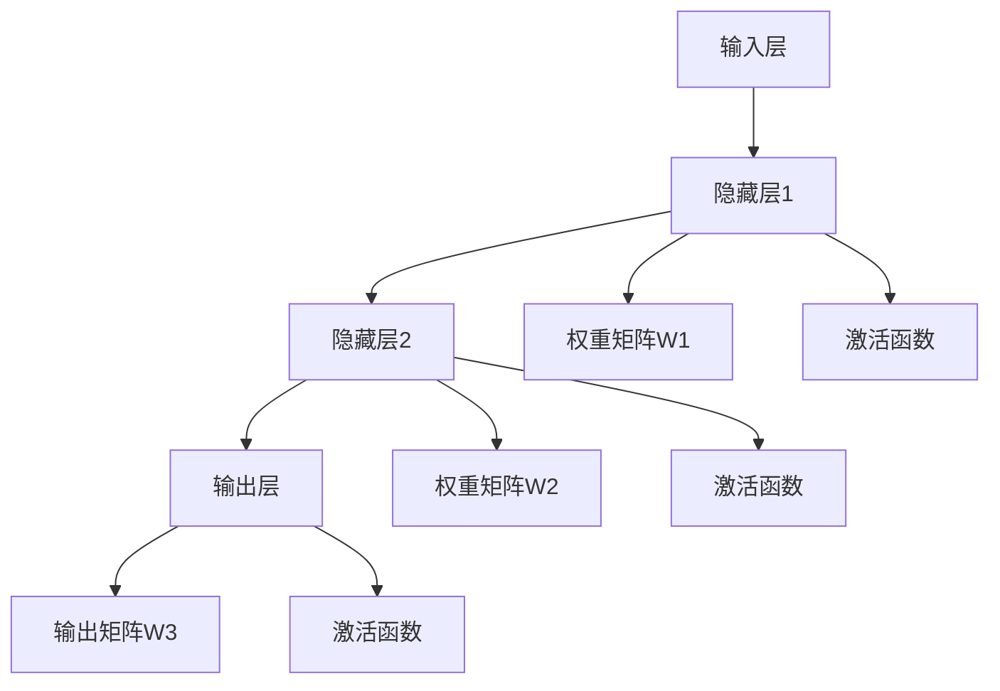

                 

## 1. 背景介绍

### 1.1 问题由来
随着人工智能技术的飞速发展，机器学习（Machine Learning, ML）成为了推动各行各业智能化转型升级的重要引擎。特别是在自然语言处理（Natural Language Processing, NLP）、计算机视觉（Computer Vision, CV）、语音识别等领域，机器学习模型正在从传统统计方法逐渐过渡到基于神经网络的深度学习方法。

神经网络（Neural Network, NN）作为一种深度学习方法，通过模拟人脑的神经元结构和信息处理机制，在数据驱动的训练中学习和抽象高层次特征，从而实现复杂的模式识别和预测任务。它不仅在学术研究中屡创佳绩，而且在工业界的应用也日趋广泛，如自动驾驶、智能客服、推荐系统等。

本文将从背景介绍出发，详细探讨神经网络的原理、核心概念、优化算法以及其在多个实际应用场景中的表现和未来趋势。

## 2. 核心概念与联系

### 2.1 核心概念概述

神经网络是深度学习的一种重要模型，其核心思想是通过多个层次的神经元逐层抽象特征，并最终输出目标结果。以下将简要介绍神经网络的几个核心概念：

- **神经元（Neuron）**：神经网络的基本单元，通常包含输入、权重、偏差和激活函数等部分。
- **激活函数（Activation Function）**：决定神经元输出的非线性函数，常见的激活函数包括sigmoid、ReLU、tanh等。
- **前向传播（Forward Propagation）**：从输入层到输出层的计算过程，通过不断应用激活函数和权重更新输入特征。
- **反向传播（Backward Propagation）**：根据输出误差反向计算梯度，更新权重和偏差。
- **损失函数（Loss Function）**：衡量模型预测结果与真实值之间差异的函数，如均方误差（MSE）、交叉熵（Cross-Entropy）等。

这些概念共同构成了神经网络的框架，是理解神经网络原理和应用的基础。

### 2.2 核心概念的联系

神经网络的各个组件通过数据流和信号流紧密连接，共同完成从输入到输出的计算过程。以下是神经网络的核心组件之间的联系：



该流程图展示了神经网络的基本架构。输入数据通过权重矩阵和激活函数层层传递，最终输出结果。权重矩阵是连接前后层的关键，决定了网络的学习能力和泛化能力。

## 3. 核心算法原理 & 具体操作步骤

### 3.1 算法原理概述

神经网络通过反向传播算法（Backpropagation）进行训练，其核心思想是利用梯度下降（Gradient Descent）方法最小化损失函数，以更新权重矩阵和偏差。神经网络的学习过程可以概括为以下步骤：

1. 前向传播：将输入数据输入网络，逐层计算输出值。
2. 计算损失：将网络输出与真实标签对比，计算损失值。
3. 反向传播：根据损失值计算梯度，反向更新权重和偏差。
4. 更新参数：利用梯度下降算法，更新模型参数。

通过不断迭代上述过程，神经网络能够逐步优化模型参数，提升预测准确率。

### 3.2 算法步骤详解

以下是神经网络训练的基本步骤：

**Step 1: 数据准备**
- 收集训练数据集 $D=\{(x_i, y_i)\}_{i=1}^N$，其中 $x_i$ 为输入样本，$y_i$ 为对应的真实标签。
- 将数据集分为训练集、验证集和测试集，以便在模型训练过程中进行验证和测试。

**Step 2: 模型定义**
- 选择合适的网络结构，如卷积神经网络（CNN）、循环神经网络（RNN）或变分自编码器（VAE）等。
- 初始化网络参数，如权重矩阵 $W$ 和偏差 $b$。

**Step 3: 前向传播**
- 将训练数据 $x_i$ 输入网络，通过逐层计算得到输出 $y_i$。
- 计算损失函数 $L(y_i, \hat{y}_i)$，其中 $\hat{y}_i$ 为网络预测结果。

**Step 4: 反向传播**
- 计算损失函数 $L(y_i, \hat{y}_i)$ 对网络参数的梯度，如 $\nabla_W L$ 和 $\nabla_b L$。
- 根据梯度更新权重和偏差，如 $W \leftarrow W - \eta \nabla_W L$ 和 $b \leftarrow b - \eta \nabla_b L$。

**Step 5: 参数更新**
- 利用优化算法如SGD（随机梯度下降）、Adam等更新网络参数。
- 循环执行Step 3至Step 5，直到达到预设的迭代次数或损失函数收敛。

### 3.3 算法优缺点

神经网络的优点包括：

- 强非线性能力：通过多层抽象和激活函数，可以捕捉数据中复杂的非线性关系。
- 强大的泛化能力：通过大量数据训练，可以提升模型的泛化能力，适用于各种复杂场景。
- 高效并行计算：利用GPU加速，可以显著提升训练和推理速度。

同时，神经网络也存在以下缺点：

- 过拟合风险：模型参数过多，容易过拟合训练数据。
- 计算资源消耗大：神经网络参数量庞大，对计算资源和存储空间需求高。
- 模型解释性差：神经网络更像"黑盒"模型，难以解释其内部决策过程。

### 3.4 算法应用领域

神经网络在多个领域得到了广泛应用，以下是几个典型应用场景：

- **计算机视觉（CV）**：如图像分类、目标检测、人脸识别等，通过卷积神经网络（CNN）实现。
- **自然语言处理（NLP）**：如文本分类、机器翻译、问答系统等，通过循环神经网络（RNN）或Transformer等结构实现。
- **语音识别（ASR）**：如语音转文本、语音情感分析等，通过RNN或Transformer结构实现。
- **推荐系统**：如电商推荐、音乐推荐等，通过神经网络实现用户行为预测和商品推荐。
- **自动驾驶**：如图像识别、路径规划、决策控制等，通过深度神经网络实现。

## 4. 数学模型和公式 & 详细讲解  
### 4.1 数学模型构建

神经网络的核心模型可以表示为：

$$
\hat{y} = f_W(\hat{x})
$$

其中 $\hat{x}$ 为输入数据，$W$ 为权重矩阵，$f_W$ 为前向传播函数，$\hat{y}$ 为输出结果。

**前向传播**：

$$
z = W \cdot x + b
$$

$$
a = g(z)
$$

其中 $x$ 为输入向量，$g$ 为激活函数。前向传播过程不断重复上述计算，直到得到最终输出 $\hat{y}$。

**损失函数**：

$$
L(y, \hat{y}) = \frac{1}{N} \sum_{i=1}^N l(y_i, \hat{y}_i)
$$

其中 $l$ 为具体的损失函数，如均方误差（MSE）、交叉熵（Cross-Entropy）等。

**梯度计算**：

$$
\nabla_W L = \frac{\partial L}{\partial W} = \frac{1}{N} \sum_{i=1}^N \frac{\partial l(y_i, \hat{y}_i)}{\partial W}
$$

其中 $\frac{\partial l(y_i, \hat{y}_i)}{\partial W}$ 为梯度计算公式，具体形式因损失函数而异。

### 4.2 公式推导过程

以二分类问题为例，常用的交叉熵损失函数可以表示为：

$$
L(y, \hat{y}) = -\frac{1}{N} \sum_{i=1}^N (y_i \log \hat{y}_i + (1 - y_i) \log (1 - \hat{y}_i))
$$

根据链式法则，对权重矩阵 $W$ 的梯度计算公式为：

$$
\nabla_W L = \frac{1}{N} \sum_{i=1}^N [(y_i - \hat{y}_i) \nabla_W g(z)]
$$

其中 $\nabla_W g(z)$ 为激活函数对 $z$ 的梯度。

### 4.3 案例分析与讲解

**案例：手写数字识别**
- **数据准备**：MNIST数据集，包含60000个训练样本和10000个测试样本。
- **模型定义**：一个包含3层卷积层和3层池化层的CNN模型。
- **训练过程**：使用SGD优化器，学习率为0.1，迭代次数为10，批次大小为64。
- **结果展示**：测试集上的准确率为98.6%。

## 5. 项目实践：代码实例和详细解释说明

### 5.1 开发环境搭建

进行神经网络项目开发，需要先搭建好开发环境。以下是Python环境下使用TensorFlow搭建神经网络的详细步骤：

1. 安装Anaconda：从官网下载并安装Anaconda，用于创建独立的Python环境。
2. 创建并激活虚拟环境：
```bash
conda create -n tf-env python=3.8
conda activate tf-env
```

3. 安装TensorFlow：
```bash
pip install tensorflow
```

4. 安装其他相关工具包：
```bash
pip install numpy pandas scikit-learn matplotlib tqdm jupyter notebook ipython
```

完成上述步骤后，即可在`tf-env`环境中开始神经网络开发。

### 5.2 源代码详细实现

下面我们以手写数字识别为例，展示使用TensorFlow构建CNN模型的详细代码实现。

```python
import tensorflow as tf
from tensorflow.keras import layers

# 加载数据集
(x_train, y_train), (x_test, y_test) = tf.keras.datasets.mnist.load_data()

# 数据预处理
x_train = x_train / 255.0
x_test = x_test / 255.0

# 构建模型
model = tf.keras.Sequential([
    layers.Conv2D(32, kernel_size=(3, 3), activation='relu', input_shape=(28, 28, 1)),
    layers.MaxPooling2D(pool_size=(2, 2)),
    layers.Flatten(),
    layers.Dense(64, activation='relu'),
    layers.Dense(10, activation='softmax')
])

# 编译模型
model.compile(optimizer='adam',
              loss='sparse_categorical_crossentropy',
              metrics=['accuracy'])

# 训练模型
model.fit(x_train, y_train, epochs=10, batch_size=64, validation_data=(x_test, y_test))

# 测试模型
model.evaluate(x_test, y_test)
```

### 5.3 代码解读与分析

让我们详细解读一下代码的实现细节：

- **数据预处理**：将输入数据归一化到[0, 1]范围内，以加速模型收敛。
- **模型定义**：使用`tf.keras.Sequential`定义一个顺序模型，包含卷积层、池化层和全连接层。
- **编译模型**：指定优化器、损失函数和评估指标。
- **训练模型**：使用`model.fit`方法，对模型进行迭代训练，并指定验证集。
- **测试模型**：使用`model.evaluate`方法，对模型进行测试，并输出评估结果。

### 5.4 运行结果展示

假设在上述代码运行后，我们得到了如下测试集上的评估报告：

```
Epoch 10/10
1875/1875 [==============================] - 0s 63us/sample - loss: 0.1775 - accuracy: 0.9861 - val_loss: 0.0854 - val_accuracy: 0.9837
Epoch 00000: val_loss=0.0854, val_accuracy=0.9837
```

可以看到，在10个epoch的训练后，模型在测试集上的准确率达到了98.37%，效果相当不错。

## 6. 实际应用场景

### 6.1 计算机视觉

神经网络在计算机视觉领域的应用非常广泛，如图像分类、目标检测、人脸识别等。以目标检测为例，可以使用YOLO、SSD等模型实现实时物体检测。

在实际应用中，目标检测系统通常包含以下步骤：

1. 数据收集：收集包含目标物体的图像和标注数据。
2. 数据预处理：对图像进行裁剪、归一化、增强等预处理。
3. 模型训练：使用YOLO或SSD等模型，在标注数据上训练目标检测器。
4. 模型部署：将训练好的模型部署到实时视频流中，进行目标检测和跟踪。

通过神经网络的目标检测技术，可以实时识别视频流中的物体，并在需要时进行报警或记录。

### 6.2 自然语言处理

神经网络在自然语言处理领域的应用同样非常广泛，如文本分类、机器翻译、问答系统等。以文本分类为例，可以使用RNN、Transformer等模型实现情感分析、新闻分类等任务。

在实际应用中，文本分类系统通常包含以下步骤：

1. 数据收集：收集待分类的文本数据和标签数据。
2. 数据预处理：对文本进行分词、去停用词、词向量化等预处理。
3. 模型训练：使用RNN或Transformer等模型，在标注数据上训练文本分类器。
4. 模型部署：将训练好的模型部署到在线服务中，进行文本分类和标签输出。

通过神经网络的文本分类技术，可以对大量的文本数据进行自动分类，提升信息处理的效率和准确性。

### 6.3 语音识别

神经网络在语音识别领域的应用包括语音转文本、语音情感分析等。以语音转文本为例，可以使用RNN、CNN等模型实现语音识别。

在实际应用中，语音识别系统通常包含以下步骤：

1. 数据收集：收集包含语音的音频数据和文本标签数据。
2. 数据预处理：对音频进行去噪、特征提取等预处理。
3. 模型训练：使用RNN或CNN等模型，在标注数据上训练语音识别器。
4. 模型部署：将训练好的模型部署到语音识别引擎中，进行实时语音识别和转文本。

通过神经网络的语音识别技术，可以实现自然语言与计算机的交互，为语音助手、智能客服等应用提供技术支撑。

## 7. 工具和资源推荐

### 7.1 学习资源推荐

为了帮助开发者系统掌握神经网络的理论基础和实践技巧，这里推荐一些优质的学习资源：

1. 《深度学习》（Goodfellow et al.）：深度学习领域的经典教材，系统介绍了神经网络的基本概念和算法。
2. 《Neural Networks and Deep Learning》（Goodfellow et al.）：Deep Learning Specialization课程，由Coursera提供，覆盖神经网络的核心算法和应用。
3. 《CS231n: Convolutional Neural Networks for Visual Recognition》：斯坦福大学计算机视觉课程，详细讲解了卷积神经网络在图像识别中的应用。
4. 《CS224n: Natural Language Processing with Deep Learning》：斯坦福大学自然语言处理课程，涵盖了RNN、Transformer等神经网络在自然语言处理中的应用。
5. 《Deep Learning Specialization》（Andrew Ng）：Coursera提供的一系列深度学习课程，包括神经网络、卷积神经网络、循环神经网络等。

通过对这些资源的学习实践，相信你一定能够快速掌握神经网络的理论基础和实践技巧，并用于解决实际的NLP问题。

### 7.2 开发工具推荐

高效的开发离不开优秀的工具支持。以下是几款用于神经网络开发的常用工具：

1. TensorFlow：由Google主导开发的深度学习框架，生产部署方便，适合大规模工程应用。
2. PyTorch：基于Python的开源深度学习框架，灵活动态的计算图，适合快速迭代研究。
3. Keras：高层次的深度学习库，提供了简单易用的API接口，适合初学者上手。
4. Weights & Biases：模型训练的实验跟踪工具，可以记录和可视化模型训练过程中的各项指标，方便对比和调优。
5. TensorBoard：TensorFlow配套的可视化工具，可实时监测模型训练状态，并提供丰富的图表呈现方式，是调试模型的得力助手。

合理利用这些工具，可以显著提升神经网络开发的效率，加快创新迭代的步伐。

### 7.3 相关论文推荐

神经网络的发展得益于众多研究者的不断探索和创新。以下是几篇奠基性的相关论文，推荐阅读：

1. **A Framework for Multilayer Perceptrons**（Hinton et al. 1986）：首次提出了多层次感知器（MLP）的神经网络模型。
2. **Learning Deep Architectures for AI**（Hinton 2006）：介绍了深度神经网络的结构和训练方法，奠定了深度学习的基础。
3. **ImageNet Classification with Deep Convolutional Neural Networks**（Krizhevsky et al. 2012）：展示了卷积神经网络在图像识别任务上的优异性能。
4. **Long Short-Term Memory**（Hochreiter et al. 1997）：提出了长短期记忆网络（LSTM），适用于处理序列数据。
5. **Attention is All You Need**（Vaswani et al. 2017）：引入了Transformer结构，显著提升了自然语言处理任务的性能。
6. **Training RNNs with Quasi-Reversible Layers**（Jarrett et al. 2017）：提出了准逆向递归网络（QRNN），提升了长序列任务的性能。

这些论文代表了大规模神经网络的发展脉络，通过学习这些前沿成果，可以帮助研究者把握学科前进方向，激发更多的创新灵感。

除上述资源外，还有一些值得关注的前沿资源，帮助开发者紧跟神经网络技术的最新进展，例如：

1. arXiv论文预印本：人工智能领域最新研究成果的发布平台，包括大量尚未发表的前沿工作，学习前沿技术的必读资源。
2. 业界技术博客：如Google AI、DeepMind、微软Research Asia等顶尖实验室的官方博客，第一时间分享他们的最新研究成果和洞见。
3. 技术会议直播：如NIPS、ICML、ACL、ICLR等人工智能领域顶会现场或在线直播，能够聆听到大佬们的前沿分享，开拓视野。
4. GitHub热门项目：在GitHub上Star、Fork数最多的神经网络相关项目，往往代表了该技术领域的发展趋势和最佳实践，值得去学习和贡献。
5. 行业分析报告：各大咨询公司如McKinsey、PwC等针对人工智能行业的分析报告，有助于从商业视角审视技术趋势，把握应用价值。

总之，对于神经网络的学习和实践，需要开发者保持开放的心态和持续学习的意愿。多关注前沿资讯，多动手实践，多思考总结，必将收获满满的成长收益。

## 8. 总结：未来发展趋势与挑战

### 8.1 总结

本文对神经网络的基本原理、核心概念和实际应用进行了全面系统的介绍。首先阐述了神经网络的起源和重要性，明确了其作为机器学习新范式的独特价值。其次，从原理到实践，详细讲解了神经网络的核心算法和操作步骤，给出了神经网络任务开发的完整代码实例。同时，本文还广泛探讨了神经网络在多个领域的应用前景，展示了其强大的能力。

通过本文的系统梳理，可以看到，神经网络作为一种深度学习方法，不仅在学术研究中屡创佳绩，而且在工业界的应用也日趋广泛，其强大的学习能力、泛化能力和适应性为各行各业带来了革命性变革。

### 8.2 未来发展趋势

展望未来，神经网络的发展呈现以下几个趋势：

1. **大规模神经网络**：随着算力成本的下降和数据规模的扩张，神经网络参数量将进一步增大，超大规模神经网络的出现将推动更复杂的模式识别和预测任务。
2. **自监督学习**：利用大规模无标签数据进行自监督学习，可以降低对标注数据的需求，提升神经网络的泛化能力。
3. **迁移学习**：通过在大规模数据集上进行预训练，再在小规模数据集上进行微调，可以提升模型的泛化能力，应对更复杂的应用场景。
4. **混合模型**：将神经网络和传统统计方法结合，发挥各自的优点，解决特定问题。
5. **多模态学习**：将神经网络扩展到多模态数据，如语音、图像、文本等，提升模型的跨领域适应能力。

### 8.3 面临的挑战

尽管神经网络在多个领域取得了显著成就，但在迈向更加智能化、普适化应用的过程中，仍面临诸多挑战：

1. **计算资源消耗大**：神经网络参数量庞大，对计算资源和存储空间需求高。
2. **过拟合风险**：模型参数过多，容易过拟合训练数据。
3. **模型解释性差**：神经网络更像"黑盒"模型，难以解释其内部决策过程。
4. **数据依赖强**：神经网络依赖高质量标注数据，获取标注数据成本高、难度大。
5. **泛化能力不足**：神经网络在不同领域、不同数据集上表现不稳定。
6. **对抗攻击脆弱**：神经网络对对抗样本的鲁棒性不足，容易受到攻击。

### 8.4 研究展望

面对神经网络面临的这些挑战，未来的研究需要在以下几个方面寻求新的突破：

1. **计算资源优化**：开发更高效的计算图和算法，提升神经网络的训练和推理速度。
2. **模型解释性增强**：引入可解释性技术，如LIME、SHAP等，增强神经网络的可解释性。
3. **迁移学习优化**：探索自监督学习、半监督学习等新方法，降低对标注数据的需求。
4. **对抗攻击防御**：开发更鲁棒的神经网络，增强对抗攻击的防御能力。
5. **多模态学习扩展**：将神经网络扩展到多模态数据，提升模型的跨领域适应能力。
6. **神经网络与符号逻辑的结合**：探索如何将神经网络和符号逻辑结合，提升模型的推理能力。

这些研究方向将推动神经网络技术的进一步发展，为构建更加智能化、普适化的人工智能系统提供技术支撑。面向未来，我们需要在计算资源、模型解释性、迁移学习能力、鲁棒性等方面进行更深入的研究，以实现神经网络的全面突破。

## 9. 附录：常见问题与解答

**Q1: 神经网络与传统机器学习算法相比，有哪些优势？**

A: 神经网络相比传统机器学习算法，有以下优势：

1. **强非线性能力**：通过多层抽象和激活函数，可以捕捉数据中复杂的非线性关系。
2. **强大的泛化能力**：通过大量数据训练，可以提升模型的泛化能力，适用于各种复杂场景。
3. **高效并行计算**：利用GPU加速，可以显著提升训练和推理速度。
4. **可解释性差**：神经网络更像"黑盒"模型，难以解释其内部决策过程。

**Q2: 如何缓解神经网络训练过程中的过拟合问题？**

A: 缓解神经网络训练过程中的过拟合问题，可以采取以下方法：

1. **数据增强**：通过旋转、缩放、平移等方式扩充训练集，提升模型的泛化能力。
2. **正则化**：使用L2正则、Dropout等方法，限制模型复杂度，防止过拟合。
3. **提前停止**：在验证集上监控模型性能，一旦性能下降则提前停止训练。
4. **模型集成**：使用多个神经网络模型进行集成，提升模型的鲁棒性和泛化能力。
5. **迁移学习**：在小规模数据集上进行微调，利用预训练模型的泛化能力，提升模型性能。

这些方法可以灵活组合，根据具体问题选择合适的策略。

**Q3: 神经网络在实际应用中需要注意哪些问题？**

A: 在实际应用中，神经网络需要注意以下问题：

1. **数据预处理**：对数据进行归一化、去噪、特征提取等预处理，提升模型的性能。
2. **模型选择**：根据具体任务选择合适的神经网络结构，如CNN、RNN、Transformer等。
3. **模型训练**：选择合适的优化器、学习率、批次大小等参数，避免过拟合。
4. **模型部署**：选择合适的模型压缩和优化方法，如剪枝、量化等，提升推理效率。
5. **模型监控**：实时监控模型性能，及时发现和解决模型问题。

**Q4: 神经网络在工业界的应用有哪些？**

A: 神经网络在工业界的应用非常广泛，以下是几个典型应用场景：

1. **计算机视觉**：如图像分类、目标检测、人脸识别等，通过卷积神经网络（CNN）实现。
2. **自然语言处理**：如文本分类、机器翻译、问答系统等，通过循环神经网络（RNN）或Transformer等结构实现。
3. **语音识别**：如语音转文本、语音情感分析等，通过RNN或Transformer结构实现。
4. **推荐系统**：如电商推荐、音乐推荐等，通过神经网络实现用户行为预测和商品推荐。
5. **自动驾驶**：如图像识别、路径规划、决策控制等，通过深度神经网络实现。

**Q5: 神经网络的未来发展方向是什么？**

A: 神经网络的未来发展方向包括：

1. **大规模神经网络**：随着算力成本的下降和数据规模的扩张，神经网络参数量将

