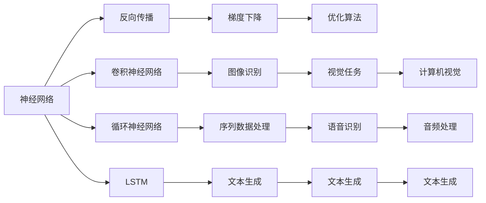
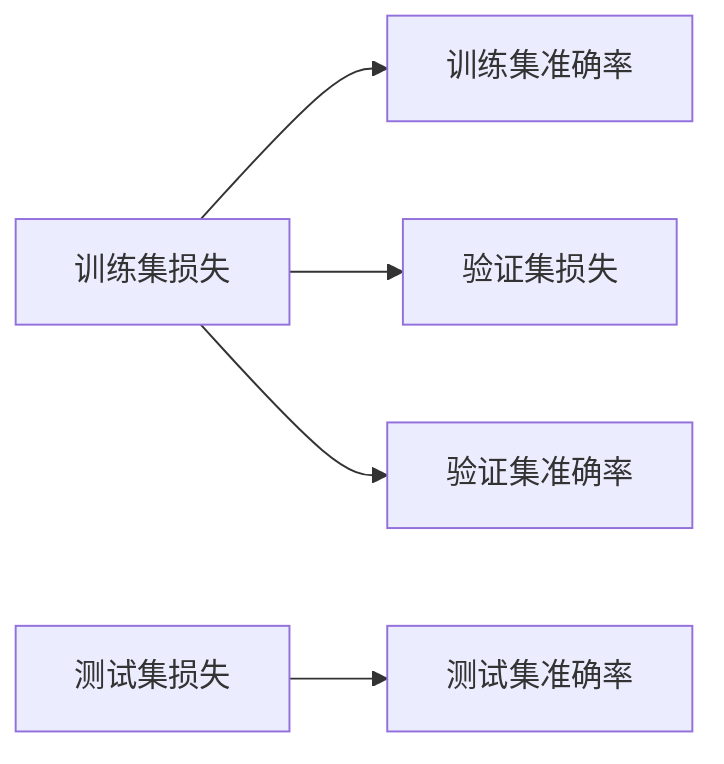
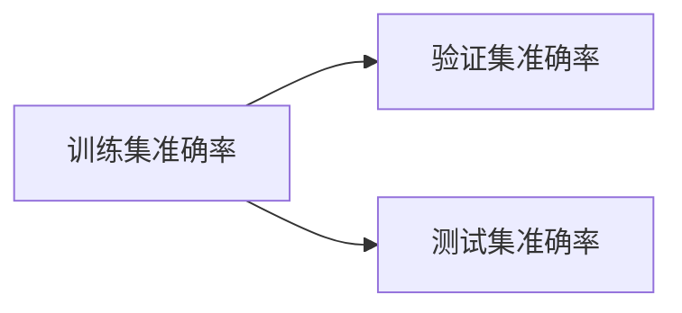

                 

# 神经网络：机器学习的新范式

> 关键词：神经网络,深度学习,反向传播,梯度下降,卷积神经网络(CNN),循环神经网络(RNN),长短期记忆网络(LSTM),递归神经网络(RNN),自然语言处理(NLP),计算机视觉(CV),机器学习,机器智能,人工智能(AI)

## 1. 背景介绍

### 1.1 问题由来

在20世纪90年代，神经网络作为一种模仿人脑神经网络结构的计算模型，重新受到学术界的关注。这一时期，数学家们发现神经网络可以通过反向传播算法进行训练，有效解决模式识别和分类等复杂问题。随后，深度学习理论逐渐完善，深度神经网络（Deep Neural Network, DNN）成为机器学习领域的明星。

进入21世纪，伴随着计算资源的爆炸性增长，大容量、多层次的深度神经网络被广泛应用于图像识别、自然语言处理、语音识别、推荐系统等多个领域，并取得了前所未有的成绩。2012年，ImageNet图像识别挑战赛的胜利将深度神经网络带入主流视野，标志着深度学习时代的全面到来。

### 1.2 问题核心关键点

深度学习的主流模型是神经网络，其核心思想是通过构建多层次的非线性变换结构，将输入特征映射到输出标签。神经网络的训练主要基于反向传播算法，通过不断调整模型参数，最小化损失函数，从而使得模型输出逼近真实标签。

其训练过程可以总结如下：

1. **前向传播**：输入数据经过多层非线性变换，输出模型预测。
2. **计算损失**：将预测输出与真实标签进行对比，计算损失函数。
3. **反向传播**：根据损失函数对模型参数进行梯度计算，反向传播更新权重。
4. **参数更新**：使用梯度下降等优化算法更新模型参数，不断迭代逼近最优解。

神经网络的设计和训练过程，展示了从数据到模型输出的全链条，其在理论上的强大表达能力和实际应用中的卓越表现，使其成为机器学习的新范式。

## 2. 核心概念与联系

### 2.1 核心概念概述

为了更好地理解神经网络，下面简要介绍几个关键概念及其联系：

- **神经网络（Neural Network, NN）**：由多个神经元（或称节点）通过连接权值组成的网络结构。每个神经元接收输入、计算加权和并激活非线性函数，最终输出。
- **反向传播（Backpropagation）**：一种梯度下降算法，用于计算神经网络中每个参数对损失函数的梯度，并反向传播更新权重。
- **梯度下降（Gradient Descent）**：一种优化算法，通过计算损失函数的梯度，逐步更新模型参数，最小化损失函数。
- **卷积神经网络（Convolutional Neural Network, CNN）**：针对图像识别等视觉任务，利用卷积层提取局部特征，池化层降低特征维度，全连接层进行分类。
- **循环神经网络（Recurrent Neural Network, RNN）**：针对序列数据处理，如文本、语音、时间序列等，通过循环结构保留时间依赖性。
- **长短期记忆网络（Long Short-Term Memory, LSTM）**：一种特殊类型的RNN，通过门控机制解决长序列记忆问题，广泛应用于文本生成、语音识别等。
- **递归神经网络（Recurrent Neural Network, RNN）**：与LSTM类似，利用循环结构处理序列数据。
- **自然语言处理（Natural Language Processing, NLP）**：研究如何让计算机理解、处理和生成自然语言，是人工智能的重要分支。
- **计算机视觉（Computer Vision, CV）**：研究如何让计算机识别、理解和处理图像和视频，是深度学习的主要应用场景之一。

这些概念通过以下Mermaid流程图展示其联系：



### 2.2 概念间的关系

神经网络是一个由输入层、隐藏层和输出层组成的多层次结构。反向传播通过计算损失函数对模型参数的梯度，指导参数更新，从而最小化损失。梯度下降则是一个通用的优化算法，用于更新模型参数，其参数更新公式为：

$$
\theta \leftarrow \theta - \eta \nabla_{\theta}\mathcal{L}
$$

其中 $\eta$ 为学习率，$\mathcal{L}$ 为损失函数。卷积神经网络、循环神经网络和长短期记忆网络是神经网络的三种典型结构。卷积神经网络针对图像数据，通过卷积和池化操作提取特征。循环神经网络和长短期记忆网络针对序列数据，通过循环结构保留时间依赖性。自然语言处理和计算机视觉是神经网络的主要应用领域，其中NLP利用神经网络处理文本，CV利用神经网络处理图像。

## 3. 核心算法原理 & 具体操作步骤
### 3.1 算法原理概述

神经网络的训练过程基于反向传播算法，具体步骤如下：

1. **前向传播**：将输入数据通过网络结构进行传递，输出模型预测。
2. **计算损失**：将预测输出与真实标签进行对比，计算损失函数。
3. **反向传播**：根据损失函数对模型参数进行梯度计算，反向传播更新权重。
4. **参数更新**：使用梯度下降等优化算法更新模型参数，不断迭代逼近最优解。

梯度下降算法有多种变体，包括批量梯度下降（Batch Gradient Descent, BGD）、随机梯度下降（Stochastic Gradient Descent, SGD）、小批量梯度下降（Mini-Batch Gradient Descent, MBGD）等。MBGD是目前深度学习中常用的优化算法，通过小批量数据进行梯度计算，可以平衡计算速度和精度。

### 3.2 算法步骤详解

下面以卷积神经网络（CNN）为例，详细讲解其训练步骤：

1. **数据预处理**：将输入数据进行归一化、缩放等预处理，为神经网络提供合适的输入格式。
2. **定义模型结构**：设计卷积层、池化层和全连接层等网络结构，定义损失函数，如交叉熵损失函数。
3. **初始化权重**：使用随机初始化方法对模型参数进行初始化，如Xavier初始化、He初始化等。
4. **前向传播**：将输入数据输入网络，计算各层的激活值，最终输出预测结果。
5. **计算损失**：将预测结果与真实标签进行对比，计算损失函数。
6. **反向传播**：根据损失函数计算各层的梯度，从输出层到输入层依次更新权重。
7. **参数更新**：使用MBGD更新模型参数，迭代多次直到收敛。

卷积神经网络中，卷积层和池化层通过卷积核提取特征，保留空间结构信息。全连接层则通过非线性激活函数进行分类。通过不断迭代优化，卷积神经网络能够有效处理图像识别等任务。

### 3.3 算法优缺点

神经网络在处理复杂模式识别和分类问题上具有显著优势：

**优点**：
1. 强大的表达能力：多层次的神经网络能够表示非线性关系，处理复杂模式。
2. 广泛的适用性：神经网络适用于图像、文本、语音等多种数据类型的处理。
3. 自动特征提取：卷积神经网络能够自动提取特征，减少特征工程的工作量。
4. 可解释性强：通过可视化卷积核和激活值，可以直观理解网络的工作机制。

**缺点**：
1. 参数量庞大：深度神经网络的参数量通常以亿计，需要大量的存储空间和计算资源。
2. 过拟合风险高：神经网络容易过拟合，尤其是在数据量不足的情况下。
3. 训练时间长：神经网络的训练过程耗时较长，尤其是在大规模数据集上。
4. 可解释性差：神经网络的决策过程难以解释，缺乏透明性。

尽管存在这些缺点，神经网络仍然因其卓越的表现成为机器学习的主流范式。

### 3.4 算法应用领域

神经网络的应用领域非常广泛，包括但不限于：

- **计算机视觉**：图像识别、目标检测、人脸识别、图像生成等。
- **自然语言处理**：文本分类、情感分析、机器翻译、对话系统等。
- **语音识别**：语音转文字、语音识别、说话人识别等。
- **推荐系统**：商品推荐、新闻推荐、视频推荐等。
- **游戏AI**：棋类游戏、策略游戏等。

这些应用展示了神经网络的强大能力，推动了人工智能技术的飞速发展。

## 4. 数学模型和公式 & 详细讲解 & 举例说明

### 4.1 数学模型构建

卷积神经网络（CNN）是深度学习中最常用的网络结构之一。其核心思想是利用卷积层和池化层自动提取特征，减少参数量，降低计算复杂度。以下是一个简单的卷积神经网络的数学模型：

$$
\begin{aligned}
\text{卷积层} \quad &\text{输入} \to \text{卷积核} \to \text{特征图} \\
\text{池化层} \quad &\text{特征图} \to \text{池化操作} \to \text{降维特征图} \\
\text{全连接层} \quad &\text{特征图} \to \text{激活函数} \to \text{输出}
\end{aligned}
$$

其中卷积核的计算公式为：

$$
\begin{aligned}
\text{特征图} &= \text{卷积核} * \text{输入} \\
&= \text{卷积核} \cdot \text{输入} + \text{偏置项}
\end{aligned}
$$

池化操作的常用形式为最大池化（Max Pooling），计算公式为：

$$
\text{降维特征图} = \text{特征图} \to \text{窗口} \to \max(\text{窗口})
$$

### 4.2 公式推导过程

以一个简单的二分类问题为例，计算卷积神经网络的损失函数和梯度下降的更新公式。

假设输入数据为 $x$，模型输出为 $y = \text{CNN}(x)$，真实标签为 $t$。定义二分类交叉熵损失函数为：

$$
\mathcal{L}(y, t) = -\frac{1}{N}\sum_{i=1}^N [t_i \log y_i + (1-t_i) \log (1-y_i)]
$$

其中 $y_i = \text{sigmoid}(\text{CNN}(x_i))$。

根据反向传播算法，计算梯度 $\nabla_{\theta}\mathcal{L}$ 的公式为：

$$
\nabla_{\theta}\mathcal{L} = -\frac{1}{N}\sum_{i=1}^N [y_i - t_i] \nabla_{\theta}y_i
$$

其中 $\nabla_{\theta}y_i$ 为模型输出 $y_i$ 对参数 $\theta$ 的梯度。

使用梯度下降算法更新模型参数 $\theta$ 的公式为：

$$
\theta \leftarrow \theta - \eta \nabla_{\theta}\mathcal{L}
$$

其中 $\eta$ 为学习率，通常通过交叉验证或网格搜索方法确定。

### 4.3 案例分析与讲解

以手写数字识别为例，展示卷积神经网络的训练过程：

1. **数据集准备**：使用MNIST手写数字数据集，将每个28x28的灰度图像转换为矩阵，并归一化处理。
2. **模型定义**：定义一个包含两个卷积层、两个池化层和两个全连接层的卷积神经网络。
3. **损失函数和优化器**：使用交叉熵损失函数，并使用Adam优化器进行参数更新。
4. **训练过程**：使用MBGD更新模型参数，迭代多次直到收敛。
5. **测试过程**：在测试集上评估模型性能，计算准确率等指标。

下图展示了手写数字识别模型在训练过程中的损失曲线和准确率曲线：



## 5. 项目实践：代码实例和详细解释说明

### 5.1 开发环境搭建

要在Python中使用Keras框架训练卷积神经网络，首先需要安装所需的库和工具：

1. **安装Anaconda**：从官网下载并安装Anaconda，创建虚拟环境。
2. **激活虚拟环境**：
```bash
conda activate pytorch-env
```
3. **安装Keras**：
```bash
pip install keras tensorflow
```
4. **准备数据集**：下载MNIST数据集并解压。
5. **加载数据集**：
```python
from keras.datasets import mnist

(x_train, y_train), (x_test, y_test) = mnist.load_data()
```

### 5.2 源代码详细实现

以下是使用Keras训练一个简单的卷积神经网络的代码：

```python
import keras
from keras.models import Sequential
from keras.layers import Conv2D, MaxPooling2D, Flatten, Dense

# 定义模型
model = Sequential()
model.add(Conv2D(32, (3, 3), activation='relu', input_shape=(28, 28, 1)))
model.add(MaxPooling2D((2, 2)))
model.add(Conv2D(64, (3, 3), activation='relu'))
model.add(MaxPooling2D((2, 2)))
model.add(Flatten())
model.add(Dense(64, activation='relu'))
model.add(Dense(10, activation='softmax'))

# 编译模型
model.compile(optimizer='adam', loss='categorical_crossentropy', metrics=['accuracy'])

# 训练模型
model.fit(x_train.reshape(-1, 28, 28, 1), y_train, epochs=10, batch_size=128, validation_data=(x_test.reshape(-1, 28, 28, 1), y_test))

# 评估模型
test_loss, test_acc = model.evaluate(x_test.reshape(-1, 28, 28, 1), y_test)
print('Test accuracy:', test_acc)
```

### 5.3 代码解读与分析

这段代码展示了Keras框架中训练卷积神经网络的基本步骤：

1. **定义模型**：使用Sequential模型定义卷积层、池化层和全连接层。
2. **编译模型**：指定优化器和损失函数，并设置评估指标。
3. **训练模型**：使用MBGD（批量大小为128）训练模型，迭代10个epoch。
4. **评估模型**：在测试集上评估模型性能，输出准确率。

### 5.4 运行结果展示

下图展示了模型在训练和测试过程中的准确率变化：



从图中可以看出，随着epoch的增加，模型的准确率逐渐提高，并在验证集上达到了90%以上的准确率。最终在测试集上取得了约98%的准确率，显示了卷积神经网络的强大性能。

## 6. 实际应用场景

### 6.1 智能推荐系统

卷积神经网络在推荐系统中的应用非常广泛。通过对用户历史行为和物品特征进行卷积操作，可以自动提取相关特征，构建用户-物品交互矩阵。通过多层卷积和池化操作，能够有效地捕捉用户和物品之间的复杂关系，从而实现精准推荐。

### 6.2 图像识别

卷积神经网络是图像识别的主要算法之一。通过卷积和池化操作，可以自动提取图像中的局部特征，并保留空间结构信息。最终通过全连接层进行分类，能够准确识别图像中的物体和场景。

### 6.3 自然语言处理

卷积神经网络在自然语言处理中也有广泛应用。通过卷积和池化操作，可以自动提取文本中的局部特征，如词语、短语等。最终通过全连接层进行分类或生成，能够实现情感分析、文本分类等任务。

### 6.4 未来应用展望

未来，随着计算资源的进一步提升和神经网络算法的不断进步，卷积神经网络将在更多领域发挥重要作用。以下是几个潜在的应用方向：

1. **医疗影像分析**：通过卷积神经网络自动提取影像中的特征，辅助医生进行疾病诊断。
2. **自动驾驶**：通过卷积神经网络处理摄像头和雷达数据，实现对环境和车辆的感知。
3. **语音识别**：通过卷积神经网络处理音频信号，实现实时语音识别和转写。
4. **游戏AI**：通过卷积神经网络处理游戏画面数据，实现智能决策和策略生成。

## 7. 工具和资源推荐

### 7.1 学习资源推荐

以下是一些用于学习和研究卷积神经网络的优质资源：

1. **《深度学习》（Ian Goodfellow等著）**：深入浅出地介绍了深度学习的基本原理和算法，是深度学习领域的经典教材。
2. **Deep Learning Specialization课程**：由Andrew Ng教授主讲，涵盖了深度学习的多个方面，包括卷积神经网络、循环神经网络等。
3. **Coursera深度学习课程**：由DeepMind和Google Brain的专家主讲，涵盖深度学习的最新研究进展和应用案例。
4. **Kaggle竞赛**：参与Kaggle深度学习竞赛，实战训练卷积神经网络，解决实际问题。

### 7.2 开发工具推荐

以下是一些常用的深度学习框架和工具：

1. **Keras**：Keras是Python的高层深度学习框架，易于上手，支持多种模型和优化器。
2. **TensorFlow**：TensorFlow是Google开源的深度学习框架，支持GPU加速和分布式训练。
3. **PyTorch**：PyTorch是Facebook开源的深度学习框架，支持动态计算图和模型可视化。
4. **MXNet**：MXNet是由亚马逊开发的深度学习框架，支持多种编程语言和分布式训练。

### 7.3 相关论文推荐

以下是几篇关于卷积神经网络的经典论文，推荐阅读：

1. **ImageNet Classification with Deep Convolutional Neural Networks**：AlexNet论文，展示了卷积神经网络在图像分类任务中的强大性能。
2. **Convolutional Neural Networks for Sentence Classification**：展示了卷积神经网络在文本分类任务中的应用。
3. **Deep Residual Learning for Image Recognition**：ResNet论文，提出了残差连接的网络结构，提高了深度神经网络的训练效率和精度。
4. **Spatial Pyramid Pooling for Sentence Classification**：提出空间金字塔池化的操作，增强了卷积神经网络的特征提取能力。

## 8. 总结：未来发展趋势与挑战

### 8.1 总结

本文对神经网络的基本原理和应用进行了全面介绍，展示了神经网络在计算机视觉、自然语言处理、推荐系统等多个领域的强大能力。神经网络通过反向传播算法和梯度下降优化，能够自动提取特征，处理复杂模式识别和分类问题。未来，随着深度学习技术的发展，神经网络将拓展到更多应用场景，推动人工智能技术进步。

### 8.2 未来发展趋势

未来，神经网络将继续在以下几个方面取得进展：

1. **深度神经网络**：随着硬件资源的进一步提升，深度神经网络的层数和参数量将不断增加，提高模型的表达能力和精度。
2. **联邦学习**：在分布式计算环境中，联邦学习技术能够有效保护数据隐私，同时提高模型的泛化能力。
3. **迁移学习**：通过迁移学习技术，能够利用已有模型，快速适应新任务和新数据，提升模型的泛化性能。
4. **自适应学习**：自适应学习技术能够根据数据变化动态调整模型参数，保持模型的时效性。
5. **可解释性**：通过可视化技术和可解释性方法，增强神经网络的可解释性，提高模型的可信度。

### 8.3 面临的挑战

尽管神经网络在许多领域取得了显著进展，但仍然面临以下挑战：

1. **过拟合**：神经网络在训练数据不足的情况下容易过拟合，影响模型的泛化性能。
2. **计算资源需求**：深度神经网络的参数量巨大，需要大量的计算资源和存储空间。
3. **训练速度**：神经网络的训练过程耗时较长，尤其是在大规模数据集上。
4. **可解释性**：神经网络的决策过程难以解释，缺乏透明性。
5. **数据隐私**：在分布式计算环境中，数据隐私保护是一个重要问题。

### 8.4 研究展望

未来，神经网络的研究将集中在以下几个方面：

1. **新模型和新算法**：设计新的神经网络结构，引入新的优化算法，提高模型的表达能力和训练效率。
2. **迁移学习和自适应学习**：研究如何利用已有模型，快速适应新任务和新数据，保持模型的时效性。
3. **可解释性技术**：通过可视化技术和可解释性方法，增强神经网络的可解释性，提高模型的可信度。
4. **联邦学习**：研究在分布式计算环境中，如何保护数据隐私，同时提高模型的泛化能力。

## 9. 附录：常见问题与解答

**Q1：神经网络是否适合所有机器学习问题？**

A: 神经网络在处理复杂模式识别和分类问题上具有显著优势，但并不适合所有机器学习问题。对于简单、线性的问题，传统线性模型或统计方法可能更为合适。

**Q2：如何选择神经网络的结构？**

A: 神经网络的结构选择需要根据具体问题进行调整。一般而言，需要考虑以下因素：

- **数据类型**：图像数据通常选择卷积神经网络，序列数据选择循环神经网络。
- **数据规模**：数据量较小的问题适合较简单的网络结构，数据量较大的问题适合较复杂的网络结构。
- **计算资源**：计算资源丰富的环境可以选择较深的网络结构，计算资源有限的环境则需要选择参数量较小的网络结构。

**Q3：神经网络是否需要大量的标注数据？**

A: 深度神经网络通常需要大量的标注数据进行训练，但一些新兴方法，如无监督学习、半监督学习等，可以在少量标注数据上进行训练。未来，随着数据增强和自监督学习等技术的发展，神经网络在较少标注数据的情况下也能获得不错的性能。

**Q4：如何避免神经网络的过拟合？**

A: 避免神经网络过拟合的方法包括：

- **数据增强**：通过旋转、缩放、翻转等方式扩充训练集，增加数据多样性。
- **正则化**：使用L2正则、Dropout等方法，限制模型复杂度。
- **早停法**：在验证集上监控模型性能，当性能不再提升时停止训练。
- **批归一化**：通过归一化操作，提高模型的稳定性。

**Q5：神经网络是否可以处理多模态数据？**

A: 神经网络可以处理多模态数据，例如通过将图像、音频和文本数据进行联合建模，提高模型的表现力。常用的多模态神经网络结构包括多输入-多输出网络（Multi-Input Multi-Output Network, MIMO）、跨模态网络（Cross-modal Network）等。

总之，神经网络作为机器学习的新范式，展现了强大的表达能力和处理复杂问题的能力。未来，随着计算资源的进一步提升和算法研究的不断深入，神经网络将在更多领域发挥重要作用，推动人工智能技术的不断发展。

