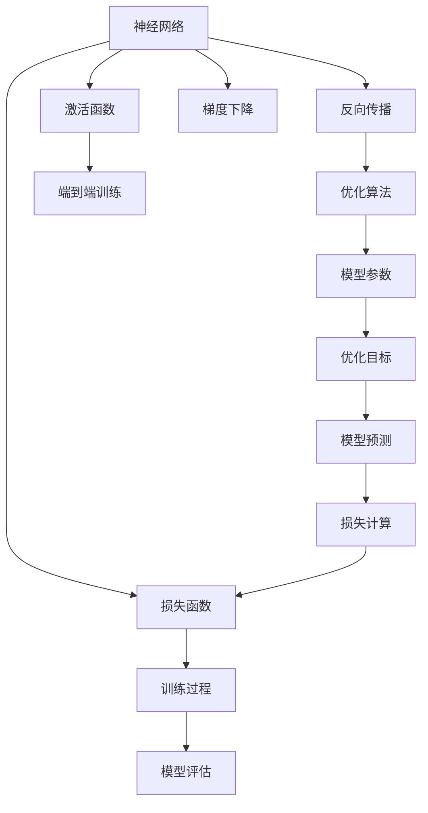
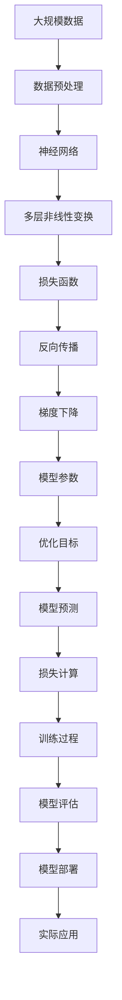

                 

## 1. 背景介绍

### 1.1 问题由来

机器学习(ML)是一种通过数据和算法自动学习和优化模型，使其能够进行预测或决策的领域。然而，传统的机器学习方法，如逻辑回归、支持向量机等，在处理复杂非线性关系时显得力不从心。神经网络(Neural Networks)的出现，为机器学习带来了新的范式，极大提升了模型的表达能力和泛化能力。

神经网络通过模拟人脑的神经元结构，由多个层次的神经元组成，每个神经元接收来自前一层的输入，经过激活函数处理后，传递给下一层。这样的多层结构使得神经网络可以自动学习数据的复杂表示，从而在各类任务中取得优异表现。

### 1.2 问题核心关键点

神经网络的核心关键点在于其强大的表达能力和泛化能力。与传统机器学习模型相比，神经网络具有以下优势：

1. **非线性建模**：神经网络可以处理非线性关系，而传统机器学习模型通常只能处理线性或近似线性关系。
2. **自动特征提取**：神经网络可以自动从数据中提取特征，无需手动设计特征工程。
3. **端到端训练**：神经网络可以端到端训练，一次性优化所有模型参数，避免了传统方法中特征选择和模型选择的复杂性。
4. **并行计算**：神经网络可以高效利用GPU等并行计算资源，加速训练过程。

正是这些优势，使得神经网络成为了机器学习领域的新范式。

### 1.3 问题研究意义

神经网络的研究和应用，对人工智能(AI)领域的发展具有重要意义：

1. **提升模型性能**：神经网络在图像识别、自然语言处理、语音识别等任务上取得了巨大成功，刷新了多项最先进记录。
2. **推动AI产业化**：神经网络技术的普及，促进了AI在各行业的广泛应用，如自动驾驶、智能医疗、金融风控等。
3. **拓展研究视野**：神经网络的研究，推动了深度学习、强化学习等前沿领域的进展，为AI的长期发展奠定了基础。
4. **催生新兴技术**：神经网络的发展，催生了生成对抗网络(GAN)、变分自编码器(VAE)等新兴技术，进一步丰富了AI工具集。
5. **促进跨学科融合**：神经网络与其他领域的深度融合，如与自然语言处理结合生成语言模型，与计算机视觉结合生成视觉生成模型，推动了多学科的协同发展。

## 2. 核心概念与联系

### 2.1 核心概念概述

为更好地理解神经网络的基本原理和架构，本节将介绍几个关键概念：

- **神经网络**：由多个神经元层组成的网络结构，每层接收前一层的输出作为输入，进行线性变换和激活函数处理，生成下一层的输出。
- **激活函数**：非线性函数，用于引入非线性关系，增强神经网络的表达能力。
- **损失函数**：衡量模型预测结果与真实标签之间的差距，用于优化模型的参数。
- **反向传播**：通过计算损失函数的梯度，反向传播更新模型参数，优化模型预测。
- **梯度下降**：一种优化算法，通过更新参数以最小化损失函数，是神经网络中最常用的优化方法。
- **深度学习**：使用多层神经网络进行模型训练和预测的方法，是神经网络的一个应用范式。

### 2.2 概念间的关系

这些核心概念之间的逻辑关系可以通过以下Mermaid流程图来展示：



这个流程图展示了神经网络的基本架构和训练过程：

1. 神经网络由多个神经元层组成，每层使用激活函数进行非线性变换。
2. 通过损失函数计算预测结果与真实标签之间的差距。
3. 反向传播算法计算梯度，用于更新模型参数。
4. 梯度下降算法最小化损失函数，优化模型预测。
5. 神经网络通过端到端训练，一次性优化所有参数。
6. 模型评估阶段，通过损失计算和预测结果的对比，验证模型性能。

### 2.3 核心概念的整体架构

最后，我们用一个综合的流程图来展示这些核心概念在大规模模型训练过程中的整体架构：



这个综合流程图展示了从数据预处理到模型部署的完整过程：

1. 大规模数据经过预处理后，输入神经网络。
2. 神经网络通过多层非线性变换，生成模型预测。
3. 通过损失函数计算预测结果与真实标签之间的差距。
4. 反向传播算法计算梯度，用于更新模型参数。
5. 梯度下降算法最小化损失函数，优化模型预测。
6. 模型经过多次迭代训练，最终输出优化后的参数。
7. 模型评估阶段，通过损失计算和预测结果的对比，验证模型性能。
8. 优化后的模型进行部署，应用于实际场景中。

## 3. 核心算法原理 & 具体操作步骤
### 3.1 算法原理概述

神经网络的训练过程，本质上是求解一个优化问题。假设神经网络的参数为 $\theta$，给定训练集 $D=\{(x_i,y_i)\}_{i=1}^N$，其中 $x_i$ 为输入，$y_i$ 为真实标签。我们的目标是最小化损失函数 $L(\theta)$，使得模型输出 $f(x;\theta)$ 尽可能接近真实标签 $y_i$。

常见的损失函数包括交叉熵损失、均方误差损失等。交叉熵损失函数可以表示为：

$$
L(\theta) = -\frac{1}{N}\sum_{i=1}^N \sum_{k=1}^K y_i^k \log \hat{y}_i^k
$$

其中，$K$ 为类别数，$y_i^k$ 表示样本 $i$ 属于类别 $k$ 的概率，$\hat{y}_i^k$ 表示模型预测样本 $i$ 属于类别 $k$ 的概率。

通过梯度下降算法，我们不断更新模型参数 $\theta$，最小化损失函数 $L(\theta)$。梯度下降算法的更新公式为：

$$
\theta \leftarrow \theta - \eta \nabla_{\theta}L(\theta)
$$

其中，$\eta$ 为学习率，$\nabla_{\theta}L(\theta)$ 为损失函数对参数 $\theta$ 的梯度。

### 3.2 算法步骤详解

神经网络的训练过程主要包括以下几个步骤：

**Step 1: 准备数据集**

- 收集训练集 $D$，分为训练集、验证集和测试集。
- 对数据进行预处理，如归一化、标准化、分词等。
- 将数据转化为神经网络所需的格式，如将文本转化为词嵌入向量。

**Step 2: 初始化模型参数**

- 随机初始化神经网络的所有参数，如权重矩阵和偏置向量。
- 选择合适的激活函数和损失函数。
- 设定训练参数，如学习率、批次大小、迭代轮数等。

**Step 3: 前向传播和损失计算**

- 将训练集 $D$ 分为多个批次，每个批次大小为 $B$。
- 对每个批次的数据进行前向传播，计算模型输出 $f(x;\theta)$。
- 使用损失函数计算模型预测 $f(x;\theta)$ 与真实标签 $y_i$ 之间的差距。

**Step 4: 反向传播和参数更新**

- 反向传播算法计算损失函数对每个参数的梯度。
- 梯度下降算法根据梯度更新每个参数，最小化损失函数。
- 定期在验证集上评估模型性能，调整学习率和迭代轮数。

**Step 5: 测试集评估**

- 使用测试集 $T$ 评估微调后的模型，验证其在未见过的数据上的泛化能力。
- 分析模型性能，提取关键指标，如精度、召回率、F1分数等。

**Step 6: 模型部署**

- 将训练好的模型保存，以便后续使用。
- 将模型集成到实际应用中，如图像识别、语音识别、自然语言处理等。

### 3.3 算法优缺点

神经网络在处理复杂非线性关系、自动提取特征和端到端训练方面具有显著优势，但也存在以下缺点：

**优点：**

1. **强大的表达能力**：神经网络可以通过多层非线性变换，捕捉数据中的复杂关系。
2. **自动特征提取**：神经网络可以自动从数据中学习特征，无需手动设计特征工程。
3. **端到端训练**：神经网络可以一次性优化所有参数，避免了传统方法中特征选择和模型选择的复杂性。
4. **并行计算**：神经网络可以高效利用GPU等并行计算资源，加速训练过程。

**缺点：**

1. **过拟合风险**：神经网络容易过拟合，特别是在数据量较小的情况下。
2. **计算资源需求高**：神经网络参数量较大，需要大量的计算资源进行训练和推理。
3. **解释性不足**：神经网络通常被视为"黑盒"模型，难以解释其内部工作机制和决策逻辑。
4. **初始值敏感**：神经网络对初始值较为敏感，不同的初始化方法可能会影响模型性能。

### 3.4 算法应用领域

神经网络在以下领域得到了广泛应用：

- **计算机视觉**：图像分类、目标检测、语义分割等任务，如AlexNet、VGG、ResNet等模型。
- **自然语言处理**：语言建模、机器翻译、问答系统等任务，如BERT、GPT等模型。
- **语音识别**：声学模型、语言模型等任务，如CTC、Attention等模型。
- **推荐系统**：协同过滤、内容推荐等任务，如SVD、DNN等模型。
- **游戏AI**：策略决策、动作选择等任务，如AlphaGo等模型。

## 4. 数学模型和公式 & 详细讲解 & 举例说明
### 4.1 数学模型构建

神经网络通常由多层神经元组成，每层接收前一层的输出作为输入，进行线性变换和激活函数处理，生成下一层的输出。假设神经网络包含 $L$ 层，第 $l$ 层的输入为 $x^{(l)}$，输出为 $h^{(l)}$，激活函数为 $\sigma$。则第 $l$ 层神经元的计算公式为：

$$
h^{(l)} = \sigma(W^{(l)}x^{(l-1)} + b^{(l)})
$$

其中，$W^{(l)}$ 为权重矩阵，$b^{(l)}$ 为偏置向量。权重矩阵和偏置向量均为神经网络的参数。

### 4.2 公式推导过程

假设神经网络共有 $L$ 层，输入为 $x^{(0)}$，输出为 $y^{(L)}$，激活函数为 $\sigma$。神经网络的输出公式可以表示为：

$$
y^{(L)} = \sigma(W^{(L)}h^{(L-1)} + b^{(L)})
$$

其中，$h^{(L-1)}$ 为最后一层的输入，$W^{(L)}$ 和 $b^{(L)}$ 为最后一层的权重和偏置。

假设目标函数为交叉熵损失函数，其公式为：

$$
L(y^{(L)},\hat{y}^{(L)}) = -\frac{1}{N}\sum_{i=1}^N \sum_{k=1}^K y_i^k \log \hat{y}_i^k
$$

其中，$K$ 为类别数，$y_i^k$ 表示样本 $i$ 属于类别 $k$ 的概率，$\hat{y}_i^k$ 表示模型预测样本 $i$ 属于类别 $k$ 的概率。

### 4.3 案例分析与讲解

以手写数字识别为例，说明神经网络在实际应用中的工作原理。

**数据集**：MNIST数据集，包含60000个训练样本和10000个测试样本，每个样本为28x28的灰度图像，标签为0到9之间的整数。

**模型架构**：使用两层全连接神经网络，第一层为输入层，第二层为输出层，激活函数为ReLU。

**训练过程**：

1. **数据预处理**：将图像转化为0到1之间的浮点数，归一化处理。
2. **模型初始化**：随机初始化权重矩阵和偏置向量。
3. **前向传播**：将训练集分为多个批次，每个批次大小为100。对每个批次的数据进行前向传播，计算模型输出。
4. **损失计算**：使用交叉熵损失函数计算模型预测与真实标签之间的差距。
5. **反向传播**：使用梯度下降算法计算损失函数对每个参数的梯度，更新模型参数。
6. **测试集评估**：使用测试集评估模型性能，输出精度、召回率、F1分数等指标。

通过不断迭代训练，模型最终能够在测试集上达到90%以上的精度，展示了神经网络在图像识别任务上的强大能力。

## 5. 项目实践：代码实例和详细解释说明
### 5.1 开发环境搭建

在进行神经网络项目实践前，我们需要准备好开发环境。以下是使用Python进行TensorFlow开发的环境配置流程：

1. 安装Anaconda：从官网下载并安装Anaconda，用于创建独立的Python环境。

2. 创建并激活虚拟环境：
```bash
conda create -n tensorflow-env python=3.8 
conda activate tensorflow-env
```

3. 安装TensorFlow：根据CUDA版本，从官网获取对应的安装命令。例如：
```bash
conda install tensorflow tensorflow-gpu=2.6 -c tf
```

4. 安装各类工具包：
```bash
pip install numpy pandas scikit-learn matplotlib tqdm jupyter notebook ipython
```

完成上述步骤后，即可在`tensorflow-env`环境中开始神经网络开发实践。

### 5.2 源代码详细实现

下面以手写数字识别为例，给出使用TensorFlow实现神经网络的完整代码实现。

首先，定义模型和损失函数：

```python
import tensorflow as tf

# 定义模型结构
def create_model():
    model = tf.keras.models.Sequential([
        tf.keras.layers.Flatten(input_shape=(28, 28)),
        tf.keras.layers.Dense(128, activation='relu'),
        tf.keras.layers.Dropout(0.2),
        tf.keras.layers.Dense(10, activation='softmax')
    ])
    return model

# 定义损失函数
def create_loss_fn():
    return tf.keras.losses.SparseCategoricalCrossentropy(from_logits=True)

# 创建模型实例
model = create_model()
loss_fn = create_loss_fn()

# 编译模型
model.compile(optimizer='adam', loss=loss_fn, metrics=['accuracy'])
```

然后，加载数据集并进行预处理：

```python
# 加载数据集
mnist = tf.keras.datasets.mnist.load_data()

# 数据预处理
train_images, train_labels = mnist[0][0], mnist[0][1]
train_images = train_images / 255.0
test_images, test_labels = mnist[1][0], mnist[1][1]
test_images = test_images / 255.0

# 将标签转化为one-hot编码
train_labels = tf.keras.utils.to_categorical(train_labels, 10)
test_labels = tf.keras.utils.to_categorical(test_labels, 10)
```

接着，定义训练和评估函数：

```python
# 定义训练函数
def train(model, train_images, train_labels, epochs, batch_size):
    history = model.fit(train_images, train_labels, epochs=epochs, batch_size=batch_size, validation_split=0.1)

    # 评估模型性能
    test_loss, test_acc = model.evaluate(test_images, test_labels)
    print(f'Test loss: {test_loss:.4f}')
    print(f'Test accuracy: {test_acc:.4f}')

# 定义训练参数
epochs = 10
batch_size = 32

# 开始训练
train(model, train_images, train_labels, epochs, batch_size)
```

最后，启动训练流程并在测试集上评估：

```python
# 训练模型
train(model, train_images, train_labels, epochs, batch_size)

# 在测试集上评估模型性能
test_loss, test_acc = model.evaluate(test_images, test_labels)
print(f'Test loss: {test_loss:.4f}')
print(f'Test accuracy: {test_acc:.4f}')
```

以上就是使用TensorFlow进行手写数字识别任务神经网络微调的完整代码实现。可以看到，TensorFlow的高级API使得神经网络模型的搭建和训练过程变得非常简洁高效。

### 5.3 代码解读与分析

让我们再详细解读一下关键代码的实现细节：

**create_model函数**：
- 定义了神经网络的模型结构，包括输入层、隐藏层和输出层。
- 使用Flatten层将输入数据从二维转化为一维，方便后续处理。
- 隐藏层包含128个神经元，激活函数为ReLU。
- 使用Dropout层进行正则化，避免过拟合。
- 输出层包含10个神经元，激活函数为Softmax，用于多分类问题。

**create_loss_fn函数**：
- 定义了交叉熵损失函数，用于衡量模型预测与真实标签之间的差距。
- 使用SparseCategoricalCrossentropy损失函数，适用于多分类问题。
- 设置from_logits=True，表示输出为未经过softmax处理的logits。

**train函数**：
- 使用model.fit方法进行模型训练，指定训练集、标签、迭代轮数和批次大小。
- 使用validation_split参数将数据分为训练集和验证集，用于监控模型性能。
- 在每个epoch结束时，打印出验证集的损失和准确率。

**模型评估**：
- 使用model.evaluate方法在测试集上评估模型性能，返回损失和准确率。
- 打印出测试集上的损失和准确率，用于对比训练前后的性能变化。

## 6. 实际应用场景
### 6.1 计算机视觉

神经网络在计算机视觉领域的应用非常广泛，涵盖了图像分类、目标检测、语义分割等多个任务。以图像分类为例，可以使用卷积神经网络(CNN)模型，对图像进行特征提取和分类。

在实际应用中，可以收集大量的标注图像数据，使用神经网络进行训练。训练过程中，不断调整模型结构和超参数，以提高分类精度。最终训练好的模型，可以对新的图像数据进行分类预测，如识别动物、车辆、场景等。

### 6.2 自然语言处理

神经网络在自然语言处理(NLP)领域的应用同样非常广泛，涵盖了语言建模、机器翻译、问答系统等多个任务。以机器翻译为例，可以使用序列到序列模型(Seq2Seq)，将源语言序列转化为目标语言序列。

在实际应用中，可以收集大量的平行语料数据，使用神经网络进行训练。训练过程中，不断调整模型结构和超参数，以提高翻译质量。最终训练好的模型，可以对新的语言数据进行翻译预测，如中英文翻译、日英文翻译等。

### 6.3 语音识别

神经网络在语音识别领域的应用也非常重要，涵盖了声学模型、语言模型等多个任务。以语音识别为例，可以使用卷积神经网络(CNN)和循环神经网络(RNN)模型，对语音信号进行特征提取和识别。

在实际应用中，可以收集大量的语音数据，使用神经网络进行训练。训练过程中，不断调整模型结构和超参数，以提高识别精度。最终训练好的模型，可以对新的语音信号进行识别预测，如语音助手、智能客服等。

### 6.4 未来应用展望

神经网络在多个领域的应用已经取得了显著成果，未来仍有许多发展方向值得探索：

1. **自监督学习**：通过无监督学习任务，如掩码语言模型、自编码器等，提升模型的泛化能力和数据利用率。
2. **迁移学习**：将在大规模数据上预训练的模型，应用于特定领域的数据，提升模型在新领域的性能。
3. **多模态学习**：将神经网络与其他模态的数据结合，如图像、语音、文本等，提升跨模态信息融合能力。
4. **联邦学习**：将分散在多个设备上的数据聚合，联合训练模型，提升模型的数据利用率和隐私保护能力。
5. **强化学习**：将神经网络与强化学习结合，训练智能决策模型，应用于游戏AI、自动驾驶等领域。
6. **生成对抗网络(GAN)**：使用神经网络生成逼真的图像、视频、音频等内容，应用于内容生成、虚拟现实等领域。

这些方向将进一步拓展神经网络的应用范围，推动人工智能技术的发展。

## 7. 工具和资源推荐
### 7.1 学习资源推荐

为了帮助开发者系统掌握神经网络的基本原理和实践技巧，这里推荐一些优质的学习资源：

1. **《深度学习》书籍**：Ian Goodfellow所著的经典书籍，系统介绍了深度学习的基本概念和算法。
2. **CS231n《卷积神经网络》课程**：斯坦福大学开设的计算机视觉明星课程，有Lecture视频和配套作业，带你入门深度学习中的计算机视觉任务。
3. **DeepLearning.ai《深度学习专项课程》**：Andrew Ng主导的深度学习在线课程，涵盖从深度学习基础到高级实践的全面内容。
4. **Arxiv论文预印本**：人工智能领域最新研究成果的发布平台，包括大量尚未发表的前沿工作，学习前沿技术的必备资源。
5. **Kaggle竞赛平台**：数据科学和机器学习竞赛平台，提供丰富的数据集和问题，用于实战练习。

通过对这些资源的学习实践，相信你一定能够快速掌握神经网络的基本原理和实践技巧，并用于解决实际的机器学习问题。

### 7.2 开发工具推荐

高效的开发离不开优秀的工具支持。以下是几款用于神经网络开发的常用工具：

1. **TensorFlow**：由Google主导开发的开源深度学习框架，生产部署方便，适合大规模工程应用。
2. **PyTorch**：基于Python的开源深度学习框架，灵活动态的计算图，适合快速迭代研究。
3. **MXNet**：由Apache主导的深度学习框架，支持多种编程语言，高效支持GPU和TPU。
4. **Keras**：高层次深度学习API，支持TensorFlow、Theano等多种后端，易于上手。
5. **Caffe**：由Berkeley Vision and Learning Center开发的深度学习框架，用于计算机视觉任务。

合理利用这些工具，可以显著提升神经网络开发的效率，加快创新迭代的步伐。

### 7.3 相关论文推荐

神经网络的研究和应用源于学界的持续研究。以下是几篇奠基性的相关论文，推荐阅读：

1. **AlexNet**：Hinton等人提出的卷积神经网络模型，在2012年ImageNet竞赛中取得胜利，开启了深度学习在计算机视觉领域的应用。
2. **VGG**：Simonyan和Zisserman提出的卷积神经网络模型，使用多个小卷积核进行特征提取，取得非常好的效果。
3. **ResNet**：He等人提出的残差网络模型，解决了深度神经网络中的梯度消失问题，大大提升了模型的深度和精度。
4. **BERT**：Devlin等人提出的预训练语言模型，通过掩码语言模型和下一句预测任务进行预训练，取得多项NLP任务的SOTA。
5. **GPT-2**：OpenAI提出的生成式预训练语言模型，通过掩码语言模型和自回归生成任务进行预训练，取得非常好的文本生成效果。

这些论文代表了大神经网络的研究进展，通过学习这些前沿成果，可以帮助研究者把握学科前进方向，激发更多的创新灵感。

除上述资源外，还有一些值得关注的前沿资源，帮助开发者紧跟神经网络技术的最新进展，例如：

1. **arXiv论文预印本**：人工智能领域最新研究成果的发布平台，包括大量尚未发表的前沿工作，学习前沿技术的必备资源。
2. **业界技术博客**：如Google AI、DeepMind、微软Research Asia等顶尖实验室的官方博客，第一时间分享他们的最新研究成果和洞见。
3. **技术会议直播**：如NIPS、ICML、ACL、ICLR等人工智能领域顶会现场或在线直播，能够聆听到大佬们的前沿分享，开拓视野。
4. **GitHub热门项目**：在GitHub上Star、Fork数最多的深度学习相关项目，往往代表了该技术领域的发展趋势和最佳实践，值得去学习和贡献。
5. **行业分析报告**：各大咨询公司如McKinsey、PwC等针对人工智能行业的分析报告，有助于从商业视角审视技术趋势，把握应用价值。

总之，对于神经网络的学习和实践，需要开发者保持开放的心态和持续学习的意愿。多关注前沿资讯，多动手实践，多思考总结，必将收获满满的成长收益。

## 8. 总结：未来发展趋势与挑战

### 8.

