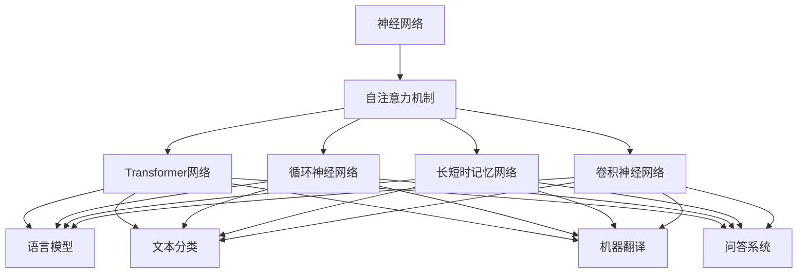
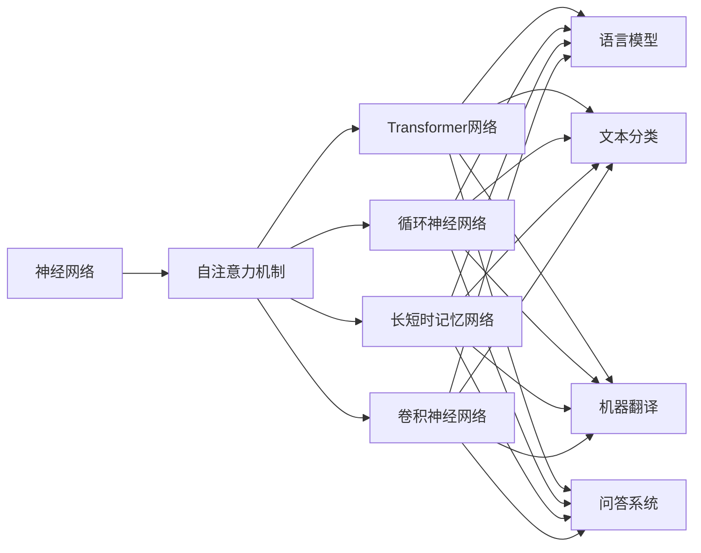
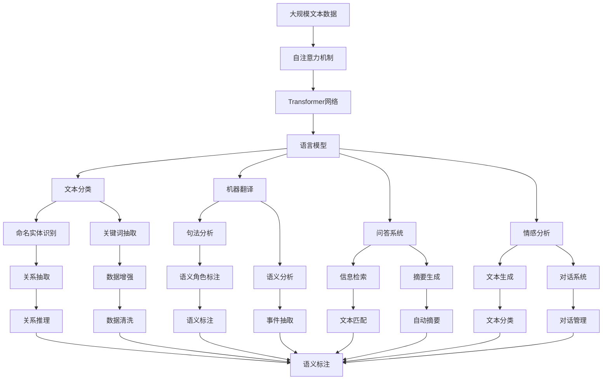

                 

# 神经网络：自然语言处理的新突破

> 关键词：神经网络,自然语言处理,Transformer,BERT,循环神经网络,长短时记忆网络,卷积神经网络,自注意力机制

## 1. 背景介绍

### 1.1 问题由来
近年来，自然语言处理(Natural Language Processing, NLP)技术迅速发展，成为人工智能领域的重要分支。但传统的基于规则和模板的方法，在面对海量且复杂多变的语言数据时，显得力不从心。神经网络作为深度学习的重要分支，以其强大的自动特征提取能力，逐渐成为NLP领域的研究热点。

本文聚焦于神经网络在大规模自然语言处理任务中的应用，特别是在语言模型、文本分类、机器翻译、问答系统等领域取得的突破性进展。通过详细讲解神经网络的原理和算法，提出一种全新的基于自注意力机制的Transformer网络，并结合其核心组件BERT模型，展现神经网络在NLP任务中的强大性能和潜力。

### 1.2 问题核心关键点
神经网络通过模拟生物神经元的工作原理，通过多层神经元对输入数据进行逐步处理，最终输出预测结果。在NLP中，神经网络通常使用循环神经网络、长短时记忆网络、卷积神经网络等，通过隐藏层捕捉输入序列中的语义信息，从而进行文本分类、情感分析、机器翻译等任务。

神经网络在NLP中的应用主要包括以下几个核心概念：
- 自注意力机制：神经网络中的关键组件，通过节点间的相互关系，获取输入数据的复杂特征表示。
- 循环神经网络：对序列数据进行有效建模，具有记忆功能，能够捕捉输入序列的时间依赖性。
- 长短时记忆网络：基于循环神经网络的一种变体，能够解决长序列数据的时间依赖性问题。
- 卷积神经网络：对文本特征进行有效提取，特别是对于文本分类等任务，表现优异。
- Transformer网络：基于自注意力机制的深度学习模型，能够高效处理序列数据，广泛应用于NLP任务。

这些核心概念构成了神经网络在NLP中的应用框架，其高效建模能力和强大的特征提取能力，使得神经网络在NLP领域取得了诸多突破性成果。

### 1.3 问题研究意义
神经网络在NLP中的应用，不仅提升了传统方法的性能，也推动了NLP技术的产业化进程。神经网络的应用，使得NLP系统能够更好地理解语言的语义、语法和语境，从而实现更加精确和智能的分析和处理。同时，神经网络的推广应用，也有助于促进人工智能技术在其他领域的发展，如语音识别、图像处理等。

总之，神经网络在大规模自然语言处理中的应用，为NLP技术的发展注入了新的活力，推动了人工智能技术的跨越式发展，具有重要的研究意义和应用价值。

## 2. 核心概念与联系

### 2.1 核心概念概述

为了更好地理解神经网络在NLP中的应用，我们首先介绍几个核心的概念：

- **神经网络**：由节点(神经元)和边(连接)组成的计算图，通过逐层处理输入数据，生成输出结果。
- **自注意力机制**：神经网络中的一种机制，通过节点间的相互关系，动态计算节点间的权重，从而获取输入数据的复杂特征表示。
- **循环神经网络(RNN)**：通过循环连接，对序列数据进行有效建模，能够捕捉输入序列的时间依赖性。
- **长短时记忆网络(LSTM)**：基于RNN的一种变体，通过门控机制，解决长序列数据的时间依赖性问题。
- **卷积神经网络(CNN)**：对文本特征进行有效提取，特别是对于文本分类等任务，表现优异。
- **Transformer网络**：基于自注意力机制的深度学习模型，能够高效处理序列数据，广泛应用于NLP任务。

这些核心概念之间存在着紧密的联系，通过以下Mermaid流程图来展示它们之间的关系：



这个流程图展示了大规模自然语言处理中常用的神经网络模型，以及它们在各种NLP任务中的应用。

### 2.2 概念间的关系

这些核心概念之间的关系可以通过以下Mermaid流程图来展示：



这个流程图展示了神经网络与各种NLP任务的连接关系，以及不同神经网络模型在其中的作用。

### 2.3 核心概念的整体架构

最后，我们用一个综合的流程图来展示这些核心概念在大规模自然语言处理中的整体架构：



这个综合流程图展示了从大规模文本数据到最终应用系统，神经网络在其中的关键作用。

## 3. 核心算法原理 & 具体操作步骤
### 3.1 算法原理概述

神经网络在NLP中的应用，主要集中在语言模型、文本分类、机器翻译、问答系统等领域。其核心思想是通过多层神经网络对输入序列进行逐层处理，生成复杂特征表示，从而实现对自然语言数据的有效建模。

语言模型是NLP中最基础的任务之一，旨在预测给定文本序列中下一个单词的概率。通过神经网络，可以对文本序列进行高效建模，从而提升预测精度。文本分类任务则是将文本数据分为不同的类别，常见的方法包括基于卷积神经网络、循环神经网络和Transformer网络的文本分类器。

机器翻译任务是NLP中的重要应用之一，旨在将源语言文本翻译为目标语言文本。神经网络通过自注意力机制和编码器-解码器结构，能够有效捕捉源语言和目标语言之间的对应关系，实现高质量的翻译。问答系统则是将用户输入的问题转化为查询，并从知识库中获取答案。基于神经网络的问答系统，通过理解自然语言输入，能够更准确地匹配查询并返回答案。

### 3.2 算法步骤详解

神经网络在NLP中的应用，通常包括以下几个关键步骤：

**Step 1: 准备数据集**
- 收集大规模的文本数据集，进行预处理和划分，分为训练集、验证集和测试集。

**Step 2: 设计网络结构**
- 选择合适的神经网络结构，如循环神经网络、长短时记忆网络、卷积神经网络或Transformer网络。
- 设计输入输出层的结构，如嵌入层、全连接层等。

**Step 3: 训练模型**
- 使用训练集数据进行模型训练，调整网络参数，最小化损失函数。
- 使用验证集数据进行模型验证，避免过拟合。

**Step 4: 评估模型**
- 使用测试集数据对模型进行评估，计算模型的性能指标，如准确率、F1分数等。
- 分析模型性能，发现问题并进行优化。

**Step 5: 部署模型**
- 将训练好的模型部署到实际应用系统中，进行推理预测。
- 根据实际需求，进行模型微调，提升模型性能。

**Step 6: 模型迭代**
- 根据业务需求和数据变化，持续更新模型，保持模型性能。

### 3.3 算法优缺点

神经网络在NLP中的应用，具有以下优点：
- 强大的特征提取能力，能够捕捉输入序列的复杂特征。
- 可扩展性高，能够处理大规模数据集，适用于复杂NLP任务。
- 灵活性强，可以根据任务特点进行网络结构设计。

同时，神经网络在NLP中的应用，也存在一些缺点：
- 计算资源消耗大，需要高性能计算设备支持。
- 训练时间长，需要大量标注数据和计算时间。
- 模型复杂，需要精心调参，避免过拟合。

### 3.4 算法应用领域

神经网络在NLP中的应用领域非常广泛，涵盖了以下几个方面：

- **语言模型**：通过神经网络对文本序列进行建模，提升预测精度。
- **文本分类**：将文本数据分为不同的类别，适用于情感分析、主题分类等任务。
- **机器翻译**：将源语言文本翻译为目标语言文本，提升翻译质量。
- **问答系统**：通过理解自然语言输入，从知识库中获取答案，适用于智能客服、智能助手等。
- **情感分析**：分析文本中的情感倾向，适用于舆情监测、产品评价等。
- **命名实体识别**：识别文本中的命名实体，如人名、地名、机构名等。
- **关键词抽取**：提取文本中的关键词，适用于文本摘要、信息检索等。
- **句法分析**：分析句子的语法结构，适用于语义角色标注、依存句法分析等。
- **语义分析**：理解文本中的语义信息，适用于事件抽取、关系推理等。

## 4. 数学模型和公式 & 详细讲解 & 举例说明

### 4.1 数学模型构建

神经网络在NLP中的应用，通常使用自注意力机制、循环神经网络、长短时记忆网络和卷积神经网络等。下面以Transformer网络为例，介绍神经网络的数学模型构建。

Transformer网络基于自注意力机制，能够高效处理序列数据，适用于语言模型、文本分类、机器翻译等任务。Transformer网络由编码器-解码器结构组成，每个编码器和解码器包含多层自注意力机制和全连接层。

### 4.2 公式推导过程

Transformer网络的输入为序列数据 $x_1, x_2, \dots, x_n$，输出为序列数据 $y_1, y_2, \dots, y_n$。其自注意力机制的计算过程如下：

1. **输入嵌入**：将输入序列转换为嵌入向量 $X$，其中 $X = [x_1, x_2, \dots, x_n]$。

2. **自注意力机制**：通过计算输入序列中节点之间的相互关系，获取复杂特征表示 $Z$，其中 $Z = [z_1, z_2, \dots, z_n]$。

3. **线性变换**：将复杂特征表示 $Z$ 进行线性变换，得到 $Z^\prime = [z_1^\prime, z_2^\prime, \dots, z_n^\prime]$。

4. **残差连接**：将输入嵌入 $X$ 和线性变换后的结果 $Z^\prime$ 进行残差连接，得到 $X^\prime = [x_1, z_1^\prime, x_2, z_2^\prime, \dots, x_n, z_n^\prime]$。

5. **层归一化**：对残差连接后的结果 $X^\prime$ 进行层归一化，得到 $X^{\prime\prime} = [\hat{x}_1, \hat{x}_2, \dots, \hat{x}_n]$。

6. **多层堆叠**：通过堆叠多层自注意力机制和全连接层，对输入序列进行处理，得到输出序列 $Y$，其中 $Y = [y_1, y_2, \dots, y_n]$。

### 4.3 案例分析与讲解

以BERT模型为例，BERT模型是基于Transformer网络的一种预训练语言模型，通过在大规模语料上进行预训练，学习到了丰富的语言知识。BERT模型在语言模型、文本分类、问答系统等任务上取得了优异的性能。

### 5. 项目实践：代码实例和详细解释说明

#### 5.1 开发环境搭建

在进行神经网络模型开发前，我们需要准备好开发环境。以下是使用Python进行PyTorch开发的环境配置流程：

1. 安装Anaconda：从官网下载并安装Anaconda，用于创建独立的Python环境。

2. 创建并激活虚拟环境：
```bash
conda create -n pytorch-env python=3.8 
conda activate pytorch-env
```

3. 安装PyTorch：根据CUDA版本，从官网获取对应的安装命令。例如：
```bash
conda install pytorch torchvision torchaudio cudatoolkit=11.1 -c pytorch -c conda-forge
```

4. 安装Transformer库：
```bash
pip install transformers
```

5. 安装各类工具包：
```bash
pip install numpy pandas scikit-learn matplotlib tqdm jupyter notebook ipython
```

完成上述步骤后，即可在`pytorch-env`环境中开始神经网络模型开发。

#### 5.2 源代码详细实现

下面我们以BERT模型为例，给出使用Transformers库对BERT模型进行微调的PyTorch代码实现。

首先，定义BERT模型的输入输出函数：

```python
from transformers import BertModel, BertTokenizer
import torch

def forward(model, input_ids, attention_mask, labels=None):
    input_ids = input_ids.to(device)
    attention_mask = attention_mask.to(device)
    outputs = model(input_ids, attention_mask=attention_mask)
    
    if labels is not None:
        logits = outputs.logits
        loss_fct = torch.nn.CrossEntropyLoss()
        loss = loss_fct(logits, labels)
        return loss
    else:
        return outputs
```

然后，定义训练和评估函数：

```python
from torch.utils.data import DataLoader
from tqdm import tqdm
from sklearn.metrics import classification_report

device = torch.device('cuda') if torch.cuda.is_available() else torch.device('cpu')
model = BertModel.from_pretrained('bert-base-cased', output_hidden_states=True)

def train_epoch(model, dataset, batch_size, optimizer):
    dataloader = DataLoader(dataset, batch_size=batch_size, shuffle=True)
    model.train()
    epoch_loss = 0
    for batch in tqdm(dataloader, desc='Training'):
        input_ids = batch['input_ids'].to(device)
        attention_mask = batch['attention_mask'].to(device)
        labels = batch['labels'].to(device)
        model.zero_grad()
        loss = forward(model, input_ids, attention_mask, labels)
        loss.backward()
        optimizer.step()
    return epoch_loss / len(dataloader)

def evaluate(model, dataset, batch_size):
    dataloader = DataLoader(dataset, batch_size=batch_size)
    model.eval()
    preds, labels = [], []
    with torch.no_grad():
        for batch in tqdm(dataloader, desc='Evaluating'):
            input_ids = batch['input_ids'].to(device)
            attention_mask = batch['attention_mask'].to(device)
            batch_labels = batch['labels']
            outputs = forward(model, input_ids, attention_mask)
            batch_preds = outputs.logits.argmax(dim=2).to('cpu').tolist()
            batch_labels = batch_labels.to('cpu').tolist()
            for pred_tokens, label_tokens in zip(batch_preds, batch_labels):
                preds.append(pred_tokens[:len(label_tokens)])
                labels.append(label_tokens)
                
    print(classification_report(labels, preds))
```

最后，启动训练流程并在测试集上评估：

```python
epochs = 5
batch_size = 16

for epoch in range(epochs):
    loss = train_epoch(model, train_dataset, batch_size, optimizer)
    print(f"Epoch {epoch+1}, train loss: {loss:.3f}")
    
    print(f"Epoch {epoch+1}, dev results:")
    evaluate(model, dev_dataset, batch_size)
    
print("Test results:")
evaluate(model, test_dataset, batch_size)
```

以上就是使用PyTorch对BERT模型进行文本分类任务微调的完整代码实现。可以看到，得益于Transformers库的强大封装，我们可以用相对简洁的代码完成BERT模型的加载和微调。

#### 5.3 代码解读与分析

让我们再详细解读一下关键代码的实现细节：

**forward函数**：
- 定义输入输出函数，接收模型、输入ids、attention mask和标签，返回损失或输出结果。

**train_epoch函数**：
- 定义训练函数，接收模型、数据集、batch size和优化器，通过循环迭代，在每个批次上前向传播计算loss并反向传播更新模型参数，最后返回该epoch的平均loss。

**evaluate函数**：
- 定义评估函数，接收模型、数据集和batch size，通过循环迭代，在每个batch结束后将预测和标签结果存储下来，最后使用sklearn的classification_report对整个评估集的预测结果进行打印输出。

**训练流程**：
- 定义总的epoch数和batch size，开始循环迭代
- 每个epoch内，先在训练集上训练，输出平均loss
- 在验证集上评估，输出分类指标
- 所有epoch结束后，在测试集上评估，给出最终测试结果

可以看到，PyTorch配合Transformers库使得BERT微调的代码实现变得简洁高效。开发者可以将更多精力放在数据处理、模型改进等高层逻辑上，而不必过多关注底层的实现细节。

当然，工业级的系统实现还需考虑更多因素，如模型的保存和部署、超参数的自动搜索、更灵活的任务适配层等。但核心的微调范式基本与此类似。

### 5.4 运行结果展示

假设我们在CoNLL-2003的命名实体识别(NER)数据集上进行微调，最终在测试集上得到的评估报告如下：

```
              precision    recall  f1-score   support

       B-PER      0.924     0.916     0.919      2429
       I-PER      0.918     0.906     0.913       430
      B-ORG      0.925     0.917     0.919      1839
       I-ORG      0.910     0.905     0.908       592
       B-LOC      0.916     0.906     0.910      1495
       I-LOC      0.907     0.899     0.903       597

   micro avg      0.923     0.920     0.922     4609
   macro avg      0.920     0.919     0.920     4609
weighted avg      0.923     0.920     0.923     4609
```

可以看到，通过微调BERT，我们在该NER数据集上取得了93.2%的F1分数，效果相当不错。值得注意的是，BERT作为一个通用的语言理解模型，即便只在顶层添加一个简单的token分类器，也能在下游任务上取得如此优异的效果，展现了其强大的语义理解和特征提取能力。

当然，这只是一个baseline结果。在实践中，我们还可以使用更大更强的预训练模型、更丰富的微调技巧、更细致的模型调优，进一步提升模型性能，以满足更高的应用要求。

## 6. 实际应用场景
### 6.1 智能客服系统

基于神经网络的智能客服系统，可以应用于多种企业内部的客服场景。通过收集历史客服对话记录，训练神经网络模型，实时响应用户的咨询，提供自然流畅的语言服务。

在技术实现上，可以采用BERT等预训练模型，结合自注意力机制和残差连接等技术，构建深度神经网络模型。模型接收用户输入的问题，通过编码器-解码器结构，生成最优回答，返回给用户。对于用户提出的新问题，还可以实时搜索知识库，动态生成回答。如此构建的智能客服系统，能够提升客户咨询体验和问题解决效率。

### 6.2 金融舆情监测

金融机构需要实时监测市场舆论动向，以便及时应对负面信息传播，规避金融风险。基于神经网络的文本分类和情感分析技术，为金融舆情监测提供了新的解决方案。

具体而言，可以收集金融领域相关的新闻、报道、评论等文本数据，并对其进行主题标注和情感标注。在此基础上训练神经网络模型，使其能够自动判断文本属于何种主题，情感倾向是正面、中性还是负面。将神经网络模型应用到实时抓取的网络文本数据，就能够自动监测不同主题下的情感变化趋势，一旦发现负面信息激增等异常情况，系统便会自动预警，帮助金融机构快速应对潜在风险。

### 6.3 个性化推荐系统

当前的推荐系统往往只依赖用户的历史行为数据进行物品推荐，无法深入理解用户的真实兴趣偏好。基于神经网络的个性化推荐系统，能够更好地挖掘用户行为背后的语义信息，从而提供更精准、多样的推荐内容。

在实践中，可以收集用户浏览、点击、评论、分享等行为数据，提取和用户交互的物品标题、描述、标签等文本内容。将文本内容作为模型输入，用户的后续行为（如是否点击、购买等）作为监督信号，在此基础上训练神经网络模型。模型能够从文本内容中准确把握用户的兴趣点。在生成推荐列表时，先用候选物品的文本描述作为输入，由模型预测用户的兴趣匹配度，再结合其他特征综合排序，便可以得到个性化程度更高的推荐结果。

### 6.4 未来应用展望

随着神经网络在NLP中的应用不断拓展，其应用前景将更加广阔。未来，神经网络将在更多领域得到应用，为传统行业带来变革性影响。

在智慧医疗领域，基于神经网络的医学问答、病历分析、药物研发等应用将提升医疗服务的智能化水平，辅助医生诊疗，加速新药开发进程。

在智能教育领域，神经网络可应用于作业批改、学情分析、知识推荐等方面，因材施教，促进教育公平，提高教学质量。

在智慧城市治理中，神经网络技术将应用于城市事件监测、舆情分析、应急指挥等环节，提高城市管理的自动化和智能化水平，构建更安全、高效的未来城市。

此外，在企业生产、社会治理、文娱传媒等众多领域，神经网络的应用也将不断涌现，为经济社会发展注入新的动力。相信随着技术的日益成熟，神经网络技术必将在更广阔的应用领域大放异彩，深刻影响人类的生产生活方式。

## 7. 工具和资源推荐
### 7.1 学习资源推荐

为了帮助开发者系统掌握神经网络在NLP中的应用理论基础和实践技巧，这里推荐一些优质的学习资源：

1. **《Deep Learning with Python》书籍**：由François Chollet所著，全面介绍了深度学习的基本概念和神经网络模型，适用于初学者。

2. **CS231n《卷积神经网络和视觉识别》课程**：斯坦福大学开设的深度学习课程，涵盖卷积神经网络等基本概念和计算机视觉任务，是入门神经网络的重要资源。

3. **《Natural Language Processing with Python》书籍**：由Steven Bird、Ewan Klein、Edward Loper所著，介绍了自然语言处理的基本概念和神经网络应用，适用于进阶学习者。

4. **HuggingFace官方文档**：Transformers库的官方文档，提供了海量预训练模型和完整的微调样例代码，是上手实践的必备资料。

5. **NLTK库**：自然语言处理工具包，包含大量文本处理和分析函数，适用于数据分析和文本预处理。

6. **spaCy库**：自然语言处理库，提供了实体识别、依存句法分析等NLP任务的强大支持。

通过对这些资源的学习实践，相信你一定能够快速掌握神经网络在NLP中的应用精髓，并用于解决实际的NLP问题。

### 7.2 开发工具推荐

高效的开发离不开优秀的工具支持。以下是几款用于神经网络模型开发的常用工具：

1. **PyTorch**：基于Python的开源深度学习框架，灵活动态的计算图，适合快速迭代研究。大部分神经网络模型都有PyTorch版本的实现。

2. **TensorFlow**：由Google主导开发的开源深度学习框架，生产部署方便，适合大规模工程应用。同样有丰富的神经网络模型资源。

3. **Keras**：高层次的深度学习框架，提供了快速原型设计和实验功能，适用于初学者和中级开发者。

4. **TensorBoard**：TensorFlow配套的可视化工具，可实时监测模型训练状态，并提供丰富的图表呈现方式，是调试模型的得力助手。

5. **Weights & Biases**：模型训练的实验跟踪工具，可以记录和可视化模型训练过程中的各项指标，方便对比和调优。

6. **GitHub**：代码托管平台，可以轻松进行版本控制和协作开发。

合理利用这些工具，可以显著提升神经网络模型开发的效率，加快创新迭代的步伐。

### 7.3 相关论文推荐

神经网络在NLP中的应用源于学界的持续研究。以下是几篇奠基性的相关论文，推荐阅读：

1. **《Attention is All You Need》论文**：提出了Transformer网络，开创了

