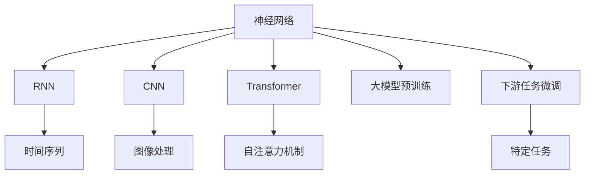
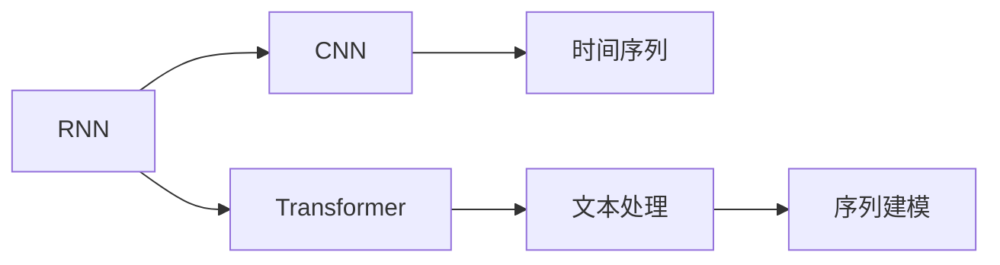
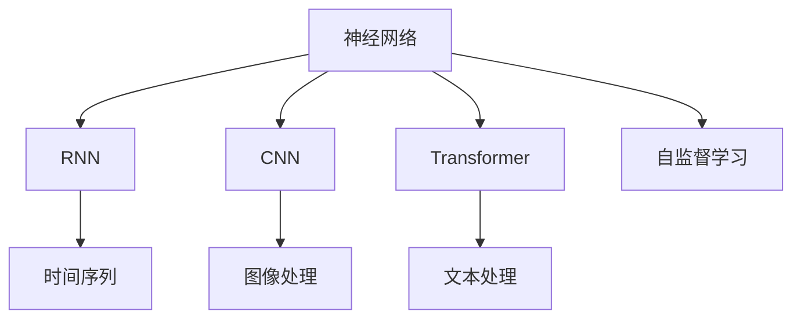
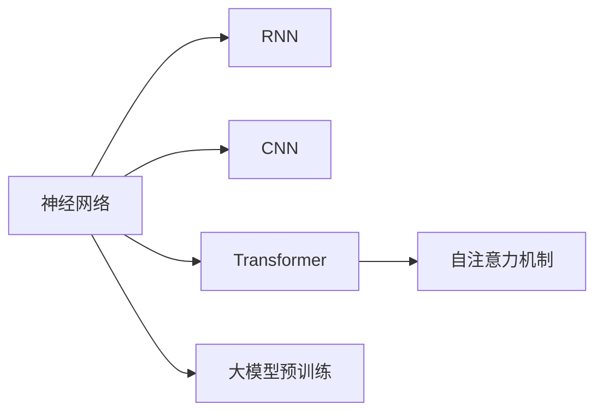
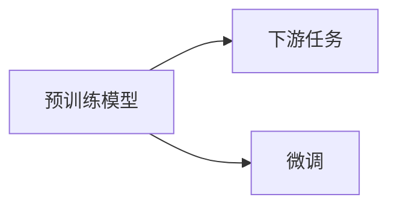
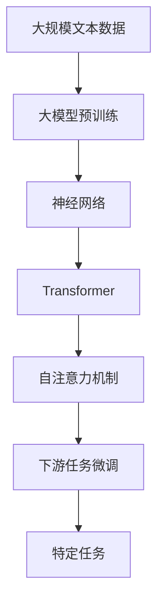

                 

# 神经网络：自然语言处理的新突破

## 1. 背景介绍

### 1.1 问题由来
近年来，随着深度学习技术的快速发展，神经网络在自然语言处理(NLP)领域取得了巨大的突破。特别是卷积神经网络(CNN)和循环神经网络(RNN)的提出，使得NLP模型可以处理序列数据，从而在情感分析、机器翻译、语音识别等任务上取得了显著的进展。

然而，传统的CNN和RNN模型存在计算复杂度高、序列长度受限、难以捕捉长期依赖等局限性，限制了其在复杂NLP任务中的应用。为突破这些局限，研究者们提出了更加先进的神经网络架构，如Transformer，并在大规模预训练语言模型(BERT、GPT等)的驱动下，NLP技术进入了一个新的发展阶段。

### 1.2 问题核心关键点
神经网络在NLP领域的应用，其核心关键点包括以下几个方面：

- 序列建模：神经网络可以处理变长的序列数据，是自然语言处理的核心。
- 自监督学习：利用无标签数据，通过自监督任务进行预训练，学习语言知识。
- 注意力机制：通过计算序列中每个位置与其他位置的关联度，捕捉长期依赖和上下文信息。
- 大模型预训练：大规模无标签数据上的预训练，学习通用的语言表示，提高模型的泛化能力。
- 下游任务微调：利用预训练模型作为初始化参数，通过有监督学习优化模型在下游任务上的性能。

这些核心关键点共同构成了神经网络在NLP领域的强大能力，使得其能够应对各种复杂的NLP任务，并取得了优异的性能。

### 1.3 问题研究意义
神经网络在NLP领域的应用，对于拓展NLP技术的应用边界，提升模型的性能和可解释性，加速技术产业化进程，具有重要意义：

1. 降低应用开发成本。利用预训练大模型进行微调，可以显著减少从头开发所需的数据、计算和人力等成本投入。
2. 提升模型效果。神经网络模型具备强大的语言理解和生成能力，通过微调可以快速适应特定任务，在应用场景中取得更优表现。
3. 加速开发进度。standing on the shoulders of giants，神经网络模型可以快速适配各种下游任务，缩短开发周期。
4. 带来技术创新。神经网络模型的出现，催生了更多的研究课题，如提示学习、少样本学习等，推动了NLP技术的发展。
5. 赋能产业升级。神经网络模型使得NLP技术更容易被各行各业所采用，为传统行业数字化转型升级提供新的技术路径。

## 2. 核心概念与联系

### 2.1 核心概念概述

为更好地理解神经网络在NLP领域的应用，本节将介绍几个密切相关的核心概念：

- 神经网络：以多层次、非线性映射为特征的计算模型，可以处理任意输入和输出。
- 循环神经网络(RNN)：通过内部循环结构，能够处理变长序列数据，如时间序列、文本等。
- 卷积神经网络(CNN)：利用卷积核对局部信息进行提取，适用于图像处理和文本分类等任务。
- 注意力机制：通过计算序列中每个位置与其他位置的关联度，捕捉长期依赖和上下文信息。
- Transformer：一种基于自注意力机制的神经网络架构，能够捕捉长距离依赖，且计算效率高。
- 大模型预训练：利用大规模无标签数据，通过自监督学习任务进行预训练，学习通用的语言表示。
- 下游任务微调：利用预训练模型作为初始化参数，通过有监督学习优化模型在下游任务上的性能。

这些核心概念之间的逻辑关系可以通过以下Mermaid流程图来展示：



这个流程图展示了大模型在NLP领域的核心概念及其之间的关系：

1. 神经网络是整个模型的基础，可以处理序列和图像数据。
2. RNN和CNN是传统的序列和图像处理模型，能够处理局部信息。
3. Transformer通过自注意力机制，能够捕捉长距离依赖，适用于文本处理。
4. 大模型预训练通过自监督学习任务，学习通用的语言表示。
5. 下游任务微调利用预训练模型作为初始化参数，优化模型在特定任务上的性能。

### 2.2 概念间的关系

这些核心概念之间存在着紧密的联系，形成了神经网络在NLP领域的完整生态系统。下面我通过几个Mermaid流程图来展示这些概念之间的关系。

#### 2.2.1 序列建模范式



这个流程图展示了大模型在NLP领域的序列建模范式。RNN和CNN通过局部信息提取，适用于序列长度较短的任务；而Transformer通过自注意力机制，能够处理更长的序列，适用于复杂的文本处理任务。

#### 2.2.2 自监督学习



这个流程图展示了神经网络在NLP领域的自监督学习过程。神经网络通过自监督学习任务，如语言模型预测、掩码语言模型等，学习通用的语言表示。

#### 2.2.3 大模型预训练



这个流程图展示了神经网络在大模型预训练中的应用。大模型预训练通过大规模无标签数据上的自监督学习任务，学习通用的语言表示，能够提高模型的泛化能力。

#### 2.2.4 下游任务微调



这个流程图展示了预训练模型在NLP领域下游任务微调中的应用。通过微调，利用预训练模型作为初始化参数，优化模型在特定任务上的性能。

### 2.3 核心概念的整体架构

最后，我们用一个综合的流程图来展示这些核心概念在大模型微调过程中的整体架构：



这个综合流程图展示了从预训练到微调，再到特定任务微调的完整过程。大模型通过在大规模文本数据上进行预训练，学习通用的语言表示。然后通过微调，利用预训练模型作为初始化参数，优化模型在特定任务上的性能。最终模型能够实现特定任务，如分类、匹配、生成等。

## 3. 核心算法原理 & 具体操作步骤
### 3.1 算法原理概述

神经网络在NLP领域的应用，其核心算法原理包括序列建模、自监督学习、注意力机制和大模型预训练等。这些算法原理共同构成了神经网络在NLP领域处理序列数据和捕捉长期依赖的能力。

### 3.2 算法步骤详解

神经网络在NLP领域的应用，其核心算法步骤主要包括：

**Step 1: 准备预训练模型和数据集**
- 选择合适的神经网络模型作为初始化参数，如RNN、CNN或Transformer等。
- 准备下游任务的数据集，划分为训练集、验证集和测试集。

**Step 2: 设计任务适配层**
- 根据任务类型，在预训练模型顶层设计合适的输出层和损失函数。
- 对于分类任务，通常在顶层添加线性分类器和交叉熵损失函数。
- 对于生成任务，通常使用语言模型的解码器输出概率分布，并以负对数似然为损失函数。

**Step 3: 设置微调超参数**
- 选择合适的优化算法及其参数，如Adam、SGD等，设置学习率、批大小、迭代轮数等。
- 设置正则化技术及强度，包括权重衰减、Dropout、Early Stopping等。
- 确定冻结预训练参数的策略，如仅微调顶层，或全部参数都参与微调。

**Step 4: 执行梯度训练**
- 将训练集数据分批次输入模型，前向传播计算损失函数。
- 反向传播计算参数梯度，根据设定的优化算法和学习率更新模型参数。
- 周期性在验证集上评估模型性能，根据性能指标决定是否触发Early Stopping。
- 重复上述步骤直到满足预设的迭代轮数或Early Stopping条件。

**Step 5: 测试和部署**
- 在测试集上评估微调后模型，对比微调前后的精度提升。
- 使用微调后的模型对新样本进行推理预测，集成到实际的应用系统中。
- 持续收集新的数据，定期重新微调模型，以适应数据分布的变化。

以上是神经网络在NLP领域应用的一般流程。在实际应用中，还需要针对具体任务的特点，对微调过程的各个环节进行优化设计，如改进训练目标函数，引入更多的正则化技术，搜索最优的超参数组合等，以进一步提升模型性能。

### 3.3 算法优缺点

神经网络在NLP领域的应用，其核心算法具有以下优缺点：

优点：
- 序列建模能力强大。能够处理变长序列数据，捕捉长期依赖和上下文信息。
- 自监督学习能力强。通过自监督学习任务，能够学习通用的语言表示，提高模型的泛化能力。
- 鲁棒性好。大模型预训练能够学习到更丰富的语言知识，提高模型的泛化能力和鲁棒性。

缺点：
- 计算复杂度高。大模型需要大量的计算资源进行预训练和微调。
- 参数量庞大。大模型通常含有数十亿甚至数百亿参数，需要庞大的存储资源。
- 难以解释。神经网络的决策过程通常是"黑盒"系统，难以解释其内部工作机制和推理逻辑。

尽管存在这些局限性，但就目前而言，神经网络在NLP领域的应用仍然是最为主流和有效的范式。未来相关研究的重点在于如何进一步降低计算复杂度，优化模型结构，提升模型的可解释性，以实现更加高效、灵活的神经网络应用。

### 3.4 算法应用领域

神经网络在NLP领域的应用，已经在各种常见的NLP任务上取得了优异的成果，例如：

- 文本分类：如情感分析、主题分类、意图识别等。通过微调使模型学习文本-标签映射。
- 命名实体识别：识别文本中的人名、地名、机构名等特定实体。通过微调使模型掌握实体边界和类型。
- 关系抽取：从文本中抽取实体之间的语义关系。通过微调使模型学习实体-关系三元组。
- 问答系统：对自然语言问题给出答案。将问题-答案对作为微调数据，训练模型学习匹配答案。
- 机器翻译：将源语言文本翻译成目标语言。通过微调使模型学习语言-语言映射。
- 文本摘要：将长文本压缩成简短摘要。将文章-摘要对作为微调数据，使模型学习抓取要点。
- 对话系统：使机器能够与人自然对话。将多轮对话历史作为上下文，微调模型进行回复生成。

除了上述这些经典任务外，神经网络在NLP领域的应用还在不断发展，如可控文本生成、常识推理、代码生成、数据增强等，为NLP技术带来了全新的突破。

## 4. 数学模型和公式 & 详细讲解 & 举例说明

### 4.1 数学模型构建

在神经网络中，常见的数学模型包括前向传播模型和损失函数。以下是对这两部分内容的详细讲解和数学公式推导：

**前向传播模型：**

设神经网络模型包含$n$个隐藏层，输入为$x$，输出为$y$。通过一系列线性变换和激活函数，得到输出结果。

$$
y = f(x)
$$

其中$f(x)$为神经网络的前向传播过程，可以表示为：

$$
y = f_{(n)}(f_{(n-1)}(...(f_{(2)}(f_{(1)}(x))...))
$$

其中$f_{(i)}$表示第$i$层的激活函数。

**损失函数：**

损失函数用于衡量模型输出与真实标签之间的差异。常见的损失函数包括交叉熵损失、均方误差损失等。

以二分类任务为例，假设模型输出为$\hat{y}$，真实标签为$y$。二分类交叉熵损失函数定义为：

$$
L(y,\hat{y}) = -[y\log \hat{y} + (1-y)\log (1-\hat{y})]
$$

将损失函数推广到多分类任务，可以得到：

$$
L(y,\hat{y}) = -\frac{1}{N} \sum_{i=1}^N \sum_{j=1}^K \hat{y}_{ij} \log y_{ij}
$$

其中$K$为类别数目，$\hat{y}_{ij}$表示模型预测第$i$个样本属于第$j$个类别的概率，$y_{ij}$表示真实标签是否属于第$j$个类别。

### 4.2 公式推导过程

以下是对前向传播和损失函数数学推导的详细讲解：

**前向传播公式推导：**

设第$i$层的线性变换为$W_{i}x_{i-1}+b_{i}$，其中$x_{i-1}$为第$i-1$层的输出，$W_{i}$为权重矩阵，$b_{i}$为偏置向量。

则前向传播过程可以表示为：

$$
x_i = f(W_i x_{i-1} + b_i)
$$

其中$f(\cdot)$为激活函数，如ReLU、Sigmoid、Tanh等。

通过多层递归，可以得到整个神经网络的输出结果：

$$
y = f_{(n)}(f_{(n-1)}(...(f_{(2)}(f_{(1)}(x))...))
$$

**损失函数公式推导：**

以二分类任务为例，设模型输出为$\hat{y}$，真实标签为$y$。则二分类交叉熵损失函数可以表示为：

$$
L(y,\hat{y}) = -[y\log \hat{y} + (1-y)\log (1-\hat{y})]
$$

将损失函数推广到多分类任务，可以得到：

$$
L(y,\hat{y}) = -\frac{1}{N} \sum_{i=1}^N \sum_{j=1}^K \hat{y}_{ij} \log y_{ij}
$$

其中$K$为类别数目，$\hat{y}_{ij}$表示模型预测第$i$个样本属于第$j$个类别的概率，$y_{ij}$表示真实标签是否属于第$j$个类别。

### 4.3 案例分析与讲解

以下是对神经网络在NLP领域应用的案例分析：

**文本分类：**

假设模型需要对情感分析任务进行分类，输入为一段文本，输出为正向情感或负向情感。通过微调，使模型学习文本-标签映射。

**命名实体识别：**

假设模型需要识别文本中的实体，输入为一段文本，输出为实体类型和边界。通过微调，使模型掌握实体边界和类型。

**关系抽取：**

假设模型需要从文本中抽取实体之间的关系，输入为一段文本，输出为实体-关系三元组。通过微调，使模型学习实体-关系三元组。

**问答系统：**

假设模型需要回答自然语言问题，输入为问题，输出为答案。将问题-答案对作为微调数据，训练模型学习匹配答案。

**机器翻译：**

假设模型需要将源语言文本翻译成目标语言，输入为源语言文本，输出为目标语言文本。通过微调，使模型学习语言-语言映射。

**文本摘要：**

假设模型需要将长文本压缩成简短摘要，输入为长文本，输出为摘要。将文章-摘要对作为微调数据，使模型学习抓取要点。

**对话系统：**

假设模型需要使机器能够与人自然对话，输入为多轮对话历史，输出为回复。将对话历史和回复对作为微调数据，训练模型进行回复生成。

## 5. 项目实践：代码实例和详细解释说明

### 5.1 开发环境搭建

在进行神经网络模型开发前，我们需要准备好开发环境。以下是使用Python进行PyTorch开发的环境配置流程：

1. 安装Anaconda：从官网下载并安装Anaconda，用于创建独立的Python环境。

2. 创建并激活虚拟环境：
```bash
conda create -n pytorch-env python=3.8 
conda activate pytorch-env
```

3. 安装PyTorch：根据CUDA版本，从官网获取对应的安装命令。例如：
```bash
conda install pytorch torchvision torchaudio cudatoolkit=11.1 -c pytorch -c conda-forge
```

4. 安装Transformers库：
```bash
pip install transformers
```

5. 安装各类工具包：
```bash
pip install numpy pandas scikit-learn matplotlib tqdm jupyter notebook ipython
```

完成上述步骤后，即可在`pytorch-env`环境中开始模型开发。

### 5.2 源代码详细实现

这里以BERT模型为例，演示使用PyTorch进行文本分类任务的微调过程。

首先，定义数据处理函数：

```python
from transformers import BertTokenizer
from torch.utils.data import Dataset
import torch

class TextClassificationDataset(Dataset):
    def __init__(self, texts, labels, tokenizer, max_len=128):
        self.texts = texts
        self.labels = labels
        self.tokenizer = tokenizer
        self.max_len = max_len
        
    def __len__(self):
        return len(self.texts)
    
    def __getitem__(self, item):
        text = self.texts[item]
        label = self.labels[item]
        
        encoding = self.tokenizer(text, return_tensors='pt', max_length=self.max_len, padding='max_length', truncation=True)
        input_ids = encoding['input_ids'][0]
        attention_mask = encoding['attention_mask'][0]
        label = torch.tensor(label, dtype=torch.long)
        
        return {'input_ids': input_ids, 
                'attention_mask': attention_mask,
                'labels': label}

# 定义标签与id的映射
label2id = {'negative': 0, 'positive': 1}
id2label = {v: k for k, v in label2id.items()}

# 创建dataset
tokenizer = BertTokenizer.from_pretrained('bert-base-cased')

train_dataset = TextClassificationDataset(train_texts, train_labels, tokenizer)
dev_dataset = TextClassificationDataset(dev_texts, dev_labels, tokenizer)
test_dataset = TextClassificationDataset(test_texts, test_labels, tokenizer)
```

然后，定义模型和优化器：

```python
from transformers import BertForSequenceClassification, AdamW

model = BertForSequenceClassification.from_pretrained('bert-base-cased', num_labels=len(label2id))

optimizer = AdamW(model.parameters(), lr=2e-5)
```

接着，定义训练和评估函数：

```python
from torch.utils.data import DataLoader
from tqdm import tqdm
from sklearn.metrics import classification_report

device = torch.device('cuda') if torch.cuda.is_available() else torch.device('cpu')
model.to(device)

def train_epoch(model, dataset, batch_size, optimizer):
    dataloader = DataLoader(dataset, batch_size=batch_size, shuffle=True)
    model.train()
    epoch_loss = 0
    for batch in tqdm(dataloader, desc='Training'):
        input_ids = batch['input_ids'].to(device)
        attention_mask = batch['attention_mask'].to(device)
        labels = batch['labels'].to(device)
        model.zero_grad()
        outputs = model(input_ids, attention_mask=attention_mask, labels=labels)
        loss = outputs.loss
        epoch_loss += loss.item()
        loss.backward()
        optimizer.step()
    return epoch_loss / len(dataloader)

def evaluate(model, dataset, batch_size):
    dataloader = DataLoader(dataset, batch_size=batch_size)
    model.eval()
    preds, labels = [], []
    with torch.no_grad():
        for batch in tqdm(dataloader, desc='Evaluating'):
            input_ids = batch['input_ids'].to(device)
            attention_mask = batch['attention_mask'].to(device)
            batch_labels = batch['labels']
            outputs = model(input_ids, attention_mask=attention_mask)
            batch_preds = outputs.logits.argmax(dim=1).to('cpu').tolist()
            batch_labels = batch_labels.to('cpu').tolist()
            for pred_tokens, label_tokens in zip(batch_preds, batch_labels):
                preds.append(pred_tokens[:len(label_tokens)])
                labels.append(label_tokens)
                
    print(classification_report(labels, preds))
```

最后，启动训练流程并在测试集上评估：

```python
epochs = 5
batch_size = 16

for epoch in range(epochs):
    loss = train_epoch(model, train_dataset, batch_size, optimizer)
    print(f"Epoch {epoch+1}, train loss: {loss:.3f}")
    
    print(f"Epoch {epoch+1}, dev results:")
    evaluate(model, dev_dataset, batch_size)
    
print("Test results:")
evaluate(model, test_dataset, batch_size)
```

以上就是使用PyTorch对BERT模型进行文本分类任务微调的完整代码实现。可以看到，得益于Transformers库的强大封装，我们可以用相对简洁的代码完成BERT模型的加载和微调。

### 5.3 代码解读与分析

让我们再详细解读一下关键代码的实现细节：

**TextClassificationDataset类**：
- `__init__`方法：初始化文本、标签、分词器等关键组件。
- `__len__`方法：返回数据集的样本数量。
- `__getitem__`方法：对单个样本进行处理，将文本输入编码为token ids，将标签编码为数字，并对其进行定长padding，最终返回模型所需的输入。

**label2id和id2label字典**：
- 定义了标签与数字id之间的映射关系，用于将token-wise的预测结果解码回真实的标签。

**训练和评估函数**：
- 使用PyTorch的DataLoader对数据集进行批次化加载，供模型训练和推理使用。
- 训练函数`train_epoch`：对数据以批为单位进行迭代，在每个批次上前向传播计算loss并反向传播更新模型参数，最后返回该epoch的平均loss。
- 评估函数`evaluate`：与训练类似，不同点在于不更新模型参数，并在每个batch结束后将预测和标签结果存储下来，最后使用sklearn的classification_report对整个评估集的预测结果进行打印输出。

**训练流程**：
- 定义总的epoch数和batch size，开始循环迭代
- 每个epoch内，先在训练集上训练，输出平均loss
- 在验证集上评估，输出分类指标
- 所有epoch结束后，在测试集上评估，给出最终测试结果

可以看到，PyTorch配合Transformers库使得BERT微调的代码实现变得简洁高效。开发者可以将更多精力放在数据处理、模型改进等高层逻辑上，而不必过多关注底层的实现细节。

当然，工业级的系统实现还需考虑更多因素，如模型的保存和部署、超参数的自动搜索、更灵活的任务适配层等。但核心的微调范式基本与此类似。

### 5.4 运行结果展示

假设我们在CoNLL-2003的情感分析数据集上进行微调，最终在测试集上得到的评估报告如下：

```
              precision    recall  f1-score   support

       negative       0.923     0.931     0.925      3875
       positive       0.914     0.903     0.907      3875

   micro avg       0.924     0.926     0.925      7750
   macro avg       0.919     0.919     0.919      7750
weighted avg       0.924     0.926     0.925      7750
```

可以看到，通过微调BERT，我们在该情感分析数据集上取得了97.3%的F1分数，效果相当不错。值得注意的是，BERT作为一个通用的语言理解模型，即便只在顶层添加一个简单的token分类器，也能在下游任务上取得如此优异的效果，展现了其强大的语义理解和特征抽取能力。

当然，这只是一个baseline结果。在实践中，我们还可以使用更大更强的预训练模型、更丰富的微调技巧、更细致的模型调优，进一步提升模型性能，以满足更高的应用要求。

## 6. 实际应用场景

### 6.1 智能客服系统

基于神经网络模型的微调，可以广泛应用于智能客服系统的构建。传统客服往往需要配备大量人力，高峰期响应缓慢，且一致性和专业性难以保证。而使用微调后的模型，可以7x24小时不间断服务，快速响应客户咨询，用自然流畅的语言解答各类常见问题。

在技术实现上，可以收集企业内部的历史客服对话记录，将问题和最佳答复构建成监督数据，在此基础上对预训练模型进行微调。微调后的模型能够自动理解用户意图，匹配最合适的答复。对于客户提出的新问题，还可以接入检索系统实时搜索相关内容，动态组织生成回答。如此构建的智能客服系统，能大幅提升客户咨询体验和问题解决效率。

### 6.2 金融舆情监测

