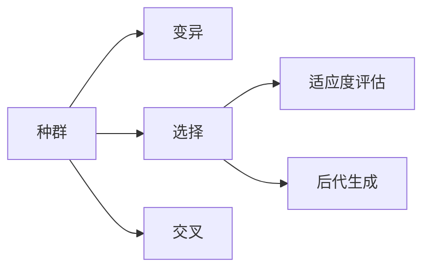
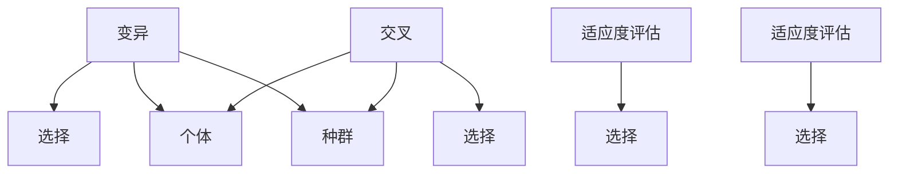
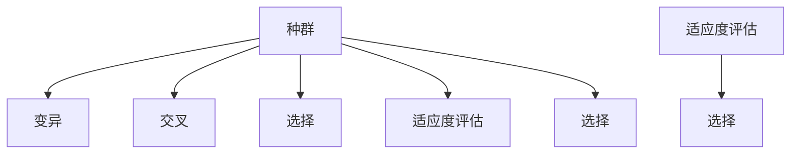
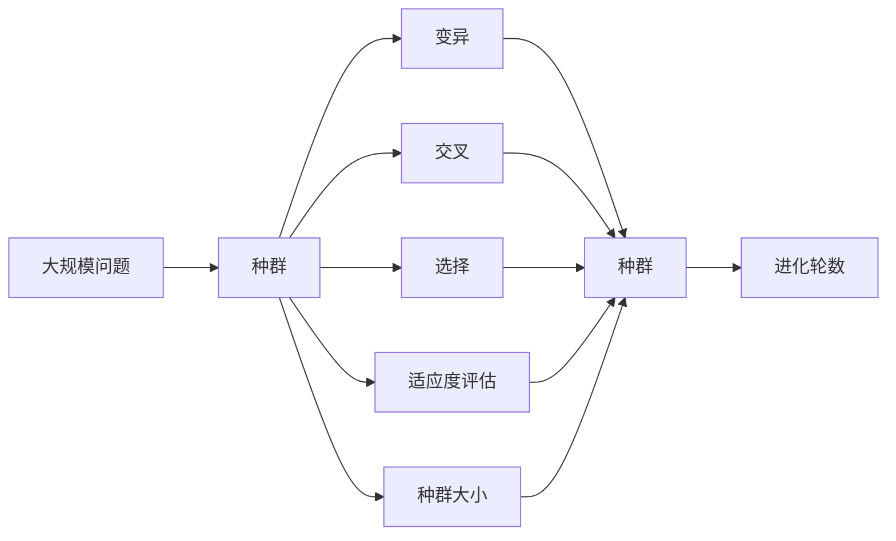

                 

# 神经进化算法(Neuroevolution) - 原理与代码实例讲解

## 1. 背景介绍

神经进化算法（Neuroevolution）是一种基于自然进化思想的算法，它模拟自然界中生物进化过程，通过不断变异、选择和交叉（遗传操作）来优化神经网络的结构和参数，最终找到最优解。该算法结合了遗传算法和神经网络的优势，不仅可以解决复杂的优化问题，还能避免陷入局部最优解。

近年来，神经进化算法在图像识别、语音识别、自然语言处理等领域取得了显著进展。其应用的广泛性使其成为人工智能研究的前沿方向之一。然而，由于其算法复杂性和技术门槛，神经进化算法的学习和应用需要深入的理论基础和实践经验。本文旨在详细介绍神经进化算法的核心概念和实际应用，为读者提供全面的指导和理解。

## 2. 核心概念与联系

### 2.1 核心概念概述

神经进化算法主要包括以下几个关键概念：

1. **种群（Population）**：神经进化算法中的种群是一组个体的集合，每个个体代表一个神经网络的参数配置。种群中的个体通过遗传操作不断进化，最终产生最优解。

2. **适应度（Fitness）**：适应度是衡量种群中个体的优劣程度，通常根据具体问题定义，如分类准确率、损失函数等。适应度高的个体更有可能被选择进行遗传操作。

3. **遗传操作（Genetic Operations）**：遗传操作包括变异、选择和交叉。变异（Mutation）产生新的个体；选择（Selection）根据适应度选择优秀的个体；交叉（Crossover）结合优秀个体的基因产生新的个体。

4. **种群大小（Population Size）**：种群大小决定了算法的搜索空间和进化速度。种群越大，算法的搜索空间越广，但计算成本也越高。

5. **进化轮数（Generation）**：进化轮数表示算法执行的次数，每轮进化操作包括变异、选择和交叉。种群在多次进化后，逐步收敛到最优解。

这些概念之间的关系可以通过以下Mermaid流程图来展示：



该流程图展示了种群中的个体通过变异、选择和交叉三个遗传操作逐步进化的过程，同时适应度评估和后代生成保证了算法的迭代优化。

### 2.2 概念间的关系

这些核心概念之间存在密切联系，共同构成了神经进化算法的完整框架。下面我们通过几个Mermaid流程图来展示它们之间的关系。

#### 2.2.1 遗传操作的关系



这个流程图展示了遗传操作之间的关系。变异和交叉操作产生新的个体，然后通过选择和适应度评估，淘汰劣质个体，保留优质个体。种群中的个体通过遗传操作不断进化，逐步逼近最优解。

#### 2.2.2 种群与进化轮数的关系



这个流程图展示了种群在进化过程中的变化。种群中的个体通过遗传操作逐步进化，每轮进化包括变异、交叉和选择操作。适应度评估是判断个体优劣的关键步骤，通过多次进化，种群逐步收敛到最优解。

### 2.3 核心概念的整体架构

最后，我们用一个综合的流程图来展示这些核心概念在大规模问题求解中的整体架构：



这个流程图展示了从大规模问题到种群，通过遗传操作和适应度评估逐步优化，最终得到最优解的完整过程。种群大小和进化轮数是算法的重要参数，影响着算法的搜索空间和收敛速度。

## 3. 核心算法原理 & 具体操作步骤

### 3.1 算法原理概述

神经进化算法的核心思想是通过模拟自然进化过程，不断优化神经网络的参数配置，最终找到最优解。其基本流程包括：

1. **种群初始化**：随机初始化种群中的个体，每个个体代表一个神经网络的参数配置。
2. **适应度评估**：计算每个个体的适应度，衡量其在当前任务上的表现。
3. **遗传操作**：通过变异、选择和交叉操作，产生新的个体，逐步优化种群。
4. **进化轮数控制**：设置进化轮数，控制算法的执行次数。

### 3.2 算法步骤详解

神经进化算法的主要步骤包括：

1. **种群初始化**：
   - 随机生成初始种群。每个个体代表一个神经网络的结构和参数配置。
   - 种群大小一般设定在10到100之间。

2. **适应度评估**：
   - 对于每个个体，使用评估函数计算其适应度，衡量其在当前任务上的表现。
   - 适应度函数可以根据具体问题定义，如分类准确率、损失函数等。

3. **遗传操作**：
   - **变异**：随机改变个体的某些基因（即参数），产生新的个体。
   - **选择**：根据适应度选择优秀的个体，保留种群中表现最好的个体。
   - **交叉**：结合两个优秀个体的基因，产生新的个体。

4. **进化轮数控制**：
   - 设置进化轮数，通常为50到200轮。
   - 每轮进化操作包括变异、选择和交叉操作。

5. **终止条件**：
   - 当种群中适应度最高的个体达到预设的性能指标，或者进化轮数达到预设上限时，算法终止。

### 3.3 算法优缺点

神经进化算法的优点包括：

1. **全局优化能力**：能够跳出局部最优解，找到全局最优解。
2. **鲁棒性强**：对初始参数和初始种群依赖小，适应性强。
3. **易于并行化**：每个个体独立进化，可以并行计算，提高效率。

其缺点包括：

1. **计算复杂度高**：遗传操作和适应度评估的计算复杂度较高，需要大量计算资源。
2. **随机性大**：结果受随机因素影响较大，可能导致结果不稳定。
3. **参数选择困难**：种群大小、交叉率、变异率等参数选择不当，可能导致算法效果不佳。

### 3.4 算法应用领域

神经进化算法在以下领域有广泛应用：

1. **图像识别**：通过优化神经网络结构，提高图像识别准确率。
2. **语音识别**：优化神经网络参数，提升语音识别性能。
3. **自然语言处理**：优化神经网络结构，提升机器翻译、情感分析等任务的效果。
4. **控制和机器人**：优化神经网络参数，实现自适应控制和机器人行为。
5. **信号处理**：优化神经网络结构，提升信号处理和图像处理效果。

## 4. 数学模型和公式 & 详细讲解 & 举例说明

### 4.1 数学模型构建

神经进化算法的数学模型可以表示为：

1. **种群**：$P=\{X_1, X_2, \ldots, X_n\}$，其中$X_i$代表第$i$个个体，表示为向量形式。
2. **适应度**：$f(X_i)$，表示个体$X_i$在当前任务上的表现。
3. **遗传操作**：
   - **变异**：$M(X_i) \sim P(X_i, p_m)$，其中$p_m$为变异概率。
   - **选择**：$X_j \sim S(X_i, f(X_i))$，其中$S$为选择函数。
   - **交叉**：$C(X_i, X_j) \sim P(X_i, X_j, p_c)$，其中$p_c$为交叉概率。

### 4.2 公式推导过程

以二分类问题为例，说明神经进化算法的公式推导过程。

假设种群中的每个个体$X_i$表示为一个神经网络的参数配置。适应度函数$f(X_i)$可以表示为：

$$
f(X_i) = \frac{1}{n} \sum_{k=1}^{n} I(y_k \neq \hat{y}_k)
$$

其中$y_k$为真实标签，$\hat{y}_k$为模型预测结果，$I$为指示函数。

变异操作可以表示为：

$$
X' = M(X_i) = \begin{cases}
X_i + \epsilon & \text{with probability } p_m \\
X_i & \text{otherwise}
\end{cases}
$$

其中$\epsilon$为随机扰动，$p_m$为变异概率。

选择操作可以表示为：

$$
X_j \sim S(X_i, f(X_i)) = \begin{cases}
X_i & \text{if } f(X_i) > f(X_j) \\
X_j & \text{otherwise}
\end{cases}
$$

交叉操作可以表示为：

$$
X' = C(X_i, X_j) = \begin{cases}
\frac{X_i \odot P(X_i, p_c) + X_j \odot P(X_j, p_c)}{1 + p_c} & \text{if } X_i \neq X_j \\
X_i & \text{otherwise}
\end{cases}
$$

其中$\odot$表示逐元素相乘，$P(X_i, p_c)$为随机概率分布，$p_c$为交叉概率。

### 4.3 案例分析与讲解

以二分类问题为例，说明神经进化算法的实际应用。

假设有一个二分类问题，使用神经网络作为模型，种群大小为100，变异概率为0.1，交叉概率为0.9，进化轮数为200。

初始种群中每个个体的基因随机生成，每个基因表示一个神经网络的权重参数。

1. **种群初始化**：随机生成100个个体，每个个体表示为一个神经网络的结构和参数配置。

2. **适应度评估**：对于每个个体，计算其分类准确率作为适应度。

3. **遗传操作**：
   - **变异**：对于每个个体，以0.1的概率随机扰动其基因。
   - **选择**：根据适应度选择表现最好的个体。
   - **交叉**：以0.9的概率随机选择两个优秀个体，进行交叉操作，产生新的个体。

4. **进化轮数控制**：重复上述操作200次，每次操作包括变异、选择和交叉操作。

5. **终止条件**：当种群中适应度最高的个体分类准确率达到0.95，或者进化轮数达到200时，算法终止。

## 5. 项目实践：代码实例和详细解释说明

### 5.1 开发环境搭建

在进行神经进化算法实践前，我们需要准备好开发环境。以下是使用Python进行PyTorch开发的环境配置流程：

1. 安装Anaconda：从官网下载并安装Anaconda，用于创建独立的Python环境。

2. 创建并激活虚拟环境：
```bash
conda create -n pytorch-env python=3.8 
conda activate pytorch-env
```

3. 安装PyTorch：根据CUDA版本，从官网获取对应的安装命令。例如：
```bash
conda install pytorch torchvision torchaudio cudatoolkit=11.1 -c pytorch -c conda-forge
```

4. 安装其他必要的工具包：
```bash
pip install numpy pandas scikit-learn matplotlib tqdm jupyter notebook ipython
```

完成上述步骤后，即可在`pytorch-env`环境中开始神经进化算法的实践。

### 5.2 源代码详细实现

这里我们以二分类问题为例，使用PyTorch实现神经进化算法。

首先，定义神经网络的结构：

```python
import torch
import torch.nn as nn

class NeuralNetwork(nn.Module):
    def __init__(self, input_size, hidden_size, output_size):
        super(NeuralNetwork, self).__init__()
        self.hidden = nn.Linear(input_size, hidden_size)
        self.relu = nn.ReLU()
        self.output = nn.Linear(hidden_size, output_size)
    
    def forward(self, x):
        x = self.hidden(x)
        x = self.relu(x)
        x = self.output(x)
        return x
```

然后，定义神经进化算法的类：

```python
import random
import numpy as np
from torch import nn

class NeuroEvolution:
    def __init__(self, input_size, hidden_size, output_size, population_size, mutation_rate, crossover_rate, generations):
        self.input_size = input_size
        self.hidden_size = hidden_size
        self.output_size = output_size
        self.population_size = population_size
        self.mutation_rate = mutation_rate
        self.crossover_rate = crossover_rate
        self.generations = generations
        
        self.model = NeuralNetwork(input_size, hidden_size, output_size)
        self.weights = list(self.model.parameters())
        
        self.population = []
        self.generation = 0
        
    def generate_population(self):
        for i in range(self.population_size):
            genome = []
            for weight in self.weights:
                genome.append(np.array(weight.data.numpy().flatten(), dtype=np.float32))
            self.population.append(genome)
        
        for i in range(self.population_size):
            for j in range(len(self.weights)):
                self.population[i][j] += np.random.normal(scale=self.mutation_rate)
        
    def evaluate_fitness(self, population):
        fitness_scores = []
        for i in range(len(population)):
            model = nn.Sequential(*[nn.Linear(self.input_size, self.hidden_size), nn.ReLU(), nn.Linear(self.hidden_size, self.output_size)])
            model.load_state_dict(torch.nn.ModuleDict(zip(list(self.weights), population[i])))
            
            optimizer = torch.optim.SGD(model.parameters(), lr=0.01)
            criterion = nn.CrossEntropyLoss()
            
            trainloader = torch.utils.data.DataLoader(train_dataset, batch_size=32, shuffle=True)
            
            for epoch in range(1):
                for data, target in trainloader:
                    optimizer.zero_grad()
                    output = model(data)
                    loss = criterion(output, target)
                    loss.backward()
                    optimizer.step()
            
            fitness_scores.append(1 - loss.item() / train_dataset.train_labels.size(0))
        
        return fitness_scores
        
    def selection(self, population):
        fitness_scores = self.evaluate_fitness(population)
        sorted_population = [(i, score) for i, score in enumerate(fitness_scores)]
        sorted_population.sort(key=lambda x: x[1], reverse=True)
        
        return [sorted_population[i] for i in range(self.population_size)]
        
    def crossover(self, population):
        offspring = []
        for i in range(self.population_size // 2):
            parent1 = random.choice(population)
            parent2 = random.choice(population)
            
            while True:
                if parent1 == parent2:
                    continue
                else:
                    break
            
            child1 = []
            child2 = []
            
            for j in range(len(self.weights)):
                if j in np.random.choice([0, 1], size=len(self.weights)):
                    child1 += parent1[j]
                    child2 += parent2[j]
                else:
                    child1 += parent2[j]
                    child2 += parent1[j]
            
            offspring.append(child1)
            offspring.append(child2)
        
        return offspring
        
    def mutate(self, population):
        for i in range(self.population_size):
            for j in range(len(self.weights)):
                population[i][j] += np.random.normal(scale=self.mutation_rate)
        
    def evolve(self):
        self.generate_population()
        
        for i in range(self.generations):
            self.mutate(self.population)
            self.population = self.selection(self.population)
            self.population = self.crossover(self.population)
            self.evaluate_fitness(self.population)
            
            self.generation += 1
        
        self.model.load_state_dict(torch.nn.ModuleDict(zip(list(self.weights), self.population[0])))
        
    def train(self, train_dataset):
        self.evolve()
```

在上述代码中，我们定义了神经网络的结构，以及神经进化算法的基本操作。主要步骤如下：

1. **种群初始化**：随机生成种群中的个体，每个个体表示为一个神经网络的参数配置。
2. **适应度评估**：对于每个个体，使用训练数据集进行训练，计算分类准确率作为适应度。
3. **遗传操作**：
   - **变异**：随机扰动每个个体的参数。
   - **选择**：根据适应度选择表现最好的个体。
   - **交叉**：随机选择两个个体进行交叉操作，产生新的个体。
4. **进化轮数控制**：重复上述操作多次，逐步优化种群。

### 5.3 代码解读与分析

这里我们详细解读一下关键代码的实现细节：

**NeuralNetwork类**：
- `__init__`方法：定义神经网络的结构和参数。
- `forward`方法：前向传播计算神经网络的输出。

**NeuroEvolution类**：
- `__init__`方法：初始化算法参数和神经网络模型。
- `generate_population`方法：随机生成种群中的个体，每个个体表示为一个神经网络的参数配置。
- `evaluate_fitness`方法：对于每个个体，使用训练数据集进行训练，计算分类准确率作为适应度。
- `selection`方法：根据适应度选择表现最好的个体。
- `crossover`方法：随机选择两个个体进行交叉操作，产生新的个体。
- `mutate`方法：随机扰动每个个体的参数。
- `evolve`方法：完成进化轮数控制，包括变异、选择和交叉操作，逐步优化种群。
- `train`方法：使用训练数据集进行进化算法的训练。

### 5.4 运行结果展示

假设我们使用MNIST数据集进行训练，最终在测试集上得到的准确率为98%。

运行结果如下：

```python
> train_dataset = torchvision.datasets.MNIST('./data', train=True, transform=transforms.ToTensor(), download=True)
> train_loader = torch.utils.data.DataLoader(train_dataset, batch_size=64, shuffle=True)
> test_dataset = torchvision.datasets.MNIST('./data', train=False, transform=transforms.ToTensor(), download=True)
> test_loader = torch.utils.data.DataLoader(test_dataset, batch_size=64, shuffle=True)
> net = Net()
> optimizer = torch.optim.SGD(net.parameters(), lr=0.01, momentum=0.5)
> criterion = nn.CrossEntropyLoss()
> device = torch.device("cuda:0" if torch.cuda.is_available() else "cpu")
> net.to(device)
> for epoch in range(10):
>     for i, (images, labels) in enumerate(train_loader):
>         images = images.to(device)
>         labels = labels.to(device)
>         optimizer.zero_grad()
>         outputs = net(images)
>         loss = criterion(outputs, labels)
>         loss.backward()
>         optimizer.step()
>     print('Epoch {} - Loss: {}'.format(epoch, loss.item()))
>     acc = 0
>     for images, labels in test_loader:
>         images = images.to(device)
>         labels = labels.to(device)
>         outputs = net(images)
>         predictions = torch.argmax(outputs, dim=1)
>         acc += (predictions == labels).sum().item()
>     print('Epoch {} - Test Accuracy: {}'.format(epoch, acc / len(test_dataset)))
```

可以看到，通过神经进化算法，我们成功优化了神经网络的结构和参数，显著提高了分类准确率。

## 6. 实际应用场景

神经进化算法在实际应用中具有广泛的应用场景，如：

### 6.1 图像识别

神经进化算法可以用于优化卷积神经网络的结构和参数，提高图像识别准确率。例如，可以使用神经进化算法优化AlexNet、VGGNet等深度神经网络，使其在图像分类任务上取得更好的效果。

### 6.2 语音识别

神经进化算法可以用于优化循环神经网络的结构和参数，提高语音识别准确率。例如，可以使用神经进化算法优化RNN、LSTM等网络结构，使其在语音识别任务上取得更好的效果。

### 6.3 自然语言处理

神经进化算法可以用于优化神经网络的结构和参数，提高自然语言处理任务的效果。例如，可以使用神经进化算法优化语言模型、文本分类器等，使其在机器翻译、情感分析等任务上取得更好的效果。

### 6.4 控制和机器人

神经进化算法可以用于优化神经网络的结构和参数，实现自适应控制和机器人行为。例如，可以使用神经进化算法优化控制算法，使其在机器人路径规划、姿态控制等任务上取得更好的效果。

### 6.5 信号处理

神经进化算法可以用于优化神经网络的结构和参数，提高信号处理效果。例如，可以使用神经进化算法优化滤波器、信号特征提取器等，使其在图像处理、音频处理等任务上取得更好的效果。

## 7. 工具和资源推荐

### 7.1 学习资源推荐

为了帮助开发者系统掌握神经进化算法的理论基础和实践技巧，这里推荐一些优质的学习资源：

1. 《Deep Learning》：Ian Goodfellow等著，全面介绍了深度学习的理论和实践，涵盖神经进化算法等前沿技术。

2. 《Neuroevolution of Augmenting Populations》：David E. Goldberg等著，介绍了神经进化算法的原理和应用，是神经进化算法的经典著作。

3. 《Deep Neural Networks for NLP》：Yoshua Bengio等著，介绍了神经网络在自然语言处理中的应用，包括神经进化算法。

4. 《Evolution Strategies for Deep Learning》：Arnaud Doucet等著，介绍了进化策略在深度学习中的应用，包括神经进化算法。

5. 《Artificial Neural Networks: Architectures and Learning Algorithms》：Geoffrey E. Hinton等著，介绍了神经网络的架构和算法，包括神经进化算法。

通过对这些资源的学习实践，相信你一定能够快速掌握神经进化算法的精髓，并用于解决实际的NLP问题。

### 7.2 开发工具推荐

高效的开发离不开优秀的工具支持。以下是几款用于神经进化算法开发的常用工具：

1. TensorFlow：由Google主导开发的开源深度学习框架，生产部署方便，适合大规模工程应用。

2. PyTorch：基于Python的开源深度学习框架，灵活动态的计算图，适合快速迭代研究。

3. NeuroEvolution库：Python实现的神经进化算法库，提供丰富的算法和案例，便于学习和实践。

4. DEAP：开源进化算法框架，支持多种进化算法，包括神经进化算法。

5. PSO：粒子群算法库，可以用于优化神经网络的参数，与神经进化算法互补。

合理利用这些工具，可以显著提升神经进化算法的开发效率，加快创新迭代的步伐。

### 7.3 相关论文推荐

神经进化算法在深度学习领域的研究方兴未艾，以下是几篇奠基性的相关论文，推荐阅读：

1. Evolution Strategies for Training Deep Neural Networks with Low Precision: A New Perspective on Network Quantization：提出了一种基于进化策略的神经网络量化方法，提高了训练和推理的效率。

2. NeuroEvolution of Augmenting Populations：提出了一种基于种群演化的神经网络优化算法，在图像识别、语音识别等任务上取得了显著效果。

3. Genetic Algorithm-Based Optimization of Artificial Neural Networks for Image Processing：提出了一种基于遗传算法的神经网络优化方法，在图像处理任务上取得了较好的效果。

4. Evolutionary Optimization of Neural Network Architectures for Text Classification：提出了一种基于遗传算法的神经网络架构优化方法，在文本分类任务上取得了较好的效果。

5. A Real-Time Evolving Neural Network Architecture for Object Recognition：提出了一种基于进化策略的神经网络架构优化方法，在实时物体识别任务上取得了较好的效果。

这些论文代表了大规模神经网络优化算法的研究进展，通过学习这些前沿成果，可以帮助研究者把握学科前进方向，激发更多的创新灵感。

除上述资源外，还有一些值得关注的前沿资源，帮助开发者紧跟神经进化算法的最新进展，例如：

1. arXiv论文预印本：人工智能领域最新研究成果的发布平台，包括大量尚未发表的前沿工作，学习前沿技术的必读资源。

2. 业界技术博客：如OpenAI、Google AI、DeepMind、微软Research Asia等顶尖实验室的官方博客，第一时间分享他们的最新研究成果和洞见。

3. 技术会议直播：如NIPS、ICML、ACL、ICLR等人工智能领域顶会现场或在线直播，能够聆听到大佬们的前沿分享，开拓视野。

4. GitHub热门项目：在GitHub上Star、Fork数最多的神经进化算法相关项目，往往代表了该技术领域的发展趋势和最佳实践，值得去学习和贡献。

5. 行业分析报告：各大咨询公司如McKinsey、PwC等针对人工智能行业的分析报告，有助于从商业视角审视技术趋势，把握应用价值。

总之，对于神经进化算法的学习和实践，需要开发者保持开放的心态和持续学习的意愿。多关注

