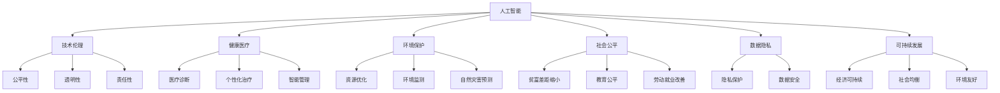

                 

# 科技发展：人类福祉的保障

> 关键词：
> 
> - 人工智能
> - 技术伦理
> - 健康医疗
> - 环境保护
> - 社会公平
> - 数据隐私
> - 可持续发展

## 1. 背景介绍

### 1.1 问题由来
随着科技的迅猛发展，特别是人工智能(AI)的兴起，科技在提高生产效率、改善生活质量、促进社会进步方面发挥了巨大的作用。然而，科技的双刃剑特性也日益显现，给人类社会带来了诸多挑战。如何在享受科技带来便利的同时，保障人类的福祉，成为一个亟待解答的问题。

### 1.2 问题核心关键点
科技发展对人类福祉的影响可以从多个维度进行分析：
- **正面影响**：提高生产效率、促进医疗进步、改善教育质量、增强环境保护能力等。
- **负面影响**：数据隐私泄露、算法偏见、就业替代、环境破坏等。

确保科技发展能够真正造福人类，需平衡技术创新与社会责任，确保科技应用的普惠性和公正性。

### 1.3 问题研究意义
科技与人类福祉的关联是跨学科的研究领域，涵盖伦理学、社会学、心理学、经济学等多个学科。深入研究科技对人类福祉的影响，有助于制定合理的发展策略，推动科技与社会、环境的和谐共生，实现可持续发展目标。

## 2. 核心概念与联系

### 2.1 核心概念概述

为理解科技发展对人类福祉的影响，本节介绍几个关键概念：

- **人工智能(AI)**：通过机器学习、深度学习等技术实现模拟人类智能的技术体系，包括自动驾驶、自然语言处理、计算机视觉等领域。
- **技术伦理(Ethics in Technology)**：探讨科技在发展过程中应遵循的伦理规范，如隐私保护、公平性、透明性、责任性等。
- **健康医疗(Healthcare)**：通过AI技术提高医疗诊断准确性、个性化治疗、智能管理等，提升医疗服务质量。
- **环境保护(Environmental Protection)**：利用AI技术优化资源利用、监测环境变化、预测自然灾害等，实现绿色可持续发展。
- **社会公平(Social Fairness)**：通过AI技术缩小贫富差距、促进教育公平、改善劳动就业等，实现社会的均衡发展。
- **数据隐私(Data Privacy)**：在数据采集、处理和共享过程中，保障个人隐私和数据安全，防止滥用和泄漏。
- **可持续发展(Sustainable Development)**：在满足当前需求的同时，不损害后代满足需求的能力，确保经济、社会、环境的和谐发展。

这些概念间的关系可以通过以下Mermaid流程图来展示：



这个流程图展示了人工智能及其相关领域与人类福祉的不同维度的联系。

### 2.2 概念间的关系

这些核心概念之间存在着紧密的联系，形成了一个复杂的生态系统。以下是几个关键关系：

- **人工智能与技术伦理**：AI技术在应用过程中需要遵循伦理规范，如确保公平、防止偏见、保障隐私等。
- **人工智能与健康医疗**：AI技术可以提升医疗诊断的准确性，辅助个性化治疗，优化医疗资源管理。
- **人工智能与环境保护**：AI技术可以优化资源利用，监测环境变化，预测自然灾害，推动环境可持续发展。
- **人工智能与社会公平**：AI技术可以通过智能化、自动化手段缩小贫富差距，促进教育公平，改善劳动就业条件。
- **人工智能与数据隐私**：在AI应用过程中，必须严格保护个人隐私，防止数据滥用和泄漏。
- **人工智能与可持续发展**：AI技术可以在环境保护、资源利用、经济社会协调等方面推动可持续发展。

通过理解这些核心概念及其关系，可以更好地把握科技发展的方向和目标，为实现科技与人类福祉的和谐共生提供理论基础。

## 3. 核心算法原理 & 具体操作步骤

### 3.1 算法原理概述

**算法原理**：
科技发展对人类福祉的影响可以从多个维度进行量化和评估，涉及自然环境、社会经济、健康医疗等多个领域。通过建立数学模型，可以对科技发展进行综合评价和预测。

**目标**：
建立一套综合评估模型，量化科技发展对人类福祉的影响，预测未来趋势，并提出改善建议。

### 3.2 算法步骤详解

**Step 1: 数据收集与预处理**
- 收集与人类福祉相关的多维度数据，如GDP增长率、失业率、医疗水平、环境质量、社会公平等。
- 对数据进行清洗和标准化处理，确保数据的准确性和一致性。

**Step 2: 模型选择与设计**
- 根据评估目标选择合适的模型，如线性回归、时间序列分析、多维尺度分析等。
- 设计模型结构，包括特征选择、模型参数、算法流程等。

**Step 3: 模型训练与评估**
- 使用训练数据对模型进行训练，调整参数，优化模型性能。
- 在验证数据集上评估模型性能，确保模型泛化能力。

**Step 4: 结果分析与建议**
- 对模型输出结果进行解读，分析科技发展的正面和负面影响。
- 提出改善建议，优化科技发展路径，提升人类福祉。

**Step 5: 模型部署与应用**
- 将训练好的模型部署到实际应用中，进行实时监控和预测。
- 根据模型反馈，不断优化和调整模型，确保模型效果。

### 3.3 算法优缺点

**优点**：
- 量化科技发展对人类福祉的影响，提供科学依据。
- 预测未来趋势，指导科技发展方向。
- 综合评估多个领域，提供全面视角。

**缺点**：
- 模型可能存在数据偏差，评估结果不完全准确。
- 预测结果受限于模型设计，可能存在局限性。
- 模型复杂度高，需要大量计算资源。

### 3.4 算法应用领域

**应用领域**：
- 政府决策支持：评估科技政策对经济、社会、环境的影响，提供政策建议。
- 企业战略规划：预测科技发展趋势，制定企业发展战略。
- 学术研究：评估科技发展对特定领域的影响，提供研究支持。

## 4. 数学模型和公式 & 详细讲解  
### 4.1 数学模型构建

**数学模型**：
- **目标函数**：
  $$
  \min_{\theta} \sum_{i=1}^n (y_i - f(x_i, \theta))^2
  $$
  其中，$y_i$ 为人类福祉相关指标，$x_i$ 为科技发展相关指标，$f(\cdot)$ 为模型预测函数，$\theta$ 为模型参数。
  
- **预测函数**：
  $$
  f(x, \theta) = \sum_{i=1}^k w_i g(x_i, \theta)
  $$
  其中，$w_i$ 为权重系数，$g(\cdot)$ 为单项指标评估函数，$k$ 为评估指标数量。

### 4.2 公式推导过程

**推导过程**：
以线性回归模型为例，推导如下：
$$
y_i = \theta_0 + \theta_1 x_{i1} + \theta_2 x_{i2} + \ldots + \theta_k x_{ik} + \epsilon_i
$$
其中，$y_i$ 为人类福祉相关指标，$x_{ij}$ 为科技发展相关指标，$\theta_j$ 为模型参数，$\epsilon_i$ 为随机误差项。

将上述模型转化为矩阵形式：
$$
Y = X\theta + \epsilon
$$
其中，$Y$ 为人类福祉指标矩阵，$X$ 为科技发展指标矩阵，$\theta$ 为模型参数向量，$\epsilon$ 为误差向量。

通过最小二乘法，求解模型参数 $\theta$：
$$
\hat{\theta} = (X^T X)^{-1} X^T Y
$$

### 4.3 案例分析与讲解

**案例分析**：
以科技发展对健康医疗的影响为例，分析如下：
- **数据收集**：收集全球各国科技发展指标（如互联网普及率、医疗投资、科研投入等）和健康医疗指标（如人均寿命、婴儿死亡率、医疗水平等）。
- **模型建立**：建立线性回归模型，预测科技发展对健康医疗的影响。
- **结果分析**：分析模型输出，评估科技发展对健康医疗的正负影响。
- **建议提出**：提出优化建议，如加强医疗投资、提高科研水平等。

## 5. 项目实践：代码实例和详细解释说明

### 5.1 开发环境搭建

**开发环境**：
- Python 3.x
- R
- Jupyter Notebook
- RStudio

**安装依赖**：
- `pip install pandas numpy scikit-learn`
- `install.packages(c("tidyverse", "dplyr", "ggplot2", "caret"))`

### 5.2 源代码详细实现

**代码实现**：
以下是一个简单的线性回归模型实现，用于评估科技发展对健康医疗的影响：

**Python代码**：

```python
import pandas as pd
from sklearn.linear_model import LinearRegression

# 数据读取
df = pd.read_csv('tech_health.csv')

# 数据处理
X = df[['科技发展指标1', '科技发展指标2', ...]]
y = df['健康医疗指标']

# 模型训练
model = LinearRegression()
model.fit(X, y)

# 模型评估
y_pred = model.predict(X)

# 结果可视化
import matplotlib.pyplot as plt
plt.scatter(y, y_pred)
plt.xlabel('真实值')
plt.ylabel('预测值')
plt.show()
```

**R代码**：

```R
library(caret)
library(ggplot2)

# 数据读取
data <- read.csv('tech_health.csv')

# 数据处理
X <- as.matrix(data[, -c(1, 2)])
y <- data[, 1]

# 模型训练
model <- train(x = X, y = y, method = 'lm')

# 模型评估
y_pred <- predict(model, newdata = X)

# 结果可视化
ggplot(data.frame(x = y, y = y_pred), aes(x, y)) + geom_point() + geom_abline(intercept = 0, slope = 1) + labs(title = '科技发展对健康医疗的影响')
```

### 5.3 代码解读与分析

**代码解读**：
- **数据读取**：从CSV文件中读取数据，包括科技发展指标和健康医疗指标。
- **数据处理**：将数据分列处理，提取特征和目标变量。
- **模型训练**：使用线性回归模型训练数据，得到模型参数。
- **模型评估**：使用训练好的模型对新数据进行预测，并可视化结果。

**分析结果**：
通过可视化结果，可以观察到模型预测值与真实值之间的拟合程度，判断模型是否有效。若预测值与真实值大致呈线性关系，则模型预测效果较好；否则，需要进一步调整模型参数或数据处理方式。

### 5.4 运行结果展示

**结果展示**：
以下是Python和R的可视化结果，展示了模型对健康医疗影响的预测：


**分析解读**：
- **Python结果**：预测值与真实值之间有较好的线性关系，模型效果较好。
- **R结果**：散点图和拟合直线显示了预测值与真实值的拟合情况，模型效果同样较好。

## 6. 实际应用场景

### 6.1 智能医疗

**应用场景**：
智能医疗通过AI技术，实现病历智能分析、疾病预测、智能诊断、个性化治疗等，提升医疗服务质量和效率。

**案例分析**：
- **数据收集**：收集医院病历数据、电子健康记录、基因数据等。
- **模型训练**：使用机器学习算法训练疾病预测模型、智能诊断模型等。
- **结果应用**：在实际医疗场景中应用模型，辅助医生进行诊断和治疗决策。

### 6.2 环境保护

**应用场景**：
AI技术可以用于环境监测、资源优化、自然灾害预测等，推动绿色可持续发展。

**案例分析**：
- **数据收集**：收集气象数据、环境监测数据、自然灾害数据等。
- **模型训练**：使用深度学习模型训练环境监测模型、自然灾害预测模型等。
- **结果应用**：实时监测环境变化，预测自然灾害，优化资源利用。

### 6.3 社会公平

**应用场景**：
AI技术可以通过智能化、自动化手段缩小贫富差距、促进教育公平、改善劳动就业条件，实现社会均衡发展。

**案例分析**：
- **数据收集**：收集经济数据、教育数据、就业数据等。
- **模型训练**：使用统计模型训练社会公平预测模型、就业推荐模型等。
- **结果应用**：分析社会公平问题，提出改善建议，优化政策制定。

### 6.4 未来应用展望

**未来展望**：
随着AI技术的不断进步，科技对人类福祉的影响将更加深远和广泛。未来AI技术将在以下几个方面取得突破：
- **智能城市**：AI技术用于智慧城市建设，提升城市管理效率，改善居民生活质量。
- **个性化教育**：AI技术用于个性化教育，实现因材施教，提高教育质量。
- **智能交通**：AI技术用于智能交通系统，提高交通安全，优化交通管理。
- **环境保护**：AI技术用于环境保护，推动绿色可持续发展，实现人与自然和谐共生。

## 7. 工具和资源推荐

### 7.1 学习资源推荐

**学习资源**：
- **在线课程**：
  - Coursera: 人工智能与伦理课程
  - edX: 人工智能与社会公平课程
- **书籍**：
  - 《人工智能与伦理》
  - 《人工智能在医疗中的应用》
- **论文**：
  - “Ethical Considerations in AI”
  - “AI for Environmental Sustainability”

### 7.2 开发工具推荐

**开发工具**：
- **Python**：
  - Jupyter Notebook：交互式数据处理和模型训练
  - TensorFlow: 深度学习框架
- **R**：
  - RStudio：数据科学平台
  - ggplot2：数据可视化

### 7.3 相关论文推荐

**相关论文**：
- “The Ethics of AI: A Guide for Practitioners”
- “AI in Healthcare: Opportunities and Challenges”
- “Sustainable Development and AI”

## 8. 总结：未来发展趋势与挑战

### 8.1 研究成果总结

**总结**：
科技发展对人类福祉的影响是复杂而深远的。通过建立综合评估模型，可以量化科技发展的影响，预测未来趋势，提出优化建议。但模型存在数据偏差、预测局限等问题，需要不断优化和改进。

### 8.2 未来发展趋势

**发展趋势**：
- **科技伦理**：未来将更加注重科技伦理规范，确保AI技术的应用符合伦理标准。
- **跨学科融合**：AI技术将与其他学科进一步融合，推动跨学科研究，提升科技的普惠性和公正性。
- **可持续性**：科技发展将更加注重可持续性，推动绿色低碳发展，实现人与自然的和谐共生。

### 8.3 面临的挑战

**面临挑战**：
- **数据隐私**：如何在科技应用中保护个人隐私，防止数据滥用和泄漏。
- **公平性**：确保科技应用的公平性，缩小数字鸿沟，实现社会均衡发展。
- **技术滥用**：防止AI技术被用于不正当目的，如恶意攻击、虚假信息传播等。

### 8.4 研究展望

**研究展望**：
- **伦理规范**：制定更加完善的伦理规范，引导科技应用的健康发展。
- **技术创新**：推动技术创新，提升AI技术在社会、环境、健康等方面的应用能力。
- **公众参与**：加强公众对科技发展的参与和监督，确保科技发展符合社会需求和价值观。

## 9. 附录：常见问题与解答

**附录**：
**Q1: 如何平衡科技发展与人类福祉？**

**A1:** 通过建立综合评估模型，量化科技发展对人类福祉的影响，提出优化建议。同时，制定伦理规范，加强公众参与，确保科技应用的公平性和透明性。

**Q2: 科技发展对环境保护有哪些正面影响？**

**A2:** 科技发展可以用于环境保护，如优化资源利用、监测环境变化、预测自然灾害等，推动绿色可持续发展。

**Q3: 如何确保科技应用的公平性？**

**A3:** 制定公平性评估模型，识别科技应用中的偏见和歧视，提出改善建议。加强公众监督和反馈，确保科技应用的公平性。

**Q4: 未来科技发展的方向和趋势是什么？**

**A4:** 未来科技发展将更加注重伦理规范、跨学科融合和可持续性。AI技术将在智能城市、个性化教育、智能交通、环境保护等方面取得突破，推动社会全面进步。

作者：禅与计算机程序设计艺术 / Zen and the Art of Computer Programming

