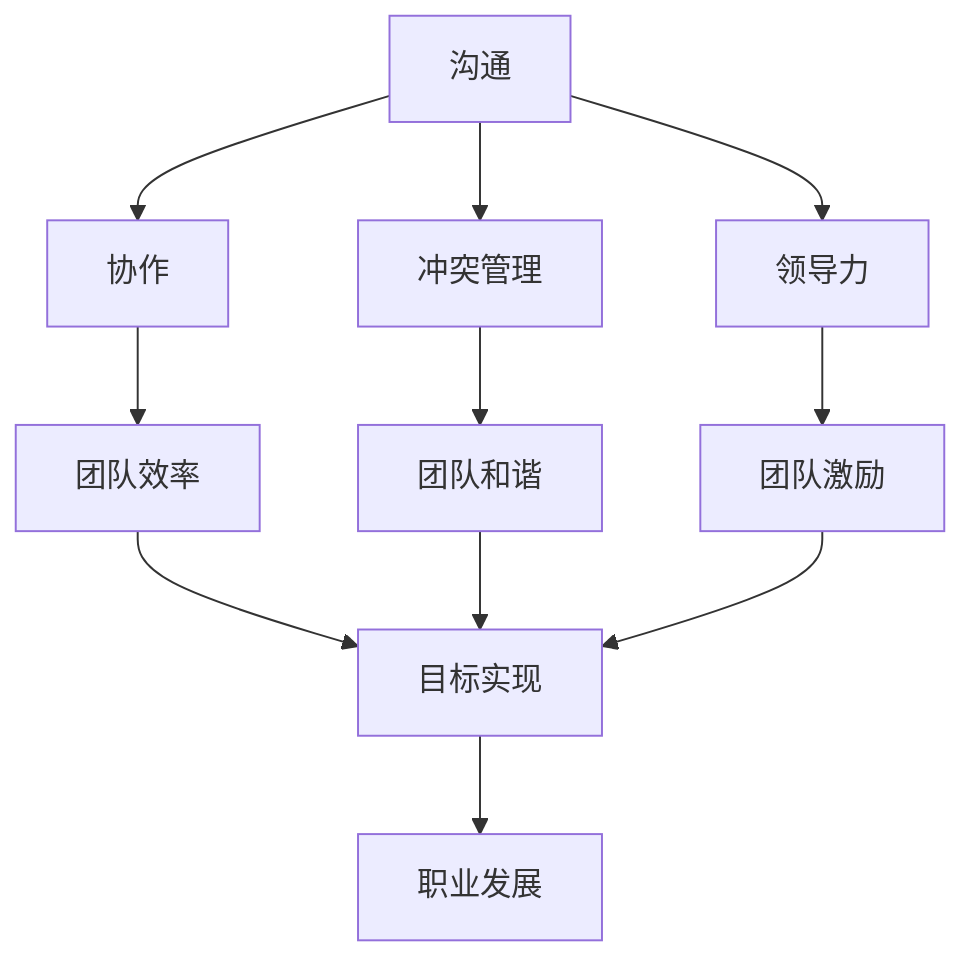

                 

## 1. 背景介绍

### 1.1 问题由来
在技术迅速发展的今天，程序员成为了各行各业的关键力量。然而，作为一名程序员，不仅需要在技术领域有所成就，还必须在职场人际关系中游刃有余，以更好地完成团队协作和项目交付。然而，许多程序员面对职场人际关系时常常感到困惑和无助，不知道如何应对。本文将深入探讨程序员在职场中面对的人际关系挑战，并提出一些实用的策略，帮助程序员提升职场适应能力，促进个人职业发展。

### 1.2 问题核心关键点
程序员在职场中面临的人际关系挑战主要包括：

1. **沟通障碍**：程序员通常偏好沉默和专注，而职场中沟通是必不可少的，但如何有效沟通是一个难题。
2. **团队协作**：不同背景和技能的人如何协同工作，特别是当他们具有不同的技术倾向时。
3. **冲突管理**：在团队中如何处理和解决冲突，以保持团队和谐和高效。
4. **领导力**：技术团队中，领导力不仅仅是管理，而是如何激励和引导团队成员，共同实现目标。
5. **职业发展**：如何识别和发展自身的领导潜力，提升在职场中的影响力。

### 1.3 问题研究意义
掌握职场人际关系的应对策略，不仅有助于程序员在当前团队中更好地完成工作，还能为未来的职业发展铺平道路。良好的职场关系可以提高工作效率、增强团队凝聚力，为职业生涯的发展打下坚实基础。同时，能够有效应对职场挑战的程序员更能获得领导和同事的信任与支持，这对于职业晋升和跨部门协作尤为重要。

## 2. 核心概念与联系

### 2.1 核心概念概述

在探讨程序员职场人际关系挑战时，涉及的核心概念包括：

- **沟通**：有效传达信息和思想的能力，包括口头和书面沟通。
- **协作**：在团队中与他人合作完成任务的能力。
- **冲突管理**：识别、处理和解决团队内部冲突的能力。
- **领导力**：引导和激励团队成员的能力。
- **职业发展**：识别和利用机会，提升自己的职业地位和影响力的过程。

这些核心概念之间存在着紧密的联系，共同构成了程序员职场成功的关键要素。下面我们将通过一个Mermaid流程图来展示这些概念之间的关系：



这个流程图展示了沟通、协作、冲突管理、领导力与团队效率、和谐、激励和目标实现之间的关系。有效的沟通和协作可以提升团队效率和和谐，良好的领导力能够激励团队成员，共同实现目标，最终促进职业发展。

### 2.2 概念间的关系

这些核心概念之间存在着复杂的交互关系，共同构成了职场人际关系的完整生态系统。具体来说：

- **沟通与协作**：良好的沟通是协作的基础，而协作则提升了沟通的效率和质量。
- **冲突管理与团队和谐**：有效的冲突管理能够避免团队内部的紧张和不满，从而提升团队和谐。
- **领导力与团队激励**：强有力的领导力能够激励团队成员，提升工作动力和团队凝聚力。
- **职业发展与目标实现**：明确的职业发展目标有助于团队成员共同努力，实现更高的工作成果。

理解这些概念之间的关系，将有助于程序员在职场中更好地应对各种人际关系挑战。

## 3. 核心算法原理 & 具体操作步骤
### 3.1 算法原理概述

本文将通过基于心理学的理论框架，探讨程序员在职场中如何应对人际关系挑战。这个框架基于以下几个核心心理学原理：

1. **认知失调理论**：当一个人的行为与他的信念或态度不一致时，他会感到不舒适，从而调整自己的行为或信念，以达到一致。
2. **社会交换理论**：人际关系中的互动是相互的，涉及交换资源（如信息、情感支持等）。
3. **情感劳动理论**：在职场中，人们需要管理和调节自己的情绪，以符合职业要求。
4. **自我效能感理论**：一个人对完成任务的信心和能力感知，影响其工作表现和态度。
5. **自我决定理论**：当人们感到自己的工作是自主、相关和有意义的，他们会更加投入和满足。

### 3.2 算法步骤详解

以下是我们提出的基于心理学的策略，每个策略都对应一个心理学原理，并提供了具体的操作步骤：

**3.2.1 有效沟通**

**步骤一**：明确沟通目标
- 在沟通前，明确你想要传达的信息和期望达成的目标。

**步骤二**：选择合适的沟通方式
- 根据信息和受众的特点，选择最合适的沟通方式（如会议、邮件、即时通讯等）。

**步骤三**：倾听和反馈
- 认真倾听对方的观点，给予积极的反馈，确保信息的准确传达。

**3.2.2 团队协作**

**步骤一**：建立信任
- 通过共同的兴趣和经历建立信任，促进团队合作。

**步骤二**：分配任务
- 根据团队成员的技能和兴趣分配任务，确保每个人都能发挥最大的作用。

**步骤三**：定期回顾和调整
- 定期回顾团队工作进展，根据反馈调整任务分配和沟通方式。

**3.2.3 冲突管理**

**步骤一**：识别冲突
- 及时识别团队中的冲突，避免小问题积累成大问题。

**步骤二**：开放沟通
- 鼓励开放、坦诚的沟通，找到冲突的根源。

**步骤三**：寻求解决方案
- 寻找双方都能接受的解决方案，避免“赢输”的对抗心态。

**3.2.4 领导力**

**步骤一**：自我认知
- 认识到自己的领导风格和优势，了解团队成员的需求和期望。

**步骤二**：激励和支持
- 通过积极的反馈、认可和支持，激励团队成员。

**步骤三**：建立愿景
- 帮助团队成员理解工作的意义和目标，共同建立愿景。

**3.2.5 职业发展**

**步骤一**：设定目标
- 明确职业发展的短期和长期目标，制定具体的行动计划。

**步骤二**：寻求反馈
- 定期寻求来自领导和同事的反馈，了解自身优势和不足。

**步骤三**：持续学习
- 不断学习新技能和知识，提升自己的竞争力。

### 3.3 算法优缺点

**优点**：
- **系统性**：基于心理学的理论框架，提供了一套系统的策略和操作步骤，帮助程序员全面提升职场人际关系技能。
- **实践性强**：每个策略都提供了具体的步骤和建议，易于操作和实施。
- **自我反思**：通过自我认知和反馈机制，鼓励程序员进行持续的自我反思和改进。

**缺点**：
- **复杂性**：对于不同的情况和团队，可能需要调整具体的策略和步骤。
- **个性化差异**：不同人的性格和工作风格不同，需要灵活应用策略。
- **时间和精力**：实施这些策略需要投入额外的时间和精力。

### 3.4 算法应用领域

这些基于心理学的策略不仅适用于编程团队，也适用于任何需要团队协作和人际关系的职场环境。具体应用领域包括：

- **软件开发团队**：提升代码审查、需求讨论和项目管理的效果。
- **产品团队**：增强产品设计和用户反馈的处理能力。
- **运营团队**：优化客户支持和团队协作，提升工作效率。
- **技术支持团队**：增强客户沟通和服务质量，提升客户满意度。

## 4. 数学模型和公式 & 详细讲解  
### 4.1 数学模型构建

为了更系统地探讨职场人际关系，我们引入几个简单的数学模型来表示和分析相关概念之间的关系。

假设一个职场团队中有$N$名成员，每个人的技能和贡献可以用一个向量$\vec{x}_i$表示，其中$i=1,2,\ldots,N$。团队的目标可以表示为一个向量$\vec{y}$，每个目标的权重为$w_j$，其中$j=1,2,\ldots,M$。

团队的协作度可以通过一个矩阵$\mathbf{C}$表示，其中$\mathbf{C}_{ij}$表示成员$i$和成员$j$之间的协作度。协作度越高，说明两个人之间的沟通和协作越频繁。

团队的冲突可以通过一个矩阵$\mathbf{D}$表示，其中$\mathbf{D}_{ij}$表示成员$i$和成员$j$之间的冲突度。冲突度越高，说明两个人之间的矛盾和不满越多。

团队的领导力可以通过一个向量$\vec{L}$表示，其中$L_k$表示第$k$个领导行为的影响力。

团队的职业发展可以通过一个向量$\vec{V}$表示，其中$V_m$表示第$m$个职业发展因素的重要性。

### 4.2 公式推导过程

通过这些简单的数学模型，我们可以推导出一些关键的公式，用于衡量和优化团队的工作效率和人际关系。

**协作度**：
$$
\text{协作度} = \frac{1}{N}\sum_{i=1}^N \sum_{j=1}^N \mathbf{C}_{ij}
$$

**冲突度**：
$$
\text{冲突度} = \frac{1}{N}\sum_{i=1}^N \sum_{j=1}^N \mathbf{D}_{ij}
$$

**领导力影响力**：
$$
\text{领导力影响力} = \sum_{k=1}^K w_k L_k
$$

**职业发展价值**：
$$
\text{职业发展价值} = \sum_{m=1}^M w_m V_m
$$

### 4.3 案例分析与讲解

假设在一个软件开发团队中，我们记录了每个成员之间的协作和冲突度，通过以下公式计算团队协作度和冲突度：

- 协作度：$\text{协作度} = \frac{1}{10} \sum_{i=1}^{10} \sum_{j=1}^{10} \mathbf{C}_{ij}$
- 冲突度：$\text{冲突度} = \frac{1}{10} \sum_{i=1}^{10} \sum_{j=1}^{10} \mathbf{D}_{ij}$

其中，协作度越高，说明团队成员之间的沟通和协作越频繁；冲突度越高，说明团队成员之间的矛盾和不满越多。

## 5. 项目实践：代码实例和详细解释说明
### 5.1 开发环境搭建

为了实践本文提出的策略，我们需要搭建一个基本的开发环境。以下是在Python中进行项目实践的环境配置流程：

1. 安装Anaconda：从官网下载并安装Anaconda，用于创建独立的Python环境。

2. 创建并激活虚拟环境：
```bash
conda create -n py workplace Python=3.8 
conda activate py workplace
```

3. 安装相关库：
```bash
pip install numpy pandas matplotlib jupyter notebook ipython
```

### 5.2 源代码详细实现

以下是一个简单的Python程序，用于模拟一个软件团队中成员之间的协作和冲突度：

```python
import numpy as np

# 设定团队成员数量
N = 10

# 初始化协作度和冲突度矩阵
C = np.random.randint(0, 10, size=(N, N))
D = np.random.randint(0, 10, size=(N, N))

# 计算协作度和冲突度
collaboration = np.sum(C) / (N * N)
conflict = np.sum(D) / (N * N)

# 输出协作度和冲突度
print(f"协作度：{collaboration:.2f}")
print(f"冲突度：{conflict:.2f}")
```

### 5.3 代码解读与分析

在这个简单的Python程序中，我们首先设定了团队成员数量$N=10$，然后初始化了协作度和冲突度矩阵$C$和$D$。协作度和冲突度矩阵都是由$0$到$9$的随机整数生成的，每个元素表示两个成员之间的协作度和冲突度。

接着，我们计算了协作度和冲突度的平均值，分别表示整个团队的协作度和冲突度。最后，我们输出了这两个值，用于分析团队的工作氛围和人际关系。

## 6. 实际应用场景
### 6.1 智能客服系统

在智能客服系统中，程序员需要处理大量的客户咨询和投诉。有效沟通和团队协作是提升客户满意度和工作效率的关键。通过建立信任和分配任务，可以提升客服团队的工作效率和客户满意度。

### 6.2 金融科技公司

在金融科技公司中，程序员需要处理复杂的金融数据分析和决策支持系统。团队协作和冲突管理能够确保数据分析的准确性和决策的合理性。通过明确目标和激励团队成员，可以提升团队的整体表现和公司竞争力。

### 6.3 医疗健康领域

在医疗健康领域，程序员需要开发各种医疗信息系统和决策支持系统。有效的沟通和领导力能够确保系统开发的顺利进行和用户的满意度。通过持续学习和提升自我效能感，可以增强程序员的自信心和职业发展前景。

## 7. 工具和资源推荐
### 7.1 学习资源推荐

为了帮助程序员提升职场人际关系技能，以下是一些推荐的学习资源：

1. **《高效能人士的七个习惯》**：史蒂芬·柯维的经典著作，深入浅出地介绍了如何通过个人和团队的习惯提升工作效能和人际关系。

2. **Coursera《职场心理学》课程**：由密歇根大学开设，系统介绍了职场心理学的基本理论和应用。

3. **LinkedIn Learning《有效沟通》课程**：提供了大量的职场沟通技巧和实践案例，帮助程序员提升沟通能力。

4. **TED演讲《如何建立良好的职场关系》**：通过观看和学习优秀的TED演讲，程序员可以从中获得启发和灵感。

5. **《非暴力沟通》**：马歇尔·卢森堡的著作，介绍了非暴力沟通技巧，帮助程序员改善人际关系。

### 7.2 开发工具推荐

为了更好地实践职场人际关系策略，以下是一些推荐的开发工具：

1. **Jupyter Notebook**：一个基于Web的交互式编程环境，适合进行数据分析和可视化。

2. **GitHub**：一个代码托管平台，适合进行团队协作和版本控制。

3. **Slack**：一个团队协作工具，适合进行即时沟通和文件共享。

4. **Zoom**：一个视频会议工具，适合进行远程协作和培训。

5. **Google Docs**：一个在线文档编辑工具，适合进行团队协作和文档共享。

### 7.3 相关论文推荐

为了深入理解职场人际关系的理论基础和实践技巧，以下是一些推荐的相关论文：

1. **《工作团队中的冲突管理：一个基于资源和情感的视角》**：探讨了团队冲突管理的基本理论和实践方法。

2. **《情感劳动：理解职场情感的复杂性》**：分析了职场中情感劳动的概念和影响，提出了情感管理的方法。

3. **《自我决定理论：一个动机基础框架》**：深入探讨了自我决定理论的基本原理和应用。

4. **《领导力的心理基础》**：介绍了领导力的心理学原理和不同领导风格的优缺点。

## 8. 总结：未来发展趋势与挑战

### 8.1 总结

本文对程序员在职场中面对的人际关系挑战进行了全面系统的介绍。首先阐述了职场人际关系的重要性，明确了有效沟通、团队协作、冲突管理、领导力和职业发展等关键概念。其次，基于心理学的理论框架，详细讲解了这些概念之间的联系，并通过数学模型进行量化分析。最后，我们提供了具体的项目实践和实际应用场景，帮助程序员提升职场适应能力，促进个人职业发展。

通过本文的系统梳理，可以看到，职场人际关系是程序员职业发展的重要组成部分，掌握相关策略能够显著提升工作效率和团队表现。然而，职场人际关系也需要持续的自我反思和改进，才能不断提升自身职业素养和职场竞争力。

### 8.2 未来发展趋势

展望未来，职场人际关系的发展趋势将呈现以下几个方向：

1. **数字化协作**：随着数字化工具的普及，远程协作将成为常态，程序员需要适应更加多样化的工作环境。
2. **多文化沟通**：全球化的趋势使得多文化沟通成为必然，程序员需要具备跨文化沟通的能力。
3. **人工智能应用**：AI技术在职场人际关系中的应用将越来越广泛，如智能沟通助手、情感分析工具等，将提升工作效率和沟通质量。
4. **个性化职业发展**：基于大数据和AI的个性化职业发展服务将更加普及，帮助程序员找到最适合自己的职业路径。
5. **柔性领导**：柔性领导模式将逐步替代传统的层级管理模式，提升团队成员的自主性和工作满意度。

### 8.3 面临的挑战

尽管职场人际关系的发展前景广阔，但在迈向更加智能化、普适化应用的过程中，仍面临诸多挑战：

1. **技术快速迭代**：技术发展的速度远超职场人际关系理论的更新，如何跟上技术变革的步伐，是一个重要的挑战。
2. **全球化文化差异**：多文化沟通和合作需要深入理解不同文化背景下的行为模式和沟通习惯。
3. **数字化工具依赖**：过度依赖数字化工具可能导致人际关系技能的退化，如何平衡技术与人际关系，是一个需要考虑的问题。
4. **隐私和伦理问题**：数字化协作和AI应用可能涉及隐私和伦理问题，如何在应用中保障个人隐私和数据安全，是一个重要的挑战。

### 8.4 研究展望

为了应对未来职场人际关系面临的挑战，未来的研究需要在以下几个方面寻求新的突破：

1. **跨文化沟通理论**：深入研究跨文化沟通的心理学原理和应用，提升多文化团队的协作能力。
2. **数字化沟通工具**：开发更加智能和人性化的数字化沟通工具，提升远程协作的效率和质量。
3. **情感劳动管理**：研究情感劳动的测量和管理方法，帮助程序员更好地应对职场压力和情绪波动。
4. **个性化职业发展平台**：基于大数据和AI技术，开发个性化职业发展平台，帮助程序员规划和发展职业路径。
5. **柔性领导模型**：探索柔性领导的心理学基础和实践方法，提升团队成员的自主性和工作满意度。

这些研究方向的探索，必将引领职场人际关系向更加智能化、普适化和人性化方向发展，为程序员的职业发展提供更加坚实的基础。

## 9. 附录：常见问题与解答

**Q1：如何识别和解决团队中的冲突？**

A: 识别冲突的关键在于开放和坦诚的沟通。可以通过团队会议、一对一沟通等方式，了解团队成员的意见和不满，找到冲突的根源。解决冲突的方法包括：
1. 倾听和理解：认真倾听对方的观点，理解冲突的原因。
2. 寻求共同点：寻找双方都能接受的解决方案，避免“赢输”的对抗心态。
3. 第三方调解：当双方无法自行解决时，可以引入第三方进行调解。

**Q2：如何提升团队协作度？**

A: 提升团队协作度的方法包括：
1. 建立信任：通过共同的兴趣和经历建立信任，促进团队合作。
2. 明确目标：确保每个成员都清楚团队的目标和任务，共同努力实现。
3. 分配任务：根据团队成员的技能和兴趣分配任务，确保每个人都能发挥最大的作用。
4. 定期回顾：定期回顾团队工作进展，根据反馈调整任务分配和沟通方式。

**Q3：如何提升团队领导力？**

A: 提升团队领导力的方法包括：
1. 自我认知：认识到自己的领导风格和优势，了解团队成员的需求和期望。
2. 激励和支持：通过积极的反馈、认可和支持，激励团队成员。
3. 建立愿景：帮助团队成员理解工作的意义和目标，共同建立愿景。
4. 持续学习：不断学习新的领导技巧和知识，提升自己的领导力。

**Q4：如何应对职场中的情感劳动？**

A: 应对职场中的情感劳动的方法包括：
1. 自我调节：学习自我调节技巧，管理自己的情绪，保持职业素养。
2. 寻求支持：与同事和领导交流，寻求情感支持。
3. 边界设定：合理设定工作与生活的边界，避免过度劳累。
4. 健康管理：注意身体健康和心理健康，提升工作效能。

**Q5：如何规划和发展职业路径？**

A: 规划和发展职业路径的方法包括：
1. 设定目标：明确职业发展的短期和长期目标，制定具体的行动计划。
2. 寻求反馈：定期寻求来自领导和同事的反馈，了解自身优势和不足。
3. 持续学习：不断学习新技能和知识，提升自己的竞争力。
4. 网络建设：建立和维护职业网络，扩大自己的职业影响力。

总之，职场人际关系是程序员职业发展的重要组成部分，掌握相关策略能够显著提升工作效率和团队表现。然而，职场人际关系也需要持续的自我反思和改进，才能不断提升自身职业素养和职场竞争力。通过本文的系统梳理，程序员可以更好地应对职场人际关系挑战，促进个人职业发展。

