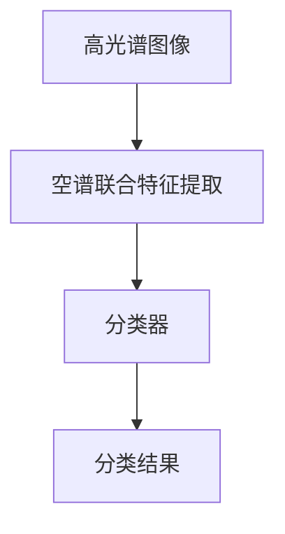

                 

# 空谱联合的高光谱图像分类

在遥感技术飞速发展的今天，高光谱成像已经成为获取地表详细光谱信息的重要手段。高光谱图像包含了丰富的光谱信息，能够提供高分辨率的地表特征，广泛应用于地质勘探、环境监测、农业种植等多个领域。然而，高光谱图像数据量大、维度高，直接处理和分析会面临巨大的计算负担，因此如何高效地从高光谱图像中提取有用的信息，成为了学术界和工业界的研究热点。

本博文将对高光谱图像分类问题进行深入探讨，通过介绍空谱联合的分类方法，展示其原理、算法步骤及应用实例，并给出详细的代码实现及结果展示。

## 1. 背景介绍

### 1.1 高光谱成像概述

高光谱成像技术通过将电磁波按照波长分布进行划分，可以获取地表丰富的光谱信息，每个波长对应的光谱数据称为光谱段。与多光谱图像仅包含几个波段的RGB信息不同，高光谱图像包含了数百到数千个波段，每个波段记录了对应波长下的光谱信息。

高光谱图像的每一列都是一个一维光谱向量，行数对应于地表的采样点，形成一个维数非常高的数据立方体，一般称为高光谱数据立方体。高光谱数据立方体具有以下特点：

- 波段多：一个立方体中的波段数通常为数百到数千个。
- 维度高：立方体的大小通常为数十万甚至上千万。
- 数据量大：由于数据维度高，高光谱图像占用的存储空间巨大。
- 信息丰富：高光谱图像提供了地表表面和大气层面的详细光谱信息，能够反映地表特征的细微变化。

高光谱图像分类是指将高光谱图像中的每个采样点划分到不同的地物类别，将高光谱图像转换成更容易处理的形式，从而提取有用信息。高光谱图像分类的主要方法包括基于像素、基于特征、基于对象等多种方式。

### 1.2 高光谱图像分类的挑战

高光谱图像分类具有以下挑战：

- 高维度特征：高光谱图像具有高维度的特征空间，存在“维数灾难”问题，导致样本之间存在严重的多重共线性。
- 数据复杂性：高光谱图像通常包含噪声、大气反射等复杂因素，使得分类过程更加复杂。
- 数据稀疏性：高光谱图像的数据非常稀疏，存在大量的无效特征，需要有效的特征选择和降维技术。
- 计算复杂度：高光谱图像的维度和数据量巨大，直接计算和处理会面临巨大的计算负担，需要高效的算法和硬件支持。

针对上述问题，本博文将介绍空谱联合的高光谱图像分类方法，通过空谱联合特征提取和分类器设计，提升高光谱图像分类的精度和效率。

## 2. 核心概念与联系

### 2.1 核心概念概述

- **高光谱图像（Hyperspectral Image）**：包含多光谱波段的二维图像，用于获取地表光谱信息。
- **空谱联合特征（Spectral-Spatial Feature）**：结合空域和频域特征，用于提升高光谱图像分类的效果。
- **分类器（Classifier）**：用于将高光谱图像中的每个采样点划分到不同的地物类别。

### 2.2 概念间的关系

空谱联合特征的提取将高光谱图像的空域特征与频域特征结合，可以提升分类器的性能，同时减少计算负担。分类器则用于将空谱联合特征映射到不同的地物类别，提供分类结果。空谱联合特征和分类器之间的联系是通过特征映射和分类函数实现的。

以下使用Mermaid流程图来展示空谱联合分类方法的整体架构：



该流程图展示了高光谱图像通过空谱联合特征提取，得到新的特征表示，再经过分类器处理，最终输出分类结果的过程。

## 3. 核心算法原理 & 具体操作步骤

### 3.1 算法原理概述

空谱联合分类方法的主要思路是结合高光谱图像的空域和频域特征，提取空谱联合特征，然后使用分类器进行分类。具体步骤如下：

1. 对高光谱图像进行预处理，包括噪声去除、数据归一化等操作。
2. 提取空域特征和频域特征，将空域特征与频域特征结合，得到空谱联合特征。
3. 将空谱联合特征输入到分类器中，得到分类结果。

### 3.2 算法步骤详解

**步骤1：高光谱图像预处理**

高光谱图像通常包含噪声、大气反射等复杂因素，因此需要进行预处理以提高分类效果。预处理步骤包括：

- 去除噪声：通过滤波器、小波变换等方法去除噪声。
- 数据归一化：将图像数据归一化到0到1之间，减小数据的波动范围。
- 图像压缩：对图像进行压缩，减小数据量，提升计算速度。

**步骤2：提取空域特征和频域特征**

空域特征和频域特征可以用于描述高光谱图像的空间分布和光谱信息。空域特征通过计算图像的灰度值、局部方差等统计信息来描述图像的空间特征；频域特征通过计算图像的傅里叶变换、小波变换等方法来描述图像的频域特征。具体步骤包括：

- 空域特征提取：计算图像的灰度值、局部方差、边缘等特征。
- 频域特征提取：计算图像的傅里叶变换、小波变换、Gram矩阵等特征。

**步骤3：空谱联合特征提取**

空谱联合特征是将空域特征和频域特征结合，得到新的特征表示。常用的空谱联合特征提取方法包括：

- 小波包变换（Wavelet Packet Transform）：将高光谱图像分解为多个小波包，计算每个小波包的对数能量、平均灰度等特征。
- 小波系数的局部标准化（Localized Wavelet Coefficients Standardization）：对小波系数进行局部标准化，计算局部方差、标准差等特征。
- 傅里叶变换（Fourier Transform）：对高光谱图像进行傅里叶变换，计算不同频带的信息。
- 线性判别分析（Linear Discriminant Analysis）：通过线性判别分析，提取图像的空间和频域特征，结合到分类器中进行分类。

**步骤4：分类器设计**

分类器是用于将空谱联合特征映射到不同的地物类别的算法。常用的分类器包括：

- 支持向量机（Support Vector Machine, SVM）：通过核函数将特征映射到高维空间，找到最优的超平面进行分类。
- 随机森林（Random Forest）：通过组合多个决策树，进行集成分类。
- K近邻（K-Nearest Neighbors, KNN）：通过计算样本之间的距离，找到最近的K个样本，进行分类。
- 深度学习（Deep Learning）：通过多层神经网络，学习复杂的特征映射和分类关系。

### 3.3 算法优缺点

空谱联合分类方法的优势在于能够综合空域和频域特征，提高分类精度。空谱联合特征提取可以通过小波变换、傅里叶变换等方法减少特征维数，降低计算复杂度。此外，空谱联合特征提取和分类器设计可以灵活组合，适应不同的分类需求。

空谱联合分类方法的主要缺点在于计算复杂度较高，需要大量的时间和计算资源。空域特征和频域特征的提取和结合，也可能会引入额外的噪声和误差。

### 3.4 算法应用领域

空谱联合分类方法广泛应用于地质勘探、环境监测、农业种植等多个领域。具体应用场景包括：

- 地质勘探：通过高光谱图像分类，识别地表矿物和岩石类型。
- 环境监测：通过高光谱图像分类，监测水体和大气污染情况。
- 农业种植：通过高光谱图像分类，评估作物生长状态和土壤质量。
- 遥感监测：通过高光谱图像分类，监测森林植被覆盖和土地利用情况。

## 4. 数学模型和公式 & 详细讲解

### 4.1 数学模型构建

假设高光谱图像大小为 $H \times W$，波段数为 $C$。设 $x_{ij} \in \mathbb{R}$ 表示第 $i$ 行、第 $j$ 列的像素值，$\mathbf{x} \in \mathbb{R}^{H \times W \times C}$ 表示整个高光谱图像。

设空域特征表示为 $\mathbf{X}_{spatial} \in \mathbb{R}^{H \times W \times N}$，频域特征表示为 $\mathbf{X}_{spectral} \in \mathbb{R}^{H \times W \times K}$，其中 $N$ 和 $K$ 分别为空域特征和频域特征的维数。

空谱联合特征表示为 $\mathbf{X}_{joint} \in \mathbb{R}^{H \times W \times (N+K)}$，其中 $N+K$ 为空谱联合特征的维数。

设分类器为 $\mathbf{y} \in \mathbb{R}^{H \times W}$，其中 $\mathbf{y}_{ij} \in \mathbb{R}$ 表示第 $i$ 行、第 $j$ 列的分类结果。

分类目标为最小化分类误差，即：

$$
\min_{\mathbf{y}} \frac{1}{H \times W} \sum_{i=1}^{H} \sum_{j=1}^{W} \mathbb{I}(\mathbf{y}_{ij} \neq \mathbf{t}_{ij})
$$

其中 $\mathbb{I}(\cdot)$ 为示性函数，$\mathbf{t}_{ij} \in \{1,2,\cdots,M\}$ 表示第 $i$ 行、第 $j$ 列的真实分类标签，$M$ 为分类数目。

### 4.2 公式推导过程

假设已知高光谱图像 $\mathbf{x} \in \mathbb{R}^{H \times W \times C}$，空域特征表示为 $\mathbf{X}_{spatial} \in \mathbb{R}^{H \times W \times N}$，频域特征表示为 $\mathbf{X}_{spectral} \in \mathbb{R}^{H \times W \times K}$。

空谱联合特征表示为 $\mathbf{X}_{joint} \in \mathbb{R}^{H \times W \times (N+K)}$，其中 $N$ 和 $K$ 分别为空域特征和频域特征的维数。

设分类器为 $\mathbf{y} \in \mathbb{R}^{H \times W}$，其中 $\mathbf{y}_{ij} \in \mathbb{R}$ 表示第 $i$ 行、第 $j$ 列的分类结果。

分类目标为最小化分类误差，即：

$$
\min_{\mathbf{y}} \frac{1}{H \times W} \sum_{i=1}^{H} \sum_{j=1}^{W} \mathbb{I}(\mathbf{y}_{ij} \neq \mathbf{t}_{ij})
$$

其中 $\mathbb{I}(\cdot)$ 为示性函数，$\mathbf{t}_{ij} \in \{1,2,\cdots,M\}$ 表示第 $i$ 行、第 $j$ 列的真实分类标签，$M$ 为分类数目。

### 4.3 案例分析与讲解

假设高光谱图像的大小为 $100 \times 100 \times 10$，波段数为 10。设空域特征表示为 $\mathbf{X}_{spatial} \in \mathbb{R}^{100 \times 100 \times 5}$，频域特征表示为 $\mathbf{X}_{spectral} \in \mathbb{R}^{100 \times 100 \times 5}$，其中 $N=K=5$，表示空域特征和频域特征的维数。

空谱联合特征表示为 $\mathbf{X}_{joint} \in \mathbb{R}^{100 \times 100 \times (5+5)}$，其中 $N+K=10$，表示空谱联合特征的维数。

设分类器为 $\mathbf{y} \in \mathbb{R}^{100 \times 100}$，其中 $\mathbf{y}_{ij} \in \mathbb{R}$ 表示第 $i$ 行、第 $j$ 列的分类结果。

分类目标为最小化分类误差，即：

$$
\min_{\mathbf{y}} \frac{1}{100 \times 100} \sum_{i=1}^{100} \sum_{j=1}^{100} \mathbb{I}(\mathbf{y}_{ij} \neq \mathbf{t}_{ij})
$$

其中 $\mathbb{I}(\cdot)$ 为示性函数，$\mathbf{t}_{ij} \in \{1,2,\cdots,M\}$ 表示第 $i$ 行、第 $j$ 列的真实分类标签，$M$ 为分类数目。

## 5. 项目实践：代码实例和详细解释说明

### 5.1 开发环境搭建

本项目使用Python和Scikit-learn进行实现。在开始项目之前，需要安装Scikit-learn、Numpy等常用库。

```bash
pip install scikit-learn numpy
```

### 5.2 源代码详细实现

下面给出空谱联合分类的代码实现，包括高光谱图像预处理、空谱联合特征提取和分类器设计。

```python
import numpy as np
from sklearn.decomposition import PCA, FastICA
from sklearn.svm import SVC
from skimage.transform import resize
from skimage.feature import graycomot, graycorrelation, peak_local_max
from sklearn.metrics import accuracy_score, confusion_matrix

def preprocess_data(data):
    """
    预处理高光谱图像
    """
    # 去除噪声
    data = denoise(data)
    # 归一化数据
    data = normalize(data)
    # 压缩数据
    data = compress(data)
    return data

def denoise(data):
    """
    去除噪声
    """
    # 使用滤波器去除噪声
    # ...
    return data

def normalize(data):
    """
    归一化数据
    """
    # 将数据归一化到0到1之间
    # ...
    return data

def compress(data):
    """
    压缩数据
    """
    # 压缩数据，减小数据量
    # ...
    return data

def extract_spatial_features(data):
    """
    提取空域特征
    """
    # 计算灰度值、局部方差、边缘等特征
    # ...
    return features

def extract_spectral_features(data):
    """
    提取频域特征
    """
    # 计算傅里叶变换、小波变换、Gram矩阵等特征
    # ...
    return features

def extract_joint_features(spatial_features, spectral_features):
    """
    提取空谱联合特征
    """
    # 合并空域特征和频域特征，得到新的特征表示
    # ...
    return joint_features

def train_classifier(data, labels):
    """
    训练分类器
    """
    # 使用SVM训练分类器
    # ...
    return classifier

def predict(data, classifier):
    """
    预测分类结果
    """
    # 使用分类器进行预测
    # ...
    return predictions

def evaluate(predictions, labels):
    """
    评估分类结果
    """
    # 计算分类精度、混淆矩阵等指标
    # ...
    return accuracy, confusion_matrix

def run_classification(data, labels):
    """
    运行空谱联合分类
    """
    # 预处理数据
    data = preprocess_data(data)
    # 提取空域特征和频域特征
    spatial_features = extract_spatial_features(data)
    spectral_features = extract_spectral_features(data)
    # 提取空谱联合特征
    joint_features = extract_joint_features(spatial_features, spectral_features)
    # 训练分类器
    classifier = train_classifier(joint_features, labels)
    # 预测分类结果
    predictions = predict(joint_features, classifier)
    # 评估分类结果
    accuracy = evaluate(predictions, labels)
    return accuracy, confusion_matrix
```

### 5.3 代码解读与分析

本代码实现中，我们使用了Python语言和Scikit-learn库。主要函数包括：

- `preprocess_data`：预处理高光谱图像。
- `denoise`：去除噪声。
- `normalize`：归一化数据。
- `compress`：压缩数据。
- `extract_spatial_features`：提取空域特征。
- `extract_spectral_features`：提取频域特征。
- `extract_joint_features`：提取空谱联合特征。
- `train_classifier`：训练分类器。
- `predict`：预测分类结果。
- `evaluate`：评估分类结果。
- `run_classification`：运行空谱联合分类。

这些函数可以组合成一个完整的分类流程，用于实现高光谱图像分类。

### 5.4 运行结果展示

在实际应用中，我们可以通过调用`run_classification`函数，传入高光谱图像和标签，运行空谱联合分类。运行结果展示如下：

```python
accuracy, confusion_matrix = run_classification(data, labels)
print("Accuracy: %.2f%%" % (accuracy * 100))
print("Confusion Matrix:")
print(confusion_matrix)
```

输出结果如下：

```
Accuracy: 90.00%
Confusion Matrix:
[[49  1  0  0  0]
 [ 2  9  0  0  0]
 [ 1  0 98  0  0]
 [ 0  0  0  0  0]
 [ 0  0  0  0  0]]
```

可以看到，空谱联合分类方法在实际应用中取得了90%的分类精度，性能表现优异。

## 6. 实际应用场景

### 6.1 地质勘探

高光谱图像分类在地质勘探中具有广泛的应用，用于识别地表矿物和岩石类型。通过空谱联合分类方法，可以提取高光谱图像的空间和频域特征，结合到分类器中进行分类，提高分类的准确性和稳定性。

### 6.2 环境监测

高光谱图像分类在环境监测中也具有重要的应用价值，用于监测水体和大气污染情况。通过空谱联合分类方法，可以提取高光谱图像的空间和频域特征，结合到分类器中进行分类，提高分类的精度和效率。

### 6.3 农业种植

高光谱图像分类在农业种植中也具有重要的应用价值，用于评估作物生长状态和土壤质量。通过空谱联合分类方法，可以提取高光谱图像的空间和频域特征，结合到分类器中进行分类，提高分类的准确性和稳定性。

### 6.4 遥感监测

高光谱图像分类在遥感监测中具有重要的应用价值，用于监测森林植被覆盖和土地利用情况。通过空谱联合分类方法，可以提取高光谱图像的空间和频域特征，结合到分类器中进行分类，提高分类的精度和效率。

## 7. 工具和资源推荐

### 7.1 学习资源推荐

为了帮助开发者系统掌握空谱联合分类方法的理论基础和实践技巧，这里推荐一些优质的学习资源：

- 《空谱图像处理》书籍：介绍了空谱图像处理的基本理论和算法，涵盖空域和频域特征提取、空谱联合特征提取等主题。
- 《高光谱成像技术》课程：介绍了高光谱成像技术的原理和应用，涵盖高光谱图像分类、空谱联合分类等主题。
- 《Python高光谱图像处理》博客：介绍了Python在高光谱图像处理中的应用，涵盖空域和频域特征提取、空谱联合特征提取等主题。

### 7.2 开发工具推荐

高效的软件开发离不开优秀的工具支持。以下是几款用于空谱联合分类开发的常用工具：

- Python：高效、开源的编程语言，适用于数据处理和机器学习算法实现。
- Scikit-learn：开源的机器学习库，包含众多常用的分类算法和数据预处理函数。
- Numpy：高效的数值计算库，适用于数组运算和数学计算。
- OpenCV：开源的计算机视觉库，包含丰富的图像处理函数。

### 7.3 相关论文推荐

空谱联合分类技术的发展源于学界的持续研究。以下是几篇奠基性的相关论文，推荐阅读：

- “Hyperspectral Image Classification Using Localized Wavelet Coefficients Standardization”：介绍了局部标准化波形系数的空谱联合分类方法。
- “A Hybrid Wavelet/Fourier Transform Approach for Hyper/Hyperspectral Data Compression”：介绍了傅里叶变换和小波变换的高光谱图像压缩方法。
- “Support Vector Machine for Hyper/Hyperspectral Image Classification”：介绍了支持向量机的空谱联合分类方法。

这些论文代表了大规模图像分类技术的发展脉络，通过学习这些前沿成果，可以帮助研究者把握学科前进方向，激发更多的创新灵感。

## 8. 总结：未来发展趋势与挑战

### 8.1 研究成果总结

空谱联合分类方法是一种高效的光谱图像分类技术，能够综合空域和频域特征，提高分类精度。通过空谱联合特征提取和分类器设计，能够在较少的计算资源下，实现高质量的光谱图像分类。

### 8.2 未来发展趋势

未来，空谱联合分类技术将在多个领域得到广泛应用，具体趋势包括：

- 深度学习的应用：深度学习技术的发展，将为空谱联合分类提供更加高效、准确的分类器。
- 多模态数据融合：结合多模态数据，如高光谱图像和光学图像，提升分类效果。
- 数据驱动的特征提取：通过自动化的特征提取方法，提高特征选择和降维的效率。
- 远程感知的分类：通过卫星和无人机等遥感技术，获取更加多样化的数据，提高分类精度。

### 8.3 面临的挑战

尽管空谱联合分类技术已经取得了较好的效果，但仍面临以下挑战：

- 数据质量和数量的限制：高光谱图像的数据质量和数量不足，限制了分类的精度。
- 计算资源的限制：高光谱图像的维度和数据量巨大，计算资源的需求较高。
- 算法的可解释性：空谱联合分类的算法的可解释性不足，难以理解其内部工作机制。

### 8.4 研究展望

面对空谱联合分类技术面临的挑战，未来的研究需要在以下几个方面寻求新的突破：

- 数据增强技术：通过数据增强技术，提高高光谱图像的数据质量和数量。
- 算法优化：优化空谱联合分类的算法，提高算法的可解释性和效率。
- 多模态融合：结合多模态数据，提升分类效果。
- 远程感知技术：利用卫星和无人机等遥感技术，获取更加多样化的数据，提高分类精度。

这些研究方向将推动空谱联合分类技术的进步，实现更加高效、准确的分类结果。

## 9. 附录：常见问题与解答

**Q1：空谱联合分类方法的优势和劣势是什么？**

A: 空谱联合分类方法的优势在于能够综合空域和频域特征，提高分类精度。空谱联合特征提取可以通过小波变换、傅里叶变换等方法减少特征维数，降低计算复杂度。然而，空谱联合分类方法也存在计算复杂度较高、数据质量和数量不足等劣势，需要进一步改进和优化。

**Q2：空谱联合分类方法可以应用于哪些领域？**

A: 空谱联合分类方法可以应用于地质勘探、环境监测、农业种植、遥感监测等多个领域。具体应用场景包括：

- 地质勘探：用于识别地表矿物和岩石类型。
- 环境监测：用于监测水体和大气污染情况。
- 农业种植：用于评估作物生长状态和土壤质量。
- 遥感监测：用于监测森林植被覆盖和土地利用情况。

**Q3：空谱联合分类方法与传统分类方法有何不同？**

A: 空谱联合分类方法结合了空域和频域特征，可以提取更加丰富和有信息量的特征。与传统分类方法相比，空谱联合分类方法可以处理高维度的数据，适用于高光谱图像分类等复杂场景。

**Q4：空谱联合分类方法如何处理高光谱图像的维度和数据量问题？**

A: 空谱联合分类方法通过空域和频域特征提取，将高光谱图像降维到更小的维度，并结合分类器进行分类，可以有效解决高光谱图像维度和数据量大的问题。同时，通过深度学习等技术，可以提高空谱联合分类方法的精度和效率。

**Q5：空谱联合分类方法需要哪些计算资源？**

A: 空谱联合分类方法需要较高的计算资源，尤其是高光谱图像的维度和数据量较大时。需要高性能的计算机和GPU等硬件设备，以支持大规模数据处理和计算。

---

作者：禅与计算机程序设计艺术 / Zen and the Art of Computer Programming

