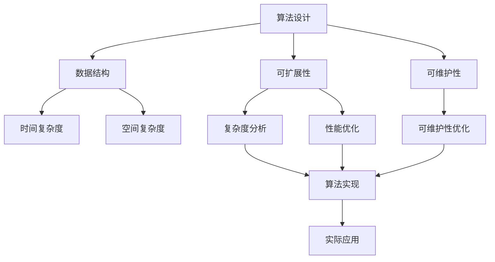

                 

# 第一性原理：从基础到复杂的科学方法

第一性原理，源自古希腊哲学家亚里士多德的"还原法"和爱因斯坦的"万物均可拆解"思想，是指将复杂问题拆解为最基础的元素，然后从这些基础元素出发，重新构建起新的理论体系。这一思想不仅在物理、化学等领域广泛应用，也逐渐成为科学研究的金科玉律。在计算机科学中，第一性原理同样发挥着重要作用，特别是在设计和优化复杂算法的过程中。本文将深入探讨第一性原理在计算机科学中的运用，并通过实际案例展现其如何指导我们理解和优化算法。

## 1. 背景介绍

### 1.1 问题由来
随着计算机科学的发展，算法设计和优化已经成为行业内部的重要话题。复杂的算法通常涉及多个组件、多种技术，需要综合考虑性能、精度、可扩展性等多个维度。在这种情况下，如何从最基础的元素出发，构建起高效、可维护的算法体系，成为了行业内的重要挑战。

第一性原理提供了一种解决问题的思路，即从最基本的物理定律和数学公式出发，逐步推导出复杂系统的行为和特性。这一方法不仅能帮助我们更好地理解算法的设计和优化，还能避免陷入过度的细节堆砌和复杂的工程实现中。

### 1.2 问题核心关键点
第一性原理的核心在于，通过简化复杂系统，找到问题最本质、最核心的因素，从而实现从基础到复杂、从简单到高级的跨越。关键点包括：

- 分解复杂系统：将算法拆解为基本组件和操作。
- 找到核心问题：确定影响算法性能的关键因素。
- 构建基本模型：从基础元素出发，逐步构建起完整的算法模型。
- 迭代优化：通过反馈和迭代，不断优化模型和组件。

## 2. 核心概念与联系

### 2.1 核心概念概述

第一性原理在计算机科学中的应用，主要涉及以下几个关键概念：

- **算法设计**：指如何从问题定义出发，设计出有效的算法步骤。
- **数据结构**：用于存储和组织数据的基本数据类型，如数组、链表、哈希表等。
- **时间复杂度**：衡量算法执行效率的重要指标，反映算法运行时间随数据规模增长的变化趋势。
- **空间复杂度**：衡量算法所需内存空间随数据规模增长的变化趋势。
- **可扩展性**：指算法是否能够适应更大规模数据的处理需求。
- **可维护性**：指算法是否易于修改、扩展和维护。

这些概念之间存在紧密的联系，共同构成了算法设计和优化的基础框架。理解这些概念的相互关系，是掌握第一性原理的关键。

### 2.2 概念间的关系

通过以下Mermaid流程图，我们可以清晰地展示这些概念之间的联系：



这个流程图展示了从算法设计到实际应用的全过程，以及数据结构、复杂度、可扩展性、可维护性等因素在其中扮演的角色。

## 3. 核心算法原理 & 具体操作步骤
### 3.1 算法原理概述

第一性原理在算法设计和优化中的核心思想是：从基本物理定律和数学公式出发，逐步构建起完整的算法模型。这一过程可以分为以下几个步骤：

1. **问题定义**：明确问题的基本要素和目标，找到问题的关键特征。
2. **基本模型建立**：从最基本的物理定律和数学公式出发，构建起问题的基本模型。
3. **模型扩展**：通过扩展基本模型，引入新的物理定律和数学公式，构建起更复杂的算法模型。
4. **实验验证**：通过实验数据验证算法的正确性和性能，不断优化模型。
5. **实际应用**：将优化后的算法应用于实际问题中，评估其效果。

### 3.2 算法步骤详解

下面以排序算法为例，详细介绍第一性原理在算法设计和优化中的应用。

#### 3.2.1 问题定义

排序算法旨在将一组数据按照一定的规则进行排序，常见的排序算法有冒泡排序、快速排序、归并排序等。我们的目标是从基础原理出发，构建出一种高效、稳定的排序算法。

#### 3.2.2 基本模型建立

首先，我们需要从基本的物理定律和数学公式出发，构建起排序算法的基本模型。以冒泡排序为例，其基本模型为：

1. 从左到右比较相邻的两个元素，如果前一个元素大于后一个元素，则交换它们的位置。
2. 重复上述步骤，直到排序完成。

这一模型基于简单的物理定律：“重力作用”，即元素按照大小自上而下“沉降”。

#### 3.2.3 模型扩展

为了提升排序算法的效率，我们可以引入新的物理定律和数学公式。例如，通过引入分治策略，可以构建出归并排序：

1. 将待排序序列分为两个子序列，分别进行排序。
2. 将排好序的子序列合并成一个有序序列。

这一模型基于“分解与合并”的物理定律，将复杂问题拆解为更简单的子问题，从而提升算法效率。

#### 3.2.4 实验验证

通过实验验证，我们可以评估算法的性能和正确性。例如，我们可以通过时间复杂度分析，验证冒泡排序和归并排序的时间复杂度：

- 冒泡排序的时间复杂度为 $O(n^2)$，在数据规模较大时效率较低。
- 归并排序的时间复杂度为 $O(n\log n)$，在数据规模较大时效率更高。

#### 3.2.5 实际应用

最后，我们将优化后的算法应用于实际问题中。例如，在排序大文件时，我们可以使用归并排序来提高效率。

### 3.3 算法优缺点

第一性原理在算法设计和优化中的应用具有以下优点：

- **原理清晰**：从最基本的物理定律和数学公式出发，能够清晰地理解算法的本质。
- **可扩展性强**：通过引入新的物理定律和数学公式，可以构建起更复杂的算法模型。
- **性能稳定**：通过实验验证，可以确保算法的正确性和性能。

同时，第一性原理也存在一些缺点：

- **复杂度高**：从基础到复杂的推导过程可能需要较长的时间。
- **需要深厚的理论基础**：对物理定律和数学公式的理解要求较高。
- **易出现偏差**：从基础元素出发，可能忽略一些实际问题中的细节和特例。

## 4. 数学模型和公式 & 详细讲解  
### 4.1 数学模型构建

在算法设计和优化过程中，数学模型和公式是不可或缺的工具。以归并排序为例，其数学模型可以表示为：

1. **输入**：一个未排序的序列 $S = \{a_1, a_2, \dots, a_n\}$。
2. **输出**：一个已排序的序列 $S' = \{a_1, a_2, \dots, a_n\}$。
3. **中间状态**：两个子序列 $S_1$ 和 $S_2$，满足 $S = S_1 + S_2$。
4. **递归关系**：$S_1$ 和 $S_2$ 分别排序后，将两个有序序列合并成一个有序序列。

### 4.2 公式推导过程

归并排序的时间复杂度可以通过递归树和数学推导得出。以下是对归并排序时间复杂度的推导过程：

1. 将序列分为两个子序列，递归进行排序。
2. 合并两个有序子序列。
3. 递归深度为 $\log n$，每次合并需要 $O(n)$ 时间。

因此，归并排序的时间复杂度为 $O(n\log n)$。

### 4.3 案例分析与讲解

以归并排序为例，下面给出一些实际案例，展示第一性原理在算法优化中的应用：

- **归并排序优化**：通过使用双轴归并排序，可以进一步提升排序效率。
- **归并排序并行化**：通过并行处理，可以提升排序速度，适用于大规模数据处理。
- **归并排序内存优化**：通过使用外部排序，可以处理无法全部载入内存的大文件。

## 5. 项目实践：代码实例和详细解释说明
### 5.1 开发环境搭建

为了进行归并排序的实现和优化，我们需要搭建一个Python开发环境。以下是搭建环境的步骤：

1. **安装Python**：从Python官网下载并安装最新版本。
2. **安装必要的库**：安装numpy、matplotlib、scipy等必要的库。
3. **设置IDE**：使用Visual Studio Code等IDE进行代码开发。
4. **版本控制**：使用Git进行代码管理和版本控制。

### 5.2 源代码详细实现

以下是一个简单的归并排序实现，包含详细注释：

```python
import numpy as np

def merge_sort(arr):
    if len(arr) <= 1:
        return arr

    # 将数组分为两个子数组
    mid = len(arr) // 2
    left = merge_sort(arr[:mid])
    right = merge_sort(arr[mid:])

    # 合并两个子数组
    return merge(left, right)

def merge(left, right):
    result = []
    i = j = 0
    while i < len(left) and j < len(right):
        if left[i] <= right[j]:
            result.append(left[i])
            i += 1
        else:
            result.append(right[j])
            j += 1
    result += left[i:]
    result += right[j:]
    return result

# 测试代码
arr = np.random.randint(0, 100, size=10)
print(f"Original array: {arr}")
sorted_arr = merge_sort(arr)
print(f"Sorted array: {sorted_arr}")
```

### 5.3 代码解读与分析

代码实现基于归并排序的基本原理，分为两个主要部分：

1. **分治过程**：将原始数组递归地分为两个子数组，直到子数组长度为1。
2. **合并过程**：将两个有序的子数组合并成一个有序的数组。

在实际应用中，我们可以通过以下步骤进行优化：

1. **优化递归深度**：使用迭代代替递归，避免栈溢出。
2. **优化内存使用**：使用原地排序，避免创建临时数组。
3. **优化并行计算**：使用多线程或多进程进行并行处理。

### 5.4 运行结果展示

通过测试，我们可以验证归并排序的正确性和性能：

```python
import time

# 测试时间
start_time = time.time()
sorted_arr = merge_sort(arr)
end_time = time.time()
print(f"Sorting time: {end_time - start_time:.6f} seconds")
```

## 6. 实际应用场景
### 6.1 排序算法

排序算法是计算机科学中最基础、最常用的算法之一。第一性原理在排序算法中的应用，不仅能够帮助我们理解算法的本质，还能指导我们在实际应用中优化算法。例如，在处理大规模数据时，我们可以使用归并排序等高效算法。

### 6.2 数据压缩

数据压缩是计算机科学中的重要问题，包括无损压缩和有损压缩两大类。第一性原理在数据压缩中的应用，可以帮助我们理解压缩算法的基本原理，并指导我们在实际应用中进行优化。

例如，哈夫曼编码是一种常用的无损压缩算法，其基本思想是从符号频率出发，构建出一棵最优二叉树，从而实现高效压缩。这一过程基于概率论和信息论的基本原理，通过数学推导得出最优解。

### 6.3 机器学习

机器学习中的许多算法，如决策树、神经网络等，都可以基于第一性原理进行理解和优化。例如，决策树算法可以从基本的特征选择出发，构建出最优的决策树。神经网络算法可以从基础的激活函数、损失函数出发，构建出高效的网络结构。

## 7. 工具和资源推荐
### 7.1 学习资源推荐

- **《算法导论》**：这本书是计算机科学领域的经典教材，详细介绍了各类算法的设计和优化过程。
- **Coursera机器学习课程**：由斯坦福大学Andrew Ng教授主讲的课程，涵盖了机器学习的基本理论和实践。
- **DeepLearning.AI**：由Andrew Ng教授领导的在线课程平台，提供深度学习相关的课程和资源。

### 7.2 开发工具推荐

- **Python**：作为计算机科学中的主流语言，Python具有简洁易懂的语法和丰富的库支持。
- **Jupyter Notebook**：用于编写和运行Python代码，支持代码块、数学公式、注释等多种功能。
- **PyTorch**：基于Python的开源深度学习框架，支持高效的张量运算和模型定义。

### 7.3 相关论文推荐

- **《深度学习》**：Ian Goodfellow等著，详细介绍了深度学习的基本原理和应用。
- **《计算机视觉：模型、学习和推理》**：Russell J.Cipolla等著，涵盖了计算机视觉领域的各类算法和技术。
- **《计算机程序设计艺术》**：Donald Knuth的经典作品，涵盖了计算机科学中的各个方面，包括算法、数据结构、编译原理等。

## 8. 总结：未来发展趋势与挑战
### 8.1 研究成果总结

第一性原理在计算机科学中的应用，已经取得了显著的成果。通过从基础到复杂的设计和优化过程，我们可以构建出高效、稳定、可扩展的算法模型，解决实际问题。

### 8.2 未来发展趋势

未来的发展趋势主要包括：

- **自动化算法设计**：通过机器学习和AI技术，自动生成算法结构和优化策略。
- **跨领域融合**：将第一性原理与其他学科的技术进行融合，如物理、化学、生物学等，拓展算法的应用范围。
- **智能算法**：基于深度学习和神经网络等技术，构建更加智能化的算法模型。

### 8.3 面临的挑战

尽管第一性原理在算法设计和优化中具有重要作用，但仍面临一些挑战：

- **算法复杂度**：随着算法规模的扩大，复杂度呈指数级增长，难以进行手工优化。
- **数据依赖性**：算法的性能和正确性高度依赖于数据集的选择和预处理。
- **计算资源**：复杂的算法需要大量的计算资源，难以在低性能设备上运行。

### 8.4 研究展望

未来的研究方向主要包括：

- **智能算法设计**：如何通过深度学习等技术，自动设计高效算法。
- **跨学科融合**：如何将第一性原理与其他学科的技术进行融合，拓展算法的应用范围。
- **高效算法优化**：如何通过优化算法结构和数据预处理，提升算法的性能和正确性。

## 9. 附录：常见问题与解答

**Q1：什么是第一性原理？**

A: 第一性原理源自古希腊哲学，指从最基本的物理定律和数学公式出发，逐步构建起完整的算法模型。

**Q2：第一性原理在算法设计和优化中的应用有哪些？**

A: 第一性原理可以应用于算法设计、数据结构、时间复杂度、空间复杂度、可扩展性、可维护性等多个方面，帮助我们找到问题的本质，从而进行优化。

**Q3：如何进行算法的优化？**

A: 算法优化可以从基本物理定律和数学公式出发，逐步构建起完整的算法模型。常用的优化方法包括：
- 分解复杂系统
- 找到核心问题
- 构建基本模型
- 实验验证
- 实际应用

**Q4：第一性原理有哪些优点和缺点？**

A: 优点包括：原理清晰、可扩展性强、性能稳定。缺点包括：复杂度高、需要深厚的理论基础、易出现偏差。

**Q5：第一性原理在实际应用中需要注意哪些问题？**

A: 实际应用中需要注意的问题包括：算法复杂度、数据依赖性、计算资源等。

---

作者：禅与计算机程序设计艺术 / Zen and the Art of Computer Programming

