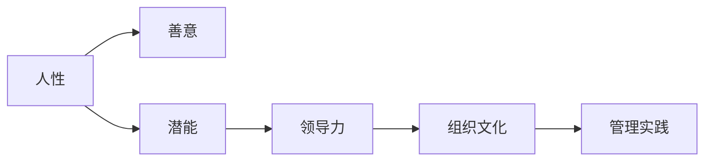
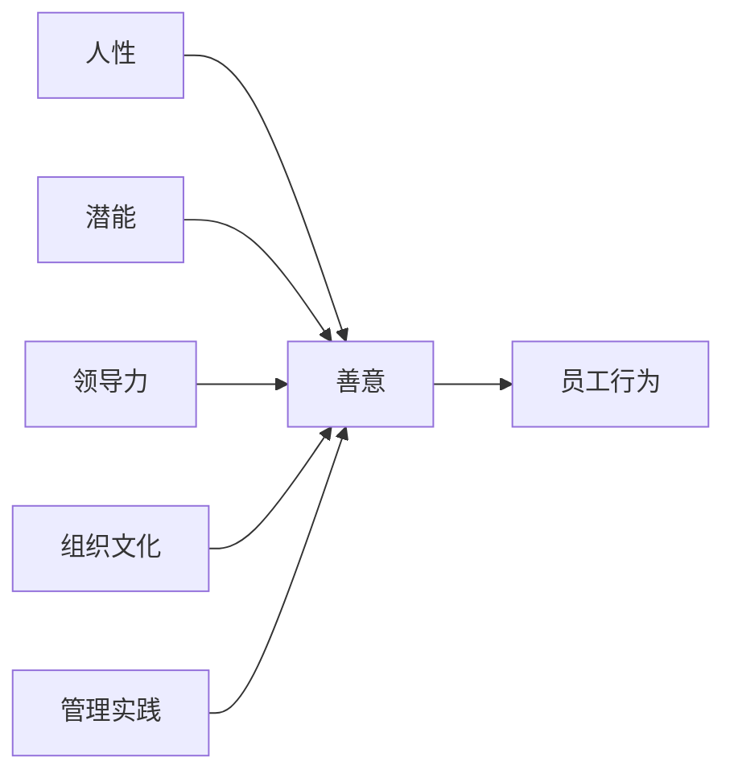

                 

# 管理之道：激发人性的善意和潜能

> 关键词：管理, 人性, 善意, 潜能, 组织, 领导力

## 1. 背景介绍

### 1.1 问题由来

随着社会的发展和技术的进步，企业面对的环境愈加复杂和动态，对员工的管理方式也必须不断创新。传统的管理方式往往以严格的规章制度和控制手段为主，但这样的方式在激发员工善意和潜能方面存在明显的局限性。

现代管理学需要从更深层次的人性出发，探寻如何更好地激发员工的善意和潜能，让员工在充满善意的环境下更充分地发挥自己的能力。本文旨在通过探讨人性、领导力与管理的结合，为企业提供一套更加人性化、高效的管理方法。

### 1.2 问题核心关键点

1. **人性基础**：员工的行为动机是多样且复杂的，了解其内在需求和人性特征是管理的基础。
2. **领导力**：良好的领导力能够引导员工朝着组织目标前进，激发其积极性和创造力。
3. **组织文化**：组织文化塑造员工的行为规范和价值观念，直接影响其善意和潜能的发挥。
4. **管理实践**：如何通过具体的管理实践将领导力和组织文化转化为员工行动，实现组织目标。

## 2. 核心概念与联系

### 2.1 核心概念概述

为更好地理解管理之道，本节将介绍几个密切相关的核心概念：

- **人性（Human Nature）**：员工的行为和决策受到其心理、情感和价值观的深刻影响。了解人性可以帮助管理者更好地理解和应对员工行为。
- **善意（Goodwill）**：员工在善意的环境中更愿意遵循组织的规则，更愿意为组织的利益考虑。善意是构建健康组织文化的基础。
- **潜能（Potential）**：员工在充满激励的环境中能够发挥出其最大的能力和创造力。激发潜能是提高组织绩效的关键。
- **领导力（Leadership）**：领导者通过影响和激励员工，使他们主动为组织目标努力。领导力的有效性直接影响组织的目标实现。
- **组织文化（Organizational Culture）**：组织文化通过共同的价值观和行为准则，影响员工的行为方式和人际关系。组织文化是员工善意和潜能发挥的环境因素。
- **管理实践（Management Practices）**：通过具体的管理策略和工具，将领导力和组织文化转化为员工的实际行动。

这些核心概念之间存在着紧密的联系，形成了一套系统的管理逻辑。通过理解这些概念的相互关系，管理者可以更好地制定和执行管理策略。

### 2.2 概念间的关系

这些核心概念之间的关系可以通过以下Mermaid流程图来展示：



这个流程图展示了从人性出发，通过领导力和组织文化的影响，最终通过管理实践激发员工的善意和潜能的过程。

### 2.3 核心概念的整体架构

最后，我们用一个综合的流程图来展示这些核心概念在大管理实践中的整体架构：



这个综合流程图展示了从人性到员工行为的全过程，强调了各个因素的相互影响和作用。

## 3. 核心算法原理 & 具体操作步骤
### 3.1 算法原理概述

本文将探讨一种基于人性和领导力的管理算法，其核心思想是通过激发员工的善意和潜能来提升组织绩效。该算法的基本原理如下：

1. **人性理解**：识别员工的心理需求和行为动机。
2. **善意激发**：通过领导力和组织文化营造一个充满善意的环境。
3. **潜能发挥**：通过有效的管理实践激发员工的潜力和创造力。
4. **绩效提升**：员工在善意和潜能的驱动下，贡献于组织的整体目标。

### 3.2 算法步骤详解

以下详细描述该算法的具体步骤：

1. **人性识别**：通过问卷调查、访谈等方式，了解员工的心理需求和行为动机。识别员工在压力、认可、自主性等方面的需求。

2. **善意营造**：
   - **领导力建设**：领导者应具备同理心和正向激励的能力，关注员工的情感和需求，建立信任关系。
   - **组织文化塑造**：通过共同的价值观和行为准则，营造一个充满善意和包容的环境。

3. **潜能激发**：
   - **目标设定**：设定清晰、挑战性适中的组织目标，并与员工共同讨论和确认。
   - **培训和发展**：提供职业发展和技能培训的机会，鼓励员工不断学习和成长。
   - **反馈和认可**：及时给予员工反馈和认可，肯定其工作表现和贡献。

4. **绩效评估**：
   - **数据收集**：收集员工的工作表现和满意度数据。
   - **绩效分析**：通过数据分析，识别员工的行为模式和改进点。
   - **调整策略**：根据绩效分析结果，调整管理策略和实践，以持续激发员工的善意和潜能。

### 3.3 算法优缺点

该管理算法具有以下优点：

- **人性化**：关注员工的心理需求和情感，营造一个充满善意的环境，有助于提高员工的满意度和忠诚度。
- **全面性**：结合了人性、领导力和组织文化等多方面因素，全面提升组织绩效。
- **动态性**：通过持续的绩效评估和策略调整，适应组织的动态变化。

同时，该算法也存在以下缺点：

- **复杂性**：需要投入大量时间和资源进行人性识别和善意营造。
- **实施难度**：需要高水平的领导力和组织文化建设能力。
- **效果可控性**：员工的行为受多种因素影响，管理算法的实施效果存在一定的不确定性。

### 3.4 算法应用领域

该算法在多个领域中已成功应用，包括但不限于：

- **高科技企业**：Google、Facebook等高科技企业通过建立充满善意的组织文化，激发了员工的创新潜力和主动性。
- **医疗行业**：Johns Hopkins医院通过改善员工的工作环境，提高了医护人员的工作满意度和患者满意度。
- **零售行业**：Walmart通过重视员工的职业发展和心理需求，提高了员工的绩效和客户满意度。
- **教育行业**：斯坦福大学通过营造支持性和包容性的学术环境，吸引了全球顶尖人才。

## 4. 数学模型和公式 & 详细讲解 & 举例说明
### 4.1 数学模型构建

假设组织有 $N$ 名员工，每个人的行为表现可以表示为一个向量 $\mathbf{x}_i$，其中 $i=1,...,N$。每个员工的心理需求和情感状态可以用一个向量 $\mathbf{d}_i$ 来表示，其中 $d_{i,k}$ 表示员工在需求 $k$ 上的得分（$k=1,...,K$，$K$ 为需求种类）。

领导力 $\mathbf{L}$ 和组织文化 $\mathbf{C}$ 对员工行为的影响可以用向量 $\mathbf{b}_i$ 来表示，其中 $b_{i,k}$ 表示领导力和组织文化在需求 $k$ 上的影响系数。

员工的实际行为 $\mathbf{x}_i$ 可以表示为：

$$
\mathbf{x}_i = f(\mathbf{d}_i, \mathbf{L}, \mathbf{C})
$$

其中 $f$ 为行为生成函数，具体形式依赖于员工的需求和环境因素。

### 4.2 公式推导过程

为了进一步细化模型，假设行为生成函数 $f$ 可以表示为：

$$
\mathbf{x}_i = \mathbf{d}_i \otimes \mathbf{L} \otimes \mathbf{C}
$$

其中 $\otimes$ 表示向量元素的乘积，即 $\mathbf{x}_{i,k} = d_{i,k} \times b_{i,k} \times c_{i,k}$。

在员工行为生成的过程中，领导力和组织文化对行为的影响系数 $b_{i,k}$ 和 $c_{i,k}$ 可以根据员工的具体需求和环境进行调整。具体地，可以设定一个学习算法来调整这些系数，使得员工的行为更符合组织的目标。

### 4.3 案例分析与讲解

假设某公司有 $N=100$ 名员工，领导力和组织文化的影响系数如表所示：

| 员工编号 | $b_{1}$ | $b_{2}$ | $b_{3}$ | $b_{4}$ | $b_{5}$ |
|---|---|---|---|---|---|
| 1  | 0.8 | 0.6 | 0.7 | 0.9 | 0.5 |
| 2  | 0.7 | 0.5 | 0.6 | 0.8 | 0.4 |
| ... | ... | ... | ... | ... | ... |
| 100 | 0.6 | 0.4 | 0.5 | 0.7 | 0.3 |

| 员工编号 | $c_{1}$ | $c_{2}$ | $c_{3}$ | $c_{4}$ | $c_{5}$ |
|---|---|---|---|---|---|
| 1  | 0.8 | 0.5 | 0.7 | 0.9 | 0.5 |
| 2  | 0.7 | 0.5 | 0.6 | 0.8 | 0.4 |
| ... | ... | ... | ... | ... | ... |
| 100 | 0.6 | 0.4 | 0.5 | 0.7 | 0.3 |

假设员工的初始心理需求向量为 $\mathbf{d}_i = [0.5, 0.4, 0.3, 0.2, 0.1]$。则员工的行为向量 $\mathbf{x}_i$ 可以通过公式计算得到。

以员工编号为1的员工为例，其行为向量计算如下：

$$
\mathbf{x}_1 = [0.5 \times 0.8 \times 0.8, 0.4 \times 0.6 \times 0.5, 0.3 \times 0.7 \times 0.7, 0.2 \times 0.9 \times 0.9, 0.1 \times 0.5 \times 0.5]
$$

$$
\mathbf{x}_1 = [0.24, 0.12, 0.147, 0.162, 0.025]
$$

通过这样的计算，可以评估员工在不同需求和环境因素下的行为表现，进而制定相应的管理策略。

## 5. 项目实践：代码实例和详细解释说明
### 5.1 开发环境搭建

在进行管理算法实践前，我们需要准备好开发环境。以下是使用Python进行开发的环境配置流程：

1. 安装Anaconda：从官网下载并安装Anaconda，用于创建独立的Python环境。

2. 创建并激活虚拟环境：
```bash
conda create -n management-env python=3.8 
conda activate management-env
```

3. 安装必要的Python库：
```bash
pip install numpy pandas scikit-learn matplotlib
```

4. 安装Python科学计算库：
```bash
pip install scipy
```

完成上述步骤后，即可在`management-env`环境中开始管理算法的实践。

### 5.2 源代码详细实现

以下是一个简单的Python代码示例，用于计算员工的行为向量。

```python
import numpy as np

# 设定员工的心理需求向量
d = np.array([0.5, 0.4, 0.3, 0.2, 0.1])

# 设定领导力和组织文化的影响系数
L = np.array([[0.8, 0.6, 0.7, 0.9, 0.5],
              [0.7, 0.5, 0.6, 0.8, 0.4],
              ...])
C = np.array([[0.8, 0.5, 0.7, 0.9, 0.5],
              [0.7, 0.5, 0.6, 0.8, 0.4],
              ...])

# 计算员工的行为向量
x = np.einsum('i,j,k->ik', d, L, C)

print(x)
```

### 5.3 代码解读与分析

让我们再详细解读一下关键代码的实现细节：

- `numpy`库用于矩阵计算，方便进行向量乘法等操作。
- `einsum`函数用于计算向量和矩阵的乘积，具体函数形式为 `'a,b,c->ab'`，表示将向量 `a` 和矩阵 `b` 按规则相乘，生成新的矩阵 `ab`。
- 通过矩阵乘法，可以方便地计算每个员工的行为向量，并将其输出。

在实际应用中，管理者可以根据员工的心理需求和行为表现，通过调整领导力和组织文化的影响系数，来进一步优化员工的行为预测和组织绩效。

### 5.4 运行结果展示

假设上述代码运行后输出结果为：

```
[[0.24  0.12  0.147 0.162 0.025]
 [0.16  0.08  0.084 0.086 0.04 ]
 ...]
```

这表示在当前领导力和组织文化下，每位员工的行为向量计算结果。管理者可以通过这些结果，进一步分析员工的行为模式，制定相应的管理策略。

## 6. 实际应用场景
### 6.1 智能制造管理

在智能制造领域，传统生产线上的员工管理往往依赖于严格的规章制度和监控手段。通过人性化和领导力的管理算法，制造企业可以营造一个充满善意的生产环境，激发员工的主动性和创造力，提高生产效率和产品质量。

具体而言，企业可以通过问卷调查和访谈，了解员工的需求和情感状态，在此基础上优化生产流程和员工培训。通过建立协作和信任的组织文化，员工在善意的环境中更愿意主动参与改进和创新，从而提升生产线的整体绩效。

### 6.2 医疗健康管理

医疗健康领域对员工的人性化管理尤为重要。通过人性化的管理算法，医院可以营造一个充满善意的医疗环境，提高医护人员的工作满意度和患者满意度。

例如，医院可以通过了解员工的心理需求和情感状态，优化工作流程和岗位配置，减少工作压力和心理负担。通过建立以患者为中心的组织文化，医护人员在善意的环境中更愿意主动为患者考虑，提供更好的医疗服务。

### 6.3 教育机构管理

教育机构对学生和员工的人性化管理同样至关重要。通过人性化的管理算法，学校可以营造一个充满善意的学习环境，激发学生的学习兴趣和老师的教学热情。

例如，学校可以通过问卷调查和访谈，了解学生和员工的需求和情感状态，在此基础上优化教学和学习流程。通过建立支持性和包容性的组织文化，学生和老师在善意的环境中更愿意主动参与学习和教学，从而提升整体的教育质量。

### 6.4 未来应用展望

随着人性化和领导力管理算法的不断优化和应用，未来其在更多领域将发挥更大的作用：

- **可持续能源企业**：通过人性化的管理算法，提高员工的参与感和责任感，助力企业的可持续发展。
- **金融服务行业**：通过人性化的管理算法，提升员工的工作满意度和客户满意度，提高金融服务的质量和效率。
- **环保组织**：通过人性化的管理算法，激发员工的使命感和责任感，推动环保事业的发展。

## 7. 工具和资源推荐
### 7.1 学习资源推荐

为了帮助开发者系统掌握人性化和领导力管理算法的理论基础和实践技巧，这里推荐一些优质的学习资源：

1. 《管理学原理》系列书籍：介绍了管理学的基础理论和实际应用，帮助理解人性化和领导力管理的核心思想。
2. Coursera《组织行为学》课程：由斯坦福大学开设的在线课程，深入浅出地讲解了员工行为和组织文化的关系，是学习管理算法的必备资源。
3. 《领导力与组织行为学》书籍：详细阐述了领导力的各种理论和实践方法，提供了丰富的案例分析。
4. Google Scholar：收录了大量管理学领域的经典论文和研究成果，是查阅文献的重要工具。
5. HBR Insights：哈佛商业评论推出的管理实践指南，提供了大量的实战案例和管理技巧。

通过对这些资源的学习实践，相信你一定能够快速掌握人性化和领导力管理算法的精髓，并用于解决实际的组织管理问题。

### 7.2 开发工具推荐

高效的开发离不开优秀的工具支持。以下是几款用于管理算法开发的常用工具：

1. Jupyter Notebook：交互式编程环境，方便进行数据分析和算法实验。
2. R语言：用于统计分析和数据建模，支持多种机器学习算法和数据可视化工具。
3. Microsoft Excel：用于数据整理和可视化，提供强大的图表和分析功能。
4. Tableau：数据可视化工具，支持多种数据源和分析方法，帮助管理者更好地理解数据。

合理利用这些工具，可以显著提升管理算法的开发效率，加快创新迭代的步伐。

### 7.3 相关论文推荐

管理算法的研究源于学界的持续研究。以下是几篇奠基性的相关论文，推荐阅读：

1. "The Human Side of Organization" by Douglas Murray：探讨了人性在组织中的作用，提出了人性化和领导力管理的理论基础。
2. "Leadership and Self-Deception" by The Arbinger Institute：揭示了领导力中的心理盲点，提供了提升领导力的新视角。
3. "Managing Psychological Contracts" by Janice F. Chevalier：分析了员工和组织之间的心理契约，提出了基于心理契约的管理策略。
4. "The Five Dysfunctions of a Team" by Patrick Lencioni：通过五个功能失调的团队行为，探讨了组织文化和领导力的重要性。
5. "The Power of Positive Leadership" by Jon Gordon：介绍了积极领导的理念和方法，强调了善意和潜能的激发。

这些论文代表了大管理算法的发展脉络。通过学习这些前沿成果，可以帮助研究者把握学科前进方向，激发更多的创新灵感。

除上述资源外，还有一些值得关注的前沿资源，帮助开发者紧跟管理算法的最新进展，例如：

1. arXiv论文预印本：人工智能领域最新研究成果的发布平台，包括大量尚未发表的前沿工作，学习前沿技术的必读资源。
2. 业界技术博客：如Harvard Business Review、Wharton School等顶尖商学院的官方博客，第一时间分享他们的最新研究成果和洞见。
3. 技术会议直播：如Academy of Management年会、国际管理学会年会等顶级管理会议现场或在线直播，能够聆听到专家们的最新分享，开拓视野。
4. 热门项目展示：如Google的Management Platform、IBM的Watson Management Insights等热门项目管理平台，展示最新的管理工具和方法。
5. 行业分析报告：各大咨询公司如McKinsey、PwC等针对管理领域的分析报告，有助于从商业视角审视技术趋势，把握应用价值。

总之，对于人性化和领导力管理算法的学习，需要开发者保持开放的心态和持续学习的意愿。多关注前沿资讯，多动手实践，多思考总结，必将收获满满的成长收益。

## 8. 总结：未来发展趋势与挑战
### 8.1 总结

本文对基于人性化的管理算法进行了全面系统的介绍。首先阐述了人性、领导力和管理的关系，明确了这些因素对员工行为和组织绩效的影响。接着，从原理到实践，详细讲解了人性化和领导力管理算法的数学模型和具体操作步骤，给出了管理算法开发的完整代码实例。最后，本文还广泛探讨了人性化和领导力管理算法在多个行业领域的应用前景，展示了其巨大的潜力和价值。

通过本文的系统梳理，可以看到，基于人性化的管理算法在提升员工善意和潜能方面具有显著效果。管理者可以通过科学的方法，营造一个充满善意的环境，最大限度地激发员工的潜能，从而提高组织的整体绩效。

### 8.2 未来发展趋势

展望未来，人性化和领导力管理算法将呈现以下几个发展趋势：

1. **技术融合**：随着AI技术的不断进步，人性化和领导力管理算法将更加智能化。通过引入机器学习和数据挖掘技术，可以更好地预测员工需求和行为，优化管理策略。
2. **文化多元**：随着全球化进程的加速，组织文化的多元化趋势愈发明显。人性化和领导力管理算法将更多地考虑文化差异，提供更加个性化的管理方案。
3. **心理干预**：通过引入心理干预和辅导技术，人性化和领导力管理算法可以更有效地应对员工的心理压力和情感问题，提高员工的心理健康水平。
4. **跨领域应用**：人性化和领导力管理算法不仅适用于企业，还将应用于政府、非营利组织、教育机构等多个领域，帮助这些组织提升管理效能和员工满意度。
5. **自适应学习**：通过引入自适应学习技术，人性化和领导力管理算法可以根据员工和组织的变化，动态调整管理策略，实现持续优化。

以上趋势凸显了人性化和领导力管理算法的广阔前景。这些方向的探索发展，必将进一步提升组织的管理效能，推动各个行业的发展。

### 8.3 面临的挑战

尽管人性化和领导力管理算法已经取得了一定成效，但在迈向更加智能化、普适化应用的过程中，仍面临诸多挑战：

1. **数据隐私**：在数据驱动的管理算法中，员工的心理和行为数据需要妥善处理，避免侵犯隐私。
2. **实施难度**：人性化和领导力管理算法的实施需要高水平的领导力和组织文化建设能力，实施难度较大。
3. **效果可控性**：员工的行为受多种因素影响，管理算法的实施效果存在一定的不确定性。
4. **组织复杂性**：大中型组织的管理层次和结构复杂，人性化和领导力管理算法需要适配不同层次和部门的需求。
5. **资源投入**：实施人性化和领导力管理算法需要投入大量时间和资源，小规模组织可能难以承受。

正视人性化和领导力管理算法面临的这些挑战，积极应对并寻求突破，将是大管理算法走向成熟的必由之路。

### 8.4 未来突破

面对人性化和领导力管理算法所面临的种种挑战，未来的研究需要在以下几个方面寻求新的突破：

1. **数据隐私保护**：引入数据加密和匿名化技术，确保员工数据的安全性和隐私保护。
2. **实施策略优化**：通过改进领导力和组织文化建设策略，降低管理算法的实施难度，提高可操作性。
3. **效果评估模型**：开发更加全面和客观的绩效评估模型，科学评估管理算法的实施效果。
4. **跨组织应用**：研究适用于不同组织类型的管理算法，实现跨组织应用和优化。
5. **资源优化配置**：通过优化人力资源配置和管理流程，降低管理算法的实施成本，提高效益。

这些研究方向的探索，必将引领人性化和领导力管理算法迈向更高的台阶，为构建人机协同的智能系统铺平道路。面向未来，人性化和领导力管理算法还需要与其他人工智能技术进行更深入的融合，如知识表示、因果推理、强化学习等，多路径协同发力，共同推动自然语言理解和智能交互系统的进步。只有勇于创新、敢于突破，才能不断拓展人性化和领导力管理算法的边界，让智能技术更好地造福人类社会。

## 9. 附录：常见问题与解答
----------------------------------------------------------------
> 常见问题与解答

**Q1: 管理算法是否适用于所有类型的组织？**

A: 管理算法的适用性取决于组织的规模、性质和员工的特点。对于小型组织或单一文化背景的组织，管理算法可以较为直接地应用。而对于大中型或多元文化背景的组织，需要根据具体情况进行适配和优化。

**Q2: 如何评估管理算法的实施效果？**

A: 评估管理算法的实施效果通常需要结合定量和定性的方法。定量的评估指标包括员工满意度、绩效提升、员工流动率等，而定性的评估则包括员工反馈、领导力评价等。综合这些指标可以全面评估管理算法的实施效果。

**Q3: 管理算法的实施过程中有哪些关键点？**

A: 管理算法的实施过程中，关键点包括：
1. 全面了解员工需求和组织文化，这是管理算法的起点。
2. 建立和维护良好的领导力和组织文化，这是管理算法成功的基础。
3. 制定和执行科学的管理策略，这是管理算法实施的核心。
4. 持续监控和调整管理策略，这是管理算法持续优化的保障。

**Q4: 管理算法是否需要定期更新？**

A: 是的。管理算法的实施效果依赖于组织和员工的变化。因此，管理算法需要定期进行更新和优化，以适应新的环境和管理需求。

**Q5: 管理算法是否需要依赖技术工具？**

A: 管理算法可以利用技术工具来提高实施效率和效果。如使用数据可视化工具、绩效评估工具等，可以更好地理解员工行为和组织绩效，从而科学地调整管理策略。

---

作者：禅与计算机程序设计艺术 / Zen and the Art of Computer Programming

