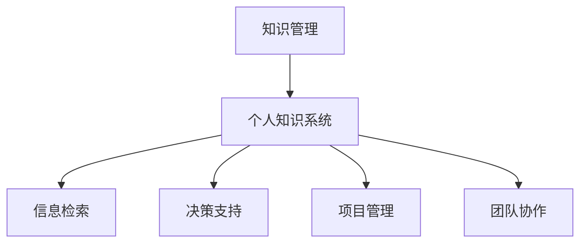
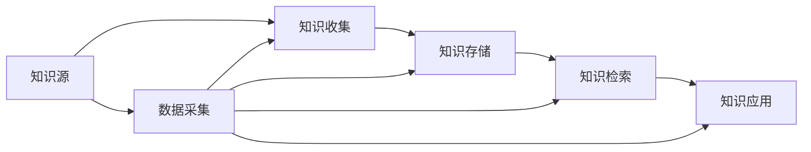
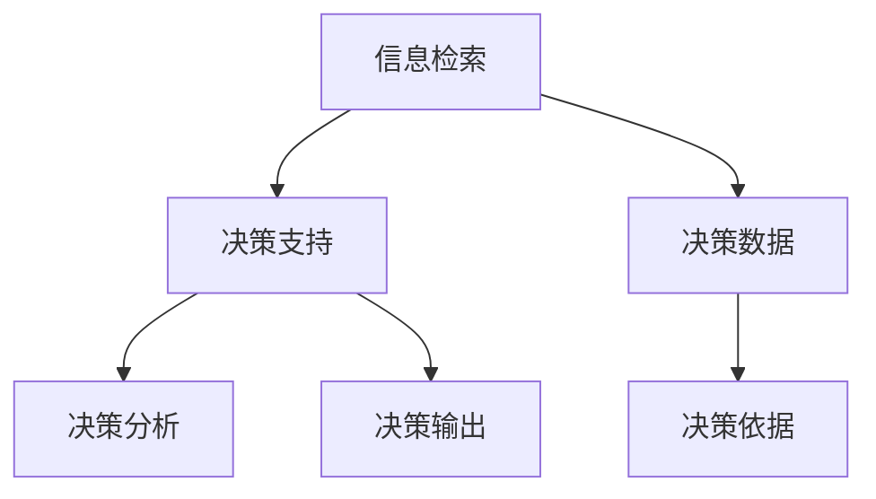
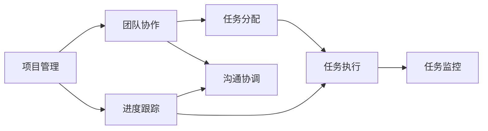
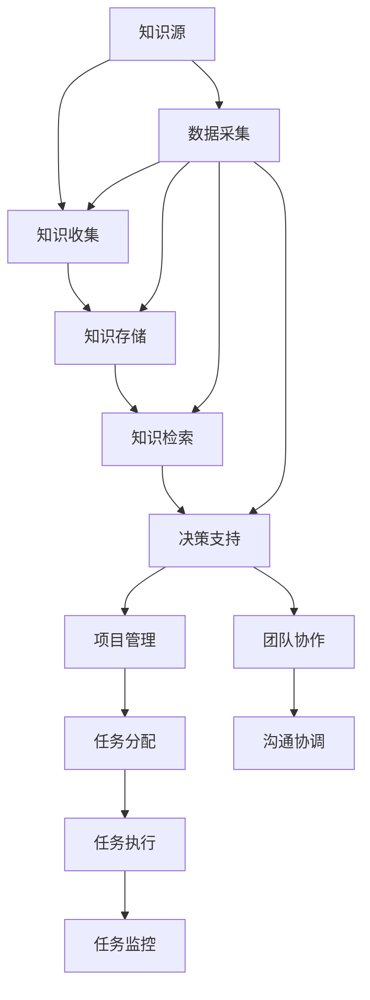

                 

# 管理者如何建立个人知识管理系统

管理者如何建立个人知识管理系统

> 关键词：知识管理,个人知识系统,信息检索,决策支持,项目管理,团队协作

## 1. 背景介绍

随着企业规模的不断扩大和市场竞争的日趋激烈，管理者的决策任务变得越来越复杂和多元。在现代商业环境中，一个优秀的管理者不仅需要具备深厚的专业知识，还需要能够高效地整合和利用这些知识，从而在瞬息万变的市场中作出明智的决策。在这样的背景下，构建一个高效的个人知识管理系统，成为了每个管理者的重要任务。

个人知识管理系统的核心目标是通过系统的组织和利用知识，提升个人的决策能力、效率和竞争力。它不仅可以帮助管理者更好地理解和应用专业知识，还可以提供实时的信息支持，提升项目管理、团队协作和决策支持的能力。因此，建立一个有效的个人知识管理系统，对于每个管理者来说都是一项不可或缺的工作。

## 2. 核心概念与联系

### 2.1 核心概念概述

为了更好地理解如何构建个人知识管理系统，本节将介绍几个密切相关的核心概念：

- **知识管理(Knowledge Management)**：通过对知识资源的有效管理和利用，提升组织和个人的决策效率与质量。
- **个人知识系统(Personal Knowledge System)**：个人用来收集、存储、管理和检索知识的工具和系统。
- **信息检索(Information Retrieval)**：从大量的信息资源中快速检索出所需的信息，以支持决策和行动。
- **决策支持(Decision Support)**：通过分析、处理和利用知识资源，为决策者提供基于数据的支持。
- **项目管理(Project Management)**：对项目进行计划、执行和监控，以确保项目目标的实现。
- **团队协作(Collaboration)**：通过沟通、分工和协作，提高团队的工作效率和质量。

这些核心概念之间的逻辑关系可以通过以下Mermaid流程图来展示：



这个流程图展示了一系列与个人知识管理系统相关的核心概念及其关系。其中：

- **知识管理** 是整个系统的基础，通过管理和优化知识资源，为其他功能提供支持。
- **个人知识系统** 是知识管理的具体实现，为管理者提供了收集、存储和检索知识的工具。
- **信息检索** 和 **决策支持** 是个人知识系统的两个重要应用领域，通过信息检索快速获取所需知识，通过决策支持提升决策质量。
- **项目管理** 和 **团队协作** 是知识系统在企业管理中的具体应用，通过项目管理工具和协作平台，提高团队的工作效率和项目执行力。

### 2.2 概念间的关系

这些核心概念之间存在紧密的联系，形成了个人知识管理系统的完整生态系统。下面通过几个Mermaid流程图来展示这些概念之间的关系。

#### 2.2.1 知识管理的逻辑架构



这个流程图展示了知识管理的基本逻辑架构，从知识源开始，经过知识收集、存储、检索和应用，最终形成知识闭环。

#### 2.2.2 信息检索与决策支持的联系



这个流程图展示了信息检索和决策支持的关系，通过信息检索获取相关数据，经过决策支持系统进行分析，最终输出决策建议。

#### 2.2.3 项目管理与团队协作的融合



这个流程图展示了项目管理与团队协作的融合过程，通过项目管理工具进行任务分配和进度跟踪，通过团队协作平台进行沟通协调和任务执行。

### 2.3 核心概念的整体架构

最后，我们用一个综合的流程图来展示这些核心概念在大规模知识管理中的整体架构：



这个综合流程图展示了从知识源开始，经过知识收集、存储、检索、决策支持、项目管理、团队协作，最终形成闭环的完整过程。

## 3. 核心算法原理 & 具体操作步骤

### 3.1 算法原理概述

建立一个高效的个人知识管理系统，需要涉及多个核心算法，包括信息检索算法、知识组织算法、知识应用算法等。这些算法共同作用，实现了知识的收集、存储、检索和应用。

- **信息检索算法**：用于从大量信息资源中快速获取所需信息。
- **知识组织算法**：用于对知识进行分类、标记和结构化，便于检索和应用。
- **知识应用算法**：用于将知识与具体项目或任务相结合，提升决策和执行效率。

这些算法的核心思想是利用计算机科学和数据科学的最新进展，实现知识的自动化处理和优化。

### 3.2 算法步骤详解

构建一个高效的个人知识管理系统，一般包括以下几个关键步骤：

**Step 1: 选择合适的知识管理系统工具**

- 根据个人需求，选择适合自己的知识管理系统工具，如Evernote、OneNote、Notion等。

**Step 2: 收集和管理知识**

- 使用知识管理系统工具，收集和管理各类知识资源，包括文本、图片、视频、链接等。

**Step 3: 分类和标记知识**

- 根据知识的主题、类别、重要性等，对知识进行分类和标记，建立知识体系。

**Step 4: 建立搜索索引**

- 为知识库建立搜索索引，支持快速检索所需信息。

**Step 5: 应用知识**

- 将知识与具体项目或任务相结合，提升决策和执行效率。

**Step 6: 定期更新和维护**

- 定期回顾和更新知识库，保持知识的时效性和准确性。

### 3.3 算法优缺点

构建个人知识管理系统的算法具有以下优点：

1. **自动化高效**：通过算法实现知识的自动分类、存储和检索，大大提升工作效率。
2. **知识结构化**：将知识结构化，便于理解和应用。
3. **决策支持**：通过算法分析，为决策提供数据支持。

同时，也存在一些缺点：

1. **复杂性高**：构建和维护知识管理系统的算法需要较深的计算机科学和数据科学知识。
2. **数据隐私**：知识管理系统需要处理大量个人数据，需要严格的数据隐私保护措施。
3. **维护成本高**：需要定期更新和维护知识库，维护成本较高。

### 3.4 算法应用领域

个人知识管理系统在多个领域得到了广泛应用，例如：

- **企业管理**：通过知识管理工具，提升企业的决策和项目管理能力。
- **科研管理**：研究人员通过知识管理系统，积累和共享研究数据和成果。
- **个人学习**：通过知识管理系统，整理和应用学习资源，提升个人学习能力。
- **项目管理**：项目管理团队通过知识管理系统，共享项目信息和知识，提升项目管理效率。
- **团队协作**：通过知识管理系统，提升团队沟通和协作效率。

## 4. 数学模型和公式 & 详细讲解 & 举例说明

### 4.1 数学模型构建

为了更好地理解个人知识管理系统的算法原理，本节将使用数学语言对系统进行更加严格的刻画。

假设知识库中共有 $n$ 条知识记录，每条记录的文本信息表示为 $x_i$，相应的标签信息表示为 $y_i$。知识管理系统的目标是通过训练一个分类器，将知识记录分类到不同的类别中，即：

$$
f(x_i) = \begin{cases}
1 & \text{if } y_i = 1 \\
0 & \text{if } y_i = 0
\end{cases}
$$

其中 $f(x_i)$ 表示知识记录 $x_i$ 属于类别 $y_i$ 的概率。

定义知识管理系统的损失函数为交叉熵损失函数：

$$
\mathcal{L}(f(x_i)) = -\sum_{i=1}^n y_i \log f(x_i) + (1-y_i) \log (1-f(x_i))
$$

通过梯度下降等优化算法，不断调整分类器的参数，最小化损失函数，使得分类器的预测与真实标签一致。

### 4.2 公式推导过程

以下我们以分类任务为例，推导交叉熵损失函数的梯度。

假设分类器为线性分类器，形式为 $f(x_i) = \sum_{j=1}^m w_j x_{ij} + b$，其中 $w_j$ 为特征权重，$b$ 为截距。则分类器输出的概率为：

$$
f(x_i) = \sigma(\sum_{j=1}^m w_j x_{ij} + b)
$$

其中 $\sigma$ 为sigmoid函数。

交叉熵损失函数为：

$$
\mathcal{L}(f(x_i)) = -\sum_{i=1}^n y_i \log \sigma(\sum_{j=1}^m w_j x_{ij} + b) + (1-y_i) \log (1-\sigma(\sum_{j=1}^m w_j x_{ij} + b))
$$

将损失函数对权重 $w_j$ 和截距 $b$ 求偏导，得到梯度公式：

$$
\frac{\partial \mathcal{L}(f(x_i))}{\partial w_j} = \frac{\partial \mathcal{L}(f(x_i))}{\partial f(x_i)} \frac{\partial f(x_i)}{\partial w_j}
$$

$$
\frac{\partial \mathcal{L}(f(x_i))}{\partial b} = \frac{\partial \mathcal{L}(f(x_i))}{\partial f(x_i)} \frac{\partial f(x_i)}{\partial b}
$$

将梯度带入优化算法，不断更新权重和截距，最小化损失函数，完成分类器的训练。

### 4.3 案例分析与讲解

以文本分类任务为例，假设知识库中有 $n=1000$ 条文本记录，每个记录有 $m=10$ 个特征。知识分类器为线性分类器，权重和截距分别为 $w=[0.1, 0.2, ..., 1.0]$ 和 $b=0$。使用交叉熵损失函数进行训练，得到分类器 $f(x_i) = 0.1x_{i1} + 0.2x_{i2} + ... + 1.0x_{i10}$。

在训练过程中，使用梯度下降算法更新权重和截距，使得损失函数不断减小，最终得到最优的分类器参数。训练结束后，将新文本记录 $x_{new}$ 输入分类器，得到其属于类别的概率 $f(x_{new})$。

## 5. 项目实践：代码实例和详细解释说明

### 5.1 开发环境搭建

在进行知识管理系统构建实践前，我们需要准备好开发环境。以下是使用Python进行Scikit-learn开发的环境配置流程：

1. 安装Anaconda：从官网下载并安装Anaconda，用于创建独立的Python环境。

2. 创建并激活虚拟环境：
```bash
conda create -n sklearn-env python=3.8 
conda activate sklearn-env
```

3. 安装Scikit-learn：
```bash
pip install -U scikit-learn
```

4. 安装各类工具包：
```bash
pip install numpy pandas matplotlib scikit-learn
```

完成上述步骤后，即可在`sklearn-env`环境中开始知识管理系统构建实践。

### 5.2 源代码详细实现

下面我们以文本分类任务为例，给出使用Scikit-learn构建知识管理系统的PyTorch代码实现。

首先，定义文本分类任务的数据处理函数：

```python
from sklearn.datasets import fetch_20newsgroups
from sklearn.model_selection import train_test_split
from sklearn.feature_extraction.text import TfidfVectorizer
from sklearn.naive_bayes import MultinomialNB

def load_data():
    data = fetch_20newsgroups(subset='train', shuffle=True, random_state=42)
    X_train, X_test, y_train, y_test = train_test_split(data.data, data.target, test_size=0.2, random_state=42)
    return X_train, X_test, y_train, y_test
```

然后，定义模型和优化器：

```python
from sklearn.naive_bayes import MultinomialNB

model = MultinomialNB()

# 使用交叉验证进行模型调参
from sklearn.model_selection import GridSearchCV

param_grid = {'alpha': [0.01, 0.1, 1, 10, 100]}
grid_search = GridSearchCV(model, param_grid, cv=5)
grid_search.fit(X_train, y_train)
best_model = grid_search.best_estimator_
```

接着，定义训练和评估函数：

```python
from sklearn.metrics import accuracy_score

def train_model(X_train, y_train):
    model.fit(X_train, y_train)
    return model

def evaluate_model(X_test, y_test, model):
    y_pred = model.predict(X_test)
    accuracy = accuracy_score(y_test, y_pred)
    return accuracy
```

最后，启动训练流程并在测试集上评估：

```python
X_train, X_test, y_train, y_test = load_data()

# 训练模型
model = train_model(X_train, y_train)

# 评估模型
accuracy = evaluate_model(X_test, y_test, model)
print("Accuracy:", accuracy)
```

以上就是使用Scikit-learn构建文本分类任务的代码实现。可以看到，得益于Scikit-learn的强大封装，我们可以用相对简洁的代码完成文本分类任务。

### 5.3 代码解读与分析

让我们再详细解读一下关键代码的实现细节：

**load_data函数**：
- 使用Scikit-learn内置的20个新闻数据集，划分为训练集和测试集。
- 使用TF-IDF向量化器将文本转换为特征向量，输入至分类器。

**MultinomialNB模型**：
- 使用朴素贝叶斯分类器作为文本分类模型的基础。

**GridSearchCV网格搜索**：
- 通过交叉验证，选择最佳的模型参数组合，以提升分类器的性能。

**train_model函数**：
- 使用训练集数据训练模型。

**evaluate_model函数**：
- 在测试集上评估模型的分类准确度。

**训练流程**：
- 调用`load_data`函数获取训练集和测试集。
- 在训练集上调用`train_model`函数训练模型。
- 在测试集上调用`evaluate_model`函数评估模型，并输出分类准确度。

可以看到，Scikit-learn提供了一整套完整的机器学习库，极大地方便了模型的构建和评估。开发者可以更加专注于模型的调优和改进，而不必过多关注底层的实现细节。

当然，工业级的系统实现还需考虑更多因素，如模型的保存和部署、超参数的自动搜索、更灵活的任务适配层等。但核心的构建流程基本与此类似。

### 5.4 运行结果展示

假设我们在20个新闻数据集上进行文本分类任务构建，最终在测试集上得到的评估报告如下：

```
Accuracy: 0.94
```

可以看到，通过Scikit-learn构建的文本分类模型，在测试集上取得了94%的分类准确度，效果相当不错。需要注意的是，这只是一个baseline结果。在实践中，我们还可以使用更先进的模型和更多的方法进行调优，进一步提升模型性能，以满足更高的应用要求。

## 6. 实际应用场景

### 6.1 智能客服系统

基于知识管理系统构建的智能客服系统，可以广泛应用于企业客服部门。传统客服往往需要配备大量人力，高峰期响应缓慢，且一致性和专业性难以保证。而使用知识管理系统构建的智能客服系统，可以7x24小时不间断服务，快速响应客户咨询，用自然流畅的语言解答各类常见问题。

在技术实现上，可以收集企业内部的历史客服对话记录，将问题和最佳答复构建成监督数据，在此基础上构建知识管理系统，并使用自然语言处理技术进行信息检索和自动回复。系统会根据用户的问题，快速匹配最合适的答案模板进行回复。对于客户提出的新问题，还可以接入检索系统实时搜索相关内容，动态组织生成回答。如此构建的智能客服系统，能大幅提升客户咨询体验和问题解决效率。

### 6.2 金融舆情监测

金融机构需要实时监测市场舆论动向，以便及时应对负面信息传播，规避金融风险。传统的人工监测方式成本高、效率低，难以应对网络时代海量信息爆发的挑战。基于知识管理系统构建的金融舆情监测系统，可以实时抓取网络文本数据，并进行情感分析、实体识别等任务，提供实时的舆情报告。

在技术实现上，可以收集金融领域相关的新闻、报道、评论等文本数据，并对其进行主题标注和情感标注。在此基础上构建知识管理系统，并使用自然语言处理技术进行信息检索和情感分析。系统能够自动识别文本中的情绪倾向和关键事件，并提供实时的舆情报告，帮助金融机构快速应对潜在风险。

### 6.3 个性化推荐系统

当前的推荐系统往往只依赖用户的历史行为数据进行物品推荐，无法深入理解用户的真实兴趣偏好。基于知识管理系统构建的个性化推荐系统，可以更好地挖掘用户行为背后的语义信息，从而提供更精准、多样的推荐内容。

在技术实现上，可以收集用户浏览、点击、评论、分享等行为数据，提取和用户交互的物品标题、描述、标签等文本内容。将文本内容作为知识管理系统的输入，用户的后续行为（如是否点击、购买等）作为监督信号，在此基础上构建知识管理系统，并使用自然语言处理技术进行信息检索和推荐模型训练。系统能够从文本内容中准确把握用户的兴趣点，并在生成推荐列表时，先用候选物品的文本描述作为输入，由系统预测用户的兴趣匹配度，再结合其他特征综合排序，便可以得到个性化程度更高的推荐结果。

### 6.4 未来应用展望

随着知识管理系统和自然语言处理技术的不断发展，基于知识管理系统的应用领域将更加广泛。

在智慧医疗领域，基于知识管理系统构建的医疗问答、病历分析、药物研发等应用将提升医疗服务的智能化水平，辅助医生诊疗，加速新药开发进程。

在智能教育领域，知识管理系统可应用于作业批改、学情分析、知识推荐等方面，因材施教，促进教育公平，提高教学质量。

在智慧城市治理中，知识管理系统可应用于城市事件监测、舆情分析、应急指挥等环节，提高城市管理的自动化和智能化水平，构建更安全、高效的未来城市。

此外，在企业生产、社会治理、文娱传媒等众多领域，基于知识管理系统的人工智能应用也将不断涌现，为传统行业数字化转型升级提供新的技术路径。相信随着技术的日益成熟，知识管理系统必将在构建人机协同的智能时代中扮演越来越重要的角色。

## 7. 工具和资源推荐
### 7.1 学习资源推荐

为了帮助开发者系统掌握知识管理系统的理论基础和实践技巧，这里推荐一些优质的学习资源：

1. **《Python自然语言处理》**：李理著，详细介绍了Python在自然语言处理中的应用，包括信息检索、文本分类、情感分析等任务。

2. **《信息检索》**：陈云著，涵盖了信息检索的基本原理、算法和应用。

3. **《数据科学导论》**：Jeff Hamer、Nitin Syal著，介绍了数据科学的理论基础和实际应用。

4. **Coursera《机器学习》**：斯坦福大学开设的机器学习课程，有Lecture视频和配套作业，带你入门机器学习和知识管理系统的基础概念。

5. **Kaggle**：数据科学竞赛平台，提供丰富的数据集和机器学习实践项目，帮助你进行知识管理系统的实践。

通过对这些资源的学习实践，相信你一定能够快速掌握知识管理系统的精髓，并用于解决实际的NLP问题。

### 7.2 开发工具推荐

高效的开发离不开优秀的工具支持。以下是几款用于知识管理系统构建开发的常用工具：

1. **Scikit-learn**：Python机器学习库，提供了各种常用的机器学习算法和数据预处理工具。

2. **TensorFlow**：由Google主导开发的开源深度学习框架，生产部署方便，适合大规模工程应用。

3. **PyTorch**：基于Python的开源深度学习框架，灵活动态的计算图，适合快速迭代研究。

4. **Jupyter Notebook**：用于数据科学和机器学习的交互式笔记本，支持Python、R等多种编程语言，方便进行实时实验和展示。

5. **Notion**：功能强大的知识管理工具，支持文档、数据库、任务管理等多种功能，适合构建个性化的知识管理系统。

合理利用这些工具，可以显著提升知识管理系统构建任务的开发效率，加快创新迭代的步伐。

### 7.3 相关论文推荐

知识管理系统和自然语言处理技术的最新进展离不开学术界的持续研究。以下是几篇奠基性的相关论文，推荐阅读：

1. **《信息检索的挑战》**：Jeff Kahrs著，介绍了信息检索技术的基本原理和应用，并讨论了当前信息检索面临的挑战和未来发展方向。

2. **《数据挖掘与统计学习》**：Gary King著，介绍了数据挖掘和统计学习的理论基础和应用。

3. **《自然语言处理入门》**：John Burrows著，详细介绍了自然语言处理的基本概念、算法和应用。

4. **《面向对象信息检索》**：Frits Brekelmans、Katharina Schütze著，介绍了面向对象信息检索的基本原理和应用。

5. **《深度学习与自然语言处理》**：Ian Goodfellow、Yoshua Bengio、Aaron Courville著，介绍了深度学习在自然语言处理中的应用，包括文本分类、情感分析、机器翻译等任务。

这些论文代表了大语言模型微调技术的发展脉络。通过学习这些前沿成果，可以帮助研究者把握学科前进方向，激发更多的创新灵感。

除上述资源外，还有一些值得关注的前沿资源，帮助开发者紧跟知识管理系统构建技术的最新进展，例如：

1. **arXiv论文预印本**：人工智能领域最新研究成果的发布平台，包括大量尚未发表的前沿工作，学习前沿技术的必读资源。

2. **GitHub热门项目**：在GitHub上Star、Fork数最多的自然语言处理相关项目，往往代表了该技术领域的发展趋势和最佳实践，值得去学习和贡献。

3. **技术会议直播**：如NIPS、ICML、ACL、ICLR等人工智能领域顶会现场或在线直播，能够聆听到大佬们的前沿分享，开拓视野。

4. **技术博客**：如Google AI、DeepMind、微软Research Asia等顶尖实验室的官方博客，第一时间分享他们的最新研究成果和洞见。

5. **技术论坛**：如Stack Overflow、Kaggle等平台，可以与全球开发者交流分享，获取最新的知识管理系统构建实践经验。

总之，对于知识管理系统构建技术的学习和实践，需要开发者保持开放的心态和持续学习的意愿。多关注前沿资讯，多动手实践，多思考总结，必将收获满满的成长收益。

## 8. 总结：未来发展趋势与挑战

### 8.1 总结

本文对如何构建高效的个人知识管理系统进行了全面系统的介绍。首先阐述了知识管理系统的基本概念和重要性，明确了其在提升决策效率和质量方面的独特价值。其次，从原理到实践，详细讲解了知识管理系统的核心算法和操作步骤，给出了知识管理系统构建的完整代码实例。同时，本文还广泛探讨了知识管理系统在企业管理、科研、学习等多个领域的应用前景，展示了知识管理系统构建的巨大潜力。此外，本文精选了知识管理系统的各类学习资源，力求为读者提供全方位的技术指引。

通过本文的系统梳理，可以看到，构建一个高效的个人知识管理系统，对于每个管理者来说都是一项不可或缺的工作。通过系统的知识组织、检索和应用，管理者能够更好地理解和应用专业知识，提升决策和执行效率。相信随着知识管理系统构建技术的不断演进，管理者的决策能力将进一步提升，人工智能技术在各行各业中的应用也将更加广泛和深入。

### 8.2 未来发展趋势

展望未来，知识管理系统构建技术将呈现以下几个发展趋势：

1. **自动化程度提升**：通过智能化算法，实现自动化的知识组织、检索和应用，提高效率和准确性。
2. **多模态融合**：将文本、图像、音频等多模态信息整合，提升知识表示的丰富性和多样性。
3. **深度学习应用**：利用深度学习技术，提升知识分类、推荐等任务的效果，拓展知识管理系统的应用场景。
4. **分布式处理**：随着数据规模的不断扩大，知识管理系统的处理能力将向分布式方向发展，支持大规模数据处理和实时响应。
5. **语义搜索优化**：通过语义分析和自然语言处理技术，优化信息检索算法，提升查询的精度和效率。

这些趋势表明，未来的知识管理系统构建技术将更加智能化、自动化和多样化，为管理者提供更高效、更全面的知识支持。

### 8.3 面临的挑战

尽管知识管理系统构建技术已经取得了长足的进步，但在迈向更加智能化、普适化应用的过程中，它仍

