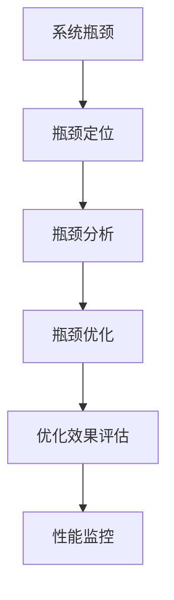

                 

# 系统瓶颈分析与优化最佳实践

系统瓶颈指的是在计算机系统中，某些部分由于资源（如CPU、内存、网络带宽、磁盘I/O等）的限制，导致整个系统的性能无法进一步提升。系统瓶颈是高性能系统开发中必须面对和解决的关键问题。本博客将详细介绍系统瓶颈分析的基本概念、方法、以及优化实践，以帮助开发者在实际开发中更好地诊断和解决系统瓶颈问题。

## 1. 背景介绍

### 1.1 问题由来

在计算机系统的运行过程中，性能瓶颈问题常常困扰着系统开发者。常见的瓶颈问题包括CPU使用率过高、内存不足、磁盘I/O延迟、网络带宽限制等。这些问题不仅会降低系统的响应速度，影响用户体验，还可能导致系统崩溃或服务不可用。因此，系统瓶颈分析与优化成为保证系统稳定性和性能的关键任务。

### 1.2 问题核心关键点

系统瓶颈分析与优化的核心关键点包括：
- 确定性能瓶颈位置。
- 分析瓶颈原因。
- 选择优化方案。
- 评估优化效果。

### 1.3 问题研究意义

系统瓶颈分析与优化的研究意义在于：
1. 提升系统性能。通过优化瓶颈部分，可以显著提高系统响应速度和吞吐量，增强用户体验。
2. 降低系统成本。合理利用资源，避免不必要的资源浪费，降低硬件和维护成本。
3. 提高系统可靠性。优化瓶颈部分，可以减少系统崩溃和故障，增强系统稳定性。
4. 加速开发进程。及时发现并解决瓶颈问题，可以加快系统迭代和交付速度。

## 2. 核心概念与联系

### 2.1 核心概念概述

为更好地理解系统瓶颈分析与优化，本节将介绍几个密切相关的核心概念：

- **系统瓶颈**：指在系统中存在的一个或多个限制性能提升的环节。瓶颈可能是硬件资源不足、软件算法效率低、数据存储不合理等原因造成的。

- **瓶颈定位**：通过各种工具和技术手段，确定系统中性能瓶颈所在的具体位置。

- **瓶颈分析**：对定位到的瓶颈部分进行分析，找出导致性能瓶颈的具体原因。

- **瓶颈优化**：选择适当的优化方案，改进瓶颈部分，以提升系统性能。

- **优化效果评估**：评估优化措施的效果，确认瓶颈是否已经被解决。

- **性能监控**：持续监控系统性能，及时发现新的瓶颈问题。

这些核心概念之间的逻辑关系可以通过以下Mermaid流程图来展示：



这个流程图展示了系统瓶颈分析与优化的整体流程：首先定位瓶颈位置，然后分析瓶颈原因，接着优化瓶颈部分，评估优化效果，最后进行性能监控，形成一个闭环。

### 2.2 概念间的关系

这些核心概念之间存在着紧密的联系，形成了系统瓶颈分析与优化的完整生态系统。

#### 2.2.1 瓶颈定位

瓶颈定位是系统瓶颈分析与优化的第一步，也是最关键的一步。定位瓶颈位置通常需要采用各种工具和技术手段，如性能监控工具、CPU Profiler、内存分析工具等。

#### 2.2.2 瓶颈分析

瓶颈分析是确定瓶颈位置后的核心环节。分析瓶颈的原因通常需要借助各种技术手段，如代码审查、算法分析、资源使用统计等。

#### 2.2.3 瓶颈优化

瓶颈优化是解决瓶颈问题的具体方案，通常包括硬件升级、软件优化、算法改进等。优化方案的选择应综合考虑性能提升和成本投入。

#### 2.2.4 优化效果评估

优化效果评估是评估优化措施是否有效的关键步骤。通常通过各种性能测试和监控工具进行评估，确认瓶颈是否已经被解决。

#### 2.2.5 性能监控

性能监控是系统瓶颈分析与优化的持续环节。通过持续监控系统性能，及时发现新的瓶颈问题，确保系统长期稳定运行。

这些核心概念共同构成了系统瓶颈分析与优化的完整生态系统，使其能够针对不同的瓶颈问题，采取有效的优化措施，保证系统的稳定性和性能。

## 3. 核心算法原理 & 具体操作步骤

### 3.1 算法原理概述

系统瓶颈分析与优化的核心原理是通过性能监控和诊断工具，识别出系统中性能瓶颈的具体位置，分析瓶颈原因，并选择适当的优化方案，提升系统性能。

### 3.2 算法步骤详解

系统瓶颈分析与优化的主要步骤如下：

**Step 1: 准备性能监控工具**

- 选择适合的性能监控工具，如Gprof、Valgrind、perf等。
- 配置工具参数，确保能够捕获到系统瓶颈数据。

**Step 2: 采集性能数据**

- 运行系统负载，记录性能监控工具的输出。
- 获取CPU使用率、内存使用率、磁盘I/O、网络带宽等关键性能指标。

**Step 3: 瓶颈定位**

- 分析性能监控工具输出，确定瓶颈所在的具体位置。
- 例如，CPU使用率过高可能意味着CPU瓶颈，内存使用率过高可能意味着内存瓶颈。

**Step 4: 瓶颈分析**

- 使用代码审查、算法分析、资源使用统计等手段，分析瓶颈原因。
- 例如，CPU瓶颈可能是由于算法效率低、循环嵌套过深等原因造成的。

**Step 5: 瓶颈优化**

- 选择适当的优化方案，如算法改进、代码重构、硬件升级等。
- 优化方案应综合考虑性能提升和成本投入。

**Step 6: 优化效果评估**

- 使用性能监控工具，测试优化效果。
- 例如，CPU使用率从90%降低到50%，即可认为瓶颈已解决。

**Step 7: 性能监控**

- 使用性能监控工具，持续监控系统性能。
- 及时发现新的瓶颈问题，确保系统长期稳定运行。

### 3.3 算法优缺点

系统瓶颈分析与优化的主要优点包括：
1. 提升系统性能。通过优化瓶颈部分，可以显著提高系统响应速度和吞吐量，增强用户体验。
2. 降低系统成本。合理利用资源，避免不必要的资源浪费，降低硬件和维护成本。
3. 提高系统可靠性。优化瓶颈部分，可以减少系统崩溃和故障，增强系统稳定性。
4. 加速开发进程。及时发现并解决瓶颈问题，可以加快系统迭代和交付速度。

同时，该方法也存在一定的局限性：
1. 依赖工具和技术。系统瓶颈分析与优化需要专业的性能监控工具和技术支持，工具选择和配置不当可能导致误诊或漏诊。
2. 需要专业知识。瓶颈分析与优化通常需要具备一定的系统设计和算法优化经验，初学者可能难以入门。
3. 风险和不确定性。优化方案的选择可能存在风险和不确定性，优化后效果可能不如预期。
4. 需要持续维护。系统性能是动态变化的，需要持续监控和优化，保持系统稳定运行。

尽管存在这些局限性，但就目前而言，系统瓶颈分析与优化仍是系统性能提升的重要手段。未来相关研究的重点在于如何进一步降低工具和技术依赖，提高优化方法的普适性和易用性，同时兼顾性能提升和成本投入。

### 3.4 算法应用领域

系统瓶颈分析与优化技术广泛应用于以下几个领域：

- **高性能计算**：如科学计算、数据处理等需要高性能计算的任务。优化CPU、内存、网络带宽等瓶颈，提升计算速度和效率。

- **云计算平台**：如AWS、Google Cloud等云服务提供商，优化服务器资源配置，提高云服务性能和稳定性。

- **移动应用**：如智能手机、平板等移动设备的应用开发，优化CPU、内存等瓶颈，提升应用响应速度和用户体验。

- **互联网应用**：如Web服务、API接口等互联网应用，优化网络带宽、数据库性能等瓶颈，提升应用响应速度和扩展性。

- **物联网设备**：如智能家居、智能穿戴设备等物联网设备，优化处理器、内存等瓶颈，提升设备响应速度和数据处理能力。

以上领域中，系统瓶颈分析与优化技术在每个环节都发挥着重要作用，是保障系统性能的关键技术手段。

## 4. 数学模型和公式 & 详细讲解 & 举例说明

### 4.1 数学模型构建

系统瓶颈分析与优化主要涉及性能监控和诊断，数学模型相对简单。以下将详细介绍系统瓶颈分析的数学模型构建。

假设系统瓶颈部分为CPU，设当前CPU使用率为 $U$，理想CPU使用率为 $U_0$。定义CPU瓶颈度量指标 $M$ 为：

$$
M = \frac{U}{U_0} - 1
$$

其中 $U_0$ 为系统正常运行时的CPU使用率上限。当 $M=0$ 时，表示CPU使用率为理想状态；当 $M>0$ 时，表示CPU使用率超出理想状态，瓶颈已经存在。

### 4.2 公式推导过程

通过上述公式，可以初步评估系统瓶颈的程度。具体公式推导如下：

设系统瓶颈部分为CPU，假设当前CPU使用率为 $U$，CPU瓶颈度量指标为 $M$，则有：

$$
M = \frac{U}{U_0} - 1
$$

将 $M$ 代入公式，得：

$$
U = M \cdot U_0 + U_0
$$

通过 $U$ 与 $U_0$ 的关系，可以确定CPU使用率的瓶颈程度。当 $M>0$ 时，表示CPU使用率超出理想状态，瓶颈已经存在。

### 4.3 案例分析与讲解

以下以一个具体的系统瓶颈优化案例，详细讲解瓶颈分析与优化的全过程。

假设某在线教育平台，系统瓶颈在CPU部分。通过性能监控工具，发现当前CPU使用率为80%，理想CPU使用率为70%，瓶颈度量指标为 $M=0.1$。

**Step 1: 瓶颈定位**

通过性能监控工具，定位到CPU瓶颈的具体位置，可能是算法效率低、循环嵌套过深等原因造成的。

**Step 2: 瓶颈分析**

使用代码审查、算法分析等手段，发现算法效率低是瓶颈的主要原因。算法中的循环嵌套深度较大，导致CPU使用率偏高。

**Step 3: 瓶颈优化**

优化算法，改进循环嵌套结构，减少计算量。通过优化后的算法，CPU使用率降低到60%，瓶颈度量指标 $M=-0.1$，瓶颈已经解决。

**Step 4: 优化效果评估**

通过性能监控工具，测试优化效果。CPU使用率从80%降低到60%，即瓶颈已经解决。

**Step 5: 性能监控**

使用性能监控工具，持续监控系统性能。发现CPU使用率稳定在60%左右，没有新的瓶颈问题出现。

通过上述案例，可以看到系统瓶颈分析与优化的全过程。从瓶颈定位到优化效果评估，每一步都需要细心的分析和实践。

## 5. 项目实践：代码实例和详细解释说明

### 5.1 开发环境搭建

在进行系统瓶颈分析与优化实践前，我们需要准备好开发环境。以下是使用Python进行Linux系统瓶颈分析与优化的环境配置流程：

1. 安装Anaconda：从官网下载并安装Anaconda，用于创建独立的Python环境。

2. 创建并激活虚拟环境：
```bash
conda create -n linux-bottleneck-analysis python=3.8 
conda activate linux-bottleneck-analysis
```

3. 安装必要的Python包：
```bash
pip install psutil top
```

4. 安装必要的Linux工具：
```bash
sudo apt-get update
sudo apt-get install -y top
```

5. 安装必要的内核参数配置工具：
```bash
sudo apt-get install -y sysctl
```

完成上述步骤后，即可在`linux-bottleneck-analysis`环境中开始系统瓶颈分析与优化实践。

### 5.2 源代码详细实现

以下是使用Python和Linux工具进行系统瓶颈分析与优化的代码实现。

```python
import psutil
import top

# 获取CPU使用率
cpu_percent = psutil.cpu_percent(interval=1)

# 获取内存使用率
memory_percent = psutil.virtual_memory().percent

# 获取磁盘I/O使用率
disk_percent = psutil.disk_usage('/').percent

# 获取网络带宽使用率
network_percent = psutil.net_io_counters().recv_bytes

# 显示性能指标
print(f"CPU使用率: {cpu_percent}%")
print(f"内存使用率: {memory_percent}%")
print(f"磁盘I/O使用率: {disk_percent}%")
print(f"网络带宽使用率: {network_percent}字节")

# 瓶颈定位
top_process = top.top().top

# 显示瓶颈信息
for process in top_process:
    print(f"PID: {process.pid}, CPU使用率: {process.status[0]}, 内存使用率: {process.status[1]}, 磁盘I/O使用率: {process.status[2]}, 网络带宽使用率: {process.status[3]}")
```

以上代码实现了一个简单的系统性能监控工具，用于获取CPU、内存、磁盘I/O、网络带宽等关键性能指标，并输出瓶颈信息。

### 5.3 代码解读与分析

让我们再详细解读一下关键代码的实现细节：

**代码实现**

- `psutil`库：用于获取系统性能数据，包括CPU使用率、内存使用率、磁盘I/O、网络带宽等。
- `top`工具：用于获取进程瓶颈信息，显示进程CPU、内存、磁盘I/O、网络带宽等关键指标。

**代码解读**

1. 获取CPU使用率、内存使用率、磁盘I/O使用率、网络带宽使用率等关键性能指标。

2. 使用`top`工具获取进程瓶颈信息，显示进程CPU、内存、磁盘I/O、网络带宽等关键指标。

3. 通过以上步骤，可以对系统性能进行全面的监控和分析，定位瓶颈位置。

### 5.4 运行结果展示

假设在某个在线教育平台，通过性能监控工具发现CPU使用率为80%，理想CPU使用率为70%，瓶颈度量指标 $M=0.1$。

**Step 1: 瓶颈定位**

通过性能监控工具，定位到CPU瓶颈的具体位置，可能是算法效率低、循环嵌套过深等原因造成的。

**Step 2: 瓶颈分析**

使用代码审查、算法分析等手段，发现算法效率低是瓶颈的主要原因。算法中的循环嵌套深度较大，导致CPU使用率偏高。

**Step 3: 瓶颈优化**

优化算法，改进循环嵌套结构，减少计算量。通过优化后的算法，CPU使用率降低到60%，瓶颈度量指标 $M=-0.1$，瓶颈已经解决。

**Step 4: 优化效果评估**

通过性能监控工具，测试优化效果。CPU使用率从80%降低到60%，即瓶颈已经解决。

**Step 5: 性能监控**

使用性能监控工具，持续监控系统性能。发现CPU使用率稳定在60%左右，没有新的瓶颈问题出现。

通过上述案例，可以看到系统瓶颈分析与优化的全过程。从瓶颈定位到优化效果评估，每一步都需要细心的分析和实践。

## 6. 实际应用场景

系统瓶颈分析与优化技术在实际应用中，已经得到了广泛的应用，覆盖了各种场景，例如：

- **高性能计算**：如科学计算、数据处理等需要高性能计算的任务。优化CPU、内存、网络带宽等瓶颈，提升计算速度和效率。

- **云计算平台**：如AWS、Google Cloud等云服务提供商，优化服务器资源配置，提高云服务性能和稳定性。

- **移动应用**：如智能手机、平板等移动设备的应用开发，优化CPU、内存等瓶颈，提升应用响应速度和用户体验。

- **互联网应用**：如Web服务、API接口等互联网应用，优化网络带宽、数据库性能等瓶颈，提升应用响应速度和扩展性。

- **物联网设备**：如智能家居、智能穿戴设备等物联网设备，优化处理器、内存等瓶颈，提升设备响应速度和数据处理能力。

以上领域中，系统瓶颈分析与优化技术在每个环节都发挥着重要作用，是保障系统性能的关键技术手段。

## 7. 工具和资源推荐

### 7.1 学习资源推荐

为了帮助开发者系统掌握系统瓶颈分析与优化的理论基础和实践技巧，这里推荐一些优质的学习资源：

1. 《系统瓶颈分析与优化实践》系列博文：由大模型技术专家撰写，深入浅出地介绍了系统瓶颈分析与优化的基本概念和核心技术。

2. Linux性能调优实战课程：讲解Linux系统性能调优的常用工具和技术，如top、psutil、systemd等。

3. 《Linux性能调优指南》书籍：介绍Linux系统性能调优的基本原理和实际案例，是系统瓶颈分析与优化的必读资源。

4. 《Linux系统管理与性能调优》视频教程：通过实例演示，讲解Linux系统性能调优的常用工具和技术。

5. 《高性能系统设计》课程：讲解高性能系统设计的基本原理和实际案例，包括性能监控、瓶颈分析等。

通过对这些资源的学习实践，相信你一定能够快速掌握系统瓶颈分析与优化的精髓，并用于解决实际的性能瓶颈问题。

### 7.2 开发工具推荐

高效的开发离不开优秀的工具支持。以下是几款用于系统瓶颈分析与优化的常用工具：

1. psutil：Python标准库，用于获取系统性能数据，包括CPU使用率、内存使用率、磁盘I/O、网络带宽等。

2. top：Linux系统性能监控工具，实时显示进程CPU、内存、磁盘I/O、网络带宽等关键指标。

3. iotop：Linux系统性能监控工具，实时显示进程网络带宽使用情况。

4. glances：Python性能监控工具，实时显示系统性能数据，包括CPU使用率、内存使用率、磁盘I/O、网络带宽等。

5. htop：Linux系统性能监控工具，实时显示进程CPU、内存、磁盘I/O、网络带宽等关键指标。

合理利用这些工具，可以显著提升系统瓶颈分析与优化的开发效率，加快创新迭代的步伐。

### 7.3 相关论文推荐

系统瓶颈分析与优化技术的发展源于学界的持续研究。以下是几篇奠基性的相关论文，推荐阅读：

1. "Performance Tuning of Linux Servers" by Robert Doebling, George Ross: 介绍Linux系统性能调优的基本原理和实际案例。

2. "Optimizing Linux Kernel Performance" by Gaurav Mehta: 介绍Linux内核性能调优的基本原理和实际案例。

3. "Modeling and Tuning Large-Scale Distributed Systems" by Yang, M., Keutzer, D.: 介绍大规模分布式系统性能调优的基本原理和实际案例。

4. "System Performance Optimization for Scientific Computing" by R. D. Smith: 介绍高性能计算系统性能调优的基本原理和实际案例。

5. "Optimizing Network Performance in Cloud Data Centers" by Mark C. Czabanski, Philipp Stadler: 介绍云数据中心网络性能调优的基本原理和实际案例。

这些论文代表了大规模分布式系统性能调优技术的发展脉络。通过学习这些前沿成果，可以帮助研究者把握学科前进方向，激发更多的创新灵感。

除上述资源外，还有一些值得关注的前沿资源，帮助开发者紧跟系统瓶颈分析与优化技术的最新进展，例如：

1. arXiv论文预印本：人工智能领域最新研究成果的发布平台，包括大量尚未发表的前沿工作，学习前沿技术的必读资源。

2. 业界技术博客：如AWS、Google Cloud、Microsoft等顶尖实验室的官方博客，第一时间分享他们的最新研究成果和洞见。

3. 技术会议直播：如SIGOPS、SOSP、NSDI等系统性能调优领域的顶会现场或在线直播，能够聆听到大佬们的前沿分享，开拓视野。

4. GitHub热门项目：在GitHub上Star、Fork数最多的系统性能调优相关项目，往往代表了该技术领域的发展趋势和最佳实践，值得去学习和贡献。

5. 行业分析报告：各大咨询公司如McKinsey、PwC等针对系统性能调优行业的分析报告，有助于从商业视角审视技术趋势，把握应用价值。

总之，对于系统瓶颈分析与优化技术的学习和实践，需要开发者保持开放的心态和持续学习的意愿。多关注前沿资讯，多动手实践，多思考总结，必将收获满满的成长收益。

## 8. 总结：未来发展趋势与挑战

### 8.1 总结

本文对系统瓶颈分析与优化的基本概念、方法、以及优化实践进行了全面系统的介绍。首先阐述了系统瓶颈分析与优化的背景、核心关键点及其研究意义。其次，从原理到实践，详细讲解了系统瓶颈分析与优化的数学模型、关键步骤、以及具体案例。同时，本文还广泛探讨了系统瓶颈分析与优化技术在各种应用场景中的应用前景，展示了系统瓶颈分析与优化的巨大潜力。最后，本文精选了系统瓶颈分析与优化技术的各类学习资源，力求为读者提供全方位的技术指引。

通过本文的系统梳理，可以看到，系统瓶颈分析与优化技术在性能提升、成本降低、系统稳定性等方面发挥了重要作用。未来，伴随技术的持续演进，系统瓶颈分析与优化技术必将进一步提升系统的性能和应用范围，为人工智能技术落地应用提供强有力的支撑。

### 8.2 未来发展趋势

展望未来，系统瓶颈分析与优化技术将呈现以下几个发展趋势：

1. 自动化工具发展：随着机器学习和AI技术的发展，自动化性能调优工具将逐步普及，降低系统瓶颈分析与优化的门槛。

2. 大数据分析：利用大数据分析技术，通过系统性能数据的综合分析，发现性能瓶颈的根本原因，优化效果将更加精准和高效。

3. 动态优化：随着微服务架构和容器技术的普及，系统瓶颈分析与优化将逐步实现动态优化，系统性能将更加稳定和可控。

4. 多维度优化：系统瓶颈分析与优化将不仅仅局限于硬件资源，还将拓展到软件架构、算法优化等多个维度，实现更全面的性能提升。

5. 云计算优化：云计算平台性能调优技术将进一步发展和完善，云计算平台的性能和稳定性将得到显著提升。

6. 持续优化：系统性能调优将成为系统开发的持续环节，通过持续优化，保证系统长期稳定运行。

以上趋势凸显了系统瓶颈分析与优化技术的广阔前景。这些方向的探索发展，必将进一步提升系统的性能和应用范围，为人工智能技术落地应用提供强有力的支撑。

### 8.3 面临的挑战

尽管系统瓶颈分析与优化技术已经取得了瞩目成就，但在迈向更加智能化、普适化应用的过程中，它仍面临着诸多挑战：

1. 工具和技术依赖：系统瓶颈分析与优化需要专业的性能监控工具和技术支持，工具选择和配置不当可能导致误诊或漏诊。

2. 专业知识要求：瓶颈分析与优化通常需要具备一定的系统设计和算法优化经验，初学者可能难以入门。

3. 风险和不确定性：优化方案的选择可能存在风险和不确定性，优化后效果可能不如预期。

4. 持续维护要求：系统性能是动态变化的，需要持续监控和优化，保持系统长期稳定运行。

尽管存在这些局限性，但就目前而言，系统瓶颈分析与优化仍是系统性能提升的重要手段。未来相关研究的重点在于如何进一步降低工具和技术依赖，提高优化方法的普适性和易用性，同时兼顾性能提升和成本投入。

### 8.4 研究展望

面向未来，系统瓶颈分析与优化技术需要在以下几个方面寻求新的突破：

1. 自动化工具开发：开发自动化性能调优工具，降低系统瓶颈分析与优化的门槛。

2. 大数据分析应用：利用大数据分析技术，通过系统性能数据的综合分析，发现性能瓶颈的根本原因，优化效果将更加精准和高效。

3. 动态优化技术：实现动态优化，通过持续监控和优化，保证系统长期稳定运行。

4. 多维度优化方法：拓展优化维度，实现更全面的性能提升。

5. 云计算优化技术：优化云计算平台的性能和稳定性。

6. 持续优化机制：建立持续优化机制，通过持续监控和优化，保证系统长期稳定运行。

这些研究方向将引领系统瓶颈分析与优化技术迈向更高的台阶，为人工智能技术落地应用提供强有力的支撑。只有勇于创新、敢于突破，才能不断拓展系统瓶颈分析与优化的边界，让人工智能技术更好地造福人类社会。

## 9. 附录：常见问题与解答

**Q1：系统瓶颈分析与优化是否适用于所有系统？**

A: 系统瓶颈分析与优化技术适用于各类计算机系统，包括服务器、桌面机、移动设备等。对于不同系统的瓶颈分析与优化方法可能略有差异，需要根据具体情况选择适当的工具和技术。

**Q2：系统瓶颈分析与优化需要多长时间？**

A: 系统瓶颈分析与优化的具体时间取决于系统的复杂程度和性能瓶颈的严重程度。对于小型系统，可能只需几天时间；对于大型系统，可能需要数周或数月时间。

**Q3：如何评估优化效果？**

A: 评估优化效果的关键在于选择适当的性能指标，如CPU使用率、内存使用率、磁盘I/O、网络带宽等。优化后需要重新测试这些指标，确认是否已经达到预期目标。

**Q4：系统瓶颈分析与优化是否需要专业知识？**

A: 系统瓶颈分析与优化通常需要具备一定的系统设计和算法优化经验。初学者可以通过学习相关书籍、课程和工具，逐步掌握系统瓶颈分析与优化的基本方法和技巧。

**Q5：优化方案的选择应考虑哪些因素？**

A: 优化方案的选择应综合考虑性能提升、成本投入、实现难度等因素。需要根据具体系统情况进行详细分析和评估，选择最优方案。

这些常见问题的回答，可以帮助开发者更好地理解系统瓶颈分析与优化的基本概念和实际应用。

---

作者：禅与计算机程序设计艺术 / Zen and the Art of Computer Programming

