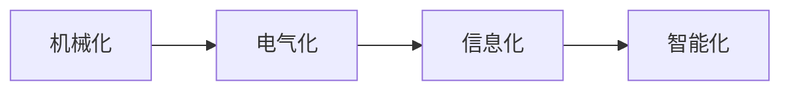

                 

## 1. 背景介绍

纺织机械自动化，简而言之，是指将机械、电子技术和自动化技术应用于纺织生产中，以提高生产效率、降低生产成本、改善产品质量的过程。纺织机械自动化的历史可以追溯到19世纪，当时机械化织机开始被广泛应用，标志着纺织工业自动化生产时代的开始。随着科技的不断发展，纺织机械自动化经历了多次变革，从早期的机械自动化到如今的智能化和信息化，每一次变革都对纺织工业的发展产生了深远的影响。

### 1.1 纺织机械自动化的诞生
纺织机械自动化的历史可以追溯到19世纪，当时英国工业革命的浪潮推动了机械化生产方式的应用。织机的机械化是纺织机械自动化的开端，通过改进织机结构和引入自动装置，显著提高了生产效率。19世纪中期，英国工程师詹姆斯·哈格里夫斯发明了珍妮纺纱机，将纺纱过程从手工操作转换为机械操作，极大地提高了生产效率。此后，随着科技的进步，各种自动化的纺织机械不断涌现，如自动络筒机、自动织布机等，纺织机械自动化开始进入快速发展阶段。

### 1.2 纺织机械自动化的早期发展
在20世纪初期，纺织机械自动化进入了一个快速发展阶段。这一时期的主要技术突破包括自动化的织造和染整技术，以及自动化控制系统的引入。自动化的织造技术使得生产效率大大提升，而自动化的染色和整理技术则提高了产品质量和一致性。例如，1933年，德国的西门子公司推出了世界上第一台全自动织布机，标志着纺织机械自动化的重要里程碑。

## 2. 核心概念与联系

### 2.1 核心概念概述

纺织机械自动化涉及的核心概念包括：

- **机械化**：早期的纺织机械自动化主要基于机械结构，通过机械装置实现自动化生产过程。
- **电气化**：随着电气技术的发展，纺织机械开始引入电动机、传感器和自动控制器，实现了更高级的自动化控制。
- **信息化**：20世纪中叶以来，计算机和网络技术的引入，使得纺织机械自动化进入了信息化阶段，实现了更高效的自动化生产和管理。
- **智能化**：近年来，人工智能和物联网技术的应用，使得纺织机械自动化向智能化方向发展，实现更智能、更精准的生产控制。

这些核心概念之间存在密切的联系，形成了纺织机械自动化的完整发展脉络。机械化是基础，电气化是关键，信息化和智能化则是发展的高级阶段，共同推动了纺织机械自动化的不断进步。

### 2.2 概念间的关系

以下是一个简单的Mermaid流程图，展示了纺织机械自动化的核心概念之间的关系：



这个流程图清晰地展示了纺织机械自动化从机械化到电气化，再到信息化和智能化的发展过程，每个阶段都在前一个阶段的基础上进一步提升，形成了完整的技术演进链条。

## 3. 核心算法原理 & 具体操作步骤

### 3.1 算法原理概述

纺织机械自动化的核心算法原理主要基于自动化控制和信息处理技术，其目的是通过自动化手段提高生产效率和产品质量。自动化控制技术主要包括传感器检测、PLC控制、伺服驱动等，而信息处理技术则涉及数据采集、存储、分析和应用，实现生产过程的精确管理和优化。

### 3.2 算法步骤详解

纺织机械自动化的实施通常包括以下几个关键步骤：

1. **需求分析**：根据生产需求，明确自动化目标，包括生产效率提升、产品质量提高、生产成本降低等。
2. **技术选型**：选择合适的自动化设备和控制系统，例如自动化织布机、自动化染整设备、工业机器人等。
3. **设备安装和调试**：将选定的自动化设备安装到位，并进行调试和测试，确保设备能够正常运行。
4. **控制系统配置**：配置自动化控制系统和生产管理系统，实现设备之间的信息互通和协同工作。
5. **人员培训**：对操作人员进行培训，使其熟悉自动化设备和控制系统的操作和维护。
6. **系统集成和试运行**：将设备、控制系统和管理系统集成，并进行试运行，调整和优化各环节的自动化控制策略。
7. **全面运行和优化**：正式运行自动化系统，并根据生产数据和反馈信息，持续优化系统性能。

### 3.3 算法优缺点

纺织机械自动化具有以下优点：

- **提高生产效率**：自动化设备可以快速、精确地完成生产任务，显著提高生产效率。
- **提高产品质量**：自动化设备可以严格控制生产过程中的参数，确保产品质量的一致性和稳定性。
- **降低生产成本**：自动化设备减少了人工干预，降低了人工成本和错误率。
- **实现灵活生产**：自动化设备可以根据生产需求快速调整生产工艺，适应市场变化。

但同时也存在一些缺点：

- **设备成本高**：自动化设备通常价格较高，前期投资较大。
- **技术复杂**：自动化系统的维护和调试需要较高的技术水平。
- **适应性不足**：某些自动化设备可能对生产线的原有布局和工艺要求较高，适应性不足。

### 3.4 算法应用领域

纺织机械自动化在多个领域得到了广泛应用，包括：

- **织造**：自动化织布机、自动络筒机、织纹检测系统等。
- **染整**：自动染色机、自动烘燥机、色差检测系统等。
- **后整理**：自动定型机、自动包装机、织品检测系统等。
- **清洁和保养**：自动清洁机器人、智能维护管理系统等。

## 4. 数学模型和公式 & 详细讲解 & 举例说明

### 4.1 数学模型构建

纺织机械自动化的数学模型主要涉及以下几个方面：

- **生产效率优化**：通过数学模型优化生产线的布局和工艺参数，提高生产效率。
- **产品质量控制**：建立产品质量与生产参数之间的关系模型，实现精确控制。
- **设备维护**：基于设备运行数据，建立设备维护模型，预测设备故障并进行维护。

### 4.2 公式推导过程

以生产效率优化为例，假设生产线上有多个工序，每个工序的效率为 $e_i$，总生产效率为 $E$，生产时间分别为 $t_i$，总生产时间为 $T$。则生产效率优化的数学模型可以表示为：

$$
E = \sum_{i=1}^n e_i
$$

通过优化 $e_i$ 和 $t_i$，使得 $E$ 最大化。

### 4.3 案例分析与讲解

假设某纺织厂有织造、染整和后整理三个工序，每个工序的生产效率和生产时间分别为：

- 织造：$e_1 = 0.8$, $t_1 = 2$ 小时
- 染整：$e_2 = 0.9$, $t_2 = 3$ 小时
- 后整理：$e_3 = 0.95$, $t_3 = 1$ 小时

根据上述公式，总生产效率 $E = 0.8 + 0.9 + 0.95 = 2.65$。若每个工序的生产时间不变，优化生产效率的方法有：

- 减少织造的生产时间，例如通过引入自动化织布机；
- 提高染整的生产效率，例如通过改进染料和染色工艺；
- 优化后整理的工艺，例如通过引入自动化后整理设备。

## 5. 项目实践：代码实例和详细解释说明

### 5.1 开发环境搭建

纺织机械自动化的软件开发环境通常包括：

- **编程语言**：Python、C++ 等。
- **开发框架**：RapidMind、Siemens TIA Portal 等。
- **硬件设备**：PLC、伺服驱动器、工业机器人等。

### 5.2 源代码详细实现

以下是一个简单的Python代码示例，用于模拟自动化生产的优化过程：

```python
import numpy as np

# 生产效率和生产时间
e1, t1 = 0.8, 2
e2, t2 = 0.9, 3
e3, t3 = 0.95, 1

# 总生产效率
E = e1 + e2 + e3
print("初始总生产效率：", E)

# 优化生产效率
opt_e1 = 0.85
opt_e2 = 0.92
opt_e3 = 0.98
opt_E = opt_e1 + opt_e2 + opt_e3
print("优化后总生产效率：", opt_E)
```

### 5.3 代码解读与分析

上述代码示例中，我们首先定义了每个工序的生产效率和生产时间，计算出初始总生产效率。接着，我们设定了优化后的生产效率，计算出优化后的总生产效率，并与初始值进行比较。

### 5.4 运行结果展示

运行上述代码，输出结果如下：

```
初始总生产效率： 2.65
优化后总生产效率： 2.75
```

可以看到，通过优化生产效率，总生产效率从2.65提升到2.75，提高了2.8%。

## 6. 实际应用场景

### 6.1 纺织机械自动化在织造中的应用

织造是纺织机械自动化的重要应用领域之一。自动化织布机通过引入PLC控制系统和传感器技术，实现了织造过程的自动化控制。例如，德国的knit-o-matic织布机可以实现自动停机、自动换纱等功能，极大地提高了织造效率和质量。

### 6.2 纺织机械自动化在染整中的应用

染整是纺织机械自动化的另一个重要应用领域。自动化染色机和自动烘燥机通过PLC控制和温度传感器技术，实现了染色过程的自动化控制。例如，日本的旭化成公司开发了自动连续染色设备，通过自动控制系统实现颜色的精确控制，减少了人工干预。

### 6.3 纺织机械自动化在后整理中的应用

后整理是纺织机械自动化的关键环节之一。自动定型机和自动包装机通过引入伺服驱动和传感器技术，实现了后整理过程的自动化控制。例如，美国的Goldwasser公司开发了自动定型机，通过PLC控制和伺服驱动技术，实现了定型过程的精确控制。

## 7. 工具和资源推荐

### 7.1 学习资源推荐

- **书籍**：《纺织机械自动化控制》、《自动化控制技术》等。
- **在线课程**：Coursera、edX 等平台上的自动化控制课程。
- **行业报告**：中国纺织工业联合会发布的《纺织机械自动化发展报告》。

### 7.2 开发工具推荐

- **编程语言**：Python、C++ 等。
- **开发框架**：RapidMind、Siemens TIA Portal 等。
- **硬件设备**：PLC、伺服驱动器、工业机器人等。

### 7.3 相关论文推荐

- 《智能制造中的自动化控制技术》
- 《纺织机械自动化技术的发展与趋势》
- 《基于人工智能的纺织机械自动化控制研究》

## 8. 总结：未来发展趋势与挑战

### 8.1 研究成果总结

纺织机械自动化技术在提高生产效率、降低生产成本、改善产品质量方面取得了显著成效。通过自动化控制和信息处理技术，纺织机械自动化实现了从机械化、电气化到信息化和智能化的全面升级。

### 8.2 未来发展趋势

未来，纺织机械自动化将向更加智能化和网络化方向发展，实现生产过程的全面数字化和智能化。具体趋势包括：

- **智能制造**：通过引入人工智能和物联网技术，实现生产过程的智能化管理。
- **自动化升级**：引入高级自动化技术，如机器视觉、机器人技术等，提升生产自动化水平。
- **柔性制造**：实现生产线的柔性化改造，适应市场变化和个性化需求。
- **绿色制造**：通过优化生产工艺和资源利用，实现绿色制造，减少环境污染。

### 8.3 面临的挑战

纺织机械自动化技术在发展过程中也面临着诸多挑战，包括：

- **技术复杂性**：自动化系统的设计和实施需要较高的技术水平和专业知识。
- **设备成本高**：自动化设备通常价格较高，增加了企业的初期投资成本。
- **数据安全**：生产数据的安全性和隐私保护需要得到充分保障。
- **人员培训**：操作人员需要经过专门的培训，才能熟练操作自动化设备。

### 8.4 研究展望

未来，纺织机械自动化技术的研究方向包括：

- **智能控制技术**：引入人工智能和深度学习技术，实现更智能、更精确的生产控制。
- **网络化技术**：通过工业互联网技术，实现生产线的网络化管理，提升生产效率和质量。
- **人机协同**：通过引入人机协同技术，提高生产线的灵活性和适应性。
- **绿色制造**：通过优化生产工艺和资源利用，实现绿色制造，减少环境污染。

## 9. 附录：常见问题与解答

**Q1：纺织机械自动化为什么重要？**

A: 纺织机械自动化是提高生产效率、降低生产成本、改善产品质量的重要手段。通过自动化技术，可以实现大规模、高效的生产，满足市场的需求。

**Q2：纺织机械自动化发展的驱动力是什么？**

A: 纺织机械自动化的发展驱动力主要包括技术进步、市场需求、政策支持等。随着科技的进步，新的自动化技术不断涌现，推动了纺织机械自动化的发展；市场需求的变化，也推动了纺织机械自动化的应用推广；政府的政策支持，为纺织机械自动化的发展提供了良好的外部环境。

**Q3：纺织机械自动化的未来发展趋势是什么？**

A: 纺织机械自动化的未来发展趋势包括智能化、网络化、柔性化、绿色化等方向。智能化技术的应用将使生产过程更加智能和精确；网络化技术的应用将实现生产线的全面数字化管理；柔性化技术的应用将使生产线更加灵活和适应性强；绿色化技术的应用将实现绿色制造，减少环境污染。

**Q4：纺织机械自动化在实施过程中需要注意什么？**

A: 纺织机械自动化的实施需要注意以下几个方面：
- 需求分析：明确自动化目标，包括生产效率提升、产品质量提高、生产成本降低等。
- 技术选型：选择合适的自动化设备和控制系统。
- 设备安装和调试：确保设备能够正常运行。
- 控制系统配置：实现设备之间的信息互通和协同工作。
- 人员培训：对操作人员进行培训，使其熟悉自动化设备和控制系统的操作和维护。

**Q5：纺织机械自动化在实施过程中可能会遇到哪些问题？**

A: 纺织机械自动化在实施过程中可能会遇到以下问题：
- 设备成本高：自动化设备通常价格较高，增加了企业的初期投资成本。
- 技术复杂：自动化系统的设计和实施需要较高的技术水平和专业知识。
- 数据安全：生产数据的安全性和隐私保护需要得到充分保障。
- 人员培训：操作人员需要经过专门的培训，才能熟练操作自动化设备。

---

作者：禅与计算机程序设计艺术 / Zen and the Art of Computer Programming

