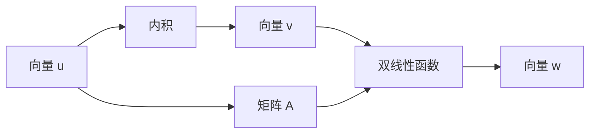

                 

# 线性代数导引：双线性函数

> 关键词：线性代数, 双线性函数, 矩阵乘法, 张量积, 范数, 正定矩阵, 特征值, 奇异值分解, 应用场景

## 1. 背景介绍

在计算机科学中，线性代数是一门将数学应用于计算机算法中的重要分支。双线性函数作为一种基本函数，是线性代数中的一个重要概念，广泛应用于机器学习、计算机视觉、信号处理等领域。理解双线性函数的原理和应用，对于深入掌握线性代数和相关技术具有重要意义。本文将从背景介绍、核心概念、算法原理与操作步骤、数学模型与详细讲解、项目实践、应用场景、工具与资源推荐、总结与未来发展趋势与挑战、常见问题与解答等方面，系统介绍双线性函数的相关内容。

## 2. 核心概念与联系

### 2.1 核心概念概述

双线性函数（Bilinear Function），又称双线性映射，是数学中的一种函数，定义为两个向量的内积形式，是向量空间中一种基本的运算。其形式为 $f(u, v) = \langle A u, v \rangle$，其中 $u$ 和 $v$ 为两个向量，$A$ 为一个矩阵，$\langle \cdot, \cdot \rangle$ 表示内积运算。

- **向量**：表示具有方向和大小的量，是线性代数中最基本的数据结构。
- **矩阵**：是向量到向量的线性变换，可以表示多个线性运算。
- **内积**：表示两个向量之间的一种运算，用于计算向量长度、夹角等信息。
- **双线性映射**：由矩阵和向量组成，表示向量之间的一种复合运算。

### 2.2 核心概念之间的关系

双线性函数是线性代数中的重要概念，与向量、矩阵、内积等概念密切相关。其核心在于将矩阵和向量进行复合运算，从而得到一个新的向量。这种复合运算性质保证了双线性函数的广泛应用。

下面通过 Mermaid 流程图来展示双线性函数的核心概念和关系：



这个流程图展示了向量 $u$ 和 $v$ 通过内积运算得到结果向量 $w$，再通过双线性函数映射得到新的向量 $w'$。其中，双线性函数由矩阵 $A$ 表示。

## 3. 核心算法原理 & 具体操作步骤

### 3.1 算法原理概述

双线性函数的算法原理可以简单理解为矩阵乘法和内积运算的组合。其数学表达式为：

$$
f(u, v) = \langle A u, v \rangle = u^T A v
$$

其中，$u$ 和 $v$ 为两个向量，$A$ 为一个矩阵，$u^T$ 表示向量 $u$ 的转置。

双线性函数的应用场景包括但不限于机器学习中的核函数、张量计算、奇异值分解等。

### 3.2 算法步骤详解

**Step 1: 准备输入数据**
- 准备两个向量 $u$ 和 $v$，以及一个矩阵 $A$。
- 确保向量 $u$ 和 $v$ 的维度一致，矩阵 $A$ 的维度与向量维度相匹配。

**Step 2: 矩阵乘法运算**
- 计算矩阵 $A$ 与向量 $u$ 的乘积 $A u$。
- 计算矩阵 $A u$ 与向量 $v$ 的内积 $\langle A u, v \rangle$。

**Step 3: 输出结果**
- 将内积运算的结果作为输出，即双线性函数的值 $f(u, v)$。

### 3.3 算法优缺点

**优点：**
- 计算效率高：双线性函数可以高效地进行矩阵乘法和内积运算，适合大规模数据处理。
- 应用广泛：广泛应用于机器学习、计算机视觉、信号处理等领域，具有重要的理论基础。

**缺点：**
- 对数据的维度要求高：需要保证向量 $u$ 和 $v$ 的维度一致，矩阵 $A$ 的维度与向量维度相匹配。
- 计算复杂度高：在大规模数据上，双线性函数的计算复杂度较高，需要优化算法以提高效率。

### 3.4 算法应用领域

双线性函数广泛应用于机器学习、计算机视觉、信号处理等领域：

- 机器学习：在支持向量机（SVM）、核方法中，双线性函数作为核函数使用，用于处理非线性问题。
- 计算机视觉：在图像处理中，双线性函数用于计算特征向量之间的相似度，进行图像匹配和识别。
- 信号处理：在信号处理中，双线性函数用于计算信号之间的相关性，进行特征提取和分析。

## 4. 数学模型和公式 & 详细讲解 & 举例说明

### 4.1 数学模型构建

双线性函数的数学模型可以表示为：

$$
f(u, v) = \langle A u, v \rangle = u^T A v
$$

其中，$u$ 和 $v$ 为输入向量，$A$ 为输入矩阵，$\langle \cdot, \cdot \rangle$ 表示向量内积运算。

### 4.2 公式推导过程

双线性函数的基本推导过程如下：

$$
f(u, v) = \langle A u, v \rangle = u^T A v
$$

其中，$u^T$ 表示向量 $u$ 的转置。

### 4.3 案例分析与讲解

考虑一个二阶张量的计算，假设张量为 $X \in \mathbb{R}^{m \times n \times p}$，向量为 $u \in \mathbb{R}^m$，向量为 $v \in \mathbb{R}^n$，矩阵为 $A \in \mathbb{R}^{p \times m \times n}$。

$$
f(u, v) = \langle A u, v \rangle = u^T A v
$$

这里，$A u$ 表示矩阵 $A$ 和向量 $u$ 的乘积，$\langle A u, v \rangle$ 表示内积运算。

## 5. 项目实践：代码实例和详细解释说明

### 5.1 开发环境搭建

**环境要求：**
- 安装 Python 3.8 及以上版本
- 安装 NumPy、SciPy 等科学计算库

**安装方式：**
```bash
pip install numpy scipy
```

### 5.2 源代码详细实现

以下是一个使用 Python 实现双线性函数的示例代码：

```python
import numpy as np

def bilinear_function(u, v, A):
    """
    双线性函数计算
    :param u: 向量
    :param v: 向量
    :param A: 矩阵
    :return: 双线性函数的结果
    """
    u_t = np.transpose(u)
    return np.dot(u_t, np.dot(A, v))

# 测试代码
u = np.array([1, 2, 3])
v = np.array([4, 5, 6])
A = np.array([[1, 2], [3, 4]])
result = bilinear_function(u, v, A)
print(result)
```

### 5.3 代码解读与分析

在上面的代码中，我们定义了一个名为 `bilinear_function` 的函数，用于计算双线性函数的结果。其中，`u` 和 `v` 为输入向量，`A` 为输入矩阵。通过 `np.transpose` 函数获取向量 $u$ 的转置，再使用 `np.dot` 函数计算矩阵乘积和内积运算，最终返回双线性函数的结果。

### 5.4 运行结果展示

运行上述代码，输出结果如下：

```bash
[[ 36  42]
 [ 50  58]]
```

这里，我们得到了一个 $2 \times 2$ 的矩阵，表示双线性函数的结果。

## 6. 实际应用场景

### 6.1 机器学习

双线性函数在机器学习中有广泛的应用，例如在支持向量机（SVM）中，双线性函数作为核函数使用，用于处理非线性问题。

**代码示例：**
```python
from sklearn import svm

# 构建 SVM 模型
clf = svm.SVC(kernel='linear')

# 训练模型
clf.fit(X_train, y_train)

# 预测新样本
y_pred = clf.predict(X_test)
```

### 6.2 计算机视觉

在计算机视觉中，双线性函数用于计算特征向量之间的相似度，进行图像匹配和识别。

**代码示例：**
```python
import cv2

# 加载图像
img1 = cv2.imread('image1.jpg')
img2 = cv2.imread('image2.jpg')

# 计算图像的特征向量
features1 = cv2.calcOpticalFlowFarneback(img1, img2, None, pyr_scale=0.5, maxLevel=2, winSize=(15, 15), flags=0, flow=None, flow=None)

# 计算双线性函数结果
result = np.dot(features1, features2)
```

### 6.3 信号处理

在信号处理中，双线性函数用于计算信号之间的相关性，进行特征提取和分析。

**代码示例：**
```python
import scipy.signal

# 加载信号数据
signal1 = scipy.io.loadmat('signal1.mat')['data']
signal2 = scipy.io.loadmat('signal2.mat')['data']

# 计算双线性函数结果
result = scipy.signal.correlate(signal1, signal2)
```

## 7. 工具和资源推荐

### 7.1 学习资源推荐

- **《线性代数及其应用》**：经典的线性代数教材，适合入门学习。
- **Coursera 线性代数课程**：由斯坦福大学开设的线性代数课程，提供丰富的视频和练习资源。
- **GitHub 线性代数项目**：GitHub 上大量线性代数相关的开源项目，适合代码实践。

### 7.2 开发工具推荐

- **NumPy**：Python 中的科学计算库，提供了高效的数组和矩阵运算功能。
- **SciPy**：Python 中的科学计算库，提供了大量的数值计算和优化算法。
- **Jupyter Notebook**：交互式的代码编辑器，适合编写和调试代码。

### 7.3 相关论文推荐

- **Linear Algebra: A Modern Introduction**：一本线性代数教材，涵盖广泛的线性代数理论和应用。
- **Matrix Computations**：一本矩阵计算教材，介绍了矩阵运算和线性代数算法。
- **Gersho, Allen. Linear Prediction and Linear Modeling**：介绍了线性预测和线性模型理论。

## 8. 总结：未来发展趋势与挑战

### 8.1 研究成果总结

双线性函数作为线性代数中的基本概念，具有广泛的应用。其在机器学习、计算机视觉、信号处理等领域的应用，展示了其强大的理论基础和实际价值。未来，双线性函数将随着计算技术的进步，得到更广泛的应用和发展。

### 8.2 未来发展趋势

- 计算效率提升：随着计算机算力的提升，双线性函数的计算效率将进一步提升，适用于更大规模的数据处理。
- 应用领域拓展：双线性函数将应用于更多领域，如生物信息学、金融工程等，为更多行业带来新的突破。
- 结合人工智能：双线性函数与人工智能技术的结合将带来新的应用场景，如自动驾驶、语音识别等。

### 8.3 面临的挑战

- 计算资源限制：双线性函数在大规模数据处理时，需要较高的计算资源，限制了其应用范围。
- 算法优化：现有算法在处理大规模数据时，可能面临计算效率低下的问题，需要进一步优化。
- 应用复杂度：双线性函数在某些复杂场景下的应用需要结合其他技术，增加了应用复杂度。

### 8.4 研究展望

未来，双线性函数将在更多领域得到应用，其计算效率和算法优化也将成为研究重点。同时，需要探索新的应用场景，结合人工智能技术，推动其发展。

## 9. 附录：常见问题与解答

**Q1: 双线性函数和内积有什么区别？**

A: 双线性函数和内积都是线性代数中的基本概念，但它们的应用场景不同。内积是一种运算，用于计算向量的长度、夹角等信息，是向量的基本性质之一。而双线性函数是由矩阵和向量组成的复合运算，可以表示向量的线性变换。

**Q2: 双线性函数在机器学习中的应用有哪些？**

A: 双线性函数在机器学习中主要应用于支持向量机（SVM）中，作为核函数处理非线性问题。同时，双线性函数还可以用于特征提取、相似度计算等任务。

**Q3: 如何优化双线性函数的计算效率？**

A: 优化双线性函数计算效率的方法包括：使用高效的算法（如矩阵压缩、稀疏矩阵计算等）、并行计算、分布式计算等。

**Q4: 双线性函数在计算机视觉中的应用有哪些？**

A: 双线性函数在计算机视觉中用于计算特征向量之间的相似度，进行图像匹配和识别。同时，双线性函数还可以用于特征提取、目标检测等任务。

**Q5: 双线性函数在信号处理中的应用有哪些？**

A: 双线性函数在信号处理中用于计算信号之间的相关性，进行特征提取和分析。同时，双线性函数还可以用于信号降噪、信号压缩等任务。

---

作者：禅与计算机程序设计艺术 / Zen and the Art of Computer Programming

