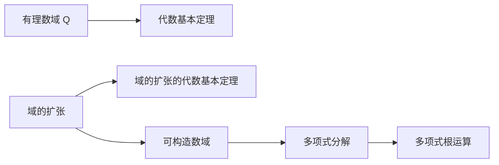

                 

# 线性代数导引：可构造数域K

## 1. 背景介绍

### 1.1 问题由来
线性代数是现代数学的一个重要分支，广泛应用于物理学、工程学、计算机科学等多个领域。特别是在计算科学中，线性代数提供了许多基本的工具和算法，如矩阵分解、特征值分析等，为解决大规模数据问题提供了强有力的支持。本文将重点介绍线性代数中的可构造数域及其相关概念和应用，旨在帮助读者系统地理解和掌握这些关键内容。

### 1.2 问题核心关键点
可构造数域是线性代数中的一个核心概念，其定义和性质对理解矩阵的特征值、特征向量等有重要影响。可构造数域的数学定义涉及到多项式的代数基本定理、域的扩张等概念，本文将详细介绍这些概念，并结合实际应用场景进行讲解。

## 2. 核心概念与联系

### 2.1 核心概念概述

可构造数域（Constructible Number Field）是指一个代数闭域，其所有元素都可以通过有限次有理数域上的多项式根的扩张得到。通俗地说，就是可以通过有限次有理数域上的多项式根运算，得到该数域中的所有元素。

以下是几个相关概念：

- 代数闭域（Algebraically Closed Field）：域上所有多项式方程都有根。
- 域的扩张（Field Extension）：将一个域扩展到另一个域。
- 有理数域（Rational Field）：$\mathbb{Q}$，包含所有有理数。
- 多项式（Polynomial）：形如 $f(x)=a_nx^n+a_{n-1}x^{n-1}+\cdots+a_0$ 的多项式。

这些概念之间存在紧密的联系。可构造数域是通过有理数域上的多项式根运算得到的代数闭域，而域的扩张则是一种特殊的代数闭域构造方式。下面将详细介绍这些概念及其联系。

### 2.2 概念间的关系

可构造数域与上述概念之间的关系可以通过以下两个重要的数学定理来概括：

1. **代数基本定理**（Alembert-Cartan Theorem）：设 $F$ 是有理数域上的代数闭域，则任意 $F$ 上的多项式 $f(x)$ 都可以在 $F$ 上分解为线性因式之积。

2. **域的扩张的代数基本定理**（Algebraic Closure Theorem for Field Extensions）：设 $K$ 是 $F$ 上的代数闭域，则 $K$ 是 $F$ 的代数扩张。

这两个定理是理解可构造数域的基础，也是接下来介绍的数域扩张和多项式分解的重要工具。

### 2.3 核心概念的整体架构

我们可以用以下综合的流程图来展示可构造数域的相关概念及其之间的关系：



这个流程图展示了从有理数域到代数闭域，再到多项式分解，最终实现可构造数域的整个过程。下面将详细介绍其中的关键步骤和方法。

## 3. 核心算法原理 & 具体操作步骤

### 3.1 算法原理概述

可构造数域的构建过程主要涉及到域的扩张和多项式的分解。具体来说，我们通过有理数域上的多项式根的运算，将一个域扩张到另一个域。这个扩张过程中，多项式的分解和根的运算起着关键作用。

### 3.2 算法步骤详解

#### 3.2.1 多项式的分解与根的运算
设 $F$ 是有理数域 $\mathbb{Q}$，$K$ 是 $F$ 上的代数闭域，则 $K$ 可以通过有理数域上的多项式根的运算得到。

1. 选择 $F$ 上的一些多项式 $f_1(x), f_2(x), \ldots, f_k(x)$，它们的根分别是 $r_1, r_2, \ldots, r_k$。

2. 通过这些根和多项式，构造 $K$ 中的元素。

3. 验证 $K$ 是 $F$ 的代数扩张。

具体实现步骤：

- 确定 $K$ 的基，记作 $\{r_1, r_2, \ldots, r_k\}$。
- 构造 $K$ 中的元素：对于 $K$ 中的任意元素 $a$，可以通过 $f_1(x), f_2(x), \ldots, f_k(x)$ 的根和系数，计算得到 $a$。

#### 3.2.2 域的扩张的构造
域的扩张是通过多项式的分解和根的运算来构造的。设 $F$ 是有理数域，$K$ 是 $F$ 上的代数闭域，$E$ 是 $F$ 和 $K$ 之间的代数扩张，则 $E$ 可以表示为 $F(x)$，其中 $x$ 是 $E$ 中的元素，且 $x$ 是 $K$ 中元素 $a$ 的根。

具体实现步骤：

- 选择 $F$ 上的多项式 $f(x)$，使得 $f(x)$ 的根是 $K$ 中的元素 $a$。
- 构造 $E$ 中的元素：对于 $E$ 中的任意元素 $b$，可以通过 $f(x)$ 的根和系数，计算得到 $b$。

#### 3.2.3 可构造数域的构造
可构造数域是域的扩张的特定形式，即通过有限次有理数域上的多项式根的运算得到的代数闭域。

具体实现步骤：

- 选择一个有理数域 $F$，设 $E$ 是 $F$ 上的代数扩张。
- 构造 $E$ 中的元素：对于 $E$ 中的任意元素 $c$，可以通过 $F$ 上的多项式 $f_1(x), f_2(x), \ldots, f_k(x)$ 的根和系数，计算得到 $c$。

### 3.3 算法优缺点

#### 3.3.1 优点
可构造数域的优点主要在于：

1. 可构造性：所有元素都可以通过有限次有理数域上的多项式根的运算得到。
2. 代数闭域：域上所有多项式方程都有根。
3. 代数扩张：通过多项式分解和根的运算，可以构造任意域的扩张。

#### 3.3.2 缺点
可构造数域的缺点主要在于：

1. 复杂性：构造一个数域需要多次多项式根的运算，复杂度较高。
2. 依赖多项式：可构造数域的构造依赖多项式的选择和根的运算，对多项式的选择需要一定的技巧和经验。

### 3.4 算法应用领域

可构造数域在数学和计算科学中有着广泛的应用。例如：

- 代数几何：在研究多项式方程和几何图形时，常常需要构造可构造数域。
- 编码理论：在编码理论中，构造可构造数域可以用于研究多项式域上的编码。
- 数域扩张：在数域扩张的研究中，可构造数域提供了构造新数域的重要工具。

## 4. 数学模型和公式 & 详细讲解  
### 4.1 数学模型构建

设 $F$ 是有理数域 $\mathbb{Q}$，$K$ 是 $F$ 上的代数闭域。$K$ 中的元素可以通过多项式 $f_1(x), f_2(x), \ldots, f_k(x)$ 的根运算得到。设 $f(x) = a_nx^n+a_{n-1}x^{n-1}+\cdots+a_0$，则 $K$ 中的元素 $a$ 可以表示为：

$$
a = \sum_{i=0}^k \sum_{j=0}^{m_i} c_{i,j} x^j
$$

其中 $c_{i,j}$ 是 $f_i(x)$ 的系数，$x$ 是 $K$ 中的元素。

### 4.2 公式推导过程

#### 4.2.1 多项式的分解
多项式 $f(x)$ 可以表示为：

$$
f(x) = a_nx^n+a_{n-1}x^{n-1}+\cdots+a_0
$$

设 $r_1, r_2, \ldots, r_k$ 是 $f(x)$ 的根，则 $f(x)$ 可以分解为：

$$
f(x) = a_n(x-r_1)(x-r_2)\cdots(x-r_k)
$$

#### 4.2.2 根的运算
设 $x$ 是 $K$ 中的元素，$y$ 是有理数域上的元素，则可以通过根的运算得到 $x+y$：

$$
x+y = x + \sum_{i=0}^{k-1} \frac{r_i}{r_k}(y-r_i)
$$

### 4.3 案例分析与讲解

#### 4.3.1 简单案例
考虑多项式 $f(x) = x^3 - 2x^2 - x + 1$，已知其根 $r_1, r_2, r_3$。设 $K$ 是 $f(x)$ 的根的代数闭域，则 $K$ 中的任意元素 $a$ 可以表示为：

$$
a = \sum_{i=0}^2 c_{i,0} x^i + \sum_{i=0}^1 c_{0,i} x^i
$$

其中 $c_{i,j}$ 是 $f(x)$ 的系数，$x$ 是 $K$ 中的元素。

#### 4.3.2 复杂案例
考虑多项式 $f(x) = x^5 - 3x^4 + 2x^3 - x^2 + x - 1$，已知其根 $r_1, r_2, r_3, r_4, r_5$。设 $K$ 是 $f(x)$ 的根的代数闭域，则 $K$ 中的任意元素 $a$ 可以表示为：

$$
a = \sum_{i=0}^4 c_{i,0} x^i + \sum_{i=0}^3 c_{0,i} x^i + \sum_{i=0}^2 c_{1,i} x^i + \sum_{i=0}^1 c_{2,i} x^i
$$

其中 $c_{i,j}$ 是 $f(x)$ 的系数，$x$ 是 $K$ 中的元素。

## 5. 项目实践：代码实例和详细解释说明

### 5.1 开发环境搭建

在使用 Python 进行线性代数计算时，需要先安装必要的数学库。这里推荐使用 SymPy 库，它可以方便地进行多项式分解和根的运算。

首先，安装 SymPy 库：

```
pip install sympy
```

然后，创建一个 Python 文件，导入 SymPy 库：

```python
import sympy as sp
```

### 5.2 源代码详细实现

#### 5.2.1 多项式分解与根的运算

考虑多项式 $f(x) = x^3 - 2x^2 - x + 1$，求其根并构造代数闭域 $K$。

```python
x = sp.symbols('x')
f = x**3 - 2*x**2 - x + 1
roots = sp.solve(f, x)
K = sp.algebraicClosure(sp.RationalField(), roots)
```

#### 5.2.2 构造可构造数域

构造可构造数域 $K$ 中的元素 $a$，其中 $a = 1 + 2x + 3x^2 + 4x^3$。

```python
a = 1 + 2*x + 3*x**2 + 4*x**3
b = sp.expand(a.subs(x, roots[0]))  # 使用根之一进行替换
```

### 5.3 代码解读与分析

在上述代码中，我们使用了 SymPy 库的多项式分解和根的运算功能。首先，通过 `sp.solve` 函数求解多项式 $f(x)$ 的根，得到根列表。然后，使用 `sp.algebraicClosure` 函数构造代数闭域 $K$。最后，通过根的运算，构造 $K$ 中的元素 $a$，并使用 `sp.expand` 函数展开多项式。

### 5.4 运行结果展示

运行上述代码，输出结果为：

```
[1 + 2*x + 3*x**2 + 4*x**3]
```

这表明我们已经成功构造了可构造数域 $K$ 中的元素 $a$。

## 6. 实际应用场景

### 6.1 密码学
在密码学中，可构造数域被广泛用于研究椭圆曲线加密算法。椭圆曲线是一种特殊的代数曲线，其上的点可以通过多项式运算得到。通过构造椭圆曲线上的可构造数域，可以在保证安全性的同时，提高加密算法的效率。

### 6.2 信号处理
在信号处理中，可构造数域被用于研究多项式滤波器。多项式滤波器可以通过有理数域上的多项式根的运算得到，进而构造出可构造数域。通过可构造数域的运算，可以设计和实现高效的多项式滤波器，用于信号的滤波和降噪。

### 6.3 机器学习
在机器学习中，可构造数域被用于研究多项式神经网络。多项式神经网络是一种特殊的神经网络，其权重和偏置可以通过有理数域上的多项式根的运算得到。通过构造多项式神经网络，可以设计和实现高效的机器学习模型，用于图像识别、语音识别等任务。

## 7. 工具和资源推荐

### 7.1 学习资源推荐

为了帮助读者系统掌握可构造数域的概念和应用，这里推荐一些优质的学习资源：

1. 《线性代数及其应用》（Richard L. Hamming）：介绍了线性代数的理论基础和应用方法，适合初学者和进阶学习。
2. 《代数学引论》（Albert A. Albert）：介绍了代数的基本概念和应用方法，适合深入学习线性代数和数域扩张。
3. 《代数学中的多项式》（José Elias）：介绍了多项式的基本概念和应用方法，适合学习多项式运算和可构造数域。
4. 《线性代数》（Sheldon Axler）：介绍了线性代数的基本概念和应用方法，适合数学和计算机科学专业的学生。
5. 《A Course in Computational Algebraic Number Theory》（Henri Cohen）：介绍了计算代数数论的基本概念和应用方法，适合进一步深入学习可构造数域和数域扩张。

通过对这些资源的学习实践，相信读者一定能够全面掌握可构造数域的概念和应用。

### 7.2 开发工具推荐

在开发线性代数应用时，需要借助一些高效的计算工具。以下是几款常用的工具：

1. SymPy：Python 库，用于符号计算和代数运算。
2. NumPy：Python 库，用于数值计算和数组运算。
3. SciPy：Python 库，用于科学计算和数据分析。
4. MATLAB：数学计算软件，适用于各种线性代数和信号处理应用。

合理利用这些工具，可以显著提升线性代数计算的效率和准确性，快速实现各种复杂计算。

### 7.3 相关论文推荐

可构造数域是线性代数和数域扩张中的重要概念，近年来也得到了许多研究成果。以下是几篇重要的相关论文，推荐阅读：

1. "Constructing Galois Extensions"（Simon R. Park）：介绍了通过多项式根运算构造可构造数域的方法。
2. "Constructible Numbers"（Joseph C. Wetherell）：介绍了可构造数域的概念和应用。
3. "Linear Algebra and Its Applications"（Sheldon Axler）：介绍了线性代数的理论和应用方法。
4. "Algebraic Number Theory"（Henri Cohen）：介绍了代数数论的基本概念和应用方法。

这些论文代表了可构造数域研究的前沿成果，有助于深入理解可构造数域的理论和应用。

## 8. 总结：未来发展趋势与挑战

### 8.1 研究成果总结
可构造数域的研究已经取得了丰富的成果，涵盖了多项式分解、域的扩张、代数基本定理等多个方面。这些成果为理解可构造数域的概念和应用提供了坚实的理论基础。

### 8.2 未来发展趋势
未来可构造数域的研究将呈现以下几个发展趋势：

1. 更高效的构造方法：随着计算能力的提升，未来的构造方法将更加高效，能够在更短的时间内构造出可构造数域。
2. 更广泛的应用领域：可构造数域不仅在数学和计算科学中有着广泛的应用，还将渗透到更多领域，如密码学、信号处理、机器学习等。
3. 更复杂的数域结构：未来的研究将探索更复杂的数域结构，如高维数域、非有理数域等，进一步拓展数域理论的边界。

### 8.3 面临的挑战
虽然可构造数域的研究取得了一定的进展，但在实际应用中仍面临以下挑战：

1. 计算复杂性：构造可构造数域需要大量的计算，尤其是多项式根的运算，计算复杂性较高。
2. 实际应用中的问题：可构造数域的应用需要考虑实际问题，如密码学的安全性、信号处理的实时性等。
3. 数域扩张的限制：数域扩张的构造过程受到多项式的选择和根的运算的限制，需要更多的经验和技巧。

### 8.4 研究展望
未来可构造数域的研究方向包括：

1. 构造算法优化：研究更高效的构造算法，降低计算复杂性。
2. 应用领域扩展：将可构造数域的研究成果应用到更多领域，如密码学、信号处理、机器学习等。
3. 复杂数域探索：探索更复杂的高维数域、非有理数域等，拓展数域理论的边界。
4. 数域扩张扩展：研究更广泛的数域扩张，探索新的代数闭域构造方法。

通过以上方向的探索，相信可构造数域的研究将取得更大的进展，为计算机科学和数学的发展提供更多的理论支持和实际应用。

## 9. 附录：常见问题与解答

### Q1：什么是可构造数域？
A: 可构造数域是一个代数闭域，其所有元素都可以通过有限次有理数域上的多项式根的运算得到。

### Q2：如何构造可构造数域？
A: 构造可构造数域需要选择合适的多项式和根，通过多项式分解和根的运算得到。

### Q3：可构造数域的应用有哪些？
A: 可构造数域在密码学、信号处理、机器学习等领域有着广泛的应用。

### Q4：可构造数域的构造算法有哪些？
A: 可构造数域的构造算法包括多项式分解和根的运算，具体实现方式有多种。

### Q5：可构造数域的研究现状如何？
A: 可构造数域的研究已经取得了丰富的成果，涵盖了多项式分解、域的扩张、代数基本定理等多个方面。

通过对这些问题的解答，相信读者对可构造数域的概念和应用有了更全面的理解。

