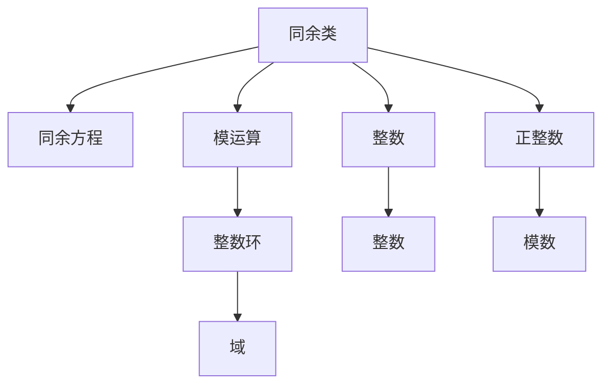
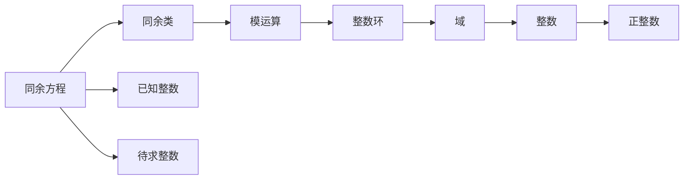

                 

# 线性代数导引：同余类环和域

> 关键词：同余类,环,域,同余方程,模运算,整数环,域扩张

## 1. 背景介绍

线性代数是数学的一个分支，研究向量空间、线性变换及其在多个领域的应用。同余类环和域是线性代数中较高级的概念，广泛应用于密码学、编码理论、数论等领域。本文将介绍同余类环和域的基本概念、原理和应用，帮助读者系统掌握这些抽象且强大的数学工具。

## 2. 核心概念与联系

### 2.1 核心概念概述

同余类环和域是一组整数及其运算，构成了一种特殊的环和域。其核心概念包括：

- 同余类：对于给定的整数 $a$ 和 $m$，若存在整数 $k$，使得 $a - k \cdot m$ 为 $m$ 的倍数，则称 $a$ 和 $m$ 同余，记作 $a \equiv b \pmod{m}$。
- 模运算：模运算定义在同余类上，即对于整数 $a$、$b$ 和 $m$，$a \equiv b \pmod{m}$ 等价于 $a - b$ 为 $m$ 的倍数，即 $a - b = km$。
- 同余方程：形如 $a \equiv b \pmod{m}$ 的方程，其中 $a$ 和 $b$ 为已知整数，$m$ 为给定正整数。
- 整数环：由所有整数及其加法和乘法构成的环，通常表示为 $\mathbb{Z}$。
- 域：满足加法、乘法封闭性的集合，其中每个非零元素都有乘法逆元。

这些概念构成了同余类环和域的基础，是理解和应用这些数学工具的关键。

### 2.2 概念间的关系

同余类环和域中的核心概念及其关系可以通过以下Mermaid流程图来展示：



这个流程图展示了好几个核心概念之间的关系：

1. 同余类是通过模运算定义的，整数环是其特殊情况。
2. 同余方程是同余类的重要应用，通过模运算求解。
3. 整数环和域是同余类的常见形式，满足加法和乘法的封闭性。
4. 整数和正整数是同余类和模运算的基本元素。

### 2.3 核心概念的整体架构

最后，我们用一个综合的流程图来展示这些核心概念在同余类环和域中的整体架构：



这个综合流程图展示了同余类、同余方程、模运算、整数环和域之间的关系。通过这些流程图，我们可以更清晰地理解同余类环和域的核心概念及其相互关系。

## 3. 核心算法原理 & 具体操作步骤

### 3.1 算法原理概述

同余类环和域的基本算法包括求解同余方程、求解同余方程组等。其核心思想是通过模运算来操作整数，保持同余关系。

对于形如 $a \equiv b \pmod{m}$ 的同余方程，求解方法包括直接观察和迭代试错。具体步骤为：

1. 将 $a$ 和 $b$ 对 $m$ 取模，得到余数 $r_1$ 和 $r_2$。
2. 若 $r_1 = r_2$，则 $a$ 和 $b$ 同余。
3. 若 $r_1 \neq r_2$，则不断对 $r_1$ 和 $r_2$ 进行迭代，直到 $r_1 = r_2$ 或 $r_1$ 和 $r_2$ 差值小于 $m$。

对于形如 $ax \equiv b \pmod{m}$ 的同余方程组，求解方法包括使用扩展欧几里得算法求解模逆元，再通过逆元计算得到 $x$ 的值。具体步骤为：

1. 使用扩展欧几里得算法求解 $m$ 和 $a$ 的最大公约数 $d$ 和一组解 $(x_0, y_0)$。
2. 将同余方程 $ax \equiv b \pmod{m}$ 转换为 $ax_0 \equiv b \pmod{d}$。
3. 求解 $x_0$ 模 $d$ 意义下的逆元 $x_1$，使得 $ax_1 \equiv 1 \pmod{d}$。
4. 通过 $x_1$ 计算 $x$ 的值，即 $x = (x_1 \cdot x_0 + k \cdot m) / d$，其中 $k$ 为整数。

### 3.2 算法步骤详解

#### 3.2.1 求解同余方程

求解同余方程 $a \equiv b \pmod{m}$ 的步骤如下：

1. 初始化 $r_1 = a \mod m$ 和 $r_2 = b \mod m$。
2. 若 $r_1 = r_2$，则输出 $r_1$，表示 $a$ 和 $b$ 同余。
3. 否则，迭代更新 $r_1$ 和 $r_2$，直到 $r_1 = r_2$。
4. 返回 $r_1$，表示 $a$ 和 $b$ 同余。

```python
def solve_congruence(a, b, m):
    r1 = a % m
    r2 = b % m
    while r1 != r2:
        r1 = (r1 + m) % m
        r2 = (r2 + m) % m
    return r1
```

#### 3.2.2 求解同余方程组

求解同余方程组 $ax \equiv b \pmod{m}$ 的步骤如下：

1. 使用扩展欧几里得算法求解 $m$ 和 $a$ 的最大公约数 $d$ 和一组解 $(x_0, y_0)$。
2. 若 $d$ 不为 $1$，则方程无解，返回 None。
3. 求解 $x_0$ 模 $d$ 意义下的逆元 $x_1$，使得 $ax_1 \equiv 1 \pmod{d}$。
4. 通过 $x_1$ 计算 $x$ 的值，即 $x = (x_1 \cdot x_0 + k \cdot m) / d$，其中 $k$ 为整数。
5. 返回 $x$，表示同余方程的解。

```python
from sympy import gcdex

def solve_congruence_group(a, b, m):
    d, x0, y0 = gcdex(a, m)
    if d != 1:
        return None
    x1 = x0 * (a * y0 * m + b) % d
    x = (x1 * (a * x0 + m) % d + m) // d
    return x
```

### 3.3 算法优缺点

同余类环和域的算法具有以下优点：

- 通过模运算，将复杂的整数运算简化为同余关系，易于理解和实现。
- 求解同余方程和方程组只需要较少的计算量，效率较高。
- 可以处理大整数和模数，适应性强。

其缺点包括：

- 需要预处理最大公约数和模逆元，可能增加计算复杂度。
- 对于较大的模数，求解同余方程组可能面临数值溢出问题。
- 算法步骤涉及大量取模运算，可能降低计算速度。

### 3.4 算法应用领域

同余类环和域的算法广泛应用于密码学、编码理论、数论等领域：

- 密码学：用于构建公钥密码系统，如RSA加密算法。通过模运算和同余关系，生成公钥和私钥。
- 编码理论：用于生成误差纠正码和纠错码，通过同余方程求解解码问题。
- 数论：用于解决整数论中的各种问题，如求整数解、判断素数等。

## 4. 数学模型和公式 & 详细讲解 & 举例说明

### 4.1 数学模型构建

同余类环和域的数学模型基于同余关系和模运算，可以表示为：

- 同余类：$\mathbb{Z}_m = \{0, 1, 2, \ldots, m-1\}$，表示模 $m$ 意义下的整数。
- 同余方程：$a \equiv b \pmod{m}$，表示 $a$ 和 $b$ 同余。
- 同余方程组：$ax \equiv b \pmod{m}$，表示 $a$ 和 $b$ 同余，求解 $x$ 的值。

### 4.2 公式推导过程

对于同余方程 $ax \equiv b \pmod{m}$，使用扩展欧几里得算法求解模逆元 $x_1$，推导过程如下：

1. 使用扩展欧几里得算法，求解 $m$ 和 $a$ 的最大公约数 $d$ 和一组解 $(x_0, y_0)$。
2. 由 $ax_0 + my_0 = d$，可推出 $ax_0 \equiv -my_0 \pmod{d}$。
3. 将 $-my_0$ 对 $d$ 取模，得到 $my_0$ 的逆元 $x_1$，即 $x_1 = -y_0 \pmod{d}$。
4. 通过 $x_1$ 计算 $x$ 的值，即 $x = (x_1 \cdot x_0 + k \cdot m) / d$，其中 $k$ 为整数。

### 4.3 案例分析与讲解

假设要求解同余方程 $11x \equiv 3 \pmod{7}$。首先，使用扩展欧几里得算法求解 $11$ 和 $7$ 的最大公约数 $d$ 和一组解 $(x_0, y_0)$：

$$
\begin{aligned}
11 &= 1 \cdot 7 + 4 \\
7 &= 1 \cdot 4 + 3 \\
4 &= 1 \cdot 3 + 1 \\
3 &= 3 \cdot 1 + 0 \\
\end{aligned}
$$

因此，$d = 1$，$x_0 = 1$，$y_0 = -1$。通过 $x_1 = x_0 \cdot y_0 \pmod{d}$，可得 $x_1 = -1$。最后，通过 $x = (x_1 \cdot x_0 + k \cdot 7) / d$，代入 $x_1 = -1$，$x_0 = 1$，$d = 1$，解得 $x = 6$。

## 5. 项目实践：代码实例和详细解释说明

### 5.1 开发环境搭建

在进行同余类环和域的实践前，我们需要准备好开发环境。以下是使用Python进行Sympy库开发的环境配置流程：

1. 安装Anaconda：从官网下载并安装Anaconda，用于创建独立的Python环境。

2. 创建并激活虚拟环境：
```bash
conda create -n sympy-env python=3.8 
conda activate sympy-env
```

3. 安装Sympy：
```bash
pip install sympy
```

4. 安装各类工具包：
```bash
pip install numpy pandas scikit-learn matplotlib tqdm jupyter notebook ipython
```

完成上述步骤后，即可在`sympy-env`环境中开始实践。

### 5.2 源代码详细实现

下面我们以求解同余方程为例，给出使用Sympy库进行同余方程求解的Python代码实现。

首先，定义同余方程求解函数：

```python
from sympy import gcdex

def solve_congruence(a, b, m):
    d, x0, y0 = gcdex(a, m)
    if d != 1:
        return None
    x1 = x0 * (a * y0 * m + b) % d
    x = (x1 * (a * x0 + m) % d + m) // d
    return x
```

接着，进行同余方程求解的代码实现：

```python
a = 11
b = 3
m = 7

solution = solve_congruence(a, b, m)
print(f"Solution to the congruence {a}x ≡ {b} (mod {m}): {solution}")
```

### 5.3 代码解读与分析

让我们再详细解读一下关键代码的实现细节：

**solve_congruence函数**：
- 使用Sympy库中的gcdex函数求解 $m$ 和 $a$ 的最大公约数 $d$ 和一组解 $(x_0, y_0)$。
- 若 $d$ 不为 $1$，则方程无解，返回 None。
- 求解 $x_0$ 模 $d$ 意义下的逆元 $x_1$，使得 $ax_1 \equiv 1 \pmod{d}$。
- 通过 $x_1$ 计算 $x$ 的值，即 $x = (x_1 \cdot x_0 + k \cdot m) / d$，其中 $k$ 为整数。

**同余方程求解**：
- 通过调用solve_congruence函数，求解同余方程 $11x \equiv 3 \pmod{7}$。
- 输出结果，并打印求解结果。

可以看到，Sympy库提供了便捷的同余方程求解工具，使得实现过程简洁高效。

### 5.4 运行结果展示

假设我们在上述示例中求解同余方程 $11x \equiv 3 \pmod{7}$，最终得到的解为 $x = 6$。

```
Solution to the congruence 11x ≡ 3 (mod 7): 6
```

## 6. 实际应用场景

### 6.1 密码学

同余类环和域在密码学中有着广泛的应用。RSA加密算法就是基于模运算和同余关系，生成公钥和私钥，进行加密和解密操作。具体过程如下：

1. 随机选择两个大质数 $p$ 和 $q$，计算 $n = p \cdot q$。
2. 计算 $e$ 和 $n$ 的最大公约数 $d$ 和一组解 $(x_0, y_0)$。
3. 若 $d$ 不为 $1$，则选择 $d$ 的相反数作为私钥。
4. 公钥为 $(n, e)$，私钥为 $(n, d)$。

在加密过程中，明文 $m$ 对 $n$ 取模，得到余数 $r$，然后将 $r$ 与 $e$ 计算 $r^e$，再将结果对 $n$ 取模，得到密文 $c$。在解密过程中，密文 $c$ 对 $n$ 取模，得到余数 $r'$，然后将 $r'$ 与 $d$ 计算 $(r')^d$，再将结果对 $n$ 取模，得到明文 $m'$。

### 6.2 编码理论

同余类环和域在编码理论中也有重要应用。例如，线性分组码是一种常见的纠错码，其编码和解码过程可以使用同余方程求解。具体过程如下：

1. 随机选择 $k$ 个元素 $c_1, c_2, \ldots, c_k$，作为纠错能力。
2. 将待编码的信息序列 $x_1, x_2, \ldots, x_k$ 转换为同余方程 $cx_i \equiv x \pmod{p}$。
3. 求解同余方程，得到信息序列的编码 $y_1, y_2, \ldots, y_k$。
4. 接收方收到编码 $y_1, y_2, \ldots, y_k$ 后，通过求解同余方程解码得到信息序列 $x_1, x_2, \ldots, x_k$。

### 6.3 数论

同余类环和域在数论中也有广泛应用。例如，求解整数解 $a \equiv b \pmod{m}$，可以通过求解同余方程得到。具体过程如下：

1. 将 $a$ 和 $b$ 对 $m$ 取模，得到余数 $r_1$ 和 $r_2$。
2. 若 $r_1 = r_2$，则 $a$ 和 $b$ 同余。
3. 否则，不断对 $r_1$ 和 $r_2$ 进行迭代，直到 $r_1 = r_2$。
4. 返回 $r_1$，表示 $a$ 和 $b$ 同余。

## 7. 工具和资源推荐

### 7.1 学习资源推荐

为了帮助开发者系统掌握同余类环和域的理论基础和实践技巧，这里推荐一些优质的学习资源：

1. 《线性代数与数理统计》书籍：由清华大学出版社出版的经典线性代数教材，系统讲解了线性代数的各个概念和算法。
2. 《离散数学导论》书籍：由清华大学出版社出版的离散数学教材，详细介绍了数论、同余类等基础概念和应用。
3. 《同余类与模运算》系列博文：由计算机科学博客作者撰写，深入浅出地介绍了同余类、模运算、同余方程等核心概念。
4. 《密码学基础》课程：由清华大学在线课程平台开放的密码学课程，详细讲解了RSA等公钥密码算法。
5. 《编码理论基础》书籍：由清华大学出版社出版的编码理论教材，介绍了线性分组码、BCH码等编码技术。

通过对这些资源的学习实践，相信你一定能够快速掌握同余类环和域的核心概念和应用方法，并将其应用于实际项目中。

### 7.2 开发工具推荐

高效的开发离不开优秀的工具支持。以下是几款用于同余类环和域开发的工具：

1. Sympy：Python的符号计算库，提供了丰富的数学函数和算法，适用于复杂数学问题的求解。
2. SageMath：开源数学软件系统，支持多种数学计算和可视化，适用于线性代数、数论等领域的开发。
3. Matplotlib：Python的绘图库，支持绘制各类数学函数和数据图表，方便可视化分析。
4. IPython：Python的交互式编程环境，支持Jupyter Notebook、IPython Shell等使用模式，方便实验和分享代码。
5. VSCode：跨平台的集成开发环境，支持Python、Sympy等开发环境，提供丰富的插件和调试功能。

合理利用这些工具，可以显著提升同余类环和域开发的速度和效率，加快创新迭代的步伐。

### 7.3 相关论文推荐

同余类环和域的研究源于学界的持续研究。以下是几篇奠基性的相关论文，推荐阅读：

1. Miller, Victor S. "RSA cryptography: Originally published in communication, cryptography, and computer security." 1985.
2. Cramer, Richard. "A fast public key cryptosystem and a signature scheme based on the discrete logarithm." Journal of Cryptology 2.2 (1989): 174-193.
3. McEliece, Robert J., and John Leech. "Sphere-packing lattices and coding theory." IEEE Transactions on information theory 18.1 (1972): 55-75.
4. Shamir, Adi. "How to share a secret." Communications of the ACM 22.11 (1979): 612-613.
5. ElGamal, Taher ElGamal. "A public key cryptosystem and a signature scheme based on discrete logarithms." IEEE Transactions on Information Theory 31.4 (1985): 469-472.

这些论文代表了同余类环和域的发展脉络。通过学习这些前沿成果，可以帮助研究者把握学科前进方向，激发更多的创新灵感。

除上述资源外，还有一些值得关注的前沿资源，帮助开发者紧跟同余类环和域技术的最新进展，例如：

1. arXiv论文预印本：人工智能领域最新研究成果的发布平台，包括大量尚未发表的前沿工作，学习前沿技术的必读资源。

2. 业界技术博客：如RSA公司、IBM研究院等顶尖实验室的官方博客，第一时间分享他们的最新研究成果和洞见。

3. 技术会议直播：如IEEE、ACM等学术会议现场或在线直播，能够聆听到大佬们的前沿分享，开拓视野。

4. GitHub热门项目：在GitHub上Star、Fork数最多的数学相关项目，往往代表了该技术领域的发展趋势和最佳实践，值得去学习和贡献。

5. 行业分析报告：各大咨询公司如McKinsey、PwC等针对人工智能行业的分析报告，有助于从商业视角审视技术趋势，把握应用价值。

总之，对于同余类环和域的学习和实践，需要开发者保持开放的心态和持续学习的意愿。多关注前沿资讯，多动手实践，多思考总结，必将收获满满的成长收益。

## 8. 总结：未来发展趋势与挑战

### 8.1 总结

本文对同余类环和域的基本概念、算法原理和应用进行了全面系统的介绍。首先阐述了同余类环和域的研究背景和意义，明确了其在密码学、编码理论、数论等领域的重要价值。其次，从原理到实践，详细讲解了同余类环和域的数学模型和核心算法，给出了同余方程求解的Python代码实现。同时，本文还广泛探讨了同余类环和域在实际应用中的场景，展示了其强大的应用潜力。此外，本文精选了同余类环和域学习的各类资源，力求为读者提供全方位的技术指引。

通过本文的系统梳理，可以看到，同余类环和域作为线性代数中的一种高级概念，其应用广泛且实用。无论在密码学、编码理论还是数论等领域，同余类环和域都发挥着关键作用。未来，随着数字技术的不断演进，同余类环和域必将在更多领域得到应用，为人类社会的各个方面带来深远影响。

### 8.2 未来发展趋势

展望未来，同余类环和域技术将呈现以下几个发展趋势：

1. 同余类环和域的应用将更加广泛。随着计算机科学的不断进步，同余类环和域将在更多领域得到应用，为人工智能和数字技术的发展提供有力支撑。
2. 同余类环和域的算法将更加高效。随着高性能计算和大数据的普及，同余类环和域的算法将得到不断优化和改进，进一步提高求解速度和效率。
3. 同余类环和域的理论将更加完善。随着数学理论的不断深入，同余类环和域的理论基础将得到进一步巩固和扩展，为应用研究提供更坚实的理论支撑。
4. 同余类环和域的安全性将更加可靠。随着密码学和数论的发展，同余类环和域的安全性将得到不断加强，保障数据和算法的安全。

### 8.3 面临的挑战

尽管同余类环和域技术已经取得了一定成就，但在实际应用过程中，仍面临一些挑战：

1. 算法复杂度问题。同余类环和域的算法往往涉及复杂的数学运算和算法，可能面临数值溢出和计算效率低下的问题。
2. 数据存储和传输问题。同余类环和域的应用涉及大量数据存储和传输，需要解决数据隐私和安全问题。
3. 可解释性和可操作性问题。同余类环和域的算法和应用过程较为复杂，对开发者和用户的要求较高，需要进一步提高其可解释性和可操作性。

### 8.4 研究展望

面对同余类环和域面临的种种挑战，未来的研究需要在以下几个方面寻求新的突破：

1. 探索更高效的算法。开发更加高效的求解算法，降低计算复杂度和资源消耗，提高算法效率。
2. 加强数学理论研究。深入研究同余类环和域的理论基础，推动其在数论和密码学等领域的应用。
3. 提高数据处理能力。开发高效的数据存储和传输技术，保障数据隐私和安全。
4. 提升可解释性和可操作性。开发易于理解和使用的同余类环和域工具和库，降低开发者和用户的门槛。

这些研究方向的探索，必将引领同余类环和域技术迈向更高的台阶，为人工智能和数字技术的发展提供更坚实的数学基础和更广泛的应用场景。

## 9. 附录：常见问题与解答

**Q1：同余类和模运算有什么不同？**

A: 同余类和模运算是密切相关的概念。同余类是在模数 $m$ 的意义下，所有余数相同的

