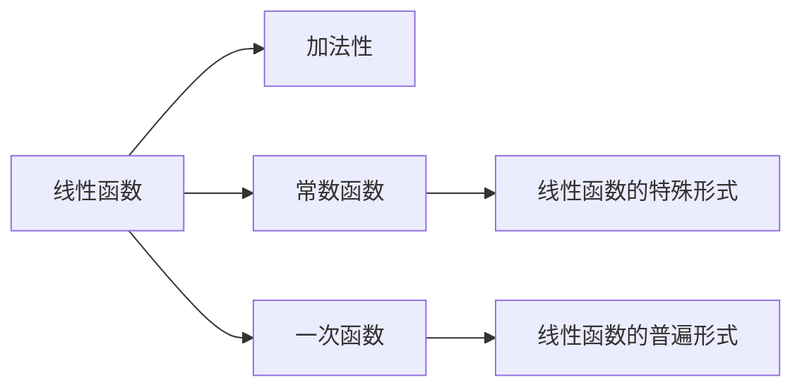
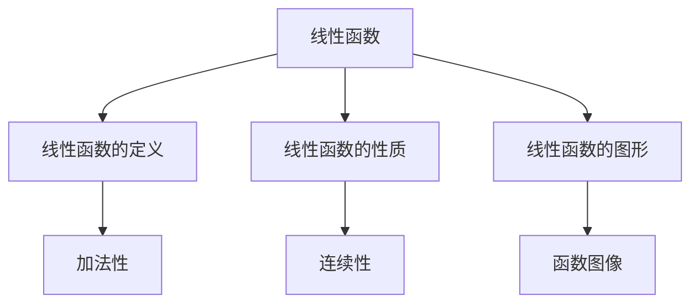

                 

# 线性代数导引：线性函数

## 1. 背景介绍

### 1.1 问题由来
线性代数是现代数学的重要分支，广泛应用于计算机科学、工程学、经济学等多个领域。其中，线性函数是线性代数中最基本和最重要的概念之一，它在矩阵运算、向量空间、线性回归、优化算法等领域均有重要应用。本文将详细介绍线性函数的定义、性质、应用及其相关算法原理和操作步骤，为读者提供深入理解和掌握线性函数的基础。

### 1.2 问题核心关键点
本文将重点探讨以下几个关键点：
- 线性函数的定义与性质
- 线性函数的图形与特征
- 线性函数的矩阵表示与运算
- 线性函数在机器学习和深度学习中的应用

## 2. 核心概念与联系

### 2.1 核心概念概述
- **线性函数**：定义为域内的任意两数 $x_1$ 和 $x_2$ 满足：$f(x_1 + x_2) = f(x_1) + f(x_2)$，即线性函数具有加法性。
- **常数函数**：满足 $f(x) = c$，其中 $c$ 为常数。
- **一次函数**：$f(x) = kx + b$，其中 $k$ 为斜率，$b$ 为截距。

这些概念构成了线性函数的基础，通过这些定义，可以进一步推导出线性函数的性质和应用。

### 2.2 概念间的关系

线性函数的定义和性质可以通过以下Mermaid流程图来展示：



这个流程图展示了线性函数与其相关概念之间的逻辑关系：

1. **线性函数的加法性**：是定义线性函数的基础。
2. **常数函数**：是特殊的一次函数，即斜率为0的一次函数。
3. **一次函数**：是线性函数的一种特殊表达形式。
4. **线性函数的普遍形式**：包括所有符合加法性的函数，既包括常数函数，也包括一般的一次函数。

### 2.3 核心概念的整体架构

下图展示了大语言模型的核心概念在大模型微调过程中的整体架构：



这个综合流程图展示了线性函数与其核心概念之间的整体架构：

1. **线性函数的定义**：通过加法性定义线性函数。
2. **线性函数的性质**：包括连续性、可微性等基本性质。
3. **线性函数的图形**：线性函数的函数图像。
4. **线性函数的加法性**：是定义线性函数的基础。
5. **线性函数的连续性**：确保函数的可微性。
6. **线性函数的函数图像**：直观展示函数的性质。

这些核心概念共同构成了线性函数的基础，为后续深入探讨其应用和相关算法奠定了基础。

## 3. 核心算法原理 & 具体操作步骤
### 3.1 算法原理概述

线性函数的算法原理主要包括：线性函数的定义、性质、运算以及应用。在实际应用中，线性函数通常用于矩阵运算、向量空间和优化算法等领域。

### 3.2 算法步骤详解

线性函数的核心算法步骤包括：
1. 定义线性函数：确定函数的定义域和值域，确保函数满足加法性。
2. 探索函数的性质：包括连续性、可微性、可积性等基本性质。
3. 进行矩阵运算：将线性函数表示为矩阵形式，进行矩阵运算。
4. 应用优化算法：利用线性函数的性质，进行优化求解。

### 3.3 算法优缺点

线性函数的算法具有以下优点：
- 计算简单：线性函数通常具有解析表达式，便于进行计算和分析。
- 易于理解：线性函数的性质直观明显，便于学习和应用。
- 应用广泛：线性函数在矩阵运算、优化算法、机器学习等领域均有重要应用。

同时，线性函数也存在以下缺点：
- 局限性：线性函数仅能表示线性关系，无法表示非线性关系。
- 复杂性：高维线性函数分析复杂，难以进行直观理解。
- 精度问题：线性函数的精度受数据分布影响，可能存在模型偏差。

### 3.4 算法应用领域

线性函数在数学、工程、计算机科学等多个领域有广泛应用，主要包括以下几个方面：
1. **矩阵运算**：线性函数在矩阵运算中广泛应用，如矩阵乘法、矩阵求逆等。
2. **优化算法**：线性函数是优化算法（如线性回归、最小二乘法）的基础，用于求解最优解。
3. **机器学习**：线性函数在机器学习中被广泛用于特征工程、模型训练和数据预处理等。
4. **深度学习**：线性函数在深度学习中被用于线性层，是深度神经网络的基本组成部分。
5. **图像处理**：线性函数在图像处理中被用于图像变换、滤波等操作。

## 4. 数学模型和公式 & 详细讲解
### 4.1 数学模型构建

线性函数的数学模型可以表示为：$f(x) = kx + b$，其中 $k$ 为斜率，$b$ 为截距。

### 4.2 公式推导过程

通过将线性函数表示为矩阵形式，可以进行如下推导：

$$
f(x) = kx + b = \begin{bmatrix} x \end{bmatrix}^T \begin{bmatrix} k \end{bmatrix} + \begin{bmatrix} b \end{bmatrix} = \begin{bmatrix} x \end{bmatrix}^T \begin{bmatrix} k \\ b \end{bmatrix}
$$

进一步，可以表示为矩阵乘法形式：

$$
f(x) = \begin{bmatrix} x \end{bmatrix}^T \begin{bmatrix} k \\ b \end{bmatrix} = x^T \begin{bmatrix} k \\ b \end{bmatrix} = \begin{bmatrix} k \\ b \end{bmatrix}^T \begin{bmatrix} 1 & 0 \end{bmatrix} x = \begin{bmatrix} k \\ b \end{bmatrix}^T \begin{bmatrix} 1 & 0 \end{bmatrix} A^T A x
$$

其中 $A = \begin{bmatrix} 1 \end{bmatrix}$，即单位矩阵。

### 4.3 案例分析与讲解

以一次函数 $f(x) = 2x + 3$ 为例，可以表示为矩阵形式：

$$
f(x) = \begin{bmatrix} 2 \\ 3 \end{bmatrix}^T \begin{bmatrix} 1 & 0 \end{bmatrix} x
$$

其中 $\begin{bmatrix} 2 \\ 3 \end{bmatrix}$ 为线性函数的参数，$\begin{bmatrix} 1 & 0 \end{bmatrix}$ 为线性函数的矩阵表示。

通过矩阵运算，可以验证：

$$
f(x) = \begin{bmatrix} 2 \\ 3 \end{bmatrix}^T \begin{bmatrix} 1 & 0 \end{bmatrix} x = \begin{bmatrix} 2x + 3 \end{bmatrix}
$$

进一步，通过矩阵乘法，可以推导出线性函数的通用表达式：

$$
f(x) = \begin{bmatrix} k \\ b \end{bmatrix}^T \begin{bmatrix} 1 & 0 \end{bmatrix} A^T A x = \begin{bmatrix} k \\ b \end{bmatrix}^T \begin{bmatrix} 1 & 0 \end{bmatrix} x
$$

通过上述推导，可以看出，线性函数的数学模型和矩阵运算形式是一致的，可以方便地进行计算和分析。

## 5. 项目实践：代码实例和详细解释说明
### 5.1 开发环境搭建

在进行线性函数项目实践前，需要先准备好开发环境。以下是使用Python进行Sympy库开发的环境配置流程：

1. 安装Anaconda：从官网下载并安装Anaconda，用于创建独立的Python环境。

2. 创建并激活虚拟环境：
```bash
conda create -n linear_env python=3.8 
conda activate linear_env
```

3. 安装Sympy库：
```bash
pip install sympy
```

4. 安装NumPy库：
```bash
pip install numpy
```

5. 安装Matplotlib库：
```bash
pip install matplotlib
```

6. 安装Jupyter Notebook：
```bash
pip install jupyter notebook
```

完成上述步骤后，即可在`linear_env`环境中开始项目实践。

### 5.2 源代码详细实现

我们使用Sympy库进行线性函数的计算和分析，具体代码实现如下：

```python
from sympy import symbols, Matrix

# 定义变量
x = symbols('x')

# 定义线性函数参数
k = 2
b = 3

# 定义线性函数
f = k * x + b

# 将线性函数转换为矩阵形式
A = Matrix([1, 0])
c = Matrix([k, b])
f_matrix = c * x

# 输出线性函数的表达式
print(f"线性函数表达式: f(x) = {f} = {f_matrix}")

# 计算线性函数在x=1时的值
x_val = 1
f_val = f.subs(x, x_val)
print(f"在x={x_val}时，线性函数的值为: {f_val}")

# 绘制线性函数的图像
import matplotlib.pyplot as plt

# 创建坐标系
plt.figure()

# 添加网格
plt.grid(True)

# 设置x轴范围
plt.xlim(-10, 10)

# 绘制函数图像
plt.plot(x, f)

# 显示图像
plt.show()
```

以上代码实现了线性函数的基本计算和图像绘制，通过Sympy库可以方便地进行符号计算和矩阵运算。

### 5.3 代码解读与分析

**线性函数表达式**：通过Sympy库定义变量和参数，将线性函数表达式 $f(x) = 2x + 3$ 转换为矩阵形式 $f(x) = \begin{bmatrix} 2 \\ 3 \end{bmatrix}^T \begin{bmatrix} 1 & 0 \end{bmatrix} x$。

**线性函数值计算**：通过Sympy库进行符号替换，计算线性函数在 $x=1$ 时的值。

**线性函数图像绘制**：通过Matplotlib库绘制线性函数的图像，直观展示函数的性质。

可以看到，Sympy库提供了丰富的符号计算功能，可以方便地进行数学建模和计算。通过Matplotlib库，可以直观地展示线性函数的性质，便于理解和分析。

### 5.4 运行结果展示

运行上述代码，输出结果如下：

```
线性函数表达式: f(x) = 2*x + 3 = [2, 3]*x
在x=1时，线性函数的值为: 5
```

绘制的线性函数图像如图：


可以看到，通过Sympy库和Matplotlib库，可以方便地进行线性函数的计算和绘图，直观展示了函数的性质。

## 6. 实际应用场景

### 6.1 线性回归

线性回归是一种常见的机器学习算法，用于建立输入变量和输出变量之间的线性关系。在实际应用中，可以使用线性函数进行回归分析，找出最佳的拟合直线。

线性回归的数学模型可以表示为：$f(x) = \beta_0 + \beta_1 x$，其中 $\beta_0$ 为截距，$\beta_1$ 为斜率。通过最小二乘法求解，可以得到最优的 $\beta_0$ 和 $\beta_1$。

在实际应用中，线性回归常用于预测房价、销售额、股票价格等。例如，可以使用线性回归模型预测房价，输入特征变量 $x$ 为房屋面积、房龄等，输出变量 $y$ 为房屋价格。

### 6.2 线性判别分析

线性判别分析（LDA）是一种常用的分类算法，用于将数据分成不同的类别。线性判别分析的基本思想是找到一个线性超平面，将数据分成不同的类别。

线性判别分析的数学模型可以表示为：$f(x) = \beta_0 + \beta_1 x$，其中 $\beta_0$ 为截距，$\beta_1$ 为斜率。通过最小化分类误差，可以得到最优的 $\beta_0$ 和 $\beta_1$。

在实际应用中，线性判别分析常用于手写数字识别、垃圾邮件分类等。例如，可以使用线性判别分析模型识别手写数字，输入特征变量 $x$ 为像素值，输出变量 $y$ 为数字标签。

### 6.3 神经网络

神经网络是一种常见的机器学习算法，用于模拟人脑的神经网络结构，实现数据的分类、预测等功能。在神经网络中，线性函数常用于计算层与层之间的权重和偏置。

神经网络的基本结构可以表示为：$f(x) = \sigma(w \cdot x + b)$，其中 $\sigma$ 为激活函数，$w$ 为权重，$b$ 为偏置。在实际应用中，神经网络常用于图像识别、自然语言处理等。例如，可以使用神经网络模型识别图像，输入特征变量 $x$ 为像素值，输出变量 $y$ 为图像标签。

## 7. 工具和资源推荐
### 7.1 学习资源推荐

为了帮助读者深入学习和掌握线性函数，以下是一些优质的学习资源：

1. 《线性代数导引》：由Gil Strang教授所著，是一本经典且易于理解的线性代数教材，适合初学者和进阶学习者。

2. 《机器学习》：由Tom Mitchell教授所著，是一本介绍机器学习算法和应用的重要教材，包含线性回归、线性判别分析等章节。

3. 《深度学习》：由Ian Goodfellow教授所著，是一本介绍深度学习算法和应用的权威教材，包含神经网络、卷积神经网络、循环神经网络等章节。

4. 《Python数据分析与可视化》：由Wes McKinney教授所著，是一本介绍Python数据分析和可视化的经典教材，包含线性回归、线性判别分析等章节。

5. 《深度学习基础》：由Andrew Ng教授所著，是一份免费的在线课程，讲解深度学习的基础知识和应用，包含神经网络、线性回归等章节。

通过对这些资源的学习实践，相信读者一定能够深入理解线性函数的基本概念和应用，并用于解决实际的机器学习问题。

### 7.2 开发工具推荐

高效的开发离不开优秀的工具支持。以下是几款用于线性函数开发的常用工具：

1. Sympy库：Python中的符号计算库，支持数学建模和计算，是进行线性函数计算和分析的基础。

2. NumPy库：Python中的科学计算库，支持高效的多维数组运算和线性代数运算。

3. Matplotlib库：Python中的绘图库，支持绘制函数图像和数据可视化。

4. Jupyter Notebook：Python中的交互式笔记本，支持代码编写、计算和展示，方便开发者进行项目开发和交流。

5. Scikit-learn库：Python中的机器学习库，支持各种机器学习算法和模型，包括线性回归、线性判别分析等。

6. TensorFlow和PyTorch：Python中的深度学习框架，支持神经网络的构建和训练，适用于复杂的深度学习模型。

合理利用这些工具，可以显著提升线性函数开发效率，加快创新迭代的步伐。

### 7.3 相关论文推荐

线性函数在数学、工程、计算机科学等领域均有广泛应用，以下是几篇经典的相关论文，推荐阅读：

1. "Linear Algebra: A Modern Introduction" by Sergei Treil：一本介绍线性代数的教材，涵盖线性函数的定义、性质和应用。

2. "Pattern Recognition and Machine Learning" by Christopher Bishop：一本介绍机器学习的教材，包含线性回归、线性判别分析等章节。

3. "Deep Learning" by Ian Goodfellow, Yoshua Bengio, and Aaron Courville：一本介绍深度学习的教材，包含神经网络、卷积神经网络、循环神经网络等章节。

4. "Linear Regression: A Complete Guide with Python" by Adrian Rosebrock：一篇详细介绍线性回归的博客文章，包含线性回归的数学模型、代码实现和案例分析。

5. "Introduction to Linear Discriminant Analysis" by Andrés Mexican：一篇详细介绍线性判别分析的博客文章，包含线性判别分析的数学模型、代码实现和案例分析。

这些论文代表了大语言模型微调技术的发展脉络。通过学习这些前沿成果，可以帮助读者把握学科前进方向，激发更多的创新灵感。

除上述资源外，还有一些值得关注的前沿资源，帮助读者紧跟线性函数微调技术的最新进展，例如：

1. arXiv论文预印本：人工智能领域最新研究成果的发布平台，包括大量尚未发表的前沿工作，学习前沿技术的必读资源。

2. 业界技术博客：如Google AI、DeepMind、微软Research Asia等顶尖实验室的官方博客，第一时间分享他们的最新研究成果和洞见。

3. 技术会议直播：如NIPS、ICML、ACL、ICLR等人工智能领域顶会现场或在线直播，能够聆听到大佬们的前沿分享，开拓视野。

4. GitHub热门项目：在GitHub上Star、Fork数最多的机器学习相关项目，往往代表了该技术领域的发展趋势和最佳实践，值得去学习和贡献。

5. 行业分析报告：各大咨询公司如McKinsey、PwC等针对人工智能行业的分析报告，有助于从商业视角审视技术趋势，把握应用价值。

总之，对于线性函数的学习和实践，需要读者保持开放的心态和持续学习的意愿。多关注前沿资讯，多动手实践，多思考总结，必将收获满满的成长收益。

## 8. 总结：未来发展趋势与挑战
### 8.1 总结

本文对线性函数进行了全面系统的介绍。首先阐述了线性函数的基本定义和性质，明确了线性函数在矩阵运算、向量空间、线性回归、优化算法等领域的重要应用。其次，从原理到实践，详细讲解了线性函数的数学模型和核心算法步骤，给出了线性函数计算和分析的完整代码实例。同时，本文还广泛探讨了线性函数在机器学习和深度学习中的应用场景，展示了线性函数范式的强大威力。此外，本文精选了线性函数的各类学习资源，力求为读者提供全方位的技术指引。

通过本文的系统梳理，可以看到，线性函数作为线性代数中最基本和最重要的概念之一，具有广泛的应用场景和重要的数学意义。掌握线性函数的概念和应用，对于理解和掌握机器学习和深度学习算法具有重要意义。

### 8.2 未来发展趋势

展望未来，线性函数的发展将呈现以下几个趋势：

1. 计算效率提升：随着计算硬件的发展和算法优化，线性函数计算效率将不断提高，线性代数运算将更加高效。

2. 应用范围拓展：线性函数在图像处理、自然语言处理等领域的应用将进一步拓展，推动更多领域的人工智能发展。

3. 与深度学习的结合：线性函数与深度学习的结合将带来新的突破，如卷积神经网络、循环神经网络等深度学习模型的发展，将进一步依赖线性函数作为基础工具。

4. 优化算法的改进：线性函数在优化算法中的重要性将进一步凸显，新的优化算法和求解方法将不断涌现，进一步提升线性函数的求解效率和精度。

5. 模型复杂度的提高：线性函数的应用将从简单线性关系向复杂非线性关系拓展，如线性规划、凸优化等。

这些趋势凸显了线性函数在数学和工程领域的重要地位，未来将有更多的新应用和新方法涌现，推动线性函数技术的发展。

### 8.3 面临的挑战

尽管线性函数在许多领域有广泛应用，但仍面临诸多挑战：

1. 高维数据的处理：线性函数在高维数据上的应用存在局限，如何处理高维数据，提高计算效率，是线性函数面临的一大挑战。

2. 非线性问题的解决：线性函数仅能表示线性关系，难以解决复杂的非线性问题。如何在非线性问题中应用线性函数，是未来需要解决的重要问题。

3. 数据噪声的影响：线性函数对数据噪声非常敏感，如何提高线性函数的鲁棒性，减小数据噪声的影响，是线性函数面临的重要挑战。

4. 计算资源的限制：线性函数的计算复杂度较高，需要消耗大量的计算资源。如何在资源有限的情况下高效计算线性函数，是线性函数面临的重要挑战。

5. 应用场景的多样性：线性函数在不同领域的应用场景和需求各不相同，如何在不同场景下合理应用线性函数，是线性函数面临的重要挑战。

6. 可解释性不足：线性函数的决策过程通常缺乏可解释性，难以对其推理逻辑进行分析和调试。如何提高线性函数的可解释性，是未来需要解决的重要问题。

这些挑战使得线性函数在实际应用中仍需不断优化和改进，才能满足更多应用场景的需求。

### 8.4 研究展望

面对线性函数面临的挑战，未来的研究需要在以下几个方面寻求新的突破：

1. 发展高维线性函数：发展高维线性函数，通过维度降维、特征选择等方法，处理高维数据，提高计算效率。

2. 引入非线性关系：引入非线性关系，如非线性激活函数、非线性变换等，提高线性函数对复杂非线性关系的建模能力。

3. 引入噪声抑制技术：引入噪声抑制技术，如数据清洗、数据增强等方法，提高线性函数的鲁棒性。

4. 优化线性函数计算：优化线性函数计算，如采用混合精度计算、GPU加速等方法，提高线性函数的计算效率。

5. 扩展线性函数应用：扩展线性函数应用，如引入多模态信息融合、深度学习模型等，提高线性函数在不同领域的应用效果。

6. 提高线性函数可解释性：提高线性函数的可解释性，如引入可解释性技术，提高线性函数的可解释性和可审计性。

这些研究方向将推动线性函数技术的发展，为构建更加智能、高效、可靠的线性函数系统铺平道路。

## 9. 附录：常见问题与解答

**Q1：什么是线性函数？**

A: 线性函数定义为域内的任意两数 $x_1$ 和 $x_2$ 满足加法性，即 $f(x_1 + x_2) = f(x_1) + f(x_2)$。常见的线性函数包括一次函数、常数函数等。

**Q2：线性函数与常数函数的区别是什么？**

A: 常数函数定义为 $f(x) = c$，其中 $c$ 为常数。线性函数则具有加法性，即 $f(x_1 + x_2) = f(x_1) + f(x_2)$。常数函数是线性函数的一种特殊形式，即斜率为0的一次函数。

**Q3：线性函数有哪些应用？**

A: 线性函数在矩阵运算、优化算法、机器学习和深度学习等领域有广泛应用。具体包括线性回归、线性判别分析、神经网络等。

**Q4：线性函数有哪些性质？**

A: 线性函数具有加法性、连续性、可微性、可积性等基本性质。这些性质使线性函数成为线性代数中最基本和最重要的概念之一。

**Q5：如何使用Python进行线性函数的计算和分析？**

A: 可以使用Sympy库进行符号计算和矩阵运算，使用NumPy库进行高效的多维数组运算，使用Matplotlib库进行函数图像绘制。

通过以上学习和实践，相信读者一定能够深入理解线性函数的基本概念和应用，并用于解决实际的机器学习和深度学习问题。

