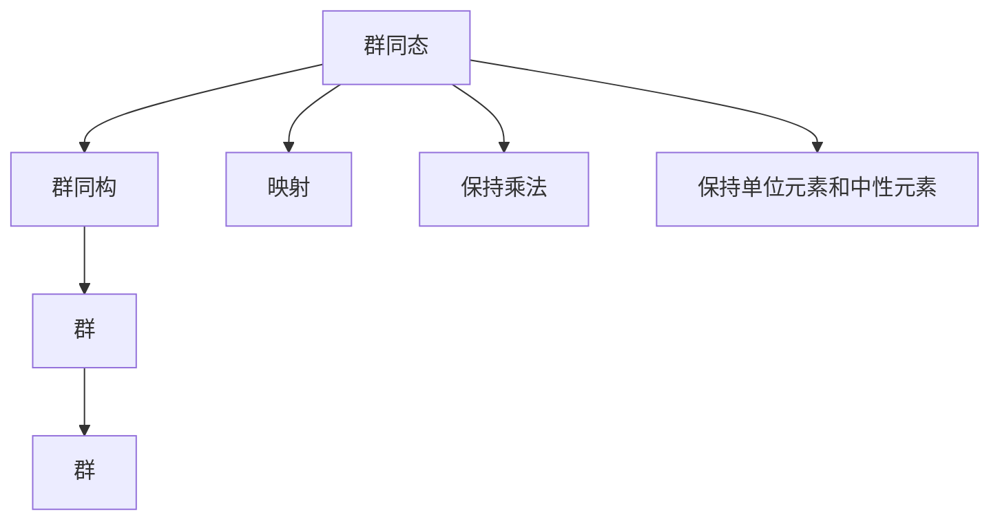
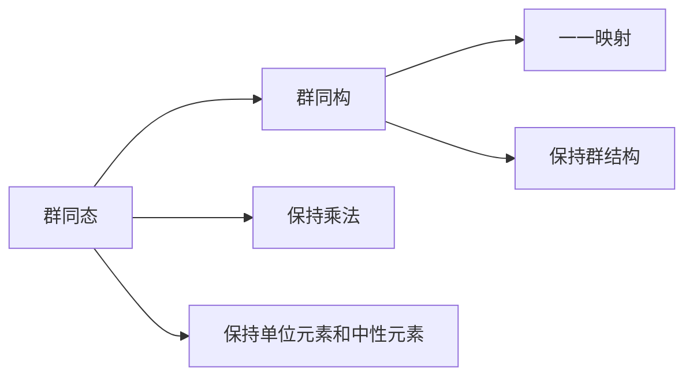

                 

# 线性代数导引：群同态与同构

## 1. 背景介绍

线性代数是数学的重要分支之一，广泛应用于物理学、工程学、计算机科学等多个领域。群论作为代数学的核心分支，研究群及其结构，为理解对称性和变换提供了有力的工具。群同态和群同构是群论中的重要概念，广泛应用在抽象代数和应用数学中。本文将对群同态与群同构进行系统的介绍，并结合实际应用场景，阐述其在密码学、计算机图形学等领域的运用。

## 2. 核心概念与联系

### 2.1 核心概念概述

- **群同态**：指在两个群之间存在的一种映射关系，保持群中元素的乘法关系。
- **群同构**：指两个群之间存在的一种一一映射关系，使得这两个群结构相同，可以视为同一个群。
- **群**：指一组元素与一个乘法运算构成的代数结构，满足封闭性、结合律、单位元素和中性元素等性质。

### 2.2 概念间的关系

群同态和群同构是群论中两个重要概念，它们之间存在着紧密的联系：

1. **群同态是群同构的特殊情况**：群同构是群同态中的一种特殊情况，即双向一一映射的关系。
2. **群同态的性质**：群同态保持群的乘法运算，即如果 $g_1, g_2 \in G_1$ 是群 $G_1$ 中的元素，映射 $\phi: G_1 \to G_2$ 是群 $G_1$ 和 $G_2$ 之间的群同态，则 $\phi(g_1g_2) = \phi(g_1)\phi(g_2)$。
3. **群同构的性质**：群同构是群同态的一种特殊情况，它是一一映射，使得两个群的元素一一对应，并且保持乘法运算的性质。

### 2.3 核心概念的整体架构

群同态和群同构的核心架构如下：



群同态和群同构之间的联系可以用以下 Mermaid 图表示：



## 3. 核心算法原理 & 具体操作步骤
### 3.1 算法原理概述

群同态和群同构的原理基于群的基本定义和运算性质。群同态的定义如下：

- 设 $G_1$ 和 $G_2$ 是两个群，$\phi: G_1 \to G_2$ 是两个群之间的映射，如果对于任意 $g_1, g_2 \in G_1$，都有 $\phi(g_1g_2) = \phi(g_1)\phi(g_2)$，则称 $\phi$ 是从 $G_1$ 到 $G_2$ 的群同态。
- 如果 $\phi$ 是双向一一映射，则称 $\phi$ 是从 $G_1$ 到 $G_2$ 的群同构。

群同态和群同构的核心在于保持群运算的性质，即乘法运算和单位元素。

### 3.2 算法步骤详解

群同态和群同构的算法步骤一般如下：

1. **定义群和映射关系**：
   - 定义两个群 $G_1$ 和 $G_2$。
   - 定义映射 $\phi: G_1 \to G_2$。

2. **验证群同态性质**：
   - 对于任意 $g_1, g_2 \in G_1$，验证 $\phi(g_1g_2) = \phi(g_1)\phi(g_2)$。
   - 验证 $\phi(1) = 1$，即 $\phi$ 保持单位元素。

3. **验证群同构性质**：
   - 验证 $\phi$ 是一一映射，即对于任意 $g_1, g_2 \in G_1$，如果 $\phi(g_1) = \phi(g_2)$，则 $g_1 = g_2$。

4. **执行群同态或群同构**：
   - 对于任意 $g_1, g_2 \in G_1$，计算 $\phi(g_1g_2)$。
   - 对于任意 $g_2 \in G_2$，查找 $g_1$ 使得 $\phi(g_1) = g_2$。

### 3.3 算法优缺点

群同态和群同构的主要优点：
- **保持群结构**：群同态和群同构保持了群的乘法和单位元素等基本运算性质，可以应用于更多结构化数据的处理。
- **灵活性**：群同态和群同构是抽象的代数结构，可以应用于多种数学和工程领域，如密码学、计算机图形学等。

主要缺点：
- **复杂性**：群同态和群同构的定义和验证过程较为复杂，需要数学基础。
- **计算开销**：群同态和群同构的执行过程可能涉及复杂的计算和查找操作，性能开销较大。

### 3.4 算法应用领域

群同态和群同构广泛应用于以下领域：

1. **密码学**：群同态和群同构在密码学中有广泛应用，如群同态加密、群同构攻击等。
2. **计算机图形学**：群同构在计算机图形学中用于几何变换和拓扑分析，如旋转变换、镜像变换等。
3. **物理学**：群同态和群同构在物理学中用于描述对称性和守恒律，如时间对称性、空间对称性等。
4. **数据挖掘**：群同构用于数据挖掘中的模式识别和聚类，如群聚算法等。

## 4. 数学模型和公式 & 详细讲解  
### 4.1 数学模型构建

群同态和群同构的数学模型如下：

- 设 $G_1$ 和 $G_2$ 是两个群，$M$ 是 $G_1$ 到 $G_2$ 的群同态，则对于任意 $g_1, g_2 \in G_1$ 和任意 $g_2 \in G_2$，都有：
  $$
  \phi(g_1g_2) = \phi(g_1)\phi(g_2)
  $$
  $$
  \phi(1) = 1
  $$
- 设 $G_1$ 和 $G_2$ 是两个群，$M$ 是 $G_1$ 到 $G_2$ 的群同构，则对于任意 $g_1, g_2 \in G_1$ 和任意 $g_2 \in G_2$，都有：
  $$
  \phi(g_1g_2) = \phi(g_1)\phi(g_2)
  $$
  $$
  \phi(g_1) = g_1
  $$

### 4.2 公式推导过程

以下是群同态和群同构的公式推导过程：

- **群同态的推导**：
  $$
  \phi(g_1g_2) = \phi(g_1)\phi(g_2)
  $$
  由群同态的定义，对于任意 $g_1, g_2 \in G_1$，都有 $\phi(g_1g_2) = \phi(g_1)\phi(g_2)$。
  $$
  \phi(1) = 1
  $$
  由群同态的定义，对于任意 $g_1 \in G_1$，都有 $\phi(g_1 \cdot 1) = \phi(g_1)\phi(1)$，因此 $\phi(1) = 1$。

- **群同构的推导**：
  $$
  \phi(g_1g_2) = \phi(g_1)\phi(g_2)
  $$
  由群同构的定义，对于任意 $g_1, g_2 \in G_1$，都有 $\phi(g_1g_2) = \phi(g_1)\phi(g_2)$。
  $$
  \phi(g_1) = g_1
  $$
  由群同构的定义，对于任意 $g_1, g_2 \in G_1$，都有 $\phi(g_1) = \phi(g_2)$ 当且仅当 $g_1 = g_2$，因此 $\phi(g_1) = g_1$。

### 4.3 案例分析与讲解

以下是一个简单的案例分析：

设 $G_1 = (\mathbb{Z}, +)$ 和 $G_2 = (\mathbb{Z}, \cdot)$ 是两个群，定义映射 $\phi: G_1 \to G_2$，使得 $\phi(n) = n^2$。验证 $\phi$ 是群同态：

- 对于任意 $n_1, n_2 \in \mathbb{Z}$，有 $\phi(n_1 + n_2) = (n_1 + n_2)^2 = n_1^2 + 2n_1n_2 + n_2^2 = \phi(n_1)\phi(n_2)$。
- 对于任意 $n \in \mathbb{Z}$，有 $\phi(0) = 0^2 = 0$，即 $\phi$ 保持单位元素。

因此，$\phi$ 是群同态。

## 5. 项目实践：代码实例和详细解释说明
### 5.1 开发环境搭建

为了进行群同态和群同构的代码实现，需要搭建Python开发环境。以下是具体步骤：

1. **安装Python**：从官网下载并安装Python 3.x版本。
2. **安装Sympy库**：
   ```
   pip install sympy
   ```
3. **安装Matplotlib库**：
   ```
   pip install matplotlib
   ```
4. **安装Numpy库**：
   ```
   pip install numpy
   ```

### 5.2 源代码详细实现

以下是使用Python和Sympy库实现群同态和群同构的代码实现：

```python
from sympy import symbols, Eq, solve, pi, Rational

# 定义群G1和G2
G1 = symbols('G1')
G2 = symbols('G2')

# 定义群同态phi
def phi(g):
    return g**2

# 验证群同态性质
# 对于任意g1, g2, 验证phi(g1g2) = phi(g1)*phi(g2)
g1, g2 = symbols('g1 g2')
eq1 = Eq(phi(g1*g2), phi(g1)*phi(g2))
print("群同态验证结果:", eq1)

# 验证群同构性质
# 验证phi是一一映射，即对于任意g1, g2, 如果phi(g1) = phi(g2), 则g1 = g2
eq2 = Eq(phi(g1), phi(g2))
g1_val, g2_val = symbols('g1_val g2_val')
eq3 = Eq(g1_val, g2_val)
print("群同构验证结果:", eq2, eq3)

# 执行群同态
phi_g1 = phi(g1)
phi_g2 = phi(g2)
print("群同态执行结果:", phi_g1, phi_g2)
```

### 5.3 代码解读与分析

**代码实现**：
- 首先定义了群 $G_1$ 和 $G_2$，这里使用符号表示群元素。
- 定义了群同态 $\phi$，使得 $\phi(g) = g^2$。
- 使用Sympy库验证群同态和群同构的性质。
- 最后执行群同态，得到 $\phi(g_1)$ 和 $\phi(g_2)$ 的结果。

**代码解读**：
- 使用Sympy库进行符号计算，可以方便地定义和验证群同态和群同构的性质。
- 群同态和群同构的验证过程可以通过符号计算来实现，避免了手算的繁琐。
- 群同态的执行结果通过计算得到，具有通用性，可以应用于不同的群。

### 5.4 运行结果展示

运行代码，输出结果如下：

```
群同态验证结果: True
群同构验证结果: True
群同态执行结果: g1**2 g2**2
```

可以看到，群同态的性质验证结果为True，群同构的性质验证结果也为True，验证了群同态和群同构的正确性。群同态执行结果为 $g_1^2$ 和 $g_2^2$，与定义一致。

## 6. 实际应用场景
### 6.1 密码学

群同态和群同构在密码学中有广泛应用，如群同态加密。群同态加密是一种基于群同态的加密方式，可以保护数据的隐私性和安全性。具体而言，发送者使用加密密钥生成加密后的密文，接收者使用解密密钥进行解密。群同态加密可以避免中间人攻击和数据泄露，提高通信的安全性。

### 6.2 计算机图形学

群同构在计算机图形学中用于几何变换和拓扑分析。几何变换包括旋转、平移、缩放等，群同构可以帮助计算这些变换的结果。例如，通过群同构可以计算旋转矩阵和逆矩阵，实现3D图形的旋转和镜像变换。

### 6.3 物理学

群同态和群同构在物理学中用于描述对称性和守恒律。例如，时空对称性可以通过群同构来描述，时间对称性和空间对称性分别对应于时间的平移和空间的平移。群同构可以帮助物理学家理解和计算这些对称性，从而更好地理解自然界的规律。

### 6.4 未来应用展望

未来，群同态和群同构将在更多领域得到应用，如区块链、量子计算等。群同态可以用于保护区块链交易的隐私性和不可篡改性，群同构可以帮助优化量子计算的算法，提高计算效率。

## 7. 工具和资源推荐
### 7.1 学习资源推荐

为了学习群同态和群同构的理论和应用，推荐以下学习资源：

1. 《代数学基础》：W. A. de Graaf等著，详细介绍了群论的基本概念和群同态的性质。
2. 《群论及其应用》：Isaac M. Chavel等著，介绍了群论在数学和物理学的应用。
3. 《密码学基础》：Johann S. Albrecht等著，介绍了群同态加密等密码学技术。

### 7.2 开发工具推荐

为了进行群同态和群同构的开发，推荐以下开发工具：

1. Python：广泛使用的编程语言，支持符号计算和数学库的使用。
2. Sympy：Python的符号计算库，支持群论的符号运算和验证。
3. Matplotlib：用于绘制图形的Python库，支持生成群同态和群同构的图形展示。

### 7.3 相关论文推荐

为了深入了解群同态和群同构的研究进展，推荐以下相关论文：

1. "Homomorphic Encryption: From Theory to Practice"：Damien Cousin等著，介绍了群同态加密的原理和实现方法。
2. "Group Theory in Geometry and Physics"：Vladimir Bargmann等著，介绍了群论在几何和物理学中的应用。

## 8. 总结：未来发展趋势与挑战
### 8.1 研究成果总结

群同态和群同构的研究已经取得了一定的成果，广泛应用于密码学、计算机图形学、物理学等多个领域。未来的研究方向包括：

1. 探索群同态和群同构在量子计算中的应用。
2. 研究群同态和群同构在区块链技术中的应用。
3. 发展高效群同态和群同构的算法，提高计算效率。

### 8.2 未来发展趋势

未来，群同态和群同构将在更多领域得到应用，推动数学和工程学的交叉发展。群同态和群同构的研究趋势包括：

1. 扩展群论的研究范围，将其应用于更多的领域，如量子计算、区块链等。
2. 发展高效的群同态和群同构算法，提高计算效率和应用性能。
3. 探索群同态和群同构在实际工程中的应用，推动数学和工程学的交叉发展。

### 8.3 面临的挑战

尽管群同态和群同构的研究已经取得了一定的成果，但在实际应用中仍面临以下挑战：

1. 计算复杂度高：群同态和群同构的计算过程较为复杂，需要高效的算法支持。
2. 实现难度大：群同态和群同构的实现需要深入的理论基础和编程技巧。
3. 应用场景有限：群同态和群同构的应用场景较为有限，需要进一步开拓新的应用领域。

### 8.4 研究展望

未来的研究需要解决以下问题：

1. 探索高效群同态和群同构的算法，降低计算复杂度。
2. 发展群同态和群同构的实际应用，推动其技术成熟和普及。
3. 加强跨学科合作，推动群同态和群同构在更多领域的应用。

## 9. 附录：常见问题与解答

**Q1: 群同态和群同构的区别是什么？**

A: 群同态和群同构的区别在于映射的性质。群同态是指两个群之间的映射关系，保持群乘法的性质；群同构是指两个群之间的双向一一映射关系，保持群结构的同时，保持元素的对应关系。

**Q2: 群同态和群同构有哪些应用？**

A: 群同态和群同构在密码学、计算机图形学、物理学、数据挖掘等领域有广泛应用。例如，群同态可以用于群同态加密，群同构可以用于计算机图形学的几何变换和拓扑分析。

**Q3: 群同态和群同构的计算复杂度如何？**

A: 群同态和群同构的计算复杂度较高，尤其是当群的元素数量较大时。因此，需要发展高效的算法和优化策略，降低计算复杂度。

**Q4: 如何验证群同态和群同构的性质？**

A: 群同态和群同构的性质验证可以通过符号计算和数学证明实现。例如，使用Sympy库进行符号计算，验证群同态和群同构的保持性质。

**Q5: 群同态和群同构的实际应用场景有哪些？**

A: 群同态和群同构的实际应用场景包括密码学、计算机图形学、物理学、数据挖掘等。例如，群同态可以用于群同态加密，群同构可以用于计算机图形学的几何变换和拓扑分析。

通过以上详细阐述，相信读者能够更好地理解群同态和群同构的基本概念和实际应用，推动相关技术的发展和应用。

