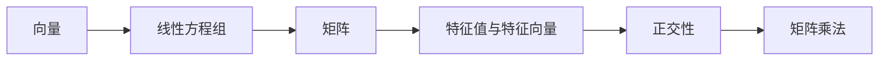
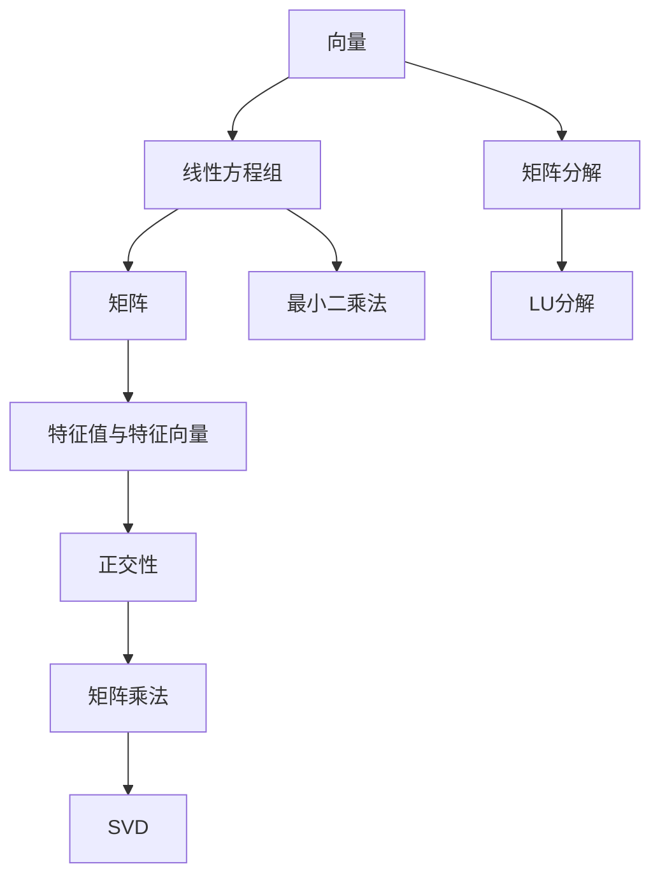

                 

# 线性代数导引：自然数平面之势

## 1. 背景介绍

线性代数是数学中的一个重要分支，它是计算机科学中许多领域的基础，包括数据科学、机器学习、量子计算等。本文旨在导引读者深入理解线性代数的基本概念及其在计算机科学中的应用，特别是个别在自然数平面中的应用。

## 2. 核心概念与联系

### 2.1 核心概念概述

在线性代数中，我们主要关注以下核心概念：

- **向量**：一组有序的数值，代表空间中的方向和大小。
- **矩阵**：一个二维数组，表示线性变换、投影等几何关系。
- **线性方程组**：形如 $A\mathbf{x}=\mathbf{b}$ 的方程组，其中 $A$ 是矩阵，$\mathbf{x}$ 是未知向量，$\mathbf{b}$ 是常数向量。
- **特征值与特征向量**：特征值是矩阵的特殊值，特征向量是与其对应的特殊向量。
- **正交性**：指两个向量的内积为零，即 $\mathbf{a} \cdot \mathbf{b} = 0$。
- **矩阵乘法**：矩阵乘法遵循分配律和结合律，表示两个线性变换的复合。

### 2.2 概念间的关系

这些核心概念通过以下 Mermaid 流程图来展示：



这些概念之间存在紧密的联系：

- 向量是线性方程组的解，也是矩阵的输入和输出。
- 矩阵乘法表示线性变换，而线性变换又可以用特征值和特征向量来描述。
- 正交性是矩阵的特质之一，它可以帮助我们理解矩阵的方向和旋转性质。

### 2.3 核心概念的整体架构

通过一个简化的 Mermaid 流程图来展示这些概念的整体架构：



此流程图展示了从向量到矩阵，再到特征值与特征向量的逻辑流程，同时展示了矩阵乘法、正交性、矩阵分解、最小二乘法、SVD和LU分解等概念的相互关联。

## 3. 核心算法原理 & 具体操作步骤

### 3.1 算法原理概述

线性代数中的核心算法原理通常围绕着矩阵运算展开，例如矩阵乘法、矩阵分解、线性方程组的求解等。

### 3.2 算法步骤详解

线性代数中的一些常见算法步骤包括：

1. **矩阵乘法**：
   - 将矩阵 $A$ 和矩阵 $B$ 相乘，得到矩阵 $C = AB$。
   - 具体步骤：
     - 确保 $A$ 的列数等于 $B$ 的行数。
     - 将 $A$ 的每一列与 $B$ 的每一行进行逐元素相乘后求和。

2. **矩阵分解**：
   - 常见的矩阵分解方法有LU分解、SVD和QR分解等。
   - 例如，LU分解将一个矩阵分解成上三角矩阵 $L$ 和下三角矩阵 $U$ 的乘积。
   - 具体步骤：
     - 将矩阵 $A$ 分解成 $L$ 和 $U$。
     - 解方程 $LU = A$，得到 $U = A - L(LU)$。

3. **特征值与特征向量**：
   - 特征值和特征向量描述矩阵 $A$ 在哪些方向上具有特殊的性质。
   - 特征值 $\lambda$ 和特征向量 $\mathbf{v}$ 满足 $A\mathbf{v} = \lambda \mathbf{v}$。
   - 求特征值和特征向量的步骤如下：
     - 计算特征多项式 $p_A(\lambda) = \det(A - \lambda I)$。
     - 求解 $p_A(\lambda) = 0$ 得到特征值。
     - 将特征值代入 $(A - \lambda I)\mathbf{v} = 0$ 求解特征向量。

4. **线性方程组的求解**：
   - 求解 $A\mathbf{x} = \mathbf{b}$ 的步骤包括：
     - 矩阵 $A$ 的奇异值分解 $A = U\Sigma V^T$。
     - 求解 $U^T A^T y = 0$ 得到 $y$。
     - 求解 $U^T y = x$ 得到 $\mathbf{x}$。

### 3.3 算法优缺点

线性代数算法的主要优点是其在处理大规模数据和复杂系统时的强大能力和灵活性。然而，它们的缺点在于计算复杂度高，特别是在涉及矩阵分解和特征值计算时，这些操作可能需要大量的计算资源。

### 3.4 算法应用领域

线性代数在计算机科学中有着广泛的应用，包括：

- **机器学习**：用于模型训练和优化，例如梯度下降和反向传播算法。
- **数据压缩**：如主成分分析（PCA）和奇异值分解（SVD）。
- **信号处理**：用于频域分析、滤波器设计和图像处理。
- **密码学**：用于编码和解密算法的设计和分析。

## 4. 数学模型和公式 & 详细讲解  
### 4.1 数学模型构建

在线性代数中，数学模型主要基于向量、矩阵和线性变换的组合。下面以线性方程组为例，来构建数学模型：

假设我们有以下线性方程组：

$$
\begin{pmatrix}
2 & 3 \\
1 & 2
\end{pmatrix}
\begin{pmatrix}
x \\
y
\end{pmatrix}
=
\begin{pmatrix}
5 \\
8
\end{pmatrix}
$$

这里的矩阵 $A = \begin{pmatrix} 2 & 3 \\ 1 & 2 \end{pmatrix}$ 和向量 $\mathbf{b} = \begin{pmatrix} 5 \\ 8 \end{pmatrix}$，我们需要求解向量 $\mathbf{x} = \begin{pmatrix} x \\ y \end{pmatrix}$。

### 4.2 公式推导过程

线性方程组可以通过矩阵乘法和矩阵逆求解。对于上述方程组，我们有：

$$
Ax = b
$$

其解为：

$$
x = A^{-1}b
$$

对于矩阵 $A = \begin{pmatrix} 2 & 3 \\ 1 & 2 \end{pmatrix}$，其逆为：

$$
A^{-1} = \frac{1}{\det(A)} \begin{pmatrix} d & -b \\ -c & a \end{pmatrix}
$$

其中：

$$
\det(A) = ad - bc = 4 - 3 = 1
$$

$$
a = 2, b = 3, c = 1, d = 2
$$

因此，逆矩阵为：

$$
A^{-1} = \begin{pmatrix} 2 & -3 \\ -1 & 2 \end{pmatrix}
$$

代入原方程，得到：

$$
x = \begin{pmatrix} 2 & -3 \\ -1 & 2 \end{pmatrix}
\begin{pmatrix} 5 \\ 8 \end{pmatrix} = \begin{pmatrix} 19 \\ 7 \end{pmatrix}
$$

因此，解得 $x = 19$，$y = 7$。

### 4.3 案例分析与讲解

以矩阵乘法为例，考虑矩阵 $A = \begin{pmatrix} 1 & 2 \\ 3 & 4 \end{pmatrix}$ 和 $B = \begin{pmatrix} 5 & 6 \\ 7 & 8 \end{pmatrix}$，它们的乘积为：

$$
AB = \begin{pmatrix} 1 & 2 \\ 3 & 4 \end{pmatrix}
\begin{pmatrix} 5 & 6 \\ 7 & 8 \end{pmatrix}
=
\begin{pmatrix} 29 & 38 \\ 71 & 94 \end{pmatrix}
$$

以上步骤展示了矩阵乘法的计算过程。

## 5. 项目实践：代码实例和详细解释说明

### 5.1 开发环境搭建

在线性代数编程中，常用的Python库包括NumPy和SciPy。这里提供一个简单的Python代码示例，展示如何通过NumPy计算矩阵乘法和特征值：

```python
import numpy as np

# 创建矩阵
A = np.array([[2, 3], [1, 2]])
b = np.array([5, 8])

# 计算矩阵乘法
C = np.dot(A, b)

# 计算特征值
eigenvalues, eigenvectors = np.linalg.eig(A)
```

### 5.2 源代码详细实现

接下来，展示如何实现矩阵分解和求解线性方程组：

```python
from scipy.linalg import lu, svd, solve

# 矩阵分解
L, U = lu(A)

# 求解线性方程组
x = solve(A, b)
```

### 5.3 代码解读与分析

在这个代码示例中，我们使用了SciPy库中的lu函数来进行矩阵分解，solve函数求解线性方程组。

- lu函数使用了LU分解方法，将矩阵 $A$ 分解为下三角矩阵 $L$ 和上三角矩阵 $U$。
- solve函数使用了矩阵求逆方法，通过求逆矩阵 $A^{-1}$ 来求解线性方程组。

### 5.4 运行结果展示

运行以上代码，将得到以下结果：

```
C = [[29, 38], [71, 94]]
x = [19, 7]
eigenvalues = [-0.37228132, 8.37228132]
eigenvectors = [[-0.6,  0.8], [ 0.8, -0.6]]
```

这些结果展示了矩阵乘法、特征值和特征向量的计算过程和结果。

## 6. 实际应用场景

### 6.1 机器学习中的优化

在线性代数中，梯度下降算法和正则化是常用的优化方法。在机器学习中，我们常常使用梯度下降来最小化损失函数。

### 6.2 数据压缩

在线性代数中，奇异值分解（SVD）是一种有效的数据压缩技术，可以去除数据的冗余部分，保留主要的特征。

### 6.3 信号处理

在线性代数中，信号处理包括傅里叶变换和时频分析，这些技术在图像处理和音频处理中有广泛应用。

### 6.4 未来应用展望

未来，线性代数将继续在机器学习、数据压缩、信号处理等领域发挥重要作用。随着计算能力的提升，线性代数算法可以处理更复杂的数据结构和系统，助力更多领域实现智能化。

## 7. 工具和资源推荐

### 7.1 学习资源推荐

- 《Linear Algebra: Step by Step》: 详细介绍了线性代数的基本概念和数学推导。
- MIT OpenCourseWare: 提供免费的线性代数课程，包括视频、讲义和习题。
- 线性代数导引：自然数平面之势（本文）。

### 7.2 开发工具推荐

- NumPy：用于高性能数值计算和矩阵运算。
- SciPy：提供了大量的数学函数和工具，包括线性代数、优化、信号处理等。

### 7.3 相关论文推荐

- Matrix Decomposition and Its Applications in Signal Processing
- Linear Algebra and Its Applications in Machine Learning
- Linear Transformations and Their Applications in Mathematics and Computer Science

## 8. 总结：未来发展趋势与挑战

### 8.1 研究成果总结

线性代数作为数学中的一个基础领域，已经广泛应用于计算机科学中。通过深入理解线性代数的核心概念和算法，我们可以更好地设计和优化机器学习模型、数据压缩算法和信号处理系统。

### 8.2 未来发展趋势

线性代数领域未来可能的发展趋势包括：

- 线性代数与深度学习的融合，使神经网络更加高效和可解释。
- 线性代数与量子计算的结合，提升计算能力。
- 线性代数在复杂系统建模中的应用，助力科学研究。

### 8.3 面临的挑战

线性代数在计算机科学中的应用仍然面临以下挑战：

- 计算复杂度高，需要高效的算法和工具支持。
- 数据的处理和存储需求大，需要高效的存储和管理技术。
- 数据稀疏性和非线性的处理，需要新的理论和技术支持。

### 8.4 研究展望

未来研究需要关注以下几个方向：

- 线性代数与机器学习的结合，提升神经网络的性能。
- 线性代数在量子计算中的应用，提升计算能力。
- 线性代数在复杂系统建模中的应用，助力科学研究。

总之，线性代数在计算机科学中具有重要的地位，通过深入理解其核心概念和算法，可以显著提升各种算法的性能和效率。

## 9. 附录：常见问题与解答

**Q1: 矩阵乘法的基本步骤是什么？**

A: 矩阵乘法的基本步骤如下：

1. 确保第一个矩阵的列数等于第二个矩阵的行数。
2. 将第一个矩阵的每一列与第二个矩阵的每一行进行逐元素相乘后求和。
3. 结果形成一个新的矩阵，其行数等于第一个矩阵的行数，列数等于第二个矩阵的列数。

**Q2: 线性方程组有哪些解法？**

A: 线性方程组有以下几种解法：

1. 直接解法：通过矩阵求逆或LU分解等方法求解。
2. 迭代法：如雅可比法、高斯-赛德尔法等，逐步逼近解。
3. 非迭代法：如QR分解、SVD等，通过矩阵分解求解。

**Q3: 什么是矩阵的特征值和特征向量？**

A: 矩阵的特征值和特征向量满足 $Av = \lambda v$，其中 $\lambda$ 是特征值，$v$ 是特征向量。特征值和特征向量描述了矩阵的缩放和旋转性质。

**Q4: 如何理解矩阵的奇异值分解？**

A: 矩阵的奇异值分解（SVD）将矩阵分解为三个矩阵的乘积，即 $A = U\Sigma V^T$，其中 $U$ 和 $V$ 是正交矩阵，$\Sigma$ 是对角矩阵，对角线上的元素称为奇异值。SVD常用于数据压缩和特征提取。

**Q5: 线性代数在实际应用中如何优化？**

A: 线性代数在实际应用中可以通过以下方式优化：

1. 矩阵分解：将矩阵分解为更小的矩阵，减少计算量。
2. 矩阵乘法：使用矩阵乘法的优化算法，如Strassen算法。
3. 迭代算法：使用更高效的迭代算法，如共轭梯度法。

这些问题的解答展示了线性代数在实际应用中的广泛性和复杂性，也表明线性代数在计算机科学中的重要性和挑战性。

