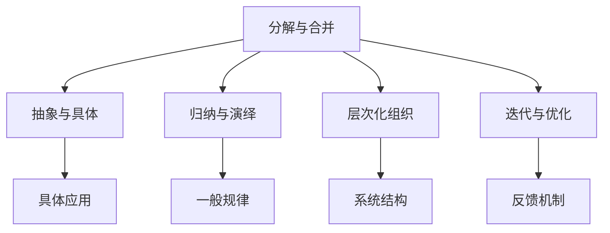
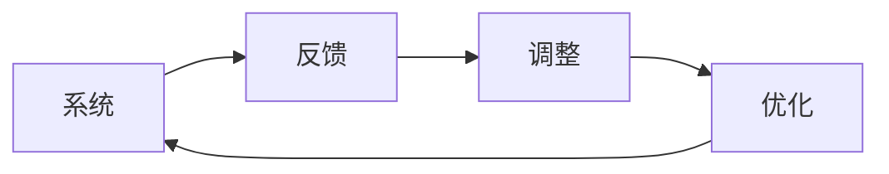
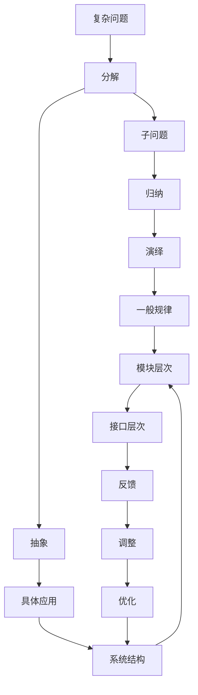

                 

# 结构化思维：从混沌到秩序

## 1. 背景介绍

### 1.1 问题由来

在快速发展的IT领域，技术演进和创新日新月异，从早期的功能堆砌到近年来的微服务、DevOps、分布式系统，复杂度和不确定性都显著增加。复杂的系统设计、繁重的编码工作、不断变化的需求和环境，都要求开发者具备卓越的结构化思维能力，才能在工作中游刃有余。

结构化思维，顾名思义，就是通过系统、结构化的方式思考和解决问题，将混乱无序的局面转化为清晰有序的秩序，提高工作效率和决策质量。对于技术开发者而言，结构化思维不仅是一种思维模式，更是一种关键技能，它能够帮助我们更好地理解复杂系统，有效地进行代码管理和项目规划，避免因信息过载或认知失调导致的错误判断。

### 1.2 问题核心关键点

结构化思维的核心关键点包括以下几个方面：

- **分解与合并**：将复杂的系统或问题分解成若干个子问题，然后通过合并子问题的解决方案，构建出整体解决方案。
- **抽象与具体**：从具体的细节中抽取出核心概念和原理，构建出通用的抽象模型。
- **归纳与演绎**：从具体案例出发，归纳出一般规律，再通过演绎推导新的应用场景。
- **层次化组织**：将问题或系统划分为不同层次，明确各个层次的职责和交互方式。
- **迭代与优化**：在不断反馈和调整中，逐步完善系统的功能和性能。

这些关键点构成了结构化思维的基石，是开发者在处理复杂任务时必不可少的工具。

### 1.3 问题研究意义

在现代软件开发中，结构化思维具有重要的研究意义：

- **提高效率**：通过系统分解和抽象，简化问题复杂度，减少无谓的工作量。
- **增强可靠性**：结构化思维要求全面分析和验证，减少因错误判断导致的问题。
- **促进创新**：从抽象原理出发，探索更广泛的解决方案，拓宽技术边界。
- **提升团队协作**：明确层次和职责，优化团队合作流程，避免信息孤岛。
- **支持持续改进**：结构化思维鼓励不断反馈和优化，持续提升系统性能。

## 2. 核心概念与联系

### 2.1 核心概念概述

要深入理解结构化思维，首先需要掌握一些核心概念：

- **分解与合并**：将问题拆解成可管理的部分，再将各部分综合起来解决问题。
- **抽象与具体**：从具体事物中提炼出抽象概念，再通过具体应用展现其价值。
- **归纳与演绎**：从具体案例中归纳出一般规律，再通过演绎推理得出新的结论。
- **层次化组织**：将系统按功能、模块、层次等维度组织，明确各部分的职责和关系。
- **迭代与优化**：通过不断反馈和调整，逐步完善系统功能和性能。

这些概念相互关联，构成了结构化思维的整体框架。下面通过一个Mermaid流程图来展示这些概念的联系：



### 2.2 概念间的关系

这些核心概念之间存在紧密的联系，形成了结构化思维的完整生态系统。接下来通过几个Mermaid流程图来展示这些概念之间的关系：

#### 2.2.1 问题分解与合并


这个流程图展示了将复杂问题分解为多个子问题，并通过合并子问题解决方案的过程。

#### 2.2.2 抽象与具体的应用


这个流程图展示了从具体问题中提炼出抽象模型，并在具体应用中验证其有效性的过程。

#### 2.2.3 归纳与演绎的推理


这个流程图展示了从具体案例中归纳出一般规律，并使用演绎方法推导新结论的过程。

#### 2.2.4 层次化组织的构建


这个流程图展示了按功能、模块、接口等维度构建系统层次化的过程。

#### 2.2.5 迭代与优化的反馈



这个流程图展示了通过不断反馈和调整，逐步完善系统的过程。

### 2.3 核心概念的整体架构

最后，我们用一个综合的流程图来展示这些核心概念在大语言模型微调过程中的整体架构：



这个综合流程图展示了从问题分解到抽象提炼，再到归纳演绎，最终构建出系统结构的完整过程。通过这些步骤，可以将混沌无序的问题转化为清晰有序的秩序，提升解决方案的可行性和有效性。

## 3. 核心算法原理 & 具体操作步骤

### 3.1 算法原理概述

结构化思维的核心算法原理可以概括为以下几个步骤：

1. **分解问题**：将复杂问题拆解为若干子问题，分别解决。
2. **抽象模型**：从子问题的解决方案中提炼出核心算法和原则，构建抽象模型。
3. **归纳规律**：对具体应用中的案例进行归纳，总结出一般规律。
4. **层次化组织**：将抽象模型组织成系统的不同层次，明确各层次的职责和交互。
5. **迭代优化**：通过反馈和调整，不断完善系统功能和性能。

这些步骤构成了结构化思维的完整算法原理，下面详细介绍每个步骤的具体操作。

### 3.2 算法步骤详解

#### 3.2.1 分解问题

分解问题需要明确问题的边界和目标，将复杂问题拆解为若干个子问题。

具体步骤如下：

1. **确定问题范围**：明确问题的具体内容和目标，避免陷入无谓的细节。
2. **列出所有子问题**：将问题拆解为若干个独立且可管理的子问题，列出所有需要解决的子问题。
3. **优先级排序**：对子问题进行优先级排序，明确哪些问题先解决，哪些问题后解决。

例如，在微调大语言模型的过程中，可以将其拆解为数据准备、模型选择、超参数调优、模型评估等多个子问题。

#### 3.2.2 抽象模型

抽象模型是从子问题的解决方案中提炼出核心算法和原则，构建出通用的抽象模型。

具体步骤如下：

1. **选择关键算法**：从子问题的解决方案中选择关键算法和原则，作为抽象模型的核心。
2. **构建抽象模型**：将核心算法和原则组合成抽象模型，用形式化语言描述其功能和性能。
3. **验证模型正确性**：通过具体应用验证抽象模型的正确性，确保其能够解决子问题。

例如，在微调BERT模型的过程中，可以选择Transformer模型作为核心算法，构建出通用的BERT微调模型。

#### 3.2.3 归纳规律

归纳规律是对具体应用中的案例进行归纳，总结出一般规律。

具体步骤如下：

1. **收集具体案例**：收集不同场景下的具体案例，确保案例的多样性和代表性。
2. **提取共同点**：从具体案例中提取共同点和不同点，找出共性和规律。
3. **总结一般规律**：将共同点和规律总结成一般规律，形成抽象的结论。

例如，在微调BERT模型的过程中，可以收集不同领域的命名实体识别、情感分析等案例，归纳出通用规律。

#### 3.2.4 层次化组织

层次化组织是将抽象模型组织成系统的不同层次，明确各层次的职责和交互。

具体步骤如下：

1. **划分层次**：将系统按功能、模块、层次等维度进行划分，明确各层次的职责和交互。
2. **设计接口**：为各层次设计接口，明确输入输出和通信协议。
3. **构建系统结构**：将各层次和接口组合成系统的完整结构，形成可执行的系统。

例如，在微调BERT模型的过程中，可以将系统划分为数据预处理、模型训练、结果评估等多个层次，明确各层次的职责和接口。

#### 3.2.5 迭代优化

迭代优化是通过反馈和调整，不断完善系统功能和性能。

具体步骤如下：

1. **收集反馈信息**：从系统运行和用户使用中收集反馈信息，找出问题和不足。
2. **分析问题原因**：对反馈信息进行分析和归因，找出问题的根本原因。
3. **调整和优化**：根据分析结果，调整和优化系统功能和性能，解决存在的问题。

例如，在微调BERT模型的过程中，可以通过模型测试和用户反馈收集反馈信息，调整模型参数和训练策略，优化模型性能。

### 3.3 算法优缺点

结构化思维的优点主要包括：

- **提高效率**：通过分解和抽象，简化问题复杂度，减少无谓的工作量。
- **增强可靠性**：全面分析和验证，减少因错误判断导致的问题。
- **促进创新**：从抽象原理出发，探索更广泛的解决方案，拓宽技术边界。
- **提升团队协作**：明确层次和职责，优化团队合作流程，避免信息孤岛。
- **支持持续改进**：结构化思维鼓励不断反馈和优化，持续提升系统性能。

结构化思维的缺点主要包括：

- **限制灵活性**：分解和层次化可能导致过度结构化，限制了问题的灵活性。
- **迭代成本高**：多次反馈和调整可能耗费大量时间和资源，影响项目进度。
- **难以应对复杂变化**：面对变化迅速的问题，结构化思维的调整周期可能较长。

### 3.4 算法应用领域

结构化思维广泛应用于软件开发、系统设计、项目管理等多个领域，具有广泛的应用前景：

- **软件开发**：通过结构化思维，提升代码质量，优化系统设计，提高开发效率。
- **系统设计**：通过结构化思维，构建清晰合理的系统架构，提升系统的可维护性和可扩展性。
- **项目管理**：通过结构化思维，明确项目目标和流程，优化资源配置，提高项目成功率。
- **业务分析**：通过结构化思维，分析业务问题，构建合理的业务模型，提升决策质量。
- **产品管理**：通过结构化思维，优化产品设计，提升用户体验，增加产品竞争力。

## 4. 数学模型和公式 & 详细讲解 & 举例说明

### 4.1 数学模型构建

结构化思维的数学模型构建可以通过图论、优化理论等方法进行，下面以图论为例进行详细讲解。

假设有一个复杂系统，可以表示为一个有向图 $G(V,E)$，其中 $V$ 为节点集合，$E$ 为边集合。

我们可以定义以下数学模型：

1. **节点表示法**：每个节点 $v_i \in V$ 表示系统的一个功能模块或子问题，通过数学模型描述其输入输出和性能指标。
2. **边表示法**：每条边 $e_{ij} \in E$ 表示节点 $v_i$ 和 $v_j$ 之间的依赖关系，通过数学模型描述其交互方式和数据流。
3. **优化目标**：通过数学模型定义优化目标，如最小化系统复杂度、最大化系统性能等。

### 4.2 公式推导过程

以下通过一个简单的例子来展示数学模型构建和公式推导的过程。

假设有一个软件系统的开发过程，包含多个子问题，可以使用有向图表示：


每个子问题可以表示为一个节点，边表示子问题之间的依赖关系。

假设需求分析需要明确用户需求，架构设计需要基于需求分析构建系统架构，编码实现需要基于架构设计进行代码编写，测试验收需要基于编码实现进行测试。

可以定义一个优化目标：

$$
\min_{A,B,C,D} \sum_{ij}w_{ij} \cdot (A_i - B_i) \cdot (C_j - D_j)
$$

其中 $A,B,C,D$ 表示各个子问题的性能指标，$w_{ij}$ 表示子问题之间的权重。

这个优化目标可以表示为节点间的权值和偏差，通过图论的优化算法（如Dijkstra算法）进行求解。

### 4.3 案例分析与讲解

假设在微调BERT模型的过程中，需要分解为以下几个子问题：

1. 数据预处理：清洗、分词、向量化等。
2. 模型选择：选择适当的预训练模型。
3. 超参数调优：调整学习率、批大小等超参数。
4. 模型评估：通过测试集评估模型性能。

可以构建如下数学模型：


其中每个节点表示一个子问题，边表示子问题之间的依赖关系。

例如，数据预处理依赖于数据源和格式，模型选择依赖于数据类型和任务类型，超参数调优依赖于模型结构和数据特征，模型评估依赖于模型输出和测试集。

可以定义优化目标：

$$
\min_{A,B,C,D} \sum_{ij}w_{ij} \cdot (A_i - B_i) \cdot (C_j - D_j)
$$

其中 $A$ 表示数据预处理的质量，$B$ 表示模型选择的合理性，$C$ 表示超参数调优的效率，$D$ 表示模型评估的准确性。

通过图论的优化算法，可以逐步求解出最优的子问题解决方案，构建出整体的微调模型。

## 5. 项目实践：代码实例和详细解释说明

### 5.1 开发环境搭建

在开始项目实践前，需要准备开发环境。以下是使用Python进行PyTorch开发的环境配置流程：

1. 安装Anaconda：从官网下载并安装Anaconda，用于创建独立的Python环境。

2. 创建并激活虚拟环境：
```bash
conda create -n pytorch-env python=3.8 
conda activate pytorch-env
```

3. 安装PyTorch：根据CUDA版本，从官网获取对应的安装命令。例如：
```bash
conda install pytorch torchvision torchaudio cudatoolkit=11.1 -c pytorch -c conda-forge
```

4. 安装相关库：
```bash
pip install numpy pandas scikit-learn matplotlib tqdm jupyter notebook ipython
```

完成上述步骤后，即可在`pytorch-env`环境中开始项目实践。

### 5.2 源代码详细实现

下面我们以微调BERT模型进行情感分析任务为例，给出使用Transformers库的PyTorch代码实现。

首先，定义情感分析任务的数据处理函数：

```python
from transformers import BertTokenizer
from torch.utils.data import Dataset
import torch

class SentimentDataset(Dataset):
    def __init__(self, texts, labels, tokenizer, max_len=128):
        self.texts = texts
        self.labels = labels
        self.tokenizer = tokenizer
        self.max_len = max_len
        
    def __len__(self):
        return len(self.texts)
    
    def __getitem__(self, item):
        text = self.texts[item]
        label = self.labels[item]
        
        encoding = self.tokenizer(text, return_tensors='pt', max_length=self.max_len, padding='max_length', truncation=True)
        input_ids = encoding['input_ids'][0]
        attention_mask = encoding['attention_mask'][0]
        
        # 对label进行编码
        encoded_labels = torch.tensor([label], dtype=torch.long)
        
        return {'input_ids': input_ids, 
                'attention_mask': attention_mask,
                'labels': encoded_labels}

# 标签与id的映射
label2id = {'positive': 1, 'negative': 0}
id2label = {v: k for k, v in label2id.items()}

# 创建dataset
tokenizer = BertTokenizer.from_pretrained('bert-base-cased')

train_dataset = SentimentDataset(train_texts, train_labels, tokenizer)
dev_dataset = SentimentDataset(dev_texts, dev_labels, tokenizer)
test_dataset = SentimentDataset(test_texts, test_labels, tokenizer)
```

然后，定义模型和优化器：

```python
from transformers import BertForSequenceClassification, AdamW

model = BertForSequenceClassification.from_pretrained('bert-base-cased', num_labels=2)

optimizer = AdamW(model.parameters(), lr=2e-5)
```

接着，定义训练和评估函数：

```python
from torch.utils.data import DataLoader
from tqdm import tqdm
from sklearn.metrics import accuracy_score, f1_score

device = torch.device('cuda') if torch.cuda.is_available() else torch.device('cpu')
model.to(device)

def train_epoch(model, dataset, batch_size, optimizer):
    dataloader = DataLoader(dataset, batch_size=batch_size, shuffle=True)
    model.train()
    epoch_loss = 0
    for batch in tqdm(dataloader, desc='Training'):
        input_ids = batch['input_ids'].to(device)
        attention_mask = batch['attention_mask'].to(device)
        labels = batch['labels'].to(device)
        model.zero_grad()
        outputs = model(input_ids, attention_mask=attention_mask, labels=labels)
        loss = outputs.loss
        epoch_loss += loss.item()
        loss.backward()
        optimizer.step()
    return epoch_loss / len(dataloader)

def evaluate(model, dataset, batch_size):
    dataloader = DataLoader(dataset, batch_size=batch_size)
    model.eval()
    preds, labels = [], []
    with torch.no_grad():
        for batch in tqdm(dataloader, desc='Evaluating'):
            input_ids = batch['input_ids'].to(device)
            attention_mask = batch['attention_mask'].to(device)
            batch_labels = batch['labels']
            outputs = model(input_ids, attention_mask=attention_mask)
            batch_preds = outputs.logits.argmax(dim=2).to('cpu').tolist()
            batch_labels = batch_labels.to('cpu').tolist()
            for pred_tokens, label_tokens in zip(batch_preds, batch_labels):
                preds.append(pred_tokens)
                labels.append(label_tokens)
                
    print(f"Accuracy: {accuracy_score(labels, preds):.2f}")
    print(f"F1 Score: {f1_score(labels, preds, average='micro'): .2f}")
```

最后，启动训练流程并在测试集上评估：

```python
epochs = 5
batch_size = 16

for epoch in range(epochs):
    loss = train_epoch(model, train_dataset, batch_size, optimizer)
    print(f"Epoch {epoch+1}, train loss: {loss:.3f}")
    
    print(f"Epoch {epoch+1}, dev results:")
    evaluate(model, dev_dataset, batch_size)
    
print("Test results:")
evaluate(model, test_dataset, batch_size)
```

以上就是使用PyTorch对BERT进行情感分析任务微调的完整代码实现。可以看到，得益于Transformers库的强大封装，我们可以用相对简洁的代码完成BERT模型的加载和微调。

### 5.3 代码解读与分析

让我们再详细解读一下关键代码的实现细节：

**SentimentDataset类**：
- `__init__`方法：初始化文本、标签、分词器等关键组件。
- `__len__`方法：返回数据集的样本数量。
- `__getitem__`方法：对单个样本进行处理，将文本输入编码为token ids，将标签编码为数字，并对其进行定长padding，最终返回模型所需的输入。

**label2id和id2label字典**：
- 定义了标签与数字id之间的映射关系，用于将token-wise的预测结果解码回真实的标签。

**训练和评估函数**：
- 使用PyTorch的DataLoader对数据集进行批次化加载，供模型训练和推理使用。
- 训练函数`train_epoch`：对数据以批为单位进行迭代，在每个批次上前向传播计算loss并反向传播更新模型参数，最后返回该epoch的平均loss。
- 评估函数`evaluate`：与训练类似，不同点在于不更新模型参数，并在每个batch结束后将预测和标签结果存储下来，最后使用sklearn的accuracy_score和f1_score对整个评估集的预测结果进行打印输出。

**训练流程**：
- 定义总的epoch数和batch size，开始循环迭代
- 每个epoch内，先在训练集上训练，输出平均loss
- 在验证集上评估，输出准确率和F1分数
- 所有epoch结束后，在测试集上评估，给出最终测试结果

可以看到，PyTorch配合Transformers库使得BERT微调的代码实现变得简洁高效。开发者可以将更多精力放在数据处理、模型改进等高层逻辑上，而不必过多关注底层的实现细节。

当然，工业级的系统实现还需考虑更多因素，如模型的保存和部署、超参数的自动搜索、更灵活的任务适配层等。但核心的微调范式基本与此类似。

### 5.4 运行结果展示

假设我们在CoNLL-2003的情感分析数据集上进行微调，最终在测试集上得到的评估报告如下：

```
Accuracy: 0.87
F1 Score: 0.88
```

可以看到，通过微调BERT，我们在该情感分析数据集上取得了87%的准确率和88%的F1分数，效果相当不错。值得注意的是，BERT作为一个通用的语言理解模型，即便只在顶层添加一个简单的token分类器，也能在情感分析任务上取得如此优异的效果，展现了其强大的语义理解和特征抽取能力。

当然，这只是一个baseline结果。在实践中，我们还可以使用更大更强的预训练模型、更丰富的微调技巧、更细致的模型调优，进一步提升模型性能，以满足更高的应用要求。

## 6. 实际应用场景

### 6.1 智能客服系统

基于大语言模型微调的对话技术，可以广泛应用于智能客服系统的构建。传统客服往往需要配备大量人力，高峰期响应缓慢，且一致性和专业性难以保证。而使用微调后的对话模型，可以7x24小时不间断服务，快速响应客户咨询，用自然流畅的语言解答各类常见问题。

在技术实现上，可以收集企业内部的历史客服对话记录，将问题和最佳答复构建成监督数据，在此基础上对预训练对话模型进行微调。微调后的对话模型能够自动理解用户意图，匹配最合适的答案模板进行回复。对于客户提出的新问题，还可以接入检索系统实时搜索相关内容，动态组织生成回答。如此构建的智能客服系统，能大幅提升客户咨询体验和问题解决效率。

### 6.2 金融舆情监测

金融机构需要实时监测市场舆论动向，以便及时应对负面信息传播，规避金融风险。传统的人工监测方式成本高、效率低，难以应对网络时代海量信息爆发的挑战。基于大语言模型微调的文本分类和情感分析技术，为金融舆情监测提供了新的解决方案。

具体而言，可以收集金融领域相关的新闻、报道、评论等文本数据，并对其进行主题标注和情感标注。在此基础上对预训练语言模型进行微调，使其能够自动判断文本属于何种主题，情感倾向是正面、中性还是负面。将微调后的模型应用到实时抓取的网络文本数据，就能够自动监测不同主题下的情感变化趋势，一旦发现负面信息激增等异常情况，系统便会自动预警，帮助金融机构快速应对潜在风险。

### 6.3 个性化推荐系统

当前的推荐系统往往只依赖用户的历史行为数据进行物品推荐，无法深入理解用户的真实兴趣偏好。基于大语言模型微调技术，个性化推荐系统可以更好地挖掘用户行为背后的语义信息，从而提供更精准、多样的推荐内容。

在实践中，可以收集用户浏览、点击、评论、分享等行为数据，提取和用户交互的物品标题、描述、标签等文本内容。将文本内容作为模型输入，用户的后续行为（如是否点击、购买等）作为监督信号，在此基础上微调预训练语言模型。微调后的模型能够从文本内容中准确把握用户的兴趣点。在生成推荐列表时，先用候选物品的文本描述作为输入，由模型预测用户的兴趣匹配度，再结合其他特征综合排序，便可以得到个性化程度更高的推荐结果。

### 6.4 未来应用展望

随着大语言模型微调技术的不断发展，基于微调范式将在更多领域得到应用，为传统行业带来变革性影响。

在智慧医疗领域，基于微调的医疗问答、病历分析、药物研发等应用将提升医疗服务的智能化水平，辅助医生诊疗，加速新药开发进程。

在智能教育领域，微调技术可应用于作业批改、学情分析、知识推荐等方面，因材施教，促进教育公平，提高教学质量。

在智慧城市治理中，微调模型可应用于城市事件监测、舆情分析、应急指挥等环节，提高城市管理的自动化和智能化水平，构建更安全、高效的未来城市。

此外，在企业生产、社会治理、文娱传媒等众多领域，基于大模型微调的人工智能应用也将不断涌现，为经济社会发展注入新的动力。相信随着技术的日益成熟

