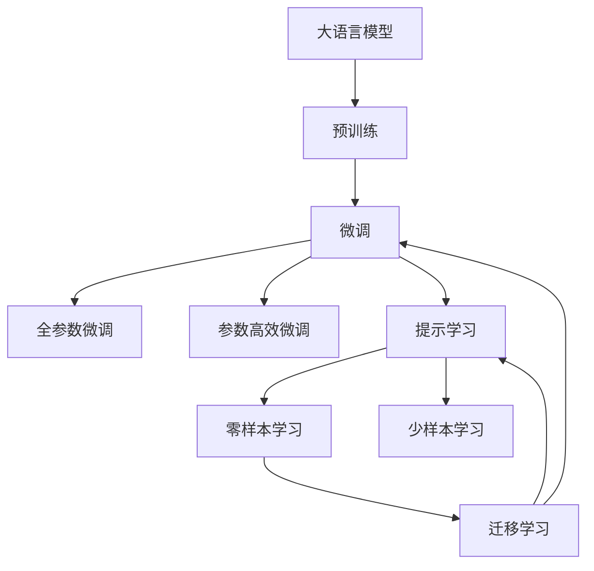

                 

# 美国大模型公司的现状与未来

大语言模型（Large Language Models, LLMs）已经成为人工智能领域的新高地，推动了自然语言处理（NLP）和机器学习技术的飞速发展。美国几家巨头公司在这一领域具有领先地位，包括OpenAI、Google、Microsoft等。本文将深入探讨这些公司在大模型领域的现状与未来发展趋势，并从多个角度分析其技术突破、商业模式和面临的挑战。

## 1. 背景介绍

### 1.1 大模型公司的发展历程

自2018年Google首次公开Transformer模型以来，大模型技术迅速成为人工智能领域的热点。OpenAI的GPT系列、Google的BERT、Microsoft的T5等模型相继问世，并在各种NLP任务上取得了令人瞩目的成果。这些公司不仅在学术界取得了重大突破，还在产业界落地应用，推动了智能客服、翻译、推荐系统等多个领域的创新。

### 1.2 大模型公司的技术路线

大模型公司的技术路线主要分为两类：

- **自研模型**：如OpenAI的GPT-3、Google的BERT等，这些公司投入大量资源自主研发模型，通过大规模预训练和微调，提升模型性能。
- **基于开源模型**：如Microsoft的T5、Amazon的TALARO等，这些公司利用开源社区的成果，进行微调或优化，快速进入市场。

## 2. 核心概念与联系

### 2.1 核心概念概述

为了更好地理解美国大模型公司的现状与未来，我们先介绍几个核心概念：

- **大语言模型（LLMs）**：以Transformer为代表的基于深度学习的语言模型，通过大规模无标签数据进行预训练，学习语言表征，具备通用语言理解和生成能力。
- **预训练（Pre-training）**：通过自监督学习任务对大模型进行训练，使其学习到语言的一般规律和知识。
- **微调（Fine-tuning）**：将预训练模型应用于特定任务，通过有监督学习优化模型性能。
- **迁移学习（Transfer Learning）**：通过预训练模型在不同任务间的知识迁移，提升模型的泛化能力。
- **参数高效微调（Parameter-Efficient Fine-Tuning, PEFT）**：只更新模型中的少量参数，以提高微调效率，避免过拟合。
- **提示学习（Prompt Learning）**：通过精心设计的提示模板，引导模型进行特定任务的推理和生成，减少微调参数。

### 2.2 概念间的关系

这些核心概念构成了大模型公司的技术基础，其间的联系可通过以下Mermaid流程图展示：



这个流程图展示了从预训练到微调再到提示学习的过程，以及它们之间的联系和交互。大模型公司通过这些技术手段，不断优化和提升模型的性能，以满足各种实际需求。

## 3. 核心算法原理 & 具体操作步骤

### 3.1 算法原理概述

大模型公司的核心算法原理主要围绕预训练和微调展开。以Google的BERT为例，其预训练过程涉及两个主要任务：掩码语言模型（Masked Language Modeling, MLM）和下一句预测（Next Sentence Prediction, NSP）。掩码语言模型旨在预测被遮盖的词，下一句预测则用于判断两个句子是否连续。这两个任务通过多层自注意力机制进行建模，学习到词与词之间的关系和句子结构。

在微调过程中，大模型公司会根据特定任务的需求，在预训练模型上添加任务相关的输出层和损失函数。例如，在文本分类任务中，会添加一个线性分类器和一个交叉熵损失函数，以优化模型对不同类别的分类性能。

### 3.2 算法步骤详解

大模型公司的微调步骤主要包括以下几个环节：

1. **数据准备**：收集和预处理任务所需的数据集，划分为训练集、验证集和测试集。
2. **模型选择**：选择合适的预训练模型，如BERT、GPT等。
3. **微调设计**：根据任务类型，设计适当的任务适配层和损失函数。
4. **超参数设置**：选择合适的优化器（如AdamW）、学习率、批大小、迭代轮数等。
5. **模型训练**：在训练集上进行前向传播和反向传播，更新模型参数。
6. **验证与调优**：在验证集上评估模型性能，根据性能指标调整模型参数。
7. **测试与部署**：在测试集上评估微调后模型的性能，部署到实际应用系统中。

### 3.3 算法优缺点

大模型公司的微调方法具有以下优点：

- **高效**：相比从头训练，微调可以大幅减少时间和资源投入。
- **灵活**：微调模型可以适应各种下游任务，只需调整顶层结构。
- **泛化能力强**：通过迁移学习，大模型具备较好的跨领域泛化能力。

然而，这些方法也存在以下缺点：

- **依赖标注数据**：微调性能很大程度上取决于标注数据的质量和数量。
- **过拟合风险**：在标注数据较少的情况下，容易发生过拟合。
- **模型复杂度高**：大模型通常包含大量参数，推理速度较慢。

### 3.4 算法应用领域

大模型公司的微调方法在众多领域得到了广泛应用，包括：

- **自然语言处理（NLP）**：文本分类、命名实体识别、关系抽取、问答系统等。
- **计算机视觉（CV）**：图像分类、目标检测、图像生成等。
- **语音识别**：语音转文本、语音生成等。
- **推荐系统**：个性化推荐、广告投放等。
- **对话系统**：智能客服、虚拟助手等。

## 4. 数学模型和公式 & 详细讲解 & 举例说明

### 4.1 数学模型构建

以BERT为例，其预训练模型可以表示为：

$$
M_{\theta} = \text{Transformer}(\text{MLM}, \text{NSP})
$$

其中，$\theta$ 表示模型参数。在微调过程中，添加适当的输出层和损失函数，如：

$$
\ell = -\frac{1}{N} \sum_{i=1}^N \ell(x_i, y_i)
$$

其中，$\ell$ 为损失函数，$x_i$ 和 $y_i$ 分别为输入和标签。

### 4.2 公式推导过程

BERT的预训练过程包含掩码语言模型和下一句预测两个任务，其公式推导过程如下：

**掩码语言模型任务**：

$$
\mathcal{L}_{\text{MLM}} = -\frac{1}{N} \sum_{i=1}^N \log p(y_i | x_i)
$$

其中，$p(y_i | x_i)$ 表示模型对 $y_i$ 的预测概率。

**下一句预测任务**：

$$
\mathcal{L}_{\text{NSP}} = -\frac{1}{N} \sum_{i=1}^N \log p(x_{i+1} | x_i, x_{i+2})
$$

其中，$x_{i+1}$ 和 $x_{i+2}$ 分别为 $x_i$ 的前后两个句子。

### 4.3 案例分析与讲解

以情感分析任务为例，可以采用BERT进行微调。训练过程如下：

1. **数据准备**：收集情感标注数据集，划分为训练集、验证集和测试集。
2. **模型选择**：使用预训练的BERT模型。
3. **微调设计**：添加一个线性分类器和一个交叉熵损失函数。
4. **超参数设置**：设置优化器、学习率、批大小、迭代轮数等。
5. **模型训练**：在训练集上进行前向传播和反向传播，更新模型参数。
6. **验证与调优**：在验证集上评估模型性能，调整模型参数。
7. **测试与部署**：在测试集上评估微调后模型的性能，部署到实际应用系统中。

## 5. 项目实践：代码实例和详细解释说明

### 5.1 开发环境搭建

在搭建开发环境时，需要考虑以下因素：

1. **Python版本**：推荐使用Python 3.8或更高版本。
2. **深度学习框架**：建议使用TensorFlow或PyTorch。
3. **深度学习库**：建议使用TensorFlow或PyTorch配套的深度学习库。
4. **预训练模型**：可以从HuggingFace或OpenAI等平台获取预训练模型。
5. **数据集准备**：收集和预处理数据集，确保数据集的标注质量和多样性。

### 5.2 源代码详细实现

以下是一个基于BERT进行情感分析任务微调的代码实现示例：

```python
import tensorflow as tf
from transformers import BertTokenizer, BertForSequenceClassification
import pandas as pd
import numpy as np
from sklearn.model_selection import train_test_split
from tensorflow.keras.preprocessing.sequence import pad_sequences

# 数据准备
df = pd.read_csv('data.csv')
df.head()

# 划分训练集和验证集
train_texts, valid_texts, train_labels, valid_labels = train_test_split(df['text'], df['label'], test_size=0.2, random_state=42)

# 分词器
tokenizer = BertTokenizer.from_pretrained('bert-base-uncased')

# 编码
train_encodings = tokenizer(train_texts.tolist(), truncation=True, padding=True, max_length=128)
valid_encodings = tokenizer(valid_texts.tolist(), truncation=True, padding=True, max_length=128)

# 标签编码
train_labels = np.array(train_labels)
valid_labels = np.array(valid_labels)

# 编码转换
train_labels = tf.keras.utils.to_categorical(train_labels, num_classes=2)
valid_labels = tf.keras.utils.to_categorical(valid_labels, num_classes=2)

# 序列填充
train_inputs, train_masks, train_labels = pad_sequences(train_encodings.input_ids, padding='post'), pad_sequences(train_encodings.attention_mask, padding='post'), train_labels
valid_inputs, valid_masks, valid_labels = pad_sequences(valid_encodings.input_ids, padding='post'), pad_sequences(valid_encodings.attention_mask, padding='post'), valid_labels

# 模型构建
model = BertForSequenceClassification.from_pretrained('bert-base-uncased', num_labels=2, output_attentions=False)

# 优化器
optimizer = tf.keras.optimizers.Adam(learning_rate=2e-5)

# 模型编译
model.compile(optimizer=optimizer, loss=tf.keras.losses.CategoricalCrossentropy(), metrics=['accuracy'])

# 模型训练
history = model.fit(train_inputs, train_labels, validation_data=(valid_inputs, valid_labels), epochs=3, batch_size=32)

# 测试与评估
test_texts = pd.read_csv('test.csv')['text'].tolist()
test_encodings = tokenizer(test_texts, truncation=True, padding=True, max_length=128)
test_inputs, test_masks = pad_sequences(test_encodings.input_ids, padding='post'), pad_sequences(test_encodings.attention_mask, padding='post')

test_labels = model.predict(test_inputs)
```

### 5.3 代码解读与分析

在上述代码中，我们首先使用Pandas库加载数据集，并划分为训练集和验证集。然后，使用BertTokenizer对文本进行编码，并转换为模型所需的格式。接着，使用TensorFlow库构建模型，并定义优化器和损失函数。最后，使用fit方法进行模型训练，并在测试集上进行评估。

## 6. 实际应用场景

### 6.1 智能客服

智能客服系统是大模型公司的重要应用之一。例如，Google的Dialogflow就是基于BERT构建的对话模型，可以理解用户的意图并提供相应的回答。通过微调，模型可以适应各种特定场景的对话需求。

### 6.2 金融舆情监测

金融舆情监测是大模型公司在金融领域的重要应用。例如，TALARO模型可以对金融新闻进行情感分析，及时发现市场情绪变化。通过微调，模型可以进一步提升情感分析的准确性和实时性。

### 6.3 推荐系统

推荐系统是大模型公司在电商和内容平台的重要应用。例如，Amazon的推荐系统就使用了TALARO模型，通过对用户评论的情感分析，推荐最适合的商品。通过微调，模型可以进一步提升推荐的个性化和多样性。

### 6.4 未来应用展望

大模型公司未来的应用前景非常广阔，涉及更多行业和领域。例如：

- **医疗健康**：通过自然语言处理技术，提取和分析电子病历、医学文献等数据，辅助医生诊断和治疗。
- **智能制造**：通过自然语言处理技术，自动化分析和优化生产流程，提升生产效率和质量。
- **智能家居**：通过自然语言处理技术，实现语音控制和自然对话，提升家庭生活的便利性和舒适性。
- **智能交通**：通过自然语言处理技术，提取和分析交通数据，优化交通管理和决策。

## 7. 工具和资源推荐

### 7.1 学习资源推荐

1. **HuggingFace官方文档**：提供丰富的预训练模型和微调样例，帮助开发者快速上手。
2. **OpenAI官方博客**：分享最新的研究成果和应用案例，开拓视野。
3. **Google AI博客**：分享Google在大模型领域的最新进展和技术突破。
4. **Microsoft Research博客**：分享Microsoft在NLP和机器学习领域的最新研究成果。

### 7.2 开发工具推荐

1. **TensorFlow**：Google开发的深度学习框架，支持多种模型和算法的实现。
2. **PyTorch**：Facebook开发的深度学习框架，灵活易用，适合科研和工程开发。
3. **Jupyter Notebook**：交互式编程环境，方便调试和展示代码。
4. **GitHub**：代码托管平台，方便版本控制和协作开发。
5. **Weights & Biases**：模型训练的实验跟踪工具，方便调试和优化。

### 7.3 相关论文推荐

1. **Attention is All You Need**：Transformer模型的原始论文，奠定了大模型技术的基础。
2. **BERT: Pre-training of Deep Bidirectional Transformers for Language Understanding**：BERT模型的原始论文，开创了大规模预训练模型的新纪元。
3. **T5: Explainability-Seeking Pre-training for Generative Pre-trained Transformer**：T5模型的原始论文，展示了预训练和微调相结合的优势。
4. **AdaLoRA: Adaptive Low-Rank Adaptation for Parameter-Efficient Fine-Tuning**：AdaLoRA算法的论文，展示了参数高效微调的新方法。
5. **Prompt-Tuning: Optimizing Continuous Prompts for Generation**：Prompt-Tuning算法的论文，展示了少样本学习的新思路。

## 8. 总结：未来发展趋势与挑战

### 8.1 研究成果总结

大模型公司通过预训练和微调技术，在自然语言处理、计算机视觉、推荐系统等多个领域取得了显著突破。未来，这些公司将继续深化技术研究，推动人工智能技术的产业化应用。

### 8.2 未来发展趋势

1. **模型规模增大**：随着算力成本的下降和数据规模的扩张，预训练模型的参数量将持续增长。超大模型的训练和推理效率将得到进一步提升。
2. **微调方法多样**：除了传统的全参数微调，未来将涌现更多参数高效和计算高效的微调方法，进一步降低微调成本。
3. **跨领域应用拓展**：大模型公司将进一步拓展模型的应用领域，推动人工智能技术在更多垂直行业落地。
4. **模型可解释性增强**：未来的模型将具备更强的可解释性，帮助开发者和用户更好地理解模型的决策过程。

### 8.3 面临的挑战

1. **标注数据依赖**：微调性能仍依赖高质量标注数据，获取标注数据成本高、周期长，是大模型公司面临的重要挑战。
2. **模型鲁棒性不足**：大模型在面对新数据时，泛化性能往往较差，容易发生灾难性遗忘。
3. **计算资源瓶颈**：超大模型的训练和推理需要大量计算资源，如何优化资源使用是大模型公司需要解决的问题。
4. **模型可解释性不足**：当前模型往往缺乏可解释性，难以理解其内部机制和决策过程，需要进一步提高模型的可解释性。

### 8.4 研究展望

1. **探索无监督和半监督微调方法**：通过自监督学习、主动学习等方法，降低对标注数据的依赖，实现更加高效和灵活的微调。
2. **开发参数高效和计算高效的微调方法**：减少微调过程中的参数和计算量，提升微调的效率和效果。
3. **结合因果分析和博弈论工具**：通过因果分析和博弈论方法，增强模型的稳定性和鲁棒性。
4. **纳入伦理道德约束**：在模型训练和应用过程中，加入伦理道德约束，避免偏见和有害信息的输出。

## 9. 附录：常见问题与解答

**Q1：大模型公司如何保持技术领先地位？**

A: 大模型公司通过以下几个方面保持技术领先地位：

- **持续投入研发**：大模型公司持续投入大量资源进行模型研发，如Google的BERT、OpenAI的GPT系列等。
- **合作与开源**：通过合作和开源，推动技术进步和普及。例如，Google的T5模型就开放了代码和预训练模型，推动了自然语言处理技术的发展。
- **跨学科融合**：结合计算机科学、数学、统计学等多个学科，提升模型的表现和应用范围。

**Q2：大模型公司在应用过程中需要注意哪些问题？**

A: 大模型公司在应用过程中需要注意以下几个问题：

- **数据质量**：确保数据标注质量和多样性，避免模型过拟合。
- **模型鲁棒性**：提高模型的泛化能力和鲁棒性，避免在特定数据集上的过拟合。
- **计算资源优化**：优化模型的计算资源使用，提升训练和推理效率。
- **可解释性和公平性**：提升模型的可解释性，避免模型偏见和有害信息。

**Q3：未来大模型公司的竞争格局将如何变化？**

A: 未来大模型公司的竞争格局将发生以下变化：

- **技术创新**：技术创新将成为竞争的关键，谁能率先推出更先进的模型和算法，谁将在市场中获得优势。
- **应用场景扩展**：大模型公司将进一步拓展应用场景，推动人工智能技术在更多领域落地。
- **合作与竞争并存**：大模型公司之间既有合作又有竞争，通过合作推动技术进步，通过竞争推动市场份额增长。

总之，大模型公司通过持续的技术创新和应用拓展，将继续引领人工智能技术的发展。然而，面临的挑战也不可忽视，需要通过跨学科合作、数据质量控制、资源优化等手段，推动人工智能技术的发展。

