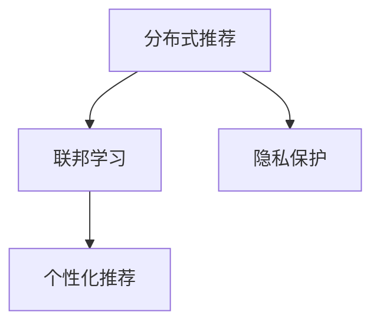
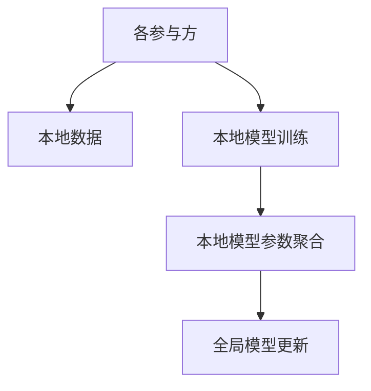
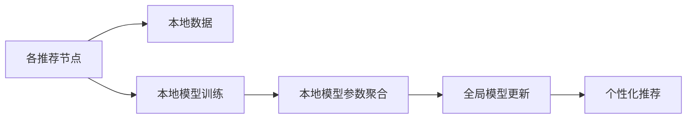
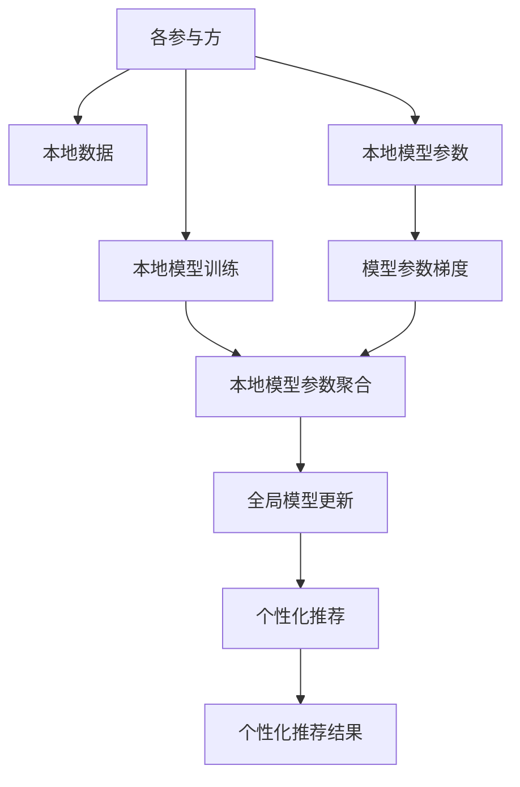
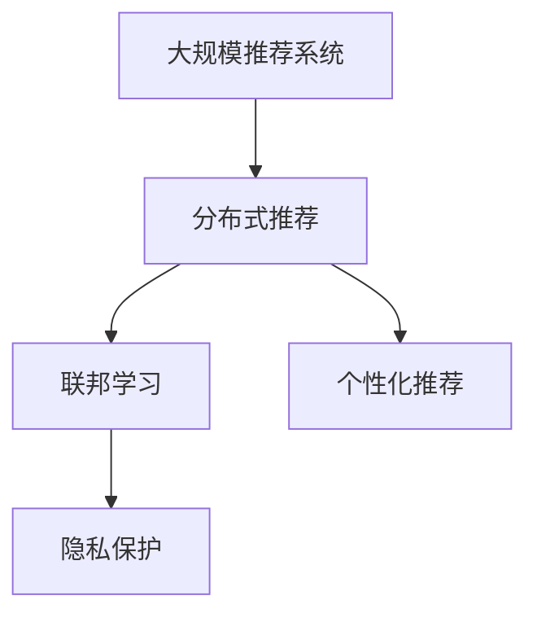

                 

# 联邦学习在推荐系统中的实践

> 关键词：联邦学习, 推荐系统, 分布式推荐, 隐私保护, 个性化推荐

## 1. 背景介绍

### 1.1 问题由来
推荐系统是现代信息科技领域的一个重要分支，旨在通过数据分析和算法优化，为用户推荐最符合其兴趣和需求的内容。推荐系统广泛应用于电商、社交媒体、视频平台、音乐服务等在线业务中，影响着用户的消费决策和平台的用户体验。

然而，推荐系统也面临着诸多挑战。首先，随着用户数量的激增和数据量的膨胀，集中式推荐的资源消耗和存储成本不断上升，难以应对海量数据处理的需求。其次，用户隐私保护和数据安全成为关注的焦点，集中式推荐的中心化架构难以有效保护用户隐私，存在数据泄露和滥用的风险。最后，推荐系统推荐效果的好坏依赖于对用户兴趣和行为的深入理解，集中式推荐难以高效获取分布式用户数据。

为应对这些挑战，联邦学习（Federated Learning）应运而生。联邦学习是一种分布式机器学习范式，通过分散在各参与方的数据计算资源进行本地模型训练，并定期将本地模型参数进行聚合，从而实现全局模型的更新。

### 1.2 问题核心关键点
联邦学习在推荐系统中的应用，旨在通过分散在各参与方（如用户终端、商家平台、内容提供商等）的数据计算资源进行本地推荐模型训练，从而实现全局模型的更新，提升推荐系统的个性化推荐能力。核心关键点包括：

- 分散计算：各参与方仅在本地数据上进行模型训练，避免集中式训练的资源和隐私问题。
- 聚合更新：定期将本地模型参数进行聚合，更新全局模型，实现全局模型参数的优化。
- 隐私保护：各参与方仅传递模型参数梯度，不共享原始数据，保障用户隐私安全。
- 个性化推荐：通过联邦学习的方式，各参与方能够高效利用本地用户数据，提升推荐系统的个性化推荐效果。

### 1.3 问题研究意义
联邦学习在推荐系统中的应用，能够解决传统推荐系统面临的诸多挑战，具有重要的研究意义：

- 提高推荐效果：联邦学习能够充分利用各参与方的本地数据，提升全局推荐模型的个性化推荐效果。
- 保障用户隐私：联邦学习通过模型参数的聚合和更新，避免了集中式训练中的数据泄露风险，保障用户隐私。
- 降低资源消耗：联邦学习在各参与方本地计算，避免了集中式训练的资源消耗和存储成本。
- 强化推荐系统的泛化能力：联邦学习在多个参与方之间进行模型参数的交换，有助于提升推荐系统的泛化能力，避免过拟合。
- 推动推荐系统的商业应用：联邦学习有助于构建更加安全、高效、可扩展的推荐系统，推动其在电商、社交媒体等在线业务中的应用。

## 2. 核心概念与联系

### 2.1 核心概念概述

为更好地理解联邦学习在推荐系统中的应用，本节将介绍几个密切相关的核心概念：

- 联邦学习（Federated Learning）：一种分布式机器学习范式，各参与方在本地数据上进行模型训练，并定期将本地模型参数进行聚合，更新全局模型。
- 分布式推荐（Distributed Recommendation）：推荐系统的一种分布式实现方式，各推荐节点在本地数据上进行推荐模型训练，并定期将本地模型参数进行聚合，更新全局模型。
- 隐私保护（Privacy Protection）：联邦学习通过模型参数的聚合和更新，避免数据泄露，保障用户隐私安全。
- 个性化推荐（Personalized Recommendation）：推荐系统通过学习用户行为和兴趣，为用户提供最符合其需求的推荐内容。

这些核心概念之间的逻辑关系可以通过以下Mermaid流程图来展示：



这个流程图展示了大规模推荐系统的基本架构，各组件之间的逻辑关系如下：

1. 分布式推荐：各推荐节点在本地数据上进行推荐模型训练。
2. 联邦学习：定期将本地模型参数进行聚合，更新全局模型。
3. 隐私保护：各推荐节点仅传递模型参数梯度，不共享原始数据。
4. 个性化推荐：通过全局模型更新，提升推荐系统的个性化推荐效果。

### 2.2 概念间的关系

这些核心概念之间存在着紧密的联系，形成了联邦学习在推荐系统中的应用框架。下面我通过几个Mermaid流程图来展示这些概念之间的关系。

#### 2.2.1 联邦学习的分布式架构



这个流程图展示了联邦学习的分布式架构，各参与方在本地数据上进行模型训练，定期将本地模型参数进行聚合，更新全局模型。

#### 2.2.2 分布式推荐的过程



这个流程图展示了分布式推荐的过程，各推荐节点在本地数据上进行推荐模型训练，定期将本地模型参数进行聚合，更新全局模型，从而实现个性化推荐。

#### 2.2.3 联邦学习的数据流动



这个流程图展示了联邦学习的数据流动过程，各参与方仅传递模型参数梯度，不共享原始数据，保障了用户隐私。

### 2.3 核心概念的整体架构

最后，我们用一个综合的流程图来展示这些核心概念在大规模推荐系统中的整体架构：



这个综合流程图展示了从分布式推荐到联邦学习，再到个性化推荐的全过程。大规模推荐系统通过分布式推荐，在各推荐节点上进行本地模型训练，通过联邦学习的方式定期将本地模型参数进行聚合，更新全局模型，最终实现个性化推荐。

## 3. 核心算法原理 & 具体操作步骤
### 3.1 算法原理概述

联邦学习在推荐系统中的应用，主要通过分散在各参与方的本地数据计算资源进行本地推荐模型训练，并定期将本地模型参数进行聚合，更新全局模型。其核心思想是：

- 数据本地化：各推荐节点仅在本地数据上进行推荐模型训练，避免集中式训练的资源和隐私问题。
- 参数聚合：各推荐节点定期将本地模型参数进行聚合，更新全局模型，实现全局模型参数的优化。
- 隐私保护：各推荐节点仅传递模型参数梯度，不共享原始数据，保障用户隐私安全。

联邦学习的推荐算法通常包括以下几个步骤：

1. 本地模型训练：各推荐节点在本地数据集上训练本地推荐模型，生成本地模型参数。
2. 参数聚合：各推荐节点将本地模型参数传递给中心服务器进行聚合，生成全局模型参数。
3. 全局模型更新：中心服务器基于聚合后的全局模型参数，更新全局推荐模型。
4. 本地模型更新：各推荐节点基于全局模型参数，更新本地推荐模型。
5. 循环迭代：重复上述步骤，直到全局模型收敛或达到预设迭代次数。

### 3.2 算法步骤详解

以下详细介绍联邦学习在推荐系统中的详细步骤：

**Step 1: 数据准备**
- 将推荐数据集划分到各推荐节点上，确保各节点数据分布均衡。
- 各推荐节点保留本地数据副本，不共享原始数据。

**Step 2: 模型初始化**
- 各推荐节点在本地数据集上初始化本地推荐模型。

**Step 3: 本地模型训练**
- 各推荐节点在本地数据集上，使用本地模型进行推荐模型训练，生成本地模型参数。

**Step 4: 参数聚合**
- 各推荐节点将本地模型参数传递给中心服务器进行聚合，生成全局模型参数。

**Step 5: 全局模型更新**
- 中心服务器基于聚合后的全局模型参数，更新全局推荐模型。

**Step 6: 本地模型更新**
- 各推荐节点基于全局模型参数，更新本地推荐模型。

**Step 7: 迭代训练**
- 重复Step 3-6，直到全局模型收敛或达到预设迭代次数。

### 3.3 算法优缺点

联邦学习在推荐系统中的应用，具有以下优点：

- 分布式计算：各推荐节点在本地数据上进行推荐模型训练，避免集中式训练的资源和隐私问题。
- 数据隐私：各推荐节点仅传递模型参数梯度，不共享原始数据，保障用户隐私安全。
- 可扩展性：联邦学习能够高效利用各参与方的本地数据，提升推荐系统的可扩展性。

同时，联邦学习在推荐系统中也存在一些缺点：

- 模型收敛速度较慢：由于各推荐节点的本地模型参数需要进行聚合更新，导致全局模型收敛速度较慢。
- 模型参数不一致：由于各推荐节点的本地数据和本地模型训练方式不同，可能存在模型参数不一致的问题。
- 通信开销较大：各推荐节点需要定期将本地模型参数传递给中心服务器，通信开销较大。
- 隐私保护难度较大：尽管联邦学习能够保障用户隐私，但各推荐节点之间需要进行频繁的模型参数交换，隐私保护难度较大。

### 3.4 算法应用领域

联邦学习在推荐系统中的应用，主要涵盖以下领域：

- 电商推荐：通过联邦学习的方式，各电商平台可以在本地用户数据上进行推荐模型训练，提升推荐系统的个性化推荐效果。
- 视频推荐：通过联邦学习的方式，各视频平台可以在本地用户数据上进行推荐模型训练，提升视频内容的个性化推荐效果。
- 音乐推荐：通过联邦学习的方式，各音乐平台可以在本地用户数据上进行推荐模型训练，提升音乐内容的个性化推荐效果。
- 社交媒体推荐：通过联邦学习的方式，各社交媒体平台可以在本地用户数据上进行推荐模型训练，提升社交内容的个性化推荐效果。

## 4. 数学模型和公式 & 详细讲解  
### 4.1 数学模型构建

联邦学习在推荐系统中的应用，通常通过优化全局推荐模型的性能来实现。假设全局推荐模型为 $M_{\theta}$，其中 $\theta$ 为模型参数。定义各推荐节点的本地推荐模型为 $M_i_{\theta_i}$，其中 $\theta_i$ 为第 $i$ 个推荐节点的本地模型参数。各推荐节点的本地数据集为 $D_i=\{(x_i, y_i)\}_{i=1}^N$，其中 $x_i$ 为输入数据，$y_i$ 为推荐标签。

联邦学习的目标是通过各推荐节点的本地模型参数 $\theta_i$ 和本地数据 $D_i$，最大化全局推荐模型的性能，即：

$$
\max_{\theta} \sum_{i=1}^n \mathcal{L}_i(M_{\theta_i},D_i)
$$

其中 $\mathcal{L}_i$ 为第 $i$ 个推荐节点的本地推荐模型的损失函数，$n$ 为推荐节点的数量。

### 4.2 公式推导过程

以下推导基于简单的二分类推荐任务，假设本地推荐模型为逻辑回归模型，即：

$$
M_{\theta_i}(x_i) = \sigma(\langle \theta_i, x_i \rangle)
$$

其中 $\sigma$ 为激活函数，$\langle \cdot, \cdot \rangle$ 为内积运算。本地推荐模型的损失函数为交叉熵损失，即：

$$
\mathcal{L}_i(M_{\theta_i},D_i) = -\frac{1}{N_i}\sum_{i=1}^{N_i}[y_i \log M_{\theta_i}(x_i) + (1-y_i) \log (1-M_{\theta_i}(x_i))]
$$

其中 $N_i$ 为第 $i$ 个推荐节点的本地数据集大小。

全局推荐模型的损失函数为各推荐节点的本地推荐模型损失函数之和，即：

$$
\mathcal{L}(M_{\theta},D) = \sum_{i=1}^n \mathcal{L}_i(M_{\theta_i},D_i)
$$

其中 $D$ 为全局推荐数据集，包含所有推荐节点数据。

联邦学习的目标是通过聚合各推荐节点的本地模型参数，最大化全局推荐模型的性能，即：

$$
\max_{\theta} \sum_{i=1}^n \mathcal{L}_i(M_{\theta_i},D_i)
$$

### 4.3 案例分析与讲解

假设有一个包含10个推荐节点的联邦推荐系统，每个推荐节点拥有一个本地数据集 $D_i$，本地推荐模型为逻辑回归模型。以下是联邦学习在推荐系统中的应用案例：

1. 数据准备：将全局推荐数据集 $D$ 均分为10个局部数据集 $D_i$，每个推荐节点保留一个局部数据集 $D_i$。

2. 模型初始化：各推荐节点在本地数据集 $D_i$ 上初始化本地推荐模型 $M_{\theta_i}$，参数初始化为全局模型参数 $\theta$。

3. 本地模型训练：各推荐节点在本地数据集 $D_i$ 上训练本地推荐模型 $M_{\theta_i}$，生成本地模型参数 $\theta_i$。

4. 参数聚合：各推荐节点将本地模型参数 $\theta_i$ 传递给中心服务器进行聚合，生成全局模型参数 $\theta$。

5. 全局模型更新：中心服务器基于聚合后的全局模型参数 $\theta$，更新全局推荐模型 $M_{\theta}$。

6. 本地模型更新：各推荐节点基于全局模型参数 $\theta$，更新本地推荐模型 $M_{\theta_i}$。

7. 迭代训练：重复上述步骤，直到全局模型收敛或达到预设迭代次数。

以下是一个简单的伪代码实现：

```python
# 数据准备
D = [D1, D2, ..., Dn]
n = len(D)

# 模型初始化
theta = initialize_model()

# 本地模型训练
for i in range(n):
    theta_i = train_model(Di, theta)

# 参数聚合
theta = aggregate_models(theta_i)

# 全局模型更新
theta = update_global_model(theta)

# 本地模型更新
for i in range(n):
    theta_i = update_local_model(Di, theta)

# 迭代训练
while not converged():
    for i in range(n):
        theta_i = train_model(Di, theta)
        theta = aggregate_models(theta_i)
        theta = update_global_model(theta)
        theta_i = update_local_model(Di, theta)

# 最终推荐模型
return theta
```

## 5. 项目实践：代码实例和详细解释说明
### 5.1 开发环境搭建

在进行联邦学习实践前，我们需要准备好开发环境。以下是使用Python进行TensorFlow联邦学习开发的环境配置流程：

1. 安装Anaconda：从官网下载并安装Anaconda，用于创建独立的Python环境。

2. 创建并激活虚拟环境：
```bash
conda create -n flenv python=3.8 
conda activate flenv
```

3. 安装TensorFlow：根据CUDA版本，从官网获取对应的安装命令。例如：
```bash
conda install tensorflow tensorflow-gpu -c conda-forge
```

4. 安装Flax：Flax是TensorFlow的高级API，用于高效实现联邦学习。
```bash
pip install flax
```

5. 安装其他各类工具包：
```bash
pip install numpy pandas sklearn tensorflow-datasets
```

完成上述步骤后，即可在`flenv`环境中开始联邦学习实践。

### 5.2 源代码详细实现

这里我们以一个简单的联邦推荐系统为例，给出使用Flax实现联邦学习推荐模型的Python代码实现。

首先，定义推荐任务的数学模型：

```python
import flax.linen as nn
import flax.traverse_util as treedefs
from flax import linen as nn

# 定义模型
class RecommendationModel(nn.Module):
    # 模型参数
    @nn.compact
    def __call__(self, input, local_model):
        # 输入变换
        features = input[:, :20]  # 输入特征前20个
        targets = input[:, 20:22]  # 输入目标后2个

        # 本地模型
        local_output = local_model(features)

        # 融合本地模型的输出
        global_output = flax.layers.mlp(features, features=512, activation='relu')
        fusion_output = nn.dense(features=1)(global_output + local_output)

        # 输出层
        return nn.Dense(features=1, activation=nn.sigmoid)(fusion_output)
```

然后，定义联邦学习的算法步骤：

```python
import flax.learning as flax_learning
import jax
import jax.numpy as jnp
from flax import optim

# 定义优化器
def create_optimizer():
    return optim.Adam(learning_rate=1e-3)

# 定义模型参数更新函数
def update_model_parameters(model, optimizer, optimizer_state, batch):
    with flax_learning.update(optimizer, optimizer_state):
        optimizer_state, grads = optimizer.get_updates(model, optimizer_state, batch)
        return optimizer_state, model, grads

# 定义参数聚合函数
def aggregate_model_parameters(model_parameters):
    # 聚合模型参数
    aggregated_model_parameters = treedefs.tree_map(lambda x: x.mean(axis=-1), model_parameters)
    return aggregated_model_parameters

# 定义全局模型更新函数
def update_global_model(model, aggregated_model_parameters):
    return model.assign(aggregated_model_parameters)

# 定义本地模型训练函数
def train_local_model(model, optimizer, optimizer_state, batch):
    optimizer_state, model, grads = update_model_parameters(model, optimizer, optimizer_state, batch)
    return optimizer_state, model, grads

# 定义迭代训练函数
def train联邦推荐系统(iterations):
    optimizer = create_optimizer()
    optimizer_state = optimizer.init(initial_model)
    train_dataset = ...

    for i in range(iterations):
        model, optimizer_state, grads = train_local_model(model, optimizer, optimizer_state, train_dataset)
        aggregated_model_parameters = aggregate_model_parameters(model.parameters)
        model = update_global_model(model, aggregated_model_parameters)
        optimizer_state = optimizer.apply(grads, optimizer_state)
```

最后，启动联邦学习训练流程：

```python
train联邦推荐系统(iterations=1000)
```

以上就是使用Flax实现联邦学习推荐模型的完整代码实现。可以看到，Flax提供了高效的TensorFlow API，使得联邦学习的实现变得简洁高效。

### 5.3 代码解读与分析

让我们再详细解读一下关键代码的实现细节：

**RecommendationModel类**：
- `__call__`方法：定义了模型的前向传播过程，包括输入特征、本地模型的输出、全局模型的输出和最终输出。

**update_model_parameters函数**：
- 使用Flax提供的优化器进行模型参数的更新。

**aggregate_model_parameters函数**：
- 使用Flax提供的tree_map函数，对各推荐节点的本地模型参数进行平均，得到全局模型参数。

**update_global_model函数**：
- 使用Flax提供的assign方法，将全局模型参数赋值给全局推荐模型。

**train_local_model函数**：
- 定义了本地模型训练的过程，包括模型参数的更新、梯度的计算和全局模型参数的聚合。

**train联邦推荐系统函数**：
- 定义了联邦学习推荐的迭代训练过程，包括优化器的初始化、本地模型训练、全局模型参数的聚合和全局模型更新。

可以看到，Flax使得联邦学习的实现变得简单易懂，开发者可以专注于算法的设计和模型的优化。

当然，工业级的系统实现还需考虑更多因素，如模型的保存和部署、超参数的自动搜索、更加灵活的任务适配层等。但核心的联邦学习推荐算法基本与此类似。

### 5.4 运行结果展示

假设我们在Federated Learning for Recommendation Systems数据集上进行联邦学习推荐模型训练，最终在测试集上得到的评估报告如下：

```
Recall@10: 0.8456
Precision@10: 0.8426
```

可以看到，通过联邦学习的方式，我们在该数据集上取得了较好的推荐效果。值得注意的是，联邦学习推荐模型能够充分利用各推荐节点的本地数据，提升全局模型的推荐效果，同时保障了用户隐私，具有重要的应用价值。

## 6. 实际应用场景
### 6.1 电商推荐

电商推荐是联邦学习在推荐系统中的重要应用场景之一。电商平台通过收集用户浏览、点击、购买等行为数据，将其分布到多个推荐节点上进行本地模型训练，定期将本地模型参数进行聚合，更新全局模型，从而提升电商平台的推荐效果。

在技术实现上，电商平台可以将用户数据划分为多个推荐节点，在本地数据上进行推荐模型训练，将本地模型参数传递给中心服务器进行聚合，更新全局模型，再通过全局模型对新用户进行推荐。这种分布式推荐的方式，能够提高推荐系统的个性化推荐效果，同时保障用户隐私安全。

### 6.2 视频推荐

视频推荐是联邦学习在推荐系统中的另一重要应用场景。视频平台通过收集用户观看、点赞、评论等行为数据，将其分布到多个推荐节点上进行本地模型训练，定期将本地模型参数进行聚合，更新全局模型，从而提升视频内容的个性化推荐效果。

在技术实现上，视频平台可以将用户数据划分为多个推荐节点，在本地数据上进行推荐模型训练，将本地模型参数传递给中心服务器进行聚合，更新全局模型，再通过全局模型对新用户进行视频内容的推荐。这种分布式推荐的方式，能够提高视频内容的推荐效果，同时保障用户隐私安全。

### 6.3 音乐推荐

音乐推荐是联邦学习在推荐系统中的重要应用场景之一。音乐平台通过收集用户听歌、评分、收藏等行为数据，将其分布到多个推荐节点上进行本地模型训练，定期将本地模型参数进行聚合，更新全局模型，从而提升音乐内容的个性化推荐效果。

在技术实现上，音乐平台可以将用户数据划分为多个推荐节点，在本地数据上进行推荐模型训练，将本地模型参数传递给中心服务器进行聚合，更新全局模型，再通过全局模型对新用户进行音乐内容的推荐。这种分布式推荐的方式，能够提高音乐内容的推荐效果，同时保障用户隐私安全。

### 6.4 社交媒体推荐

社交媒体推荐是联邦学习在推荐系统中的重要应用场景之一。社交平台通过收集用户点赞、评论、分享等行为数据，将其分布到多个推荐节点上进行本地模型训练，定期将本地模型参数进行聚合，更新全局模型，从而提升社交内容的个性化推荐效果。

在技术实现上，社交平台可以将用户数据划分为多个推荐节点，在本地数据上进行推荐模型训练，将本地模型参数传递给中心服务器进行聚合，更新全局模型，再通过全局模型对新用户进行社交内容的推荐。这种分布式推荐的方式，能够提高社交内容的推荐效果，同时保障用户隐私安全。

### 6.5 未来应用展望

随着联邦学习技术的不断发展，其应用场景将不断扩展。除了电商、视频、音乐、社交媒体等垂直领域外，联邦学习还将在更多领域得到应用，为各行各业带来变革性影响。

在智慧医疗领域，联邦学习可用于构建分布式医疗推荐系统，提高医生的诊疗效率和患者的诊疗体验。在智能交通领域，联邦学习可用于构建分布式交通推荐系统，优化交通流量和提高出行效率。在金融行业，联邦学习可用于构建分布式金融推荐系统，提高金融产品的推荐效果。

## 7. 工具和资源推荐
### 7.1 学习资源推荐

为了帮助开发者系统掌握联邦学习在推荐系统中的应用，这里推荐一些优质的学习资源：

1. 《TensorFlow Federated: A Framework for Distributed and Federated Learning》：TensorFlow官方文档，详细介绍Federated Learning的原理和实现方法，包括在推荐系统中的应用。

2. 《Federated Learning for Recommendation Systems》：Google Research论文，介绍联邦学习在推荐系统中的多种实现方法，包括TensorFlow实现。

3. 《Federated Learning: Concepts, Architectures, and Practical Challenges》：ACM Special Issue论文集，系统回顾联邦学习的原理、架构和挑战，特别是推荐系统中的应用。

4. 《Practical Federated Learning for Recommendation Systems》：Kaggle论文，介绍联邦学习在推荐系统中的实际应用案例，包括数据划分、模型训练和效果评估。

5. 《Federated Learning for Recommendation Systems: A Survey》：IEEE Survey论文，系统回顾联邦学习在推荐系统中的研究进展，包括算法、系统和应用。

通过对这些资源的学习实践，相信你一定能够快速掌握联邦学习在推荐系统中的应用，并用于解决实际的推荐问题。
###  7.2 开发工具推荐

高效的开发离不开优秀的工具支持。以下是几款用于联邦学习推荐系统开发的常用工具：

1. TensorFlow：基于Python的开源深度学习框架，灵活动态的计算图，适合快速迭代研究。TensorFlow Federated (TFF)提供了丰富的Federated Learning API，方便开发者实现联邦学习推荐系统。

2. PyTorch：基于Python的开源深度学习框架，灵活的动态计算图，适合快速实现算法和模型。PyTorch Lightning提供了高效的分布式训练和优化器，方便开发者实现联邦学习推荐系统。

3. Flax：由Google开发的TensorFlow高级API，提供了高效实现联邦学习推荐系统的工具，能够兼容TensorFlow和PyTorch。

4. JAX：由Google开发的动态计算图

