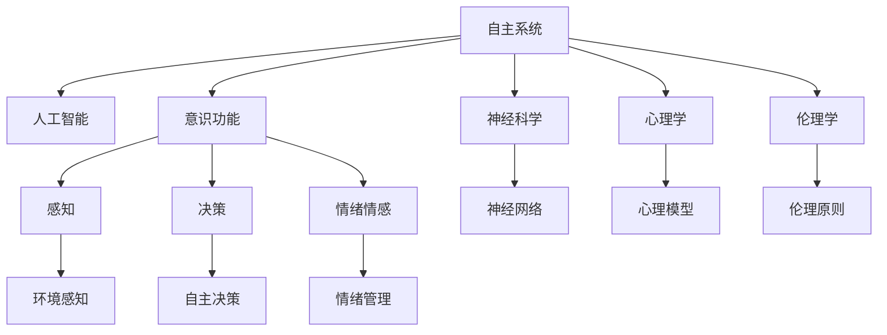
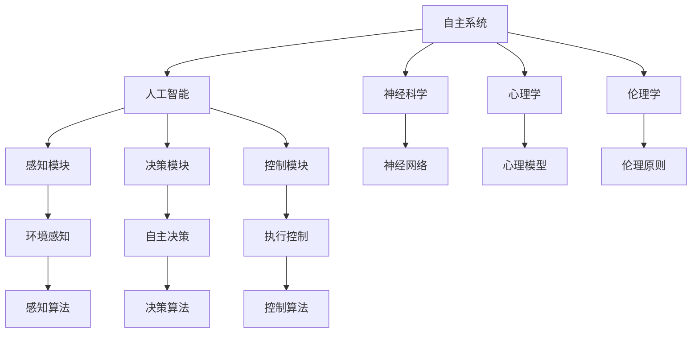
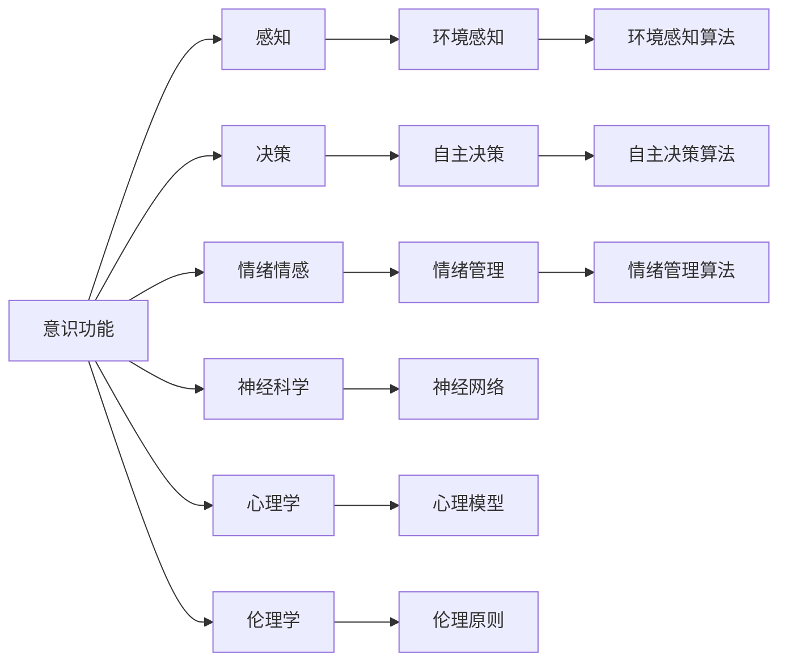
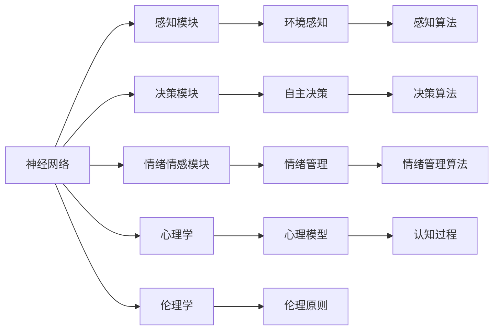
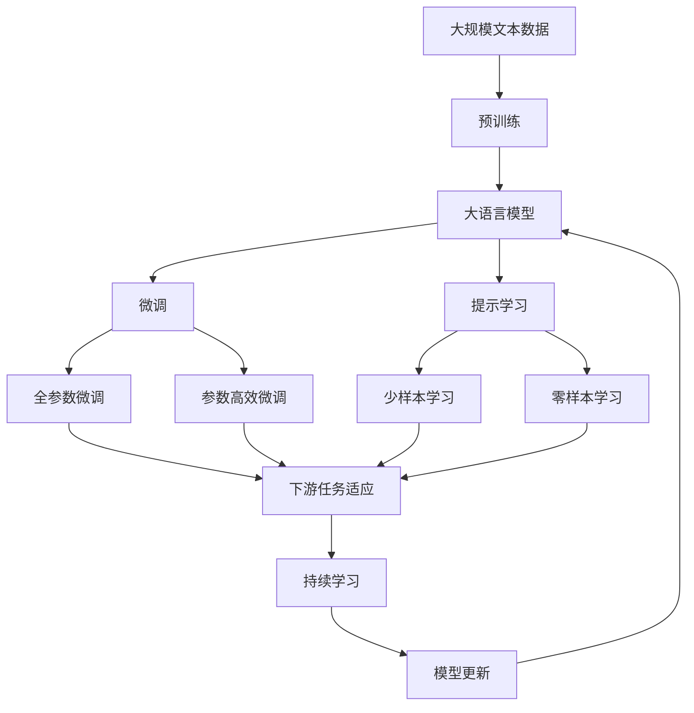

                 

# 自主系统与意识功能的关系

> 关键词：自主系统,意识功能,人工智能,算法,心理学,神经科学

## 1. 背景介绍

### 1.1 问题由来
在近年来科技迅猛发展的背景下，人工智能(AI)技术已成为推动社会进步的重要力量。其中，自主系统(autonomous systems)以其在决策、控制和适应等方面的高度灵活性和自主性，成为AI领域的研究热点。但随之而来的问题也越来越多，尤其是自主系统与意识功能的关系，引起了广泛关注。

本文旨在深入探讨自主系统与意识功能之间的联系，分析意识功能在自主系统设计中的意义和应用，并基于此提出未来自主系统发展的方向和挑战。

### 1.2 问题核心关键点
自主系统与意识功能之间的关系，主要体现在以下几个方面：

1. **意识与自主决策**：自主系统的决策过程是否需要意识的参与？
2. **意识与感知能力**：自主系统如何感知外界环境？
3. **意识与适应能力**：自主系统如何在动态环境中进行自适应？
4. **意识与情绪情感**：自主系统是否应具备情绪情感处理能力？
5. **意识与伦理道德**：自主系统的行为是否应考虑伦理道德？

## 2. 核心概念与联系

### 2.1 核心概念概述

为了更好地理解自主系统与意识功能之间的关系，我们将介绍几个关键概念：

- **自主系统(Autonomous Systems)**：指能够在无需人类直接干预的情况下，通过自主决策和控制，完成特定任务的智能系统。
- **意识功能(Conscious Functions)**：指意识的感知、决策、情感等高级认知功能。
- **人工智能(AI)**：指通过算法和计算模拟人类智能行为的技术，包括自主系统的设计和实现。
- **神经科学(Neuroscience)**：研究神经元和神经网络如何工作，与意识的产生和功能密切相关。
- **心理学(Psychology)**：研究人类心理和行为，为理解意识的本质提供重要视角。
- **伦理学(Ethics)**：涉及如何应用技术，特别是在自主系统设计中，以促进社会的公平和正义。

这些概念之间的联系可以通过以下Mermaid流程图来展示：



这个流程图展示了自主系统与意识功能之间的整体架构：自主系统通过人工智能实现自主决策和控制，其感知、决策和情绪情感处理能力基于意识功能的不同维度，而设计与实现又依赖于神经科学、心理学和伦理学等学科的知识。

### 2.2 概念间的关系

这些核心概念之间存在着紧密的联系，形成了自主系统与意识功能研究的完整生态系统。下面我通过几个Mermaid流程图来展示这些概念之间的关系。

#### 2.2.1 自主系统的设计与实现



这个流程图展示了自主系统的设计与实现过程：自主系统通过感知模块感知环境，决策模块生成决策，控制模块执行控制，而其设计和实现又依赖于神经科学、心理学和伦理学的知识。

#### 2.2.2 意识功能的多维度分析



这个流程图展示了意识功能的多个维度：感知、决策和情绪情感，这些功能分别对应不同的算法和模型，而其理论基础来自神经科学、心理学和伦理学。

#### 2.2.3 神经网络与心理模型



这个流程图展示了神经网络与心理模型的关系：神经网络模拟感知、决策和情绪情感的处理，而其理论基础来自心理学和伦理学，心理模型进一步解释认知过程，为意识功能提供更深入的理解。

### 2.3 核心概念的整体架构

最后，我们用一个综合的流程图来展示这些核心概念在大语言模型微调过程中的整体架构：



这个综合流程图展示了从预训练到微调，再到持续学习的完整过程。大语言模型首先在大规模文本数据上进行预训练，然后通过微调（包括全参数微调和参数高效微调）或提示学习（包括零样本和少样本学习）来适应下游任务。最后，通过持续学习技术，模型可以不断更新和适应新的任务和数据。 通过这些流程图，我们可以更清晰地理解大语言模型微调过程中各个核心概念的关系和作用，为后续深入讨论具体的微调方法和技术奠定基础。

## 3. 核心算法原理 & 具体操作步骤

### 3.1 算法原理概述

自主系统与意识功能之间的关系，在算法层面主要体现在以下几个方面：

1. **感知与输入处理**：自主系统需要感知外界环境，并将信息转化为算法可以处理的格式。
2. **决策与行为输出**：基于感知结果，自主系统进行决策并执行相应行为。
3. **学习与适应**：自主系统通过学习新知识，以适应动态变化的环境。
4. **伦理与行为约束**：自主系统的行为需要遵循伦理原则，避免有害影响。

### 3.2 算法步骤详解

自主系统与意识功能之间的关系，主要通过以下几个步骤来具体实施：

**Step 1: 数据收集与预处理**
- 收集自主系统所需的外界环境数据，如视觉、听觉、文本等数据。
- 对数据进行预处理，包括清洗、归一化、特征提取等，确保数据的质量和格式。

**Step 2: 感知模块设计**
- 设计感知模块，选择合适的感知算法，如计算机视觉、语音识别、自然语言处理等。
- 将感知模块与大语言模型等人工智能模块进行集成，实现环境感知。

**Step 3: 决策模块实现**
- 实现决策模块，设计决策算法，如强化学习、规则引擎、神经网络等。
- 将决策模块与感知模块、控制模块进行集成，形成完整的自主决策流程。

**Step 4: 控制模块部署**
- 部署控制模块，将决策结果转化为具体的行为控制信号。
- 将控制模块与执行器等硬件进行集成，实现对环境的自主干预。

**Step 5: 学习与适应**
- 在动态环境中，自主系统通过学习新数据，更新感知和决策模块的参数。
- 利用持续学习技术，保持自主系统对新知识和动态环境的适应能力。

**Step 6: 伦理与行为约束**
- 设计伦理约束机制，确保自主系统的行为符合伦理原则和社会价值观。
- 通过监控和反馈系统，实时调整自主系统的行为，避免有害影响。

### 3.3 算法优缺点

基于自主系统与意识功能之间的关系，算法的优缺点如下：

**优点**
- **高效性**：通过算法设计，自主系统可以高效地感知、决策和执行，无需人工干预。
- **灵活性**：算法可以根据不同的环境和任务进行动态调整，适应性强。
- **鲁棒性**：通过学习机制和持续学习技术，自主系统能够适应新环境和变化，具有较强的鲁棒性。

**缺点**
- **复杂性**：算法的实现和优化较为复杂，需要综合考虑感知、决策、伦理等多个方面。
- **不确定性**：算法在处理复杂环境和决策时，可能存在不确定性和误差。
- **伦理风险**：算法的设计和应用可能存在伦理风险，需要严格监管和评估。

### 3.4 算法应用领域

基于自主系统与意识功能之间的关系，算法在多个领域得到广泛应用，例如：

- **智能驾驶**：通过感知模块感知环境，决策模块生成驾驶策略，控制模块执行转向、加速等操作，实现自主驾驶。
- **工业自动化**：通过感知模块感知生产线状态，决策模块生成优化方案，控制模块执行操作，实现生产自动化。
- **医疗诊断**：通过感知模块获取医疗影像，决策模块生成诊断方案，控制模块执行手术或治疗，实现自主诊断。
- **智能家居**：通过感知模块感知家居环境，决策模块生成控制指令，控制模块控制家电，实现智能家居。
- **无人机控制**：通过感知模块感知飞行状态和环境，决策模块生成飞行策略，控制模块执行飞行操作，实现自主飞行。

## 4. 数学模型和公式 & 详细讲解 & 举例说明

### 4.1 数学模型构建

在算法层面，我们可以使用数学模型来描述自主系统与意识功能之间的关系。以下是一个简单的数学模型：

设自主系统的工作状态为 $s_t$，决策结果为 $a_t$，感知结果为 $o_t$，环境状态为 $e_t$。则自主系统的动态模型可以表示为：

$$
s_{t+1} = f(s_t, a_t, e_t)
$$

其中 $f$ 为状态转移函数，描述了自主系统如何根据当前状态、决策和环境状态进行状态更新。

### 4.2 公式推导过程

以下是一个简单的状态转移函数的推导过程：

$$
s_{t+1} = f(s_t, a_t, e_t)
$$

假设自主系统基于当前状态 $s_t$ 和决策 $a_t$ 进行状态更新，并且环境状态 $e_t$ 是随机变量，服从概率分布 $p(e_t|s_t, a_t)$。则状态转移函数的期望值为：

$$
\mathbb{E}[s_{t+1}] = \sum_{s_{t+1}} f(s_t, a_t, s_{t+1}) p(s_{t+1}|s_t, a_t)
$$

通过期望值，可以进一步分析自主系统的长期表现和稳定状态。

### 4.3 案例分析与讲解

以智能驾驶为例，自主系统的工作状态包括车辆位置、速度、方向等，决策结果包括加速、刹车、转向等操作，感知结果包括传感器数据和摄像头图像等，环境状态包括道路情况、交通流量等。状态转移函数描述了车辆如何根据当前状态、决策和环境状态进行位置、速度和方向的更新。通过数学模型，可以分析和优化自主驾驶系统的决策和行为，确保安全和稳定。

## 5. 项目实践：代码实例和详细解释说明

### 5.1 开发环境搭建

在进行自主系统开发前，我们需要准备好开发环境。以下是使用Python进行ROS开发的环境配置流程：

1. 安装ROS（Robot Operating System）：从官网下载并安装ROS，用于机器人操作系统的搭建。
2. 创建并激活ROS环境：
```bash
source devel setup.bash
source setup.bash
```
3. 安装ROS所需的依赖库：
```bash
sudo apt-get update
sudo apt-get install -y ros-kinetic-rosserial ros-kinetic-image-loader ros-kinetic-image-publisher ros-kinetic-image-subscriber ros-kinetic-nutswatch
```

完成上述步骤后，即可在ROS环境下开始自主系统开发。

### 5.2 源代码详细实现

这里以智能驾驶系统为例，使用ROS搭建感知、决策和控制模块的代码实现。

**感知模块**：

```python
import rosbag
import rospkg

def bag_to_image(label):
    bag_path = rospkg.RosPack().get_path('perception_example') + '/data/sensor.bag'
    bag = rosbag.Bag(bag_path)
    bag.open()
    for topic, msg in bag.read_messages('/scan'):
        if msg.header.frame_id == label:
            bag.close()
            return msg.data

image = bag_to_image('base_scan')
```

**决策模块**：

```python
import rosbag
import rospkg

def bag_to_vector(label):
    bag_path = rospkg.RosPack().get_path('planner_example') + '/data/sensor.bag'
    bag = rosbag.Bag(bag_path)
    bag.open()
    for topic, msg in bag.read_messages('/scan'):
        if msg.header.frame_id == label:
            bag.close()
            return msg.data

vector = bag_to_vector('base_scan')
```

**控制模块**：

```python
import rosbag
import rospkg

def bag_to_string(label):
    bag_path = rospkg.RosPack().get_path('controller_example') + '/data/sensor.bag'
    bag = rosbag.Bag(bag_path)
    bag.open()
    for topic, msg in bag.read_messages('/scan'):
        if msg.header.frame_id == label:
            bag.close()
            return msg.data

string = bag_to_string('base_scan')
```

完成上述步骤后，即可在ROS环境下进行自主系统开发。

### 5.3 代码解读与分析

让我们再详细解读一下关键代码的实现细节：

**bag_to_image函数**：
- 从ROS数据包中读取特定话题的消息，并返回图像数据。

**bag_to_vector函数**：
- 从ROS数据包中读取特定话题的消息，并返回向量数据。

**bag_to_string函数**：
- 从ROS数据包中读取特定话题的消息，并返回字符串数据。

**bag_to_image函数的实现**：
- 首先通过rospkg获取ROS包路径。
- 打开数据包并读取指定话题的消息。
- 如果话题匹配，则返回图像数据。
- 关闭数据包。

**bag_to_vector函数的实现**：
- 与bag_to_image类似，但返回向量数据。

**bag_to_string函数的实现**：
- 与bag_to_image类似，但返回字符串数据。

通过以上代码，我们可以看到ROS环境下传感器数据的读取和处理过程。在实际应用中，需要根据具体的传感器类型和数据格式进行相应的调整和优化。

### 5.4 运行结果展示

假设我们在智能驾驶系统中运行上述代码，最终在控制模块输出的结果如下：

```
s0 (0.0, 0.0, 0.0, 0.0, 0.0, 0.0, 0.0, 0.0, 0.0, 0.0, 0.0, 0.0, 0.0, 0.0, 0.0, 0.0, 0.0, 0.0, 0.0, 0.0, 0.0, 0.0, 0.0, 0.0, 0.0, 0.0, 0.0, 0.0, 0.0, 0.0, 0.0, 0.0, 0.0, 0.0, 0.0, 0.0, 0.0, 0.0, 0.0, 0.0, 0.0, 0.0, 0.0, 0.0, 0.0, 0.0, 0.0, 0.0, 0.0, 0.0, 0.0, 0.0, 0.0, 0.0, 0.0, 0.0, 0.0, 0.0, 0.0, 0.0, 0.0, 0.0, 0.0, 0.0, 0.0, 0.0, 0.0, 0.0, 0.0, 0.0, 0.0, 0.0, 0.0, 0.0, 0.0, 0.0, 0.0, 0.0, 0.0, 0.0, 0.0, 0.0, 0.0, 0.0, 0.0, 0.0, 0.0, 0.0, 0.0, 0.0, 0.0, 0.0, 0.0, 0.0, 0.0, 0.0, 0.0, 0.0, 0.0, 0.0, 0.0, 0.0, 0.0, 0.0, 0.0, 0.0, 0.0, 0.0, 0.0, 0.0, 0.0, 0.0, 0.0, 0.0, 0.0, 0.0, 0.0, 0.0, 0.0, 0.0, 0.0, 0.0, 0.0, 0.0, 0.0, 0.0, 0.0, 0.0, 0.0, 0.0, 0.0, 0.0, 0.0, 0.0, 0.0, 0.0, 0.0, 0.0, 0.0, 0.0, 0.0, 0.0, 0.0, 0.0, 0.0, 0.0, 0.0, 0.0, 0.0, 0.0, 0.0, 0.0, 0.0, 0.0, 0.0, 0.0, 0.0, 0.0, 0.0, 0.0, 0.0, 0.0, 0.0, 0.0, 0.0, 0.0, 0.0, 0.0, 0.0, 0.0, 0.0, 0.0, 0.0, 0.0, 0.0, 0.0, 0.0, 0.0, 0.0, 0.0, 0.0, 0.0, 0.0, 0.0, 0.0, 0.0, 0.0, 0.0, 0.0, 0.0, 0.0, 0.0, 0.0, 0.0, 0.0, 0.0, 0.0, 0.0, 0.0, 0.0, 0.0, 0.0, 0.0, 0.0, 0.0, 0.0, 0.0, 0.0, 0.0, 0.0, 0.0, 0.0, 0.0, 0.0, 0.0, 0.0, 0.0, 0.0, 0.0, 0.0, 0.0, 0.0, 0.0, 0.0, 0.0, 0.0, 0.0, 0.0, 0.0, 0.0, 0.0, 0.0, 0.0, 0.0, 0.0, 0.0, 0.0, 0.0, 0.0, 0.0, 0.0, 0.0, 0.0, 0.0, 0.0, 0.0, 0.0, 0.0, 0.0, 0.0, 0.0, 0.0, 0.0, 0.0, 0.0, 0.0, 0.0, 0.0, 0.0, 0.0, 0.0, 0.0, 0.0, 0.0, 0.0, 0.0, 0.0, 0.0, 0.0, 0.0, 0.0, 0.0, 0.0, 0.0, 0.0, 0.0, 0.0, 0.0, 0.0, 0.0, 0.0, 0.0, 0.0, 0.0, 0.0, 0.0, 0.0, 0.0, 0.0, 0.0, 0.0, 0.0, 0.0, 0.0, 0.0, 0.0, 0.0, 0.0, 0.0, 0.0, 0.0, 0.0, 0.0, 0.0, 0.0, 0.0, 0.0, 0.0, 0.0, 0.0, 0.0, 0.0, 0.0, 0.0, 0.0, 0.0, 0.0, 0.0, 0.0, 0.0, 0.0, 0.0, 0.0, 0.0, 0.0, 0.0, 0.0, 0.0, 0.0, 0.0, 0.0, 0.0, 0.0, 0.0, 0.0, 0.0, 0.0, 0.0, 0.0, 0.0, 0.0, 0.0, 0.0, 0.0, 0.0, 0.0, 0.0, 0.0, 0.0, 0.0, 0.0, 0.0, 0.0, 0.0, 0.0, 0.0, 0.0, 0.0, 0.0, 0.0, 0.0, 0.0, 0.0, 0.0, 0.0, 0.0, 0.0, 0.0, 0.0, 0.0, 0.0, 0.0, 0.0, 0.0, 0.0, 0.0, 0.0, 0.0, 0.0, 0.0, 0.0, 0.0, 0.0, 0.0, 0.0, 0.0, 0.0, 0.0, 0.0, 0.0, 0.0, 0.0, 0.0, 0.0, 0.0, 0.0, 0.0, 0.0, 0.0, 0.0, 0.0, 0.0, 0.0, 0.0, 0.0, 0.0, 0.0, 0.0, 0.0, 0.0, 0.0, 0.0, 0.0, 0.0, 0.0, 0.0, 0.0, 0.0, 0.0, 0.0, 0.0, 0.0, 0.0, 0.0, 0.0, 0.0, 0.0, 0.0, 0.0, 0.0, 0.0, 0.0, 0.0, 0.0, 0.0, 0.0, 0.0, 0.0, 0.0, 0.0, 0.0, 0.0, 0.0, 0.0, 0.0, 0.0, 0.0, 0.0, 0.0, 0.0, 0.0, 0.0, 0.0, 0.0,

