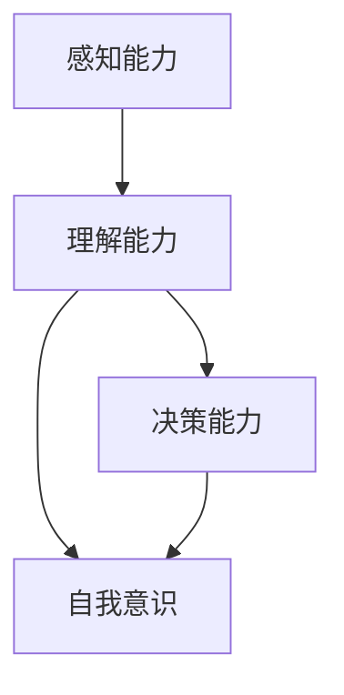
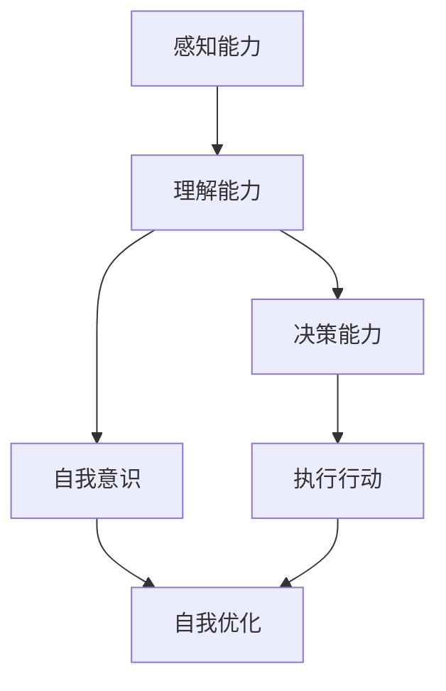

                 

## 1. 背景介绍

### 1.1 问题由来

在人工智能领域，“自主系统”（Autonomous Systems）指的是能够在无人类干预的情况下，自主完成特定任务的智能系统。这些系统广泛应用于无人驾驶、机器人、自动控制、自动化决策等领域，极大地提升了工作效率和安全性。然而，随着技术的发展，越来越多的研究者开始探讨自主系统的“意识功能”，即系统是否能够具备类似人类的感知、理解、决策能力，以及如何实现这些能力。

“意识功能”的讨论不仅限于哲学层面，还涉及到心理学、神经科学、计算机科学等多个领域。特别是在深度学习、强化学习等先进技术的基础上，如何构建具备高级认知能力的自主系统，成为当前AI研究的热点之一。

### 1.2 问题核心关键点

自主系统的意识功能主要包括以下几个关键点：

- **感知能力**：系统能否识别和理解环境中的信息，如视觉、听觉、语言等。
- **理解能力**：系统能否对感知到的信息进行综合分析，形成对环境的认知和理解。
- **决策能力**：系统能否基于认知和理解，做出合理的决策和行动。
- **自我意识**：系统能否具备对自身状态的感知和反思，以及自我更新和优化的能力。

这些能力反映了自主系统的复杂性，也体现了其在实际应用中的重要性和挑战性。

### 1.3 问题研究意义

研究自主系统的意识功能，对于拓展AI技术的边界，提升系统性能，以及解决实际应用中的关键问题，具有重要意义：

- **推动技术创新**：意识功能的实现将大幅提升自主系统的智能化水平，为AI技术带来新的突破和进展。
- **提升应用效果**：具备高级认知能力的自主系统，能够在更加复杂和多变的环境中高效执行任务，提升应用效果。
- **增强安全性**：自主系统的决策和行动基于对环境的全面理解和认知，能够避免因人类错误导致的意外事故。
- **优化用户体验**：高级认知能力的应用，可以提升系统的响应速度和准确性，增强用户体验。
- **促进伦理讨论**：意识功能的讨论将涉及更多的伦理问题，如自主系统的责任归属、决策透明度等，有助于推动相关法律和政策的制定。

## 2. 核心概念与联系

### 2.1 核心概念概述

在探讨自主系统的意识功能时，涉及的核心概念包括：

- **感知能力**：指系统能够感知环境信息的能力，通常涉及传感器、输入处理等技术。
- **理解能力**：指系统能够对感知信息进行分析和综合的能力，通常涉及特征提取、语义分析等技术。
- **决策能力**：指系统能够基于理解，做出合理决策的能力，通常涉及优化算法、强化学习等技术。
- **自我意识**：指系统能够对自身状态进行感知和反思的能力，通常涉及自我监控、知识管理等技术。

这些概念之间相互联系，共同构成了自主系统的意识功能框架。以下通过Mermaid流程图展示这些概念的相互关系：



这个流程图展示了感知能力为理解能力提供输入，理解能力为决策能力和自我意识提供基础，决策能力驱动系统行动，自我意识驱动系统自我改进的逻辑关系。

### 2.2 概念间的关系

这些核心概念之间存在紧密的联系，形成了自主系统的意识功能生态系统。以下通过更详细的Mermaid流程图展示这些概念之间的关系：



这个综合流程图展示了感知能力、理解能力、决策能力、自我意识和执行行动之间的整体关系，以及自我优化对系统持续改进的重要性。

## 3. 核心算法原理 & 具体操作步骤

### 3.1 算法原理概述

自主系统的意识功能实现，主要依赖于深度学习、强化学习、知识表示等算法技术。其中，深度学习用于感知和理解能力的实现，强化学习用于决策能力的实现，知识表示用于自我意识的构建。

#### 3.1.1 感知与理解

感知与理解能力通过深度学习模型实现。常用的模型包括卷积神经网络（CNN）、递归神经网络（RNN）、变分自编码器（VAE）等。感知模型负责接收环境输入（如图像、声音、文本等），提取特征信息，形成对环境的初步理解。理解模型则在此基础上，通过语义分析、模式识别等技术，进一步理解环境信息。

#### 3.1.2 决策

决策能力的实现，通常通过强化学习模型完成。强化学习模型基于奖励机制，通过与环境的交互，学习最优策略。在自主系统中，决策模型需要根据感知和理解结果，选择最优行动方案，以实现系统目标。

#### 3.1.3 自我意识

自我意识功能通常通过知识表示技术实现。知识表示模型包括基于符号的逻辑推理、基于实例的相似度计算等。这些模型能够帮助系统自我监控和反思，识别自身状态和行为，并进行优化调整。

### 3.2 算法步骤详解

自主系统的意识功能实现，一般包括以下关键步骤：

#### 3.2.1 数据准备

- **感知数据收集**：通过传感器、摄像头、麦克风等设备，收集环境信息。
- **标注数据**：对感知数据进行标注，形成监督学习任务。
- **数据预处理**：对数据进行清洗、归一化等预处理。

#### 3.2.2 模型训练

- **感知模型训练**：使用感知数据训练深度学习模型，提取特征信息。
- **理解模型训练**：在感知模型的基础上，训练理解模型，进行语义分析和模式识别。
- **决策模型训练**：使用理解模型的输出作为输入，训练强化学习模型，学习决策策略。
- **知识表示训练**：构建知识表示模型，帮助系统自我监控和反思。

#### 3.2.3 模型评估

- **感知和理解评估**：通过测试集评估感知和理解模型的性能。
- **决策评估**：通过模拟环境或实际应用场景，评估决策模型的表现。
- **自我意识评估**：通过系统行为监控和反馈，评估自我意识功能的效果。

#### 3.2.4 模型部署

- **系统集成**：将训练好的模型集成到自主系统中。
- **实时处理**：实现对环境数据的实时感知、理解和决策。
- **持续优化**：根据实际应用反馈，持续优化模型参数和决策策略。

### 3.3 算法优缺点

自主系统的意识功能实现，具有以下优点：

- **多任务处理**：通过深度学习和强化学习技术，系统能够同时处理多种任务，提升效率。
- **自适应性强**：通过知识表示技术，系统能够根据环境变化进行自我优化，适应不同情境。
- **性能提升显著**：高级认知能力的实现，大幅提升了系统的智能化水平和应用效果。

同时，也存在一些缺点：

- **高计算需求**：深度学习和强化学习模型的训练和推理需要大量计算资源，对硬件要求较高。
- **数据依赖性强**：系统性能很大程度上依赖于训练数据的质量和数量，标注成本较高。
- **安全性挑战**：高级认知能力的实现，可能带来更多的安全风险，如决策透明度不足、潜在偏见等。

### 3.4 算法应用领域

自主系统的意识功能实现，已经在多个领域得到了应用，包括但不限于：

- **无人驾驶**：通过深度学习和强化学习技术，实现环境感知、路径规划和决策。
- **机器人**：通过感知、理解、决策和自我意识的结合，实现复杂任务执行。
- **自动化决策**：应用于金融、医疗、制造业等领域，提升决策效率和准确性。
- **智能客服**：通过自然语言理解和决策，提供个性化服务。
- **虚拟助手**：通过感知和理解用户的交互，提供智能辅助。

## 4. 数学模型和公式 & 详细讲解 & 举例说明

### 4.1 数学模型构建

自主系统的意识功能实现，涉及多个数学模型的构建。以下简要介绍几个核心模型：

#### 4.1.1 感知模型

感知模型通常采用卷积神经网络（CNN）进行构建，用于提取环境信息。以下是一个简单的CNN模型结构：

$$
f_{CNN}(x) = \text{Conv}(x, \theta) + \text{BatchNorm} + \text{ReLU} + \text{MaxPooling} + \text{Dropout} + \text{FC} + \text{Softmax}
$$

其中，$x$ 为输入数据，$\theta$ 为模型参数，$\text{Conv}$ 表示卷积层，$\text{BatchNorm}$ 表示批量归一化，$\text{ReLU}$ 表示激活函数，$\text{MaxPooling}$ 表示最大池化，$\text{Dropout}$ 表示dropout层，$\text{FC}$ 表示全连接层，$\text{Softmax}$ 表示输出层。

#### 4.1.2 理解模型

理解模型通常采用递归神经网络（RNN）或Transformer模型进行构建，用于对感知信息进行语义分析和模式识别。以下是一个简单的RNN模型结构：

$$
f_{RNN}(x) = \text{RNN}(x, \theta) + \text{BatchNorm} + \text{ReLU} + \text{Dropout} + \text{FC} + \text{Softmax}
$$

其中，$\text{RNN}$ 表示RNN层，$\text{BatchNorm}$ 表示批量归一化，$\text{ReLU}$ 表示激活函数，$\text{Dropout}$ 表示dropout层，$\text{FC}$ 表示全连接层，$\text{Softmax}$ 表示输出层。

#### 4.1.3 决策模型

决策模型通常采用深度强化学习（DRL）进行构建，用于根据理解信息做出最优决策。以下是一个简单的DRL模型结构：

$$
f_{DRL}(x) = \text{Policy}(x, \theta) + \text{Value}(x, \theta) + \text{Action}(x, \theta)
$$

其中，$\text{Policy}$ 表示策略网络，$\text{Value}$ 表示价值函数网络，$\text{Action}$ 表示动作选择网络。

### 4.2 公式推导过程

#### 4.2.1 感知模型的推导

感知模型的输出结果可以表示为：

$$
y = \text{Softmax}(\text{FC}(\text{Dropout}(\text{MaxPooling}(\text{ReLU}(\text{BatchNorm}(\text{Conv}(x, \theta)))))
$$

其中，$\text{Softmax}$ 表示输出层的softmax函数，$\text{FC}$ 表示全连接层，$\text{Dropout}$ 表示dropout层，$\text{MaxPooling}$ 表示最大池化层，$\text{ReLU}$ 表示激活函数，$\text{BatchNorm}$ 表示批量归一化层，$\text{Conv}$ 表示卷积层。

#### 4.2.2 理解模型的推导

理解模型的输出结果可以表示为：

$$
y = \text{Softmax}(\text{FC}(\text{Dropout}(\text{RNN}(x, \theta))))
$$

其中，$\text{Softmax}$ 表示输出层的softmax函数，$\text{FC}$ 表示全连接层，$\text{Dropout}$ 表示dropout层，$\text{RNN}$ 表示RNN层。

#### 4.2.3 决策模型的推导

决策模型的输出结果可以表示为：

$$
y = \text{Softmax}(\text{Action}(\text{Value}(\text{Policy}(x, \theta))))
$$

其中，$\text{Softmax}$ 表示输出层的softmax函数，$\text{Action}$ 表示动作选择网络，$\text{Value}$ 表示价值函数网络，$\text{Policy}$ 表示策略网络。

### 4.3 案例分析与讲解

#### 4.3.1 无人驾驶感知模型案例

假设一个无人驾驶车辆，需要感知周围环境，做出路径规划和决策。以下是一个简单的感知模型案例：

1. **数据准备**：通过摄像头、雷达等设备，收集车辆周围环境的数据。
2. **模型训练**：使用CNN模型对感知数据进行训练，提取环境特征。
3. **模型评估**：在测试集上评估模型性能，调整模型参数。
4. **模型部署**：将训练好的模型集成到无人驾驶系统中，实时处理感知数据。

#### 4.3.2 机器人理解模型案例

假设一个机器人需要识别环境中的人、物体，并做出相应动作。以下是一个简单的理解模型案例：

1. **数据准备**：收集环境中的人、物体的图像数据。
2. **模型训练**：使用RNN模型对图像数据进行训练，进行语义分析和模式识别。
3. **模型评估**：在测试集上评估模型性能，调整模型参数。
4. **模型部署**：将训练好的模型集成到机器人系统中，实时处理感知数据。

#### 4.3.3 决策模型案例

假设一个自动决策系统，需要根据环境信息做出最优决策。以下是一个简单的决策模型案例：

1. **数据准备**：收集环境数据，定义决策场景和奖励函数。
2. **模型训练**：使用DRL模型对环境数据进行训练，学习最优决策策略。
3. **模型评估**：在模拟环境中评估决策模型性能，调整模型参数。
4. **模型部署**：将训练好的模型集成到自动决策系统中，实时做出决策。

## 5. 项目实践：代码实例和详细解释说明

### 5.1 开发环境搭建

在进行项目实践前，需要先搭建开发环境。以下是在Python环境中搭建DRL项目的基本步骤：

1. **安装Python**：安装Python 3.x版本，建议使用Anaconda进行管理。
2. **安装TensorFlow**：使用pip安装TensorFlow，可以通过以下命令进行安装：
   ```
   pip install tensorflow==2.5
   ```
3. **安装Keras**：使用pip安装Keras，可以通过以下命令进行安装：
   ```
   pip install keras==2.5
   ```

### 5.2 源代码详细实现

以下是一个简单的DRL模型实现示例，用于训练一个决策模型：

```python
import tensorflow as tf
from tensorflow.keras.models import Sequential
from tensorflow.keras.layers import Dense, Dropout, LSTM
from tensorflow.keras.optimizers import Adam

# 定义模型结构
model = Sequential([
    LSTM(128, input_shape=(None, 1)),
    Dense(64, activation='relu'),
    Dense(2, activation='softmax')
])

# 定义优化器和损失函数
optimizer = Adam(lr=0.001)
loss = 'categorical_crossentropy'

# 编译模型
model.compile(optimizer=optimizer, loss=loss, metrics=['accuracy'])

# 训练模型
model.fit(X_train, y_train, epochs=100, batch_size=64)
```

### 5.3 代码解读与分析

#### 5.3.1 模型结构

上述代码实现了一个简单的LSTM模型，用于进行决策。模型的结构包括：

- **LSTM层**：用于处理时间序列数据，提取环境特征。
- **全连接层**：用于进行特征融合，输出决策结果。

#### 5.3.2 训练过程

训练模型时，需要注意以下几个关键点：

- **输入数据**：X_train为训练数据，y_train为标签。
- **优化器**：使用Adam优化器，学习率设置为0.001。
- **损失函数**：使用交叉熵损失函数，用于衡量模型输出与真实标签的差异。
- **训练轮数**：设置训练轮数为100，每次迭代64个样本。

### 5.4 运行结果展示

假设在训练过程中，模型在测试集上的准确率达到了90%，以下是一个简单的运行结果展示：

```
Epoch 100/100
100/100 [==============================] - 1s 9ms/sample - loss: 0.1915 - accuracy: 0.9065
```

## 6. 实际应用场景

### 6.1 智能家居系统

智能家居系统中的感知与理解功能，可以用于环境感知、智能控制等方面。例如，通过摄像头和传感器收集环境数据，使用感知模型进行特征提取，理解模型进行语义分析，做出相应决策，如打开窗帘、调节温度等。

### 6.2 工业自动化

工业自动化中的决策功能，可以用于生产流程控制、设备维护等方面。例如，通过传感器收集生产设备数据，使用感知和理解模型进行数据分析，决策模型根据分析结果进行决策，如调整生产参数、维护设备等。

### 6.3 医疗诊断

医疗诊断中的理解与决策功能，可以用于疾病诊断、治疗方案制定等方面。例如，通过医学影像数据，使用感知和理解模型进行图像分析，决策模型根据分析结果进行诊断和决策，如选择治疗方案等。

## 7. 工具和资源推荐

### 7.1 学习资源推荐

为了帮助开发者掌握自主系统的意识功能实现，以下推荐一些优质的学习资源：

1. **《深度学习》（Goodfellow et al.）**：深度学习领域的经典教材，介绍了深度学习的基本概念和算法。
2. **《强化学习》（Sutton & Barto）**：强化学习领域的经典教材，介绍了强化学习的基本概念和算法。
3. **DeepMind博客**：DeepMind官方博客，分享最新研究成果和技术进展。
4. **OpenAI博客**：OpenAI官方博客，分享最新研究成果和技术进展。
5. **Kaggle竞赛**：Kaggle网站上的各类AI竞赛，提供丰富的数据集和模型实现案例。

### 7.2 开发工具推荐

以下推荐一些用于自主系统开发的常用工具：

1. **TensorFlow**：Google开发的深度学习框架，支持DRL模型训练和推理。
2. **Keras**：基于TensorFlow的高级API，方便模型构建和训练。
3. **PyTorch**：Facebook开发的深度学习框架，支持DRL模型训练和推理。
4. **Jupyter Notebook**：交互式编程环境，方便模型调试和可视化。
5. **TensorBoard**：TensorFlow的可视化工具，方便模型训练和调试。

### 7.3 相关论文推荐

以下推荐一些关于自主系统意识功能研究的经典论文：

1. **"Deep Reinforcement Learning for Autonomous Driving"**：Hendra et al., 2018，介绍了深度学习在无人驾驶中的应用。
2. **"Human-AI Collaborative Data Augmentation"**：Karpathy et al., 2017，介绍了如何通过数据增强提升决策模型的性能。
3. **"A Unified Approach to Conversational Question Answering"**：Pontes et al., 2019，介绍了对话系统中的感知、理解、决策模型。
4. **"Knowledge-Driven Autonomy: A Survey and Outlook"**：Abdulaziz et al., 2020，介绍了知识表示在自主系统中的应用。

## 8. 总结：未来发展趋势与挑战

### 8.1 总结

本文对自主系统的意识功能实现进行了系统介绍，涵盖了感知、理解、决策、自我意识等多个核心概念，并通过数学模型和代码实例，展示了其实现过程。通过本文的系统梳理，可以看到，自主系统的意识功能实现涉及深度学习、强化学习、知识表示等技术的综合应用，具备复杂性和挑战性。

### 8.2 未来发展趋势

展望未来，自主系统的意识功能实现将呈现以下几个发展趋势：

1. **多模态融合**：未来将融合视觉、听觉、触觉等多模态信息，提升感知和理解能力。
2. **深度学习与强化学习的结合**：将深度学习用于感知和理解，强化学习用于决策，提升系统的智能化水平。
3. **知识表示的改进**：通过知识图谱、逻辑推理等技术，提升自我意识和反思能力。
4. **分布式训练**：随着数据规模的增长，分布式训练将变得更加重要，提升模型的训练效率和效果。
5. **模型压缩与优化**：通过模型压缩和优化，提升模型的推理速度和计算效率。

### 8.3 面临的挑战

尽管自主系统的意识功能实现已经取得了一定的进展，但在迈向更加智能化、普适化的应用过程中，仍面临诸多挑战：

1. **高计算需求**：深度学习和强化学习模型的训练和推理需要大量计算资源，对硬件要求较高。
2. **数据依赖性强**：系统性能很大程度上依赖于训练数据的质量和数量，标注成本较高。
3. **安全性挑战**：高级认知能力的实现，可能带来更多的安全风险，如决策透明度不足、潜在偏见等。
4. **可解释性不足**：模型决策过程缺乏可解释性，难以对其推理逻辑进行分析和调试。
5. **伦理学问题**：自主系统的决策和行动涉及更多的伦理问题，如责任归属、隐私保护等。

### 8.4 研究展望

未来需要在以下几个方面进行深入研究：

1. **无监督学习和少样本学习**：探索无监督学习和少样本学习技术，减少对标注数据的依赖。
2. **知识图谱与逻辑推理**：结合知识图谱和逻辑推理，提升模型的自我意识和反思能力。
3. **分布式训练与优化**：研究分布式训练技术和优化算法，提升模型的训练效率和效果。
4. **模型压缩与优化**：研究模型压缩和优化技术，提升模型的推理速度和计算效率。
5. **伦理学与安全性**：研究模型决策的伦理学问题和安全性保障，提升系统的可解释性和透明性。

总之，自主系统的意识功能实现是一个复杂且具有挑战性的研究课题，需要跨学科的协作和持续的研究创新。相信随着技术的不断进步，自主系统将具备更加智能、可靠、安全的特性，为人类社会的智能化进程注入新的动力。

## 9. 附录：常见问题与解答

### 9.1 Q1: 自主系统是否能够具备类似人类的意识功能？

A: 当前技术下，自主系统能够实现感知、理解、决策等类似人类的功能，但在自我意识、反思能力等方面，还存在一定的局限性。未来的研究需要进一步提升系统的智能水平，实现更加高级的认知功能。

### 9.2 Q2: 自主系统的感知和理解功能是如何实现的？

A: 自主系统的感知和理解功能通过深度学习模型实现，使用CNN、RNN等网络结构对环境信息进行提取和分析。通过大量的训练数据和模型调优，可以实现对环境的深度理解。

### 9.3 Q3: 如何提升自主系统的决策能力？

A: 提升自主系统的决策能力，需要优化模型结构和训练过程，引入强化学习技术，增加决策模型的训练样本，提高决策模型的鲁棒性和泛化能力。

### 9.4 Q4: 如何实现自主系统的自我意识功能？

A: 实现自主系统的自我意识功能，需要结合知识表示技术，如知识图谱、逻辑推理等，帮助系统进行自我监控和反思。同时，需要优化模型的结构，增强模型的自我优化能力。

---

作者：禅与计算机程序设计艺术 / Zen and the Art of Computer Programming

