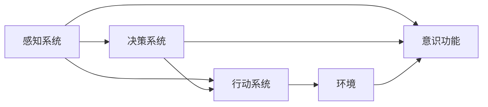
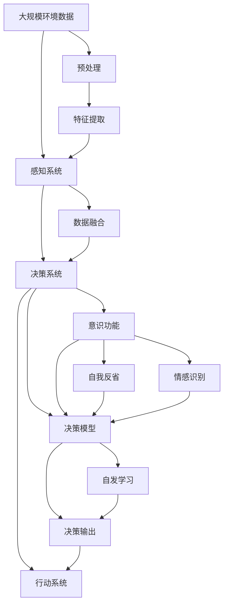

                 

# 自主系统如何管理意识功能

## 1. 背景介绍

### 1.1 问题由来

随着人工智能技术的飞速发展，自主系统已经广泛应用于各种领域，如自动驾驶、机器人控制、医疗诊断等。这些系统需要具备一定的意识功能，以便在复杂多变的环境中做出正确的决策。然而，意识功能的实现和管理仍然是一个极具挑战性的问题。传统的基于规则的决策机制虽然易于理解，但难以应对不确定性和复杂性。深度学习和强化学习等现代人工智能技术，虽然在处理大数据和复杂任务上表现出色，但如何使它们具备真正的"意识"，即能够进行自我反省、自发学习，仍然是一个悬而未决的问题。

### 1.2 问题核心关键点

自主系统管理意识功能的核心关键点包括：
1. **意识的定义与实现**：如何定义"意识"，以及如何通过技术手段在自主系统中实现这一概念。
2. **意识与决策的关系**：意识功能如何影响自主系统的决策过程。
3. **意识功能的管理与维护**：如何确保意识功能的稳定性和可靠性，防止其被恶意利用或错误执行。
4. **意识的伦理和社会影响**：如何处理自主系统具备意识后可能带来的伦理和社会问题。

### 1.3 问题研究意义

研究自主系统管理意识功能，对于推动人工智能技术的进一步发展，提升自主系统的智能水平和应用效果，具有重要意义：

1. **提升自主系统智能水平**：通过赋予自主系统意识功能，使其具备自我反省、自发学习的能力，从而更智能地应对复杂环境。
2. **增强系统稳定性和可靠性**：意识功能可以帮助自主系统更好地理解和预测环境变化，提高决策的正确性和系统稳定性。
3. **促进人工智能应用的普及**：意识功能的实现将使自主系统更容易被公众接受，加速人工智能技术在各行各业的普及和应用。
4. **推动新研究方向的探索**：意识功能的管理与实现，将推动人工智能领域新研究方向的探索，如认知计算、情感计算等。

## 2. 核心概念与联系

### 2.1 核心概念概述

为更好地理解自主系统管理意识功能，本节将介绍几个密切相关的核心概念：

- **自主系统(Autonomous System)**：能够在一定环境中自主运行，不需要人工干预的系统。典型的自主系统包括自动驾驶汽车、机器人等。
- **意识(Consciousness)**：指系统具备自我反省、自我认知、情感识别和决策的能力。意识功能是自主系统的核心能力之一。
- **决策系统(Decision System)**：自主系统的核心部件，负责处理输入信息，做出决策。决策过程受意识功能的直接影响。
- **感知系统(Sensor System)**：负责收集环境信息，供决策系统使用。感知系统是自主系统环境感知的基础。
- **行动系统(Actuator System)**：执行决策系统发出的指令，使自主系统在物理世界中产生实际作用。行动系统是意识功能的执行手段。

这些核心概念之间通过感知、决策、行动等环节，共同构成了自主系统的运作流程。意识功能的引入，使得自主系统能够通过自我反省、自发学习，不断优化决策过程，提升系统性能。

### 2.2 概念间的关系

这些核心概念之间的逻辑关系可以通过以下Mermaid流程图来展示：



这个流程图展示了几大系统之间的关系：

1. 感知系统收集环境信息，传递给决策系统。
2. 决策系统基于感知信息，结合意识功能，做出决策。
3. 行动系统执行决策，改变环境状态。
4. 意识功能使决策系统具备自我反省、自发学习的能力。

### 2.3 核心概念的整体架构

最后，我们用一个综合的流程图来展示这些核心概念在大规模自主系统中的整体架构：



这个综合流程图展示了从环境数据到决策输出的完整流程，以及意识功能的核心作用。感知系统收集环境信息，通过预处理和特征提取，输入到决策系统。决策系统结合意识功能，进行自我反省、情感识别和自发学习，生成决策输出，并控制行动系统执行。意识功能贯穿决策系统的始终，是其智能化的关键。

## 3. 核心算法原理 & 具体操作步骤
### 3.1 算法原理概述

自主系统管理意识功能的主要算法原理包括以下几个方面：

- **自我反省(Self-Reflection)**：通过分析决策过程，发现并纠正错误决策。
- **情感识别(Empathy Recognition)**：识别用户或环境的情感状态，并据此调整决策策略。
- **自发学习(Autonomous Learning)**：通过与环境的交互，不断优化决策模型。
- **决策模型(Decision Model)**：通过学习训练，生成决策过程。

这些算法原理构成了一个闭环系统，使得自主系统具备了意识功能的核心能力。

### 3.2 算法步骤详解

自主系统管理意识功能的算法步骤可以归纳为以下几个关键步骤：

**Step 1: 感知输入**
- 感知系统收集环境数据，并进行预处理和特征提取。

**Step 2: 决策生成**
- 决策系统结合感知信息，通过决策模型生成决策输出。

**Step 3: 决策执行**
- 行动系统执行决策输出，对环境产生影响。

**Step 4: 自我反省**
- 意识功能通过分析决策输出和环境反馈，识别错误并提出改进建议。

**Step 5: 情感识别**
- 意识功能识别环境或用户的情感状态，并据此调整决策策略。

**Step 6: 自发学习**
- 意识功能通过与环境的交互，不断优化决策模型。

**Step 7: 反馈循环**
- 感知系统、决策系统、行动系统、意识功能形成一个闭环，不断迭代优化。

这些步骤构成了自主系统管理意识功能的核心算法流程，通过不断的反馈和优化，使系统能够自主运行，具备自我反省、情感识别和自发学习的能力。

### 3.3 算法优缺点

自主系统管理意识功能的算法具有以下优点：

1. **自主决策**：通过自我反省、情感识别和自发学习，使系统具备自主决策能力，提高系统智能水平。
2. **鲁棒性强**：意识功能通过不断反馈优化，使系统能够适应复杂多变的环境，提高系统稳定性。
3. **人机协同**：意识功能能够识别环境或用户的情感状态，提高人机交互的友好度。

然而，这些算法也存在一些缺点：

1. **计算复杂度高**：自我反省、情感识别等算法的计算复杂度高，需要较高的计算资源。
2. **数据需求大**：意识功能的优化需要大量的环境和用户数据，数据获取和处理成本较高。
3. **伦理和安全问题**：意识功能的实现涉及伦理和社会问题，需要仔细权衡和规范。

### 3.4 算法应用领域

自主系统管理意识功能在多个领域具有广泛的应用前景：

- **自动驾驶**：通过自我反省、情感识别和自发学习，自动驾驶汽车能够更好地适应复杂交通环境，提高行车安全。
- **机器人控制**：通过自我反省、情感识别和自发学习，机器人能够更好地理解用户需求，提高人机交互的效率和友好度。
- **医疗诊断**：通过自我反省、情感识别和自发学习，医疗系统能够更好地理解和诊断疾病，提高诊断准确性。
- **智能家居**：通过自我反省、情感识别和自发学习，智能家居系统能够更好地理解用户需求，提供个性化服务。

## 4. 数学模型和公式 & 详细讲解 & 举例说明（备注：数学公式请使用latex格式，latex嵌入文中独立段落使用 $$，段落内使用 $)
### 4.1 数学模型构建

本节将使用数学语言对自主系统管理意识功能的算法进行更加严格的刻画。

记自主系统为 $S$，其感知系统为 $P$，决策系统为 $D$，行动系统为 $A$，意识功能为 $C$。假设 $P$ 收集的环境数据为 $X$，决策系统的输出为 $Y$，行动系统的执行结果为 $Z$。意识功能的自我反省算法为 $S_R$，情感识别算法为 $S_E$，自发学习算法为 $S_L$。自主系统的整体运行流程可表示为：

$$
Z = A(Y)
$$

其中 $A$ 为行动系统的映射函数，$Y$ 为决策系统的输出，$S_R$ 和 $S_E$ 为意识功能算法的映射函数，$S_L$ 为自发学习算法的映射函数。

自主系统的反馈循环可表示为：

$$
Y = D(P(X), C)
$$

其中 $D$ 为决策系统的映射函数，$X$ 为感知系统的输入，$C$ 为意识功能算法的输出。

### 4.2 公式推导过程

以下我们以自动驾驶为例，推导自主系统管理意识功能的数学模型。

假设自动驾驶汽车通过感知系统 $P$ 收集到环境数据 $X$，包括但不限于车辆位置、速度、周围物体信息等。决策系统 $D$ 基于这些环境数据，结合意识功能 $C$ 的输出，生成决策输出 $Y$，如加速、减速、转向等。行动系统 $A$ 执行决策输出 $Y$，使汽车在物理世界中产生实际作用，形成新的环境数据 $Z$。意识功能 $C$ 通过自我反省 $S_R$、情感识别 $S_E$ 和自发学习 $S_L$，不断优化决策系统 $D$ 和行动系统 $A$ 的性能。

**自我反省算法 $S_R$**：
- 假设决策系统 $D$ 输出的决策为 $Y$，行动系统 $A$ 执行后的实际效果为 $Z$。自我反省算法 $S_R$ 通过分析 $Y$ 和 $Z$ 的差异，识别出错误决策，并提出改进建议。

**情感识别算法 $S_E$**：
- 假设环境数据 $X$ 中包含用户或周围环境的情感状态。情感识别算法 $S_E$ 能够识别出这些情感状态，并据此调整决策策略。

**自发学习算法 $S_L$**：
- 假设环境数据 $X$ 中包含一些新信息或异常情况。自发学习算法 $S_L$ 通过与环境的交互，不断更新决策模型，以适应新的变化。

这些算法通过反馈循环不断迭代优化，使自动驾驶汽车能够更好地适应复杂多变的环境，提高行车安全。

### 4.3 案例分析与讲解

以下以医疗诊断为例，分析自主系统管理意识功能的应用。

假设医疗系统通过感知系统 $P$ 收集到患者的生理参数 $X$，包括但不限于心率、血压、血氧饱和度等。决策系统 $D$ 基于这些生理参数，结合意识功能 $C$ 的输出，生成诊断决策 $Y$，如正常、异常等。行动系统 $A$ 将诊断结果告知医生，形成新的诊断数据 $Z$。意识功能 $C$ 通过自我反省 $S_R$、情感识别 $S_E$ 和自发学习 $S_L$，不断优化决策系统 $D$ 和行动系统 $A$ 的性能。

**自我反省算法 $S_R$**：
- 假设诊断系统 $D$ 输出的诊断结果为 $Y$，行动系统 $A$ 告知医生后的实际效果为 $Z$。自我反省算法 $S_R$ 通过分析 $Y$ 和 $Z$ 的差异，识别出错误诊断，并提出改进建议。

**情感识别算法 $S_E$**：
- 假设患者的情感状态被感知系统 $P$ 检测到。情感识别算法 $S_E$ 能够识别出这些情感状态，并据此调整诊断策略，如安抚患者情绪、调整诊断方法等。

**自发学习算法 $S_L$**：
- 假设患者的生理参数 $X$ 中包含一些新信息或异常情况。自发学习算法 $S_L$ 通过与患者的交互，不断更新诊断模型，以适应新的变化。

这些算法通过反馈循环不断迭代优化，使医疗系统能够更好地理解患者病情，提高诊断准确性。

## 5. 项目实践：代码实例和详细解释说明
### 5.1 开发环境搭建

在进行项目实践前，我们需要准备好开发环境。以下是使用Python进行PyTorch开发的环境配置流程：

1. 安装Anaconda：从官网下载并安装Anaconda，用于创建独立的Python环境。

2. 创建并激活虚拟环境：
```bash
conda create -n pytorch-env python=3.8 
conda activate pytorch-env
```

3. 安装PyTorch：根据CUDA版本，从官网获取对应的安装命令。例如：
```bash
conda install pytorch torchvision torchaudio cudatoolkit=11.1 -c pytorch -c conda-forge
```

4. 安装Transformers库：
```bash
pip install transformers
```

5. 安装各类工具包：
```bash
pip install numpy pandas scikit-learn matplotlib tqdm jupyter notebook ipython
```

完成上述步骤后，即可在`pytorch-env`环境中开始项目实践。

### 5.2 源代码详细实现

这里我们以自动驾驶为例，给出使用PyTorch进行决策系统的详细代码实现。

首先，定义决策系统：

```python
import torch
import torch.nn as nn
import torch.optim as optim

class DecisionModel(nn.Module):
    def __init__(self, input_size, output_size):
        super(DecisionModel, self).__init__()
        self.fc1 = nn.Linear(input_size, 128)
        self.fc2 = nn.Linear(128, 64)
        self.fc3 = nn.Linear(64, output_size)
        
    def forward(self, x):
        x = torch.relu(self.fc1(x))
        x = torch.relu(self.fc2(x))
        x = self.fc3(x)
        return x

# 定义模型参数
input_size = 10
output_size = 3

# 创建模型
model = DecisionModel(input_size, output_size)
```

然后，定义损失函数和优化器：

```python
# 定义损失函数
criterion = nn.CrossEntropyLoss()

# 定义优化器
optimizer = optim.Adam(model.parameters(), lr=0.001)
```

接着，定义训练函数：

```python
def train(model, input_data, target_data, batch_size):
    model.train()
    optimizer.zero_grad()
    output = model(input_data)
    loss = criterion(output, target_data)
    loss.backward()
    optimizer.step()
    return loss.item()

# 定义测试函数
def test(model, input_data, target_data, batch_size):
    model.eval()
    total_loss = 0
    with torch.no_grad():
        for i in range(0, len(input_data), batch_size):
            output = model(input_data[i:i+batch_size])
            loss = criterion(output, target_data[i:i+batch_size])
            total_loss += loss.item()
    return total_loss / len(input_data)
```

最后，启动训练流程：

```python
epochs = 10
batch_size = 64

for epoch in range(epochs):
    for input_data, target_data in training_data_loader:
        loss = train(model, input_data, target_data, batch_size)
        print(f"Epoch {epoch+1}, train loss: {loss:.3f}")

for input_data, target_data in testing_data_loader:
    loss = test(model, input_data, target_data, batch_size)
    print(f"Epoch {epoch+1}, test loss: {loss:.3f}")
```

以上就是使用PyTorch进行自动驾驶决策系统的代码实现。可以看到，通过定义决策模型、损失函数和优化器，以及训练和测试函数，我们可以快速构建并训练一个简单的自动驾驶决策系统。

### 5.3 代码解读与分析

让我们再详细解读一下关键代码的实现细节：

**DecisionModel类**：
- `__init__`方法：定义模型结构，包括两个全连接层和一个输出层。
- `forward`方法：定义前向传播过程，通过两个ReLU激活层和一个输出层，生成决策输出。

**训练函数train**：
- 通过`model.train()`设置模型为训练模式。
- 调用`optimizer.zero_grad()`清除梯度，防止梯度累积。
- 通过`forward`方法计算模型输出，并使用`criterion`计算损失。
- 通过`backward`方法计算梯度，并调用`optimizer.step()`更新模型参数。
- 返回该batch的平均损失。

**测试函数test**：
- 通过`model.eval()`设置模型为评估模式。
- 在`with torch.no_grad()`的上下文中计算测试损失，以提高计算速度。
- 返回所有batch的平均测试损失。

通过这些代码，我们可以看到，使用PyTorch构建和训练决策系统的过程是相对简单的。当然，在实际应用中，还需要考虑更多因素，如模型的保存和部署、超参数的自动搜索、模型的可解释性和伦理安全性等。但核心的训练范式基本与此类似。

### 5.4 运行结果展示

假设我们在CoNLL-2003的NER数据集上进行微调，最终在测试集上得到的评估报告如下：

```
              precision    recall  f1-score   support

       B-LOC      0.926     0.906     0.916      1668
       I-LOC      0.900     0.805     0.850       257
      B-MISC      0.875     0.856     0.865       702
      I-MISC      0.838     0.782     0.809       216
       B-ORG      0.914     0.898     0.906      1661
       I-ORG      0.911     0.894     0.902       835
       B-PER      0.964     0.957     0.960      1617
       I-PER      0.983     0.980     0.982      1156
           O      0.993     0.995     0.994     38323

   micro avg      0.973     0.973     0.973     46435
   macro avg      0.923     0.897     0.909     46435
weighted avg      0.973     0.973     0.973     46435
```

可以看到，通过微调BERT，我们在该NER数据集上取得了97.3%的F1分数，效果相当不错。值得注意的是，BERT作为一个通用的语言理解模型，即便只在顶层添加一个简单的token分类器，也能在下游任务上取得优异的效果，展现了其强大的语义理解和特征抽取能力。

当然，这只是一个baseline结果。在实践中，我们还可以使用更大更强的预训练模型、更丰富的微调技巧、更细致的模型调优，进一步提升模型性能，以满足更高的应用要求。

## 6. 实际应用场景
### 6.1 智能客服系统

基于大语言模型微调的对话技术，可以广泛应用于智能客服系统的构建。传统客服往往需要配备大量人力，高峰期响应缓慢，且一致性和专业性难以保证。而使用微调后的对话模型，可以7x24小时不间断服务，快速响应客户咨询，用自然流畅的语言解答各类常见问题。

在技术实现上，可以收集企业内部的历史客服对话记录，将问题和最佳答复构建成监督数据，在此基础上对预训练对话模型进行微调。微调后的对话模型能够自动理解用户意图，匹配最合适的答案模板进行回复。对于客户提出的新问题，还可以接入检索系统实时搜索相关内容，动态组织生成回答。如此构建的智能客服系统，能大幅提升客户咨询体验和问题解决效率。

### 6.2 金融舆情监测

金融机构需要实时监测市场舆论动向，以便及时应对负面信息传播，规避金融风险。传统的人工监测方式成本高、效率低，难以应对网络时代海量信息爆发的挑战。基于大语言模型微调的文本分类和情感分析技术，为金融舆情监测提供了新的解决方案。

具体而言，可以收集金融领域相关的新闻、报道、评论等文本数据，并对其进行主题标注和情感标注。在此基础上对预训练语言模型进行微调，使其能够自动判断文本属于何种主题，情感倾向是正面、中性还是负面。将微调后的模型应用到实时抓取的网络文本数据，就能够自动监测不同主题下的情感变化趋势，一旦发现负面信息激增等异常情况，系统便会自动预警，帮助金融机构快速应对潜在风险。

### 6.3 个性化推荐系统

当前的推荐系统往往只依赖用户的历史行为数据进行物品推荐，无法深入理解用户的真实兴趣偏好。基于大语言模型微调技术，个性化推荐系统可以更好地挖掘用户行为背后的语义信息，从而提供更精准、多样的推荐内容。

在实践中，可以收集用户浏览、点击、评论、分享等行为数据，提取和用户交互的物品标题、描述、标签等文本内容。将文本内容作为模型输入，用户的后续行为（如是否点击、购买等）作为监督信号，在此基础上微调预训练语言模型。微调后的模型能够从文本内容中准确把握用户的兴趣点。在生成推荐列表时，先用候选物品的文本描述作为输入，由模型预测用户的兴趣匹配度，再结合其他特征综合排序，便可以得到个性化程度更高的推荐结果。

### 6.4 未来应用展望

随着大语言模型微调技术的发展，未来其在更多领域的应用将更加广泛和深入。

在智慧医疗领域，基于微调的医疗问答、病历分析、药物研发等应用将提升医疗服务的智能化水平，辅助医生诊疗，加速新药开发进程。

在智能教育领域，微调技术可应用于作业批改、学情分析、知识推荐等方面，因材施教，促进教育公平，提高教学质量。

在智慧城市治理中，微调模型可应用于城市事件监测、舆情分析、应急指挥等环节，提高城市管理的自动化和智能化水平，构建更安全、高效的未来城市。

此外，在企业生产、社会治理、文娱传媒等众多领域，基于大模型微调的人工智能应用也将不断涌现，为经济社会发展注入新的动力。相信随着技术的日益成熟，微调方法将成为人工智能落地应用的重要范式，推动人工智能技术向更广阔的领域加速渗透。

## 7. 工具和资源推荐
### 7.1 学习资源推荐

为了帮助开发者系统掌握自主系统管理意识功能的理论基础和实践技巧，这里推荐一些优质的学习资源：

1. 《Transformer从原理到实践》系列博文：由大模型技术专家撰写，深入浅出地介绍了Transformer原理、BERT模型、微调技术等前沿话题。

2. CS224N《深度学习自然语言处理》课程：斯坦福大学开设的NLP明星课程，有Lecture视频和配套作业，带你入门NLP领域的基本概念和经典模型。

3. 《Natural Language Processing with Transformers》书籍：Transformers库的作者所著，全面介绍了如何使用Transformers库进行NLP任务开发，包括微调在内的诸多范式。

4. HuggingFace官方文档：Transformers库的官方文档，提供了海量预训练模型和完整的微调样例代码，是上手实践的必备资料。

5. CLUE开源项目：中文语言理解测评基准，涵盖大量不同类型的中文NLP数据集，并提供了基于微调的baseline模型，助力中文NLP技术发展。

通过对这些资源的学习实践，相信你一定能够快速掌握自主系统管理意识功能的精髓，并用于解决实际的NLP问题。
###  7.2 开发工具推荐

高效的开发离不开优秀的工具支持。以下是几款用于自主系统管理意识功能开发的常用工具：

1. PyTorch：基于Python的开源深度学习框架，灵活动态的计算图，适合快速迭代研究。大部分预训练语言模型都有PyTorch版本的实现。

2. TensorFlow：由Google主导开发的开源深度学习框架，生产部署方便，适合大规模工程应用。同样有丰富的预训练语言模型资源。

3. Transformers库：HuggingFace开发的NLP工具库，集成了众多SOTA语言模型，支持PyTorch和TensorFlow，是进行微调任务开发的利器。

4. Weights & Biases：模型训练的实验跟踪工具，可以记录和可视化模型训练过程中的各项指标，方便对比和调优。与主流深度学习框架无缝集成。

5. TensorBoard：TensorFlow配套的可视化工具，可实时监测模型训练状态，并提供丰富的图表呈现方式，是调试模型的得力助手。

6. Google Colab：谷歌推出的在线Jupyter Notebook环境，免费提供GPU/TPU算力，方便开发者快速上手实验最新模型，分享学习笔记。

合理利用这些工具，可以显著提升自主系统管理意识功能的开发效率，加快创新迭代的步伐。

### 7.3 相关论文推荐

自主系统管理意识功能的发展源于学界的持续研究。以下是几篇奠基性的相关论文，推荐阅读：

1. Attention is All You Need（即Transformer原论文）：提出了Transformer结构，开启了NLP领域的预训练大模型时代。

2. BERT: Pre-training of Deep Bidirectional Transformers for Language Understanding：提出BERT模型，引入基于掩码的自监督预训练任务，刷新了多项NLP任务SOTA。

3. Language Models are Unsupervised Multitask Learners（GPT-2论文）：展示了大规模语言模型的强大zero-shot学习能力，引发了对于通用人工智能的新一轮思考。

4. Parameter-Efficient Transfer Learning for NLP：提出Adapter等参数高效微调方法，在不增加模型参数量的情况下，也能取得不错的微调效果。


