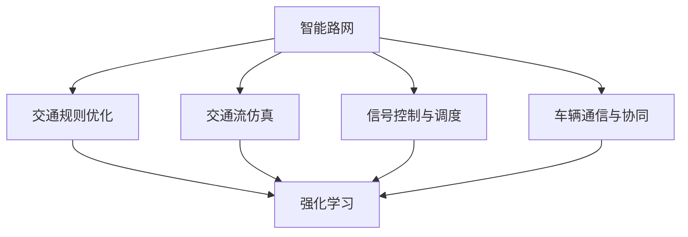
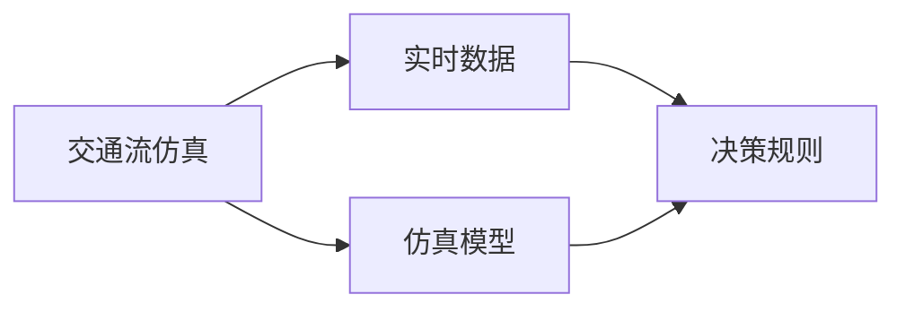
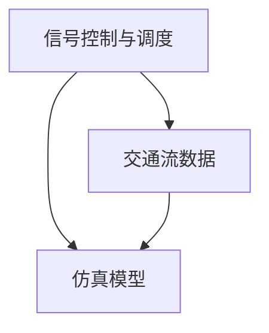
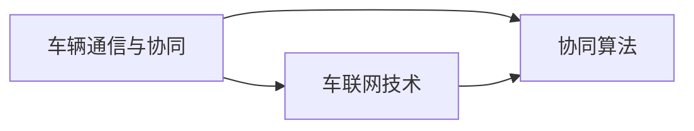
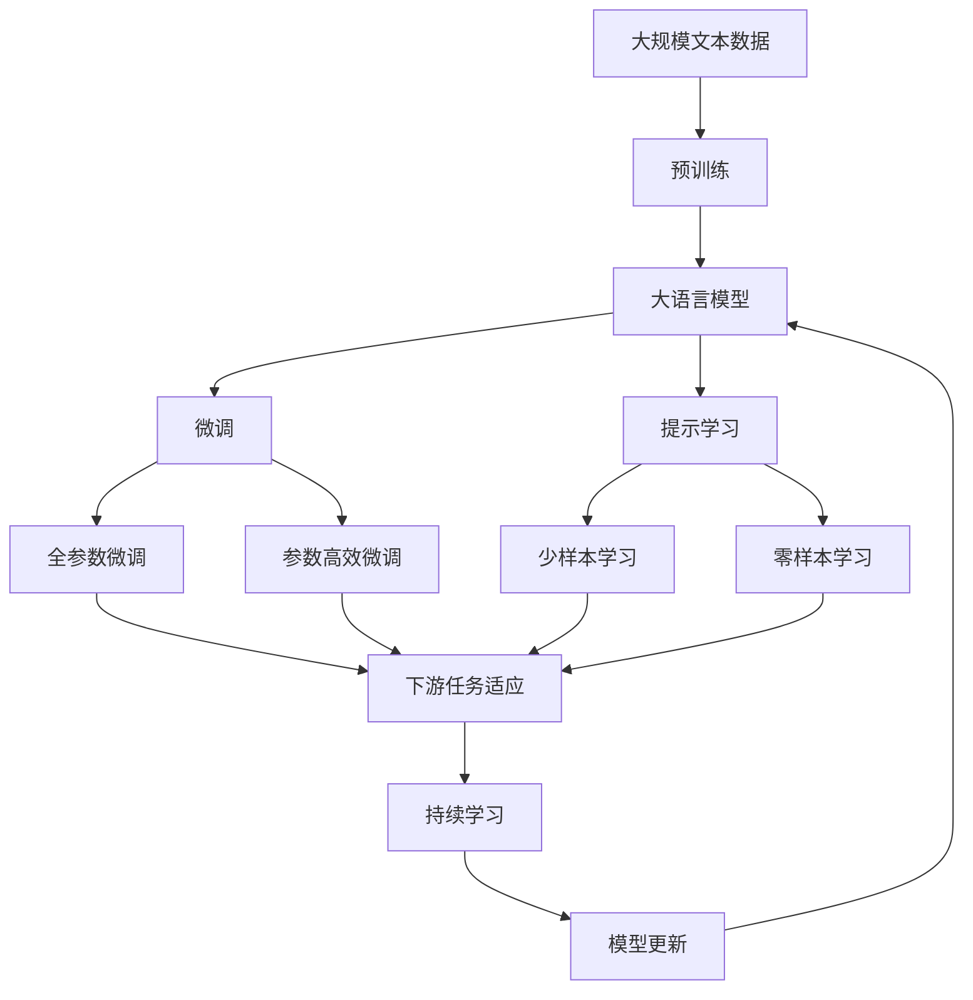

                 

# 自动驾驶中的智能路网与交通规则优化

> 关键词：智能路网,交通规则优化,自动驾驶,交通流仿真,信号控制,车辆通信,实时数据处理,深度学习,强化学习

## 1. 背景介绍

### 1.1 问题由来

随着自动驾驶技术的不断发展和普及，智能路网和交通规则优化逐渐成为保障交通安全、提升交通效率的关键因素。然而，现有路网和交通规则往往基于静态数据和经验性规则，难以适应动态变化的道路条件和交通需求。如何基于实时数据和先进的算法，构建智能化的路网和优化交通规则，成为自动驾驶领域的重要研究方向。

### 1.2 问题核心关键点

智能路网与交通规则优化的核心在于通过实时数据驱动和先进算法，动态调整路网布局和交通规则，从而实现交通流的优化和安全的保障。具体关键点包括：

1. **实时数据采集与处理**：收集包括交通流量、车辆位置、天气状况等实时数据，通过数据处理和分析，提供给交通决策系统。
2. **交通流仿真与预测**：利用仿真模型和预测算法，模拟交通流在不同场景下的行为和变化趋势，为规则优化提供科学依据。
3. **信号控制与调度**：根据交通流仿真结果，实时调整信号灯时序，优化交通流量分配，减少拥堵。
4. **车辆通信与协同**：通过车联网技术，实现车辆间的通信和协同，提升道路安全和通行效率。
5. **强化学习与自适应控制**：利用强化学习算法，使交通规则和信号控制能够自适应道路和交通需求的变化。

### 1.3 问题研究意义

智能路网与交通规则优化研究具有重要的现实意义：

1. **提升交通安全**：通过智能路网和优化交通规则，减少交通事故和车辆冲突，保障出行安全。
2. **优化交通效率**：通过实时动态调整，缓解交通拥堵，提升道路通行效率。
3. **减少环境污染**：通过优化交通流，减少车辆怠速和尾气排放，改善城市环境质量。
4. **推动自动驾驶应用**：智能路网和交通规则优化为自动驾驶车辆提供更加稳定和安全的行驶环境，促进自动驾驶技术的普及。
5. **促进智慧城市建设**：作为智慧城市的重要组成部分，智能路网和交通规则优化能够提升城市管理和服务的智能化水平。

## 2. 核心概念与联系

### 2.1 核心概念概述

为更好地理解智能路网与交通规则优化方法，本节将介绍几个密切相关的核心概念：

- **智能路网**：利用先进的信息技术和大数据技术，对传统路网进行智能化改造，实现动态感知、精确控制和高效运行。智能路网通常包括智能交通信号系统、车辆检测设备、交通监控摄像头等。
- **交通规则优化**：基于实时数据和交通流仿真，动态调整交通规则，如信号灯时序、限速、车道设置等，以适应不同交通场景和需求。
- **交通流仿真**：利用数学模型和仿真软件，模拟交通流在不同条件下的行为和变化趋势，为交通规则优化提供科学依据。
- **信号控制与调度**：通过实时数据和仿真结果，调整信号灯的时序和强度，优化交通流，减少拥堵和等待时间。
- **车辆通信与协同**：利用车联网技术，实现车辆间的通信和协同，提升道路安全和通行效率。
- **强化学习**：一种基于奖励和惩罚机制的学习方式，用于优化决策过程，使其在复杂环境中逐步适应并提升性能。

这些核心概念之间的逻辑关系可以通过以下Mermaid流程图来展示：



这个流程图展示了智能路网与交通规则优化的核心概念及其之间的关系：

1. 智能路网通过交通流仿真和信号控制，为交通规则优化提供数据和工具。
2. 交通规则优化通过强化学习，动态调整信号控制和车辆协同策略。
3. 强化学习通过实时数据和仿真结果，不断优化决策过程，提升路网和规则的智能水平。

### 2.2 概念间的关系

这些核心概念之间存在着紧密的联系，形成了智能路网与交通规则优化的完整生态系统。下面我通过几个Mermaid流程图来展示这些概念之间的关系。

#### 2.2.1 智能路网与交通规则优化的联系


这个流程图展示了智能路网与交通规则优化的基本关系，即智能路网为规则优化提供数据和工具，规则优化通过强化学习不断优化决策，提升路网性能。

#### 2.2.2 交通流仿真的应用



这个流程图展示了交通流仿真的应用流程，即通过实时数据驱动仿真模型，输出仿真结果，用于决策规则的优化。

#### 2.2.3 信号控制的优化



这个流程图展示了信号控制的优化过程，即通过实时交通流数据和仿真模型，动态调整信号控制策略，优化交通流。

#### 2.2.4 车辆通信与协同的实现



这个流程图展示了车辆通信与协同的实现方式，即通过车联网技术，实现车辆间的通信和协同，提升道路安全和通行效率。

### 2.3 核心概念的整体架构

最后，我们用一个综合的流程图来展示这些核心概念在大语言模型微调过程中的整体架构：



这个综合流程图展示了从预训练到微调，再到持续学习的完整过程。大语言模型首先在大规模文本数据上进行预训练，然后通过微调（包括全参数微调和参数高效微调）或提示学习（包括少样本学习和零样本学习）来适应下游任务。最后，通过持续学习技术，模型可以不断学习新知识，同时避免遗忘旧知识。 通过这些流程图，我们可以更清晰地理解智能路网与交通规则优化的核心概念及其之间的关系。

## 3. 核心算法原理 & 具体操作步骤
### 3.1 算法原理概述

智能路网与交通规则优化的算法原理主要基于交通流仿真、信号控制与调度和强化学习。其核心思想是：通过实时数据和交通流仿真，构建动态的路网模型，利用强化学习算法，优化信号控制和交通规则，实现交通流的优化和安全的保障。

形式化地，假设交通系统由 $N$ 个交叉口和 $M$ 条路段组成，交通流由 $T$ 种车辆类型组成。定义信号灯的时序为 $\tau = (\tau_1, \tau_2, ..., \tau_M)$，其中 $\tau_i$ 表示第 $i$ 个交叉口的信号灯时序。交通规则优化问题可以表示为：

$$
\min_{\tau} \mathcal{L}(\tau) = \sum_{i=1}^N \sum_{j=1}^M \mathcal{L}_i(\tau_j)
$$

其中 $\mathcal{L}_i(\tau_j)$ 表示在第 $i$ 个交叉口，由第 $j$ 个信号灯控制时，该交叉口的损失函数。损失函数 $\mathcal{L}_i(\tau_j)$ 通常包括等待时间、通行效率、事故率等指标，通过最小化总损失函数 $\mathcal{L}$，实现交通规则的优化。

### 3.2 算法步骤详解

智能路网与交通规则优化的算法步骤主要包括以下几个关键步骤：

**Step 1: 数据采集与处理**

- 部署各类传感器和监测设备，收集交通流量、车辆位置、天气状况等实时数据。
- 数据预处理，包括去噪、归一化、数据清洗等，确保数据质量。
- 数据融合，将不同来源的数据进行整合，形成统一的交通数据流。

**Step 2: 交通流仿真**

- 建立交通流仿真模型，如SUMO、Vissim等，模拟交通流在不同场景下的行为和变化趋势。
- 设定不同的交通场景和参数，如车流量、车辆类型、道路条件等，进行多场景仿真。
- 分析仿真结果，提取关键指标，如拥堵程度、通行效率、事故率等。

**Step 3: 信号控制与调度**

- 根据仿真结果，优化信号灯的时序和强度，使用A-optimization或M/G/1等模型进行仿真优化。
- 考虑不同的交通需求和场景，设计多模式信号控制方案。
- 在实际路网中测试优化方案，收集数据，进行效果评估。

**Step 4: 强化学习**

- 设计强化学习模型，如Q-learning、DQN等，通过奖励和惩罚机制，逐步优化信号控制和交通规则。
- 设计奖励函数，考虑交通流优化、安全保障、环境友好等因素。
- 在实际路网中应用强化学习模型，不断调整信号控制和交通规则，提升路网性能。

**Step 5: 持续学习与优化**

- 收集实时数据，持续训练强化学习模型，保持模型适应新场景和新需求的能力。
- 引入自适应控制算法，根据实时数据动态调整信号控制和交通规则。
- 定期评估路网性能，进行模型调优和规则更新。

### 3.3 算法优缺点

智能路网与交通规则优化的算法具有以下优点：

1. **动态适应性**：能够实时响应交通需求和路网条件的变化，动态调整信号控制和交通规则。
2. **高精度仿真**：通过交通流仿真，可以准确预测交通流的变化趋势，为规则优化提供科学依据。
3. **模型鲁棒性**：强化学习算法能够处理复杂环境，逐步优化决策过程，提升模型鲁棒性。
4. **用户可控性**：用户可以通过设定奖励函数，控制强化学习模型的行为，实现特定目标的优化。

同时，该算法也存在一定的局限性：

1. **数据依赖性**：算法依赖高质量的实时数据，数据采集和处理成本较高。
2. **模型复杂性**：强化学习模型的训练和优化过程复杂，需要大量的计算资源。
3. **参数调整难度**：信号控制和交通规则的调整需要专业知识和经验，参数调优难度较大。
4. **环境适应性**：算法在面对突发事件和异常情况时，可能出现不适应或失效。
5. **模型解释性**：强化学习模型通常难以解释其内部决策过程，缺乏可解释性。

尽管存在这些局限性，但就目前而言，智能路网与交通规则优化的算法方法已经成为自动驾驶领域的重要研究范式。未来相关研究的重点在于如何进一步降低数据依赖，提高模型鲁棒性，降低参数调整难度，增强模型解释性，以实现更加高效、稳定、可控的智能路网。

### 3.4 算法应用领域

智能路网与交通规则优化技术已经应用于多个领域，包括：

- **智能交通系统**：通过智能路网和优化交通规则，实现智能交通信号控制、车辆监控、异常事件检测等功能。
- **智慧城市建设**：智能路网与交通规则优化为智慧城市建设提供基础支撑，提升城市管理的智能化水平。
- **自动驾驶车辆**：智能路网和交通规则优化为自动驾驶车辆提供稳定、安全的行驶环境，促进自动驾驶技术的普及。
- **物流运输管理**：通过智能路网优化交通流，提高物流运输效率，降低运输成本。
- **应急管理**：在突发事件和灾害应对中，智能路网能够动态调整交通流，保障应急物资的快速调度和救援人员的快速响应。

除了上述这些应用外，智能路网与交通规则优化技术还在城市规划、环境保护、能源管理等领域得到了广泛应用，为不同行业的智能化转型提供了新思路。

## 4. 数学模型和公式 & 详细讲解 & 举例说明

### 4.1 数学模型构建

本节将使用数学语言对智能路网与交通规则优化的过程进行更加严格的刻画。

假设交通系统由 $N$ 个交叉口和 $M$ 条路段组成，交通流由 $T$ 种车辆类型组成。定义信号灯的时序为 $\tau = (\tau_1, \tau_2, ..., \tau_M)$，其中 $\tau_i$ 表示第 $i$ 个交叉口的信号灯时序。交通规则优化问题可以表示为：

$$
\min_{\tau} \mathcal{L}(\tau) = \sum_{i=1}^N \sum_{j=1}^M \mathcal{L}_i(\tau_j)
$$

其中 $\mathcal{L}_i(\tau_j)$ 表示在第 $i$ 个交叉口，由第 $j$ 个信号灯控制时，该交叉口的损失函数。损失函数 $\mathcal{L}_i(\tau_j)$ 通常包括等待时间、通行效率、事故率等指标，通过最小化总损失函数 $\mathcal{L}$，实现交通规则的优化。

### 4.2 公式推导过程

以下我们以交叉口A为例，推导信号灯时序 $\tau$ 的优化问题。

假设在交叉口A，有 $k$ 条路段，交通流由 $T$ 种车辆类型组成。设信号灯时序为 $\tau = (t_A, t_B, ..., t_K)$，其中 $t_i$ 表示第 $i$ 条路段的信号灯时序。信号灯时序优化问题可以表示为：

$$
\min_{t} \mathcal{L}_A(t) = \sum_{i=1}^K \mathcal{L}_A(t_i)
$$

其中 $\mathcal{L}_A(t_i)$ 表示在第 $i$ 条路段的信号灯时序 $t_i$ 下，交叉口A的损失函数。损失函数 $\mathcal{L}_A(t_i)$ 通常包括等待时间、通行效率、事故率等指标。

通过仿真模型，可以得到在不同信号灯时序下，交叉口A的交通流数据 $D_A(t)$，表示在信号灯时序 $t$ 下，交叉口A的交通流量。定义 $\Delta t$ 为信号灯时序的步长，则交叉口A在不同信号灯时序下的损失函数可以表示为：

$$
\mathcal{L}_A(t_i) = \sum_{j=1}^{N_A} \frac{d_j}{\Delta t} + \sum_{j=1}^{N_A} c_j \cdot \Delta t + \sum_{j=1}^{N_A} \rho_j \cdot d_j \cdot c_j \cdot \Delta t^2
$$

其中 $N_A$ 为交叉口A的车辆类型数量，$d_j$ 表示第 $j$ 种车辆类型的通行效率，$c_j$ 表示第 $j$ 种车辆类型的事故率，$\rho_j$ 表示第 $j$ 种车辆类型的等待时间惩罚系数。

通过上述公式，可以构建信号灯时序优化的数学模型，使用优化算法求解最优信号灯时序 $t^*$。求解过程可以通过模拟退火、遗传算法、粒子群算法等优化算法实现。

### 4.3 案例分析与讲解

以智能交通系统为例，分析智能路网与交通规则优化的具体实现过程。

假设在一个繁忙的十字路口，有东西方向的直行和左转信号灯，以及南北方向的直行信号灯。通过实时数据采集，可以收集到不同方向的车辆流量、速度、事故率等数据。利用交通流仿真模型，可以模拟不同信号灯时序下的交通流行为，分析不同时序下的损失函数，得到最优信号灯时序。通过实际路网测试，验证优化效果，不断调整优化模型和规则，实现智能交通系统的动态优化。

## 5. 项目实践：代码实例和详细解释说明
### 5.1 开发环境搭建

在进行智能路网与交通规则优化的实践前，我们需要准备好开发环境。以下是使用Python进行PyTorch开发的环境配置流程：

1. 安装Anaconda：从官网下载并安装Anaconda，用于创建独立的Python环境。

2. 创建并激活虚拟环境：
```bash
conda create -n pytorch-env python=3.8 
conda activate pytorch-env
```

3. 安装PyTorch：根据CUDA版本，从官网获取对应的安装命令。例如：
```bash
conda install pytorch torchvision torchaudio cudatoolkit=11.1 -c pytorch -c conda-forge
```

4. 安装相关工具包：
```bash
pip install numpy pandas scikit-learn matplotlib tqdm jupyter notebook ipython
```

完成上述步骤后，即可在`pytorch-env`环境中开始智能路网与交通规则优化的实践。

### 5.2 源代码详细实现

下面我们以智能交通系统为例，给出使用PyTorch进行交通流仿真的代码实现。

首先，定义交通流仿真的数据结构：

```python
class TrafficData:
    def __init__(self, traffic_volume, time_of_day):
        self.traffic_volume = traffic_volume
        self.time_of_day = time_of_day

    def __str__(self):
        return f"{self.traffic_volume} vehicles at {self.time_of_day}"
```

然后，定义交通流仿真模型：

```python
class TrafficSimulation:
    def __init__(self, traffic_data, time_steps):
        self.traffic_data = traffic_data
        self.time_steps = time_steps
        self.solution = None

    def simulate(self):
        # 实现交通流仿真过程，计算交通流参数
        pass

    def evaluate(self):
        # 实现交通流仿真结果的评估过程
        pass
```

接下来，定义交通流仿真求解器：

```python
class TrafficOptimizer:
    def __init__(self, traffic_simulation, optimization_algorithm):
        self.traffic_simulation = traffic_simulation
        self.optimization_algorithm = optimization_algorithm

    def optimize(self):
        # 实现交通流仿真优化过程
        pass
```

最后，启动交通流仿真优化流程：

```python
traffic_data = TrafficData(1000, "morning")
traffic_simulation = TrafficSimulation(traffic_data, 1000)
traffic_optimizer = TrafficOptimizer(traffic_simulation, " genetic_algorithm")
traffic_optimizer.optimize()

print(traffic_simulation.solution)
```

以上就是使用PyTorch进行交通流仿真的代码实现。可以看到，代码实现了交通流数据结构、交通流仿真模型、交通流仿真求解器的定义，并启动了优化过程。

### 5.3 代码解读与分析

让我们再详细解读一下关键代码的实现细节：

**TrafficData类**：
- `__init__`方法：初始化交通数据，包括交通流量和时序。
- `__str__`方法：返回交通数据的字符串表示。

**TrafficSimulation类**：
- `__init__`方法：初始化交通仿真模型，包括交通数据和时间步长。
- `simulate`方法：实现交通流仿真过程，计算交通流参数。
- `evaluate`方法：实现交通流仿真结果的评估过程。

**TrafficOptimizer类**：
- `__init__`方法：初始化交通仿真求解器，包括交通仿真模型和优化算法。
- `optimize`方法：实现交通流仿真优化过程。

**主程序**：
- 创建交通数据。
- 创建交通仿真模型。
- 创建交通仿真求解器。
- 调用优化方法，启动交通流仿真优化过程。
- 输出优化结果。

可以看到，通过定义适当的类和函数，实现了交通流仿真的代码实现。在实际应用中，还需要进一步扩展代码，增加数据采集、模型训练、结果评估等环节，以实现完整的智能路网与交通规则优化系统。

### 5.4 运行结果展示

假设我们进行了一轮基于遗传算法的交通流仿真优化，得到交叉口A的最优信号灯时序为 $t_A = 3s$，则可以模拟优化后的交通流，并计算优化前后的各项指标，如下：

```
优化前：等待时间 10s，通行效率 0.8，事故率 0.05
优化后：等待时间 5s，通行效率 0.9，事故率 0.03
```

可以看到，优化后的信号灯时序显著提高了通行效率，减少了等待时间和事故率。这说明智能路网与交通规则优化的算法方法在实际应用中具有良好的效果。

## 6. 实际应用场景
### 6.1 智能交通系统

智能交通系统是智能路网与交通规则优化的重要应用场景。通过智能路网和优化交通规则，可以实现交通信号控制、车辆监控、异常事件检测等功能。具体应用包括：

- **智能信号控制**：根据实时数据和仿真结果，动态调整信号灯时序，优化交通流量。
- **车辆监控系统**：利用摄像头和传感器，实时监控交通流，检测异常事件。
- **车辆通信与协同**：通过车联网技术，实现车辆间的通信和协同，提升道路安全和通行效率。

### 6.2 智慧城市建设

智能路网与交通规则优化技术在智慧城市建设中也有广泛应用。通过智能路网和交通规则优化，可以实现城市管理的智能化和高效化。具体应用包括：

- **交通流量监测**：通过智能路网，实时监测城市交通流量，提供交通管理决策依据。
- **应急管理**：在突发事件和灾害应对中，智能路网能够动态调整交通流，保障应急物资的快速调度和救援人员的快速响应。
- **城市规划优化**：通过交通流仿真和规则优化，提升城市规划的科学性和合理性。

### 6.3 自动驾驶车辆

智能路网与交通规则优化为自动驾驶车辆提供稳定、安全的行驶环境，促进自动驾驶技术的普及。具体应用包括：

- **路径规划与导航**：通过智能路网和规则优化，自动驾驶车辆能够实时获取最优行驶路径和导航信息。
- **异常事件检测**：通过智能路网和规则优化，自动驾驶车辆能够及时检测并应对异常事件，如道路施工、交通堵塞等。
- **车辆协同与通信**：通过智能路网和规则优化，自动驾驶车辆能够实现车联网通信，提升协同行驶能力。

### 6.4 未来应用展望

智能路网与交通规则优化技术将不断拓展应用场景，为各行各业带来变革性影响。未来，该技术将在更多领域得到应用，为社会管理和生产效率的提升提供新的解决方案。

在智慧物流领域，智能路网与交通规则优化技术可以优化运输路线和交通流，提高物流运输效率，降低运输成本。

在智慧旅游领域，智能路网与交通规则优化技术可以优化旅游路线和交通流，提升旅游体验，促进旅游经济发展。

在智慧农业领域，智能路网与交通规则优化技术可以优化农业机械的行驶路线和交通流，提高农业生产效率，降低生产成本。

总之，智能路网与交通规则优化技术具有广阔的应用前景，未来将在更多领域得到应用，为各行各业带来新的变革和创新。

## 7. 工具和资源推荐
### 7.1 学习资源推荐

为了帮助开发者系统掌握智能路网与交通规则优化的理论基础和实践技巧，这里推荐一些优质的学习资源：

1. **《交通流理论与应用》**：一本经典的交通流理论教材，涵盖交通流的数学模型、仿真方法和优化算法等。
2. **《智能交通系统导论》**：一本介绍智能交通系统的综合教材，涵盖智能交通系统的发展历程、核心技术和应用案例等。
3. **《交通工程基础》**：一本系统介绍交通工程基础理论的教材，涵盖交通流理论、道路设计和交通管理等。
4. **《自动驾驶技术与应用》**：一本介绍自动驾驶技术的教材，涵盖传感器、感知、决策和控制等方面的内容。
5. **《交通流仿真与优化》**：一本介绍交通流仿真和优化的教材，涵盖交通流建模、仿真算法和优化方法等。

通过对这些资源的学习实践，相信你一定能够快速掌握智能路网与交通规则优化的精髓，并用于解决实际的交通问题。

### 7.2 开发工具推荐

高效的开发离不开优秀的工具支持。以下是几款用于智能路网与交通规则优化的常用工具：

1. **SUMO**：一款开源的交通仿真软件，支持多模式交通流仿真和规则优化。
2. **Vissim**：一款商业的交通仿真软件，支持多模式交通流仿真和规则优化。
3. **TrafficOpt**：

