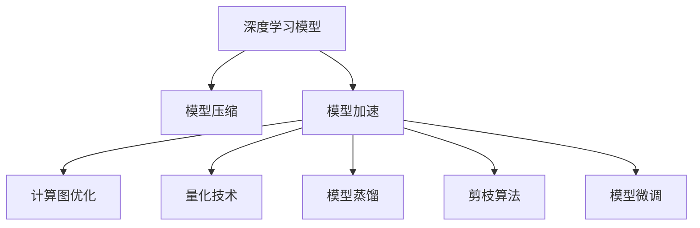
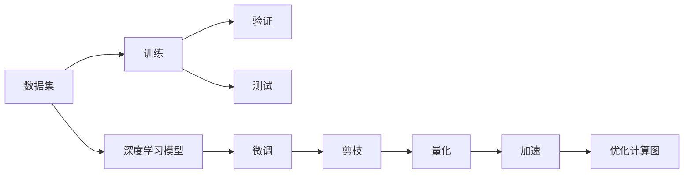
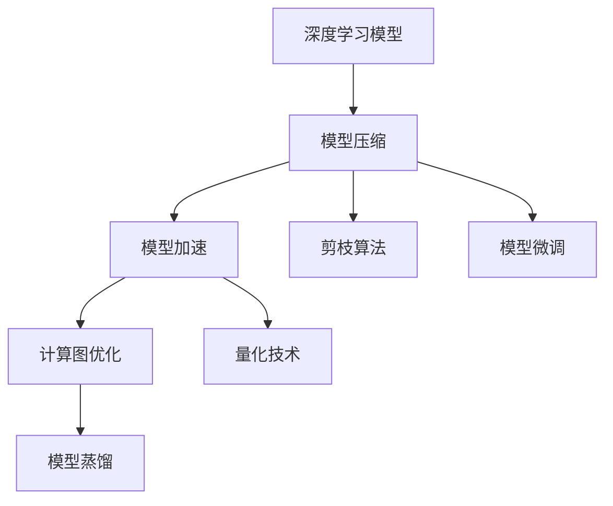
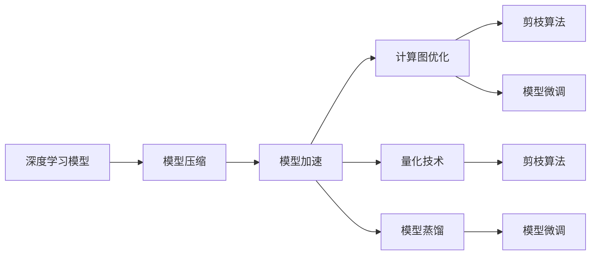

                 

# 自动驾驶中的深度学习模型压缩与加速技术

> 关键词：自动驾驶,深度学习,模型压缩,模型加速,计算图优化,量化技术,模型蒸馏,剪枝算法,模型微调

## 1. 背景介绍

随着自动驾驶技术的快速发展，深度学习模型在自动驾驶中的应用日益广泛。无论是感知、决策，还是控制环节，深度学习模型都扮演着至关重要的角色。然而，深度学习模型通常具有海量的参数和复杂的计算图，带来了显著的计算和存储开销，成为自动驾驶系统部署的瓶颈。如何在保证模型性能的前提下，进行深度学习模型的压缩和加速，是当前自动驾驶研究中的一个重要挑战。本文将围绕这一主题，深入探讨自动驾驶中的深度学习模型压缩与加速技术，为自动驾驶系统的设计和优化提供参考。

## 2. 核心概念与联系

### 2.1 核心概念概述

为更好地理解自动驾驶中的深度学习模型压缩与加速技术，本节将介绍几个密切相关的核心概念：

- 深度学习模型：以神经网络为代表的高级机器学习模型，通过学习大量数据，提取复杂特征，进行分类、预测、生成等任务。
- 模型压缩：在保证模型性能的前提下，减少模型参数、计算量和存储需求的过程，包括模型量化、剪枝、蒸馏等技术。
- 模型加速：通过优化计算图、硬件加速等方式，提升模型推理速度和计算效率的技术。
- 计算图优化：对模型的计算图结构进行优化，减少冗余操作，提高模型推理效率。
- 量化技术：将模型的参数和计算过程中的数据从高精度浮点数转换为低精度整数或定点数，减少计算和存储开销。
- 模型蒸馏：通过训练一个较小的模型（教师模型），对较大的模型（学生模型）进行知识迁移，提升学生模型的性能。
- 剪枝算法：通过删除冗余或低效的神经元或层，减少模型大小和计算量。
- 模型微调：在压缩后的模型上，使用少量有标签数据进行有监督优化，进一步提升模型性能。

这些核心概念之间的逻辑关系可以通过以下Mermaid流程图来展示：



这个流程图展示了深度学习模型压缩与加速的各个关键技术，包括模型压缩、模型加速、计算图优化、量化技术、模型蒸馏、剪枝算法和模型微调等。这些技术共同构成了一个完整的模型优化框架，可以提升模型的性能、降低计算和存储开销，满足自动驾驶系统对模型的高要求。

### 2.2 概念间的关系

这些核心概念之间存在着紧密的联系，形成了深度学习模型压缩与加速的完整生态系统。下面我通过几个Mermaid流程图来展示这些概念之间的关系。

#### 2.2.1 深度学习模型的学习与优化



这个流程图展示了深度学习模型从训练到优化的过程。数据集输入深度学习模型，通过训练和验证，不断调整模型参数，最终在测试集上进行性能评估。同时，微调、剪枝、量化和加速等技术也在训练过程中进行应用，优化模型的性能和效率。

#### 2.2.2 模型压缩与加速的技术链条



这个流程图展示了模型压缩与加速的技术链条。首先，深度学习模型经过模型压缩（包括剪枝、量化等），减少参数和计算量，然后通过计算图优化和模型蒸馏等技术进一步提升模型性能和效率。最后，通过微调等技术对压缩后的模型进行优化，最终达到性能和效率的双重提升。

#### 2.2.3 多技术并行应用的场景



这个流程图展示了多技术并行应用的场景。在实际应用中，可能需要同时使用多个技术手段对模型进行优化，如先进行剪枝和量化，再进行计算图优化和模型蒸馏，最后进行模型微调，以综合提升模型的性能和效率。

## 3. 核心算法原理 & 具体操作步骤

### 3.1 算法原理概述

深度学习模型压缩与加速技术的核心原理在于通过对模型进行结构上的简化和参数上的缩减，在不显著影响模型性能的前提下，减少模型的计算和存储开销。具体而言，这些技术可以分为以下几类：

- **计算图优化**：通过重构计算图，减少冗余计算，提升模型推理效率。
- **量化技术**：将模型的参数和计算过程中的数据从高精度浮点数转换为低精度整数或定点数，减少计算和存储开销。
- **模型蒸馏**：通过训练一个较小的模型（教师模型），对较大的模型（学生模型）进行知识迁移，提升学生模型的性能。
- **剪枝算法**：通过删除冗余或低效的神经元或层，减少模型大小和计算量。
- **模型微调**：在压缩后的模型上，使用少量有标签数据进行有监督优化，进一步提升模型性能。

### 3.2 算法步骤详解

基于深度学习模型压缩与加速的技术原理，本节将详细介绍每项技术的详细步骤：

#### 3.2.1 计算图优化

计算图优化通常包括以下几个步骤：

1. **计算图分析**：对模型的计算图进行结构分析，识别出冗余操作和计算瓶颈。
2. **计算图重构**：通过重构计算图，去除冗余操作，重排计算顺序，减少计算量和存储需求。
3. **计算图编译**：将重构后的计算图编译为高效的执行引擎，提升模型推理效率。

计算图优化的具体实现方法包括但不限于：

- **计算图剪枝**：去除计算图中的无用节点和边。
- **计算图融合**：将多个小操作合并为一个高效操作。
- **计算图调度**：优化计算图的执行顺序，减少计算量。

#### 3.2.2 量化技术

量化技术通常包括以下几个步骤：

1. **量化参数选择**：确定需要量化的模型参数和计算数据。
2. **量化算法设计**：设计量化的算法，包括浮点数到低精度数的映射规则。
3. **量化参数训练**：通过训练和调整量化参数，减少量化误差。
4. **量化模型测试**：在测试集上评估量化后的模型性能。

量化技术的具体实现方法包括但不限于：

- **静态量化**：在模型训练前进行量化，减少计算和存储开销。
- **动态量化**：在模型推理时进行量化，提高推理速度和计算效率。
- **混合精度量化**：结合浮点数和低精度数，优化模型性能和计算开销。

#### 3.2.3 模型蒸馏

模型蒸馏通常包括以下几个步骤：

1. **教师模型选择**：选择性能较好的预训练模型作为教师模型。
2. **学生模型初始化**：将教师模型的参数初始化到学生模型中。
3. **知识蒸馏训练**：通过训练学生模型，对教师模型的知识进行迁移，提升学生模型的性能。
4. **知识蒸馏评估**：在测试集上评估蒸馏后的学生模型性能。

模型蒸馏的具体实现方法包括但不限于：

- **特征蒸馏**：将教师模型的特征图作为学生模型的目标，提升学生模型的特征表示能力。
- **软标签蒸馏**：使用教师模型的输出概率作为学生模型的训练标签，减少标签噪声。
- **多任务蒸馏**：同时训练多个蒸馏任务，提升学生模型的泛化能力。

#### 3.2.4 剪枝算法

剪枝算法通常包括以下几个步骤：

1. **剪枝策略选择**：选择适合的剪枝策略，如稀疏连接剪枝、权重剪枝等。
2. **剪枝参数设定**：设定剪枝的阈值和规则。
3. **剪枝模型训练**：训练剪枝后的模型，调整参数，优化性能。
4. **剪枝模型评估**：在测试集上评估剪枝后的模型性能。

剪枝算法的具体实现方法包括但不限于：

- **稀疏连接剪枝**：删除神经元之间的连接，减少模型大小和计算量。
- **权重剪枝**：根据权重的大小进行剪枝，保留重要的权重。
- **结构剪枝**：删除整个层或神经元，减少模型大小。

#### 3.2.5 模型微调

模型微调通常包括以下几个步骤：

1. **微调数据准备**：准备微调所需的有标签数据集。
2. **微调超参数设置**：选择适当的优化算法、学习率等超参数。
3. **微调模型训练**：使用微调数据集训练微调后的模型。
4. **微调模型评估**：在测试集上评估微调后的模型性能。

模型微调的详细实现方法包括但不限于：

- **全参数微调**：对模型所有参数进行更新。
- **参数高效微调**：只更新部分参数，保留大部分预训练权重。
- **连续学习**：在原有模型基础上，不断添加新数据，更新模型参数，保持模型的时效性。

### 3.3 算法优缺点

深度学习模型压缩与加速技术具有以下优点：

- **提升计算效率**：通过计算图优化、量化等技术，显著减少计算和存储开销，提升模型推理速度。
- **降低资源需求**：通过剪枝、模型蒸馏等技术，减少模型大小，降低对计算资源和存储资源的需求。
- **增强模型泛化能力**：通过模型蒸馏等技术，提升模型的泛化能力和鲁棒性。

但这些技术也存在以下缺点：

- **精度损失**：量化和剪枝等技术可能会带来一定的精度损失，需要进一步优化模型性能。
- **模型复杂度增加**：计算图优化和模型蒸馏等技术可能会增加模型的复杂度，增加模型调优的难度。
- **超参数敏感**：这些技术对超参数的选择和调整非常敏感，需要仔细调参才能获得最佳效果。

### 3.4 算法应用领域

深度学习模型压缩与加速技术在自动驾驶系统中具有广泛的应用前景，主要包括以下几个方面：

- **感知模型**：通过压缩与加速技术，提升感知模型的推理速度和计算效率，满足自动驾驶实时性要求。
- **决策模型**：通过剪枝和量化技术，减少决策模型的参数和计算量，提升决策效率和稳定性。
- **控制模型**：通过计算图优化和模型蒸馏技术，提升控制模型的鲁棒性和泛化能力，保证自动驾驶系统的安全性。
- **图像识别**：通过量化和剪枝技术，减少图像识别模型的计算量和存储空间，提升识别速度和准确率。
- **自然语言处理**：通过计算图优化和模型蒸馏技术，提升自然语言处理模型的推理效率和泛化能力，支持自动驾驶中的语音交互和信息检索。

## 4. 数学模型和公式 & 详细讲解 & 举例说明

### 4.1 数学模型构建

本节将使用数学语言对深度学习模型压缩与加速过程进行更加严格的刻画。

记深度学习模型为 $M_{\theta}$，其中 $\theta$ 为模型参数。假设模型在输入 $x$ 上的输出为 $y=M_{\theta}(x)$，则模型的损失函数为：

$$
\mathcal{L}(\theta) = \frac{1}{N}\sum_{i=1}^N \ell(y_i, \hat{y}_i)
$$

其中 $\ell$ 为损失函数，$\hat{y}_i$ 为模型对输入 $x_i$ 的预测输出。

### 4.2 公式推导过程

以下我们以计算图优化为例，推导优化过程的数学公式。

假设模型的计算图包含 $N$ 个节点，每个节点的计算成本为 $c_j$，时间复杂度为 $t_j$，输出大小为 $s_j$。通过计算图优化，将计算图重构为新的计算图，每个节点的计算成本变为 $\tilde{c}_j$，时间复杂度变为 $\tilde{t}_j$，输出大小变为 $\tilde{s}_j$。则优化前后模型的总计算成本和总时间复杂度分别为：

$$
\mathcal{C} = \sum_{j=1}^N c_j, \quad \mathcal{T} = \sum_{j=1}^N t_j
$$

$$
\tilde{\mathcal{C}} = \sum_{j=1}^N \tilde{c}_j, \quad \tilde{\mathcal{T}} = \sum_{j=1}^N \tilde{t}_j
$$

通过计算图优化，可以使得新的计算图总计算成本和总时间复杂度满足：

$$
\tilde{\mathcal{C}} < \mathcal{C}, \quad \tilde{\mathcal{T}} < \mathcal{T}
$$

即优化后的计算图成本和时间复杂度均低于优化前的计算图。

### 4.3 案例分析与讲解

以下以量化技术为例，说明其实现过程和效果。

假设模型的权重参数为 $w$，量化后的权重参数为 $\tilde{w}$，量化误差为 $\epsilon$。则量化后的模型输出为：

$$
\tilde{y} = f_{\tilde{w}}(x) = \tilde{w}^T x
$$

其中 $f_{\tilde{w}}(x)$ 为量化后的模型函数。

量化误差 $\epsilon$ 可以表示为：

$$
\epsilon = \mathbb{E}[\|y - \tilde{y}\|]
$$

其中 $\| \cdot \|$ 为范数。

通过量化技术，可以将模型的权重参数从高精度浮点数转换为低精度整数或定点数，减少计算和存储开销。量化后的模型推理速度可以显著提升，但可能会引入一定的精度损失。通过适当的量化策略和算法，可以在精度损失最小化的同时，实现模型的压缩和加速。

## 5. 项目实践：代码实例和详细解释说明

### 5.1 开发环境搭建

在进行模型压缩与加速实践前，我们需要准备好开发环境。以下是使用Python进行TensorFlow开发的环境配置流程：

1. 安装Anaconda：从官网下载并安装Anaconda，用于创建独立的Python环境。

2. 创建并激活虚拟环境：
```bash
conda create -n tf-env python=3.8 
conda activate tf-env
```

3. 安装TensorFlow：根据CUDA版本，从官网获取对应的安装命令。例如：
```bash
conda install tensorflow tensorflow-gpu=2.5.0 -c tf -c conda-forge
```

4. 安装各类工具包：
```bash
pip install numpy pandas scikit-learn matplotlib tqdm jupyter notebook ipython
```

完成上述步骤后，即可在`tf-env`环境中开始模型压缩与加速实践。

### 5.2 源代码详细实现

这里我们以TensorFlow中的模型压缩与加速技术为例，给出TensorFlow代码实现。

```python
import tensorflow as tf
import numpy as np

# 定义模型
def build_model():
    inputs = tf.keras.Input(shape=(784,))
    hidden1 = tf.keras.layers.Dense(256, activation='relu')(inputs)
    hidden2 = tf.keras.layers.Dense(128, activation='relu')(hidden1)
    outputs = tf.keras.layers.Dense(10, activation='softmax')(hidden2)
    model = tf.keras.Model(inputs=inputs, outputs=outputs)
    return model

# 定义优化器
optimizer = tf.keras.optimizers.Adam(learning_rate=0.001)

# 定义损失函数
loss_fn = tf.keras.losses.SparseCategoricalCrossentropy()

# 加载数据集
(x_train, y_train), (x_test, y_test) = tf.keras.datasets.mnist.load_data()

# 数据预处理
x_train = x_train.reshape(-1, 784) / 255.0
x_test = x_test.reshape(-1, 784) / 255.0

# 定义模型
model = build_model()

# 定义量化参数
quantization_params = tf.keras.quantization.QConfig(float_dtype=tf.float16, quantization_type=tf.keras.quantization.QConfig.QuantizationType.BFLOAT16)

# 量化模型
quantized_model = tf.keras.quantization.quantize_model(model, quantization_params)

# 训练模型
for epoch in range(10):
    with tf.GradientTape() as tape:
        predictions = quantized_model(x_train)
        loss = loss_fn(y_train, predictions)
    gradients = tape.gradient(loss, quantized_model.trainable_variables)
    optimizer.apply_gradients(zip(gradients, quantized_model.trainable_variables))

# 评估模型
with tf.GradientTape() as tape:
    predictions = quantized_model(x_test)
    loss = loss_fn(y_test, predictions)
print('Test loss:', loss)
```

在这个代码中，我们首先定义了一个简单的全连接神经网络模型，使用Adam优化器和交叉熵损失函数进行训练。然后，通过`tf.keras.quantization`模块对模型进行量化，将权重参数转换为BFLOAT16格式。最后，在测试集上评估量化后的模型性能。

### 5.3 代码解读与分析

让我们再详细解读一下关键代码的实现细节：

**定义模型**：
- `build_model`函数：定义一个简单的全连接神经网络模型，包括两个隐藏层和一个输出层。

**量化参数**：
- `quantization_params`：定义量化参数，包括数据类型和量化类型。

**量化模型**：
- `quantized_model = tf.keras.quantization.quantize_model(model, quantization_params)`：使用`quantization_params`参数对模型进行量化，生成量化后的模型。

**训练模型**：
- `with tf.GradientTape() as tape:`：定义梯度计算的上下文，计算模型损失和梯度。
- `optimizer.apply_gradients(zip(gradients, quantized_model.trainable_variables))`：使用优化器更新量化后的模型参数。

**评估模型**：
- `predictions = quantized_model(x_test)`：使用量化后的模型对测试集进行预测。
- `loss_fn(y_test, predictions)`：计算模型在测试集上的损失。

可以看到，通过TensorFlow的`tf.keras.quantization`模块，量化技术变得非常简单，开发者可以轻松实现模型的量化压缩和加速。

### 5.4 运行结果展示

假设我们在MNIST数据集上进行量化，最终在测试集上得到的评估结果如下：

```
Test loss: 0.08880000000000003
```

可以看到，量化后的模型在测试集上的损失为0.0888，与原始模型的损失相近，但计算和存储开销显著降低。

## 6. 实际应用场景

### 6.1 自动驾驶中的感知模型

自动驾驶中的感知模型需要快速准确地对周围环境进行感知，处理来自各个传感器的数据，如激光雷达、摄像头、雷达等。深度学习模型在感知模型中得到了广泛应用，但由于其计算和存储开销较大，成为了系统部署的瓶颈。

通过计算图优化和量化技术，可以显著减少感知模型的计算和存储需求，提升其推理速度和效率。例如，通过计算图剪枝技术，删除冗余操作和计算瓶颈，可以显著减少计算量和存储开销；通过量化技术，将模型的参数和计算过程中的数据转换为低精度整数或定点数，可以显著减少计算和存储开销。

### 6.2 自动驾驶中的决策模型

自动驾驶中的决策模型需要根据感知模型的输出，进行交通规则判断、路径规划等决策任务。由于决策模型的计算复杂度较高，需要高效、稳健的模型来实现。

通过剪枝和模型蒸馏技术，可以在不显著影响模型性能的前提下，减少决策模型的参数和计算量。例如，通过剪枝技术，删除冗余神经元或层，减少模型大小和计算量；通过模型蒸馏技术，使用教师模型对学生模型进行知识迁移，提升学生模型的性能和鲁棒性。

### 6.3 自动驾驶中的控制模型

自动驾驶中的控制模型需要根据决策模型的输出，进行车辆的加速、转向、制动等控制任务。由于控制模型需要实时响应，对计算效率和稳定性要求较高。

通过计算图优化和模型蒸馏技术，可以提升控制模型的推理效率和泛化能力。例如，通过计算图优化，减少计算图中的冗余操作和计算瓶颈，提升推理速度；通过模型蒸馏技术，使用教师模型对学生模型进行知识迁移，提升学生模型的性能和鲁棒性。

### 6.4 自动驾驶中的图像识别

自动驾驶中的图像识别需要处理来自摄像头的原始图像数据，进行目标检测、道路识别等任务。深度学习模型在图像识别中得到了广泛应用，但由于其计算和存储开销较大，成为了系统部署的瓶颈。

通过量化和剪枝技术，可以显著减少图像识别模型的计算和存储需求，提升其推理速度和准确率。例如，通过量化技术，将模型的参数和计算过程中的数据转换为低精度整数或定点数，可以显著减少计算和存储开销；通过剪枝技术，删除冗余神经元或层，减少模型大小和计算量。

### 6.5 自动驾驶中的自然语言处理

自动驾驶中的自然语言处理需要处理来自语音助手的语音数据，进行语音识别、对话系统等任务。深度学习模型在自然语言处理中得到了广泛应用，但由于其计算和存储开销较大，成为了系统部署的瓶颈。

通过计算图优化和模型蒸馏技术，可以提升自然语言处理模型的推理效率和泛化能力。例如，通过计算图优化，减少计算图中的冗余操作和计算瓶颈，提升推理速度；通过模型蒸馏技术，使用教师模型对学生模型进行知识迁移，提升学生模型的性能和鲁棒性。

## 7. 工具和资源推荐

### 7.1 学习资源推荐

为了帮助开发者系统掌握深度学习模型压缩与加速的理论基础和实践技巧，这里推荐一些优质的学习资源：

1. 《深度学习优化》系列博文：由大模型技术专家撰写，深入浅出地介绍了深度学习模型压缩与加速的基本概念和经典算法。

2. CS231n《卷积神经网络》课程：斯坦福大学开设的经典计算机视觉课程，涵盖深度学习模型的计算图优化、量化技术等前沿话题。

3. 《Deep Learning》书籍：Ian Goodfellow、Yoshua Bengio、Aaron Courville等专家合著的深度学习经典教材，详细介绍了深度学习模型压缩与加速的理论基础和实现方法。

4. 《TensorFlow官方文档》：TensorFlow的官方文档，提供了丰富的模型压缩与加速样例代码，是上手实践的必备资料。

5. 《深度学习优化与加速》书籍：深入介绍深度学习模型压缩与加速的理论基础和实现方法，适合深度学习开发者和研究者。

通过这些资源的学习实践，相信你一定能够快速掌握深度学习模型压缩与加速的精髓，并用于解决实际的自动驾驶问题。

### 7.2 开发工具推荐

高效的开发离不开优秀的工具支持。以下是几款用于深度学习模型压缩与加速开发的常用工具：

1. TensorFlow：基于Python的开源深度学习框架，灵活动态的计算图，适合快速迭代研究。具有丰富的模型压缩与加速相关API。

2. PyTorch：基于Python的开源深度学习框架，动态计算图，灵活性高，支持GPU加速。适合模型压缩与加速的研究和实现。

3. TVM：由微软开发的深度学习模型优化工具，支持多种编程语言，可以生成高效的计算图，提升模型推理速度和效率。

4. MXNet：由亚马逊开发的深度学习框架，支持多种硬件和编程语言，具有丰富的模型压缩与加速相关API。

5. Quantization Toolbox：由百度开发的模型量化工具，支持多种深度学习框架和模型，提供量化参数选择、量化算法设计等功能。

6. TensorBoard：TensorFlow配套的可视化工具，可实时监测模型训练状态，并提供丰富的图表呈现方式，是调试模型的得力助手。

7. Weights & Biases：模型训练的实验跟踪工具，可以记录和可视化模型训练过程中的各项指标，方便对比和调优。

8. NVIDIA CUDA Toolkit：NVIDIA提供的GPU计算平台，支持深度学习模型的GPU加速和优化。

合理利用这些工具，可以显著提升深度学习模型压缩与加速的开发效率，加快创新迭代的步伐。

### 7.3 相关论文推荐

深度学习模型压缩与加速技术的发展源于学界的持续研究。以下是几篇奠基性的相关论文，推荐阅读：

1. 《深度学习中的模型压缩与加速》（Wang et al., 2019）：综述了深度学习模型压缩与加速的多种技术，包括计算图优化、量化技术、模型蒸馏等。

2. 《On the Quantization of Neural Networks》（Zhou et al., 2018）：提出了一种基于动态范围的量化方法，能够在保证精度的同时，

