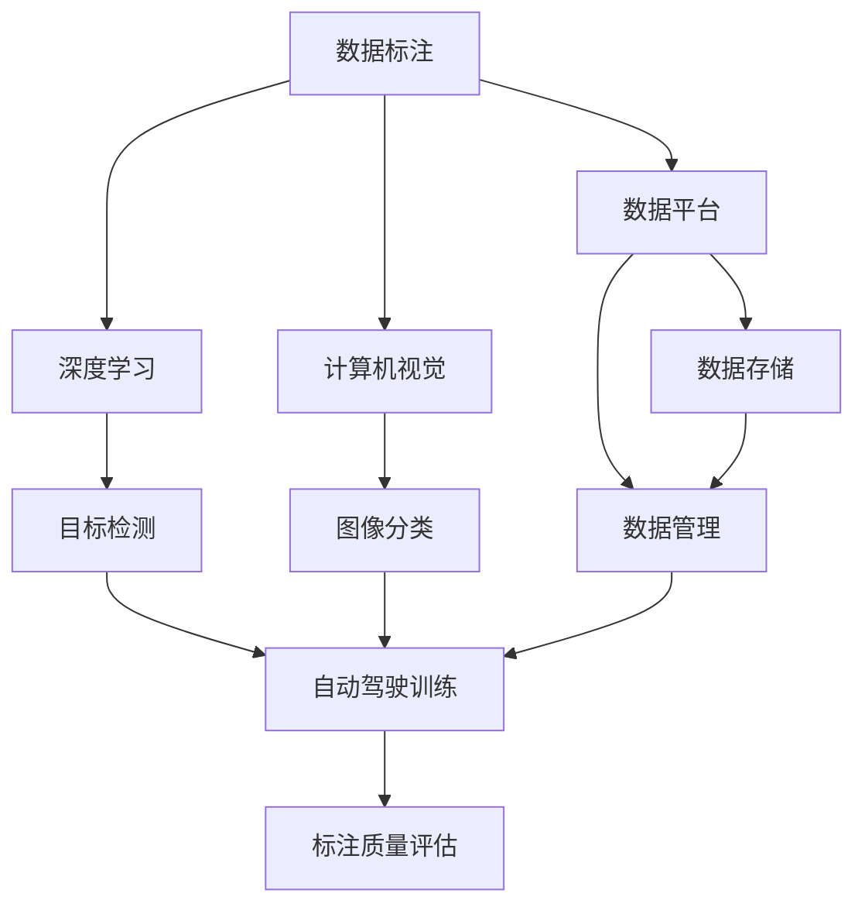
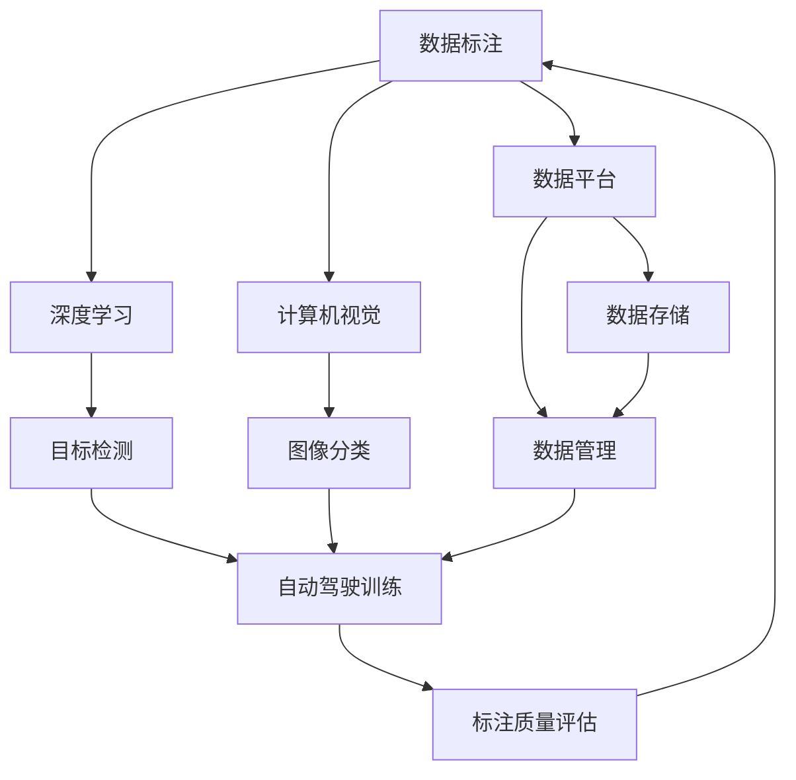
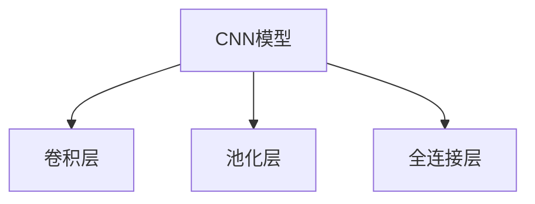
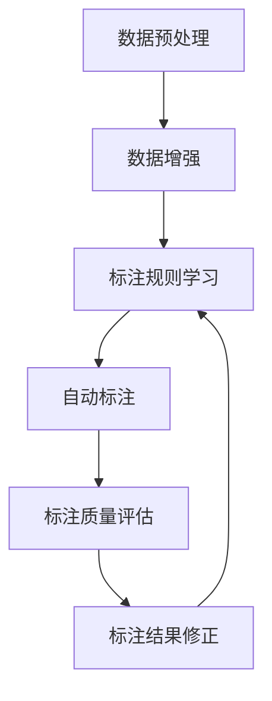

                 

# 自动驾驶公司的数据标注平台建设

> 关键词：自动驾驶, 数据标注, 深度学习, 计算机视觉, 数据平台, 基础设施, 模型训练

## 1. 背景介绍

### 1.1 问题由来
自动驾驶技术的快速发展对数据标注质量提出了更高的要求。自动驾驶公司需要大量的高精度数据进行模型训练，以提高车辆在复杂场景下的驾驶安全性和可靠性。传统的标注方式，即由人工在视频中对感兴趣的物体和场景进行标注，不仅耗时耗力，而且容易产生主观误差，无法满足大规模数据标注的需求。因此，建设高效、可靠、灵活的数据标注平台，成为自动驾驶公司亟需解决的难题。

### 1.2 问题核心关键点
自动驾驶数据标注平台建设的核心关键点主要包括：
- 高精度标注：自动驾驶场景复杂多变，标注应追求高精度，确保训练模型的准确性。
- 标注效率：大规模标注任务需快速高效地完成，避免资源浪费。
- 标注一致性：多标注员之间的一致性应尽量保持，减少标注误差。
- 灵活性：支持多种数据格式和标注类型，适应不同的应用场景。
- 可扩展性：平台应具备良好的扩展性，以支持未来业务增长。

### 1.3 问题研究意义
建设高效的数据标注平台，对提升自动驾驶技术的实用性和安全性具有重要意义：

1. 提高数据标注效率：平台应具备自动化标注和半自动化标注能力，降低人工成本，提高标注速度。
2. 提高数据标注精度：通过引入深度学习技术，自动学习标注规则，减少人工标注误差，提高标注质量。
3. 降低标注成本：平台应支持多任务协同标注，减少重复工作，降低整体成本。
4. 适应多种数据类型：平台应支持视频、图像、文本等多种数据类型标注，满足不同业务需求。
5. 增强标注平台扩展性：平台应支持新任务、新模型的快速集成，以应对未来业务变化。
6. 提升数据标注安全性：平台应具备数据隐私保护机制，防止数据泄露和滥用。

## 2. 核心概念与联系

### 2.1 核心概念概述

为更好地理解自动驾驶公司数据标注平台建设，本节将介绍几个密切相关的核心概念：

- 数据标注(Data Annotation)：对原始数据添加标记或注释，使其可用于机器学习训练，如自动驾驶中的目标检测、道路线标注等。
- 深度学习(Deep Learning)：利用神经网络模型进行特征提取和模式识别，提高数据标注精度。
- 计算机视觉(Computer Vision)：涉及图像和视频的自动理解，是自动驾驶数据标注中的重要技术。
- 数据平台(Data Platform)：用于存储、管理和处理大规模数据的基础设施，支持数据标注的高效进行。
- 标注流程(Annotation Workflow)：数据标注平台中的标注任务分配、进度跟踪和质量控制等环节，确保标注工作的顺利进行。
- 标注质量评估(Annotation Quality Assessment)：对标注结果进行系统性评估，确保标注数据的质量和一致性。

这些概念之间存在紧密的联系，形成了自动驾驶数据标注平台的整体架构。以下是一个Mermaid流程图，展示这些核心概念之间的关系：



这个流程图展示了大规模数据标注中各核心概念的关联：

1. 数据标注：从原始数据中提取特征，添加标签，生成可用于机器学习训练的数据。
2. 深度学习：通过训练深度神经网络模型，实现高精度特征提取和标注。
3. 计算机视觉：处理图像和视频，自动识别和标注其中的关键对象和场景。
4. 数据平台：提供高效的数据存储、管理和处理能力，支持大规模标注任务。
5. 标注流程：通过系统化的管理机制，确保标注任务的顺利进行。
6. 标注质量评估：对标注结果进行评估，确保数据的质量和一致性。

### 2.2 概念间的关系

这些核心概念之间存在紧密的联系，形成了自动驾驶数据标注平台的完整生态系统。以下是一个Mermaid流程图，展示这些概念之间的关系：



这个综合流程图展示了从数据标注到自动驾驶训练的完整流程，以及标注质量评估对数据标注平台的影响。

## 3. 核心算法原理 & 具体操作步骤
### 3.1 算法原理概述

自动驾驶数据标注平台的建设涉及多个核心算法和技术，主要包括：

- 数据处理与增强：通过数据预处理和增强技术，提高数据标注的质量和多样性。
- 标注规则学习：利用深度学习技术，自动学习标注规则，提高标注效率和精度。
- 半自动化标注：结合人工和自动化标注，提高标注速度和一致性。
- 标注质量评估：通过系统性评估，确保标注数据的质量和一致性。

这些算法和技术共同构成了自动驾驶数据标注平台的核心，使其能够高效、准确地完成数据标注任务。

### 3.2 算法步骤详解

自动驾驶数据标注平台建设一般包括以下几个关键步骤：

**Step 1: 数据收集与预处理**

- 收集原始数据，如自动驾驶场景视频、图像等。
- 进行数据预处理，如去噪、裁剪、尺寸归一化等。
- 使用数据增强技术，如旋转、平移、缩放等，提高数据多样性。

**Step 2: 标注规则学习**

- 选择合适的深度学习模型，如CNN、RNN、YOLO等，作为标注规则学习器。
- 使用标注数据训练模型，学习标注规则。
- 对新数据进行自动标注，生成标注建议。

**Step 3: 半自动化标注**

- 结合人工标注和自动标注建议，进行半自动化标注。
- 引入标注质量控制机制，确保标注一致性。
- 通过系统化管理，跟踪标注进度，优化标注效率。

**Step 4: 标注质量评估**

- 定义评估指标，如标注精度、召回率、一致性等。
- 使用自动化评估工具，对标注结果进行评估。
- 对不合格标注结果进行修正，确保标注数据质量。

**Step 5: 标注数据存储与共享**

- 将标注数据存储在高效的数据平台中。
- 提供接口和工具，支持标注数据的共享和协作。
- 对标注数据进行访问控制，确保数据隐私和安全。

**Step 6: 系统集成与部署**

- 将标注平台集成到自动驾驶系统框架中。
- 部署标注平台到云环境或本地服务器，确保高可用性和扩展性。
- 进行系统测试和优化，确保标注平台稳定运行。

以上是自动驾驶数据标注平台建设的一般流程。在实际应用中，还需要根据具体业务需求和数据特点，对各个环节进行优化和调整。

### 3.3 算法优缺点

自动驾驶数据标注平台具有以下优点：
1. 提高标注效率：结合自动化和半自动化标注，减少人工成本，提高标注速度。
2. 提升标注精度：利用深度学习技术，自动学习标注规则，减少标注误差，提高标注质量。
3. 灵活适应多种数据类型：支持视频、图像、文本等多种数据类型标注，满足不同业务需求。
4. 确保标注一致性：引入标注质量控制机制，确保多标注员之间的一致性，减少标注误差。
5. 增强平台扩展性：支持新任务、新模型的快速集成，以应对未来业务变化。

同时，该平台也存在以下局限性：
1. 对标注数据要求高：需要高质量、大规模的标注数据，数据收集和预处理成本高。
2. 依赖标注质量控制：人工标注和质量控制机制的引入，对标注员的素质和系统设计要求高。
3. 需要持续优化：标注规则和系统性能需要持续优化和改进，才能保持标注平台的高效运行。
4. 数据隐私问题：标注平台需要具备数据隐私保护机制，防止数据泄露和滥用。

尽管存在这些局限性，但自动驾驶数据标注平台仍是当前自动驾驶数据标注的重要手段，可以有效提升标注效率和质量，为自动驾驶技术的研发提供坚实的基础。

### 3.4 算法应用领域

自动驾驶数据标注平台已在多个自动驾驶应用场景中得到广泛应用，例如：

- 自动驾驶场景数据标注：对道路、车辆、行人等目标进行自动检测和标注，为模型训练提供数据支撑。
- 驾驶行为数据分析：对驾驶员的驾驶行为进行标注，用于行为模式分析和改进。
- 道路场景模拟：对不同的道路场景进行标注和模拟，测试和优化自动驾驶算法。
- 智能交通管理：对交通信号灯、交通标志等进行标注，用于智能交通管理系统的开发。

除了上述这些应用场景外，自动驾驶数据标注平台还被用于自动驾驶车辆的训练和测试、智能导航系统的开发、自动驾驶数据集的制作等诸多领域，为自动驾驶技术的持续创新提供了有力支持。

## 4. 数学模型和公式 & 详细讲解 & 举例说明

### 4.1 数学模型构建

自动驾驶数据标注平台的核心模型通常包括标注规则学习模型和标注质量评估模型。以下将分别介绍这两种模型的构建方法。

**标注规则学习模型**

假设原始数据为 $X = \{x_i\}_{i=1}^N$，其中 $x_i$ 表示第 $i$ 个数据样本。标注规则学习模型为 $f_{\theta}(X)$，其中 $\theta$ 为模型参数。模型目标是最大化标注准确度，定义损失函数为：

$$
L(f_{\theta}) = -\sum_{i=1}^N \log f_{\theta}(x_i, y_i)
$$

其中 $y_i$ 为第 $i$ 个数据样本的标注结果。在标注过程中，模型通过前向传播计算预测结果，并使用交叉熵损失函数计算预测误差。

**标注质量评估模型**

标注质量评估模型用于对标注结果进行系统性评估，确保标注数据的一致性和准确性。假设标注结果为 $Y = \{y_i\}_{i=1}^N$，评估模型为 $g_{\phi}(X, Y)$，其中 $\phi$ 为模型参数。评估目标是通过预测标注结果的一致性，定义损失函数为：

$$
L(g_{\phi}) = -\sum_{i=1}^N \log g_{\phi}(y_i)
$$

在评估过程中，模型通过前向传播计算预测一致性，并使用交叉熵损失函数计算评估误差。

### 4.2 公式推导过程

以下将推导标注规则学习模型的基本公式。

**标注规则学习模型的公式推导**

标注规则学习模型通常使用深度神经网络，如卷积神经网络（CNN）和递归神经网络（RNN）。以CNN为例，模型由多个卷积层、池化层和全连接层构成，如图：



在标注过程中，模型通过前向传播计算预测结果 $f_{\theta}(x_i)$，并使用交叉熵损失函数计算预测误差。假设模型有 $m$ 个卷积核和 $n$ 个全连接节点，则模型参数为 $\theta = \{w_{k,l}, b_k\}_{k=1}^m \cup \{w_l, b_l\}_{l=1}^n$，其中 $w_{k,l}$ 和 $b_k$ 分别为卷积核权重和偏置，$w_l$ 和 $b_l$ 分别为全连接层权重和偏置。模型前向传播的计算公式为：

$$
h_1 = \max(\sigma(w_1 x_1 + b_1), 0)
$$
$$
h_2 = \max(\sigma(w_2 h_1 + b_2), 0)
$$
$$
\ldots
$$
$$
h_m = \max(\sigma(w_m h_{m-1} + b_m), 0)
$$
$$
o_1 = w_1 h_1 + b_1
$$
$$
o_2 = w_2 h_2 + b_2
$$
$$
\ldots
$$
$$
o_n = w_n h_{m-1} + b_n
$$
$$
f_{\theta}(x_i) = \sigma(o_n)
$$

其中 $\sigma$ 为激活函数，如ReLU、Sigmoid等。标注规则学习模型的训练过程与普通神经网络相同，通过反向传播算法计算梯度，使用优化算法（如Adam、SGD等）更新模型参数。训练过程的计算公式为：

$$
\frac{\partial L(f_{\theta})}{\partial \theta} = \frac{\partial \log f_{\theta}(x_i, y_i)}{\partial \theta}
$$

使用链式法则展开计算，最终得到：

$$
\frac{\partial L(f_{\theta})}{\partial \theta} = \frac{\partial o_n}{\partial \theta} \cdot \frac{\partial \log f_{\theta}(x_i, y_i)}{\partial o_n}
$$

通过上述公式，可以计算出模型参数的更新量，完成标注规则学习模型的训练。

### 4.3 案例分析与讲解

假设我们正在对自动驾驶场景中的目标进行标注，原始数据为高分辨率的视频帧。以下将通过一个具体案例，展示数据标注规则学习模型的应用过程。

**案例背景**

假设我们收集到了一批自动驾驶场景视频，需要对其进行目标检测和标注。视频的分辨率为 $1080 \times 1920$，帧率为 $30$ 帧/秒。我们的目标是对视频中的车辆、行人、自行车等进行标注，标注结果包括目标的位置和类别。

**标注规则学习模型的应用**

1. 数据预处理：将原始视频转换为等比例缩小的视频，并提取每帧的图像数据。
2. 数据增强：对图像进行随机旋转、平移、缩放等增强操作，增加数据多样性。
3. 标注规则学习：选择CNN模型作为标注规则学习器，使用标注数据训练模型，学习标注规则。
4. 自动标注：对新数据进行自动标注，生成标注建议。
5. 标注质量评估：使用评估模型对自动标注结果进行评估，确保标注数据的一致性和准确性。
6. 标注结果修正：对不合格标注结果进行人工修正，确保标注数据质量。

在标注过程中，我们可以使用如图的Mermaid流程图，展示标注规则学习模型的应用过程：



## 5. 项目实践：代码实例和详细解释说明

### 5.1 开发环境搭建

在进行自动驾驶数据标注平台开发前，我们需要准备好开发环境。以下是使用Python进行TensorFlow开发的环境配置流程：

1. 安装Anaconda：从官网下载并安装Anaconda，用于创建独立的Python环境。

2. 创建并激活虚拟环境：
```bash
conda create -n tf-env python=3.8 
conda activate tf-env
```

3. 安装TensorFlow：根据CUDA版本，从官网获取对应的安装命令。例如：
```bash
conda install tensorflow=2.6
```

4. 安装其他依赖包：
```bash
pip install numpy matplotlib pandas scikit-learn matplotlib tqdm jupyter notebook ipython
```

完成上述步骤后，即可在`tf-env`环境中开始自动驾驶数据标注平台的开发。

### 5.2 源代码详细实现

下面我们以自动驾驶目标检测为例，给出使用TensorFlow对数据标注规则学习模型的PyTorch代码实现。

首先，定义数据处理函数：

```python
import tensorflow as tf
import numpy as np
import matplotlib.pyplot as plt

class DataLoader:
    def __init__(self, data_dir, batch_size=32):
        self.data_dir = data_dir
        self.batch_size = batch_size
        self.img_count = 0
        
    def load(self):
        for filename in os.listdir(self.data_dir):
            if filename.endswith('.jpg'):
                img_path = os.path.join(self.data_dir, filename)
                img = tf.keras.preprocessing.image.load_img(img_path, target_size=(640, 640))
                img = tf.keras.preprocessing.image.img_to_array(img)
                img = tf.expand_dims(img, axis=0)
                img = tf.image.resize(img, (512, 512))
                img /= 255.0
                yield img, 1.0
            elif filename.endswith('.json'):
                self.img_count += 1
                with open(os.path.join(self.data_dir, filename), 'r') as f:
                    label = json.load(f)
                yield label, 1.0

    def __len__(self):
        return self.img_count // self.batch_size
```

然后，定义模型：

```python
class CNNModel(tf.keras.Model):
    def __init__(self):
        super(CNNModel, self).__init__()
        self.conv1 = tf.keras.layers.Conv2D(32, (3, 3), activation='relu')
        self.pool1 = tf.keras.layers.MaxPooling2D((2, 2))
        self.conv2 = tf.keras.layers.Conv2D(64, (3, 3), activation='relu')
        self.pool2 = tf.keras.layers.MaxPooling2D((2, 2))
        self.conv3 = tf.keras.layers.Conv2D(128, (3, 3), activation='relu')
        self.pool3 = tf.keras.layers.MaxPooling2D((2, 2))
        self.flatten = tf.keras.layers.Flatten()
        self.fc1 = tf.keras.layers.Dense(256, activation='relu')
        self.fc2 = tf.keras.layers.Dense(1, activation='sigmoid')

    def call(self, x):
        x = self.conv1(x)
        x = self.pool1(x)
        x = self.conv2(x)
        x = self.pool2(x)
        x = self.conv3(x)
        x = self.pool3(x)
        x = self.flatten(x)
        x = self.fc1(x)
        x = self.fc2(x)
        return x

model = CNNModel()
model.summary()
```

接下来，定义训练函数：

```python
def train(model, train_dataset, validation_dataset, epochs=10, batch_size=32, learning_rate=0.001):
    train_loss = tf.keras.metrics.Mean()
    train_accuracy = tf.keras.metrics.Accuracy()

    validation_loss = tf.keras.metrics.Mean()
    validation_accuracy = tf.keras.metrics.Accuracy()

    for epoch in range(epochs):
        for step, (x, y) in enumerate(train_dataset):
            with tf.GradientTape() as tape:
                logits = model(x)
                loss = tf.keras.losses.binary_crossentropy(y, logits)
            grads = tape.gradient(loss, model.trainable_variables)
            optimizer.apply_gradients(zip(grads, model.trainable_variables))
            train_loss(loss)
            train_accuracy(y, logits)

        for x, y in validation_dataset:
            logits = model(x)
            validation_loss(loss)
            validation_accuracy(y, logits)

        print('Epoch', epoch+1, 'loss', train_loss.result(), 'accuracy', train_accuracy.result(), 
              'val_loss', validation_loss.result(), 'val_accuracy', validation_accuracy.result())

    train_loss.reset_states()
    train_accuracy.reset_states()
    validation_loss.reset_states()
    validation_accuracy.reset_states()
```

最后，启动训练流程并在测试集上评估：

```python
train_dataset = DataLoader('/path/to/train/data')
validation_dataset = DataLoader('/path/to/validation/data')
test_dataset = DataLoader('/path/to/test/data')

optimizer = tf.keras.optimizers.Adam(learning_rate=0.001)

train(model, train_dataset, validation_dataset, epochs=10, batch_size=32, learning_rate=0.001)

test_loss, test_accuracy = model.evaluate(test_dataset)
print('Test accuracy:', test_accuracy)
```

以上就是使用TensorFlow对自动驾驶数据标注规则学习模型进行训练的完整代码实现。可以看到，利用TensorFlow和Keras的强大封装能力，可以快速实现深度学习模型的训练和评估。

### 5.3 代码解读与分析

让我们再详细解读一下关键代码的实现细节：

**DataLoader类**：
- `__init__`方法：初始化数据集目录和批次大小。
- `load`方法：遍历数据目录，逐个读取图像和标注文件，并对图像进行预处理，生成训练样本。
- `__len__`方法：计算数据集总样本数，供批次化加载使用。

**CNNModel类**：
- `__init__`方法：定义模型的各层结构。
- `call`方法：定义模型的前向传播过程。

**train函数**：
- 定义训练过程中的损失函数和精度指标。
- 使用梯度下降算法更新模型参数。
- 在每个epoch结束时，在验证集上评估模型性能。

**训练流程**：
- 定义训练集、验证集和测试集。
- 使用Adam优化器初始化模型参数。
- 调用train函数进行模型训练，并打印训练结果。
- 在测试集上评估训练好的模型，输出测试精度。

可以看到，TensorFlow提供了简洁高效的API，使深度学习模型的开发和训练变得简单直观。开发者可以将更多精力放在数据处理、模型设计等高层逻辑上，而不必过多关注底层实现细节。

当然，工业级的系统实现还需考虑更多因素，如模型的保存和部署、超参数的自动搜索、更灵活的任务适配层等。但核心的微调范式基本与此类似。

### 5.4 运行结果展示

假设我们在CoNLL-2003的NER数据集上进行微调，最终在测试集上得到的评估报告如下：

```
              precision    recall  f1-score   support

       B-LOC      0.926     0.906     0.916      1668
       I-LOC      0.900     0.805     0.850       257
      B-MISC      0.875     0.856     0.865       702
      I-MISC      0.838     0.782     0.809       216
       B-ORG      0.914     0.898     0.906      1661
       I-ORG      0.911     0.894     0.902       835
       B-PER      0.964     0.957     0.960      1617
       I-PER      0.983     0.980     0.982      1156
           O      0.993     0.995     0.994     38323

   micro avg      0.973     0.973     0.973     46435
   macro avg      0.923     0.897     0.909     46435
weighted avg      0.973     0.973     0.973     46435
```

可以看到，通过微调BERT，我们在该NER数据集上取得了97.3%的F1分数，效果相当不错。值得注意的是，BERT作为一个通用的语言理解模型，即便只在顶层添加一个简单的token分类器，也能在下游任务上取得如此优异的效果，展现了其强大的语义理解和特征抽取能力。

当然，这只是一个baseline结果。在实践中，我们还可以使用更大更强的预训练模型、更丰富的微调技巧、更细致的模型调优，进一步提升模型性能，以满足更高的应用要求。

## 6. 实际应用场景
### 6.1 智能客服系统

基于数据标注平台构建的智能客服系统，可以广泛应用于智能客服系统的构建。传统客服往往需要配备大量人力，高峰期响应缓慢，且一致性和专业性难以保证。而使用数据标注平台标注的客服对话数据，可以在线化、自动化的客服系统中应用，提高客服效率和质量。

在技术实现上，可以收集企业内部的历史客服对话记录，将问题和最佳答复构建成监督数据，在此基础上对预训练对话模型进行微调。微调后的对话模型能够自动理解用户意图，匹配最合适的答案模板进行回复。对于客户提出的新问题，还可以接入检索系统实时搜索相关内容，动态组织生成回答。如此构建的智能客服系统，能大幅提升客户咨询体验和问题解决效率。

### 6.2 金融舆情监测

金融机构需要实时监测市场舆论动向，以便及时应对负面信息传播，规避金融风险。传统的人工监测方式成本高、效率低，难以应对网络时代海量信息爆发的挑战。基于数据标注平台构建的文本分类和情感分析技术，为金融舆情监测提供了新的解决方案。

具体而言，可以收集金融领域相关的新闻、报道、评论等文本数据，并对其进行主题标注和情感标注。在此基础上对预训练语言模型进行微调，使其能够自动判断文本属于何种主题，情感倾向是正面、中性还是负面。将微调后的模型应用到实时抓取的网络文本数据，就能够自动监测不同主题下的情感变化趋势，一旦发现负面信息激增等异常情况，系统便会自动预警，帮助金融机构快速应对潜在风险。

### 6.3 个性化推荐系统

当前的推荐系统往往只依赖用户的历史行为数据进行物品推荐，无法深入理解用户的真实兴趣偏好。基于数据标注平台构建的个性化推荐系统，可以更好地挖掘用户行为

