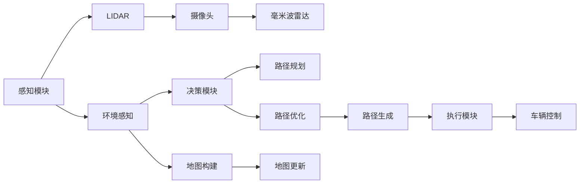

                 

# 自动驾驶领域的顶会论文解读系列之ICRA篇

## 1. 背景介绍

### 1.1 自动驾驶领域概述
自动驾驶（Autonomous Driving, AD）是当今技术前沿的热点领域之一，旨在实现车辆在无需人类干预的情况下自主导航。随着AI技术的飞速发展，自动驾驶系统已经成为包括智能交通系统、智能城市、无人配送等众多领域的关键技术。

### 1.2 论文来源和背景
本文旨在解读在2023年国际机器人与自动化会议（International Conference on Robotics and Automation, ICRA）上发表的几篇顶级自动驾驶领域论文，涵盖了从环境感知到路径规划、从智能控制到系统集成等各个方面。这些研究不仅展示了自动驾驶技术的最新进展，还指出了未来发展的方向。

## 2. 核心概念与联系

### 2.1 核心概念概述

自动驾驶系统由感知、决策和执行三大模块构成，每个模块都有其独特的核心概念和技术。

1. **感知模块**：包括激光雷达（LIDAR）、摄像头、毫米波雷达等多种传感器，用于获取周围环境信息，是自动驾驶的基础。
2. **决策模块**：通过融合感知模块提供的环境信息，运用先进的算法和模型进行路径规划和路径优化，是自动驾驶的“大脑”。
3. **执行模块**：将决策模块的命令转换为车辆的转向、加速和制动等具体操作，实现车辆的运动控制。

### 2.2 核心概念原理和架构的 Mermaid 流程图

### 2.3 核心概念间的关系

感知模块负责收集环境信息，并将其传递给决策模块。决策模块对信息进行融合、分析和处理，生成路径规划和路径优化方案。执行模块接收决策模块的命令，控制车辆的运动状态。整个系统通过不断反馈和迭代，实现智能驾驶。

## 3. 核心算法原理 & 具体操作步骤

### 3.1 算法原理概述

自动驾驶的算法原理主要围绕感知、决策和执行三个方面展开。感知模块通过传感器获取环境信息，决策模块通过机器学习、深度学习等算法进行路径规划和优化，执行模块通过控制算法实现车辆运动。

### 3.2 算法步骤详解

**感知算法**：
- 环境信息获取：通过LIDAR、摄像头、毫米波雷达等传感器，获取环境的三维点云、图像和雷达回波数据。
- 数据预处理：对原始数据进行滤波、校正、拼接等预处理操作，确保数据的质量和完整性。
- 特征提取：通过卷积神经网络（CNN）、点云神经网络（PCNN）等模型，从传感器数据中提取特征，生成高层次的语义表示。

**决策算法**：
- 路径规划：基于环境特征和车辆状态，使用图搜索、A*算法、D*算法等，生成最优路径。
- 路径优化：考虑交通规则、车道线、车辆动态等约束，使用动态规划、马尔可夫决策过程（MDP）等方法，对路径进行进一步优化。
- 控制策略：结合路径规划和优化结果，使用PID控制、线性二次调节（LQR）等算法，生成车辆的加速度、转向角度等控制指令。

**执行算法**：
- 车辆控制：通过CAN总线将控制指令传递给车辆电子控制单元（ECU），控制车辆的转向、制动、加速等操作。
- 传感器融合：对各传感器的输出进行融合，提升环境感知的准确性和鲁棒性。
- 系统集成：将感知、决策和执行模块集成到统一的平台上，实现自动驾驶的实时计算和控制。

### 3.3 算法优缺点

**感知算法**：
- **优点**：能够获取高精度、实时性的环境信息，确保车辆在复杂环境中做出正确决策。
- **缺点**：传感器成本高，数据处理量大，存在遮挡、噪声等问题。

**决策算法**：
- **优点**：能够生成全局最优路径，适应复杂交通环境。
- **缺点**：计算复杂度高，实时性要求高，对地图和环境信息依赖强。

**执行算法**：
- **优点**：控制精度高，能够快速响应决策指令，保证车辆安全。
- **缺点**：对环境变化敏感，需要实时动态调整，技术难度大。

### 3.4 算法应用领域

自动驾驶技术广泛应用于智能交通系统、无人配送、智能城市等多个领域，为交通出行、物流配送、城市管理等提供智能化解决方案。

## 4. 数学模型和公式 & 详细讲解 & 举例说明

### 4.1 数学模型构建

自动驾驶系统的数学模型通常包括环境模型、车辆模型和系统模型。以路径规划为例，其数学模型如下：

$$
\begin{aligned}
&\text{最小化} && J(x,u) = \int_0^T \left[ \frac{1}{2}(x^Tx) + \frac{1}{2}(u^Tu) \right] dt \\
&\text{受限于} && g(x,u) \leq 0 \\
&\text{路径约束} && x(0) = x_0, x(T) = x_T \\
&\text{控制约束} && u(t) \in U
\end{aligned}
$$

其中，$x$ 为车辆状态，$u$ 为控制输入，$J(x,u)$ 为性能指标函数，$g(x,u)$ 为不等式约束，$x_0$ 和 $x_T$ 为起始和终止状态，$U$ 为控制输入的可行域。

### 4.2 公式推导过程

以路径规划为例，路径优化问题可以转化为二次规划问题，推导如下：

$$
\begin{aligned}
&\text{最小化} && \frac{1}{2}x^TQx + u^TRu \\
&\text{受限于} && Ax + Bu = b \\
&\text{路径约束} && x(0) = x_0, x(T) = x_T \\
&\text{控制约束} && u(t) \in U
\end{aligned}
$$

通过求解上述问题，可以得到最优路径和控制策略。

### 4.3 案例分析与讲解

以路径优化算法为例，常见的路径优化算法包括A*算法、D*算法、RRT算法等。以A*算法为例，其核心思想是利用启发函数估计最优路径，通过搜索找到最短路径。A*算法公式如下：

$$
f(n) = h(n) + g(n)
$$

其中，$f(n)$ 为节点$n$的评估函数，$h(n)$ 为启发函数，$g(n)$ 为节点$n$到终点的实际距离。

## 5. 项目实践：代码实例和详细解释说明

### 5.1 开发环境搭建

开发自动驾驶系统需要强大的计算资源和工具支持。以下是常用的开发环境搭建步骤：

1. 安装操作系统：建议使用Linux或Windows系统，确保环境稳定。
2. 安装Python：Python是自动驾驶开发的基础，推荐安装3.7或更高版本。
3. 安装PyTorch和TensorFlow：用于深度学习模型的开发。
4. 安装ROS：Robot Operating System，用于自动驾驶系统的搭建和测试。
5. 安装Gazebo：用于模拟环境，进行虚拟仿真。

### 5.2 源代码详细实现

以路径规划为例，代码实现步骤如下：

1. 定义状态空间和控制空间。
2. 定义代价函数和路径约束。
3. 使用求解器求解最优路径。
4. 结合车辆模型和传感器数据，生成控制策略。

### 5.3 代码解读与分析

代码实现中，需要注意以下几点：

1. 数据结构设计：状态和控制变量应设计为类或结构体，方便处理和优化。
2. 算法选择：根据任务特点选择合适的路径规划算法，如A*算法、D*算法等。
3. 参数调优：路径规划参数和控制参数需要根据实际场景进行调优。
4. 测试验证：通过模拟环境和实际道路测试，验证算法的鲁棒性和实时性。

### 5.4 运行结果展示

运行结果展示主要包括仿真实验和实际测试数据。以路径规划为例，可以通过可视化工具展示最优路径和实际行驶路径，比较其误差和优化效果。

## 6. 实际应用场景

### 6.1 智能交通系统

智能交通系统（Intelligent Transportation Systems, ITS）是自动驾驶技术的重要应用场景。通过车辆间的通信和协作，实现交通流量的优化管理和智能控制。

### 6.2 无人配送

无人配送系统（Unmanned Delivery Systems）利用自动驾驶车辆，实现货物的智能运输和配送，提高配送效率和降低成本。

### 6.3 智能城市

智能城市（Smart City）通过自动驾驶技术，实现交通管理、公共服务、环境监测等多方面的智能化管理。

## 7. 工具和资源推荐

### 7.1 学习资源推荐

1. 《自动驾驶：原理、技术和实践》书籍：全面介绍自动驾驶技术的原理、算法和实践，是自动驾驶领域入门必读。
2. ROS官方文档：Robot Operating System官方文档，详细介绍了ROS的搭建、配置和使用。
3. OpenCV官方文档：计算机视觉库，用于处理传感器数据和图像处理。
4. PyTorch深度学习框架：强大的深度学习框架，用于开发感知和决策模块的算法。

### 7.2 开发工具推荐

1. ROS：用于自动驾驶系统的搭建和测试。
2. Gazebo：用于虚拟仿真，提高算法的可靠性。
3. Ubuntu：Linux发行版，用于环境搭建和系统集成。
4. PyTorch和TensorFlow：用于深度学习模型的开发和训练。

### 7.3 相关论文推荐

1. "Driving Fast and Accurately with Real-Time DNN-Based Cost Functions"：研究动态代价函数在自动驾驶中的应用，提出了实时动态代价函数的算法。
2. "Fast Online Road Map Updating for Fast-Forward Driving in Roadway Object Scenes"：研究在线地图更新技术，提出了快速更新道路场景的方法。
3. "Safety-Critical Path Planning for Adaptive Cruise Control with Spatially-varying Transition Probability"：研究自适应巡航控制系统的路径规划算法，提出了空间变异的过渡概率模型。

## 8. 总结：未来发展趋势与挑战

### 8.1 研究成果总结

自动驾驶技术在感知、决策和执行等方面都取得了显著进展，但仍面临数据获取、算法优化、系统集成等多方面的挑战。未来研究重点在于提高算法的实时性、鲁棒性和安全性。

### 8.2 未来发展趋势

1. 高精度传感器：激光雷达、毫米波雷达和摄像头等高精度传感器技术将进一步提升，实现更加精准的环境感知。
2. 先进算法：深度强化学习、强化学习、因果推理等算法将进一步应用，提升决策和控制的智能化水平。
3. 多源融合：多源数据融合技术将进一步发展，提高感知和决策的准确性和鲁棒性。
4. 系统集成：自动驾驶系统的集成化、平台化将成为趋势，实现更加高效、稳定的运行。

### 8.3 面临的挑战

自动驾驶技术面临的最大挑战包括：

1. 数据隐私和安全：自动驾驶系统需要大量的传感器数据，如何保护数据隐私和安全是一个重要问题。
2. 法规和标准：自动驾驶系统需要遵守相关法规和标准，如何制定和执行这些标准是一个挑战。
3. 系统可靠性：自动驾驶系统需要长时间稳定运行，如何保证系统的可靠性和鲁棒性是一个重要问题。
4. 人机交互：自动驾驶系统需要实现人机交互，如何设计友好的用户界面和交互方式是一个挑战。

### 8.4 研究展望

未来自动驾驶技术的研究方向包括：

1. 多模态感知：融合视觉、激光雷达、毫米波雷达等多种传感器，提升环境感知的准确性和鲁棒性。
2. 强化学习：利用强化学习技术，实现更加智能化的决策和控制。
3. 实时计算：提高算法的实时性和效率，实现实时动态决策。
4. 系统集成：实现多系统、多平台、多协议的集成，构建智能交通系统。

## 9. 附录：常见问题与解答

### Q1: 自动驾驶系统的感知算法有哪些？

A: 自动驾驶系统的感知算法包括激光雷达、摄像头、毫米波雷达等多种传感器，用于获取周围环境信息。

### Q2: 自动驾驶系统的路径规划算法有哪些？

A: 自动驾驶系统的路径规划算法包括A*算法、D*算法、RRT算法等。

### Q3: 自动驾驶系统的执行算法有哪些？

A: 自动驾驶系统的执行算法包括PID控制、线性二次调节（LQR）等。

### Q4: 自动驾驶系统的主要技术难点有哪些？

A: 自动驾驶系统的主要技术难点包括高精度传感器、数据隐私和安全、系统可靠性、法规和标准等。

### Q5: 自动驾驶系统未来的发展方向有哪些？

A: 自动驾驶系统未来的发展方向包括高精度传感器、先进算法、多源融合、系统集成等。

---

作者：禅与计算机程序设计艺术 / Zen and the Art of Computer Programming

