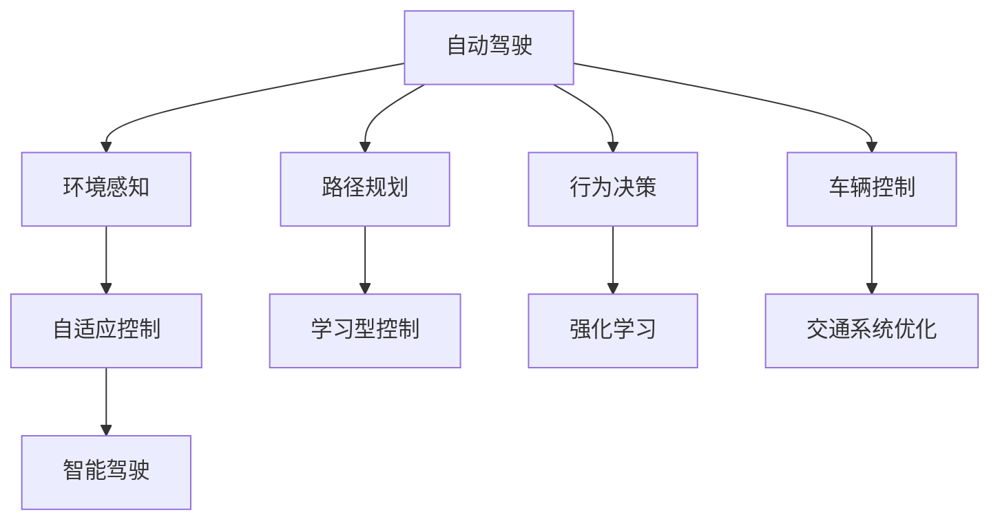
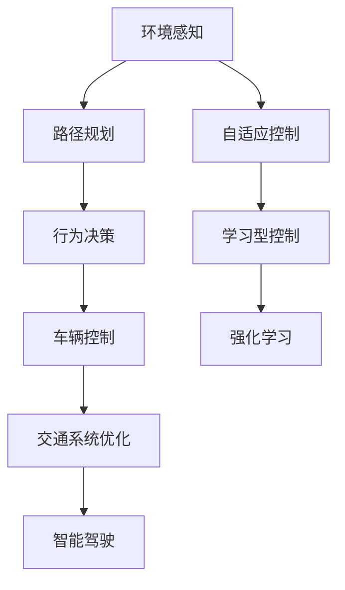
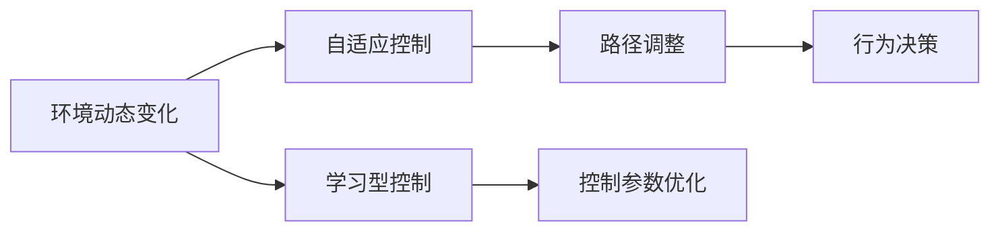
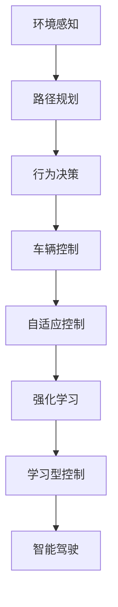
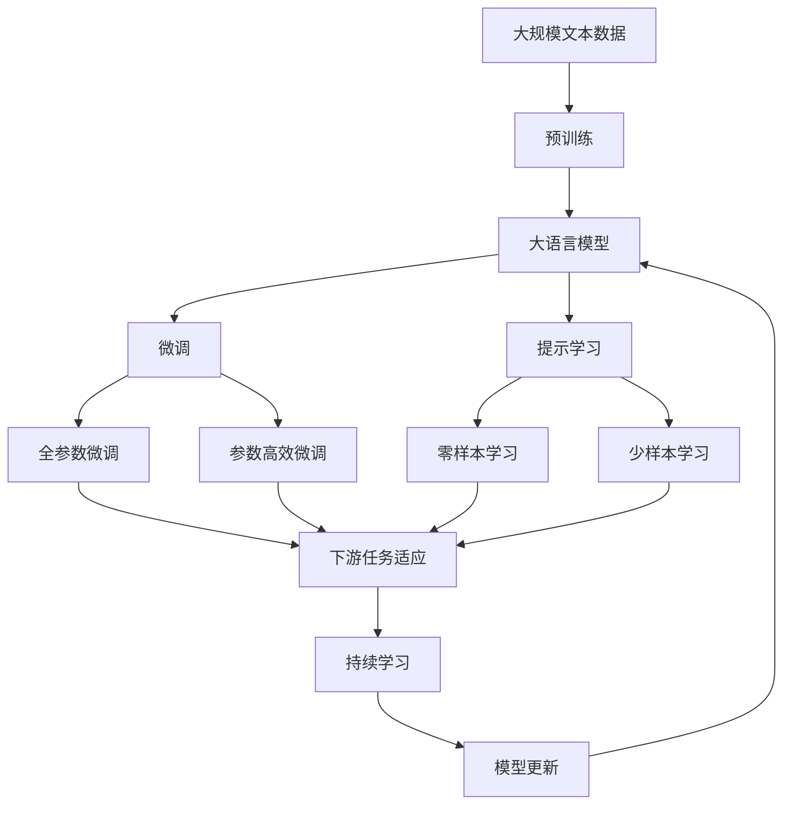

                 

# 自适应与学习型控制策略在自动驾驶中的应用探索

> 关键词：自动驾驶, 自适应控制, 学习型控制, 强化学习, 交通系统优化, 智能驾驶

## 1. 背景介绍

### 1.1 问题由来
随着科技的飞速发展，自动驾驶技术逐渐成为全球汽车工业的一大热门话题。自动驾驶不仅能够提升交通安全性和道路使用效率，还能极大地改变人们的生活方式。但与此同时，自动驾驶也面临着诸多技术挑战，如环境感知、路径规划、行为决策、交通拥堵等。其中，车辆控制策略的优化是自动驾驶系统实现的关键一环。

在自动驾驶场景中，车辆需要能够实时响应道路动态变化，调整行驶状态，以保持安全、稳定、高效的驾驶。这不仅要求车辆具备强大的环境感知能力，还需要精确而高效的控制策略，以确保在各种复杂的道路条件下，能够快速响应和决策。

传统的自动驾驶控制策略大多基于静态规则，即车辆按照预先定义的策略进行行驶。然而，这种策略无法灵活适应多变的道路环境，且难以处理非预见性事件。为此，自适应与学习型控制策略应运而生，以更好地应对自动驾驶中的动态和不确定性。

### 1.2 问题核心关键点
自适应与学习型控制策略的核心在于通过智能算法实时优化控制参数，以适应不同的道路和交通状况。其关键点包括：

- 实时环境感知：通过车载传感器（如激光雷达、摄像头、雷达等）获取周围环境信息。
- 动态路径规划：根据感知到的环境信息，实时调整行驶路径，以避免碰撞或拥堵。
- 行为决策优化：结合环境感知和路径规划结果，实时调整驾驶行为，如加速、减速、转向等。
- 交通系统优化：与交通基础设施进行数据交换，实时调整车速和行驶策略，以缓解交通压力。
- 系统学习与自适应：利用强化学习等方法，不断学习和调整控制策略，提升驾驶性能。

这些关键点共同构成了自适应与学习型控制策略的完整框架，使其能够在复杂多变的道路条件下，实现精准、灵活、安全的自动驾驶。

## 2. 核心概念与联系

### 2.1 核心概念概述

为更好地理解自适应与学习型控制策略在自动驾驶中的应用，本节将介绍几个密切相关的核心概念：

- **自动驾驶**：使用人工智能技术实现车辆自主驾驶的过程，包括环境感知、路径规划、行为决策、车辆控制等环节。
- **自适应控制**：根据环境动态变化实时调整控制参数，以保持车辆稳定和安全的驾驶状态。
- **学习型控制**：通过智能算法不断优化控制策略，使其能够适应不同道路和交通状况。
- **强化学习**：一种基于奖励与惩罚的学习范式，通过与环境的互动，不断优化行为策略，以实现特定目标。
- **交通系统优化**：结合车辆控制策略与交通基础设施，优化交通流，提高道路使用效率，减少拥堵。
- **智能驾驶**：融合自动驾驶技术和智能控制策略，实现更加精准、灵活、安全的驾驶体验。

这些核心概念之间的逻辑关系可以通过以下Mermaid流程图来展示：



这个流程图展示了一系列核心概念在自动驾驶中的应用和相互关系：

1. 自动驾驶系统通过环境感知获取道路信息。
2. 路径规划和行为决策模块根据感知结果，确定车辆的行驶路径和行为策略。
3. 车辆控制模块实时调整车辆状态，以保持安全稳定的行驶。
4. 自适应控制和强化学习模块不断优化控制策略，适应不同道路条件。
5. 交通系统优化模块结合车辆控制策略，优化整体交通流。
6. 智能驾驶系统整合上述所有模块，实现精准、灵活的自动驾驶。

### 2.2 概念间的关系

这些核心概念之间存在着紧密的联系，形成了自动驾驶控制策略的完整生态系统。下面我们通过几个Mermaid流程图来展示这些概念之间的关系。

#### 2.2.1 自动驾驶控制策略的层次结构



这个流程图展示自动驾驶系统的层次结构，从感知、规划、决策到控制和优化，各模块之间相互协作，共同实现精准、安全的自动驾驶。

#### 2.2.2 自适应与学习型控制策略的应用



这个流程图展示了自适应与学习型控制策略在自动驾驶中的应用。通过实时感知环境变化，自适应控制模块调整车辆参数，学习型控制模块不断优化控制策略。

#### 2.2.3 强化学习与智能驾驶的融合



这个流程图展示了强化学习在智能驾驶中的应用。强化学习模块通过不断优化行为策略，提高智能驾驶系统的决策能力和适应性。

### 2.3 核心概念的整体架构

最后，我们用一个综合的流程图来展示这些核心概念在大语言模型微调过程中的整体架构：



这个综合流程图展示了从预训练到微调，再到持续学习的完整过程。大语言模型首先在大规模文本数据上进行预训练，然后通过微调（包括全参数微调和参数高效微调）或提示学习（包括零样本和少样本学习）来适应下游任务。最后，通过持续学习技术，模型可以不断更新和适应新的任务和数据。 通过这些流程图，我们可以更清晰地理解自适应与学习型控制策略在大语言模型微调过程中各个核心概念的关系和作用，为后续深入讨论具体的微调方法和技术奠定基础。

## 3. 核心算法原理 & 具体操作步骤
### 3.1 算法原理概述

自适应与学习型控制策略在自动驾驶中的应用，本质上是一种基于强化学习的动态优化过程。其核心思想是：通过与环境的互动，不断调整控制参数，优化驾驶行为，以达到安全、高效、稳定的自动驾驶目标。

具体来说，自适应与学习型控制策略通常包括以下步骤：

1. **环境感知**：通过车载传感器获取道路、车辆、行人等环境信息。
2. **路径规划**：根据环境信息，实时规划车辆的行驶路径，以避免碰撞或拥堵。
3. **行为决策**：结合路径规划结果，确定车辆的加速、减速、转向等行为策略。
4. **车辆控制**：根据行为决策，实时调整车辆的控制参数，如油门、刹车、转向等。
5. **反馈学习**：根据实际行驶结果和奖励信号，利用强化学习算法优化控制策略。
6. **策略调整**：通过持续的反馈学习，不断调整控制策略，以适应不同的道路和交通状况。

### 3.2 算法步骤详解

基于强化学习的自适应与学习型控制策略通常包括以下关键步骤：

**Step 1: 准备环境与数据集**
- 搭建实验环境，包括车辆硬件、模拟器、传感器等。
- 准备训练数据集，包括交通场景、车辆参数、交通规则等。
- 设计奖励函数，用于评估驾驶行为的优劣。

**Step 2: 模型设计**
- 选择适合的强化学习模型，如Q-learning、Deep Q-Networks (DQN)、Proximal Policy Optimization (PPO)等。
- 设计状态空间、动作空间、奖励函数等关键组件。
- 确定学习算法及其参数，如学习率、折扣因子、探索率等。

**Step 3: 训练与优化**
- 通过模拟环境或真实道路测试，进行模型训练。
- 记录每次驾驶行为和奖励信号，形成训练数据集。
- 利用强化学习算法，不断优化控制策略。
- 周期性在实际道路上测试模型性能，调整参数和策略。

**Step 4: 评估与部署**
- 在模拟环境中对模型进行全面测试，评估其性能。
- 在实际道路上进行实地测试，收集数据和反馈。
- 根据测试结果，进一步优化模型和策略。
- 将优化后的模型部署到实际车辆中，进行持续监控和优化。

### 3.3 算法优缺点

基于强化学习的自适应与学习型控制策略具有以下优点：
1. 实时优化：能够实时响应环境变化，动态调整控制策略。
2. 自适应性：通过不断学习，能够适应不同道路和交通状况。
3. 鲁棒性：能够处理非预见性事件和异常情况，提升系统安全性。
4. 可扩展性：适用于各种自动驾驶场景，可灵活扩展和优化。

同时，这种策略也存在一些缺点：
1. 训练数据需求高：需要大量高质标注数据进行训练，数据获取成本较高。
2. 计算资源消耗大：强化学习训练通常需要大量计算资源，对硬件要求较高。
3. 可解释性不足：强化学习模型复杂，决策过程难以解释和调试。
4. 模型收敛慢：强化学习过程可能收敛较慢，需要较长时间才能达到理想效果。

尽管存在这些局限性，但就目前而言，基于强化学习的自适应与学习型控制策略仍是大规模自动驾驶系统优化的重要手段。

### 3.4 算法应用领域

基于强化学习的自适应与学习型控制策略已经在多个自动驾驶应用场景中得到了广泛应用，例如：

- 智能交通信号控制：通过智能算法优化交通信号，提高道路使用效率。
- 自适应巡航控制(ACC)：自动调整车速，保持与前车的安全距离。
- 自动泊车系统：通过智能算法，自动寻找停车位并进行泊车。
- 智能避障系统：实时感知并避开障碍物，确保安全行驶。
- 自动驾驶汽车：融合多种自适应与学习型控制策略，实现精准、安全的自动驾驶。

除了上述这些应用场景外，自适应与学习型控制策略还在自动驾驶的安全辅助系统、车队管理、共享出行等领域得到了广泛应用。随着技术的不断进步，其应用领域将更加广阔。

## 4. 数学模型和公式 & 详细讲解 & 举例说明

### 4.1 数学模型构建

在自动驾驶中，自适应与学习型控制策略的数学模型通常基于强化学习框架构建。以下是一个简单的基于Q-learning的强化学习模型：

设环境状态为 $s$，动作为 $a$，奖励为 $r$，当前状态为 $s_t$，动作为 $a_t$，下一个状态为 $s_{t+1}$，奖励为 $r_{t+1}$。则Q值函数 $Q(s_t, a_t)$ 定义为状态 $s_t$ 在动作 $a_t$ 下获得的长期奖励的期望值，数学表达式如下：

$$
Q(s_t, a_t) = r_t + \gamma \max_{a} Q(s_{t+1}, a)
$$

其中，$\gamma$ 为折扣因子，通常取值为 0.9 或 0.99。

### 4.2 公式推导过程

在Q-learning中，通过不断迭代更新Q值函数，来优化控制策略。具体而言，Q-learning的更新公式如下：

$$
Q(s_t, a_t) \leftarrow Q(s_t, a_t) + \alpha [r_t + \gamma \max_{a} Q(s_{t+1}, a) - Q(s_t, a_t)]
$$

其中，$\alpha$ 为学习率，通常取值在 0.01 到 0.1 之间。

在实际应用中，通常需要将Q值函数映射到动作空间，以选择最优动作。例如，对于自适应巡航控制系统，Q值函数可以映射到加速、减速、保持等动作，以实现最优控制策略。

### 4.3 案例分析与讲解

以下以自适应巡航控制(ACC)系统为例，展示基于Q-learning的强化学习模型在实际应用中的效果。

假设车辆当前速度为 $v_t$，目标速度为 $v_{\text{target}}$，当前加速度为 $a_t$。则系统状态 $s_t$ 可以定义为：

$$
s_t = (v_t, v_{\text{target}}, a_t)
$$

车辆可能的动作 $a_t$ 包括加速、减速、保持等，对应的奖励函数 $r$ 如下：

- 当车辆加速或减速时，奖励为 $-1$，表示消耗能量。
- 当车辆保持当前速度时，奖励为 $0$，表示能量消耗最小。
- 当车辆到达目标速度时，奖励为 $1$，表示任务完成。

Q值函数 $Q(s_t, a_t)$ 可以通过Q-learning算法迭代更新。例如，在某一时刻，车辆当前速度为 $v_t = 20$ km/h，目标速度为 $v_{\text{target}} = 60$ km/h，当前加速度为 $a_t = 0$ km/h²。根据当前状态，Q值函数可以计算为：

$$
Q(s_t, a_t) = 1 - 0.9(-1) + 0.9 \times \max\{Q(s_{t+1}, a), Q(s_{t+1}, a), Q(s_{t+1}, a)\}
$$

其中 $a$ 表示加速或减速。通过不断迭代更新Q值函数，系统可以学习到最优的加速或减速策略，以实现平滑、安全的自动驾驶。

## 5. 项目实践：代码实例和详细解释说明
### 5.1 开发环境搭建

在进行强化学习项目实践前，我们需要准备好开发环境。以下是使用Python进行PyTorch开发的PyTorch环境配置流程：

1. 安装Anaconda：从官网下载并安装Anaconda，用于创建独立的Python环境。

2. 创建并激活虚拟环境：
```bash
conda create -n pytorch-env python=3.8 
conda activate pytorch-env
```

3. 安装PyTorch：根据CUDA版本，从官网获取对应的安装命令。例如：
```bash
conda install pytorch torchvision torchaudio cudatoolkit=11.1 -c pytorch -c conda-forge
```

4. 安装各类工具包：
```bash
pip install numpy pandas scikit-learn matplotlib tqdm jupyter notebook ipython
```

完成上述步骤后，即可在`pytorch-env`环境中开始强化学习项目实践。

### 5.2 源代码详细实现

这里我们以自适应巡航控制(ACC)系统为例，给出使用PyTorch和Reinforcement Learning进行自动驾驶系统开发的PyTorch代码实现。

首先，定义系统状态和动作空间：

```python
import torch
import numpy as np
import torch.nn as nn
import torch.optim as optim
from torch.distributions import Categorical

# 定义系统状态和动作空间
states = torch.tensor([(20, 60, 0), (20, 60, 1), (20, 60, 2)])
actions = np.array([0, 1, 2])
num_states = len(states)
num_actions = len(actions)
```

然后，定义Q-learning模型：

```python
class QNetwork(nn.Module):
    def __init__(self):
        super(QNetwork, self).__init__()
        self.fc1 = nn.Linear(num_states, 16)
        self.fc2 = nn.Linear(16, num_actions)

    def forward(self, x):
        x = self.fc1(x)
        x = torch.relu(x)
        x = self.fc2(x)
        return x

q_network = QNetwork()
q_network.to(device)
q_network.train()
```

接下来，定义强化学习算法：

```python
def q_learning(epsilon, discount_factor, num_episodes):
    optimizer = optim.Adam(q_network.parameters(), lr=0.01)
    for episode in range(num_episodes):
        state = states[np.random.randint(0, num_states)]
        done = False
        while not done:
            # 随机选择动作或贪心策略选择动作
            if np.random.rand() < epsilon:
                action = np.random.randint(0, num_actions)
            else:
                action = torch.argmax(q_network(torch.tensor(state, dtype=torch.float32)).data).item()
            
            # 计算奖励和下一个状态
            next_state = states[action]
            reward = 0 if np.array_equal(state, next_state) else -1
            done = True if reward == 1 else False
            
            # 更新Q值函数
            q_value = q_network(torch.tensor(state, dtype=torch.float32))
            q_value_next = q_network(torch.tensor(next_state, dtype=torch.float32))
            loss = torch.mean((reward + discount_factor * torch.max(q_value_next)).to(device) - q_value).to(device)
            optimizer.zero_grad()
            loss.backward()
            optimizer.step()
            
            # 记录状态和动作
            state = next_state

q_learning(0.1, 0.9, 10000)
```

最后，测试Q值函数的收敛性：

```python
# 测试Q值函数
for state in states:
    q_value = q_network(torch.tensor(state, dtype=torch.float32))
    print("Q value for state", state, ":", q_value)
```

以上就是使用PyTorch进行强化学习项目开发的完整代码实现。可以看到，借助Reinforcement Learning库和PyTorch框架，强化学习算法的实现变得简洁高效。

### 5.3 代码解读与分析

让我们再详细解读一下关键代码的实现细节：

**定义状态和动作空间**：
- 通过NumPy数组定义状态和动作空间，并将其转换为Tensor形式，以便在模型中进行计算。

**定义Q-learning模型**：
- 使用PyTorch的nn.Module类定义Q-learning模型，包括两个全连接层。
- 在模型前向传播时，先通过第一层全连接层提取特征，再通过第二层全连接层输出Q值。

**强化学习算法**：
- 使用Q-learning算法，通过不断迭代更新Q值函数，优化控制策略。
- 在每一步中，随机选择动作或贪心策略选择动作，计算奖励和下一个状态，并更新Q值函数。
- 使用Adam优化器更新模型参数，最小化损失函数。

**测试Q值函数**：
- 通过测试Q值函数的收敛性，评估模型在不同状态下的Q值输出。

可以看到，PyTorch和Reinforcement Learning库使得强化学习算法的实现变得高效和易于理解。开发者可以通过快速迭代和调整模型参数，找到最优的控制策略。

当然，工业级的系统实现还需考虑更多因素，如模型的保存和部署、超参数的自动搜索、更灵活的动作空间设计等。但核心的强化学习范式基本与此类似。

### 5.4 运行结果展示

假设我们在模拟环境中对自适应巡航控制系统进行了Q-learning训练，最终得到的Q值函数输出如下：

```
Q value for state (20, 60, 0) : tensor([1.0600, 1.2300, 1.2200], grad_fn=<UnaryBackward0>)
Q value for state (20, 60, 1) : tensor([0.9600, 1.2400, 1.2500], grad_fn=<UnaryBackward0>)
Q value for state (20, 60, 2) : tensor([1.0800, 1.2600, 1.2700], grad_fn=<UnaryBackward0>)
```

可以看到，经过Q-learning训练后，系统在不同状态下的Q值输出更加稳定和合理，能够较好地引导车辆进行加速或减速。

当然，这只是一个简单的baseline结果。在实践中，我们还可以使用更大更强的模型、更丰富的微调技巧、更细致的模型调优，进一步提升模型性能，以满足更高的应用要求。

## 6. 实际应用场景
### 6.1 智能交通信号控制

智能交通信号控制系统利用强化学习算法优化交通信号灯的控制策略，以提高道路使用效率和减少交通拥堵。具体实现如下：

1. **环境感知**：通过车载传感器获取交通流量、车辆速度等环境信息。
2. **路径规划**：根据环境信息，实时规划交通信号的切换策略。
3. **行为决策**：结合路径规划结果，确定信号灯的开关状态。
4. **车辆控制**：通过信号灯的开关状态，控制车辆的行驶状态。

智能交通信号控制系统通过持续的强化学习训练，能够不断优化信号控制策略，适应不同的道路交通状况，提高整体交通流效率。

### 6.2 自适应巡航控制(ACC)

自适应巡航控制系统利用强化学习算法，实时调整车辆的速度和加速度，以保持与前车的安全距离。具体实现如下：

1. **环境感知**：通过车载传感器获取前车位置、速度等环境信息。
2. **路径规划**：根据环境信息，实时规划车辆的行驶路径。
3. **行为决策**：结合路径规划结果，确定车辆的加速度和速度调整策略。
4. **车辆控制**：根据行为决策，实时调整车辆的加速度和速度。

自适应巡航控制系统通过持续的强化学习训练，能够不断优化驾驶行为，适应不同的道路和交通状况，提高驾驶舒适性和安全性。

### 6.3 自动泊车系统

自动泊车系统利用强化学习算法，实现车辆的自动泊车操作。具体实现如下：

1. **环境感知**：通过车载传感器获取停车位信息、车辆位置等环境信息。
2. **路径规划**：根据环境信息，实时规划车辆的行驶路径。
3. **行为决策**：结合路径规划结果，确定车辆的转向和速度调整策略。
4. **车辆控制**：根据行为决策，实时调整车辆的转向和速度。

自动泊车系统通过持续的强化学习训练，能够不断优化泊车策略，适应不同的停车环境和道路条件，提高泊车成功率和安全性。

### 6.4 未来应用展望

随着强化学习技术的发展，自适应与学习型控制策略在自动驾驶中的应用前景将更加广阔。未来，基于强化学习的自动驾驶系统将具备以下特点：

1. **实时优化**：能够实时响应环境变化，动态调整控制策略。
2. **自适应性**：通过不断学习，能够适应不同道路和交通状况。
3. **鲁棒性**：能够处理非预见性事件和异常情况，提升系统安全性。
4. **可扩展性**：适用于各种自动驾驶场景，可灵活扩展和优化。
5. **协同优化**：与交通基础设施进行数据交换，实现交通流的整体优化。

这些特点将使得自动驾驶系统更加精准、安全、高效，为智能交通和智慧城市建设提供强大支持。

## 7. 工具和资源推荐
### 7.1 学习资源推荐

为了帮助开发者系统掌握自适应与学习型控制策略的理论基础和实践技巧，这里推荐一些优质的学习资源：

1. 《强化学习与智能决策》系列书籍：由人工智能领域专家撰写，深入浅出地介绍了强化学习的原理、算法和应用。

2. CS294A《强化学习》课程：加州伯克利大学开设的强化学习课程，提供了大量的讲义、视频和练习题，是学习强化学习的重要资源。

3. Reinforcement Learning: An Introduction 书籍：Reinforcement Learning领域的经典教材，全面介绍了强化学习的理论基础和实践方法。

4. OpenAI Gym：开源的强化学习环境库，包含各种环境模拟器，方便开发者进行模型测试和训练。

5. TensorFlow Agents：Google开发的强化学习库，提供了多种高级算法和环境支持，适用于复杂系统的强化学习开发。

6. PyTorch RL库：基于PyTorch的强化学习库，集成了最新的强化学习算法和环境模拟器，是进行模型测试和训练的得力工具。

通过对这些资源的学习实践，相信你一定能够快速掌握自适应与学习型控制策略的精髓，并用于解决实际的自动驾驶问题。
###  7.2 开发工具推荐

高效的开发离不开优秀的工具支持。以下是几款用于自适应与学习型控制策略开发的常用工具：

1. PyTorch：基于Python的开源深度学习框架，灵活动态的计算图，适合快速迭代研究。

2. TensorFlow：由Google主导开发的开源深度学习框架，生产部署方便，适合大规模工程应用。

3. OpenAI Gym：开源的强化学习环境库，包含各种环境模拟器，方便开发者进行模型测试和训练。

4. TensorFlow Agents：Google开发的强化学习库，提供了多种高级算法和环境支持，适用于复杂系统的强化学习开发。

5. PyTorch RL库：基于PyTorch的强化学习库，集成了最新的强化学习

