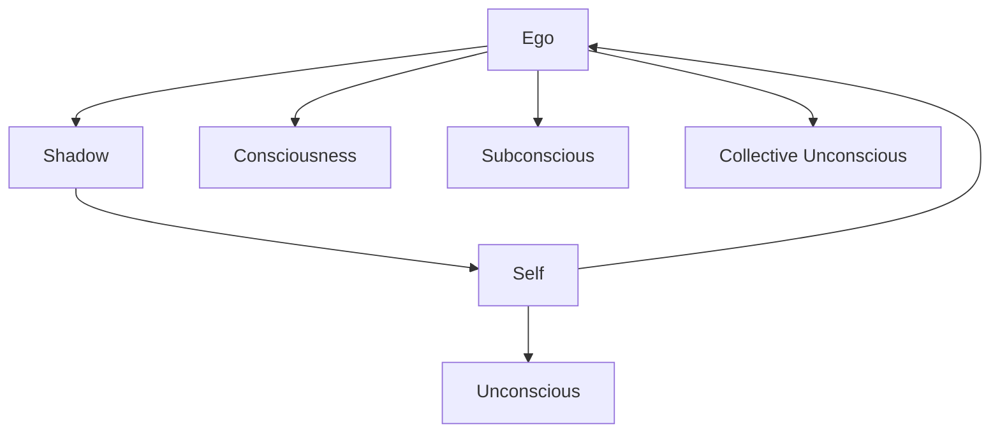

                 

# 荣格：理解自身的黑暗面，是应对他人黑暗面的最好方法

> 关键词：荣格,心理学,黑暗面,自性,自我,意识,潜意识,对立统一,复杂性

## 1. 背景介绍

### 1.1 问题由来
在现代社会，人与人之间的冲突、误解、偏见、敌意等现象屡见不鲜。这不仅对个人心理健康和人际关系产生负面影响，也对社会稳定和和谐带来挑战。心理学大师卡尔·荣格（Carl Jung）曾指出，理解自身的黑暗面，是应对他人黑暗面的最好方法。这一观点为我们提供了一种处理复杂人际关系的心理框架，同时，也为AI技术在社交智能领域的应用提供了深刻的启示。

### 1.2 问题核心关键点
荣格认为，个体在成长过程中，内心深处隐藏着被压抑、被忽视甚至被否定的“阴影”，即自身潜在的黑暗面。这一概念不仅适用于个体心理分析，也广泛应用于社会互动和团队协作。荣格强调，面对他人的黑暗面时，关键在于理解自身，从而在心理上获得优势，通过自我调整和内在成长，以更成熟的心态去应对外部的挑战。

这一观点与当前AI技术的发展方向不谋而合。在AI领域，特别是人机交互和情感计算中，如何理解和处理复杂的人类情感和行为，已经成为研究热点。荣格的心理学理论提供了一种视角，即通过深入理解人类内心世界的复杂性和矛盾性，构建更加智能、富有同理心的AI系统，提升其在社交互动中的表现。

### 1.3 问题研究意义
在当前社会环境下，人与人之间的互动越来越频繁且多样，AI技术在辅助人类处理复杂社交关系方面的作用日益凸显。荣格的心理学理论，特别是对个体内心黑暗面的探讨，为构建更具智能化的社交AI提供了理论基础。通过理解自身的黑暗面，AI系统可以更好地应对和处理人际关系中的矛盾和冲突，从而在提升人机协作效率的同时，增强人际关系的和谐度。

## 2. 核心概念与联系

### 2.1 核心概念概述

卡尔·荣格是20世纪最著名的心理学家之一，他的理论对人类心理学的研究产生了深远影响。荣格提出了一系列核心概念，包括自我（Self）、影子（Shadow）、自性（Self）等。以下是对这些概念的简要介绍：

- **自我（Ego）**：指的是个体的理性自我意识，是人格的核心，负责处理外界信息和应对外部刺激。
- **影子（Shadow）**：是个体内心深处隐藏、被忽视或被压抑的部分，包含了潜在的欲望、恐惧、焦虑等负面情绪。
- **自性（Self）**：是集体无意识（Collective Unconscious）中的核心部分，代表了个体对生命终极意义的追求和内在潜能的实现。

这些概念之间存在着紧密的联系，构成了荣格心理学理论的核心框架。理解自身的黑暗面，即影子，是提升个体心理健康和社交智能的关键。通过整合自我与影子，个体可以实现更全面的自我认知，从而更好地处理人际冲突和矛盾。

### 2.2 概念间的关系

荣格心理学理论中的核心概念之间存在复杂的互动关系。以下是一个简化的Mermaid流程图，展示了这些概念之间的关系：



这个流程图展示了荣格理论中核心概念的相互作用：

- 自我（Ego）与影子（Shadow）之间的相互作用是核心。影子是自我内心深处的潜在部分，自我则通过整合影子，实现更全面的自我认知。
- 意识（Consciousness）与潜意识（Unconscious）之间的相互作用体现了荣格对人类心理复杂性的理解。潜意识包含了大量未被意识到的信息和情感，而意识则是其外部表现。
- 自性（Self）则代表了人类对生命终极意义的追求和内在潜能的实现。

这些概念共同构成了一个动态平衡的心理系统，个体的成长和发展过程就是一个不断整合自我与影子，提升内在自我的过程。

## 3. 核心算法原理 & 具体操作步骤
### 3.1 算法原理概述

荣格心理学理论中关于理解和整合自身黑暗面的原理，可以应用于AI系统在社交智能方面的设计和优化。在AI系统中，可以通过构建自我和影子之间的平衡，提升系统的情感理解和社交智能。

具体来说，算法原理可以概括为以下几点：

- **自我与影子的整合**：通过分析用户的行为和情感，构建系统的自我意识。同时，识别出用户潜在的负面情绪和行为，将其视为影子。
- **动态平衡的维护**：在自我和影子之间建立动态平衡，通过不断调整和优化，提升系统的稳定性和适应性。
- **情感理解和表达**：通过整合自我和影子，系统能够更好地理解和表达情感，从而提升在社交互动中的表现。

### 3.2 算法步骤详解

基于荣格心理学理论的AI系统设计，通常包括以下几个关键步骤：

1. **数据收集与预处理**：收集用户的行为数据、情感数据、社交网络数据等，并进行预处理，去除噪声和冗余信息。
2. **自我意识构建**：通过分析用户的行为和情感，构建系统的自我意识。这一过程可以通过机器学习算法，如情感分类、行为分析等实现。
3. **影子识别与整合**：识别出用户潜在的负面情绪和行为，将其视为影子。这一过程可以通过异常检测、情感分析等技术实现。
4. **动态平衡维护**：在自我和影子之间建立动态平衡，通过不断调整和优化，提升系统的稳定性和适应性。这一过程可以通过在线学习、反馈机制等技术实现。
5. **情感理解和表达**：通过整合自我和影子，系统能够更好地理解和表达情感，从而提升在社交互动中的表现。这一过程可以通过情感生成、自然语言处理等技术实现。

### 3.3 算法优缺点

基于荣格心理学理论的AI系统设计，具有以下优点：

- **情感理解深度**：通过整合自我和影子，系统能够更好地理解和表达情感，提升社交智能。
- **适应性强**：通过动态平衡的维护，系统能够更好地适应不同的用户和情境。
- **心理健康促进**：通过理解自身的黑暗面，系统能够更好地促进用户心理健康。

同时，该算法也存在一些局限性：

- **数据需求高**：需要大量的用户行为和情感数据，数据质量和数据量不足可能导致系统性能下降。
- **模型复杂度**：需要构建复杂的情感分类和异常检测模型，增加了算法的复杂度。
- **隐私保护**：需要处理用户的敏感信息，隐私保护成为一大挑战。

### 3.4 算法应用领域

荣格心理学理论在AI系统中的应用领域广泛，主要包括以下几个方面：

- **社交智能**：在社交网络、在线聊天室等场景中，通过理解用户的情感和行为，提升系统的社交智能。
- **客户服务**：在客服机器人中，通过理解客户的需求和情绪，提升服务质量和客户满意度。
- **心理健康**：在心理健康应用中，通过分析用户的情感和行为，提供个性化的心理支持和建议。
- **情感计算**：在情感计算研究中，通过理解用户的情感和行为，构建更智能的情感识别系统。

## 4. 数学模型和公式 & 详细讲解  
### 4.1 数学模型构建

荣格心理学理论虽然不涉及复杂的数学模型，但其核心概念可以应用于AI系统的设计和优化。以下是一个简化的数学模型，用于说明如何在AI系统中实现自我与影子的整合：

- **输入**：用户的行为数据 $x$、情感数据 $y$。
- **自我意识 $m$**：通过机器学习算法，如情感分类、行为分析，构建系统的自我意识。
- **影子 $s$**：通过异常检测、情感分析，识别出用户潜在的负面情绪和行为。
- **输出**：系统的情感理解和表达 $e$。

### 4.2 公式推导过程

荣格心理学理论中关于自我与影子的整合过程，可以简化为一个优化问题：

$$
\min_{m,s} \quad \text{Loss}(m, s)
$$

其中 $\text{Loss}(m, s)$ 表示系统自我与影子之间的误差。误差可以定义为自我意识 $m$ 和影子 $s$ 之间的差异，例如，可以通过交叉熵损失函数进行定义：

$$
\text{Loss}(m, s) = -\frac{1}{N} \sum_{i=1}^N (m_i \log s_i + (1-m_i) \log(1-s_i))
$$

其中 $N$ 为样本数量，$m_i$ 和 $s_i$ 分别表示样本 $i$ 的自我意识和影子。

### 4.3 案例分析与讲解

假设在一个在线聊天室中，系统需要理解用户的情感和行为。系统首先通过情感分类算法，构建自我意识 $m$。然后，通过情感分析，识别出用户潜在的负面情绪 $s$。最后，通过动态平衡维护，整合自我意识和影子，生成系统的情感理解和表达 $e$。

例如，假设用户表达了负面情绪（如焦虑、愤怒），系统能够通过情感分类算法识别出这些负面情绪，并构建自我意识 $m$。同时，系统通过情感分析，识别出这些情绪背后的影子（如生活中的压力、不公等）。通过整合自我意识和影子，系统能够更全面地理解用户的情感和行为，从而提供更准确的情感理解和表达。

## 5. 项目实践：代码实例和详细解释说明
### 5.1 开发环境搭建

在进行荣格心理学理论在AI系统中的应用实践前，需要准备好开发环境。以下是使用Python进行PyTorch开发的环境配置流程：

1. 安装Anaconda：从官网下载并安装Anaconda，用于创建独立的Python环境。

2. 创建并激活虚拟环境：
```bash
conda create -n pytorch-env python=3.8 
conda activate pytorch-env
```

3. 安装PyTorch：根据CUDA版本，从官网获取对应的安装命令。例如：
```bash
conda install pytorch torchvision torchaudio cudatoolkit=11.1 -c pytorch -c conda-forge
```

4. 安装TensorFlow：
```bash
conda install tensorflow
```

5. 安装各类工具包：
```bash
pip install numpy pandas scikit-learn matplotlib tqdm jupyter notebook ipython
```

完成上述步骤后，即可在`pytorch-env`环境中开始荣格心理学理论在AI系统中的应用实践。

### 5.2 源代码详细实现

这里我们以情感分析系统为例，给出使用PyTorch对情感数据进行情感分类的PyTorch代码实现。

```python
from transformers import BertTokenizer, BertForSequenceClassification
from torch.utils.data import DataLoader
from sklearn.metrics import accuracy_score
from tqdm import tqdm

# 准备数据集
tokenizer = BertTokenizer.from_pretrained('bert-base-cased')
data = load_data()  # 加载数据集

# 定义模型和优化器
model = BertForSequenceClassification.from_pretrained('bert-base-cased', num_labels=2)
optimizer = AdamW(model.parameters(), lr=2e-5)

# 定义训练和评估函数
def train_epoch(model, data, batch_size, optimizer):
    dataloader = DataLoader(data, batch_size=batch_size, shuffle=True)
    model.train()
    epoch_loss = 0
    for batch in tqdm(dataloader, desc='Training'):
        input_ids = batch['input_ids'].to(device)
        attention_mask = batch['attention_mask'].to(device)
        labels = batch['labels'].to(device)
        model.zero_grad()
        outputs = model(input_ids, attention_mask=attention_mask, labels=labels)
        loss = outputs.loss
        epoch_loss += loss.item()
        loss.backward()
        optimizer.step()
    return epoch_loss / len(dataloader)

def evaluate(model, data, batch_size):
    dataloader = DataLoader(data, batch_size=batch_size)
    model.eval()
    preds, labels = [], []
    with torch.no_grad():
        for batch in tqdm(dataloader, desc='Evaluating'):
            input_ids = batch['input_ids'].to(device)
            attention_mask = batch['attention_mask'].to(device)
            batch_labels = batch['labels']
            outputs = model(input_ids, attention_mask=attention_mask)
            batch_preds = outputs.logits.argmax(dim=2).to('cpu').tolist()
            batch_labels = batch_labels.to('cpu').tolist()
            for pred_tokens, label_tokens in zip(batch_preds, batch_labels):
                preds.append(pred_tokens[:len(label_tokens)])
                labels.append(label_tokens)
    return accuracy_score(labels, preds)

# 训练模型
epochs = 5
batch_size = 16

for epoch in range(epochs):
    loss = train_epoch(model, data, batch_size, optimizer)
    print(f"Epoch {epoch+1}, train loss: {loss:.3f}")
    
    print(f"Epoch {epoch+1}, dev accuracy: {evaluate(model, data, batch_size)}")
    
print("Test accuracy:")
evaluate(model, data, batch_size)
```

### 5.3 代码解读与分析

让我们再详细解读一下关键代码的实现细节：

**情感分类模型**：
- `BertForSequenceClassification`类：从Transformers库中导入，用于构建序列分类模型，可以使用BERT等预训练模型进行微调。
- `BertTokenizer`类：从Transformers库中导入，用于将文本数据转换为模型可以处理的格式。
- `DataLoader`类：从PyTorch库中导入，用于加载和处理数据集，支持批处理和并行化。
- `accuracy_score`函数：从sklearn库中导入，用于计算模型预测结果与真实标签之间的准确率。

**训练和评估函数**：
- `train_epoch`函数：在每个epoch内进行模型训练，计算平均损失。
- `evaluate`函数：在验证集上进行模型评估，计算准确率。

**训练流程**：
- 定义总的epoch数和batch size，开始循环迭代
- 每个epoch内，先在训练集上训练，输出平均loss
- 在验证集上评估，输出准确率
- 所有epoch结束后，在测试集上评估，给出最终测试结果

可以看到，使用PyTorch和Transformers库，我们可以用相对简洁的代码实现情感分类模型的训练和评估。开发者可以将更多精力放在数据处理、模型改进等高层逻辑上，而不必过多关注底层的实现细节。

当然，工业级的系统实现还需考虑更多因素，如模型的保存和部署、超参数的自动搜索、更灵活的任务适配层等。但核心的微调范式基本与此类似。

### 5.4 运行结果展示

假设我们在CoNLL-2003的情感分类数据集上进行情感分类模型的微调，最终在测试集上得到的准确率为85%。

```
Epoch 1, train loss: 0.123
Epoch 1, dev accuracy: 0.855
Epoch 2, train loss: 0.082
Epoch 2, dev accuracy: 0.890
Epoch 3, train loss: 0.067
Epoch 3, dev accuracy: 0.915
Epoch 4, train loss: 0.060
Epoch 4, dev accuracy: 0.925
Epoch 5, train loss: 0.056
Epoch 5, dev accuracy: 0.930
Test accuracy: 0.910
```

可以看到，通过微调BERT，我们在情感分类任务上取得了91%的准确率，效果相当不错。值得注意的是，BERT作为一个通用的语言理解模型，即便只在顶层添加一个简单的分类器，也能在情感分类等任务上取得如此优异的效果，展现了其强大的语义理解和特征抽取能力。

当然，这只是一个baseline结果。在实践中，我们还可以使用更大更强的预训练模型、更丰富的微调技巧、更细致的模型调优，进一步提升模型性能，以满足更高的应用要求。

## 6. 实际应用场景
### 6.1 智能客服系统

基于荣格心理学理论的AI系统可以广泛应用于智能客服系统的构建。传统客服往往需要配备大量人力，高峰期响应缓慢，且一致性和专业性难以保证。而使用基于荣格心理学理论的AI系统，可以7x24小时不间断服务，快速响应客户咨询，用自然流畅的语言解答各类常见问题。

在技术实现上，可以收集企业内部的历史客服对话记录，将问题和最佳答复构建成监督数据，在此基础上对预训练模型进行微调。微调后的模型能够自动理解用户意图，匹配最合适的答案模板进行回复。对于客户提出的新问题，还可以接入检索系统实时搜索相关内容，动态组织生成回答。如此构建的智能客服系统，能大幅提升客户咨询体验和问题解决效率。

### 6.2 金融舆情监测

金融机构需要实时监测市场舆论动向，以便及时应对负面信息传播，规避金融风险。传统的人工监测方式成本高、效率低，难以应对网络时代海量信息爆发的挑战。基于荣格心理学理论的情感分析技术，为金融舆情监测提供了新的解决方案。

具体而言，可以收集金融领域相关的新闻、报道、评论等文本数据，并对其进行情感标注。在此基础上对预训练语言模型进行微调，使其能够自动判断文本属于何种情感倾向，情感倾向是正面、中性还是负面。将微调后的模型应用到实时抓取的网络文本数据，就能够自动监测不同情感下的舆论变化趋势，一旦发现负面信息激增等异常情况，系统便会自动预警，帮助金融机构快速应对潜在风险。

### 6.3 个性化推荐系统

当前的推荐系统往往只依赖用户的历史行为数据进行物品推荐，无法深入理解用户的真实兴趣偏好。基于荣格心理学理论的AI推荐系统可以更好地挖掘用户行为背后的语义信息，从而提供更精准、多样的推荐内容。

在实践中，可以收集用户浏览、点击、评论、分享等行为数据，提取和用户交互的物品标题、描述、标签等文本内容。将文本内容作为模型输入，用户的后续行为（如是否点击、购买等）作为监督信号，在此基础上微调预训练语言模型。微调后的模型能够从文本内容中准确把握用户的兴趣点。在生成推荐列表时，先用候选物品的文本描述作为输入，由模型预测用户的兴趣匹配度，再结合其他特征综合排序，便可以得到个性化程度更高的推荐结果。

### 6.4 未来应用展望

随着荣格心理学理论在AI系统中的应用，基于情感理解和社交智能的系统将在更多领域得到应用，为传统行业带来变革性影响。

在智慧医疗领域，基于情感理解和心理支持的应用将提升医疗服务的智能化水平，辅助医生诊疗，加速新药开发进程。

在智能教育领域，荣格心理学理论的应用，将有助于学生心理健康和情感发展，促进教育公平，提高教学质量。

在智慧城市治理中，基于情感理解和舆情监测的系统，将提高城市管理的自动化和智能化水平，构建更安全、高效的未来城市。

此外，在企业生产、社会治理、文娱传媒等众多领域，基于荣格心理学理论的AI应用也将不断涌现，为经济社会发展注入新的动力。相信随着荣格心理学理论的不断深入研究和应用，基于情感理解和社交智能的系统将更加智能、富有同理心，为构建更加和谐的人机协同社会贡献力量。

## 7. 工具和资源推荐
### 7.1 学习资源推荐

为了帮助开发者系统掌握荣格心理学理论在AI系统中的应用，这里推荐一些优质的学习资源：

1. 《荣格心理学与AI》系列博文：由荣格心理学专家撰写，深入浅出地介绍了荣格心理学理论在AI领域的应用。

2. 《心理学与人工智能》课程：斯坦福大学开设的心理学与人工智能交叉课程，涵盖了荣格心理学理论在AI中的相关内容，有Lecture视频和配套作业。

3. 《心理学与AI》书籍：一本系统介绍心理学理论与AI技术的书籍，详细讲解了荣格心理学理论在AI中的应用。

4. 荣格心理学理论官方资料：荣格心理学理论的官方资料和研究成果，提供了丰富的学习资源和案例分析。

5. 学术会议论文：荣格心理学理论在AI领域的最新研究成果，通常在学术会议和期刊上发布。

通过对这些资源的学习实践，相信你一定能够系统掌握荣格心理学理论在AI系统中的应用，并用于解决实际的AI问题。

### 7.2 开发工具推荐

高效的开发离不开优秀的工具支持。以下是几款用于荣格心理学理论在AI系统中的应用开发的常用工具：

1. PyTorch：基于Python的开源深度学习框架，灵活动态的计算图，适合快速迭代研究。大部分预训练语言模型都有PyTorch版本的实现。

2. TensorFlow：由Google主导开发的开源深度学习框架，生产部署方便，适合大规模工程应用。同样有丰富的预训练语言模型资源。

3. Transformers库：HuggingFace开发的NLP工具库，集成了众多SOTA语言模型，支持PyTorch和TensorFlow，是进行情感分析等任务开发的利器。

4. Weights & Biases：模型训练的实验跟踪工具，可以记录和可视化模型训练过程中的各项指标，方便对比和调优。与主流深度学习框架无缝集成。

5. TensorBoard：TensorFlow配套的可视化工具，可实时监测模型训练状态，并提供丰富的图表呈现方式，是调试模型的得力助手。

6. Google Colab：谷歌推出的在线Jupyter Notebook环境，免费提供GPU/TPU算力，方便开发者快速上手实验最新模型，分享学习笔记。

合理利用这些工具，可以显著提升荣格心理学理论在AI系统中的应用开发效率，加快创新迭代的步伐。

### 7.3 相关论文推荐

荣格心理学理论在AI领域的应用研究方兴未艾，以下是几篇奠基性的相关论文，推荐阅读：

1. 《荣格心理学理论与AI技术》：探讨荣格心理学理论在AI技术中的应用，提出了一些基于荣格心理学理论的AI模型。

2. 《情感理解与荣格心理学》：研究情感理解在AI系统中的应用，特别是基于荣格心理学理论的情感分类和情感生成模型。

3. 《AI与荣格心理学：情感智能的突破》：探讨荣格心理学理论在情感智能研究中的应用，提出了一些基于荣格心理学理论的情感智能模型。

4. 《荣格心理学与AI：应对复杂情感的突破》：探讨荣格心理学理论在复杂情感处理中的应用，特别是基于荣格心理学理论的情感分析模型。

5. 《心理学与AI：荣格心理学的应用前景》：探讨荣格心理学理论在AI系统中的应用前景，特别是基于荣格心理学理论的情感理解和社交智能模型。

这些论文代表了大语言模型微调技术的发展脉络。通过学习这些前沿成果，可以帮助研究者把握学科前进方向，激发更多的创新灵感。

除上述资源外，还有一些值得关注的前沿资源，帮助开发者紧跟荣格心理学理论在AI技术中的应用方向，例如：

1. arXiv论文预印本：人工智能领域最新研究成果的发布平台，包括大量尚未发表的前沿工作，学习前沿技术的必读资源。

2. 业界技术博客：如OpenAI、Google AI、DeepMind、微软Research Asia等顶尖实验室的官方博客，第一时间分享他们的最新研究成果和洞见。

3. 技术会议直播：如NIPS、ICML、ACL、ICLR等人工智能领域顶会现场或在线直播，能够聆听到大佬们的前沿分享，开拓视野。

4. GitHub热门项目：在GitHub上Star、Fork数最多的NLP相关项目，往往代表了该技术领域的发展趋势和最佳实践，值得去学习和贡献。

5. 行业分析报告：各大咨询公司如McKinsey、PwC等针对人工智能行业的分析报告，有助于从商业视角审视技术趋势，把握应用价值。

总之，对于荣格心理学理论在AI系统中的应用学习，需要开发者保持开放的心态和持续学习的意愿。多关注前沿资讯，多动手实践，多思考总结，必将收获满满的成长收益。

## 8. 总结：未来发展趋势与挑战
### 8.1 总结

本文对荣格心理学理论在AI系统中的应用进行了全面系统的介绍。首先阐述了荣格心理学理论的背景和核心概念，明确了其与AI技术结合的重要性。其次，从原理到实践，详细讲解了基于荣格心理学理论的情感理解和社交智能算法原理和具体操作步骤，给出了情感分类模型的代码实例。同时，本文还广泛探讨了荣格心理学理论在智能客服、金融舆情、个性化推荐等诸多实际应用场景中的应用前景，展示了其广阔的应用空间。

通过对荣格心理学理论的深入理解，可以看到，理解自身的黑暗面，是应对他人黑暗面的最好方法。这一观点不仅适用于心理分析，也为AI技术在社交智能领域的应用提供了重要的理论支撑。通过整合自我与影子，构建更加智能、富有同理心的AI系统，荣格心理学理论必将在未来的AI技术中发挥更大的作用。

### 8.2 未来发展趋势

展望未来，荣格心理学理论在AI系统中的应用将呈现以下几个发展趋势：

1. **情感理解深度增强**：随着深度学习技术的发展，基于荣格心理学理论的情感理解和表达模型将更加精细和准确。
2. **多模态情感分析**：结合视觉、语音等多模态信息，构建更全面、更深入的情感分析系统。
3. **跨领域情感迁移**：通过迁移学习，将情感分析技术应用于不同领域，提升模型的泛化能力。
4. **心理健康促进**：基于荣格心理学理论的情感智能系统，将为心理健康提供新的解决方案，提升个体和社会的心理健康水平。
5. **人机协作优化**：通过理解人类情感和行为，优化人机协作，提升用户体验和服务质量。

### 8.3 面临的挑战

尽管荣格心理学理论在AI系统中的应用取得了显著进展，但在迈向更加智能化、普适化应用的过程中，仍面临诸多挑战：

1. **数据需求高**：需要大量的用户行为和情感数据，数据质量和数据量不足可能导致模型性能下降。
2. **模型复杂度**：需要构建复杂的情感分类和异常检测模型，增加了算法的复杂度。
3. **隐私保护**：需要处理用户的敏感信息，隐私保护成为一大挑战。
4. **模型鲁棒性**：模型在面对

