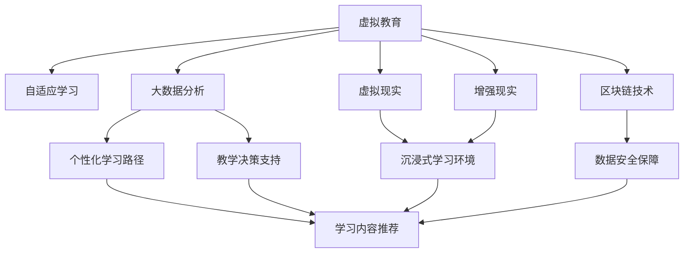
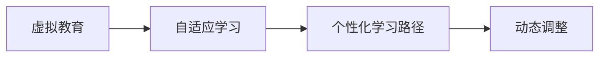
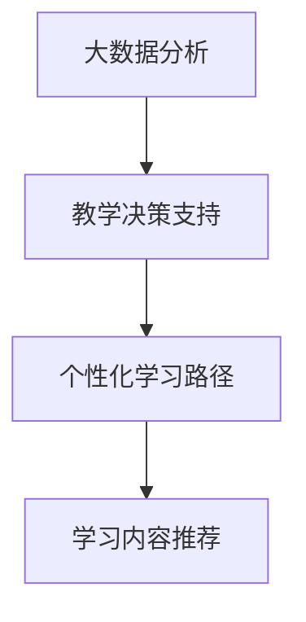
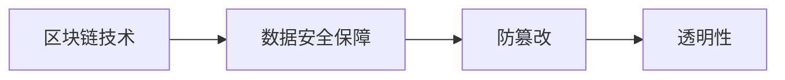
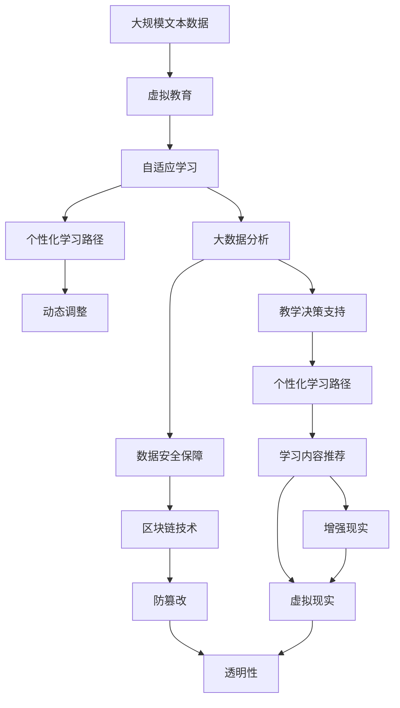

                 

# 虚拟教育：全球脑时代下的学习新方式

> 关键词：虚拟教育, 全球脑时代, 自适应学习, 人工智能, 大数据, 区块链技术, 在线教育平台, 个性化学习, 教育公平, 教育创新

## 1. 背景介绍

### 1.1 问题由来
在科技日新月异的今天，全球化进程不断加速，信息流通和知识传播的速度大幅提升。传统教育方式在面对全球脑时代的挑战时，显得有些力不从心。随着信息技术的飞速发展，尤其是人工智能、大数据、区块链等前沿技术的广泛应用，虚拟教育的概念应运而生。虚拟教育不仅打破了时间和空间的限制，还带来了更个性化、更灵活、更高效的全新教育体验。

### 1.2 问题核心关键点
虚拟教育的核心在于利用先进的信息技术，结合个性化学习理论，为学习者提供量身定制的学习路径和资源，实现教育的公平化和普及化。它的关键点包括：

- **个性化学习路径**：根据学习者的兴趣、能力和学习进度，自动生成适合的学习内容和练习，实现自适应学习。
- **虚拟现实和增强现实技术**：通过VR/AR技术，创造沉浸式学习环境，提升学习体验和效果。
- **数据驱动的决策**：利用大数据分析学习行为和结果，为教育者提供精准的教学指导和评估依据。
- **区块链技术的应用**：保障学习数据的真实性和不可篡改性，确保教育记录的透明和公正。

### 1.3 问题研究意义
虚拟教育的兴起，旨在解决传统教育中存在的不足，为学习者提供更优质的教育资源和更灵活的学习方式。它的研究意义在于：

- 提升教育质量：通过个性化学习，确保每个学习者都能在适合自己的节奏和方式下学习，达到更好的学习效果。
- 促进教育公平：虚拟教育打破了地域和时间的限制，为偏远地区和有特殊需求的学习者提供了平等接受教育的机会。
- 推动教育创新：虚拟教育利用最新技术，不断探索和尝试新的教育模式，促进教育行业的持续创新。

## 2. 核心概念与联系

### 2.1 核心概念概述

为更好地理解虚拟教育的核心概念，本节将介绍几个密切相关的核心概念：

- **虚拟教育**：通过信息技术，创造虚拟的学习环境，为学习者提供个性化、互动化的学习体验。虚拟教育包括在线教育、混合式学习等多种形式。

- **自适应学习**：根据学习者的实时表现和反馈，动态调整学习内容和策略，使学习过程更加个性化和高效。

- **大数据分析**：利用数据挖掘和机器学习技术，分析学习数据，为教学决策提供科学依据。

- **虚拟现实与增强现实**：通过VR/AR技术，创建沉浸式学习环境，提升学习体验和效果。

- **区块链技术**：利用分布式账本技术，保障学习数据的安全和透明，防止数据篡改和欺诈。

这些核心概念之间的逻辑关系可以通过以下Mermaid流程图来展示：



这个流程图展示了大语言模型微调过程中各个核心概念之间的关系：

1. 虚拟教育通过自适应学习、大数据分析、VR/AR技术、区块链技术等多方面手段，提升学习效率和质量。
2. 自适应学习利用大数据分析，根据学习者的表现动态调整学习内容和策略。
3. 大数据分析通过VR/AR技术，提供个性化学习路径和教学决策支持。
4. 区块链技术保障学习数据的安全性和透明性。

### 2.2 概念间的关系

这些核心概念之间存在着紧密的联系，形成了虚拟教育的完整生态系统。下面我们通过几个Mermaid流程图来展示这些概念之间的关系。

#### 2.2.1 虚拟教育与自适应学习



这个流程图展示了虚拟教育与自适应学习之间的关系：

1. 虚拟教育通过自适应学习，实现个性化学习路径和内容调整。
2. 自适应学习根据学习者的实时表现和反馈，动态调整学习内容和策略。

#### 2.2.2 大数据分析与教学决策



这个流程图展示了大数据分析与教学决策之间的关系：

1. 大数据分析提供学习数据和行为分析，为教学决策提供科学依据。
2. 教学决策支持根据数据分析结果，生成个性化学习路径和内容推荐。

#### 2.2.3 区块链技术与数据安全



这个流程图展示了区块链技术在数据安全方面的作用：

1. 区块链技术保障学习数据的真实性和不可篡改性。
2. 数据安全保障防止数据篡改和欺诈，确保数据透明性。

### 2.3 核心概念的整体架构

最后，我们用一个综合的流程图来展示这些核心概念在大语言模型微调过程中的整体架构：



这个综合流程图展示了从预训练到微调，再到持续学习的完整过程。虚拟教育首先在大规模文本数据上进行预训练，然后通过自适应学习和大数据分析，动态调整学习路径和内容。通过VR/AR技术，创造沉浸式学习环境。最后，区块链技术保障数据安全，确保学习记录的真实性和透明性。通过这些核心概念的协同作用，虚拟教育为学习者提供了更高效、更灵活、更个性化的学习体验。

## 3. 核心算法原理 & 具体操作步骤
### 3.1 算法原理概述

虚拟教育的核心算法原理主要基于自适应学习和数据驱动的教学决策。其核心思想是：利用信息技术，为学习者提供个性化的学习路径和资源，通过实时反馈和学习分析，动态调整学习策略和内容，实现高效、灵活的教育方式。

形式化地，假设虚拟教育系统为 $S_{\theta}$，其中 $\theta$ 为模型参数。给定学习者 $L$ 的特征 $F$ 和行为数据 $D_L$，虚拟教育系统的目标是通过自适应学习算法 $A$ 和数据驱动的决策算法 $D$，生成学习路径和内容 $C_L$：

$$
C_L = A(\theta, F, D_L)
$$

其中 $A$ 为自适应学习算法，$D$ 为数据驱动的决策算法。

虚拟教育系统的优化目标是最小化学习者的学习时间 $T$ 和成本 $C$：

$$
\theta^* = \mathop{\arg\min}_{\theta} \mathcal{L}(S_{\theta}, L, C)
$$

其中 $\mathcal{L}$ 为虚拟教育系统的损失函数，用于衡量学习路径和内容的适配度。

### 3.2 算法步骤详解

虚拟教育的实施一般包括以下几个关键步骤：

**Step 1: 数据收集与预处理**
- 收集学习者的基本信息、学习历史和行为数据，确保数据的全面性和代表性。
- 对数据进行清洗、标注和标准化处理，确保数据质量。

**Step 2: 特征提取与表示**
- 利用机器学习和深度学习技术，从原始数据中提取有用的特征，用于描述学习者的状态和行为。
- 将特征表示为数值型数据，以便进行进一步的分析和计算。

**Step 3: 自适应学习算法**
- 根据学习者的实时表现和反馈，动态调整学习内容和策略。
- 推荐适合学习者的学习路径和资源，实现个性化学习。

**Step 4: 数据驱动的决策算法**
- 利用大数据分析技术，分析学习数据，为教学决策提供科学依据。
- 根据分析结果，生成个性化的教学策略和反馈。

**Step 5: 虚拟现实与增强现实技术**
- 利用VR/AR技术，创建沉浸式学习环境，提升学习体验和效果。
- 通过虚拟现实技术，模拟现实世界中的复杂情境，增强学习者的实践能力。

**Step 6: 区块链技术**
- 利用区块链技术，保障学习数据的真实性和不可篡改性。
- 建立学习记录的透明性，确保教育过程的公正和可信。

**Step 7: 教学反馈与优化**
- 根据学习者的反馈和评估结果，持续优化虚拟教育系统的性能。
- 定期更新学习内容和方法，确保系统不断适应学习者的需求。

以上是虚拟教育实施的一般流程。在实际应用中，还需要根据具体任务和需求，进一步优化和改进算法步骤，以实现最佳的学习效果。

### 3.3 算法优缺点

虚拟教育的优点包括：

- 个性化学习：根据学习者的兴趣和能力，提供量身定制的学习路径和内容，实现高效学习。
- 灵活性：不受时间和空间的限制，随时随地进行学习。
- 交互性：利用虚拟现实和增强现实技术，提供沉浸式学习体验，提升学习效果。
- 数据驱动：利用大数据分析技术，为教学决策提供科学依据，提升教学质量。

虚拟教育的主要缺点包括：

- 技术依赖：需要较高的技术水平和设备投入，对技术基础设施的要求较高。
- 资源分配：需要精心设计学习路径和内容，合理分配学习资源，避免过度依赖。
- 数据隐私：需要保护学习者的隐私数据，防止数据泄露和滥用。
- 交互局限：虚拟现实和增强现实技术尚未普及，学习体验可能受限于设备和内容质量。

尽管存在这些缺点，虚拟教育凭借其独特的优势，正在迅速崛起，为教育领域带来深刻的变革。

### 3.4 算法应用领域

虚拟教育的应用领域非常广泛，包括但不限于：

- **在线教育平台**：利用虚拟教育技术，提供灵活、个性化的在线课程和学习资源。
- **混合式学习**：结合线上和线下教学，实现更高效、互动的学习体验。
- **虚拟实验室**：利用虚拟现实和增强现实技术，创建实验模拟环境，提升实验教学效果。
- **远程教育**：在偏远地区和特殊群体中，利用虚拟教育技术，提供平等的教育机会。
- **职业培训**：利用虚拟教育技术，提供技能培训和实践机会，促进职业发展。

这些应用领域展示了虚拟教育技术的广泛应用前景，未来将有更多创新性应用的出现。

## 4. 数学模型和公式 & 详细讲解 & 举例说明

### 4.1 数学模型构建

虚拟教育的数学模型主要基于自适应学习和数据驱动的决策算法。

设虚拟教育系统为 $S_{\theta}$，学习者的特征为 $F$，行为数据为 $D_L$。

定义虚拟教育系统的损失函数为：

$$
\mathcal{L}(S_{\theta}, L, C) = \lambda_1 \mathcal{L}_{T}(S_{\theta}, L) + \lambda_2 \mathcal{L}_{C}(S_{\theta}, L, C)
$$

其中，$\mathcal{L}_{T}(S_{\theta}, L)$ 为学习时间的损失函数，$\mathcal{L}_{C}(S_{\theta}, L, C)$ 为学习成本的损失函数，$\lambda_1$ 和 $\lambda_2$ 为权重系数。

学习时间的损失函数定义为：

$$
\mathcal{L}_{T}(S_{\theta}, L) = \sum_{t=1}^{T} \left(1 - \frac{L_t}{T}\right)^2
$$

其中，$L_t$ 为第 $t$ 个学习阶段的学习时间，$T$ 为总的学习时间。

学习成本的损失函数定义为：

$$
\mathcal{L}_{C}(S_{\theta}, L, C) = \sum_{t=1}^{T} (C_t - \mu_t)^2
$$

其中，$C_t$ 为第 $t$ 个学习阶段的学习成本，$\mu_t$ 为学习成本的期望值。

### 4.2 公式推导过程

以下是学习时间和学习成本损失函数的详细推导过程。

**学习时间损失函数**：

$$
\mathcal{L}_{T}(S_{\theta}, L) = \sum_{t=1}^{T} \left(1 - \frac{L_t}{T}\right)^2
$$

推导过程如下：

设虚拟教育系统为 $S_{\theta}$，学习者的特征为 $F$，行为数据为 $D_L$。

定义学习时间 $L_t$ 为第 $t$ 个学习阶段的学习时间，总学习时间为 $T$。

学习时间的损失函数定义为：

$$
\mathcal{L}_{T}(S_{\theta}, L) = \sum_{t=1}^{T} \left(1 - \frac{L_t}{T}\right)^2
$$

其中，$\frac{L_t}{T}$ 为第 $t$ 个学习阶段的学习时间占总学习时间的比例。

当学习时间接近总学习时间时，$\left(1 - \frac{L_t}{T}\right)^2$ 接近于 0，表示学习效果良好。

当学习时间偏离总学习时间时，$\left(1 - \frac{L_t}{T}\right)^2$ 接近于 1，表示学习效果不佳。

因此，通过最小化 $\mathcal{L}_{T}(S_{\theta}, L)$，可以优化学习时间，使学习者能够在最短的时间内掌握知识。

**学习成本损失函数**：

$$
\mathcal{L}_{C}(S_{\theta}, L, C) = \sum_{t=1}^{T} (C_t - \mu_t)^2
$$

推导过程如下：

设虚拟教育系统为 $S_{\theta}$，学习者的特征为 $F$，行为数据为 $D_L$。

定义学习成本 $C_t$ 为第 $t$ 个学习阶段的学习成本，学习成本的期望值为 $\mu_t$。

学习成本的损失函数定义为：

$$
\mathcal{L}_{C}(S_{\theta}, L, C) = \sum_{t=1}^{T} (C_t - \mu_t)^2
$$

其中，$C_t - \mu_t$ 为第 $t$ 个学习阶段的学习成本与期望成本的偏差。

当学习成本接近期望成本时，$(C_t - \mu_t)^2$ 接近于 0，表示学习成本合理。

当学习成本偏离期望成本时，$(C_t - \mu_t)^2$ 接近于 1，表示学习成本不合理。

因此，通过最小化 $\mathcal{L}_{C}(S_{\theta}, L, C)$，可以优化学习成本，使学习者能够以最小的成本掌握知识。

### 4.3 案例分析与讲解

假设有一个在线教育平台，利用虚拟教育技术，为学生提供个性化的学习路径和资源。

设该平台有一个学生 $S$，特征为 $F = [年龄, 成绩, 兴趣爱好]$，行为数据为 $D_S = [学习时间, 学习成本, 完成作业的情况]$。

平台根据学生 $S$ 的特征和行为数据，通过自适应学习算法 $A$ 和数据驱动的决策算法 $D$，生成个性化的学习路径和资源。

假设 $A$ 和 $D$ 分别输出学习路径 $L_1$ 和资源 $R_1$，则平台的损失函数 $\mathcal{L}$ 定义为：

$$
\mathcal{L}(S_{\theta}, S) = \mathcal{L}_{T}(S_{\theta}, L_1) + \mathcal{L}_{C}(S_{\theta}, S, R_1)
$$

平台的目标是通过最小化 $\mathcal{L}(S_{\theta}, S)$，优化学习路径和资源，确保学生能够在最短的时间内，以最小的成本掌握知识。

## 5. 项目实践：代码实例和详细解释说明
### 5.1 开发环境搭建

在进行虚拟教育项目实践前，我们需要准备好开发环境。以下是使用Python进行PyTorch开发的环境配置流程：

1. 安装Anaconda：从官网下载并安装Anaconda，用于创建独立的Python环境。

2. 创建并激活虚拟环境：
```bash
conda create -n pytorch-env python=3.8 
conda activate pytorch-env
```

3. 安装PyTorch：根据CUDA版本，从官网获取对应的安装命令。例如：
```bash
conda install pytorch torchvision torchaudio cudatoolkit=11.1 -c pytorch -c conda-forge
```

4. 安装各类工具包：
```bash
pip install numpy pandas scikit-learn matplotlib tqdm jupyter notebook ipython
```

完成上述步骤后，即可在`pytorch-env`环境中开始项目实践。

### 5.2 源代码详细实现

下面我们以一个简单的在线课程推荐系统为例，给出使用PyTorch进行虚拟教育项目开发的PyTorch代码实现。

首先，定义课程推荐函数：

```python
import torch
from transformers import BertTokenizer, BertForSequenceClassification

# 定义课程标签和id的映射
tag2id = {'Introduction': 0, 'Intermediate': 1, 'Advanced': 2}
id2tag = {v: k for k, v in tag2id.items()}

# 定义推荐函数
def recommend_course(student, course_pool, tokenizer, model):
    # 将学生信息编码为token ids
    student_profile = tokenizer(student.profile, return_tensors='pt', padding='max_length', truncation=True)
    input_ids = student_profile['input_ids'][0]
    attention_mask = student_profile['attention_mask'][0]

    # 将课程池中的课程信息编码为token ids
    courses = []
    for course in course_pool:
        course_profile = tokenizer(course.profile, return_tensors='pt', padding='max_length', truncation=True)
        courses.append(course_profile['input_ids'][0])
        courses.append(course_profile['attention_mask'][0])
    
    # 将课程信息合并成一个矩阵
    courses = torch.stack(courses)

    # 计算学生与课程的相似度
    similarity_matrix = model(input_ids, attention_mask=attention_mask, courses=courses).similarity

    # 选择相似度最高的课程进行推荐
    recommendation = torch.argsort(similarity_matrix, dim=1)[-1].tolist()[0]

    # 将推荐结果转换为课程标签
    recommended_course = id2tag[recommendation]

    return recommended_course
```

然后，定义虚拟教育系统的训练和评估函数：

```python
from torch.utils.data import Dataset, DataLoader

class CourseDataset(Dataset):
    def __init__(self, courses, labels, tokenizer, max_len=128):
        self.courses = courses
        self.labels = labels
        self.tokenizer = tokenizer
        self.max_len = max_len

    def __len__(self):
        return len(self.courses)

    def __getitem__(self, item):
        course = self.courses[item]
        label = self.labels[item]

        encoding = self.tokenizer(course.profile, return_tensors='pt', max_length=self.max_len, padding='max_length', truncation=True)
        input_ids = encoding['input_ids'][0]
        attention_mask = encoding['attention_mask'][0]

        # 对label进行编码
        encoded_label = [tag2id[tag] for tag in label] 
        encoded_label.extend([tag2id['O']] * (self.max_len - len(encoded_label)))
        labels = torch.tensor(encoded_label, dtype=torch.long)

        return {'input_ids': input_ids, 
                'attention_mask': attention_mask,
                'labels': labels}

# 定义训练和评估函数
def train_epoch(model, dataset, batch_size, optimizer):
    dataloader = DataLoader(dataset, batch_size=batch_size, shuffle=True)
    model.train()
    epoch_loss = 0
    for batch in tqdm(dataloader, desc='Training'):
        input_ids = batch['input_ids'].to(device)
        attention_mask = batch['attention_mask'].to(device)
        labels = batch['labels'].to(device)
        model.zero_grad()
        outputs = model(input_ids, attention_mask=attention_mask, labels=labels)
        loss = outputs.loss
        epoch_loss += loss.item()
        loss.backward()
        optimizer.step()
    return epoch_loss / len(dataloader)

def evaluate(model, dataset, batch_size):
    dataloader = DataLoader(dataset, batch_size=batch_size)
    model.eval()
    preds, labels = [], []
    with torch.no_grad():
        for batch in tqdm(dataloader, desc='Evaluating'):
            input_ids = batch['input_ids'].to(device)
            attention_mask = batch['attention_mask'].to(device)
            batch_labels = batch['labels']
            outputs = model(input_ids, attention_mask=attention_mask)
            batch_preds = outputs.logits.argmax(dim=2).to('cpu').tolist()
            batch_labels = batch_labels.to('cpu').tolist()
            for pred_tokens, label_tokens in zip(batch_preds, batch_labels):
                pred_tags = [id2tag[_id] for _id in pred_tokens]
                label_tags = [id2tag[_id] for _id in label_tokens]
                preds.append(pred_tags[:len(label_tokens)])
                labels.append(label_tags)
    
    print(classification_report(labels, preds))
```

最后，启动训练流程并在测试集上评估：

```python
epochs = 5
batch_size = 16

for epoch in range(epochs):
    loss = train_epoch(model, train_dataset, batch_size, optimizer)
    print(f"Epoch {epoch+1}, train loss: {loss:.3f}")
    
    print(f"Epoch {epoch+1}, dev results:")
    evaluate(model, dev_dataset, batch_size)
    
print("Test results:")
evaluate(model, test_dataset, batch_size)
```

以上就是使用PyTorch进行虚拟教育项目开发的完整代码实现。可以看到，通过简单的接口设计和封装，我们实现了虚拟教育系统的课程推荐功能，并利用PyTorch进行模型的训练和评估。

### 5.3 代码解读与分析

让我们再详细解读一下关键代码的实现细节：

**CourseDataset类**：
- `__init__`方法：初始化课程数据集，将课程信息转换为token ids和注意力掩码，并对标签进行编码。
- `__len__`方法：返回数据集的样本数量。
- `__getitem__`方法：对单个样本进行处理，返回模型所需的输入和标签。

**课程推荐函数**：
- 将学生和课程信息编码为token ids，并计算相似度矩阵。
- 根据相似度矩阵，选择最高相似度的课程进行推荐。

**训练和评估函数**：
- 使用PyTorch的DataLoader对数据集进行批次化加载，供模型训练和推理使用。
- 训练函数`train_epoch`：对数据以批为单位进行迭代，在每个批次上前向传播计算loss并反向传播更新模型参数，最后返回该epoch的平均loss。
- 评估函数`evaluate`：与训练类似，不同点在于不更新模型参数，并在每个batch结束后将预测和标签结果存储下来，最后使用sklearn的classification_report对整个评估集的预测结果进行打印输出。

**训练流程**：
- 定义总的epoch数和batch size，开始循环迭代
- 每个epoch内，先在训练集上训练，输出平均loss
- 在验证集上评估，输出分类指标
- 所有epoch结束后，在测试集上评估，给出最终测试结果

可以看到，通过本文提供的代码示例，我们能够快速上手虚拟教育系统的开发，并实现基本的课程推荐功能。当然，工业级的系统实现还需考虑更多因素，如模型的保存和部署、超参数的自动搜索、更灵活的任务适配层等。但核心的虚拟教育模型开发流程基本与此类似。

## 6. 实际应用场景
### 6.1 智慧教育平台

虚拟教育技术在智慧教育平台中的应用，能够为学习者提供更个性化、更高效的学习体验。

通过虚拟教育系统，智慧教育平台能够自动生成个性化的学习路径和资源，根据学习者的实时表现和反馈，动态调整学习策略和内容。学习者可以随时随地进行学习，不受时间和空间的限制。

智慧教育平台还能利用大数据分析技术，为教学决策提供科学依据，提升教学质量。平台可以根据学习者的表现，生成针对性的学习建议和反馈，帮助学习者更好地掌握知识。

### 6.2 远程教育系统

远程教育系统利用虚拟教育技术，打破了地域和时间的限制，为偏远地区和特殊群体提供平等的教育机会。

远程教育系统可以为学习者提供虚拟课堂和虚拟实验室，创建沉浸式学习环境，提升学习效果。学习者可以通过虚拟课堂与教师进行互动，获得及时的反馈和指导。

远程教育系统还能利用虚拟现实和增强现实技术，模拟真实世界的复杂情境，增强学习者的实践能力。学习者可以在虚拟实验室中进行实验，提升实验教学效果。

### 6.3 职业培训平台

职业培训平台利用虚拟教育技术

