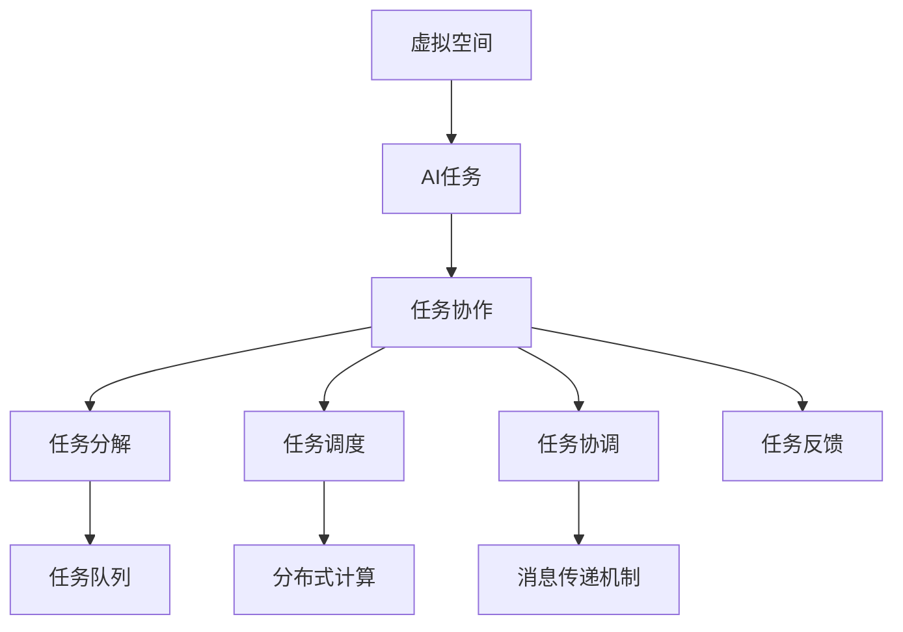
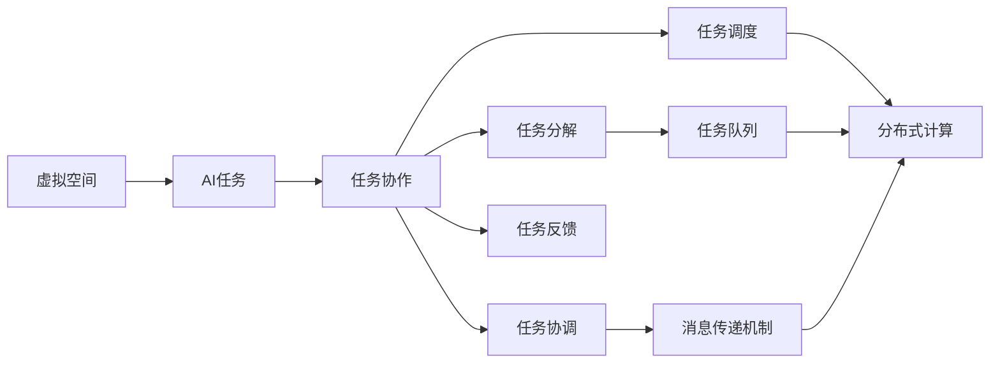
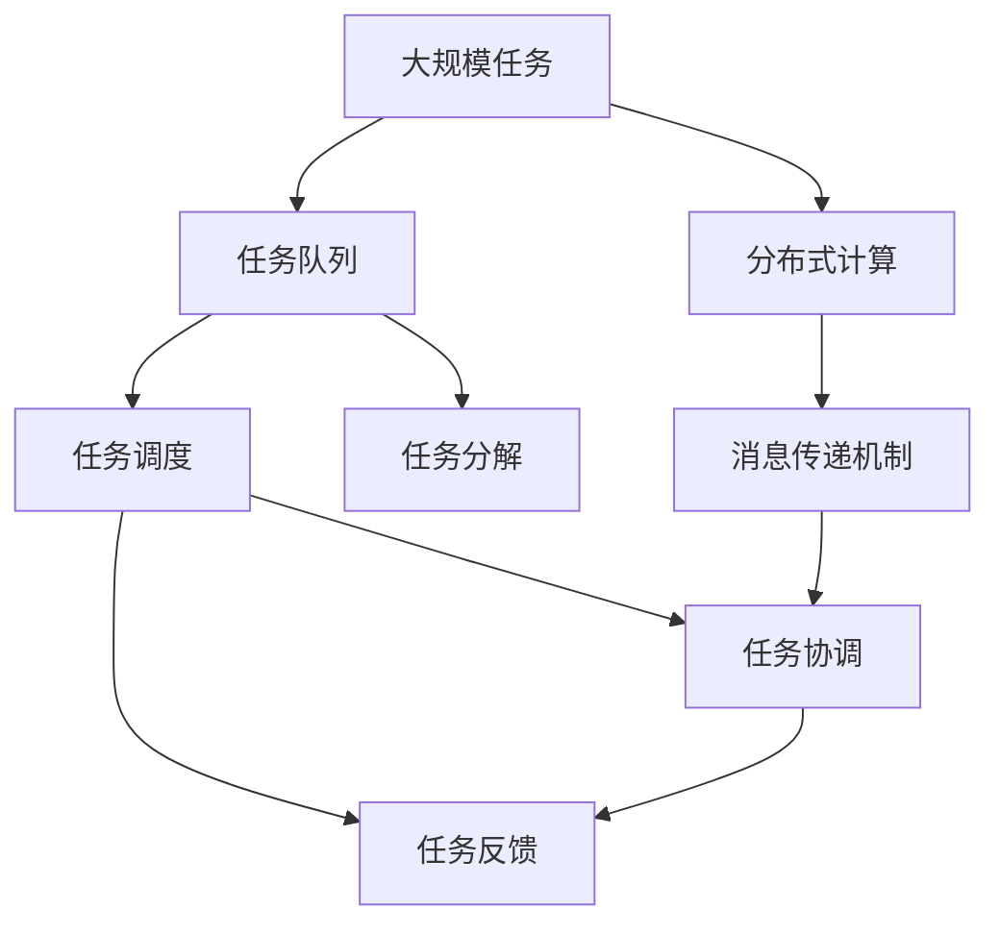

                 

# 虚拟空间中的AI任务协作

## 1. 背景介绍

### 1.1 问题由来
随着AI技术的飞速发展，特别是深度学习和自然语言处理（NLP）技术的应用普及，虚拟空间中的AI任务协作变得越来越重要。虚拟空间如虚拟现实（VR）、增强现实（AR）、智能家居、社交平台等，提供了丰富的用户交互场景和应用需求。这些场景中，AI系统的协作能力对于提升用户体验、提高服务质量和优化资源配置具有关键作用。

### 1.2 问题核心关键点
AI任务协作的核心在于多个AI系统如何协同工作，以共同完成复杂的用户请求或系统任务。具体来说，包括：
1. **任务分解**：将复杂任务分解为多个子任务，分配给不同的AI系统。
2. **任务调度**：根据系统资源、任务优先级和用户需求，合理分配任务执行顺序。
3. **任务协调**：确保各个AI系统之间能够无缝协作，共享信息，避免冲突。
4. **任务反馈**：及时收集任务执行结果，进行任务调整和优化。

### 1.3 问题研究意义
虚拟空间中的AI任务协作对于提升用户体验、提高服务质量和优化资源配置具有重要意义：
1. **提升用户体验**：多AI系统协作可以提供更丰富、更个性化的交互体验，满足用户多样化需求。
2. **提高服务质量**：通过协作，AI系统可以提供更准确、更快速的响应，提升服务效率。
3. **优化资源配置**：合理分配任务，可以避免资源浪费，提高整体系统性能。
4. **促进技术创新**：协作机制的优化可以推动AI技术在更广泛场景中的应用。

## 2. 核心概念与联系

### 2.1 核心概念概述

为更好地理解虚拟空间中的AI任务协作，本节将介绍几个关键概念及其之间的联系：

1. **虚拟空间**：指通过VR、AR等技术创造的虚拟环境，如虚拟会议、虚拟商店、智能家居等。
2. **AI任务**：指AI系统需要完成的具体任务，如语音识别、文本分析、图像处理等。
3. **任务协作**：指多个AI系统共同完成复杂任务的过程，涉及任务分解、调度、协调和反馈等环节。
4. **任务队列**：指按照一定规则排列的任务列表，用于任务调度和执行。
5. **分布式计算**：指将任务分配到多个计算节点进行并行处理，提升处理效率。
6. **消息传递机制**：指不同AI系统之间进行信息传递的机制，如消息队列、共享内存等。

这些概念之间的联系通过以下Mermaid流程图来展示：



这个流程图展示了几大关键概念之间的联系：
1. 虚拟空间中发生的AI任务，需要通过任务协作来实现复杂功能。
2. 任务协作涉及任务分解、任务调度、任务协调和任务反馈等环节。
3. 任务分解后的子任务可以并行处理，利用分布式计算提升效率。
4. 不同AI系统之间通过消息传递机制进行信息交换。

### 2.2 概念间的关系

这些核心概念之间的关系通过以下Mermaid流程图来展示：



这个综合流程图展示了虚拟空间中AI任务协作的整体架构：
1. 虚拟空间中的AI任务需要通过任务协作实现复杂功能。
2. 任务协作涉及任务分解、任务调度、任务协调和任务反馈等环节。
3. 任务分解后的子任务可以并行处理，利用分布式计算提升效率。
4. 不同AI系统之间通过消息传递机制进行信息交换。

### 2.3 核心概念的整体架构

最后，我们用一个综合的流程图来展示这些核心概念在大规模任务协作中的整体架构：



这个综合流程图展示了虚拟空间中大规模任务协作的完整过程：
1. 大规模任务通过任务队列进行调度。
2. 任务分解后的子任务利用分布式计算进行并行处理。
3. 不同AI系统之间通过消息传递机制进行信息交换。
4. 任务调度、任务协调和任务反馈构成任务协作的核心循环。

## 3. 核心算法原理 & 具体操作步骤

### 3.1 算法原理概述

虚拟空间中的AI任务协作算法主要围绕任务分解、任务调度、任务协调和任务反馈等环节展开。算法的核心思想是：
1. **任务分解**：将复杂任务分解为多个子任务，分配给不同的AI系统。
2. **任务调度**：根据系统资源、任务优先级和用户需求，合理分配任务执行顺序。
3. **任务协调**：确保各个AI系统之间能够无缝协作，共享信息，避免冲突。
4. **任务反馈**：及时收集任务执行结果，进行任务调整和优化。

### 3.2 算法步骤详解

以下是虚拟空间中AI任务协作算法的详细步骤：

**Step 1: 任务分解**
- 分析虚拟空间中需要完成的任务，确定其主要组成部分和子任务。
- 根据任务复杂度、资源需求和时间要求，将任务分解为多个子任务。
- 为每个子任务指定执行顺序和责任系统。

**Step 2: 任务调度**
- 创建任务队列，将子任务按顺序排列。
- 根据系统资源（如CPU、内存、带宽等）和任务优先级，合理分配任务。
- 采用轮询、优先队列、抢占式调度等策略，确保任务高效执行。

**Step 3: 任务协调**
- 使用消息传递机制，如消息队列、共享内存等，实现不同AI系统之间的信息交换。
- 设置统一的通信协议和数据格式，确保数据传输的准确性和可靠性。
- 采用锁机制、分布式锁等技术，避免任务执行中的冲突和死锁。

**Step 4: 任务反馈**
- 定义任务执行的反馈机制，收集每个子任务的状态和结果。
- 对任务执行结果进行评估，确定是否需要调整任务执行顺序或重新分配资源。
- 根据反馈结果，优化任务调度算法和任务协调机制。

### 3.3 算法优缺点

虚拟空间中的AI任务协作算法具有以下优点：
1. 提升任务执行效率：通过任务分解和并行处理，可以显著提升处理速度。
2. 优化资源配置：合理分配任务，避免资源浪费，提高整体系统性能。
3. 提升用户体验：多AI系统协作可以提供更丰富、更个性化的交互体验。

同时，也存在一些缺点：
1. 通信开销较大：不同AI系统之间的消息传递需要额外的通信开销。
2. 协调复杂：任务协调需要复杂的锁机制和通信协议，增加了系统的复杂度。
3. 容错性差：系统故障可能导致整个协作过程崩溃，需要额外的容错机制。

### 3.4 算法应用领域

虚拟空间中的AI任务协作算法在多个领域都有广泛的应用，例如：

- **智能家居**：多个AI系统协作完成家庭自动化任务，如语音控制、场景感知、智能推荐等。
- **虚拟会议**：多AI系统协作实现语音识别、文本翻译、会议记录等功能，提升会议体验。
- **智能客服**：多AI系统协作完成客户服务任务，如语音识别、文本分析、意图理解等。
- **虚拟商店**：多AI系统协作完成商品推荐、虚拟导购、用户行为分析等任务，提升购物体验。

## 4. 数学模型和公式 & 详细讲解 & 举例说明

### 4.1 数学模型构建

虚拟空间中的AI任务协作算法可以通过数学模型进行描述。设虚拟空间中的任务为 $T$，任务队列为 $Q$，每个子任务为 $t_i$，子任务的优先级为 $p_i$，系统资源为 $R$，任务调度算法为 $A$，任务协调算法为 $C$，任务反馈机制为 $F$。则任务协作的数学模型可以表示为：

$$
\min_{Q, A, C, F} \sum_{t_i \in T} p_i \times COST(t_i)
$$

其中 $COST(t_i)$ 为执行任务 $t_i$ 的代价，包括时间、资源消耗等。

### 4.2 公式推导过程

以下是任务协作算法中常见的几种数学模型及其推导过程：

**1. 任务分解**
- 假设虚拟空间中需要完成的任务 $T$ 可以分解为 $n$ 个子任务 $t_1, t_2, ..., t_n$。每个子任务 $t_i$ 的执行时间、资源需求和优先级分别为 $t_i^e, t_i^r, t_i^p$。
- 定义任务队列 $Q = (t_1, t_2, ..., t_n)$，表示任务的执行顺序。
- 任务分解的目标是最小化任务队列长度 $|Q|$，即：
$$
\min_{Q} \sum_{i=1}^n t_i^p
$$

**2. 任务调度**
- 假设任务调度算法 $A$ 可以采用优先队列调度方式。每个子任务 $t_i$ 的优先级 $p_i$ 和资源需求 $r_i$ 已知。
- 定义任务调度队列 $Q_A = (t_1, t_2, ..., t_n)$，表示任务的执行顺序。
- 任务调度的目标是最小化执行代价 $Cost(Q_A)$，即：
$$
\min_{Q_A} Cost(Q_A) = \sum_{i=1}^n C_i \times p_i
$$
其中 $C_i$ 为执行任务 $t_i$ 的代价。

**3. 任务协调**
- 假设任务协调算法 $C$ 可以采用分布式锁机制。每个子任务 $t_i$ 的锁时间 $l_i$ 和资源需求 $r_i$ 已知。
- 定义任务协调队列 $Q_C = (t_1, t_2, ..., t_n)$，表示任务的执行顺序。
- 任务协调的目标是最小化锁时间总和 $Cost(Q_C)$，即：
$$
\min_{Q_C} Cost(Q_C) = \sum_{i=1}^n l_i
$$

**4. 任务反馈**
- 假设任务反馈机制 $F$ 可以采用定时轮询方式。每个子任务 $t_i$ 的执行时间 $e_i$ 和优先级 $p_i$ 已知。
- 定义任务反馈队列 $Q_F = (t_1, t_2, ..., t_n)$，表示任务的执行顺序。
- 任务反馈的目标是最小化执行时间总和 $Cost(Q_F)$，即：
$$
\min_{Q_F} Cost(Q_F) = \sum_{i=1}^n e_i
$$

### 4.3 案例分析与讲解

以智能家居为例，分析AI任务协作算法的应用：

- **任务分解**：智能家居中的任务包括语音控制、场景感知、智能推荐等。将任务分解为语音识别、场景分析、设备控制等子任务。
- **任务调度**：根据设备的响应时间和资源需求，合理分配任务执行顺序。可以使用轮询、优先队列等调度算法。
- **任务协调**：不同AI系统之间通过消息队列进行通信。例如，语音识别系统向场景分析系统发送数据，场景分析系统向设备控制系统发送指令。
- **任务反馈**：设备控制系统收集执行结果，进行任务调整和优化。例如，根据用户行为反馈，优化推荐算法和场景感知模型。

## 5. 项目实践：代码实例和详细解释说明

### 5.1 开发环境搭建

在进行AI任务协作实践前，我们需要准备好开发环境。以下是使用Python进行分布式任务协作开发的流程：

1. 安装Anaconda：从官网下载并安装Anaconda，用于创建独立的Python环境。
2. 创建并激活虚拟环境：
```bash
conda create -n task-collaboration python=3.8
conda activate task-collaboration
```
3. 安装PyTorch：根据CUDA版本，从官网获取对应的安装命令。例如：
```bash
conda install pytorch torchvision torchaudio cudatoolkit=11.1 -c pytorch -c conda-forge
```
4. 安装Dask：用于分布式计算。
```bash
pip install dask[complete]
```
5. 安装Rocketmq：用于消息队列。
```bash
pip install rocketmq-client
```
6. 安装Flask：用于任务调度和管理。
```bash
pip install flask
```
完成上述步骤后，即可在`task-collaboration`环境中开始AI任务协作实践。

### 5.2 源代码详细实现

以下是使用PyTorch、Dask和Rocketmq实现AI任务协作的代码实现。

首先，定义任务队列和任务调度器：

```python
from dask.distributed import Client
from dask.distributed import Task
from dask.distributed import wait

class TaskScheduler:
    def __init__(self, tasks, resources, scheduler='random'):
        self.tasks = tasks
        self.resources = resources
        self.client = Client('localhost:8786', scheduler=scheduler)

    def schedule(self):
        with self.client:
            scheduled_tasks = self.client.submit(self._schedule, self.tasks)
            wait(scheduled_tasks)
            return scheduled_tasks

    def _schedule(self, tasks):
        for task in tasks:
            yield self.client.submit(task)
```

然后，定义任务协调器和消息队列：

```python
from dask.distributed import new_client, Client
from dask.distributed import wait
from rocketmq import RocketMQConsumer, RocketMQProducer

class TaskCoordinator:
    def __init__(self, topic, resources):
        self.topic = topic
        self.resources = resources
        self.client = new_client('localhost:9092')
        self.producer = RocketMQProducer(client=self.client)
        self.consumer = RocketMQConsumer(topic=self.topic, client=self.client)

    def coordinate(self):
        self.consumer.subscribe(self.topic)
        for msg in self.consumer:
            self.producer.send(msg.key, msg.value)

class TaskConsumer:
    def __init__(self, topic):
        self.topic = topic
        self.client = new_client('localhost:9092')
        self.consumer = RocketMQConsumer(topic=self.topic, client=self.client)

    def consume(self):
        self.consumer.subscribe(self.topic)
        for msg in self.consumer:
            print(msg.value)
```

最后，定义任务反馈机制：

```python
class TaskFeedback:
    def __init__(self, tasks, results):
        self.tasks = tasks
        self.results = results

    def feedback(self):
        for task, result in zip(self.tasks, self.results):
            print(f"Task {task}: {result}")
```

使用这些类，可以构建虚拟空间中的AI任务协作系统。

### 5.3 代码解读与分析

让我们再详细解读一下关键代码的实现细节：

**TaskScheduler类**：
- `__init__`方法：初始化任务列表和资源需求。
- `schedule`方法：根据调度策略，将任务提交到Dask客户端进行调度。
- `_schedule`方法：具体执行任务调度。

**TaskCoordinator类**：
- `__init__`方法：初始化主题和资源需求。
- `coordinate`方法：创建RocketMQ生产者和消费者，进行消息队列通信。

**TaskConsumer类**：
- `__init__`方法：初始化主题和RocketMQ消费者。
- `consume`方法：订阅主题，接收消息并输出。

**TaskFeedback类**：
- `__init__`方法：初始化任务列表和结果。
- `feedback`方法：输出每个任务的执行结果。

通过这些类，可以构建一个完整的虚拟空间中的AI任务协作系统。系统通过任务分解、任务调度、任务协调和任务反馈等环节，实现高效的协作执行。

## 6. 实际应用场景

### 6.1 智能家居

在智能家居场景中，AI任务协作可以用于多个智能设备之间的协调工作。例如，用户通过语音助手发出指令，语音助手将指令分解为多个子任务，如开启客厅灯、调节温度、播放音乐等。这些子任务分别分配给灯光控制、温控系统和音乐播放器，系统通过任务调度、任务协调和任务反馈机制，确保各个设备协同工作，完成用户指令。

### 6.2 虚拟商店

在虚拟商店中，AI任务协作可以用于商品推荐和虚拟导购。例如，用户通过虚拟现实设备进入虚拟商店，虚拟导购系统根据用户的浏览行为，通过任务分解、任务调度和任务协调，从推荐算法中获取商品推荐结果，并通过消息队列发送给虚拟导购设备。虚拟导购设备根据推荐结果，通过任务反馈机制更新推荐算法，进一步优化推荐结果。

### 6.3 虚拟会议

在虚拟会议中，AI任务协作可以用于语音识别、文本翻译和会议记录。例如，会议系统将语音识别任务分解为多个子任务，每个子任务分别分配给不同的语音识别系统。系统通过任务调度、任务协调和任务反馈机制，确保各个语音识别系统协同工作，完成语音识别的任务。识别结果通过消息队列发送给文本翻译和会议记录系统，进一步处理和保存。

## 7. 工具和资源推荐

### 7.1 学习资源推荐

为了帮助开发者系统掌握虚拟空间中的AI任务协作理论基础和实践技巧，这里推荐一些优质的学习资源：

1. **《分布式系统原理与实践》**：深入讲解分布式计算和任务调度原理，提供丰富的代码示例。
2. **《Python多进程编程》**：介绍多进程编程和分布式计算的基本原理，适合初学者入门。
3. **《RocketMQ官方文档》**：提供 RocketMQ 的使用指南和最佳实践，是消息队列开发的必备资料。
4. **《Flask官方文档》**：介绍 Flask 的Web开发框架，提供丰富的Web服务开发示例。
5. **《Dask官方文档》**：提供Dask分布式计算的使用指南和最佳实践，适合大规模数据处理。

通过对这些资源的学习实践，相信你一定能够快速掌握虚拟空间中的AI任务协作的精髓，并用于解决实际的开发问题。

### 7.2 开发工具推荐

高效的开发离不开优秀的工具支持。以下是几款用于虚拟空间中的AI任务协作开发的常用工具：

1. **Anaconda**：用于创建和管理Python环境，方便多项目开发。
2. **PyTorch**：基于Python的深度学习框架，支持分布式计算。
3. **Dask**：用于大规模数据处理和分布式计算，提供了丰富的并行计算能力。
4. **RocketMQ**：用于高效的消息队列，支持高并发和高可靠性。
5. **Flask**：用于Web服务和API开发，支持灵活的请求处理和任务调度。
6. **Jupyter Notebook**：用于交互式编程和数据探索，适合快速迭代开发。

合理利用这些工具，可以显著提升虚拟空间中AI任务协作的开发效率，加快创新迭代的步伐。

### 7.3 相关论文推荐

虚拟空间中的AI任务协作技术在近年来得到了广泛研究。以下是几篇具有代表性的相关论文，推荐阅读：

1. **《分布式系统：原理与设计》**：详细讲解分布式系统的设计原理和实践方法，提供了丰富的理论基础。
2. **《大规模分布式数据处理技术》**：介绍大规模数据处理的分布式计算框架和算法，适合深入学习。
3. **《分布式任务调度与管理系统》**：研究分布式任务调度和管理系统，提供了丰富的案例和实践经验。
4. **《分布式协作计算系统》**：研究分布式协作计算的原理和方法，提供了丰富的实验和评估结果。
5. **《分布式任务协同与优化算法》**：研究分布式任务协同优化算法，提供了丰富的算法实现和性能分析。

这些论文代表了大规模分布式协作技术的最新进展，有助于你深入理解虚拟空间中的AI任务协作技术。

除上述资源外，还有一些值得关注的前沿资源，帮助开发者紧跟虚拟空间中AI任务协作技术的最新进展，例如：

1. **ArXiv论文预印本**：人工智能领域最新研究成果的发布平台，包括大量尚未发表的前沿工作，学习前沿技术的必读资源。
2. **AI技术博客**：如Google AI、DeepMind、微软Research Asia等顶尖实验室的官方博客，第一时间分享他们的最新研究成果和洞见。
3. **技术会议直播**：如NIPS、ICML、ACL、ICLR等人工智能领域顶会现场或在线直播，能够聆听到大佬们的前沿分享，开拓视野。
4. **GitHub热门项目**：在GitHub上Star、Fork数最多的AI协作开发相关项目，往往代表了该技术领域的发展趋势和最佳实践，值得去学习和贡献。
5. **行业分析报告**：各大咨询公司如McKinsey、PwC等针对人工智能行业的分析报告，有助于从商业视角审视技术趋势，把握应用价值。

总之，对于虚拟空间中的AI任务协作技术的学习和实践，需要开发者保持开放的心态和持续学习的意愿。多关注前沿资讯，多动手实践，多思考总结，必将收获满满的成长收益。

## 8. 总结：未来发展趋势与挑战

### 8.1 总结

本文对虚拟空间中的AI任务协作方法进行了全面系统的介绍。首先阐述了虚拟空间中AI任务协作的背景和意义，明确了任务协作在提升用户体验、提高服务质量和优化资源配置方面的独特价值。其次，从原理到实践，详细讲解了虚拟空间中AI任务协作的数学模型和操作步骤，给出了AI任务协作任务开发的完整代码实例。同时，本文还广泛探讨了AI任务协作方法在智能家居、虚拟商店、虚拟会议等多个行业领域的应用前景，展示了AI任务协作技术的巨大潜力。此外，本文精选了任务协作技术的各类学习资源，力求为读者提供全方位的技术指引。

通过本文的系统梳理，可以看到，虚拟空间中的AI任务协作对于提升用户体验、提高服务质量和优化资源配置具有重要意义。多AI系统协作可以提供更丰富、更个性化的交互体验，提升服务效率，优化资源配置。未来，伴随分布式计算和消息队列技术的不断发展，虚拟空间中的AI任务协作技术必将迎来更多的应用场景，为人工智能技术在更广泛领域的应用提供新的动力。

### 8.2 未来发展趋势

展望未来，虚拟空间中的AI任务协作技术将呈现以下几个发展趋势：

1. **分布式计算能力的提升**：随着分布式计算技术的不断进步，未来AI任务协作系统可以处理更大规模的任务，提供更高效的服务。
2. **任务调度算法的优化**：新的任务调度算法将进一步提升任务执行效率，减少系统延迟。
3. **消息队列技术的改进**：更高效的消息队列技术将进一步提升数据传递的速度和可靠性。
4. **任务协调机制的增强**：分布式锁机制和一致性算法将进一步提升任务协作的鲁棒性和可扩展性。
5. **任务反馈机制的优化**：通过实时反馈机制，AI系统可以动态调整任务执行策略，提升整体系统性能。
6. **跨域任务协作**：跨网络、跨平台的任务协作将成为未来研究的新方向，提升系统灵活性和适应性。

以上趋势凸显了虚拟空间中AI任务协作技术的广阔前景。这些方向的探索发展，必将进一步提升AI系统的协作能力，推动智能技术在更多场景中的应用。

### 8.3 面临的挑战

尽管虚拟空间中的AI任务协作技术已经取得了显著进展，但在实际应用中仍面临诸多挑战：

1. **系统复杂性增加**：多AI系统协作带来了系统复杂性的增加，需要更复杂的管理和监控机制。
2. **任务调度难度加大**：大规模任务调度需要更高的算法复杂度和计算资源，需要进一步优化。
3. **通信开销增大**：多AI系统之间的消息传递需要更高的通信开销，需要优化通信协议。
4. **容错性不足**：系统故障可能导致协作任务中断，需要更强的容错机制。
5. **数据隐私和安全问题**：多AI系统协同工作可能涉及敏感数据，需要考虑数据隐私和安全问题。

### 8.4 研究展望

面对虚拟空间中AI任务协作所面临的挑战，未来的研究需要在以下几个方面寻求新的突破：

1. **分布式系统架构优化**：通过优化分布式系统架构，提升系统的可扩展性和容错性。
2. **高效的算法和数据结构**：开发高效的算法和数据结构，优化任务调度、任务协调和任务反馈等环节。
3. **跨域协作技术研究**：研究跨网络、跨平台的协作技术，提升系统的灵活性和适应性。
4. **数据隐私和安全保护**：研究数据隐私和安全保护技术，确保协作过程的安全性和合规性。
5. **自动化运维和监控机制**：开发自动化运维和监控机制，提升系统的稳定性和可靠性。
6. **人机交互技术提升**：通过人机交互技术提升，增强用户交互体验，提升系统智能化水平。

这些

