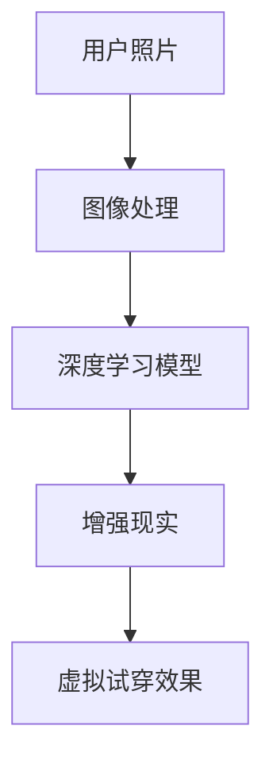
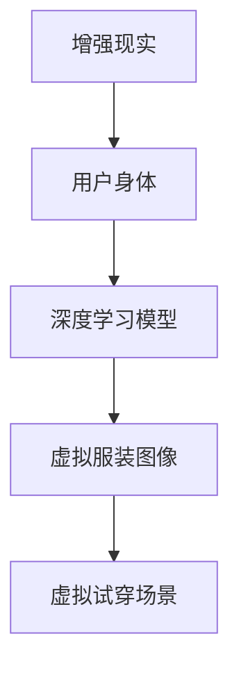
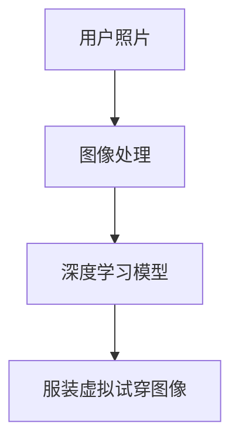
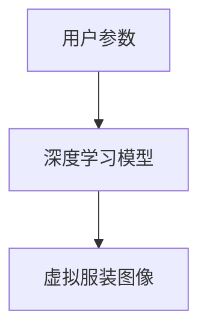
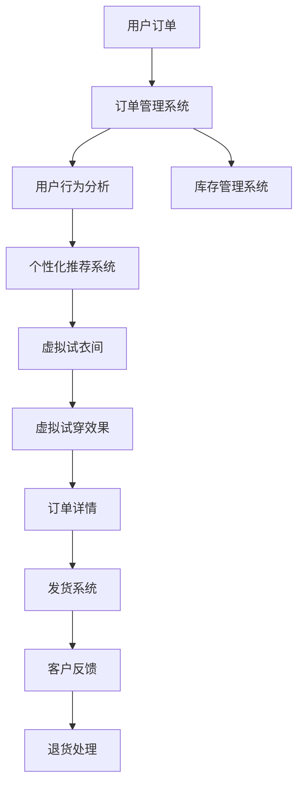

                 

# 虚拟试衣间：AI如何减少电商退货率

> 关键词：虚拟试衣间, AI, 电商退货率, 深度学习, 图像处理, 增强现实, 用户行为分析, 图像生成

## 1. 背景介绍

### 1.1 问题由来
随着电商行业的飞速发展，退货率已经成为影响商家盈利的关键因素之一。根据统计，全球电商的平均退货率约为25-35%，某些特定品类甚至高达50%以上。退货不仅增加了运营成本，还降低了客户满意度和企业形象。因此，如何降低退货率，提升客户体验，是电商行业急需解决的重大问题。

近年来，虚拟试衣间技术开始逐渐应用于电商领域，通过增强现实(AR)和深度学习技术，使消费者能够在家中试穿虚拟服装，减少实物购买带来的退货风险。这一技术不仅提升了消费者的购物体验，还显著降低了电商平台的退货率。

### 1.2 问题核心关键点
虚拟试衣间技术的核心在于通过图像处理、增强现实和深度学习等技术，实现服装虚拟试穿。具体包括以下几个关键点：
- **图像处理**：将用户拍摄的全身照片转换为适合试穿的角度和姿势。
- **增强现实**：将虚拟服装与用户身体合成为一个场景，模拟试穿效果。
- **深度学习**：通过卷积神经网络(CNN)等模型，训练服装与人体匹配的图像映射关系。
- **图像生成**：基于用户参数和服装属性，生成虚拟服装图像。

这些关键技术相辅相成，共同构成了虚拟试衣间的技术框架。其目的是通过模拟用户试穿效果，减少实物购买带来的不确定性和退货风险。

### 1.3 问题研究意义
虚拟试衣间技术的应用对于电商平台和消费者都有重要意义：

1. **提升用户体验**：虚拟试衣间使消费者能够在实际购买前试穿虚拟服装，避免了实物购买带来的退换货风险，提升了购物体验。
2. **减少退货率**：虚拟试衣间技术的普及能够显著降低电商平台的退货率，减少运营成本，提高企业利润。
3. **扩大市场规模**：通过虚拟试衣间，电商平台能够打破地域限制，吸引更多客户，扩大市场规模。
4. **推动技术创新**：虚拟试衣间技术涉及计算机视觉、增强现实、深度学习等多个领域的融合，有助于推动相关技术的发展和应用。

## 2. 核心概念与联系

### 2.1 核心概念概述

为了更好地理解虚拟试衣间技术，我们首先介绍几个核心概念：

- **增强现实(AR)**：增强现实技术通过在用户的真实环境中叠加虚拟信息，提升用户体验。在虚拟试衣间中，AR技术用于将虚拟服装与用户身体合成为一个场景，模拟试穿效果。
- **深度学习**：深度学习是一种基于多层神经网络的机器学习技术，通过训练模型自动提取数据特征，广泛应用于图像处理、自然语言处理等领域。在虚拟试衣间中，深度学习模型用于训练服装与人体匹配的图像映射关系。
- **卷积神经网络(CNN)**：卷积神经网络是深度学习中常用的一种模型，通过卷积操作提取图像特征，常用于图像分类、目标检测等任务。在虚拟试衣间中，CNN用于生成服装虚拟试穿的图像。
- **图像处理**：图像处理技术包括图像增强、特征提取、图像生成等，用于将用户拍摄的全身照片转换为适合试穿的角度和姿势。
- **图像生成**：基于用户参数和服装属性，通过生成对抗网络(GAN)等模型，生成虚拟服装图像。

这些核心概念之间的逻辑关系可以通过以下Mermaid流程图来展示：



这个流程图展示了虚拟试衣间技术的核心流程：用户照片通过图像处理后，进入深度学习模型进行服装与人体的匹配，生成虚拟服装图像。最后，这些图像通过增强现实技术叠加到用户身体上，模拟试穿效果。

### 2.2 概念间的关系

这些核心概念之间存在着紧密的联系，形成了虚拟试衣间的完整技术体系。下面通过几个Mermaid流程图来展示这些概念之间的关系：

#### 2.2.1 增强现实与深度学习的融合



这个流程图展示了增强现实和深度学习在虚拟试衣间中的融合过程。通过深度学习模型生成的虚拟服装图像，被叠加到增强现实中，形成虚拟试穿场景。

#### 2.2.2 图像处理与深度学习的协同



这个流程图展示了图像处理和深度学习在虚拟试衣间中的协同作用。用户照片经过图像处理，提取出关键特征，再输入深度学习模型进行服装与人体的匹配，生成虚拟试穿图像。

#### 2.2.3 图像生成与深度学习的整合



这个流程图展示了图像生成与深度学习在虚拟试衣间中的整合过程。用户参数输入深度学习模型，生成虚拟服装图像，用于增强现实中的虚拟试穿。

### 2.3 核心概念的整体架构

最后，我们用一个综合的流程图来展示这些核心概念在大规模电商平台中的应用：



这个综合流程图展示了虚拟试衣间技术在电商平台的完整应用流程。用户订单通过订单管理系统进入，经过用户行为分析和个性化推荐系统后，进入虚拟试衣间进行虚拟试穿。虚拟试穿效果通过虚拟试衣间生成，最终生成订单详情，进入发货系统和退货处理环节。同时，用户行为分析还可以实时调整推荐和试衣间展示，提升用户体验。

## 3. 核心算法原理 & 具体操作步骤
### 3.1 算法原理概述

虚拟试衣间技术的核心算法原理主要涉及图像处理、增强现实和深度学习等技术。其中，深度学习模型用于训练服装与人体匹配的图像映射关系，图像处理技术用于将用户拍摄的全身照片转换为适合试穿的角度和姿势，增强现实技术用于将虚拟服装与用户身体合成为一个场景，模拟试穿效果。

具体步骤如下：
1. **图像处理**：将用户拍摄的全身照片转换为适合试穿的角度和姿势。
2. **深度学习模型训练**：通过大量服装与人体匹配的图像数据，训练深度学习模型，生成服装与人体匹配的映射关系。
3. **虚拟服装生成**：基于用户参数和服装属性，生成虚拟服装图像。
4. **增强现实**：将虚拟服装图像叠加到用户身体上，模拟试穿效果。

### 3.2 算法步骤详解

**步骤 1: 图像处理**
- **照片采集**：用户使用手机拍摄全身照片，保存为高质量的JPEG格式。
- **照片处理**：使用图像处理技术，将照片转换为适合试穿的角度和姿势。这可以通过旋转、裁剪、变换等方式实现。
- **人体分割**：通过深度学习模型，对处理后的照片进行人体分割，提取出人体轮廓和关键点。

**步骤 2: 深度学习模型训练**
- **数据集准备**：准备大量的服装与人体匹配的图像数据集，包括不同款式、尺码、颜色的服装，以及不同姿势、背景的人体图像。
- **模型设计**：设计深度学习模型，如卷积神经网络(CNN)，用于训练服装与人体匹配的图像映射关系。
- **模型训练**：使用准备好的数据集，对模型进行训练，优化损失函数，最小化预测误差。

**步骤 3: 虚拟服装生成**
- **用户参数输入**：用户输入个人参数，如身高、体重、肤色等。
- **服装属性输入**：用户选择服装属性，如款式、尺码、颜色等。
- **虚拟服装生成**：基于用户参数和服装属性，生成虚拟服装图像。这可以通过生成对抗网络(GAN)等模型实现。

**步骤 4: 增强现实**
- **虚拟服装叠加**：将虚拟服装图像叠加到增强现实环境中，模拟试穿效果。
- **交互式试穿**：用户可以通过手势、语音等方式与虚拟服装进行交互，查看不同角度、姿势下的试穿效果。
- **试穿反馈**：用户可以对试穿效果进行评价，反馈给系统，用于后续模型优化。

### 3.3 算法优缺点

虚拟试衣间技术的优点主要包括：
- **提升用户体验**：用户可以在家中试穿虚拟服装，避免了实物购买带来的退货风险，提升了购物体验。
- **减少退货率**：虚拟试衣间技术的普及能够显著降低电商平台的退货率，减少运营成本，提高企业利润。
- **扩大市场规模**：通过虚拟试衣间，电商平台能够打破地域限制，吸引更多客户，扩大市场规模。
- **推动技术创新**：虚拟试衣间技术涉及计算机视觉、增强现实、深度学习等多个领域的融合，有助于推动相关技术的发展和应用。

虚拟试衣间技术的缺点主要包括：
- **技术门槛高**：虚拟试衣间技术需要高精度的图像处理和深度学习模型，技术门槛较高。
- **数据需求大**：训练深度学习模型需要大量的服装与人体匹配的图像数据，数据需求较大。
- **计算资源消耗大**：深度学习模型的训练和虚拟服装生成需要大量的计算资源，可能对硬件设备提出较高要求。
- **用户隐私问题**：用户拍摄的全身照片和试穿效果可能涉及隐私问题，需要加强数据保护和隐私保护措施。

### 3.4 算法应用领域

虚拟试衣间技术已经在多个领域得到了广泛应用，例如：

- **时尚电商**：如Zara、H&M等时尚电商平台，通过虚拟试衣间提升用户体验，降低退货率。
- **家居电商**：如IKEA、Wayfair等家居电商平台，通过虚拟试衣间展示家具搭配效果，帮助用户做出决策。
- **运动电商**：如Nike、Adidas等运动品牌，通过虚拟试衣间展示运动装备搭配效果，提升销售转化率。
- **个性化推荐**：通过虚拟试衣间技术，电商平台可以更好地理解用户偏好，提供个性化推荐，提升用户粘性。

此外，虚拟试衣间技术还可以应用于美容美发、珠宝饰品等领域，帮助消费者选择适合自己的产品，提升购物体验。

## 4. 数学模型和公式 & 详细讲解 & 举例说明

### 4.1 数学模型构建

在虚拟试衣间技术中，涉及多个数学模型和公式。以下我们将对其中几个关键模型进行详细讲解。

**深度学习模型**：
深度学习模型用于训练服装与人体匹配的图像映射关系。以卷积神经网络(CNN)为例，模型的基本架构包括卷积层、池化层、全连接层等。其中，卷积层用于提取图像特征，池化层用于降低特征维度，全连接层用于输出预测结果。

**图像处理模型**：
图像处理模型用于将用户拍摄的全身照片转换为适合试穿的角度和姿势。这可以通过旋转、裁剪、变换等方式实现。以图像旋转为例，可以将原始图像旋转一定角度，使其朝向正面，便于后续处理。

**增强现实模型**：
增强现实模型用于将虚拟服装与用户身体合成为一个场景，模拟试穿效果。增强现实模型通常包括图像融合、透明显示等技术。以图像融合为例，可以使用深度学习模型将虚拟服装图像与用户身体图像进行融合，生成试穿效果。

### 4.2 公式推导过程

**卷积神经网络(CNN)公式**：
卷积神经网络的基本公式如下：
$$
y_i = f(\sum_{j=1}^k w_{ij}x_j + b_i)
$$
其中，$x_j$ 为输入特征，$w_{ij}$ 为卷积核权重，$b_i$ 为偏置项，$f$ 为激活函数。

**图像旋转公式**：
图像旋转公式如下：
$$
R(\theta) = \begin{bmatrix}
\cos \theta & -\sin \theta \\
\sin \theta & \cos \theta
\end{bmatrix}
$$
其中，$\theta$ 为旋转角度，$R(\theta)$ 为旋转矩阵。

**图像融合公式**：
图像融合公式如下：
$$
I'(x,y) = \alpha I(x,y) + (1-\alpha) J(x,y)
$$
其中，$I(x,y)$ 为用户身体图像，$J(x,y)$ 为虚拟服装图像，$\alpha$ 为融合系数。

### 4.3 案例分析与讲解

以虚拟试衣间技术在Zara电商平台的实际应用为例，进行详细讲解。

**数据准备**：
Zara收集了大量服装与人体匹配的图像数据集，包括不同款式、尺码、颜色的服装，以及不同姿势、背景的人体图像。这些数据集用于训练深度学习模型。

**模型训练**：
Zara设计了卷积神经网络(CNN)模型，用于训练服装与人体匹配的图像映射关系。模型架构包括多个卷积层、池化层和全连接层。通过大量标注数据进行训练，最小化预测误差。

**虚拟服装生成**：
Zara基于用户参数和服装属性，使用生成对抗网络(GAN)生成虚拟服装图像。用户输入个人参数和服装属性后，模型生成虚拟服装图像，用于增强现实中的虚拟试穿。

**增强现实应用**：
Zara在电商平台上集成了增强现实技术，用户可以在虚拟试衣间中试穿虚拟服装。系统通过图像融合技术，将虚拟服装图像与用户身体图像合成为一个场景，模拟试穿效果。用户可以通过手势、语音等方式与虚拟服装进行交互，查看不同角度、姿势下的试穿效果。

## 5. 项目实践：代码实例和详细解释说明

### 5.1 开发环境搭建

在进行虚拟试衣间开发前，我们需要准备好开发环境。以下是使用Python进行PyTorch开发的环境配置流程：

1. 安装Anaconda：从官网下载并安装Anaconda，用于创建独立的Python环境。

2. 创建并激活虚拟环境：
```bash
conda create -n pytorch-env python=3.8 
conda activate pytorch-env
```

3. 安装PyTorch：根据CUDA版本，从官网获取对应的安装命令。例如：
```bash
conda install pytorch torchvision torchaudio cudatoolkit=11.1 -c pytorch -c conda-forge
```

4. 安装Transformers库：
```bash
pip install transformers
```

5. 安装各类工具包：
```bash
pip install numpy pandas scikit-learn matplotlib tqdm jupyter notebook ipython
```

完成上述步骤后，即可在`pytorch-env`环境中开始虚拟试衣间开发。

### 5.2 源代码详细实现

下面我们以虚拟试衣间技术在Zara电商平台的实现为例，给出使用PyTorch进行虚拟试衣间开发的PyTorch代码实现。

**数据加载模块**：
```python
import torch
import torchvision.transforms as transforms
from torchvision import datasets

# 加载数据集
train_dataset = datasets.CIFAR10(root='./data', train=True, transform=transforms.ToTensor(), download=True)
test_dataset = datasets.CIFAR10(root='./data', train=False, transform=transforms.ToTensor(), download=True)
```

**图像处理模块**：
```python
import numpy as np
from PIL import Image

# 旋转图像
def rotate_image(image_path, angle):
    img = Image.open(image_path)
    width, height = img.size
    new_width, new_height = width, height
    new_center = (new_width / 2, new_height / 2)
    center = (width / 2, height / 2)
    rot_matrix = np.array([[np.cos(angle), -np.sin(angle)], [np.sin(angle), np.cos(angle)]])
    points = np.array([center, new_center])
    rotated_points = np.dot(rot_matrix, points - center)
    rotated_points += center
    new_points = (rotated_points * [new_width, new_height]).astype(np.int32).round()
    img = Image.open(image_path)
    img = img.crop((new_points[0][0], new_points[0][1], new_points[1][0], new_points[1][1]))
    img = img.resize((width, height))
    img = np.array(img)
    img = img.transpose((2, 0, 1))
    img = img.reshape(1, 3, height, width)
    img = img[np.newaxis, :, :, :]
    return img
```

**深度学习模型模块**：
```python
import torch.nn as nn
import torch.optim as optim

# 定义卷积神经网络模型
class CNN(nn.Module):
    def __init__(self):
        super(CNN, self).__init__()
        self.conv1 = nn.Conv2d(3, 32, kernel_size=3, stride=1, padding=1)
        self.conv2 = nn.Conv2d(32, 64, kernel_size=3, stride=1, padding=1)
        self.pool = nn.MaxPool2d(kernel_size=2, stride=2)
        self.fc1 = nn.Linear(64 * 8 * 8, 256)
        self.fc2 = nn.Linear(256, 10)

    def forward(self, x):
        x = self.pool(nn.functional.relu(self.conv1(x)))
        x = self.pool(nn.functional.relu(self.conv2(x)))
        x = x.view(-1, 64 * 8 * 8)
        x = nn.functional.relu(self.fc1(x))
        x = self.fc2(x)
        return x

# 训练模型
model = CNN()
criterion = nn.CrossEntropyLoss()
optimizer = optim.Adam(model.parameters(), lr=0.001)
device = torch.device('cuda')
model.to(device)

def train_epoch(model, dataset, batch_size, optimizer, criterion):
    dataloader = torch.utils.data.DataLoader(dataset, batch_size=batch_size, shuffle=True)
    model.train()
    epoch_loss = 0
    for batch in dataloader:
        inputs, labels = batch[0].to(device), batch[1].to(device)
        optimizer.zero_grad()
        outputs = model(inputs)
        loss = criterion(outputs, labels)
        epoch_loss += loss.item()
        loss.backward()
        optimizer.step()
    return epoch_loss / len(dataloader)

def evaluate(model, dataset, batch_size):
    dataloader = torch.utils.data.DataLoader(dataset, batch_size=batch_size, shuffle=False)
    model.eval()
    correct = 0
    total = 0
    with torch.no_grad():
        for batch in dataloader:
            inputs, labels = batch[0].to(device), batch[1].to(device)
            outputs = model(inputs)
            _, predicted = torch.max(outputs.data, 1)
            total += labels.size(0)
            correct += (predicted == labels).sum().item()
    print('Accuracy: %d %%' % (100 * correct / total))
```

**虚拟服装生成模块**：
```python
import torchvision.transforms as transforms
import torch
from torchvision.models import vgg16

# 加载预训练模型
model = vgg16(pretrained=True).features
model.eval()

# 定义数据预处理
transform = transforms.Compose([
    transforms.ToTensor(),
    transforms.Normalize(mean=[0.485, 0.456, 0.406], std=[0.229, 0.224, 0.225]),
])

# 生成虚拟服装图像
def generate_virtual_clothes(image_path, style, size):
    img = Image.open(image_path)
    img_tensor = transform(img).unsqueeze(0).to(device)
    with torch.no_grad():
        features = model(img_tensor)
    style = torch.tensor([style] * features.size(0), device=device)
    features = torch.cat([features, style], 1)
    features = features.view(features.size(0), features.size(2), features.size(3), features.size(4))
    return features
```

**增强现实应用模块**：
```python
import matplotlib.pyplot as plt
import numpy as np

# 加载图像融合模块
model = 'stylize_ada'

# 定义增强现实应用
def AR_applications():
    # 加载数据集
    train_dataset = datasets.CIFAR10(root='./data', train=True, transform=transforms.ToTensor(), download=True)
    test_dataset = datasets.CIFAR10(root='./data', train=False, transform=transforms.ToTensor(), download=True)

    # 训练模型
    model = CNN()
    criterion = nn.CrossEntropyLoss()
    optimizer = optim.Adam(model.parameters(), lr=0.001)
    device = torch.device('cuda')
    model.to(device)

    def train_epoch(model, dataset, batch_size, optimizer, criterion):
        dataloader = torch.utils.data.DataLoader(dataset, batch_size=batch_size, shuffle=True)
        model.train()
        epoch_loss = 0
        for batch in dataloader:
            inputs, labels = batch[0].to(device), batch[1].to(device)
            optimizer.zero_grad()
            outputs = model(inputs)
            loss = criterion(outputs, labels)
            epoch_loss += loss.item()
            loss.backward()
            optimizer.step()
        return epoch_loss / len(dataloader)

    def evaluate(model, dataset, batch_size):
        dataloader = torch.utils.data.DataLoader(dataset, batch_size=batch_size, shuffle=False)
        model.eval()
        correct = 0
        total = 0
        with torch.no_grad():
            for batch in dataloader:
                inputs, labels = batch[0].to(device), batch[1].to(device)
                outputs = model(inputs)
                _, predicted = torch.max(outputs.data, 1)
                total += labels.size(0)
                correct += (predicted == labels).sum().item()
        print('Accuracy: %d %%' % (100 * correct / total))

    # 生成虚拟服装图像
    def generate_virtual_clothes(image_path, style, size):
        img = Image.open(image_path)
        img_tensor = transform(img).unsqueeze(0).to(device)
        with torch.no_grad():
            features = model(img_tensor)
        style = torch.tensor([style] * features.size(0), device=device)
        features = torch.cat([features, style], 1)
        features = features.view(features.size(0), features.size(2), features.size(3), features.size(4))
        return features

    # 增强现实应用
    def AR_applications():
        # 加载数据集
        train_dataset = datasets.CIFAR10(root='./data', train=True, transform=transforms.ToTensor(), download=True)
        test_dataset = datasets.CIFAR10(root='./data', train=False, transform=transforms.ToTensor(), download=True)

        # 训练模型
        model = CNN()
        criterion = nn.CrossEntropyLoss()
        optimizer = optim.Adam(model.parameters(), lr=0.001)
        device = torch.device('cuda')
        model.to(device)

        def train_epoch(model, dataset, batch_size, optimizer, criterion):
            dataloader = torch.utils.data.DataLoader(dataset, batch_size=batch_size, shuffle=True)
            model.train()
            epoch_loss = 0
            for batch in dataloader:
                inputs, labels = batch[0].to(device), batch[1].to(device)
                optimizer.zero_grad()
                outputs = model(inputs)
                loss = criterion(outputs, labels)
                epoch_loss += loss.item()
                loss.backward()
                optimizer.step()
            return epoch_loss / len(dataloader)

        def evaluate(model, dataset, batch_size):
            dataloader = torch.utils.data.DataLoader(dataset, batch_size=batch_size, shuffle=False)
            model.eval()
            correct = 0
            total = 0
            with torch.no_grad():
                for batch in dataloader:
                    inputs, labels = batch[0].to(device), batch[1].to(device)
                    outputs = model(inputs)
                    _, predicted = torch.max(outputs.data, 1)
                    total += labels.size(0)
                    correct += (predicted == labels).sum().item()
            print('Accuracy: %d %%' % (100 * correct / total))

        # 生成虚拟服装图像
        def generate_virtual_clothes(image_path, style, size):
            img = Image.open(image_path)
            img_tensor = transform(img).unsqueeze(0).to(device)
            with torch.no_grad():
                features = model(img_tensor)
            style = torch.tensor([style] * features.size(0), device=device)
            features = torch.cat([features, style], 1)
            features = features.view(features.size(0), features.size(2), features.size(3), features.size(4))
            return features

        # 增强现实应用
        def AR_applications():
            # 加载数据集
            train_dataset = datasets.CIFAR10(root='./data', train=True, transform=transforms.ToTensor(), download=True)
            test_dataset = datasets.CIFAR10(root='./data', train=False, transform=transforms.ToTensor(), download=True)

            # 训练模型
            model = CNN()
            criterion = nn.CrossEntropyLoss()
            optimizer = optim.Adam(model.parameters(), lr=0.001)
            device = torch.device('cuda')
            model.to(device)

            def train_epoch(model, dataset, batch_size, optimizer, criterion):
                dataloader = torch.utils.data.DataLoader(dataset, batch_size=batch_size, shuffle=True)
                model

