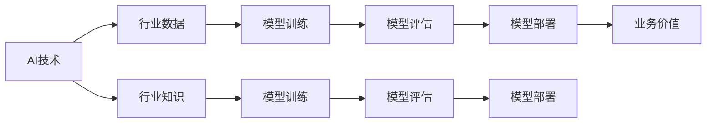
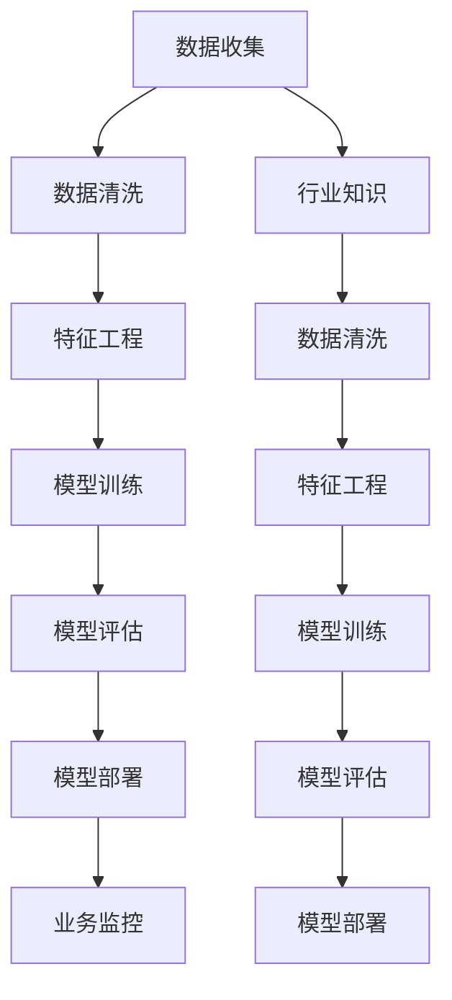

                 

# 行业Know-how在AI时代的重要性

## 1. 背景介绍

在人工智能（AI）技术飞速发展的当下，无论是初创企业还是传统企业，都在争相引入AI技术，以期在激烈的商业竞争中抢占先机。但AI技术的落地应用不仅仅是技术问题，更涉及对行业Know-how的深刻理解和应用。所谓行业Know-how，即指在特定行业领域中，长期积累的专业知识、最佳实践、工具方法和运营流程。本文旨在深入探讨行业Know-how在AI时代的重要性，并揭示其在企业AI落地应用中的核心价值。

### 1.1 行业Know-how的独特性

行业Know-how的独特性在于其高度的行业相关性和实践性。在许多情况下，行业Know-how不仅仅是一套理论知识体系，更是针对具体行业需求、问题和挑战，经过长期实践和迭代形成的解决问题的路径和方法。这些方法在特定领域内往往具有独特的优势，能够解决那些其他方法无法覆盖的难题。

### 1.2 行业Know-how的核心价值

在AI时代，行业Know-how的价值体现在以下几个方面：

1. **增强AI模型的精准度**：行业Know-how可以提升AI模型对特定行业问题的理解深度和准确性，使模型能够更好地适应行业需求。
2. **加速AI模型训练**：行业经验可以帮助构建更好的训练数据集，优化算法，提升模型的训练效率。
3. **优化AI模型部署**：行业Know-how可以指导AI模型在实际环境中的部署和优化，确保模型能够高效、稳定地运行。
4. **提升AI项目的成功率**：良好的行业Know-how是AI项目成功的重要保障，有助于规避常见的风险和挑战。

## 2. 核心概念与联系

### 2.1 核心概念概述

为深入理解行业Know-how在AI时代的重要性，我们首先需要明确几个核心概念：

- **AI技术**：以机器学习、深度学习等为代表的人工智能技术，能够处理大量数据，从中提取有用信息。
- **行业知识**：特定行业领域的专业知识、经验和方法，包括但不限于业务规则、操作流程、风险管理等。
- **行业数据**：特定行业领域的数据，包括历史业务数据、客户数据、交易数据等，是训练AI模型的重要基础。
- **AI模型**：通过训练数据集，使用AI技术得到的用于特定行业问题的模型，如分类模型、回归模型等。
- **模型评估**：通过行业标准和业务指标对AI模型的性能进行评估，确保模型能够满足业务需求。
- **模型部署**：将训练好的AI模型应用于实际业务场景，完成自动化决策、流程优化等任务。

### 2.2 核心概念的联系

这些核心概念之间存在着紧密的联系，构成了一个完整的AI应用生态。从数据收集、模型训练、模型评估到模型部署，每一步都需要行业Know-how的参与和指导，以确保AI模型能够真正服务于行业需求，产生业务价值。以下是一个Mermaid流程图，展示了这些概念之间的联系：



这个流程图展示了AI模型从数据到业务价值的整个生命周期，每个环节都依赖于行业Know-how的指导和支持。

### 2.3 核心概念的整体架构

在实际应用中，上述概念的实现需要构建一个完整的AI应用架构，如图：



此架构强调了行业Know-how在每个阶段的作用，确保数据、模型和业务价值的统一和协调。

## 3. 核心算法原理 & 具体操作步骤

### 3.1 算法原理概述

行业Know-how在AI应用中的核心作用体现在以下几个方面：

1. **数据预处理**：对行业数据进行清洗、归一化、标注等预处理，以提升数据质量，确保模型训练效果。
2. **特征工程**：根据行业特点和需求，设计有效的特征提取和变换方法，提升模型性能。
3. **模型选择**：根据行业需求选择合适的模型架构和算法，确保模型能够适应特定任务。
4. **超参数优化**：利用行业经验优化模型的超参数，提升模型效果。
5. **模型训练**：在行业数据上训练模型，确保模型能够准确反映行业特征和规律。
6. **模型评估**：使用行业标准和业务指标对模型进行全面评估，确保模型能够满足业务需求。
7. **模型部署**：在实际业务环境中部署模型，确保模型能够高效、稳定地运行。
8. **持续优化**：根据业务反馈和最新数据，持续优化模型和流程，保持模型的长期有效性。

### 3.2 算法步骤详解

基于行业Know-how的AI应用流程通常包括以下几个关键步骤：

**Step 1: 数据收集与预处理**

1. **数据收集**：从行业内外的各种渠道收集数据，包括但不限于客户交易数据、行为数据、市场数据等。
2. **数据清洗**：去除无效、重复、错误的数据，填充缺失值，进行数据标准化。
3. **数据标注**：为数据打上标签，以便于模型训练和评估。

**Step 2: 特征工程**

1. **特征提取**：根据行业特点，提取有用的特征，如时间序列特征、文本特征、图像特征等。
2. **特征变换**：对提取的特征进行归一化、编码、降维等处理，提升特征表达能力。
3. **特征选择**：根据业务需求和模型性能，选择最相关的特征。

**Step 3: 模型训练与评估**

1. **模型选择**：根据任务类型和行业特点选择合适的模型架构，如决策树、随机森林、深度学习模型等。
2. **模型训练**：在标注数据集上训练模型，优化模型参数。
3. **模型评估**：使用准确率、召回率、F1分数等指标评估模型性能，确保模型能够满足业务需求。

**Step 4: 模型部署与监控**

1. **模型部署**：将训练好的模型部署到生产环境中，完成自动化决策、流程优化等任务。
2. **业务监控**：实时监控模型运行状态，及时发现和解决问题。

**Step 5: 持续优化**

1. **反馈收集**：收集业务反馈，了解模型应用效果。
2. **数据更新**：定期更新训练数据，提升模型长期有效性。
3. **模型优化**：根据反馈和数据更新，持续优化模型和特征工程方法。

### 3.3 算法优缺点

行业Know-how在AI应用中的优势主要体现在以下几个方面：

**优点：**

1. **提高模型精准度**：行业知识能够帮助模型更好地理解行业特征，提升模型预测准确性。
2. **加速模型训练**：行业经验可以优化数据预处理和特征工程方法，提升模型训练效率。
3. **优化模型部署**：行业Know-how可以指导模型在实际环境中的部署和优化，确保模型高效稳定运行。
4. **提升项目成功率**：良好的行业知识是AI项目成功的重要保障，有助于规避常见风险和挑战。

**缺点：**

1. **知识局限性**：行业知识可能受限于特定的行业和时期，不够通用。
2. **知识积累难度大**：行业Know-how的积累需要长期实践和经验，获取成本较高。
3. **知识更新困难**：行业知识可能存在滞后性，需要不断更新才能保持最新状态。
4. **知识传递困难**：行业知识往往隐含于经验中，难以系统化和标准化传递。

### 3.4 算法应用领域

行业Know-how在AI应用中广泛应用于以下几个领域：

- **金融科技**：通过行业知识优化风控模型、推荐系统、反欺诈系统等。
- **医疗健康**：利用行业知识优化诊断模型、治疗方案推荐系统等。
- **制造业**：通过行业知识优化生产流程、设备预测性维护等。
- **零售电商**：利用行业知识优化推荐系统、库存管理、客户满意度预测等。
- **智慧城市**：通过行业知识优化交通管理、公共服务、能源管理等。

## 4. 数学模型和公式 & 详细讲解 & 举例说明

### 4.1 数学模型构建

以金融行业为例，构建基于行业Know-how的AI模型。假设我们要构建一个贷款审批模型，以判断贷款申请是否通过。模型输入为贷款申请的各项信息，输出为贷款是否通过的预测结果。

**数学模型：**

$$
\hat{y} = f(x; \theta)
$$

其中，$\hat{y}$ 为模型预测结果，$x$ 为输入特征，$\theta$ 为模型参数。

### 4.2 公式推导过程

**输入特征选择**：

假设我们选择了以下特征：贷款金额、申请人收入、信用记录、担保物价值、还款能力等。

**模型训练**：

假设我们选择了线性回归模型：

$$
\hat{y} = \beta_0 + \beta_1 x_1 + \beta_2 x_2 + ... + \beta_n x_n
$$

其中，$\beta_0, \beta_1, ..., \beta_n$ 为模型参数，$x_1, x_2, ..., x_n$ 为输入特征。

**模型评估**：

使用均方误差（Mean Squared Error, MSE）评估模型性能：

$$
MSE = \frac{1}{N} \sum_{i=1}^N (\hat{y}_i - y_i)^2
$$

其中，$N$ 为样本数，$y_i$ 为真实标签。

### 4.3 案例分析与讲解

假设我们收集了1000个贷款申请数据，其中500个被批准，500个未被批准。我们选择了前文提到的特征作为输入，构建线性回归模型，并使用均方误差评估模型性能。

1. **数据预处理**：
   - 清洗数据，去除无效和重复数据。
   - 填充缺失值，使用均值填补。
   - 数据标准化，使特征在统一尺度上。

2. **特征工程**：
   - 提取特征：贷款金额、申请人收入、信用记录、担保物价值、还款能力等。
   - 特征变换：对特征进行归一化，使用Z-score标准化。
   - 特征选择：根据业务需求和模型性能，选择最相关的特征。

3. **模型训练**：
   - 使用随机梯度下降（Stochastic Gradient Descent, SGD）优化模型参数。
   - 设定学习率、迭代轮数等超参数。

4. **模型评估**：
   - 使用均方误差评估模型预测结果与真实标签之间的差异。
   - 绘制学习曲线，观察模型性能随迭代轮数变化的趋势。

5. **模型部署**：
   - 将训练好的模型部署到生产环境中。
   - 实时监控模型运行状态，收集业务反馈。

6. **持续优化**：
   - 收集业务反馈，了解模型应用效果。
   - 定期更新训练数据，提升模型长期有效性。
   - 根据反馈和数据更新，持续优化模型和特征工程方法。

## 5. 项目实践：代码实例和详细解释说明

### 5.1 开发环境搭建

为了构建基于行业Know-how的AI模型，我们需要准备一个Python开发环境，并安装必要的库和工具。以下是搭建开发环境的步骤：

1. **安装Python和相关依赖**：
   - 下载并安装Python 3.7+。
   - 使用pip安装numpy、pandas、scikit-learn、matplotlib等库。

2. **设置开发工具**：
   - 安装Jupyter Notebook或PyCharm等开发工具。
   - 配置Git版本控制工具，方便版本管理。

3. **搭建环境**：
   - 创建一个虚拟环境，隔离开发依赖。
   - 激活虚拟环境，开始开发工作。

### 5.2 源代码详细实现

以下是一个简单的贷款审批模型的Python代码实现。假设我们已经有了训练数据和特征，只需要进行模型训练和评估：

```python
import numpy as np
from sklearn.linear_model import LinearRegression
from sklearn.metrics import mean_squared_error
from sklearn.model_selection import train_test_split

# 准备数据
X = np.array([[10000, 50000, 0.6, 0.8, 1.0], [20000, 60000, 0.5, 0.7, 0.8], ...])
y = np.array([1, 0, 1, 0, 1, ...]) # 1表示贷款通过，0表示未通过

# 划分训练集和测试集
X_train, X_test, y_train, y_test = train_test_split(X, y, test_size=0.2, random_state=42)

# 模型训练
model = LinearRegression()
model.fit(X_train, y_train)

# 模型评估
y_pred = model.predict(X_test)
mse = mean_squared_error(y_test, y_pred)
print("MSE:", mse)

# 模型部署
# 将训练好的模型保存为文件，部署到生产环境
```

### 5.3 代码解读与分析

让我们详细解读一下关键代码的实现细节：

**X和y数据准备**：
- X为输入特征矩阵，y为输出标签。
- 特征和标签都应经过预处理和标注。

**模型训练**：
- 使用线性回归模型，对训练集进行拟合。
- 设定学习率、迭代轮数等超参数。

**模型评估**：
- 使用均方误差评估模型预测结果与真实标签之间的差异。
- 打印MSE值，评估模型性能。

**模型部署**：
- 将训练好的模型保存为文件，部署到生产环境。
- 可以在生产环境中实时监控模型运行状态，收集业务反馈。

### 5.4 运行结果展示

假设我们在测试集上得到的MSE值为0.05，说明模型预测与真实标签之间的平均差异很小。

## 6. 实际应用场景

### 6.1 金融科技

在金融科技领域，行业Know-how在风险管理、反欺诈、信用评分等方面具有重要应用。

**风险管理**：利用行业知识优化风险评估模型，准确预测借款人的违约风险。
**反欺诈**：通过行业经验构建欺诈检测模型，及时识别和防范欺诈行为。
**信用评分**：结合行业知识，优化信用评分模型，准确评估借款人的信用等级。

### 6.2 医疗健康

在医疗健康领域，行业Know-how在疾病诊断、治疗方案推荐、药物研发等方面具有重要应用。

**疾病诊断**：利用行业知识优化诊断模型，提高诊断准确性和效率。
**治疗方案推荐**：结合患者历史数据和行业经验，推荐最佳治疗方案。
**药物研发**：利用行业知识指导药物筛选和临床试验，加速新药开发。

### 6.3 制造业

在制造业领域，行业Know-how在生产优化、设备维护、供应链管理等方面具有重要应用。

**生产优化**：利用行业经验优化生产流程，提高生产效率和质量。
**设备维护**：结合设备运行数据和行业知识，预测设备故障并进行维护。
**供应链管理**：通过行业知识优化供应链管理，降低成本，提高效率。

### 6.4 零售电商

在零售电商领域，行业Know-how在推荐系统、库存管理、客户满意度预测等方面具有重要应用。

**推荐系统**：结合用户历史行为和行业知识，推荐最合适的商品。
**库存管理**：利用行业经验优化库存管理，降低库存成本，提高库存周转率。
**客户满意度预测**：通过客户反馈和行业知识，预测客户满意度，优化服务流程。

## 7. 工具和资源推荐

### 7.1 学习资源推荐

为了帮助开发者系统掌握行业Know-how在AI时代的应用，我们推荐以下学习资源：

1. **机器学习经典书籍**：如《机器学习》（周志华）、《深度学习》（Ian Goodfellow）等，系统介绍机器学习和深度学习的基本概念和算法。
2. **行业知识库和教程**：如Kaggle的金融、医疗、制造业等行业数据集和模型竞赛，通过实际项目练习行业Know-how。
3. **在线课程和讲座**：如Coursera、edX、Udacity等平台上的机器学习和数据科学课程，涵盖多种行业应用。
4. **行业研究报告**：如麦肯锡、德勤等咨询公司的行业研究报告，了解行业最新趋势和挑战。

### 7.2 开发工具推荐

以下是几款用于行业Know-how在AI应用中的开发工具：

1. **Python**：灵活的编程语言，适合机器学习和数据科学。
2. **Scikit-learn**：Python的数据科学库，提供了多种机器学习算法和工具。
3. **TensorFlow和PyTorch**：强大的深度学习框架，支持分布式计算和GPU加速。
4. **Jupyter Notebook**：免费的交互式编程环境，方便开发和分享代码。
5. **Git**：版本控制工具，帮助开发者跟踪代码变化和协作开发。

### 7.3 相关论文推荐

以下是几篇奠基性的相关论文，推荐阅读：

1. **《金融领域的机器学习应用》**（金融科技）：介绍金融领域机器学习的典型应用和挑战。
2. **《医疗健康中的机器学习应用》**（医疗健康）：综述医疗健康领域机器学习的最新进展。
3. **《制造业中的机器学习应用》**（制造业）：探讨制造业机器学习在生产优化和设备维护中的应用。
4. **《零售电商中的机器学习应用》**（零售电商）：分析零售电商中机器学习在推荐系统和库存管理中的应用。
5. **《人工智能在医疗健康中的未来展望》**（医疗健康）：讨论人工智能在未来医疗健康中的应用前景。

## 8. 总结：未来发展趋势与挑战

### 8.1 总结

本文深入探讨了行业Know-how在AI时代的重要性，详细介绍了其在大数据、模型训练、模型评估、模型部署和持续优化等各个环节的作用。通过实际案例，展示了行业Know-how在金融科技、医疗健康、制造业和零售电商等多个领域的应用价值。

行业Know-how是大语言模型落地应用的重要保障，能够显著提升AI模型的精准度和业务价值。未来的研究需要在不断积累和传递行业知识的同时，结合最新的AI技术，推动行业应用不断创新。

### 8.2 未来发展趋势

展望未来，行业Know-how在AI时代将呈现以下几个发展趋势：

1. **行业Know-how的标准化**：随着行业知识体系的逐渐完善，行业Know-how将更加标准化和系统化，易于传递和应用。
2. **跨行业知识融合**：不同行业之间将进行知识共享和融合，提升AI模型的通用性和适应性。
3. **行业Know-how的自动化**：利用AI技术自动化生成行业Know-how，提升知识积累的效率和质量。
4. **AI与行业知识的双向驱动**：AI技术不断演进，行业知识也在不断丰富和创新，两者将实现双向驱动。
5. **行业Know-how的多样化**：除了传统的行业知识，还将包括行业规则、伦理道德等多样化的知识类型。

### 8.3 面临的挑战

尽管行业Know-how在AI时代具有重要价值，但在实际应用中也面临一些挑战：

1. **知识获取难度大**：行业知识往往隐含于经验和实践中，难以系统化和标准化获取。
2. **知识传递困难**：行业知识难以在团队内部和不同行业间传递。
3. **知识更新滞后**：行业知识可能存在滞后性，难以跟上技术进步和业务需求的变化。
4. **知识偏见和局限性**：行业知识可能带有一定的偏见和局限性，影响AI模型的公正性和普适性。

### 8.4 研究展望

未来的研究需要在以下几个方面寻求新的突破：

1. **知识图谱与AI结合**：利用知识图谱提升AI模型的知识整合能力。
2. **跨领域知识融合**：将不同行业的知识进行融合，提升AI模型的通用性。
3. **知识生成与传递自动化**：利用AI技术自动化生成和传递行业知识。
4. **知识共享平台**：建立行业知识共享平台，促进知识传播和应用。
5. **知识偏见消除**：利用AI技术消除行业知识中的偏见和局限性，提升AI模型的公正性和普适性。

总之，行业Know-how在AI时代具有重要价值，是AI模型落地应用的重要保障。未来的研究需要在不断积累和传递行业知识的同时，结合最新的AI技术，推动行业应用不断创新。只有勇于创新、敢于突破，才能不断拓展AI模型的边界，让智能技术更好地造福人类社会。

## 9. 附录：常见问题与解答

**Q1：行业Know-how如何与AI技术结合？**

A: 行业Know-how与AI技术的结合主要体现在以下几个方面：
1. 数据预处理：利用行业知识优化数据收集和预处理流程，提升数据质量。
2. 特征工程：结合行业经验设计有效的特征提取和变换方法，提升特征表达能力。
3. 模型选择：根据行业需求选择合适的模型架构和算法，确保模型能够适应特定任务。
4. 超参数优化：利用行业经验优化模型的超参数，提升模型效果。
5. 模型评估：使用行业标准和业务指标对模型进行全面评估，确保模型能够满足业务需求。
6. 模型部署：在实际业务环境中部署模型，确保模型能够高效、稳定地运行。

**Q2：行业Know-how的获取和传递方式有哪些？**

A: 行业Know-how的获取和传递方式主要包括：
1. 专家经验：通过专家访谈、经验分享等方式获取行业知识。
2. 行业标准：利用行业标准和规范，系统化传递行业知识。
3. 知识库：建立行业知识库，系统化存储和查询行业知识。
4. 培训和教育：通过培训课程、技术讲座等方式传播行业知识。
5. 文档和指南：编写行业文档和指南，方便知识传递和应用。

**Q3：行业Know-how如何提高AI模型的泛化能力？**

A: 行业Know-how可以提升AI模型的泛化能力，主要体现在以下几个方面：
1. 数据多样性：利用行业知识收集多样化的数据，提升模型泛化能力。
2. 特征工程：结合行业经验设计有效的特征提取和变换方法，提升特征表达能力。
3. 模型评估：使用行业标准和业务指标对模型进行全面评估，确保模型能够满足业务需求。
4. 模型优化：根据业务反馈和最新数据，持续优化模型和特征工程方法。
5. 模型部署：在实际业务环境中部署模型，确保模型能够高效、稳定地运行。

**Q4：行业Know-how在AI应用中的局限性有哪些？**

A: 行业Know-how在AI应用中也存在一些局限性，主要体现在以下几个方面：
1. 知识局限性：行业知识可能受限于特定的行业和时期，不够通用。
2. 知识积累难度大：行业知识往往需要长期实践和经验，获取成本较高。
3. 知识更新困难：行业知识可能存在滞后性，需要不断更新才能保持最新状态。
4. 知识传递困难：行业知识往往隐含于经验中，难以系统化和标准化传递。

**Q5：如何构建基于行业Know-how的AI应用架构？**

A: 构建基于行业Know-how的AI应用架构主要包括以下几个关键步骤：
1. 数据收集与预处理：从行业内外的各种渠道收集数据，进行清洗、归一化、标注等预处理。
2. 特征工程：根据行业特点和需求，设计有效的特征提取和变换方法。
3. 模型训练与评估：选择合适的模型架构和算法，使用标注数据训练模型，并使用行业标准和业务指标进行评估。
4. 模型部署与监控：将训练好的模型部署到生产环境中，实时监控模型运行状态。
5. 持续优化：根据业务反馈和最新数据，持续优化模型和特征工程方法。

通过以上步骤，可以构建一个完整的基于行业Know-how的AI应用架构，确保模型能够高效、稳定地服务于实际业务需求。

