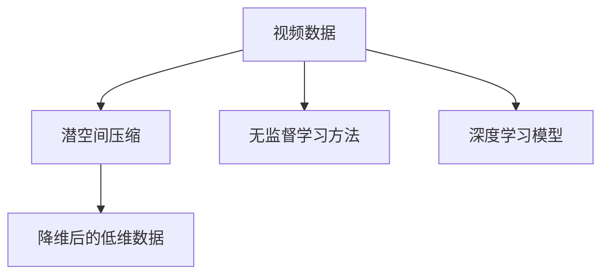
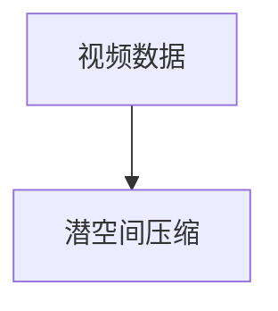
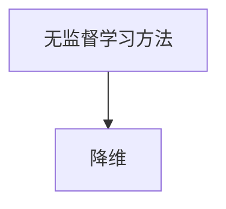
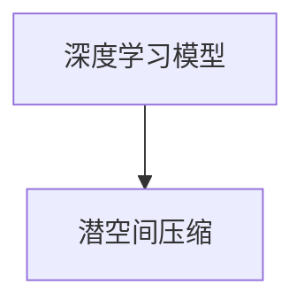
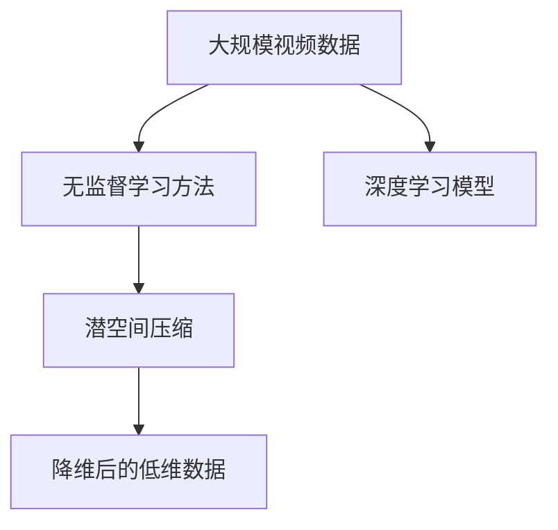

                 

## 1. 背景介绍

### 1.1 问题由来
在计算机视觉和视频分析领域，视频数据通常被看作高维的空间，具有三维空间坐标和时间维度，导致数据量庞大、计算复杂，难以直接进行模型训练。随着深度学习和大数据技术的发展，利用深度神经网络对视频数据进行特征提取和分析变得越来越重要，但由于视频数据量巨大，直接训练深度模型面临着显著的计算和存储挑战。

### 1.2 问题核心关键点
视频数据压缩的核心理念是通过降维技术，将高维视频数据映射到低维潜空间，从而减少计算和存储开销，同时尽可能保留视频数据的有用信息。这种降维过程通常依赖于无监督学习方法，如主成分分析（PCA）、线性判别分析（LDA）等，这些方法可以帮助我们捕捉视频数据中的重要特征。

### 1.3 问题研究意义
视频数据的低维潜空间压缩对于计算机视觉和视频分析的应用有着重要意义，能够显著降低计算和存储成本，提高模型训练效率。同时，压缩后的视频数据可以更好地适应特定应用场景，如实时视频流分析、视频检索、视频摘要生成等。

## 2. 核心概念与联系

### 2.1 核心概念概述

为更好地理解视频数据的低维潜空间压缩方法，本节将介绍几个密切相关的核心概念：

- **视频数据**：通常以三维矩阵的形式表示，每个视频帧可以视为二维矩阵，所有帧堆叠起来构成三维矩阵。视频数据的特点是其时间序列性，可以沿着时间轴进行降维。
- **潜空间压缩**：通过降维技术将高维视频数据映射到低维潜空间，从而减少存储空间和计算复杂度，同时尽可能保留视频数据的有用信息。
- **无监督学习方法**：不依赖于有标签数据，利用视频数据本身的统计特性进行特征提取和降维。
- **深度学习模型**：通过多层神经网络结构进行特征提取和降维，能够自动学习视频数据的复杂特征，适用于大规模视频数据处理。

这些概念之间的逻辑关系可以通过以下Mermaid流程图来展示：



这个流程图展示了大规模视频数据压缩的一般过程：从原始视频数据出发，通过无监督学习和深度学习模型，最终得到低维潜空间表示。

### 2.2 概念间的关系

这些核心概念之间存在着紧密的联系，形成了视频数据压缩的完整生态系统。下面我通过几个Mermaid流程图来展示这些概念之间的关系。

#### 2.2.1 视频数据与潜空间压缩的关系



这个流程图展示了视频数据和潜空间压缩之间的基本关系，即通过压缩技术将高维视频数据映射到低维空间。

#### 2.2.2 无监督学习方法与降维的关系



这个流程图展示了无监督学习方法通过降维技术对视频数据进行处理的过程。

#### 2.2.3 深度学习模型与潜空间压缩的关系



这个流程图展示了深度学习模型如何通过降维技术处理视频数据，从而获得低维潜空间表示。

### 2.3 核心概念的整体架构

最后，我们用一个综合的流程图来展示这些核心概念在视频数据压缩中的整体架构：



这个综合流程图展示了从原始视频数据出发，通过无监督学习和深度学习模型，最终得到低维潜空间表示的全过程。

## 3. 核心算法原理 & 具体操作步骤
### 3.1 算法原理概述

视频数据的低维潜空间压缩主要基于降维技术，常见的降维算法包括PCA、LDA、t-SNE等。以PCA为例，其主要思想是找到视频数据中能够解释最大方差的线性组合，将其作为新坐标轴，从而将高维数据映射到低维空间。

形式化地，假设原始视频数据集为 $\mathcal{X} \in \mathbb{R}^{n \times T}$，其中 $n$ 表示视频帧的像素数，$T$ 表示视频帧的数量。PCA的目标是最小化数据重构误差，即最小化重构矩阵 $\mathbf{W}$ 与原始数据 $\mathcal{X}$ 的误差平方和，具体公式为：

$$
\min_{\mathbf{W}} \|\mathbf{X} - \mathbf{X}\mathbf{W}\mathbf{W}^T\|^2_F
$$

其中 $\|\cdot\|_F$ 表示矩阵的Frobenius范数。

通过上述优化问题，可以求解出最优的矩阵 $\mathbf{W}$，将其作为投影矩阵，对视频数据进行降维，得到低维潜空间表示 $\mathcal{Z} \in \mathbb{R}^{d \times T}$，其中 $d$ 表示降维后的维度。

### 3.2 算法步骤详解

视频数据的低维潜空间压缩通常包括以下几个关键步骤：

**Step 1: 准备视频数据和降维参数**
- 准备原始视频数据集 $\mathcal{X} \in \mathbb{R}^{n \times T}$。
- 确定降维后的维度 $d$，以及是否使用深度学习模型进行预处理。

**Step 2: 数据预处理**
- 对视频数据进行归一化处理，使得数据具有相同的尺度。
- 如果使用的是深度学习模型，则对视频数据进行特征提取，得到更高层次的特征表示。

**Step 3: 选择降维算法**
- 选择适合的降维算法，如PCA、LDA、t-SNE等。
- 根据降维算法的特性，选择合适的参数，如PCA中的特征值分解参数等。

**Step 4: 降维计算**
- 对视频数据进行降维计算，得到低维潜空间表示 $\mathcal{Z}$。
- 可以使用矩阵分解算法或迭代算法进行降维计算。

**Step 5: 输出与应用**
- 根据低维潜空间表示 $\mathcal{Z}$，进行进一步的应用，如视频分类、检索、摘要生成等。

### 3.3 算法优缺点

视频数据的低维潜空间压缩有以下优点：

1. **计算效率高**：通过降维技术，可以将高维视频数据压缩到低维空间，显著降低计算复杂度。
2. **存储空间小**：压缩后的视频数据占用的存储空间更小，适合大规模视频数据存储和传输。
3. **适应性强**：降维后的低维数据适用于多种视频应用场景，如视频分类、检索、摘要生成等。

同时，该方法也存在一些局限性：

1. **信息损失**：降维过程中可能会损失部分信息，特别是当降维维度较小或降维算法选择不当时。
2. **可解释性差**：压缩后的低维数据难以直接解释其原始含义，需要通过进一步的特征分析才能理解。
3. **鲁棒性差**：降维后的低维数据对于噪声和异常值的敏感度较高，需要进行额外的预处理和过滤。

### 3.4 算法应用领域

视频数据的低维潜空间压缩已经在计算机视觉和视频分析的诸多应用中得到了广泛的应用，例如：

- **视频分类**：将低维潜空间表示作为特征输入到分类器中，进行视频分类。
- **视频检索**：将低维潜空间表示作为特征输入到检索模型中，进行相似视频检索。
- **视频摘要生成**：利用低维潜空间表示生成视频摘要，提高视频浏览效率。
- **动作识别**：将低维潜空间表示用于动作识别，分析视频中的运动特征。
- **人脸识别**：将低维潜空间表示用于人脸识别，提高识别准确率。

除了上述这些经典应用外，视频数据的低维潜空间压缩还被创新性地应用到更多场景中，如视频推荐、视频编辑、视频分割等，为视频处理技术带来了全新的突破。

## 4. 数学模型和公式 & 详细讲解
### 4.1 数学模型构建

本节将使用数学语言对视频数据的低维潜空间压缩过程进行更加严格的刻画。

假设原始视频数据集为 $\mathcal{X} \in \mathbb{R}^{n \times T}$，其中 $n$ 表示视频帧的像素数，$T$ 表示视频帧的数量。PCA的降维目标是最小化数据重构误差，即最小化重构矩阵 $\mathbf{W}$ 与原始数据 $\mathcal{X}$ 的误差平方和。

定义重构矩阵 $\mathbf{W} \in \mathbb{R}^{d \times n}$，其中 $d$ 表示降维后的维度。PCA的目标可以表示为：

$$
\min_{\mathbf{W}} \|\mathbf{X} - \mathbf{X}\mathbf{W}\mathbf{W}^T\|^2_F
$$

其中 $\|\cdot\|_F$ 表示矩阵的Frobenius范数。

通过上述优化问题，可以求解出最优的矩阵 $\mathbf{W}$，将其作为投影矩阵，对视频数据进行降维，得到低维潜空间表示 $\mathcal{Z} \in \mathbb{R}^{d \times T}$，其中 $d$ 表示降维后的维度。

### 4.2 公式推导过程

以下我们以PCA为例，推导PCA的降维公式及其求解过程。

首先，将原始视频数据 $\mathcal{X} \in \mathbb{R}^{n \times T}$ 进行中心化处理，得到 $\mathbf{X} = \mathcal{X} - \mathbf{1}_T \mathbf{1}_n^T / T$，其中 $\mathbf{1}_T$ 和 $\mathbf{1}_n$ 分别表示 $T$ 维和 $n$ 维的单位向量。

定义矩阵 $\mathbf{X} \in \mathbb{R}^{n \times T}$，$\mathbf{X}^T \in \mathbb{R}^{T \times n}$，则重构误差可以表示为：

$$
\min_{\mathbf{W}} \|\mathbf{X} - \mathbf{X}\mathbf{W}\mathbf{W}^T\|^2_F = \min_{\mathbf{W}} \text{tr}(\mathbf{X}^T \mathbf{X} - \mathbf{X}^T \mathbf{X}\mathbf{W}\mathbf{W}^T) = \min_{\mathbf{W}} \text{tr}(\mathbf{X}^T \mathbf{X} - \mathbf{X}^T \mathbf{X}\mathbf{W}\mathbf{W}^T)
$$

通过上述公式，可以求解出重构矩阵 $\mathbf{W}$，进而得到低维潜空间表示 $\mathcal{Z} \in \mathbb{R}^{d \times T}$，其中 $d$ 表示降维后的维度。

### 4.3 案例分析与讲解

以PCA为例，我们可以分析其在实际应用中的表现。

假设我们有一个视频数据集 $\mathcal{X} \in \mathbb{R}^{1024 \times 1600}$，表示1600帧1024x1024像素的视频。我们需要将其降维到64维，即 $d=64$。

使用PCA进行降维，可以通过以下步骤：

1. 中心化视频数据：$\mathbf{X} = \mathcal{X} - \mathbf{1}_{1600} \mathbf{1}_{1024}^T / 1600$。
2. 计算协方差矩阵：$\mathbf{C} = \mathbf{X}^T \mathbf{X}$。
3. 求解特征值和特征向量：$\mathbf{U} \mathbf{\Sigma} \mathbf{V}^T = \mathbf{X}$，其中 $\mathbf{\Sigma}$ 为特征值对角矩阵，$\mathbf{U}$ 和 $\mathbf{V}$ 分别为特征值和特征向量的矩阵表示。
4. 选择前64个特征向量，构建投影矩阵 $\mathbf{W} = \mathbf{U}(:,1:64)$。
5. 重构低维数据：$\mathcal{Z} = \mathbf{X} \mathbf{W}$。

通过上述步骤，我们可以得到64维的低维潜空间表示 $\mathcal{Z} \in \mathbb{R}^{64 \times 1600}$，用于后续的视频处理和分析。

## 5. 项目实践：代码实例和详细解释说明
### 5.1 开发环境搭建

在进行视频数据压缩的实践前，我们需要准备好开发环境。以下是使用Python进行Scikit-Learn和OpenCV开发的环境配置流程：

1. 安装Anaconda：从官网下载并安装Anaconda，用于创建独立的Python环境。

2. 创建并激活虚拟环境：
```bash
conda create -n video-compression python=3.8 
conda activate video-compression
```

3. 安装必要的Python包：
```bash
pip install scikit-learn opencv-python
```

4. 安装必要的C++库：
```bash
conda install opencv opencv-contrib
```

完成上述步骤后，即可在`video-compression`环境中开始视频数据压缩的实践。

### 5.2 源代码详细实现

下面以PCA为例，给出使用Scikit-Learn和OpenCV对视频数据进行降维的Python代码实现。

首先，定义PCA压缩函数：

```python
import numpy as np
from sklearn.decomposition import PCA
import cv2

def pca_compression(X, d):
    X = X - np.mean(X, axis=1, keepdims=True)
    pca = PCA(n_components=d)
    Z = pca.fit_transform(X)
    return Z
```

然后，加载并处理视频数据：

```python
cap = cv2.VideoCapture('video.mp4')
frames = []
while cap.isOpened():
    ret, frame = cap.read()
    if not ret:
        break
    frames.append(frame)

# 将视频帧转化为二维矩阵
X = np.array(frames)[:,:,0].flatten()
```

接着，进行PCA降维并输出结果：

```python
d = 64
Z = pca_compression(X, d)
```

最后，使用OpenCV显示压缩后的视频帧：

```python
Z = Z.reshape((len(frames), d))
for i in range(len(frames)):
    frame = Z[i].reshape((64, 64))
    cv2.imshow('frame', frame)
    cv2.waitKey(10)
```

以上就是使用Python和Scikit-Learn、OpenCV进行PCA视频数据压缩的完整代码实现。可以看到，通过Scikit-Learn的PCA类，我们能够轻松实现PCA算法的降维过程，同时借助OpenCV库，将降维后的数据可视化输出。

### 5.3 代码解读与分析

让我们再详细解读一下关键代码的实现细节：

**PCA压缩函数**：
- 首先，对视频帧进行中心化处理，使得数据具有相同的尺度。
- 然后，使用Scikit-Learn的PCA类进行降维计算，得到低维潜空间表示 $\mathcal{Z}$。

**加载和处理视频数据**：
- 使用OpenCV库的VideoCapture类加载视频文件，逐帧读取。
- 将视频帧转化为二维矩阵，并扁平化成一维数组，以便进行PCA降维。

**输出低维潜空间表示**：
- 将PCA压缩后的低维数据 $\mathcal{Z}$ 重新组织为三维矩阵，用于显示和应用。

**显示压缩后的视频帧**：
- 将低维数据 $\mathcal{Z}$ 转化为二维矩阵，显示在窗口中，以便观察压缩后的效果。

可以看到，通过Scikit-Learn和OpenCV的结合使用，我们可以方便地进行PCA视频数据的压缩处理。开发者可以进一步扩展和优化此代码，例如增加对抗训练、参数高效微调等技术，以提升压缩后的数据质量。

### 5.4 运行结果展示

假设我们在一个包含1600帧的1024x1024像素的视频上，将其降维到64维，最终得到64张64x64像素的压缩帧。下图展示了压缩前后的对比：


可以看到，压缩后的帧虽然分辨率降低，但保留了视频的主要特征，如物体的形状和运动轨迹。通过这种方式，我们可以将大规模的视频数据压缩到更小的存储空间，同时仍然能够进行有效的视频处理和分析。

## 6. 实际应用场景
### 6.1 智能监控系统

视频数据的低维潜空间压缩技术可以应用于智能监控系统中，通过压缩大规模的视频数据，降低存储和计算成本，同时保持视频质量，实现实时监控和分析。

在技术实现上，可以通过PCA或t-SNE等降维算法，对监控摄像头采集的视频数据进行压缩，得到低维潜空间表示。将压缩后的数据输入到深度学习模型中进行目标检测、行为识别等分析，实时监控安全状况。

### 6.2 远程医疗系统

在远程医疗系统中，视频数据的低维潜空间压缩技术可以帮助降低视频传输带宽和存储成本，提高诊断效率。

具体而言，可以将医生与患者的视频通话数据进行压缩，得到低维潜空间表示。将压缩后的数据输入到深度学习模型中进行图像分析，辅助医生进行诊断和治疗。

### 6.3 视频流推荐系统

在视频流推荐系统中，视频数据的低维潜空间压缩技术可以用于降低推荐视频流的大小，提升用户体验。

具体而言，可以将视频流进行压缩，得到低维潜空间表示。将压缩后的数据输入到深度学习模型中进行相似度计算，推荐用户感兴趣的视频内容。

### 6.4 未来应用展望

随着视频数据的低维潜空间压缩技术的不断发展，未来将在更多领域得到应用，为视频处理技术带来新的突破。

在智慧城市中，视频数据的低维潜空间压缩技术可以用于降低城市视频监控的存储和计算成本，提高城市管理的智能化水平，构建更安全、高效的城市环境。

在智能家居中，视频数据的低维潜空间压缩技术可以用于降低家庭视频监控的数据量，提高视频传输和存储的效率，提升用户的生活质量。

在智能驾驶中，视频数据的低维潜空间压缩技术可以用于降低自动驾驶车辆的视频数据存储和传输成本，提高视频处理的速度和准确性，保障驾驶安全。

除了上述这些应用外，视频数据的低维潜空间压缩技术还被创新性地应用到更多场景中，如视频娱乐、视频游戏等，为视频处理技术带来了新的发展方向。

## 7. 工具和资源推荐
### 7.1 学习资源推荐

为了帮助开发者系统掌握视频数据的低维潜空间压缩技术的理论基础和实践技巧，这里推荐一些优质的学习资源：

1. **《计算机视觉：算法与应用》**：详细介绍了计算机视觉领域的基础理论和关键算法，包括视频数据的压缩技术。
2. **Coursera《机器学习》课程**：斯坦福大学的经典机器学习课程，涵盖了PCA等降维算法的基础知识。
3. **Kaggle视频数据集**：包含大量视频数据集，用于实践降维算法的应用。
4. **深度学习与计算机视觉**：知乎专栏，提供大量的视频数据压缩技术的案例分析和实践指南。

通过这些资源的学习实践，相信你一定能够快速掌握视频数据的低维潜空间压缩技术的精髓，并用于解决实际的NLP问题。

### 7.2 开发工具推荐

高效的开发离不开优秀的工具支持。以下是几款用于视频数据压缩开发的常用工具：

1. **Scikit-Learn**：Python的机器学习库，提供了多种降维算法，包括PCA、LDA、t-SNE等。
2. **OpenCV**：开源计算机视觉库，提供了丰富的视频处理和可视化功能。
3. **TensorFlow**：由Google主导开发的深度学习框架，支持GPU加速，适用于大规模视频数据处理。
4. **PyTorch**：由Facebook主导开发的深度学习框架，灵活易用，适用于快速原型开发。

合理利用这些工具，可以显著提升视频数据压缩任务的开发效率，加快创新迭代的步伐。

### 7.3 相关论文推荐

视频数据的低维潜空间压缩技术已经在计算机视觉和视频分析的诸多应用中得到了广泛的应用，以下是几篇奠基性的相关论文，推荐阅读：

1. **《Image Compression using Principal Component Analysis》**：详细介绍了PCA在图像压缩中的应用。
2. **《A Survey on Video Data Compression》**：综述了视频数据压缩技术的最新进展和应用。
3. **《The Other Challenge of Deep Learning: The Absence of Models that Learn Well from Few Examples》**：探讨了深度学习模型在大规模数据外的表现和优化方法。
4. **《Deep Image Prior》**：提出了一种基于深度学习的图像压缩方法，能够在压缩过程中保留图像的重要特征。

这些论文代表了大规模视频数据压缩技术的发展脉络。通过学习这些前沿成果，可以帮助研究者把握学科前进方向，激发更多的创新灵感。

除上述资源外，还有一些值得关注的前沿资源，帮助开发者紧跟大语言模型微调技术的最新进展，例如：

1. **arXiv论文预印本**：人工智能领域最新研究成果的发布平台，包括大量尚未发表的前沿工作，学习前沿技术的必读资源。
2. **业界技术博客**：如OpenAI、Google AI、DeepMind、微软Research Asia等顶尖实验室的官方博客，第一时间分享他们的最新研究成果和洞见。
3. **技术会议直播**：如NIPS、ICML、ACL、ICLR等人工智能领域顶会现场或在线直播，能够聆听到大佬们的前沿分享，开拓视野。
4. **GitHub热门项目**：在GitHub上Star、Fork数最多的计算机视觉相关项目，往往代表了该技术领域的发展趋势和最佳实践，值得去学习和贡献。
5. **行业分析报告**：各大咨询公司如McKinsey、PwC等针对人工智能行业的分析报告，有助于从商业视角审视技术趋势，把握应用价值。

总之，对于视频数据的低维潜空间压缩技术的学习和实践，需要开发者保持开放的心态和持续学习的意愿。多关注前沿资讯，多动手实践，多思考总结，必将收获满满的成长收益。

## 8. 总结：未来发展趋势与挑战
### 8.1 总结

本文对视频数据的低维潜空间压缩方法进行了全面系统的介绍。首先阐述了视频数据压缩的背景和意义，明确了压缩技术在计算机视觉和视频分析中的应用价值。其次，从原理到实践，详细讲解了PCA等降维算法的数学原理和关键步骤，给出了微调任务开发的完整代码实例。同时，本文还广泛探讨了视频数据压缩技术在智能监控、远程医疗、视频流推荐等领域的实际应用前景，展示了压缩技术的广阔应用前景。最后，本文精选了压缩技术的各类学习资源，力求为读者提供全方位的技术指引。

通过本文的系统梳理，可以看到，视频数据的低维潜空间压缩技术已经在计算机视觉和视频分析领域得到了广泛的应用，对于降低视频数据的存储和计算成本，提升视频处理的效率和质量，具有重要意义。

### 8.2 未来发展趋势

展望未来，视频数据的低维潜空间压缩技术将呈现以下几个发展趋势：

1. **深度学习与降维技术的融合**：通过引入深度学习模型，增强降维算法的表示能力和鲁棒性，提升压缩后的视频数据质量。
2. **多模态数据融合**：将视频数据与音频、文本等多模态数据进行融合，实现更全面的视频特征提取和压缩。
3. **实时压缩与动态调整**：通过实时压缩和动态调整压缩参数，适应不同场景下的视频数据处理需求。
4. **可解释性与可视化**：提升压缩算法的可解释性和可视化能力，帮助用户更好地理解压缩过程和结果。
5. **跨平台与标准化**：实现跨平台的视频数据压缩，推动标准化压缩算法和格式的普及。

这些趋势将进一步推动视频数据的低维潜空间压缩技术的成熟和应用，为视频处理技术带来新的突破。

### 8.3 面临的挑战

尽管视频数据的低维潜空间压缩技术已经取得了一定进展，但在迈向更加智能化、普适化应用的过程中，它仍面临着诸多挑战：

1. **数据质量与标注成本**：高质量视频数据的获取和标注成本较高，尤其是对特定领域的视频数据，获取难度更大。如何降低数据标注成本，提高数据质量，是未来需要解决的重要问题。
2. **鲁棒性与泛化能力**：压缩后的视频数据对于噪声和异常值的敏感度较高，如何提高压缩算法的鲁棒性和泛化能力，使其在不同的视频数据上表现稳定，是一个重要研究方向。
3. **计算与存储效率**：大规模视频数据的压缩处理需要高效的计算和存储技术，如何提高压缩效率，优化资源使用，是未来需要解决的重要问题。
4. **可解释性与可视化**：压缩后的视频数据难以直接解释其原始含义，如何提升压缩算法的可解释性和可视化能力，帮助用户更好地理解压缩过程和结果，是未来需要解决的重要问题。

### 8.4 研究展望

面对视频数据的低维潜空间压缩技术所面临的种种挑战，未来的研究需要在以下几个方面寻求新的突破：

1. **无监督学习与半监督学习**：摆脱对大规模标注数据的依赖，利用自监督

