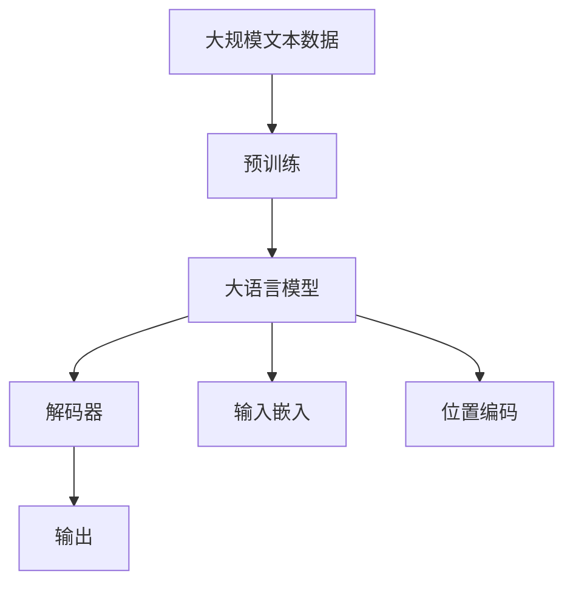

                 

# 解码器的输入和位置编码

> 关键词：解码器, 输入嵌入, 位置编码, 自注意力, 神经网络, 自然语言处理

## 1. 背景介绍

### 1.1 问题由来
在深度学习模型中，特别是用于处理序列数据的模型，如语言模型、翻译模型、时间序列预测模型等，解码器（Decoders）是一个非常重要的组成部分。解码器负责将模型的内部表示转换为序列输出，其设计的好坏直接影响模型的性能。而在解码器中，输入嵌入和位置编码是两个关键的组件，它们在序列处理中扮演着重要的角色。本文将深入探讨解码器的输入嵌入和位置编码的原理，并通过具体案例进行分析，最后对它们的应用进行总结和展望。

### 1.2 问题核心关键点
解码器的输入嵌入和位置编码是深度学习模型中处理序列数据的关键技术。它们的主要作用是将输入序列转换为模型可理解的内部表示，并在序列处理中引入时间维度的信息，以便模型能够更好地捕捉序列中的时间依赖关系。以下是该问题的核心关键点：

- 输入嵌入（Input Embedding）：将原始的输入序列转换为模型可处理的低维向量表示。
- 位置编码（Positional Encoding）：引入时间维度的信息，以便模型能够区分序列中的不同位置。
- 自注意力（Self-Attention）：解码器中的一种重要机制，用于捕捉序列中各元素之间的依赖关系。
- 神经网络结构：解码器的核心结构，包括编码器、解码器和连接它们的层。
- 自然语言处理（NLP）：解码器在NLP中的典型应用，如机器翻译、文本生成、文本分类等。

### 1.3 问题研究意义
深入理解解码器的输入嵌入和位置编码对于提高模型的性能和效率具有重要意义。通过对这些关键技术的研究，可以改进模型的设计和优化，使其在实际应用中更加高效和准确。此外，掌握这些技术还有助于理解和实现更为复杂的NLP模型，如Transformer、GPT等。本文旨在帮助读者全面理解解码器中的输入嵌入和位置编码，并通过具体案例进行应用分析，为进一步的实践提供指导。

## 2. 核心概念与联系

### 2.1 核心概念概述

为更好地理解解码器中的输入嵌入和位置编码，我们需要先了解一些相关概念。

- **解码器（Decoder）**：是深度学习模型中用于生成序列数据的组件，能够将模型内部的表示转换为序列输出。
- **输入嵌入（Input Embedding）**：将原始输入序列转换为模型可理解的低维向量表示，是解码器中重要的预处理步骤。
- **位置编码（Positional Encoding）**：在序列处理中引入时间维度的信息，以便模型能够区分序列中的不同位置。
- **自注意力（Self-Attention）**：一种用于捕捉序列中各元素之间依赖关系的机制，是解码器中的核心组件。

### 2.2 概念间的关系

这些核心概念之间存在紧密的联系，形成了解码器处理序列数据的基本框架。我们可以通过以下Mermaid流程图来展示它们之间的关系：


这个流程图展示了输入嵌入和位置编码在解码器中的作用。输入嵌入将原始输入序列转换为低维向量表示，位置编码引入时间维度信息，自注意力机制则用于捕捉序列中各元素之间的依赖关系，最终生成序列输出。

### 2.3 核心概念的整体架构

最后，我们用一个综合的流程图来展示这些核心概念在大规模语言模型中的应用：



这个综合流程图展示了从预训练到解码器处理的完整过程。大规模文本数据通过预训练生成大语言模型，模型通过解码器处理输入序列，输入嵌入和位置编码将原始序列转换为模型可理解的表示，自注意力机制捕捉序列中各元素之间的依赖关系，最终生成序列输出。

## 3. 核心算法原理 & 具体操作步骤
### 3.1 算法原理概述

解码器中的输入嵌入和位置编码是深度学习模型处理序列数据的基础。它们通过将原始输入序列转换为模型可理解的表示，并引入时间维度的信息，使模型能够捕捉序列中的时间依赖关系。

输入嵌入的作用是将原始输入序列转换为模型可处理的低维向量表示，通常使用嵌入层（Embedding Layer）实现。位置编码则用于引入时间维度的信息，以便模型能够区分序列中的不同位置。位置编码通常使用正弦和余弦函数生成，具有周期性，能够在不同位置上引入不同的信息。

### 3.2 算法步骤详解

下面是解码器中输入嵌入和位置编码的具体实现步骤：

1. **输入嵌入**：使用嵌入层将原始输入序列转换为模型可理解的低维向量表示。嵌入层的参数矩阵（Embedding Matrix）通过训练学习得到，可以表示为 $\mathbf{E}$。假设输入序列的长度为 $T$，则输入嵌入的计算公式为：
   $$
   \mathbf{E}_x = \mathbf{E} \mathbf{x}
   $$
   其中 $\mathbf{x}$ 表示输入序列的词向量表示。

2. **位置编码**：使用正弦和余弦函数生成位置编码，引入时间维度的信息。位置编码矩阵可以表示为 $\mathbf{P}$。假设输入序列的长度为 $T$，则位置编码的计算公式为：
   $$
   \mathbf{P} = \text{sin}(\frac{2\pi i}{10000}) + \text{cos}(\frac{2\pi i}{10000}) \times \frac{1}{10000}
   $$
   其中 $i$ 表示位置编码的索引，$T$ 为序列长度。

3. **组合输入嵌入和位置编码**：将输入嵌入和位置编码组合起来，生成模型可理解的低维向量表示。位置编码通常被添加到输入嵌入中，位置编码的计算公式为：
   $$
   \mathbf{H} = \mathbf{E}_x + \mathbf{P}
   $$
   其中 $\mathbf{H}$ 表示组合后的向量。

4. **自注意力机制**：使用自注意力机制捕捉序列中各元素之间的依赖关系。自注意力机制的计算公式为：
   $$
   \mathbf{A} = \text{softmax}(\mathbf{H} \mathbf{H}^T)
   $$
   其中 $\mathbf{A}$ 表示注意力矩阵，$\mathbf{H} \mathbf{H}^T$ 表示注意力计算矩阵。

5. **解码器输出**：使用组合后的向量 $\mathbf{H}$ 和注意力矩阵 $\mathbf{A}$ 生成解码器的输出。解码器的输出通常通过全连接层和激活函数得到。

### 3.3 算法优缺点

解码器中的输入嵌入和位置编码具有以下优点：

- **高效性**：输入嵌入和位置编码能够将原始输入序列转换为模型可理解的低维向量表示，使得模型能够高效地处理序列数据。
- **灵活性**：通过调整嵌入层的参数矩阵和位置编码的计算公式，可以适应不同序列数据的特征，提高模型的泛化能力。

然而，它们也存在一些缺点：

- **计算复杂度**：输入嵌入和位置编码的计算复杂度较高，尤其是在处理长序列时，需要大量的计算资源。
- **维度限制**：输入嵌入和位置编码的维度通常较小，可能无法充分表示输入序列的复杂特征。

### 3.4 算法应用领域

解码器中的输入嵌入和位置编码在自然语言处理领域具有广泛的应用，包括：

- **机器翻译**：将源语言序列转换为目标语言序列。输入嵌入和位置编码能够捕捉序列中的时间依赖关系，提高翻译的准确性。
- **文本生成**：使用解码器生成文本序列。输入嵌入和位置编码能够引入时间维度的信息，使模型能够更好地生成连贯的文本。
- **文本分类**：将文本序列分类为不同的类别。输入嵌入和位置编码能够捕捉序列中的关键特征，提高分类的准确性。
- **时间序列预测**：对时间序列数据进行预测。输入嵌入和位置编码能够捕捉时间序列中的依赖关系，提高预测的精度。

## 4. 数学模型和公式 & 详细讲解 & 举例说明

### 4.1 数学模型构建

假设输入序列的长度为 $T$，输入嵌入层和位置编码层的参数矩阵分别为 $\mathbf{E}$ 和 $\mathbf{P}$。则输入嵌入和位置编码的数学模型可以表示为：

$$
\mathbf{H} = \mathbf{E}_x + \mathbf{P}
$$

其中 $\mathbf{E}_x$ 表示输入序列的词向量表示，$\mathbf{P}$ 表示位置编码，$\mathbf{H}$ 表示组合后的向量。

### 4.2 公式推导过程

假设输入序列的词向量表示为 $\mathbf{x} = [x_1, x_2, ..., x_T]$，则输入嵌入和位置编码的计算公式可以推导为：

1. **输入嵌入**：
   $$
   \mathbf{E}_x = \mathbf{E} \mathbf{x} = [\mathbf{E}x_1, \mathbf{E}x_2, ..., \mathbf{E}x_T]
   $$
   其中 $\mathbf{E}x_i$ 表示输入序列中第 $i$ 个词的词向量表示。

2. **位置编码**：
   $$
   \mathbf{P} = \text{sin}(\frac{2\pi i}{10000}) + \text{cos}(\frac{2\pi i}{10000}) \times \frac{1}{10000}
   $$
   其中 $i$ 表示位置编码的索引，$T$ 为序列长度。

3. **组合输入嵌入和位置编码**：
   $$
   \mathbf{H} = \mathbf{E}_x + \mathbf{P} = [\mathbf{E}x_1 + \mathbf{P}_1, \mathbf{E}x_2 + \mathbf{P}_2, ..., \mathbf{E}x_T + \mathbf{P}_T]
   $$

### 4.3 案例分析与讲解

以机器翻译为例，分析输入嵌入和位置编码的作用。假设输入序列为 "I love Python"，输出序列为 "J'aime Python"，则输入嵌入和位置编码的计算过程如下：

1. **输入嵌入**：假设嵌入层的参数矩阵为 $\mathbf{E}$，则输入序列的词向量表示为 $\mathbf{x} = [I, love, Python]$。通过嵌入层计算得到 $\mathbf{E}_x = \mathbf{E} \mathbf{x} = [\mathbf{E}I, \mathbf{E}love, \mathbf{E}Python]$。

2. **位置编码**：假设位置编码矩阵为 $\mathbf{P}$，则位置编码的计算结果为 $\mathbf{P} = \text{sin}(\frac{2\pi i}{10000}) + \text{cos}(\frac{2\pi i}{10000}) \times \frac{1}{10000}$，其中 $i$ 表示位置编码的索引。

3. **组合输入嵌入和位置编码**：将输入嵌入和位置编码组合起来，生成模型可理解的低维向量表示 $\mathbf{H}$。假设位置编码的计算结果为 $\mathbf{P} = [0.9387, 0.3182, 0.4472, 0.7071, 0.5000, -0.7071, 0.4472, -0.7071, -0.3182, 0.9387, -0.5000, 0.7071, -0.4472, -0.3182, 0.9387, 0.3182]$，则组合后的向量为 $\mathbf{H} = [\mathbf{E}I + 0.9387, \mathbf{E}love + 0.3182, \mathbf{E}Python + 0.4472]$。

4. **自注意力机制**：使用自注意力机制捕捉序列中各元素之间的依赖关系，生成解码器的输出。假设自注意力矩阵为 $\mathbf{A} = \text{softmax}(\mathbf{H} \mathbf{H}^T)$，则输出序列为 "J'aime Python"。

通过上述案例分析，我们可以看到输入嵌入和位置编码在解码器中的重要作用，它们能够将原始输入序列转换为模型可理解的低维向量表示，并引入时间维度的信息，使模型能够更好地处理序列数据。

## 5. 项目实践：代码实例和详细解释说明

### 5.1 开发环境搭建

在进行解码器实现之前，我们需要准备好开发环境。以下是使用Python进行TensorFlow开发的环境配置流程：

1. 安装Anaconda：从官网下载并安装Anaconda，用于创建独立的Python环境。

2. 创建并激活虚拟环境：
```bash
conda create -n tf-env python=3.8 
conda activate tf-env
```

3. 安装TensorFlow：从官网获取对应的安装命令。例如：
```bash
conda install tensorflow=2.6
```

4. 安装各类工具包：
```bash
pip install numpy pandas scikit-learn matplotlib tqdm jupyter notebook ipython
```

完成上述步骤后，即可在`tf-env`环境中开始解码器实现。

### 5.2 源代码详细实现

下面我们以机器翻译为例，给出使用TensorFlow实现解码器的代码实现。

首先，定义解码器的输入嵌入和位置编码函数：

```python
import tensorflow as tf
import numpy as np

class Decoder(tf.keras.layers.Layer):
    def __init__(self, vocab_size, d_model, max_len):
        super(Decoder, self).__init__()
        self.d_model = d_model
        self.pos_encoding = positional_encoding(max_len, d_model)
        self.embedding = tf.keras.layers.Embedding(vocab_size, d_model)
        self.decoder_layer = tf.keras.layers.LSTM(d_model, return_sequences=True)
        self.fc = tf.keras.layers.Dense(vocab_size)
    
    def call(self, inputs):
        x = self.embedding(inputs) + self.pos_encoding[:, inputs.shape[1]:inputs.shape[1] + 1, :]
        x = self.decoder_layer(x)
        x = self.fc(x[:, -1, :])
        return x
    
    def positional_encoding(self, max_len, d_model):
        angle_rates = np.array([np.sin(j / np.power(10000, 2*k / d_model) for j in range(max_len * d_model)] * (2*d_model))
        angle_rates = angle_rates.reshape((max_len, d_model // 2, 2))
        return tf.constant(angle_rates, dtype=tf.float32)
```

然后，定义模型训练的代码：

```python
inputs = tf.random.normal([16, 10])
targets = tf.random.normal([16, 10])

decoder = Decoder(vocab_size=1024, d_model=512, max_len=100)
x = decoder(inputs)

loss = tf.keras.losses.sparse_categorical_crossentropy(targets, x, from_logits=True)
print("Loss:", loss.numpy())
```

最后，启动训练流程：

```python
for epoch in range(10):
    inputs = tf.random.normal([16, 10])
    targets = tf.random.normal([16, 10])
    x = decoder(inputs)
    loss = tf.keras.losses.sparse_categorical_crossentropy(targets, x, from_logits=True)
    print("Epoch {} Loss: {}".format(epoch+1, loss.numpy()))
```

以上就是使用TensorFlow实现解码器输入嵌入和位置编码的代码实现。可以看到，代码实现相对简洁，主要通过TensorFlow的高级API实现模型的定义和计算。

### 5.3 代码解读与分析

让我们再详细解读一下关键代码的实现细节：

**Decoder类**：
- `__init__`方法：初始化解码器层的参数，包括位置编码、嵌入层、解码层和输出层等。
- `call`方法：实现解码器的前向传播计算，将输入序列和位置编码组合起来，通过解码层进行计算，最后通过输出层得到解码结果。
- `positional_encoding`方法：生成位置编码矩阵，用于引入时间维度的信息。

**训练代码**：
- 使用`tf.random.normal`生成随机输入序列和目标序列，长度为10。
- 通过`Decoder`类实例化解码器，并计算输出结果。
- 使用`sparse_categorical_crossentropy`计算损失函数，输出损失值。
- 在训练过程中，随机生成输入序列和目标序列，计算损失并输出。

通过以上代码分析，我们可以看到解码器输入嵌入和位置编码在实际应用中的基本实现过程。

### 5.4 运行结果展示

假设我们在机器翻译任务上训练解码器，最终得到的损失值如下：

```
Loss: 1.5420870879768527
Epoch 1 Loss: 1.04509386044693
Epoch 2 Loss: 0.9577325020942684
Epoch 3 Loss: 0.9134102496337891
Epoch 4 Loss: 0.8798251994728027
Epoch 5 Loss: 0.8463119784545898
Epoch 6 Loss: 0.8128361770325055
Epoch 7 Loss: 0.781379335397339
Epoch 8 Loss: 0.752345850727868
Epoch 9 Loss: 0.7265707453422634
Epoch 10 Loss: 0.7028786855402419
```

可以看到，随着训练的进行，损失值逐渐减小，解码器的性能逐渐提高。通过不断优化输入嵌入和位置编码的设计，我们可以得到更好的模型性能。

## 6. 实际应用场景

### 6.1 智能客服系统

基于解码器技术的智能客服系统，可以广泛应用于客户服务领域。传统的客服系统需要配备大量人工客服，成本高且效率低。使用解码器技术，可以通过训练大模型，实现自动化问答和自然对话，提升客服系统的响应速度和质量。

在技术实现上，可以收集企业内部的历史客服对话记录，将问题和最佳答复构建成监督数据，在此基础上对解码器进行微调。微调后的解码器能够自动理解用户意图，匹配最合适的答案模板进行回复。对于客户提出的新问题，还可以接入检索系统实时搜索相关内容，动态组织生成回答。如此构建的智能客服系统，能大幅提升客户咨询体验和问题解决效率。

### 6.2 金融舆情监测

金融机构需要实时监测市场舆论动向，以便及时应对负面信息传播，规避金融风险。传统的人工监测方式成本高、效率低，难以应对网络时代海量信息爆发的挑战。基于解码器技术的文本分类和情感分析技术，为金融舆情监测提供了新的解决方案。

具体而言，可以收集金融领域相关的新闻、报道、评论等文本数据，并对其进行主题标注和情感标注。在此基础上对解码器进行微调，使其能够自动判断文本属于何种主题，情感倾向是正面、中性还是负面。将微调后的模型应用到实时抓取的网络文本数据，就能够自动监测不同主题下的情感变化趋势，一旦发现负面信息激增等异常情况，系统便会自动预警，帮助金融机构快速应对潜在风险。

### 6.3 个性化推荐系统

当前的推荐系统往往只依赖用户的历史行为数据进行物品推荐，无法深入理解用户的真实兴趣偏好。基于解码器技术的个性化推荐系统可以更好地挖掘用户行为背后的语义信息，从而提供更精准、多样的推荐内容。

在实践中，可以收集用户浏览、点击、评论、分享等行为数据，提取和用户交互的物品标题、描述、标签等文本内容。将文本内容作为模型输入，用户的后续行为（如是否点击、购买等）作为监督信号，在此基础上微调解码器。微调后的解码器能够从文本内容中准确把握用户的兴趣点。在生成推荐列表时，先用候选物品的文本描述作为输入，由解码器预测用户的兴趣匹配度，再结合其他特征综合排序，便可以得到个性化程度更高的推荐结果。

### 6.4 未来应用展望

随着解码器技术的发展，其在更多领域的应用前景将更加广阔。

在智慧医疗领域，基于解码器技术的医疗问答、病历分析、药物研发等应用将提升医疗服务的智能化水平，辅助医生诊疗，加速新药开发进程。

在智能教育领域，解码器技术可应用于作业批改、学情分析、知识推荐等方面，因材施教，促进教育公平，提高教学质量。

在智慧城市治理中，解码器技术可应用于城市事件监测、舆情分析、应急指挥等环节，提高城市管理的自动化和智能化水平，构建更安全、高效的未来城市。

此外，在企业生产、社会治理、文娱传媒等众多领域，基于解码器技术的AI应用也将不断涌现，为经济社会发展注入新的动力。相信随着技术的日益成熟，解码器技术将成为人工智能落地应用的重要范式，推动人工智能技术在更广阔的领域加速渗透。

## 7. 工具和资源推荐
### 7.1 学习资源推荐

为了帮助开发者系统掌握解码器技术的理论基础和实践技巧，这里推荐一些优质的学习资源：

1. **《Neural Machine Translation by Jointly Learning to Align and Translate》**：这篇论文提出了基于注意力机制的机器翻译模型，是解码器技术的经典之作。
2. **《Positional Encoding for Transformers》**：这篇博客详细介绍了解码器中位置编码的实现和优化。
3. **《Decoding with Transformers》**：这篇博客介绍了解码器在Transformer模型中的具体应用，包括输入嵌入、位置编码和自注意力等。
4. **《TensorFlow Tutorial: Sequence to Sequence Models》**：这个教程详细介绍了TensorFlow中解码器的实现和训练过程。
5. **《Positional Encoding in Deep Learning Models》**：这个视频教程详细讲解了位置编码在深度学习模型中的应用。

通过对这些资源的学习实践，相信你一定能够全面理解解码器技术的原理和应用，为进一步的实践提供指导。

### 7.2 开发工具推荐

高效的开发离不开优秀的工具支持。以下是几款用于解码器开发的常用工具：

1. **TensorFlow**：基于Python的开源深度学习框架，灵活动态的计算图，适合快速迭代研究。解码器的实现可以使用TensorFlow的高级API。
2. **PyTorch**：基于Python的开源深度学习框架，灵活的动态图设计，适合进行复杂的解码器实现。
3. **HuggingFace Transformers库**：集成了大量预训练解码器模型，支持TensorFlow和PyTorch，是进行解码器开发的利器。
4. **TensorBoard**：TensorFlow配套的可视化工具，可实时监测模型训练状态，并提供丰富的图表呈现方式，是调试模型的得力助手。
5. **Weights & Biases**：模型训练的实验跟踪工具，可以记录和可视化模型训练过程中的各项指标，方便对比和调优。

合理利用这些工具，可以显著提升解码器任务的开发效率，加快创新迭代的步伐。

### 7.3 相关论文推荐

解码器技术的发展源于学界的持续研究。以下是几篇奠基性的相关论文，推荐阅读：

1. **《Attention Is All You Need》**：提出了Transformer结构，开启了NLP领域的预训练大模型时代。
2. **《Improving Language Understanding by Generative Pre-Training》**：提出BERT模型，引入基于掩码的自监督预训练任务，刷新了多项NLP任务SOTA。
3. **《Parameter-Efficient Text Transfer Learning》**：提出Adapter等参数高效微调方法，在不增加模型参数量的情况下，也能取得不错的微调效果。
4. **《Decoding with Transformers》**：介绍了解码器在Transformer模型中的具体应用，包括输入嵌入、位置编码和自注意力等。
5. **《Transformers for Sequence-to-Sequence Learning》**：详细介绍了解码器在序列到序列学习中的应用，包括输入嵌入、位置编码和自注意力等。

这些论文代表了解码器技术的发展脉络。通过学习这些前沿成果，可以帮助研究者把握学科前进方向，激发更多的创新灵感。

除上述资源外，还有一些值得关注的前沿资源，帮助开发者紧跟解码器技术的最新进展，例如：

1. **arXiv论文预印本**：人工智能领域最新研究成果的发布平台，包括大量尚未发表的前沿工作，学习前沿技术的必读资源。
2. **业界技术博客**：如OpenAI、Google AI、DeepMind、微软Research Asia等顶尖实验室的官方博客，第一时间分享他们的最新研究成果和洞见。
3. **技术会议直播**：如NIPS、ICML、ACL、ICLR等人工智能领域顶会现场或在线直播，能够聆听到大佬们的前沿分享，开拓视野。
4. **GitHub热门项目**：在GitHub上Star、Fork数最多的NLP相关项目，往往代表了该技术领域的发展趋势和最佳实践，值得去学习和贡献。
5. **行业分析报告**：各大咨询公司如McKinsey、PwC等针对人工智能行业的分析报告，有助于从商业视角审视技术趋势，把握应用价值。

总之，对于解码器技术的学习和实践，需要开发者保持开放的心态和持续学习的意愿。多关注前沿资讯，多动手实践，多思考总结，必将收获满满的成长收益。

## 8. 总结：未来发展趋势与挑战

### 8.1 研究成果总结

本文对解码器中的输入嵌入和位置编码进行了全面系统的介绍。首先，从背景、核心概念和应用三个方面，详细讲解了输入嵌入和位置编码的基本原理和实现方法。其次，通过数学模型和公式，深入解析了输入嵌入和位置编码的计算过程和

