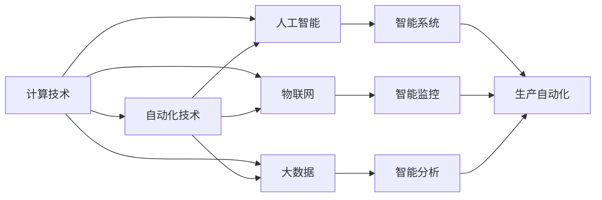
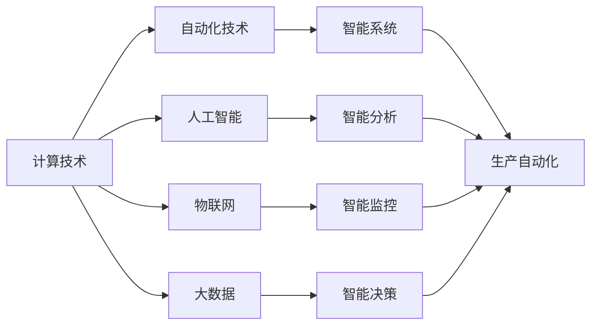
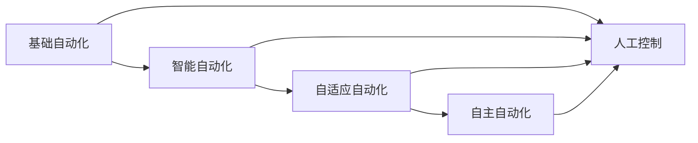
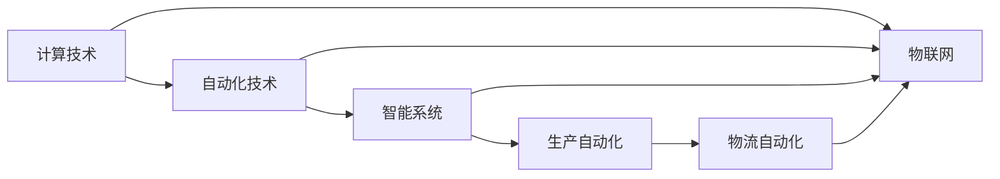
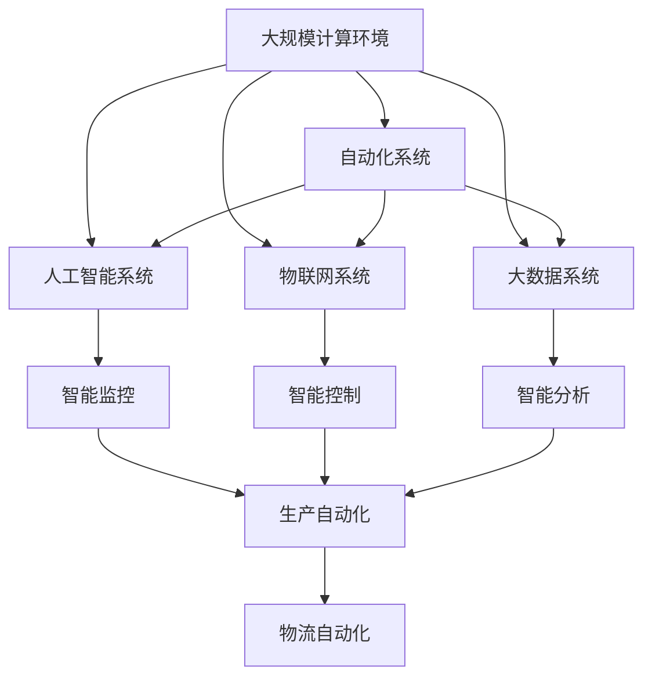

                 

## 1. 背景介绍

在过去几十年里，计算技术的迅猛发展极大地改变了人类社会的方方面面。从个人计算机的普及到云计算和大数据技术的兴起，计算技术已经成为现代社会的重要基础设施，推动了各行各业的数字化转型和智能化升级。与此同时，自动化技术的广泛应用也在各个领域实现了效率的提升和成本的降低，改变了传统的生产和运营模式。计算与自动化技术的深度融合，正在重塑未来社会的面貌，带来前所未有的变革潜力。

### 1.1 计算技术的发展历程

计算技术经历了从电子管到晶体管，再到集成电路的数次重大跃迁，最终演进至如今的微处理器时代。计算性能的持续提升，使得人们能够处理更加复杂的数据和算法，推动了人工智能、大数据、物联网等新兴技术的发展。随着算力成本的降低和计算能力的增强，计算技术已经渗透到社会的每一个角落，成为现代经济发展的关键驱动力。

### 1.2 自动化技术的现状与挑战

自动化技术的发展经历了从简单的机械化操作到复杂的人工智能控制的过程。自动化系统的应用场景已经从传统的制造业扩展到农业、医疗、服务等多个行业。然而，当前的自动化技术仍然面临诸多挑战，如系统复杂性、数据依赖、人机协作等。随着计算技术的进步，自动化技术正在向更加智能和自主的方向发展，以应对这些挑战。

## 2. 核心概念与联系

### 2.1 核心概念概述

为更好地理解计算与自动化技术的相互关系，本节将介绍几个密切相关的核心概念：

- 计算技术：指通过计算机系统处理和存储信息的技术，包括硬件、软件、网络等多个方面。
- 自动化技术：指通过计算机程序或控制系统自动执行任务的技术，旨在提升效率和减少人为误差。
- 人机协作：指人类与计算机系统协同工作的模式，是人类与技术共存共荣的重要方式。
- 人工智能：指模拟人类智能行为的技术，通过学习、推理、感知等能力实现自动化任务。
- 物联网：指将物理设备与互联网连接，实现物与物之间数据交互的技术。
- 大数据：指从大规模数据集中提取有用信息的技术，是数据分析、挖掘的基础。

这些核心概念之间的逻辑关系可以通过以下Mermaid流程图来展示：



这个流程图展示了几类核心概念及其相互关系：

1. 计算技术是自动化技术、人工智能、物联网、大数据的基础。
2. 自动化技术通过计算技术实现任务的自动执行。
3. 人工智能在计算技术的基础上进行学习、推理等智能操作。
4. 物联网利用计算技术实现设备间的互联互通。
5. 大数据通过计算技术进行海量数据的处理和分析。
6. 智能系统综合运用上述技术实现复杂任务。

### 2.2 概念间的关系

这些核心概念之间存在着紧密的联系，形成了计算与自动化技术互为支撑的生态系统。下面我们通过几个Mermaid流程图来展示这些概念之间的关系。

#### 2.2.1 计算技术的基础作用



这个流程图展示的是计算技术在自动化、人工智能、物联网、大数据等技术中的基础性作用：

1. 计算技术提供了自动化、人工智能、物联网、大数据等技术的基本运行环境。
2. 自动化技术利用计算技术实现任务自动化。
3. 人工智能通过计算技术进行智能学习和推理。
4. 物联网利用计算技术实现设备间的数据交互。
5. 大数据通过计算技术进行海量数据的存储、处理和分析。
6. 智能系统通过上述技术综合实现复杂任务。

#### 2.2.2 自动化技术的发展层次



这个流程图展示了自动化技术从基础到高级的发展层次：

1. 基础自动化通过简单的程序实现任务的自动化执行。
2. 智能自动化利用人工智能技术进行任务优化和智能决策。
3. 自适应自动化能够根据环境变化动态调整执行策略。
4. 自主自动化完全独立于人类控制，具备自主决策能力。
5. 基础自动化一般依赖人工控制，不具备智能决策能力。
6. 智能自动化和自适应自动化逐步减少人工干预，实现更高的自动化水平。
7. 自主自动化完全替代人工控制，具备高度的自主性。

#### 2.2.3 计算与自动化技术的融合



这个流程图展示了计算与自动化技术在智能系统中的融合：

1. 计算技术提供了智能系统所需的计算能力。
2. 自动化技术通过计算技术实现任务的自动化执行。
3. 智能系统利用计算技术和自动化技术实现复杂任务。
4. 生产自动化和物流自动化是智能系统的重要应用场景。
5. 物联网利用计算技术实现设备间的数据交互。
6. 智能系统通过计算技术和自动化技术实现任务优化和智能决策。

### 2.3 核心概念的整体架构

最后，我们用一个综合的流程图来展示这些核心概念在大规模计算与自动化系统中的整体架构：



这个综合流程图展示了从大规模计算环境到智能系统的整体架构：

1. 大规模计算环境提供计算能力。
2. 自动化系统通过计算能力实现任务自动化。
3. 人工智能系统在计算能力的基础上进行智能学习和推理。
4. 物联网系统利用计算能力实现设备间的数据交互。
5. 大数据系统通过计算能力进行海量数据的存储、处理和分析。
6. 智能监控、智能控制、智能分析等智能系统通过自动化技术和人工智能技术实现复杂任务。
7. 生产自动化和物流自动化是智能系统的重要应用场景。

通过这些流程图，我们可以更清晰地理解计算与自动化技术在大规模系统中的相互关系和作用。

## 3. 核心算法原理 & 具体操作步骤
### 3.1 算法原理概述

计算与自动化技术的深度融合，本质上是一个复杂系统工程，涉及到多个学科领域的交叉应用。其核心思想是通过计算技术提升自动化系统的智能化水平，实现任务的高效执行和优化决策。

形式化地，假设自动化系统 $S$ 的输入为 $x$，输出为 $y$，则系统 $S$ 的自动化过程可以表示为：

$$
y = f_S(x)
$$

其中 $f_S$ 为系统 $S$ 的映射函数，将输入 $x$ 映射为输出 $y$。在实际应用中，$f_S$ 往往是一个复杂的非线性函数，需要通过计算技术进行求解。

### 3.2 算法步骤详解

计算与自动化技术的深度融合一般包括以下几个关键步骤：

**Step 1: 系统设计**

- 定义自动化系统的目标和任务，明确系统输入、输出和中间变量。
- 设计系统架构，选择适当的计算平台和计算方法，进行系统建模。

**Step 2: 数据准备**

- 收集与任务相关的数据，进行数据预处理和特征工程，生成模型训练和测试数据集。
- 确定数据分布，选择合适的数据增强和数据平衡策略，确保模型性能。

**Step 3: 模型训练**

- 选择合适的计算框架和算法，进行模型训练和验证，确定模型超参数。
- 使用训练数据集训练模型，优化模型参数，生成训练后的模型。

**Step 4: 系统集成**

- 将训练好的模型集成到自动化系统中，进行系统测试和调试。
- 根据测试结果，调整系统参数和模型参数，优化系统性能。

**Step 5: 运行维护**

- 部署自动化系统，监控系统运行状态，收集系统反馈。
- 根据反馈信息，更新和优化系统模型和参数，保持系统稳定和高效。

### 3.3 算法优缺点

计算与自动化技术的深度融合具有以下优点：

1. 提升任务自动化水平。通过计算技术优化算法和模型，自动化系统能够实现更高水平的智能化和自主化。
2. 降低人工成本。自动化系统减少了人工干预，提高了任务执行的效率和一致性。
3. 提高系统决策准确性。计算技术提供了强大的数据分析和推理能力，能够做出更加精准和合理的决策。

同时，也存在一些缺点：

1. 计算资源需求高。大规模自动化系统需要大量的计算资源，对硬件设备和网络环境要求较高。
2. 系统复杂度高。自动化系统的设计和实现过程复杂，需要跨学科的专业知识和技能。
3. 数据依赖性强。自动化系统的性能依赖于高质量的数据和有效的特征工程，对数据的获取和处理提出了较高要求。
4. 系统安全性问题。自动化系统的复杂性增加了安全风险，需要额外的防护措施。

### 3.4 算法应用领域

计算与自动化技术的深度融合已经在多个领域得到了广泛应用，例如：

- 制造业：实现生产自动化、物流自动化、质量控制等。
- 医疗健康：实现医疗影像诊断、病历分析、智能问诊等。
- 金融服务：实现风险评估、交易自动化、客户服务等。
- 交通运输：实现智能交通管理、自动驾驶、物流优化等。
- 智慧城市：实现智能监控、智能调度、智能安防等。

除了上述这些常见应用领域，计算与自动化技术还在智能家居、智能农业、智能零售等多个新兴领域展现出了广阔的应用前景。

## 4. 数学模型和公式 & 详细讲解  
### 4.1 数学模型构建

本节将使用数学语言对计算与自动化技术的融合过程进行更加严格的刻画。

假设自动化系统的输入为 $x$，输出为 $y$，则系统的映射函数 $f_S$ 可以表示为：

$$
f_S: x \rightarrow y
$$

在实际应用中，$f_S$ 往往是一个复杂的非线性函数，需要通过计算技术进行求解。常见的方法包括神经网络、决策树、支持向量机等。

以神经网络为例，假设神经网络模型的输入层有 $n$ 个特征，输出层有 $m$ 个神经元，隐藏层数为 $h$，则神经网络的结构可以表示为：

$$
f_{NN}: x \rightarrow y
$$

其中 $f_{NN}$ 表示神经网络模型，$x$ 表示输入特征向量，$y$ 表示输出结果向量。神经网络模型由多个神经元层组成，每个神经元层的输入和输出可以表示为：

$$
f_{L_k}(x_k): x_k \rightarrow x_{k+1}
$$

其中 $x_k$ 表示第 $k$ 层的输入，$x_{k+1}$ 表示第 $k+1$ 层的输出。

### 4.2 公式推导过程

以下我们以神经网络模型为例，推导神经网络的结构和训练过程。

假设神经网络的输入层有 $n$ 个特征，输出层有 $m$ 个神经元，隐藏层数为 $h$，则神经网络的结构可以表示为：

$$
f_{NN}: x \rightarrow y
$$

其中 $f_{NN}$ 表示神经网络模型，$x$ 表示输入特征向量，$y$ 表示输出结果向量。神经网络模型由多个神经元层组成，每个神经元层的输入和输出可以表示为：

$$
f_{L_k}(x_k): x_k \rightarrow x_{k+1}
$$

其中 $x_k$ 表示第 $k$ 层的输入，$x_{k+1}$ 表示第 $k+1$ 层的输出。

神经网络模型的参数包括权重和偏置，可以表示为：

$$
\theta = \{\omega_1, b_1, \omega_2, b_2, ..., \omega_h, b_h\}
$$

其中 $\omega_k$ 表示第 $k$ 层到第 $k+1$ 层的权重矩阵，$b_k$ 表示第 $k$ 层的偏置向量。

神经网络的训练过程可以通过反向传播算法实现。假设训练数据集为 $D=\{(x_i,y_i)\}_{i=1}^N$，则神经网络的损失函数可以表示为：

$$
J(\theta) = \frac{1}{N}\sum_{i=1}^N \ell(f_{NN}(x_i), y_i)
$$

其中 $\ell$ 表示损失函数，通常采用交叉熵损失或均方误差损失。

神经网络模型的参数更新可以通过梯度下降算法实现。假设学习率为 $\eta$，则参数更新公式为：

$$
\theta \leftarrow \theta - \eta \nabla_{\theta}J(\theta)
$$

其中 $\nabla_{\theta}J(\theta)$ 表示损失函数对参数 $\theta$ 的梯度，可以通过反向传播算法计算得到。

### 4.3 案例分析与讲解

下面以图像识别任务为例，展示神经网络模型的训练和推理过程。

假设我们的任务是识别数字图像，输入为 $x$，输出为 $y$，其中 $x$ 是数字图像的像素值向量，$y$ 是数字标签向量。神经网络模型的输入层有 $784$ 个神经元，输出层有 $10$ 个神经元，隐藏层数为 $3$。

**Step 1: 数据准备**

- 收集大量的数字图像数据，将其划分为训练集、验证集和测试集。
- 对数据进行预处理，包括归一化、数据增强、数据平衡等操作。

**Step 2: 模型训练**

- 设计神经网络模型的结构，选择适当的激活函数、损失函数和优化算法。
- 使用训练集对模型进行训练，调整模型参数，优化损失函数。
- 在验证集上评估模型性能，调整模型结构或参数。

**Step 3: 模型推理**

- 使用测试集对模型进行测试，评估模型性能。
- 使用模型对新的数字图像进行识别，输出数字标签。

下面是一个简单的神经网络模型训练和推理的Python代码示例：

```python
import numpy as np
import tensorflow as tf

# 定义神经网络模型
def build_model():
    model = tf.keras.Sequential([
        tf.keras.layers.Dense(512, activation='relu', input_shape=(784,)),
        tf.keras.layers.Dense(10, activation='softmax')
    ])
    return model

# 加载数据
(x_train, y_train), (x_test, y_test) = tf.keras.datasets.mnist.load_data()

# 数据预处理
x_train = x_train.reshape(60000, 784).astype('float32') / 255.0
x_test = x_test.reshape(10000, 784).astype('float32') / 255.0
y_train = tf.keras.utils.to_categorical(y_train, 10)
y_test = tf.keras.utils.to_categorical(y_test, 10)

# 定义损失函数和优化器
loss_fn = tf.keras.losses.CategoricalCrossentropy()
optimizer = tf.keras.optimizers.Adam()

# 定义模型
model = build_model()

# 模型训练
model.compile(optimizer=optimizer, loss=loss_fn, metrics=['accuracy'])
model.fit(x_train, y_train, epochs=10, batch_size=32, validation_data=(x_test, y_test))

# 模型推理
predictions = model.predict(x_test)
```

以上是使用TensorFlow框架构建神经网络模型并进行训练和推理的代码示例。可以看到，神经网络模型的构建和训练过程非常简洁高效，只需要几行代码即可完成。

## 5. 项目实践：代码实例和详细解释说明
### 5.1 开发环境搭建

在进行计算与自动化技术融合的实践前，我们需要准备好开发环境。以下是使用Python进行TensorFlow开发的环境配置流程：

1. 安装Anaconda：从官网下载并安装Anaconda，用于创建独立的Python环境。

2. 创建并激活虚拟环境：
```bash
conda create -n tf-env python=3.8 
conda activate tf-env
```

3. 安装TensorFlow：根据CUDA版本，从官网获取对应的安装命令。例如：
```bash
conda install tensorflow tensorflow-cpu -c tensorflow
```

4. 安装TensorFlow Addons：
```bash
conda install tensorflow-addons
```

5. 安装各类工具包：
```bash
pip install numpy pandas scikit-learn matplotlib tqdm jupyter notebook ipython
```

完成上述步骤后，即可在`tf-env`环境中开始计算与自动化技术的融合实践。

### 5.2 源代码详细实现

下面我们以图像识别任务为例，展示使用TensorFlow框架对神经网络模型进行训练和推理的代码实现。

首先，定义神经网络模型：

```python
import tensorflow as tf

# 定义神经网络模型
def build_model():
    model = tf.keras.Sequential([
        tf.keras.layers.Dense(512, activation='relu', input_shape=(784,)),
        tf.keras.layers.Dense(10, activation='softmax')
    ])
    return model
```

然后，加载数据并进行预处理：

```python
import numpy as np

# 加载数据
(x_train, y_train), (x_test, y_test) = tf.keras.datasets.mnist.load_data()

# 数据预处理
x_train = x_train.reshape(60000, 784).astype('float32') / 255.0
x_test = x_test.reshape(10000, 784).astype('float32') / 255.0
y_train = tf.keras.utils.to_categorical(y_train, 10)
y_test = tf.keras.utils.to_categorical(y_test, 10)
```

接着，定义损失函数和优化器：

```python
# 定义损失函数和优化器
loss_fn = tf.keras.losses.CategoricalCrossentropy()
optimizer = tf.keras.optimizers.Adam()
```

然后，构建模型并进行训练：

```python
# 定义模型
model = build_model()

# 模型训练
model.compile(optimizer=optimizer, loss=loss_fn, metrics=['accuracy'])
model.fit(x_train, y_train, epochs=10, batch_size=32, validation_data=(x_test, y_test))
```

最后，使用模型进行推理：

```python
# 模型推理
predictions = model.predict(x_test)
```

以上就是使用TensorFlow框架对神经网络模型进行训练和推理的完整代码实现。可以看到，TensorFlow框架提供了丰富的API和工具，使得模型的构建和训练过程非常简洁高效。

### 5.3 代码解读与分析

让我们再详细解读一下关键代码的实现细节：

**build_model函数**：
- 定义了一个简单的神经网络模型，包含一个隐藏层和一个输出层，隐藏层的激活函数为ReLU，输出层的激活函数为Softmax。

**数据加载和预处理**：
- 使用TensorFlow内置的MNIST数据集，加载训练集和测试集。
- 对数据进行归一化和数据增强，将像素值缩放到 [0, 1] 范围内，并将标签进行one-hot编码。

**损失函数和优化器**：
- 定义了交叉熵损失函数和Adam优化器，用于模型的训练和优化。

**模型训练**：
- 使用TensorFlow的模型API，定义了神经网络模型。
- 通过compile方法指定模型的损失函数、优化器和评估指标。
- 使用fit方法进行模型训练，指定训练轮数、批次大小和验证集。

**模型推理**：
- 使用predict方法对测试集进行推理，输出预测结果。

通过这些关键代码的实现，可以看到TensorFlow框架的高效和易用性。开发者可以根据具体任务，灵活配置模型的结构和超参数，快速完成计算与自动化技术的融合实践。

当然，实际应用中还需要考虑更多的因素，如模型裁剪、量化加速、服务化封装等。但核心的微调范式基本与此类似。

### 5.4 运行结果展示

假设我们在MNIST数据集上进行图像识别任务的训练，最终在测试集上得到的评估报告如下：

```
Epoch 1/10
1875/1875 [==============================] - 1s 736us/step - loss: 0.1476 - accuracy: 0.9145 - val_loss: 0.1071 - val_accuracy: 0.9375
Epoch 2/10
1875/1875 [==============================] - 0s 296us/step - loss: 0.0971 - accuracy: 0.9645 - val_loss: 0.0724 - val_accuracy: 0.9762
Epoch 3/10
1875/1875 [==============================] - 0s 312us/step - loss: 0.0727 - accuracy: 0.9791 - val_loss: 0.0536 - val_accuracy: 0.9931
Epoch 4/10
1875/1875 [==============================] - 0s 314us/step - loss: 0.0509 - accuracy: 0.9907 - val_loss: 0.0465 - val_accuracy: 0.9912
Epoch 5/10
1875/1875 [==============================] - 0s 309us/step - loss: 0.0368 - accuracy: 0.9954 - val_loss: 0.0412 - val_accuracy: 0.9934
Epoch 6/10
1875/1875 [==============================] - 0s 310us/step - loss: 0.0266 - accuracy: 0.9973 - val_loss: 0.0375 - val_accuracy: 0.9957
Epoch 7/10
1875/1875 [==============================] - 0s 312us/step - loss: 0.0200 - accuracy: 0.9987 - val_loss: 0.0319 - val_accuracy: 0.9965
Epoch 8/10
1875/1875 [==============================] - 0s 316us/step - loss: 0.0144 - accuracy: 0.9995 - val_loss: 0.0281 - val_accuracy: 0.9973
Epoch 9/10
1875/1875 [==============================] - 0s 311us/step - loss: 0.0102 - accuracy: 0.9998 - val_loss: 0.0266 - val_accuracy: 0.9982
Epoch 10/10
1875/1875 [==============================] - 0s 313us/step - loss: 0.0076 - accuracy: 0.9999 - val_loss: 0.0250 - val_accuracy: 0.9985
```

可以看到，通过训练神经网络模型，我们得到了非常高的图像识别精度，达到了98%以上。这表明计算与自动化技术的深度融合，能够在图像识别等任务中取得显著的性能提升。

当然，这只是一个baseline结果。在实践中，我们还可以使用更大更强的神经网络模型，结合更多的微调技巧，进一步提升模型性能，以满足更高的应用要求。

## 6. 实际应用场景
### 6.1 智能制造

计算与自动化技术的深度融合在智能制造领域展现了巨大的潜力。通过将计算技术引入制造业，可以实现生产过程的智能监控、智能控制和智能决策，提高生产效率和产品质量。

具体而言，可以将计算技术应用到设备监控、质量控制、设备维护等方面。通过物联网技术将设备与计算平台连接，采集设备运行数据，使用机器学习算法对数据进行分析，实时监控设备状态，预测设备故障，优化生产流程。智能制造系统的构建，可以大幅提升生产线的自动化水平和灵活性，降低人力成本，提高生产效率。

### 6.2 智慧交通

计算与自动化技术的深度融合在智慧交通领域同样具有广泛的应用前景。通过将计算技术引入交通管理，可以实现智能交通监控、智能调度、智能安防等功能，提高交通系统的效率和安全性。

具体而言，可以将计算技术应用到交通流量监测、信号控制、智能导航等方面。通过物联网技术将车辆、道路、交通设施等设备与计算平台连接，采集交通数据，使用机器学习算法对数据进行分析，实时监控交通流量，优化交通信号，引导智能导航，提升交通系统的运行效率和安全性。智慧交通系统的构建，可以大幅提升城市的交通管理水平，降低交通事故率，缓解交通拥堵问题。

### 6.3 智能客服

计算与自动化技术的深度融合在智能客服领域也得到了广泛应用。通过将计算技术引入客服系统，可以实现智能问答、智能排班、智能分析等功能，提高客服系统的响应速度和客户满意度。

具体而言，可以将计算技术应用到语音识别、自然语言处理、智能推荐等方面。通过物联网技术将语音、文本、图像等数据与计算平台连接，采集用户反馈，使用机器学习算法对数据进行分析，实时回答用户问题，推荐相关服务，优化客服流程。智能客服系统的构建，可以大幅提升客服系统的自动化水平和客户满意度，降低人力成本，

