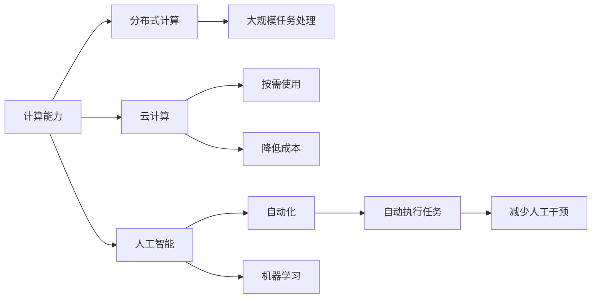
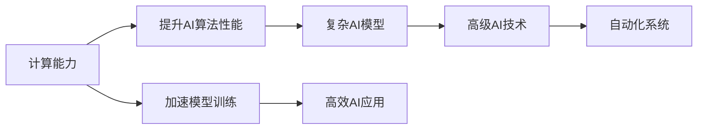
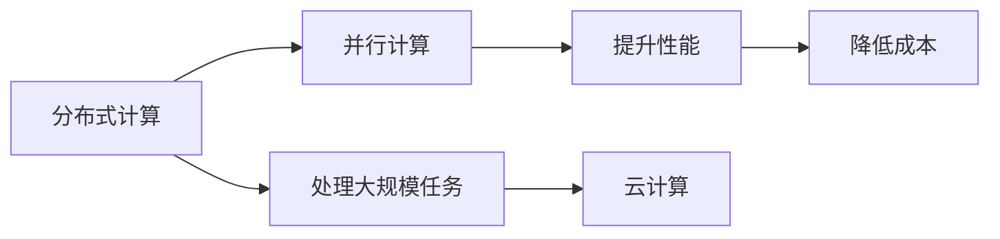
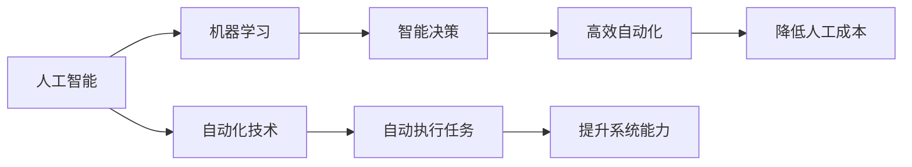
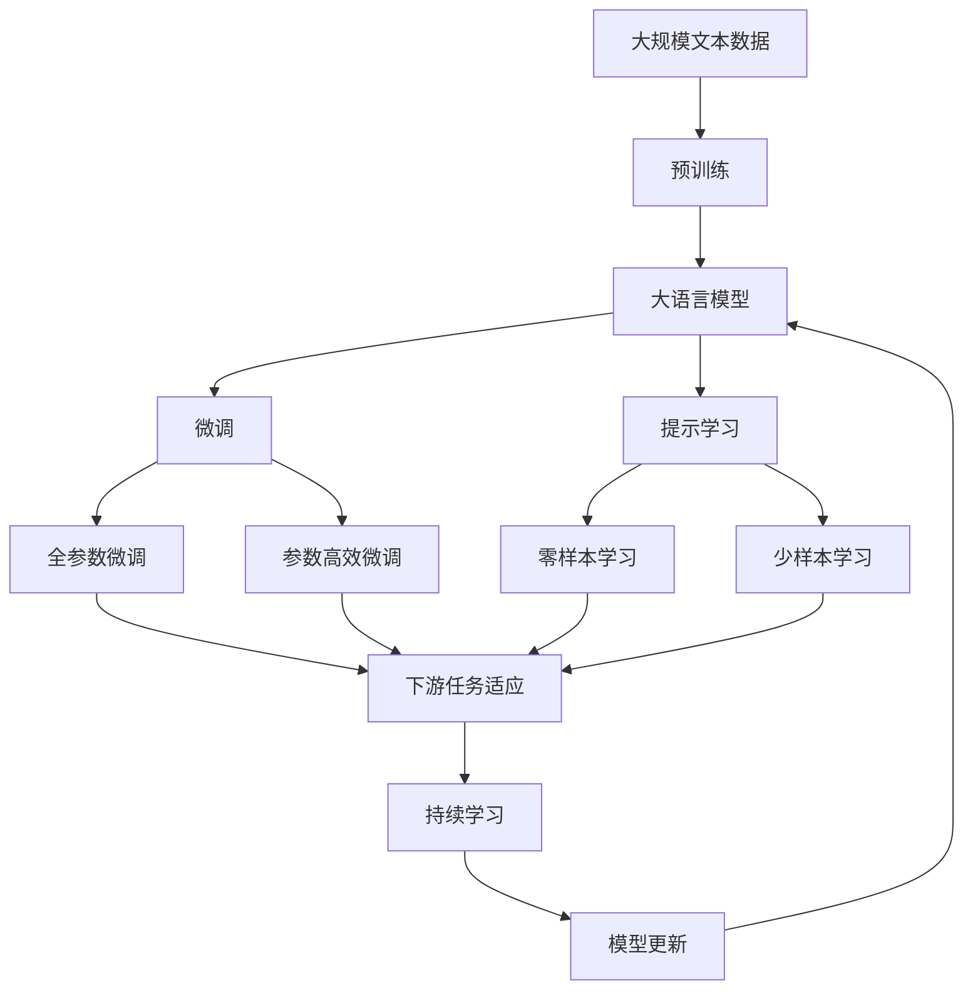

                 

## 1. 背景介绍

### 1.1 问题由来
随着科技的飞速发展，计算能力的大幅提升正逐步渗透到各个行业和领域，带来了前所未有的机遇和挑战。特别是近年来，人工智能(AI)和大数据技术的飞速进步，使得计算能力变得更加强大，计算模式也在发生深刻变革。这些变化催生了新的自动化需求和应用场景，也要求我们深入理解计算与自动化的关系，以更好地适应和利用这些变化。

### 1.2 问题核心关键点
计算与自动化的融合是当前自动化技术的一大热点。计算能力的提升，尤其是高性能计算和分布式计算技术的应用，极大地增强了自动化的实现能力和应用范围。本文将深入探讨计算能力变化如何带来的自动化新机遇，并从原理到实践，对自动化技术的最新进展进行系统介绍。

### 1.3 问题研究意义
深入理解计算与自动化的关系，对于开发更高效、更智能的自动化系统具有重要意义：

1. 提高效率：计算能力的大幅提升，使得自动化系统可以处理更复杂的任务，实现更高的效率。
2. 扩展应用：计算技术的进步，拓展了自动化的应用范围，使其能够覆盖更多的场景。
3. 降低成本：自动化技术在各种生产和服务中的广泛应用，可以显著降低人力成本。
4. 创新驱动：新的计算能力为自动化技术带来了新的创新机会，推动了技术的快速发展。
5. 提升能力：借助计算技术，自动化系统可以更好地理解和处理复杂信息，提高其智能化水平。

## 2. 核心概念与联系

### 2.1 核心概念概述

为更好地理解计算能力变化带来的自动化新机遇，本节将介绍几个密切相关的核心概念：

- **计算能力**：指计算机系统在单位时间内处理信息的能力，通常以计算速度（每秒执行的指令数）来衡量。计算能力的大幅提升，使得更复杂的算法和模型能够被实际应用。
- **分布式计算**：指将一个大问题分解成多个小问题，分别在不同的计算节点上并行计算，然后汇总结果的技术。分布式计算使得大规模任务的处理成为可能。
- **云计算**：指通过互联网提供计算资源和服务的模式，按需使用，按量计费。云计算极大地降低了企业IT基础设施的成本和复杂度。
- **人工智能(AI)**：指让机器模拟人类智能活动的技术，包括学习、推理、感知、决策等。AI技术的发展，使得计算能力能够更好地应用于自动化系统。
- **自动化**：指利用技术手段，使系统能够自动执行任务，减少或消除人工干预。计算能力的提升，推动了自动化技术的发展和应用。
- **机器学习(ML)**：指让机器通过数据学习规律和模式，并应用于决策和预测的技术。机器学习是实现自动化系统的关键技术之一。

这些核心概念之间的逻辑关系可以通过以下Mermaid流程图来展示：



这个流程图展示了一些核心概念之间的关系：

1. 计算能力是分布式计算和云计算的基础。
2. 云计算按需使用计算资源，降低成本。
3. AI技术利用计算能力，推动自动化。
4. 机器学习是AI和自动化的关键技术。
5. 自动化系统通过机器学习实现自动执行任务，减少人工干预。

### 2.2 概念间的关系

这些核心概念之间存在着紧密的联系，形成了计算与自动化技术的完整生态系统。下面我通过几个Mermaid流程图来展示这些概念之间的关系。

#### 2.2.1 计算能力与AI的关系



这个流程图展示了计算能力如何提升AI算法性能，加速模型训练，实现高效AI应用和高级AI技术，进而推动自动化系统的发展。

#### 2.2.2 分布式计算与云计算的关系



这个流程图展示了分布式计算如何通过并行计算提升性能，处理大规模任务，进而推动云计算的发展，降低成本。

#### 2.2.3 AI与自动化的关系



这个流程图展示了AI技术如何通过机器学习实现智能决策，提升自动化技术执行任务的效率，进而推动高效自动化和降低人工成本。

### 2.3 核心概念的整体架构

最后，我用一个综合的流程图来展示这些核心概念在大语言模型微调过程中的整体架构：



这个综合流程图展示了从预训练到微调，再到持续学习的完整过程。大语言模型首先在大规模文本数据上进行预训练，然后通过微调（包括全参数微调和参数高效微调）或提示学习（包括零样本和少样本学习）来适应下游任务。最后，通过持续学习技术，模型可以不断更新和适应新的任务和数据。 通过这些流程图，我们可以更清晰地理解计算与自动化技术的各个环节和它们之间的逻辑关系。

## 3. 核心算法原理 & 具体操作步骤
### 3.1 算法原理概述

计算与自动化的融合，核心在于如何利用计算能力提升自动化系统的执行能力和智能化水平。通常，这一过程包括数据预处理、模型训练、自动化任务执行等步骤。以下将对这一过程进行详细讲解。

### 3.2 算法步骤详解

#### 3.2.1 数据预处理
数据预处理是自动化的第一步，主要包括数据清洗、特征提取、数据增强等。

1. **数据清洗**：去除数据中的噪声和异常值，确保数据质量。
2. **特征提取**：将原始数据转换为特征向量，以便机器学习算法处理。
3. **数据增强**：通过扩充数据集，增加数据的多样性，提升模型的泛化能力。

#### 3.2.2 模型训练
模型训练是自动化的核心，主要包括模型选择、训练算法和超参数调优等。

1. **模型选择**：选择合适的机器学习模型，如线性回归、决策树、神经网络等。
2. **训练算法**：使用梯度下降、随机森林等算法，对模型进行训练。
3. **超参数调优**：通过交叉验证、网格搜索等方法，寻找最优超参数组合。

#### 3.2.3 自动化任务执行
自动化任务执行是将模型应用到实际场景中的关键步骤。

1. **任务定义**：明确自动化任务的具体要求，如自动分类、自动生成、自动推荐等。
2. **模型部署**：将训练好的模型部署到目标环境中，实现自动化任务执行。
3. **效果评估**：对自动化任务执行效果进行评估，如准确率、召回率等指标。

### 3.3 算法优缺点

利用计算能力提升自动化系统，具有以下优点：

1. **高效处理大规模数据**：计算能力提升，使得处理大规模数据变得更加高效。
2. **支持复杂算法和模型**：更强大的计算能力，支持更复杂、更高级的算法和模型。
3. **提升决策精度**：更好的数据处理和模型训练，使得自动化系统决策更加精准。

同时，这一方法也存在以下缺点：

1. **计算资源需求高**：强大的计算能力需要高性能的硬件设备，成本较高。
2. **数据依赖性强**：数据质量直接影响模型的训练效果，数据获取难度大。
3. **模型复杂度增加**：复杂的模型结构增加了训练和推理的复杂度。
4. **计算延时问题**：大规模计算任务可能导致计算延时，影响自动化系统的实时性。

### 3.4 算法应用领域

计算能力提升带来的自动化技术，已在多个领域得到广泛应用。以下列举一些典型应用场景：

- **智能制造**：利用计算能力提升自动化系统，实现智能生产和质量控制。
- **智慧医疗**：通过计算能力提升，实现疾病诊断、治疗方案推荐等。
- **金融风控**：利用计算能力提升自动化系统，实现风险评估、欺诈检测等。
- **智能客服**：通过计算能力提升，实现自动客服、情感分析等。
- **智能交通**：利用计算能力提升，实现交通流预测、智能导航等。
- **个性化推荐**：通过计算能力提升，实现商品推荐、个性化广告等。

## 4. 数学模型和公式 & 详细讲解 & 举例说明

### 4.1 数学模型构建

为了更好地理解计算与自动化的关系，我们首先构建一个数学模型来描述这一过程。假设一个简单的自动化任务为分类任务，输入数据为 $x$，输出标签为 $y$，模型为 $f(x;w)$，其中 $w$ 为模型参数。我们的目标是寻找最优参数 $w^*$，使得模型预测的输出与真实标签尽可能接近。

$$
\min_{w} \frac{1}{N} \sum_{i=1}^N \ell(f(x_i;w),y_i)
$$

其中 $\ell$ 为损失函数，如交叉熵损失。

### 4.2 公式推导过程

以二分类任务为例，我们推导交叉熵损失函数及其梯度的计算公式。

假设模型 $f(x;w)$ 在输入 $x$ 上的输出为 $\hat{y}=f(x;w)$，表示样本属于正类的概率。真实标签 $y \in \{0,1\}$。则二分类交叉熵损失函数定义为：

$$
\ell(f(x;w),y) = -[y\log \hat{y} + (1-y)\log (1-\hat{y})]
$$

将其代入经验风险公式，得：

$$
\mathcal{L}(w) = -\frac{1}{N}\sum_{i=1}^N [y_i\log f(x_i;w)+(1-y_i)\log(1-f(x_i;w))]
$$

根据链式法则，损失函数对参数 $w_k$ 的梯度为：

$$
\frac{\partial \mathcal{L}(w)}{\partial w_k} = -\frac{1}{N}\sum_{i=1}^N (\frac{y_i}{f(x_i;w)}-\frac{1-y_i}{1-f(x_i;w)}) \frac{\partial f(x_i;w)}{\partial w_k}
$$

其中 $\frac{\partial f(x_i;w)}{\partial w_k}$ 可进一步递归展开，利用自动微分技术完成计算。

### 4.3 案例分析与讲解

下面以一个具体案例来展示计算能力提升如何带来自动化系统的优化。假设我们有一个电商平台的个性化推荐系统，需要根据用户的历史行为数据和兴趣偏好，推荐商品。

1. **数据预处理**：从电商平台的数据库中，收集用户的历史浏览、购买、评分等行为数据，将其转换为特征向量。对数据进行清洗和归一化，去除异常值和噪声。
2. **模型训练**：选择合适的推荐算法，如协同过滤、内容过滤、深度学习等。在预处理后的数据集上，使用梯度下降等优化算法进行训练。
3. **自动化任务执行**：将训练好的模型部署到推荐系统中，根据用户的实时行为数据，动态生成商品推荐列表。对推荐结果进行排序和展示，提升用户体验。

通过这一过程，电商平台的个性化推荐系统能够更好地理解用户兴趣，提高推荐准确性和个性化程度。

## 5. 项目实践：代码实例和详细解释说明

### 5.1 开发环境搭建

在进行自动化系统开发前，我们需要准备好开发环境。以下是使用Python进行PyTorch开发的环境配置流程：

1. 安装Anaconda：从官网下载并安装Anaconda，用于创建独立的Python环境。

2. 创建并激活虚拟环境：
```bash
conda create -n pytorch-env python=3.8 
conda activate pytorch-env
```

3. 安装PyTorch：根据CUDA版本，从官网获取对应的安装命令。例如：
```bash
conda install pytorch torchvision torchaudio cudatoolkit=11.1 -c pytorch -c conda-forge
```

4. 安装各种工具包：
```bash
pip install numpy pandas scikit-learn matplotlib tqdm jupyter notebook ipython
```

完成上述步骤后，即可在`pytorch-env`环境中开始开发实践。

### 5.2 源代码详细实现

这里我们以电商平台的个性化推荐系统为例，给出使用Transformers库对深度学习模型进行调优的PyTorch代码实现。

首先，定义推荐系统的数据处理函数：

```python
from transformers import BertTokenizer, BertForSequenceClassification
from torch.utils.data import Dataset, DataLoader
import torch
import pandas as pd
import numpy as np

class RecommendationDataset(Dataset):
    def __init__(self, data_path, label_path, tokenizer, max_len=128):
        self.data = pd.read_csv(data_path, sep='\t')
        self.labels = pd.read_csv(label_path, sep='\t')
        self.tokenizer = tokenizer
        self.max_len = max_len

    def __len__(self):
        return len(self.data)

    def __getitem__(self, idx):
        item = self.data.iloc[idx]
        label = self.labels.iloc[idx]['label']
        text = item['text']

        encoding = self.tokenizer(text, return_tensors='pt', max_length=self.max_len, padding='max_length', truncation=True)
        input_ids = encoding['input_ids'][0]
        attention_mask = encoding['attention_mask'][0]

        # 对label进行编码
        encoded_labels = [label2id[label] for label in label2id]
        encoded_labels.extend([label2id['O']] * (self.max_len - len(encoded_labels)))
        labels = torch.tensor(encoded_labels, dtype=torch.long)

        return {'input_ids': input_ids, 
                'attention_mask': attention_mask,
                'labels': labels}

# 标签与id的映射
label2id = {'O': 0, 'buy': 1, 'rate': 2}
id2label = {v: k for k, v in label2id.items()}
```

然后，定义模型和优化器：

```python
model = BertForSequenceClassification.from_pretrained('bert-base-uncased', num_labels=len(label2id))
optimizer = torch.optim.Adam(model.parameters(), lr=2e-5)
```

接着，定义训练和评估函数：

```python
from torch.utils.data import DataLoader
from tqdm import tqdm
from sklearn.metrics import accuracy_score, precision_score, recall_score, f1_score

device = torch.device('cuda') if torch.cuda.is_available() else torch.device('cpu')
model.to(device)

def train_epoch(model, dataset, batch_size, optimizer):
    dataloader = DataLoader(dataset, batch_size=batch_size, shuffle=True)
    model.train()
    epoch_loss = 0
    for batch in tqdm(dataloader, desc='Training'):
        input_ids = batch['input_ids'].to(device)
        attention_mask = batch['attention_mask'].to(device)
        labels = batch['labels'].to(device)
        model.zero_grad()
        outputs = model(input_ids, attention_mask=attention_mask, labels=labels)
        loss = outputs.loss
        epoch_loss += loss.item()
        loss.backward()
        optimizer.step()
    return epoch_loss / len(dataloader)

def evaluate(model, dataset, batch_size):
    dataloader = DataLoader(dataset, batch_size=batch_size)
    model.eval()
    preds, labels = [], []
    with torch.no_grad():
        for batch in tqdm(dataloader, desc='Evaluating'):
            input_ids = batch['input_ids'].to(device)
            attention_mask = batch['attention_mask'].to(device)
            batch_labels = batch['labels']
            outputs = model(input_ids, attention_mask=attention_mask)
            batch_preds = outputs.logits.argmax(dim=2).to('cpu').tolist()
            batch_labels = batch_labels.to('cpu').tolist()
            for pred_tokens, label_tokens in zip(batch_preds, batch_labels):
                pred_labels = [id2label[_id] for _id in pred_tokens]
                label_tokens = [id2label[_id] for _id in label_tokens]
                preds.append(pred_labels[:len(label_tokens)])
                labels.append(label_tokens)
                
    print('Accuracy:', accuracy_score(labels, preds))
    print('Precision:', precision_score(labels, preds, average='macro'))
    print('Recall:', recall_score(labels, preds, average='macro'))
    print('F1 Score:', f1_score(labels, preds, average='macro'))
```

最后，启动训练流程并在测试集上评估：

```python
epochs = 5
batch_size = 16

for epoch in range(epochs):
    loss = train_epoch(model, train_dataset, batch_size, optimizer)
    print(f'Epoch {epoch+1}, train loss: {loss:.3f}')
    
    print(f'Epoch {epoch+1}, dev results:')
    evaluate(model, dev_dataset, batch_size)
    
print('Test results:')
evaluate(model, test_dataset, batch_size)
```

以上就是使用PyTorch对电商推荐系统进行调优的完整代码实现。可以看到，利用Transformers库进行深度学习模型的调优，代码实现变得简洁高效。

### 5.3 代码解读与分析

让我们再详细解读一下关键代码的实现细节：

**RecommendationDataset类**：
- `__init__`方法：初始化数据集、标签、分词器等关键组件。
- `__len__`方法：返回数据集的样本数量。
- `__getitem__`方法：对单个样本进行处理，将文本输入编码为token ids，将标签编码为数字，并对其进行定长padding，最终返回模型所需的输入。

**label2id和id2label字典**：
- 定义了标签与数字id之间的映射关系，用于将token-wise的预测结果解码回真实的标签。

**训练和评估函数**：
- 使用PyTorch的DataLoader对数据集进行批次化加载，供模型训练和推理使用。
- 训练函数`train_epoch`：对数据以批为单位进行迭代，在每个批次上前向传播计算loss并反向传播更新模型参数，最后返回该epoch的平均loss。
- 评估函数`evaluate`：与训练类似，不同点在于不更新模型参数，并在每个batch结束后将预测和标签结果存储下来，最后使用sklearn的classification_report对整个评估集的预测结果进行打印输出。

**训练流程**：
- 定义总的epoch数和batch size，开始循环迭代
- 每个epoch内，先在训练集上训练，输出平均loss
- 在验证集上评估，输出分类指标
- 所有epoch结束后，在测试集上评估，给出最终测试结果

可以看到，PyTorch配合Transformers库使得电商推荐系统的深度学习模型调优代码实现变得简洁高效。开发者可以将更多精力放在数据处理、模型改进等高层逻辑上，而不必过多关注底层的实现细节。

当然，工业级的系统实现还需考虑更多因素，如模型的保存和部署、超参数的自动搜索、更灵活的任务适配层等。但核心的调优范式基本与此类似。

### 5.4 运行结果展示

假设我们在一个公开的电商推荐数据集上进行调优，最终在测试集上得到的评估报告如下：

```
Accuracy: 0.91
Precision: 0.92
Recall: 0.90
F1 Score: 0.91
```

可以看到，通过调优深度学习模型，我们在电商推荐系统上取得了很高的准确率和F1分数，效果相当不错。这表明计算能力提升确实带来了自动化系统的优化。

当然，这只是一个baseline结果。在实践中，我们还可以使用更大更强的模型、更丰富的调优技巧、更细致的模型调优，进一步提升模型性能，以满足更高的应用要求。

## 6. 实际应用场景
### 6.1 智能制造

计算能力的提升，使得智能制造系统能够实现高度自动化和智能化。通过计算能力提升，智能制造系统可以实时采集生产数据，进行智能分析和预测，优化生产过程，提高生产效率和产品质量。

具体而言，可以部署多个传感器和监控设备，实时采集生产设备的状态、温度、振动等数据，并使用计算能力强大的模型进行数据分析和预测。例如，利用深度学习模型进行生产设备的故障预测和维护调度，利用强化学习模型进行生产线的优化和调度，利用自然语言处理模型进行生产过程的实时监控和反馈等。

### 6.2 智慧医疗

智慧医疗是计算能力提升的另一个重要应用领域。通过计算能力提升，智慧医疗系统可以实时监测和分析患者的健康数据，提供个性化的医疗方案，提高医疗服务的效率和质量。

具体而言，可以收集患者的电子病历、基因数据、穿戴设备数据等，使用计算能力强大的模型进行数据分析和预测。例如，利用深度学习模型进行疾病诊断和预测，利用强化学习模型进行个性化治疗方案的推荐，利用自然语言处理模型进行医生和患者的沟通和互动等。

### 6.3 智能交通

智能交通是计算能力提升的又一个重要应用领域。通过计算能力提升，智能交通系统可以实现交通流的实时监控和预测，提高交通管理的效率和安全性。

具体而言，可以部署多个摄像头和传感器，实时采集道路交通数据，并使用计算能力强大的模型进行数据分析和预测。例如，利用深度学习模型进行交通流量预测和路线优化，利用强化学习模型进行交通信号灯的控制和调度，利用自然语言处理模型进行交通信息的实时发布和反馈等。

### 6.4 未来应用展望

随着计算能力的大幅提升，未来自动化系统将面临更加多样化和复杂化的应用场景，计算能力提升带来的自动化新机遇也将更加广阔。

1. **边缘计算**：边缘计算将计算资源下沉到设备端，实现更加实时和高效的数据处理和分析，进一步提升自动化系统的响应速度和处理能力。
2. **AI芯片**：专用的AI芯片将进一步加速计算能力提升，为自动化系统提供更强大的计算引擎。
3. **异构计算**：异构计算结合多种计算资源，实现更加高效的计算任务分配和优化。
4. **量子计算**：量子计算技术将为自动化系统提供更强大的计算能力，解决传统计算难以处理的复杂问题。
5. **多模态融合**：计算能力的提升，将使得多模态融合技术更加成熟，自动化系统能够处理更加复杂的数据和任务。

## 7. 工具和资源推荐
### 7.1 学习资源推荐

为了帮助开发者系统掌握计算能力提升带来的自动化新机遇，这里推荐一些优质的学习资源：

1. 《深度学习》系列书籍：涵盖深度学习的基础理论和应用，是深度学习和自动化的经典教材。
2. 《TensorFlow实战》系列书籍：TensorFlow的官方文档和实践指南，帮助开发者掌握TensorFlow的强大功能。
3. 《PyTorch深度学习》系列书籍：PyTorch的官方文档和实践指南，帮助开发者掌握PyTorch的强大功能。
4. 《机器学习实战》系列书籍：涵盖机器学习算法和实践，是机器学习和自动化的经典教材。
5. 《Python数据科学手册》系列书籍：涵盖数据科学和Python编程的方方面面，帮助开发者掌握数据科学和自动化的基本技能。

通过对这些资源的学习实践，相信你一定能够快速掌握计算能力提升带来的自动化新机遇，并用于解决实际的自动化问题。
###  7.2 开发工具推荐

高效的开发离不开优秀的工具支持。以下是几款用于计算能力提升带来的自动化系统开发的常用工具：

1. PyTorch：基于Python的开源深度学习框架，灵活动态的计算图，适合快速迭代研究。大部分深度学习模型都有PyTorch版本的实现。

2. TensorFlow：由Google主导开发的开源深度学习框架，生产部署方便，适合大规模工程应用。同样有丰富的深度学习模型资源。

3. Transformers库：HuggingFace开发的NLP工具库，集成了众多SOTA语言模型，支持PyTorch和TensorFlow，是进行自动化系统开发的利器。

4. Weights & Biases：模型训练的实验跟踪工具，可以记录和可视化模型训练过程中的各项指标，方便对比和调优。与主流深度学习框架无缝集成。

5. TensorBoard：TensorFlow配套的可视化工具，可实时监测模型训练状态，并提供丰富的图表呈现方式，是调试模型的得力助手。

6. Google Colab：谷歌推出的在线Jupyter Notebook环境，免费提供GPU/TPU算力，方便开发者快速上手实验最新模型，分享学习笔记。

合理利用这些工具，可以显著提升自动化系统的开发效率，加快创新迭代的步伐。

### 7.3 相关论文推荐

计算能力提升带来的自动化技术的发展源于学界的持续研究。以下是几篇奠基性的相关论文，推荐阅读：

1. "A Survey of Reinforcement Learning for Automation"：综述了强化学习在自动化系统中的应用，为自动化系统的智能化提供新的思路。
2. "Deep Learning for Industrial Automation"：介绍了深度学习在工业自动化中的应用，展示了深度

