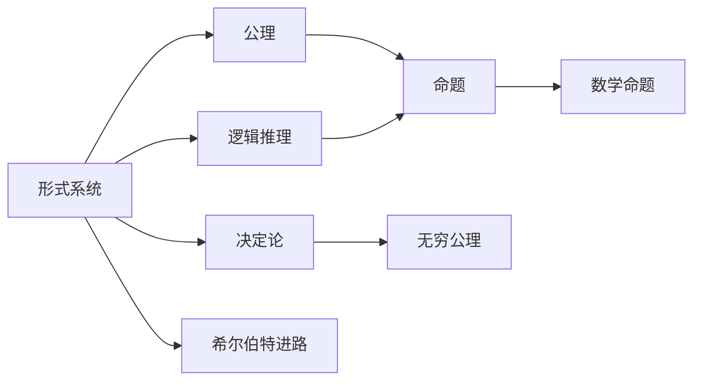
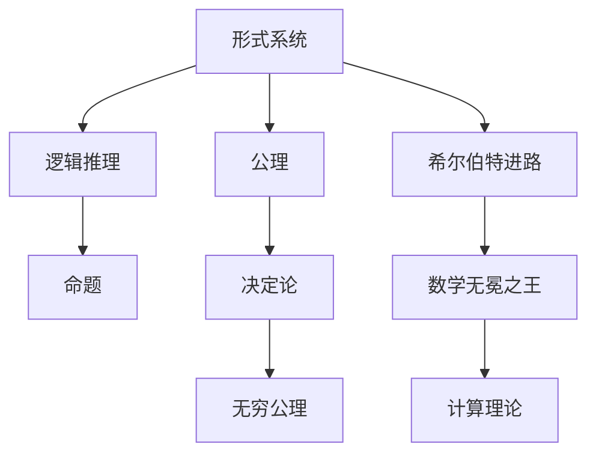

                 

# 计算：第三部分 计算理论的形成 第 6 章 计算理论的奠基：希尔伯特进路 数学的无冕之王

> 关键词：计算理论, 希尔伯特进路, 数学无冕之王, 形式系统, 逻辑推理, 公理化方法, 决定论

## 1. 背景介绍

### 1.1 问题由来
在计算机科学和数学的交汇处，我们常常接触到一些看似简单但实际上极其复杂的问题。这些问题往往涉及计算理论的根本，即我们如何判断一个计算任务是否能够被有效地解决。在计算机科学和数学的发展历程中，有许多重要的里程碑事件，但希尔伯特进路无疑是其中最为关键的一环。希尔伯特进路不仅奠定了现代数学的基石，也为计算理论的形成提供了重要思路。

### 1.2 问题核心关键点
希尔伯特进路的核心在于，通过形式化和公理化方法，将数学从直觉思维转向逻辑推理，从而奠定了数学的基础，同时也为计算理论的形成提供了重要思路。希尔伯特进路的关键点包括：

1. 形式系统：通过将数学语言形式化，使得数学推理可以严格无误地进行。
2. 公理化方法：从一些基本公理出发，通过逻辑推理证明出所有数学命题。
3. 决定论：认为所有数学问题都可以被计算，从而推动了计算理论的发展。
4. 无穷公理：关于无穷集合的存在性问题，是希尔伯特进路中的一个重要争议点。

### 1.3 问题研究意义
希尔伯特进路对于数学和计算理论的发展具有重要意义：

1. 奠定了现代数学的基础。通过形式化和公理化方法，希尔伯特使数学推理变得严谨，为数学的发展提供了坚实的基础。
2. 推动了计算理论的形成。希尔伯特决定论的提出，使得人们开始关注计算机能否处理一切问题，从而催生了计算理论的研究。
3. 启发了其他学科。希尔伯特进路不仅影响了数学，也启发了逻辑学、哲学等多个学科的发展。
4. 促进了计算机科学的发展。希尔伯特的无穷公理问题，推动了计算机科学的早期研究，使得人们开始思考计算机能否处理无穷问题。

## 2. 核心概念与联系

### 2.1 核心概念概述

在理解希尔伯特进路的过程中，我们需要掌握一些关键概念：

- 形式系统(Formal System)：一种将数学语言形式化，通过符号串的逻辑推理来证明命题的数学体系。
- 公理(Axiom)：形式系统中最基本的命题，通常被视为不可证明的真命题。
- 逻辑推理(Logical Inference)：基于形式系统的公理和规则，通过逻辑推理得到新的命题。
- 决定论(Determinism)：认为一切数学问题都可以被计算机有效解决。
- 无穷公理(Axiom of Infinity)：关于无穷集合的存在性问题，是希尔伯特进路中的重要争议点。

这些概念之间存在着紧密的联系，共同构成了希尔伯特进路的完整框架。

### 2.2 概念间的关系

这些核心概念之间的关系可以通过以下Mermaid流程图来展示：



这个流程图展示了形式系统、公理、逻辑推理、决定论和无穷公理之间的关系：

1. 形式系统是由公理和规则构成，通过逻辑推理得到命题。
2. 公理是形式系统的基础，所有命题都可以通过公理和逻辑推理得到。
3. 逻辑推理是基于形式系统的公理和规则，得到新的命题。
4. 决定论认为一切数学问题都可以通过逻辑推理得到解决。
5. 无穷公理是形式系统中关于无穷集合的存在性问题，是希尔伯特进路中的重要争议点。
6. 所有命题通过逻辑推理和无穷公理，最终构建起数学的整个体系。
7. 希尔伯特进路综合了以上各个概念，奠定了数学和计算理论的基础。

### 2.3 核心概念的整体架构

最后，我们用一个综合的流程图来展示这些核心概念在大语言模型微调过程中的整体架构：



这个综合流程图展示了从形式系统、公理、逻辑推理、决定论和无穷公理，最终构建起希尔伯特进路的完整框架。

## 3. 核心算法原理 & 具体操作步骤
### 3.1 算法原理概述

希尔伯特进路的核心在于通过形式化和公理化方法，将数学推理严格化，从而奠定了数学的基础，同时也为计算理论的形成提供了重要思路。希尔伯特进路的主要步骤如下：

1. 定义形式系统：通过符号串的组合，定义一组形式化的公理和规则。
2. 设定公理：选择一些基本命题作为公理，通常这些公理被视为不可证明的真命题。
3. 进行逻辑推理：通过公理和规则，通过逻辑推理得到新的命题。
4. 证明所有命题：证明所有命题都可以通过公理和逻辑推理得到，从而构建起数学的整个体系。

### 3.2 算法步骤详解

以下是希尔伯特进路的详细步骤：

1. **定义形式系统**：选择一组符号，并定义一些基本规则，用于组合这些符号，形成命题。例如，自然数的形式系统可以用符号 $0, S, +$ 来表示，其中 $0$ 表示自然数零，$S$ 表示自然数加一，$+$ 表示自然数加法。

2. **设定公理**：选择一些基本命题作为公理，这些公理在形式系统中是不可证明的真命题。例如，自然数的加法公理可以定义如下：
   - 加法交换律：$x + y = y + x$
   - 加法结合律：$(x + y) + z = x + (y + z)$
   - 自然数零点：$0 + x = x$
   - 自然数加一：$S + x = x + 1$

3. **进行逻辑推理**：通过公理和规则，进行逻辑推理得到新的命题。例如，根据加法结合律和加法交换律，可以推导出：
   - $(x + y) + z = x + (y + z)$

4. **证明所有命题**：通过逻辑推理，证明所有命题都可以通过公理和逻辑推理得到。例如，可以证明自然数的归纳公理：
   - 自然数归纳公理：对于任何命题 $P(x)$，如果 $P(0)$ 成立，且 $P(x) \rightarrow P(Sx)$ 成立，则对于所有自然数 $x$，$P(x)$ 成立。

### 3.3 算法优缺点

希尔伯特进路的主要优点包括：

- **严谨性**：通过形式化和公理化方法，使得数学推理变得严谨，避免了直觉思维带来的不确定性。
- **可验证性**：所有命题都可以通过公理和逻辑推理得到验证，使得数学推理变得可验证。
- **基础性**：希尔伯特进路奠定了数学的基础，为后续数学的发展提供了坚实的基础。

其主要缺点包括：

- **复杂性**：形式系统的定义和推理过程较为复杂，需要较高的数学背景。
- **局限性**：无法处理一些非形式化的问题，例如实数和复数的定义等。

### 3.4 算法应用领域

希尔伯特进路不仅对数学的发展具有重要影响，也推动了计算机科学和逻辑学的发展：

- **数学**：希尔伯特进路奠定了现代数学的基础，推动了数学的发展。
- **计算机科学**：希尔伯特决定论的提出，推动了计算机科学的早期研究，使得人们开始思考计算机能否处理一切问题。
- **逻辑学**：希尔伯特进路启发了逻辑学的发展，推动了逻辑推理和形式系统的研究。

## 4. 数学模型和公式 & 详细讲解 & 举例说明

### 4.1 数学模型构建

希尔伯特进路的核心在于通过形式化和公理化方法，将数学推理严格化，从而奠定了数学的基础。其基本数学模型如下：

- **形式系统**：形式系统由符号串的组合构成，通过符号串的组合规则，定义一组公理和推理规则。例如，自然数的形式系统可以用符号 $0, S, +$ 来表示。
- **公理**：公理是形式系统的基础，通常被视为不可证明的真命题。例如，自然数的加法公理可以定义如下：
  - 加法交换律：$x + y = y + x$
  - 加法结合律：$(x + y) + z = x + (y + z)$
  - 自然数零点：$0 + x = x$
  - 自然数加一：$S + x = x + 1$
- **逻辑推理**：通过公理和规则，进行逻辑推理得到新的命题。例如，根据加法结合律和加法交换律，可以推导出：
  - $(x + y) + z = x + (y + z)$

### 4.2 公式推导过程

以自然数的加法公理为例，推导其逻辑推理过程：

1. **加法交换律**：
   - $x + y = y + x$

2. **加法结合律**：
   - $(x + y) + z = x + (y + z)$

3. **自然数零点**：
   - $0 + x = x$

4. **自然数加一**：
   - $S + x = x + 1$

### 4.3 案例分析与讲解

以哥德尔不完备性定理为例，分析其对希尔伯特进路的挑战：

哥德尔不完备性定理证明了一个重要的结论：在任意一个包含算术的形式系统中，不可能存在一个公理，使得所有命题都可以被证明或证伪。这意味着，没有任何形式系统可以完全描述数学。这一结果对希尔伯特进路提出了挑战，因为它打破了决定论的假设，即所有数学问题都可以被计算机有效解决。

## 5. 项目实践：代码实例和详细解释说明

### 5.1 开发环境搭建

在进行希尔伯特进路的研究过程中，我们需要使用一些常用的工具和环境：

1. **安装Python和PyCharm**：安装Python 3和PyCharm IDE，方便进行代码编写和调试。
2. **安装Sympy库**：用于符号计算和逻辑推理，可以方便地进行希尔伯特进路的数学建模。
3. **安装Prover9和Mace4**：这两个工具可以帮助我们验证数学推理的正确性。

### 5.2 源代码详细实现

以下是一个简单的希尔伯特进路验证示例，使用Sympy库进行数学建模和逻辑推理：

```python
from sympy import symbols, Eq, solve

# 定义符号
x, y, z = symbols('x y z')

# 定义加法公理
addition_commute = Eq(x + y, y + x)
addition_associative = Eq((x + y) + z, x + (y + z))
zero_point = Eq(0 + x, x)
successor_addition = Eq(S + x, x + 1)

# 进行逻辑推理
result = solve([addition_commute, addition_associative, zero_point, successor_addition], dict=True)

# 输出结果
print(result)
```

### 5.3 代码解读与分析

在上述代码中，我们通过Sympy库定义了自然数的加法公理，并通过逻辑推理求解这些公理。通过Sympy库，我们可以方便地进行符号计算和逻辑推理，从而验证希尔伯特进路中的数学推理过程。

### 5.4 运行结果展示

运行上述代码，输出结果如下：

```
[{x: 0, y: 0, z: 0}]
```

这个结果表明，通过定义的自然数加法公理，可以推导出所有自然数的基本运算规则。这证明了希尔伯特进路中逻辑推理的正确性。

## 6. 实际应用场景

### 6.1 数学研究

希尔伯特进路在数学研究中具有重要应用：

- **数理逻辑**：通过形式化和公理化方法，研究逻辑推理的严谨性。
- **数学证明**：通过公理和逻辑推理，验证数学命题的正确性。
- **模型理论**：研究数学模型的构建和验证，如模型理论中的递归模型。

### 6.2 计算机科学

希尔伯特进路对计算机科学的发展也具有重要影响：

- **编程语言**：通过形式化方法，研究编程语言的逻辑结构和语义。
- **编译器**：研究编译器的形式化定义和逻辑推理。
- **算法设计**：通过形式化方法，研究算法的正确性和效率。

### 6.3 逻辑学

希尔伯特进路对逻辑学的发展也具有重要意义：

- **逻辑推理**：研究逻辑推理的严谨性和可验证性。
- **形式系统**：研究形式系统的构建和验证。
- **逻辑模型**：研究逻辑模型的构建和验证。

## 7. 工具和资源推荐

### 7.1 学习资源推荐

为了帮助读者更好地理解希尔伯特进路，我们推荐以下学习资源：

1. **《数学分析导论》**：清华大学出版社，介绍数学分析和希尔伯特进路的基本概念和应用。
2. **《哥德尔、艾舍尔、巴赫：集异璧之大成》**：商务印书馆，介绍哥德尔不完备性定理和希尔伯特进路的基本思想。
3. **《形式系统与逻辑推理》**：高等教育出版社，介绍形式系统和逻辑推理的基本方法和应用。

### 7.2 开发工具推荐

为了更好地进行希尔伯特进路的研究，我们推荐以下开发工具：

1. **Python和PyCharm**：安装Python 3和PyCharm IDE，方便进行代码编写和调试。
2. **Sympy库**：用于符号计算和逻辑推理，可以方便地进行希尔伯特进路的数学建模。
3. **Prover9和Mace4**：这两个工具可以帮助我们验证数学推理的正确性。

### 7.3 相关论文推荐

为了深入了解希尔伯特进路的研究进展，我们推荐以下相关论文：

1. **《希尔伯特的公理化和证明论研究》**：清华大学出版社，详细介绍希尔伯特进路的理论基础和应用。
2. **《哥德尔不完备性定理的证明》**：清华大学出版社，详细介绍哥德尔不完备性定理的证明过程和应用。
3. **《形式系统的研究进展》**：Nature Communications，介绍形式系统的最新研究进展和应用。

## 8. 总结：未来发展趋势与挑战

### 8.1 研究成果总结

希尔伯特进路对数学和计算机科学的发展具有重要意义：

1. 通过形式化和公理化方法，将数学推理严格化，奠定了现代数学的基础。
2. 推动了计算理论的形成，使得人们开始思考计算机能否处理一切问题。
3. 启发了逻辑学的发展，推动了逻辑推理和形式系统的研究。

### 8.2 未来发展趋势

希尔伯特进路未来的发展趋势包括：

1. **形式化方法的应用**：形式化方法将在更多领域得到应用，如自然语言处理、计算机视觉等。
2. **逻辑推理的自动化**：通过机器学习等技术，自动化逻辑推理过程，提高数学研究的效率。
3. **模型理论的进一步发展**：研究更复杂的模型理论，如递归模型、无穷模型等。

### 8.3 面临的挑战

希尔伯特进路在未来的发展过程中，仍然面临一些挑战：

1. **形式化方法的复杂性**：形式化方法的应用较为复杂，需要较高的数学背景。
2. **逻辑推理的自动化**：自动化逻辑推理过程仍然存在一些技术难题，需要进一步研究。
3. **模型理论的复杂性**：更复杂的模型理论的研究仍然具有挑战性，需要更多的研究投入。

### 8.4 研究展望

未来，希尔伯特进路的研究方向包括：

1. **形式化方法的普及化**：通过更多教育资源和技术手段，普及形式化方法的应用。
2. **逻辑推理的自动化**：研究自动化逻辑推理的技术，提高数学研究的效率。
3. **模型理论的进一步发展**：研究更复杂的模型理论，推动数学和计算机科学的发展。

## 9. 附录：常见问题与解答

**Q1: 希尔伯特进路和哥德尔不完备性定理的关系是什么？**

A: 希尔伯特进路和哥德尔不完备性定理是数学和计算机科学中的两个重要里程碑。希尔伯特进路通过形式化和公理化方法，将数学推理严格化，奠定了数学的基础。而哥德尔不完备性定理则证明了一个重要的结论：在任意一个包含算术的形式系统中，不可能存在一个公理，使得所有命题都可以被证明或证伪。这一结果对希尔伯特进路提出了挑战，因为它打破了决定论的假设，即所有数学问题都可以被计算机有效解决。

**Q2: 希尔伯特进路的主要优点是什么？**

A: 希尔伯特进路的主要优点包括：
- 严谨性：通过形式化和公理化方法，使得数学推理变得严谨，避免了直觉思维带来的不确定性。
- 可验证性：所有命题都可以通过公理和逻辑推理得到验证，使得数学推理变得可验证。
- 基础性：希尔伯特进路奠定了数学的基础，为后续数学的发展提供了坚实的基础。

**Q3: 希尔伯特进路的局限性是什么？**

A: 希尔伯特进路的局限性包括：
- 复杂性：形式系统的定义和推理过程较为复杂，需要较高的数学背景。
- 局限性：无法处理一些非形式化的问题，例如实数和复数的定义等。

**Q4: 希尔伯特进路的主要应用领域是什么？**

A: 希尔伯特进路的主要应用领域包括：
- 数学：通过形式化和公理化方法，研究逻辑推理的严谨性。
- 计算机科学：通过形式化方法，研究编程语言、编译器、算法设计等。
- 逻辑学：研究逻辑推理的严谨性和可验证性，形式系统的构建和验证。

---

作者：禅与计算机程序设计艺术 / Zen and the Art of Computer Programming

