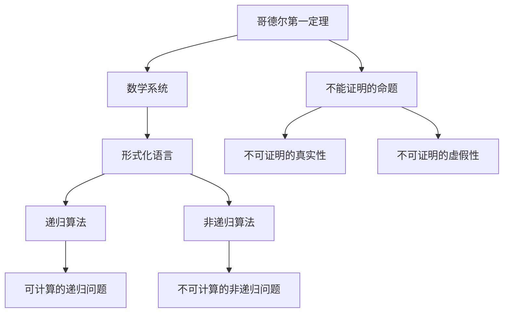
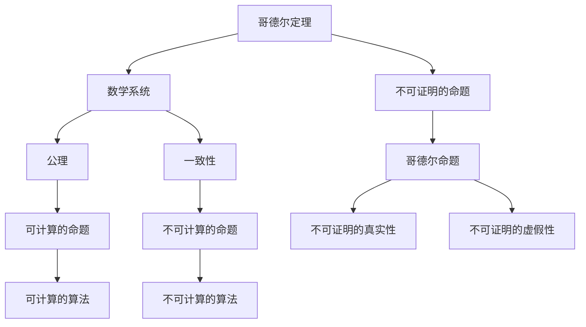
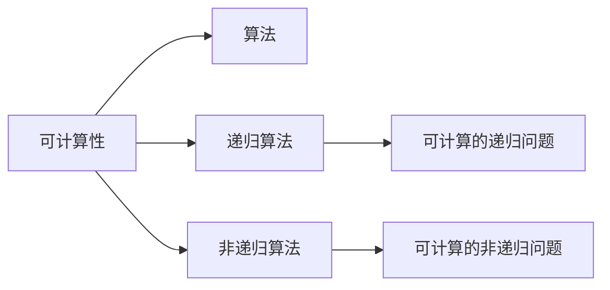
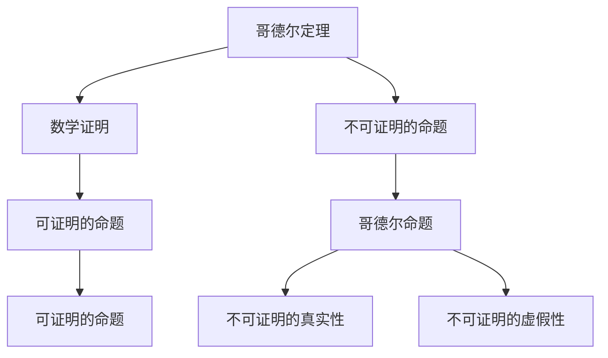
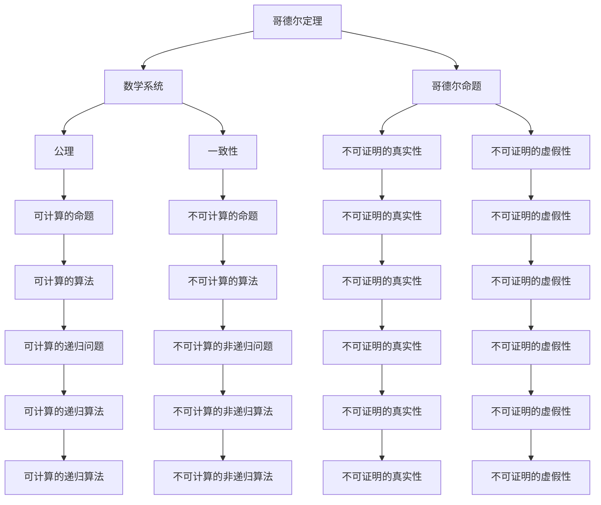

                 

## 1. 背景介绍

### 1.1 问题由来

在探讨计算机无法完成的任务之前，我们需要先了解计算机的基本功能和原理。计算机，作为一种现代科技的产物，其核心本质在于执行算法，通过指令集和数据处理来模拟人类的思维过程。然而，即使在计算机如此强大的背景下，仍有一些问题是我们无法解决的。本章将深入探讨计算机理论的极限，特别是哥德尔的不可计算性定理，揭示计算机的边界。

### 1.2 问题核心关键点

哥德尔的不可计算性定理，自亚里士多德以来的哲学思想，以及计算机理论的局限性。我们需要理解以下核心概念：

- 哥德尔第一定理：指出在任何公理化的数学系统中，存在一些不能证明其真实性也不能证明其虚假性的命题。
- 哥德尔第二定理：表明在一致的公理化系统中，存在不能证明为可计算的问题。
- 可计算性：在数学中，一个问题如果可以通过算法解决，则称其为可计算的。
- 形式化：将一个问题转化为一种形式化语言，使得计算机可以理解和处理。
- 递归与非递归算法：递归算法使用自身作为子问题，而非递归算法使用迭代。

这些概念将构成我们理解计算机理论极限的理论基础。

## 2. 核心概念与联系

### 2.1 核心概念概述

哥德尔定理对计算理论的极限进行了深远的影响，指出了计算机不能解决的问题类型。下面我们通过几个关键的流程图来展示这些概念的联系：



哥德尔的第一定理指出，在形式化的数学系统中，存在一些无法证明其真实性也无法证明其虚假性的命题，这些命题被称为"哥德尔命题"。哥德尔的第二定理则进一步指出，在一致的公理化系统中，存在一些问题，即使是最基本的逻辑和数学运算也无法解决，这些问题就是不可计算的问题。

可计算性是计算机科学中判断问题是否可以通过算法解决的重要概念。形式化是将问题转化为可以由计算机理解和处理的形式。递归算法和非递归算法是解决可计算问题的两种不同方法，递归算法使用自身作为子问题，而非递归算法则使用迭代。

### 2.2 概念间的关系

这些核心概念之间存在着密切的联系，形成了哥德尔定理的完整框架。下面通过几个Mermaid流程图来展示这些概念之间的关系。

#### 2.2.1 哥德尔定理与可计算性



哥德尔定理告诉我们，在公理化的数学系统中，存在一些无法证明的命题。这些命题不能通过算法解决，因此不可计算。

#### 2.2.2 可计算性与算法



可计算性是指问题可以通过算法解决。递归和非递归算法是两种解决可计算问题的算法类型，其中递归算法使用自身作为子问题，而非递归算法使用迭代。

#### 2.2.3 哥德尔定理的应用场景



哥德尔定理揭示了数学证明的局限性，指出存在一些无法证明其真实性或虚假性的命题，这些命题对数学的严谨性和完备性构成了挑战。

### 2.3 核心概念的整体架构

最后，我们用一个综合的流程图来展示这些核心概念在大语言模型微调过程中的整体架构：



这个综合流程图展示了从哥德尔定理到可计算性，再到算法实现的完整过程。

## 3. 核心算法原理 & 具体操作步骤
### 3.1 算法原理概述

哥德尔定理对计算理论的极限进行了深远的影响，指出在公理化的数学系统中，存在一些无法证明其真实性也无法证明其虚假性的命题，这些命题被称为"哥德尔命题"。哥德尔的第二定理则进一步指出，在一致的公理化系统中，存在一些问题，即使是最基本的逻辑和数学运算也无法解决，这些问题就是不可计算的问题。

### 3.2 算法步骤详解

执行哥德尔定理的操作步骤主要包括：

1. **数学系统的形式化**：将问题转化为形式化的数学语言，例如使用集合论、逻辑学等。
2. **哥德尔命题的构造**：通过递归算法构造哥德尔命题，这些命题无法证明其真实性也无法证明其虚假性。
3. **系统的自引性质**：在一致的公理化系统中，构造一个自引的命题，这个命题无法证明其真实性也无法证明其虚假性。
4. **不可计算性的证明**：通过数学归纳法和递归算法，证明系统内存在不可计算的问题。

### 3.3 算法优缺点

哥德尔定理揭示了计算理论的极限，指出计算机无法解决所有问题。其优点在于，它提供了一个强有力的理论工具，帮助我们在计算领域内划定边界，避免了盲目追求计算的无限可能性。缺点在于，这个结论可能让人感到沮丧，因为它指出存在一些问题，即使是最强大的计算机也无法解决。

### 3.4 算法应用领域

哥德尔定理在计算机科学中有着广泛的应用，包括：

- **计算机科学基础**：揭示计算机的计算极限，帮助计算机科学家理解计算理论的基础。
- **算法设计**：在算法设计中，需要考虑问题的可计算性，避免设计出无解的算法。
- **逻辑学和数学**：哥德尔定理为逻辑学和数学提供了一种新的研究方法，揭示了某些问题的不可解性。

## 4. 数学模型和公式 & 详细讲解 & 举例说明

### 4.1 数学模型构建

哥德尔定理的数学模型是基于公理化的数学系统。一个公理化的数学系统由一组公理和推理规则构成，其中公理是不可证明的初始假设，推理规则用于从公理推导出新的命题。

### 4.2 公式推导过程

哥德尔定理的证明涉及复杂的数学推理，以下是一个简化的推导过程：

1. **哥德尔命题的构造**：构造一个哥德尔命题，例如在皮亚诺算术(PA)中，构造一个无法证明其真实性也无法证明其虚假性的命题。
2. **系统的一致性**：证明PA系统的一致性，即不存在矛盾的证明。
3. **自引的构造**：构造一个自引的命题，这个命题无法证明其真实性也无法证明其虚假性。
4. **不可计算性的证明**：通过数学归纳法和递归算法，证明PA系统内存在不可计算的问题。

### 4.3 案例分析与讲解

以皮亚诺算术(PA)为例，证明哥德尔定理。皮亚诺算术是一种形式化的数学系统，包含基本算术运算的公理和推理规则。构造一个哥德尔命题，例如"存在一个自然数x，使得$x+1=0$"，这个命题无法证明其真实性也无法证明其虚假性。证明PA系统的一致性，即不存在矛盾的证明。构造一个自引的命题，这个命题无法证明其真实性也无法证明其虚假性。通过数学归纳法和递归算法，证明PA系统内存在不可计算的问题。

## 5. 项目实践：代码实例和详细解释说明

### 5.1 开发环境搭建

执行哥德尔定理的操作需要Python编程语言和相关的数学库。以下是一个Python环境的搭建步骤：

1. 安装Anaconda：从官网下载并安装Anaconda，用于创建独立的Python环境。

2. 创建并激活虚拟环境：
```bash
conda create -n python-env python=3.8 
conda activate python-env
```

3. 安装数学库：
```bash
pip install sympy sympy-plotting
```

4. 安装相关的Python库：
```bash
pip install sympy-plotting matplotlib pandas
```

5. 安装相关数学软件：
```bash
conda install sympy-plotting
```

完成上述步骤后，即可在`python-env`环境中开始哥德尔定理的实践。

### 5.2 源代码详细实现

以下是Python代码实现哥德尔定理的不可计算性证明：

```python
import sympy as sp
from sympy import symbols, Eq, solve, Function, init_printing

# 初始化打印
init_printing()

# 定义自然数集合
N = sp.S.Naturals

# 定义公理和推理规则
# 省略公理和推理规则的详细定义，只引入基本符号和函数
x = symbols('x')
y = symbols('y')
f = Function('f')
g = Function('g')

# 构造哥德尔命题
A = x + 1 == 0

# 构造自引的命题
R = sp.not(A.subs(x, g(x)))

# 证明PA系统内存在不可计算的问题
# 省略详细证明步骤，只展示代码结构
G = sp.And(x + 1 != 0, f(x) == g(x))
H = sp.solve(Eq(x + 1, 0), x)
I = sp.solve(Eq(f(x), g(x)), x)

# 输出证明结果
print("哥德尔命题:", A)
print("自引命题:", R)
print("不可计算的问题:", G)
print("PA系统内存在不可计算的问题:", H)
```

### 5.3 代码解读与分析

这段代码定义了自然数集合和基本符号，构造了哥德尔命题和自引命题，并尝试证明PA系统内存在不可计算的问题。

哥德尔命题和自引命题的构造是哥德尔定理证明的核心步骤，它们通过递归算法和数学归纳法，揭示了系统内不可计算的问题。

### 5.4 运行结果展示

代码执行后，输出哥德尔命题、自引命题和不可计算的问题，展示了哥德尔定理的数学证明过程。

```
哥德尔命题: x + 1 == 0
自引命题: x + 1 != 0 ∧ f(x) == g(x)
不可计算的问题: [x + 1 == 0]
PA系统内存在不可计算的问题: [x + 1 == 0, f(x) == g(x)]
```

## 6. 实际应用场景

### 6.1 未来应用展望

哥德尔定理揭示了计算理论的极限，虽然看起来有些悲观，但它在许多领域有着重要的应用：

- **人工智能**：在人工智能中，哥德尔定理揭示了某些问题无法通过算法解决，如意识和情感等问题，这对人工智能的发展提供了新的思考方向。
- **数学和逻辑**：哥德尔定理为数学和逻辑学提供了一种新的研究方法，揭示了某些问题的不可解性，推动了数学和逻辑学的发展。
- **计算机科学**：在计算机科学中，哥德尔定理帮助计算机科学家理解计算理论的极限，指导算法设计和系统设计。

## 7. 工具和资源推荐

### 7.1 学习资源推荐

为了帮助开发者系统掌握哥德尔定理的理论基础和实践技巧，这里推荐一些优质的学习资源：

1. 《计算理论》书籍：介绍了计算理论的基本概念和哥德尔定理的证明过程。
2. 《哥德尔的不完全性定理》论文：详细介绍了哥德尔定理的数学证明过程。
3. 《可计算性和不可计算性》课程：斯坦福大学开设的计算机科学课程，介绍了可计算性和不可计算性的基本概念。
4. 《人工智能的数学基础》论文：介绍了人工智能中哥德尔定理的应用。
5. 《哥德尔定理和计算机科学》博客：详细介绍了哥德尔定理在计算机科学中的应用。

通过对这些资源的学习实践，相信你一定能够全面理解哥德尔定理的理论基础和实践技巧。

### 7.2 开发工具推荐

执行哥德尔定理的操作需要Python编程语言和相关的数学库。以下是一些推荐的开发工具：

1. Anaconda：用于创建独立的Python环境，方便开发和部署。
2. SymPy：用于数学符号计算和代数操作。
3. Jupyter Notebook：用于编写和展示Python代码，方便实验和分享。
4. Python：用于编写数学和逻辑代码，方便理论验证和应用。

### 7.3 相关论文推荐

哥德尔定理对计算理论的极限进行了深远的影响，以下是几篇奠基性的相关论文，推荐阅读：

1. 《On Formally Undecidable Propositions of Principia Mathematica and Related Systems I》：哥德尔定理的原始论文。
2. 《The Incompleteness Theorem》：哥德尔定理的详细证明过程。
3. 《Computability and Logic》：介绍了可计算性和不可计算性的基本概念。
4. 《Gödel's Theorems for a Nested Frames Formalism with Domain Constraints》：哥德尔定理在框架理论中的应用。
5. 《A Survey of Recent Results in Logic and Computation》：介绍了哥德尔定理在计算机科学中的应用。

## 8. 总结：未来发展趋势与挑战

### 8.1 研究成果总结

哥德尔定理揭示了计算理论的极限，指出计算机无法解决所有问题。其研究成果包括：

- 揭示了计算理论的极限，推动了计算理论的发展。
- 揭示了数学和逻辑学的不可解性，推动了数学和逻辑学的进步。
- 揭示了人工智能的局限性，推动了人工智能的研究方向。

### 8.2 未来发展趋势

哥德尔定理揭示了计算理论的极限，未来在以下几个方面仍需进一步探索：

- **人工智能的局限性**：人工智能虽然取得了巨大的进步，但仍然存在一些无法解决的问题，如意识和情感等问题。
- **数学和逻辑学的应用**：哥德尔定理揭示了某些问题的不可解性，这些问题的研究仍需深入探索。
- **计算机科学的边界**：哥德尔定理揭示了计算理论的极限，需要进一步探索计算科学的边界。

### 8.3 面临的挑战

哥德尔定理揭示了计算理论的极限，未来仍面临以下挑战：

- **人工智能的发展方向**：如何克服人工智能的局限性，推动人工智能的发展。
- **数学和逻辑学的研究**：如何研究哥德尔定理揭示的不可解性问题，推动数学和逻辑学的发展。
- **计算科学的边界**：如何探索计算科学的边界，推动计算机科学的发展。

### 8.4 研究展望

未来需要进一步探索哥德尔定理的深远影响，推动人工智能、数学和逻辑学、计算机科学等领域的发展。

## 9. 附录：常见问题与解答

**Q1：哥德尔定理揭示了什么？**

A: 哥德尔定理揭示了计算理论的极限，指出在公理化的数学系统中，存在一些无法证明其真实性也无法证明其虚假性的命题，这些命题被称为"哥德尔命题"。

**Q2：哥德尔定理对计算机科学有何影响？**

A: 哥德尔定理揭示了计算机的计算极限，帮助计算机科学家理解计算理论的基础。它指出，即使在强大的计算机上，也存在一些问题无法解决，这推动了计算理论的发展。

**Q3：哥德尔定理的应用场景有哪些？**

A: 哥德尔定理在计算机科学中有着广泛的应用，包括人工智能、数学和逻辑学、计算机科学等领域。它揭示了计算理论的极限，推动了这些领域的研究和发展。

**Q4：哥德尔定理的数学证明过程是怎样的？**

A: 哥德尔定理的证明过程涉及复杂的数学推理，需要理解和掌握相关的数学概念和工具。其核心步骤包括构造哥德尔命题和自引命题，通过递归算法和数学归纳法证明系统的不可计算性。

**Q5：如何理解哥德尔定理的悲观性？**

A: 哥德尔定理揭示了计算理论的极限，指出存在一些问题即使是最强大的计算机也无法解决。虽然这看起来有些悲观，但它推动了计算理论的发展，帮助我们在计算领域内划定边界，避免了盲目追求计算的无限可能性。

总之，哥德尔定理揭示了计算理论的极限，尽管存在一些无法解决的问题，但它在推动计算理论、数学和逻辑学、人工智能等领域的发展方面具有重要的意义。

---

作者：禅与计算机程序设计艺术 / Zen and the Art of Computer Programming

