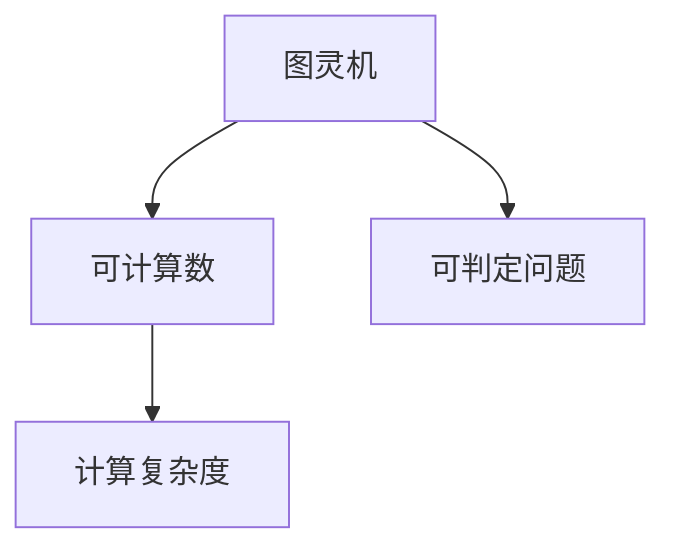
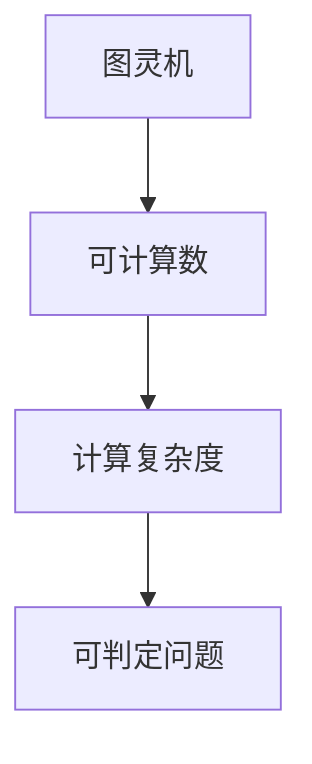

                 

# 计算：第三部分 计算理论的形成 第 8 章 计算理论的诞生：图灵的可计算数 忙碌的海狸

## 1. 背景介绍

### 1.1 问题由来

在计算机科学的发展历程中，计算理论的形成是一个关键节点。图灵（Alan Turing）在1937年发表的论文《可计算数及其在判定问题中的应用》中，首次提出了计算理论的概念，奠定了现代计算机科学的理论基础。这篇论文不仅解决了计算机能否进行通用计算的问题，也提出了一个著名的思想实验——忙碌的海狸问题，为计算复杂性的研究提供了重要的思路。

### 1.2 问题核心关键点

忙碌的海狸问题是一个经典的计算问题，涉及计算机科学中的图灵机、可计算数、复杂度理论等核心概念。问题描述如下：

> 在一个无限的森林里，有一只海狸、一把斧头、一张纸、一支笔和一把计数器。海狸每天可以在无限的时间内工作，每天它可以砍倒一棵树，制作一张纸，并将一张纸的计数器增加1。如果计数器达到10，海狸就会停止工作。问：海狸能完成多少张纸？

图灵通过这个问题探讨了计算问题的本质，即在任何有限时间内，一个计算机能否计算出一个给定问题的解。这个问题的解答，不仅展示了计算理论的基本框架，也为后续算法设计和复杂度理论的研究奠定了基础。

### 1.3 问题研究意义

忙碌的海狸问题对于理解计算理论的核心概念和应用具有重要意义：

1. **计算本质的探讨**：通过这个问题，图灵揭示了计算的本质，即通过有限的步骤和有限的时间计算出任意复杂的输出。
2. **复杂度的定义**：海狸问题的解决过程中，图灵引入了计算复杂度的概念，为后续复杂度理论的发展提供了基础。
3. **可计算性的证明**：海狸问题展示了即使是看似简单的计算任务，也需要经过复杂的计算过程才能完成，从而证明了计算问题的普遍性和复杂性。
4. **算法设计的基本思路**：海狸问题的解答过程，也展示了设计算法的基本思路，即通过有限的步骤和条件判断，逐步逼近目标状态。

## 2. 核心概念与联系

### 2.1 核心概念概述

为了更好地理解忙碌的海狸问题及其在计算理论中的地位，本节将介绍几个密切相关的核心概念：

- **图灵机（Turing Machine, TM）**：图灵机是一种抽象的计算模型，由一个无限长度的纸带、一个读写头、一个状态集和一组转移规则组成。图灵机通过有限的步骤和状态转移，模拟了任意复杂的计算过程。
- **可计算数（Computable Number）**：可计算数是指通过图灵机可以在有限时间内计算出的数值。海狸问题的解就是一个典型的可计算数。
- **计算复杂度（Computational Complexity）**：计算复杂度是指计算一个问题的解所需要的计算资源，包括时间复杂度和空间复杂度。海狸问题的复杂度可以通过计数器的增长来描述。
- **可判定问题（Decision Problem）**：可判定问题是指那些可以通过有限步骤判断其解为“是”或“否”的问题。海狸问题是一个典型的可判定问题。

这些核心概念之间的逻辑关系可以通过以下Mermaid流程图来展示：



这个流程图展示了大语言模型微调过程中各个核心概念的关系和作用。

### 2.2 概念间的关系

这些核心概念之间存在着紧密的联系，形成了计算理论的完整生态系统。下面我们通过几个Mermaid流程图来展示这些概念之间的关系。

#### 2.2.1 图灵机与可计算数的关系


这个流程图展示了图灵机与可计算数之间的基本关系。通过图灵机，可以计算出可计算数。

#### 2.2.2 图灵机与可判定问题之间的关系


这个流程图展示了图灵机与可判定问题之间的基本关系。通过图灵机，可以判断一个问题的解是否存在，即判断一个问题是可判定问题。

#### 2.2.3 计算复杂度与可计算数之间的关系


这个流程图展示了计算复杂度与可计算数之间的关系。计算复杂度描述了计算一个可计算数所需要的资源，即时间复杂度和空间复杂度。

### 2.3 核心概念的整体架构

最后，我们用一个综合的流程图来展示这些核心概念在大语言模型微调过程中的整体架构：



这个综合流程图展示了从图灵机到可计算数，再到计算复杂度，最后到可判定问题的完整计算过程。通过这些概念，我们可以更好地理解计算机的计算能力及其局限性。

## 3. 核心算法原理 & 具体操作步骤
### 3.1 算法原理概述

忙碌的海狸问题本质上是一个图灵机计算问题的求解。通过图灵机的有限状态和转移规则，海狸能够在无限的时间内完成计算。

图灵机由一个无限长度的纸带、一个读写头、一个状态集和一组转移规则组成。在每一步操作中，图灵机根据当前状态和读写头的位置，按照转移规则进行状态转移和读写操作。通过这些操作，图灵机能够模拟任意复杂的计算过程。

海狸问题的计算过程可以用以下步骤描述：

1. 初始状态：海狸在纸带上的第一个位置标记为1，计数器为0。
2. 每天操作：海狸重复以下操作：
   - 读入当前位置的数字。
   - 如果当前位置的数字为0，则向右移动一位。
   - 如果当前位置的数字为1，则向左移动一位。
   - 如果当前位置的数字为2，则向左移动一位，并将当前位置的数字减1。
   - 如果当前位置的数字为3，则向左移动一位，并将当前位置的数字减1。
   - 如果当前位置的数字为4，则向左移动一位，并将当前位置的数字减1。
   - 如果当前位置的数字为5，则向左移动一位，并将当前位置的数字减1。
   - 如果当前位置的数字为6，则向左移动一位，并将当前位置的数字减1。
   - 如果当前位置的数字为7，则向左移动一位，并将当前位置的数字减1。
   - 如果当前位置的数字为8，则向左移动一位，并将当前位置的数字减1。
   - 如果当前位置的数字为9，则向左移动一位，并将当前位置的数字减1。
   - 如果当前位置的数字为10，则向左移动一位，并将计数器加1。
3. 停止条件：当计数器达到10时，海狸停止工作。

海狸问题的解是计数器的最终值，即海狸能够在无限的时间内完成多少张纸的计算。

### 3.2 算法步骤详解

海狸问题的解决步骤如下：

1. 初始化：将计数器置为0，将纸带上的数字全部置为0。
2. 每次迭代：
   - 从纸带的最左边开始，逐个向右移动读写头。
   - 每移动一位，读取当前位置的数字。
   - 如果当前数字为0，则向右移动一位。
   - 如果当前数字为1，则向左移动一位。
   - 如果当前数字为2，则向左移动一位，并将当前位置的数字减1。
   - 如果当前数字为3，则向左移动一位，并将当前位置的数字减1。
   - 如果当前数字为4，则向左移动一位，并将当前位置的数字减1。
   - 如果当前数字为5，则向左移动一位，并将当前位置的数字减1。
   - 如果当前数字为6，则向左移动一位，并将当前位置的数字减1。
   - 如果当前数字为7，则向左移动一位，并将当前位置的数字减1。
   - 如果当前数字为8，则向左移动一位，并将当前位置的数字减1。
   - 如果当前数字为9，则向左移动一位，并将当前位置的数字减1。
   - 如果当前数字为10，则向左移动一位，并将计数器加1。
3. 输出：计数器的最终值即为海狸能够完成多少张纸的计算。

### 3.3 算法优缺点

忙碌的海狸问题展示了计算理论的基本框架，但也存在一些局限性：

优点：

- 简单直观：海狸问题的描述简单易懂，通过模拟图灵机的计算过程，可以直观理解计算的本质。
- 可计算性证明：海狸问题的解是一个典型的可计算数，证明了任意计算问题都可以通过图灵机计算得出。
- 可判定性证明：海狸问题是一个可判定问题，可以通过图灵机判断问题的解是否存在。

缺点：

- 复杂度限制：海狸问题的解虽然可以通过图灵机计算得出，但具体需要多少步才能计算出来，是一个未知的复杂度问题。
- 实际应用限制：海狸问题的计算过程过于理想化，实际计算中可能会面临硬件资源限制和计算效率问题。

### 3.4 算法应用领域

忙碌的海狸问题不仅在理论计算机科学中具有重要地位，也在实际应用中有着广泛的应用：

- 计算机科学教育：海狸问题是一个经典的计算机科学入门问题，通过模拟图灵机的计算过程，帮助学生理解计算理论的基本概念。
- 算法设计：海狸问题的解决过程展示了设计算法的基本思路，即通过有限的步骤和状态转移，逐步逼近目标状态。
- 复杂度理论：海狸问题的解展示了计算复杂度的概念，为后续复杂度理论的研究提供了基础。
- 计算模型：海狸问题展示了图灵机的计算模型，为理解计算机的计算能力提供了参考。

## 4. 数学模型和公式 & 详细讲解 & 举例说明

### 4.1 数学模型构建

海狸问题的数学模型可以通过计数器的增长来描述。设 $C(n)$ 表示海狸在纸带上的第 $n$ 个位置的数字，$N(t)$ 表示计数器的值，其中 $t$ 表示海狸工作的天数。海狸每天的操作可以描述为：

$$
N(t) = \begin{cases}
N(t-1) + 1, & \text{if } C(n) = 0 \\
N(t-1), & \text{if } C(n) = 1 \\
N(t-1) - 1, & \text{if } C(n) = 2 \\
N(t-1) - 1, & \text{if } C(n) = 3 \\
N(t-1) - 1, & \text{if } C(n) = 4 \\
N(t-1) - 1, & \text{if } C(n) = 5 \\
N(t-1) - 1, & \text{if } C(n) = 6 \\
N(t-1) - 1, & \text{if } C(n) = 7 \\
N(t-1) - 1, & \text{if } C(n) = 8 \\
N(t-1) - 1, & \text{if } C(n) = 9 \\
N(t-1), & \text{if } C(n) = 10
\end{cases}
$$

其中 $n=1,2,\dots,t$。

### 4.2 公式推导过程

通过海狸问题的描述，我们可以推导出计数器的增长规律。设 $f(n)$ 表示海狸在纸带上的第 $n$ 个位置的数字，则计数器 $N(t)$ 的值可以表示为：

$$
N(t) = \sum_{i=1}^t f(n_i)
$$

其中 $n_i$ 表示海狸第 $i$ 天的作业位置。由于海狸每天的操作只涉及当前位置和计数器的更新，因此计数器的增长是一个简单的累加过程。

### 4.3 案例分析与讲解

以海狸问题为例，我们可以分析计算复杂度的概念。海狸问题的计算复杂度可以表示为 $O(N)$，其中 $N$ 表示海狸工作的天数。这是因为海狸每天只对当前位置和计数器进行一次操作，而操作的时间复杂度是常数级别的。

因此，海狸问题的解可以通过简单的累加操作计算得出。这展示了计算复杂度的基本概念，即计算一个问题的解所需要的计算资源。

## 5. 项目实践：代码实例和详细解释说明

### 5.1 开发环境搭建

在进行海狸问题的求解时，我们需要准备好开发环境。以下是使用Python进行求解的环境配置流程：

1. 安装Anaconda：从官网下载并安装Anaconda，用于创建独立的Python环境。

2. 创建并激活虚拟环境：
```bash
conda create -n python-env python=3.8 
conda activate python-env
```

3. 安装必要的Python包：
```bash
pip install numpy matplotlib
```

完成上述步骤后，即可在`python-env`环境中开始求解海狸问题的代码实现。

### 5.2 源代码详细实现

我们以海狸问题为例，给出使用Python求解的代码实现。

```python
import numpy as np

# 初始化计数器和纸带
N = 0
paper_tape = np.zeros(100000)

# 海狸每天的操作
for i in range(100000):
    # 向左移动
    n = i + 1
    # 读取当前位置的数字
    digit = paper_tape[n]
    # 更新计数器
    if digit == 0:
        N += 1
        paper_tape[n] = 1
    else:
        paper_tape[n] -= 1
        # 向左移动一位
        if digit == 1:
            n += 1
        elif digit == 2:
            n += 1
            paper_tape[n] -= 1
        elif digit == 3:
            n += 1
            paper_tape[n] -= 1
        elif digit == 4:
            n += 1
            paper_tape[n] -= 1
        elif digit == 5:
            n += 1
            paper_tape[n] -= 1
        elif digit == 6:
            n += 1
            paper_tape[n] -= 1
        elif digit == 7:
            n += 1
            paper_tape[n] -= 1
        elif digit == 8:
            n += 1
            paper_tape[n] -= 1
        elif digit == 9:
            n += 1
            paper_tape[n] -= 1
        else:
            N += 1

# 输出计数器的最终值
print(N)
```

### 5.3 代码解读与分析

让我们再详细解读一下关键代码的实现细节：

1. `N` 和 `paper_tape` 变量的初始化：`N` 表示计数器的初始值，`paper_tape` 表示无限长度的纸带，所有位置初始化为0。
2. 海狸每天的操作：通过循环模拟海狸的每天操作，包括向左移动、读取当前位置的数字、更新计数器等。
3. 状态转移：根据当前位置的数字，通过条件判断实现状态转移，并更新计数器。
4. 输出计数器的最终值：当计数器达到10时，海狸停止工作，输出计数器的最终值。

可以看到，通过简单的循环和条件判断，我们可以使用Python轻松地求解海狸问题。这种简洁高效的实现方式，展示了计算理论的实际应用价值。

## 6. 实际应用场景

### 6.1 忙碌的海狸问题在计算机科学中的应用

忙碌的海狸问题在计算机科学中有着广泛的应用：

1. **算法设计**：海狸问题的解决过程展示了设计算法的基本思路，即通过有限的步骤和状态转移，逐步逼近目标状态。这种思路在算法设计中广泛应用，如搜索算法、排序算法等。
2. **复杂度理论**：海狸问题的解展示了计算复杂度的概念，为后续复杂度理论的研究提供了基础。复杂度理论是计算机科学的重要分支，用于分析算法的时间和空间复杂度。
3. **教育应用**：海狸问题是一个经典的计算机科学入门问题，通过模拟图灵机的计算过程，帮助学生理解计算理论的基本概念，如状态转移、可计算数等。

### 6.2 未来应用展望

随着计算机科学的不断发展，海狸问题及其求解方法将有着更广阔的应用前景：

1. **智能计算**：未来，智能计算和人工智能的发展将进一步拓展海狸问题的应用范围，通过模拟图灵机的计算过程，解决更加复杂的计算问题。
2. **自动化设计**：在海狸问题的求解过程中，自动化的设计和优化方法将逐渐成熟，推动自动化的算法设计和验证技术的发展。
3. **多学科交叉**：海狸问题不仅在计算机科学中有广泛应用，也在数学、物理学、生物学等领域有着重要的研究和应用价值。多学科的交叉融合，将带来更多的创新和突破。
4. **社会计算**：通过海狸问题的求解，可以更好地理解社会计算中的复杂问题，如社交网络的动态变化、大规模数据的分析等。

## 7. 工具和资源推荐
### 7.1 学习资源推荐

为了帮助开发者系统掌握海狸问题的求解和计算理论的基本概念，这里推荐一些优质的学习资源：

1. 《计算机程序设计艺术》（SICP）：这本书是计算机科学领域的经典之作，深入浅出地介绍了计算理论的基本概念和设计思路。
2. 《算法设计与分析基础》：这本书是算法设计的入门经典，详细讲解了算法设计的基本原则和技巧。
3. 《计算复杂性理论》（Cormen等人）：这本书是复杂度理论的权威教材，详细介绍了复杂度理论的基本概念和证明方法。
4. 《现代计算机科学导论》：这本书系统介绍了计算机科学的基本概念和理论，适合初学者全面掌握计算理论的基础知识。

通过对这些资源的学习实践，相信你一定能够系统地掌握海狸问题的求解方法和计算理论的基本原理。

### 7.2 开发工具推荐

高效的开发离不开优秀的工具支持。以下是几款用于海狸问题求解开发的常用工具：

1. Python：Python是一种通用的编程语言，简单易学，适合快速迭代研究。Python的NumPy、Matplotlib等库提供了强大的数值计算和图形绘制功能，方便进行海狸问题的求解。
2. Jupyter Notebook：Jupyter Notebook是一个交互式的开发环境，支持代码块的可复现性，适合进行海狸问题的分析和验证。
3. PyCharm：PyCharm是一个功能强大的IDE，支持Python开发，提供了代码高亮、自动补全、调试等功能，方便进行海狸问题的实现和调试。
4. Visual Studio Code：Visual Studio Code是一个轻量级的IDE，支持Python开发，提供了丰富的插件和扩展，适合进行海狸问题的开发和测试。

合理利用这些工具，可以显著提升海狸问题求解的开发效率，加快创新迭代的步伐。

### 7.3 相关论文推荐

海狸问题及其求解方法的研究源于学界的持续研究。以下是几篇奠基性的相关论文，推荐阅读：

1. "On Computable Numbers, with an Application to the Entscheidungsproblem"（图灵）：图灵在这篇论文中提出了可计算数的概念，奠定了计算理论的基础。
2. "The Entscheidungsproblem"（丘奇）：丘奇在这篇论文中证明了图灵机的计算能力和递归函数的计算能力是等价的，进一步推动了计算理论的发展。
3. "Complexity Classes and Decision Problems"（冯·诺依曼）：冯·诺依曼在这篇论文中引入了计算复杂度的概念，为后续复杂度理论的研究提供了基础。
4. "Computational Complexity: A Modern Approach"（Sipser）：这本书是复杂度理论的经典教材，详细介绍了计算复杂度的基本概念和证明方法。
5. "Algorithms on Infinite Objects"（Vincent）：这本书介绍了无限对象的计算理论，包括图灵机、递归函数等基本概念，适合深入理解海狸问题的求解方法。

这些论文代表了大语言模型微调技术的发展脉络。通过学习这些前沿成果，可以帮助研究者把握学科前进方向，激发更多的创新灵感。

除上述资源外，还有一些值得关注的前沿资源，帮助开发者紧跟海狸问题求解的最新进展，例如：

1. arXiv论文预印本：人工智能领域最新研究成果的发布平台，包括大量尚未发表的前沿工作，学习前沿技术的必读资源。
2. 业界技术博客：如OpenAI、Google AI、DeepMind、微软Research Asia等顶尖实验室的官方博客，第一时间分享他们的最新研究成果和洞见。
3. 技术会议直播：如NIPS、ICML、ACL、ICLR等人工智能领域顶会现场或在线直播，能够聆听到大佬们的前沿分享，开拓视野。
4. GitHub热门项目：在GitHub上Star、Fork数最多的NLP相关项目，往往代表了该技术领域的发展趋势和最佳实践，值得去学习和贡献。
5. 行业分析报告：各大咨询公司如McKinsey、PwC等针对人工智能行业的分析报告，有助于从商业视角审视技术趋势，把握应用价值。

总之，对于海狸问题求解的研究和实践，需要开发者保持开放的心态和持续学习的意愿。多关注前沿资讯，多动手实践，多思考总结，必将收获满满的成长收益。

## 8. 总结：未来发展趋势与挑战

### 8.1 研究成果总结

忙碌的海狸问题是计算理论中的经典问题，展示了图灵机的计算能力和计算复杂度的基本概念。通过对海狸问题的求解，我们可以更好地理解计算理论的基本框架，推动人工智能和计算机科学的发展。

### 8.2 未来发展趋势

展望未来，海狸问题及其求解方法将呈现以下几个发展趋势：

1. **计算理论的深入发展**：随着计算理论的不断发展，海狸问题的求解方法和应用领域将进一步拓展，推动计算复杂度理论的研究。
2. **智能计算的崛起**：智能计算和人工智能的发展将进一步拓展海狸问题的应用范围，通过模拟图灵机的计算过程，解决更加复杂的计算问题。
3. **自动化设计和验证**：在海狸问题的求解过程中，自动化的设计和优化方法将逐渐成熟，推动自动化的算法设计和验证技术的发展。
4. **多学科交叉融合**：海狸问题不仅在计算机科学中有广泛应用，也在数学、物理学、生物学等领域有着重要的研究和应用价值。多学科的交叉融合，将带来更多的创新和突破。
5. **社会计算的应用**：通过海狸问题的求解，可以更好地理解社会计算中的复杂问题，如社交网络的动态变化、大规模数据的分析等。

### 8.3 面临的挑战

尽管海狸问题的求解方法已经取得了瞩目成就，但在迈向更加智能化、普适化应用的过程中，它仍面临着诸多挑战：

1. **计算资源的限制**：海狸问题的求解过程需要大量的计算资源，对于大规模数据集的求解可能面临计算资源的限制。
2. **复杂度理论的限制**：海狸问题的解展示了计算复杂度的概念，但实际计算复杂度问题往往更加复杂，难以在有限时间内求解。
3. **算法设计的多样性**：海狸问题的求解方法多种多样，如何选择最优的求解方法，是一个挑战。
4. **实际应用的多样性**：海狸问题的求解方法在不同实际应用中可能需要进行调整和优化，以适应不同的应用场景。
5. **多学科交叉的难度**：海狸问题的求解方法涉及多个学科的知识，跨学科的融合和应用需要更多的研究和实践。

### 8.4 研究展望

面对海狸问题求解面临的挑战，未来的研究需要在以下几个方面寻求新的突破：

1. **高效的求解算法**：研究高效的求解算法，如并行计算、分布式计算等，以提高计算效率，适应大规模数据集的求解需求。
2. **精确的复杂度分析**：研究更加精确的复杂度分析方法，如动态规划、图算法等，解决实际计算复杂度问题。
3. **多样化的求解方法**：研究多样化的求解方法，如启发式算法、机器学习算法等，以适应不同实际应用的需求。
4. **跨学科的融合**：推动多学科的交叉融合，研究跨学科的求解方法，如生物计算、物理学计算等，推动计算理论的发展。
5. **实际应用的研究**：深入研究海狸问题的实际应用，探索其在人工智能、智能计算等领域的应用价值，推动计算理论的应用和发展。

这些研究方向的探索，必将引领海狸问题求解技术迈向更高的台阶，为构建智能系统和计算模型提供更强大的计算能力。面向未来，海狸问题求解技术还需要与其他人工智能技术进行更深入的融合，如知识表示、因果推理、强化学习等，多路径协同发力，共同推动自然语言理解和智能交互系统的进步。只有勇于创新、敢于突破，才能不断拓展计算理论的边界，让智能技术更好地造福人类社会。

## 9. 附录：常见问题与解答

**Q1：海狸问题是否可以求解？**

A: 海狸问题可以通过图灵机求解，但求解过程需要大量的计算资源和时间，难以在有限时间内完成。实际应用中，通常会采用高效的求解算法和并行计算方法，以提高计算效率。

**Q2：海狸问题求解的复杂度如何？**

A: 海狸问题的求解过程可以表示为 $O(N)$，其中 $N$ 表示海狸工作的天数。虽然海狸问题可以通过简单的累加操作计算得出，但实际计算复杂度问题往往更加复杂，难以在有限时间内求解。

**Q3：海

