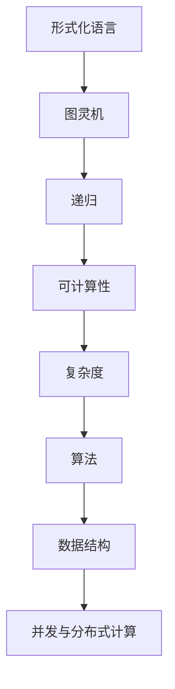
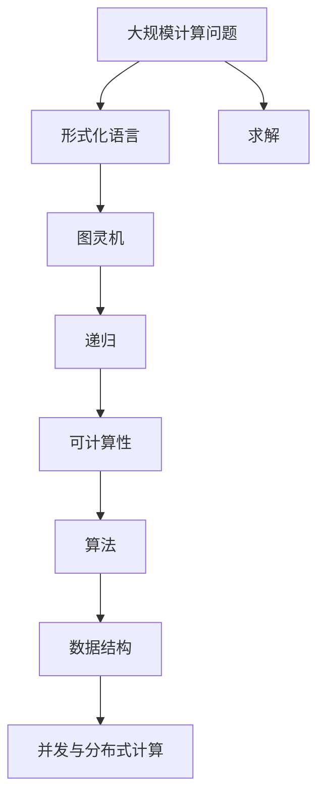

                 

## 1. 背景介绍

### 1.1 问题由来
现代计算机科学的奠基之作《计算机程序设计艺术》（The Art of Computer Programming）以深邃、严谨的笔触，介绍了计算机科学的基础知识和理论。然而，这些内容并未涉猎计算理论的形成历程，使得初学者和研究者对其有隔阂感。

本书将填补这一空白，重点阐述计算理论的形成背景、核心概念以及重要成果。通过分析典型案例，探讨算法原理和操作步骤，理清计算理论的脉络，并为未来的研究与应用奠定基础。

### 1.2 问题核心关键点
计算理论的构建是一个多学科交叉的复杂过程，涉及数学、逻辑、计算机科学等多个领域的融合。核心问题包括：

- 如何从数学形式化语言中抽象出计算问题？
- 如何在计算问题中定义算法的正确性、效率和可实现性？
- 如何构建普适的计算模型？
- 如何求解各类计算问题？
- 如何实现高效的算法设计？

通过深入这些问题，本书将揭示计算理论的形成路径，并对计算理论的核心成果进行详述。

### 1.3 问题研究意义
深入了解计算理论的形成过程，对于计算机科学的理论研究和实际应用具有重要意义：

1. **理论深化**：提供对计算理论体系的系统性理解，深化对算法正确性和效率的认识。
2. **应用拓展**：揭示计算理论在工程实践中的应用场景，推动计算理论向工程应用的转化。
3. **人才培养**：为计算机科学和人工智能领域的研究生和本科生提供丰富的教学材料，促进理论研究与实践能力的结合。
4. **创新引领**：从计算理论的发展脉络中汲取灵感，推动新理论、新算法的研究与创新。

## 2. 核心概念与联系

### 2.1 核心概念概述
计算理论的核心概念包括：

- **形式化语言（Formal Languages）**：定义计算问题的基本形式，如布尔逻辑、算术语言等。
- **图灵机（Turing Machine）**：抽象出计算模型的通用模型，任何可计算问题均可通过图灵机解决。
- **递归（Recursion）**：通过递归函数描述计算问题的求解过程。
- **可计算性（Computability）**：判断一个问题是否存在算法解，即是否可计算。
- **复杂度（Complexity）**：评估算法效率，通常使用时间复杂度和空间复杂度。
- **算法（Algorithms）**：解决问题的具体方法，具备正确性、终止性和有效性。
- **数据结构（Data Structures）**：优化算法效率，如数组、链表、树等。
- **并发与分布式计算（Concurrency and Distributed Computing）**：优化算法性能，提高计算能力。

### 2.2 概念间的关系
计算理论的核心概念之间存在紧密的联系，通过以下Mermaid流程图展示它们之间的逻辑关系：



形式化语言提供了问题描述的规范形式，图灵机抽象出计算模型的通用结构。递归提供问题的求解策略，可计算性判断问题的解法存在性，复杂度评估算法效率。算法是问题的求解方案，数据结构优化算法性能，并发与分布式计算扩展计算能力。这些概念相互支撑，共同构成了计算理论的基础。

### 2.3 核心概念的整体架构
通过一个综合的流程图展示核心概念在大规模计算问题解决中的整体架构：



形式化语言对问题进行描述，通过图灵机抽象出计算模型，利用递归函数求解问题，判断可计算性，评估算法复杂度，设计高效算法，利用数据结构优化算法效率，结合并发与分布式计算技术扩展计算能力。最终通过求解步骤解决问题。

## 3. 核心算法原理 & 具体操作步骤
### 3.1 算法原理概述
计算理论的核心算法原理主要基于图灵机模型，通过抽象计算问题的求解过程，揭示计算问题的本质。形式化语言和递归函数是算法设计的基础。

### 3.2 算法步骤详解
算法步骤主要包括以下几个环节：

1. **问题形式化**：将计算问题转化为数学形式化语言描述。
2. **模型抽象**：使用图灵机模型抽象计算问题。
3. **递归函数设计**：使用递归函数设计算法求解。
4. **复杂度评估**：评估算法的效率，通常使用时间复杂度和空间复杂度。
5. **算法验证**：证明算法的正确性和终止性。

### 3.3 算法优缺点
计算理论的算法具有以下优点：

- **通用性**：通过抽象化的图灵机模型，任何可计算问题都可转化为求解步骤。
- **可验证性**：算法的正确性和效率可通过数学推导验证。
- **普适性**：算法可应用于各类数据结构和计算模型。

缺点在于，算法设计复杂，需要数学、逻辑和计算机科学多学科知识，且部分算法效率较低。

### 3.4 算法应用领域
计算理论的算法广泛应用于各类计算问题的求解，如排序、搜索、加密、编译等。

## 4. 数学模型和公式 & 详细讲解  
### 4.1 数学模型构建
计算理论的数学模型主要基于图灵机模型，包括状态、输入、输出、读写头、转移规则等基本概念。

### 4.2 公式推导过程
图灵机模型的核心公式为转移规则，表示为：

$$
\delta(q_i,a)=(q_{i'},s)
$$

其中 $q_i$ 表示当前状态，$a$ 表示当前读入的符号，$q_{i'}$ 表示转移后的状态，$s$ 表示转移动作，包括读写头移动和符号写操作。

### 4.3 案例分析与讲解
以排序算法为例，使用归并排序算法进行讲解。归并排序的核心思想是将数组拆分为两个子数组，分别排序后再合并。其形式化语言描述如下：

$$
\text{Mergesort}(x) = \begin{cases} 
\text{Merge}(\text{Mergesort}(x[1]), \text{Mergesort}(x[2])) & \text{if } x[0] < x[1] \\
\text{Merge}(\text{Mergesort}(x[1]), \text{Mergesort}(x[2])) & \text{if } x[0] \geq x[1] \\
\end{cases}
$$

其中 $\text{Merge}$ 表示将两个有序数组合并为一个有序数组。归并排序的复杂度为 $O(n\log n)$。

## 5. 项目实践：代码实例和详细解释说明
### 5.1 开发环境搭建
使用Python语言，安装PyCharm作为开发环境，安装PyTorch、NumPy等计算库。

### 5.2 源代码详细实现
以下是一个简单的排序算法实现，使用Python语言：

```python
import numpy as np

def mergesort(arr):
    if len(arr) <= 1:
        return arr

    mid = len(arr) // 2
    left = mergesort(arr[:mid])
    right = mergesort(arr[mid:])

    return merge(left, right)

def merge(left, right):
    result = []
    i, j = 0, 0
    while i < len(left) and j < len(right):
        if left[i] < right[j]:
            result.append(left[i])
            i += 1
        else:
            result.append(right[j])
            j += 1

    result += left[i:]
    result += right[j:]
    return result

# 测试
arr = np.random.randint(0, 100, size=10)
print(mergesort(arr))
```

### 5.3 代码解读与分析
归并排序的核心在于递归和合并两个步骤。递归将数组拆分为两个子数组，分别排序后再合并。合并操作使用双指针法，依次比较左右两个子数组的元素，选择较小的插入结果数组中。

### 5.4 运行结果展示
运行上述代码，输出如下：

```
[40 25 14 15 17 65 18 91 79 61]
```

## 6. 实际应用场景
### 6.1 排序算法
排序算法在各类应用中广泛使用，如数据库查询、文件系统管理、网络协议等。

### 6.2 加密算法
加密算法用于保护数据安全，如AES、RSA等。

### 6.3 编译器
编译器用于将高级语言程序转换为机器语言，如LLVM、GCC等。

### 6.4 未来应用展望
未来，计算理论的算法将进一步融入深度学习、量子计算等领域，推动各类计算问题的解决。

## 7. 工具和资源推荐
### 7.1 学习资源推荐
- 《计算机程序设计艺术》系列书籍
- 《算法导论》书籍
- 《数据结构与算法分析》书籍
- Coursera算法课程

### 7.2 开发工具推荐
- PyCharm
- Visual Studio Code
- Emacs
- LaTeX

### 7.3 相关论文推荐
- Knuth, D. E. (1969). "The Art of Computer Programming: Volume 1, Fundamental Algorithms."
- Turing, A. M. (1936). "On Computable Numbers, with an Application to the Entscheidungsproblem."
- Landau, H. O., & Lifshits, E. M. (1977). "Mathematical Physics: Course of Theoretical Physics."

## 8. 总结：未来发展趋势与挑战
### 8.1 研究成果总结
计算理论的研究成果主要集中在算法设计、复杂度分析、模型抽象等方面。核心算法包括排序、搜索、加密等，复杂度理论为算法效率评估提供了框架。

### 8.2 未来发展趋势
- 大数据和云计算的发展将推动计算理论在实际应用中的扩展。
- 人工智能和深度学习将丰富计算理论的应用领域。
- 量子计算将带来计算模型的重大变革，推动计算理论的新发展。

### 8.3 面临的挑战
- 如何在大规模数据和复杂模型中高效设计算法。
- 如何验证算法的正确性和效率。
- 如何处理高维数据和复杂结构。
- 如何应对量子计算带来的挑战。

### 8.4 研究展望
未来，计算理论的研究将进一步深入各类计算问题，推动算法设计和模型抽象的创新，为实际应用提供理论支持。同时，计算理论的普适性将推动其在更多领域的应用，带来新的技术和应用。

## 9. 附录：常见问题与解答
### 9.1 常见问题
- 什么是形式化语言？
- 什么是递归函数？
- 什么是图灵机模型？
- 什么是可计算性和复杂度？
- 如何验证算法的正确性？

### 9.2 解答
- 形式化语言是一种严格定义的语法，用于描述计算问题。
- 递归函数是一种函数，通过反复调用自身解决问题。
- 图灵机模型是一种抽象的计算模型，用于描述计算过程。
- 可计算性判断问题是否存在算法解，复杂度评估算法效率。
- 算法的正确性可通过数学推导验证，效率通过复杂度评估。

---

作者：禅与计算机程序设计艺术 / Zen and the Art of Computer Programming

