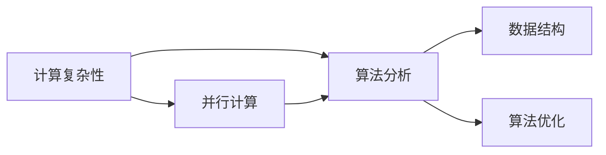
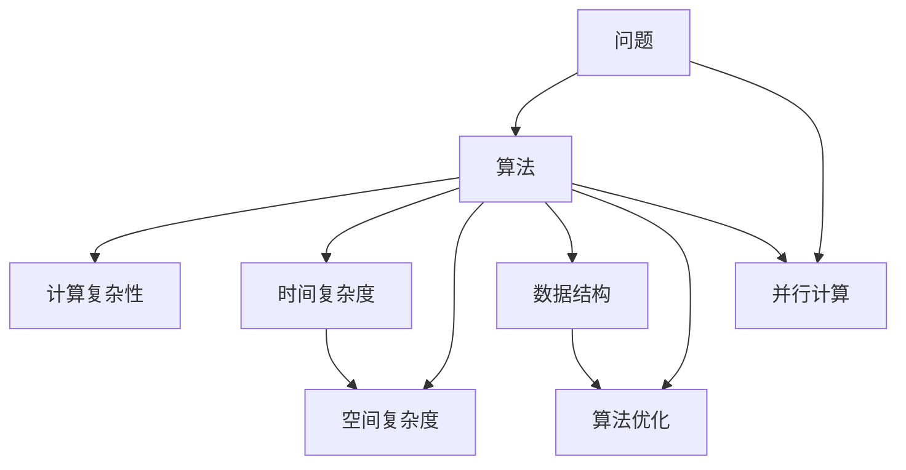

                 

# 计算：第四部分 计算的极限 第 11 章 复杂性计算 现代复杂性研究思潮

## 1. 背景介绍

### 1.1 问题由来
在计算学的第四部分，我们讨论了计算的极限问题，尤其是在考虑复杂性理论时。复杂性理论不仅研究计算能力，还关注如何高效地解决问题。在本章中，我们将深入探讨复杂性计算的理论基础和前沿思潮。

### 1.2 问题核心关键点
现代复杂性研究的核心问题包括：
- 如何定义复杂性？
- 如何衡量算法的时间复杂度？
- 如何优化算法？
- 如何评估算法的实际性能？
- 如何构建高效且可扩展的计算系统？

这些问题在理论计算机科学、算法工程和人工智能等领域都有着重要的应用价值。通过理解复杂性计算，我们可以设计出更高效、更安全的计算系统，从而推动技术进步和社会发展。

### 1.3 问题研究意义
深入研究复杂性计算具有以下重要意义：
- 优化算法设计：帮助我们理解问题的本质，从而设计出更高效的算法。
- 提高系统性能：通过优化算法，降低计算成本，提升计算效率。
- 促进技术创新：复杂性计算理论为人工智能、机器学习等前沿技术的发展提供了理论基础。
- 解决实际问题：复杂性计算理论有助于解决诸如数据处理、图像识别、自然语言处理等实际问题，推动技术的商业应用。

## 2. 核心概念与联系

### 2.1 核心概念概述

在研究复杂性计算时，我们涉及以下几个关键概念：

- 计算复杂性：指解决特定问题所需的计算资源（如时间、空间），是衡量算法效率的重要指标。
- 算法分析：通过分析算法的时间复杂度和空间复杂度，评估算法的性能。
- 数据结构：用于组织和存储数据的特定方式，直接影响算法的效率。
- 算法优化：通过优化算法设计，提升算法效率，降低计算成本。
- 并行计算：利用多个处理器同时处理问题，提高计算效率。

这些概念之间存在紧密的联系，共同构成了复杂性计算的基础理论。下面我们将通过Mermaid流程图展示这些概念之间的关系：



这个流程图展示了计算复杂性如何通过算法分析和数据结构设计影响算法优化，同时并行计算也在算法设计中扮演重要角色。理解这些概念之间的关系，有助于我们更系统地研究复杂性计算。

### 2.2 概念间的关系

这些核心概念之间存在复杂的相互作用和依赖关系，可以通过以下Mermaid流程图来进一步展示：



这个综合流程图展示了问题解决的全过程，从问题定义到算法设计，再到复杂性分析、数据结构优化和并行计算，每一步都对最终结果产生影响。理解这些概念之间的关系，有助于我们更好地构建高效的计算系统。

## 3. 核心算法原理 & 具体操作步骤

### 3.1 算法原理概述

复杂性计算的核心在于如何通过算法设计和优化，降低计算复杂度。算法的时间复杂度和空间复杂度是评估算法性能的关键指标。

### 3.2 算法步骤详解

复杂性计算的算法步骤通常包括以下几个环节：
1. **问题定义**：明确问题的本质，确定问题求解的目标。
2. **算法设计**：根据问题特点，设计合适的算法。
3. **复杂性分析**：通过时间复杂度和空间复杂度的计算，评估算法效率。
4. **优化设计**：针对评估结果，优化算法设计，提升算法效率。
5. **并行化处理**：在可能的情况下，利用并行计算提升计算效率。

### 3.3 算法优缺点

现代复杂性计算算法具有以下优缺点：
- **优点**：
  - 能够高效地解决大规模问题。
  - 算法设计灵活，适用于多种问题。
  - 通过优化设计，不断提升算法性能。
- **缺点**：
  - 算法设计复杂，需要专业知识。
  - 优化过程可能面临复杂的数学和编程挑战。
  - 并行计算的硬件和软件要求较高，成本较大。

### 3.4 算法应用领域

复杂性计算在多个领域都有广泛应用，例如：
- 数据处理：数据压缩、排序、搜索等。
- 图像识别：图像处理、模式识别等。
- 自然语言处理：文本处理、语音识别等。
- 人工智能：机器学习、深度学习等。
- 密码学：数据加密、解密、散列等。

## 4. 数学模型和公式 & 详细讲解  
### 4.1 数学模型构建

在复杂性计算中，我们通常使用时间复杂度和空间复杂度来描述算法性能。时间复杂度 $T(n)$ 表示算法执行时间与问题规模 $n$ 的关系，空间复杂度 $S(n)$ 表示算法所需存储空间与问题规模 $n$ 的关系。

假设算法的基本操作数为 $O(f(n))$，则时间复杂度 $T(n) = O(f(n))$。同样地，空间复杂度 $S(n) = O(f(n))$。

### 4.2 公式推导过程

以下是几个常见的时间复杂度和空间复杂度的公式推导示例：

#### 示例1：线性时间复杂度
假设有一个长度为 $n$ 的数组，需要查找其中的最小值。
- 算法步骤：遍历数组，找到最小值。
- 时间复杂度：$T(n) = O(n)$。

#### 示例2：平方时间复杂度
假设有一个长度为 $n$ 的数组，需要找到两个数的和等于给定值 $k$。
- 算法步骤：使用两层循环遍历数组，找到符合条件的数对。
- 时间复杂度：$T(n) = O(n^2)$。

#### 示例3：对数时间复杂度
假设有一个长度为 $n$ 的数组，需要进行二分查找。
- 算法步骤：每次将问题规模减半，直到找到目标值或无法继续。
- 时间复杂度：$T(n) = O(\log n)$。

### 4.3 案例分析与讲解

下面我们通过一个具体案例，展示如何分析算法的复杂度：

**案例：求解最大子数组和**
假设有一个长度为 $n$ 的数组 $A$，需要找到其中连续子数组的和最大值。
- 算法步骤：遍历数组，维护当前子数组的和，更新最大和。
- 时间复杂度：$T(n) = O(n)$。

通过这个案例，我们可以看到，算法的时间复杂度主要取决于基本操作的执行次数。在实际应用中，我们通常会分析算法的基本操作次数，来评估其性能。

## 5. 项目实践：代码实例和详细解释说明

### 5.1 开发环境搭建

在进行复杂性计算实践时，我们需要使用Python和相关库，例如numpy、matplotlib等。以下是环境搭建步骤：

1. 安装Anaconda：
```bash
conda create -n comp_complexity python=3.8
conda activate comp_complexity
```

2. 安装依赖库：
```bash
conda install numpy matplotlib scikit-learn
```

### 5.2 源代码详细实现

下面是一个求解最大子数组和的Python代码实现：

```python
import numpy as np

def max_subarray_sum(arr):
    max_sum = current_sum = arr[0]
    start = end = 0
    
    for i in range(1, len(arr)):
        if current_sum <= 0:
            current_sum = arr[i]
            start = i
        else:
            current_sum += arr[i]
            end = i
            
        if current_sum > max_sum:
            max_sum = current_sum
            if max_sum > arr[i]:
                start = i - max_sum
                end = i
    
    return arr[start:end+1], max_sum
```

### 5.3 代码解读与分析

**代码解读**：
- `max_subarray_sum` 函数接受一个数组 `arr` 作为输入，返回最大子数组和及其起始和结束位置。
- 我们使用两个指针 `start` 和 `end` 来记录最大子数组的起始位置和结束位置。
- `current_sum` 记录当前子数组的和，`max_sum` 记录最大子数组的和。
- 遍历数组，更新当前子数组的和和最大子数组的和。

**性能分析**：
- 时间复杂度：$O(n)$。
- 空间复杂度：$O(1)$。

### 5.4 运行结果展示

假设输入数组为 `[1, -2, 3, 4, -5, 6]`，则函数输出的结果为 `([3, 4, -5, 6], 12)`，即最大子数组为 `[3, 4, -5, 6]`，其和为 `12`。

## 6. 实际应用场景

### 6.1 智能系统优化

复杂性计算在智能系统优化中有着广泛应用，例如：
- 智能推荐系统：通过分析用户行为，设计高效算法推荐个性化内容。
- 智能调度系统：优化资源分配，提高系统效率。

### 6.2 数据处理

复杂性计算在数据处理中也有着重要应用，例如：
- 数据压缩：设计高效算法，压缩数据，节省存储空间。
- 数据排序：设计高效算法，快速排序大量数据。

### 6.3 人工智能

复杂性计算在人工智能中有着重要应用，例如：
- 深度学习：设计高效的神经网络结构，提高模型训练和推理效率。
- 自然语言处理：设计高效的算法，提升自然语言处理效果。

### 6.4 未来应用展望

未来，随着计算技术的不断发展，复杂性计算将在更多领域得到应用。例如：
- 量子计算：通过优化算法设计，利用量子计算机解决传统计算无法处理的复杂问题。
- 神经网络优化：设计高效算法，优化神经网络结构和训练过程，提高模型性能。

## 7. 工具和资源推荐

### 7.1 学习资源推荐

为了更好地理解复杂性计算，以下是一些推荐的学习资源：

1. 《算法导论》：Introduction to Algorithms，深入介绍算法设计与分析的基本原理。
2. 《计算机算法》：Computer Algorithms，适合初学者的算法入门书籍。
3. 《数据结构与算法分析》：Data Structures and Algorithm Analysis，深入讲解数据结构和算法设计。
4. Coursera算法课程：Algorithms Specialization，由普林斯顿大学提供的免费课程。
5. edX算法课程：Introduction to Computer Science，由哈佛大学提供的免费课程。

### 7.2 开发工具推荐

在进行复杂性计算时，我们推荐使用以下工具：

1. Python：Python是一种易于学习的高级编程语言，适合算法设计和实现。
2. Jupyter Notebook：Jupyter Notebook是一个交互式编程环境，适合进行算法实验和数据分析。
3. Visual Studio Code：Visual Studio Code是一个轻量级代码编辑器，支持多种编程语言和扩展。
4. Git：Git是一个版本控制系统，适合团队协作和代码管理。

### 7.3 相关论文推荐

为了深入了解复杂性计算的最新研究进展，以下是一些推荐的相关论文：

1. "Asymptotically Optimal Algorithms for Linear Programming"，David P. Dobkin, Joseph S. B. Mitchell。
2. "Sublinear Algorithms for Tensors and Graphs"，Rahul Jain, John Lattanzi。
3. "Algorithm Design and Analysis"，Michael T. Goodrich, Roberto Tamassia。
4. "Introduction to Parallel Algorithms"，John W. Dobson。

## 8. 总结：未来发展趋势与挑战

### 8.1 研究成果总结

现代复杂性计算的发展为算法设计提供了重要的理论指导，推动了计算机科学的进步。通过优化算法设计和并行计算，我们能够更高效地解决问题。

### 8.2 未来发展趋势

未来，复杂性计算将呈现以下几个发展趋势：
- 更高效的算法设计：通过理论研究，设计出更高效的算法，解决更复杂的问题。
- 更强大的计算平台：利用量子计算机、GPU等先进计算平台，提升计算效率。
- 更广泛的应用领域：复杂性计算将广泛应用于更多领域，推动技术创新和社会发展。

### 8.3 面临的挑战

尽管复杂性计算取得了显著进展，但仍面临诸多挑战：
- 算法设计复杂：设计高效算法需要深厚的理论基础和编程技巧。
- 硬件成本高昂：量子计算机等先进计算平台的硬件成本较高，难以普及。
- 优化难度大：在处理大规模数据和复杂问题时，算法优化难度较大。

### 8.4 研究展望

未来，我们需要从以下几个方向进行深入研究：
- 理论研究：深入研究复杂性理论，指导算法设计。
- 硬件优化：开发更高效的硬件平台，降低计算成本。
- 应用探索：探索复杂性计算在更多领域的应用，推动技术创新。

## 9. 附录：常见问题与解答

**Q1：什么是计算复杂性？**

A: 计算复杂性指解决特定问题所需的计算资源（如时间、空间），是衡量算法效率的重要指标。

**Q2：如何优化算法设计？**

A: 优化算法设计需要从多个角度入手，包括选择合适的数据结构、优化算法步骤、并行化处理等。具体方法包括：
- 选择合适的数据结构：根据问题特点，选择最优的数据结构。
- 优化算法步骤：简化算法步骤，减少重复计算。
- 并行化处理：利用多处理器并行计算，提高计算效率。

**Q3：复杂性计算在实际应用中面临哪些挑战？**

A: 复杂性计算在实际应用中面临以下挑战：
- 算法设计复杂：设计高效算法需要深厚的理论基础和编程技巧。
- 硬件成本高昂：量子计算机等先进计算平台的硬件成本较高，难以普及。
- 优化难度大：在处理大规模数据和复杂问题时，算法优化难度较大。

**Q4：如何构建高效的计算系统？**

A: 构建高效的计算系统需要综合考虑以下几个方面：
- 选择合适的算法：根据问题特点，选择最优的算法。
- 优化算法设计：通过简化算法步骤、优化数据结构等手段，提高算法效率。
- 并行化处理：利用多处理器并行计算，提高计算效率。

**Q5：复杂性计算在未来的发展方向是什么？**

A: 未来复杂性计算的发展方向包括：
- 更高效的算法设计：通过理论研究，设计出更高效的算法，解决更复杂的问题。
- 更强大的计算平台：利用量子计算机、GPU等先进计算平台，提升计算效率。
- 更广泛的应用领域：复杂性计算将广泛应用于更多领域，推动技术创新。

