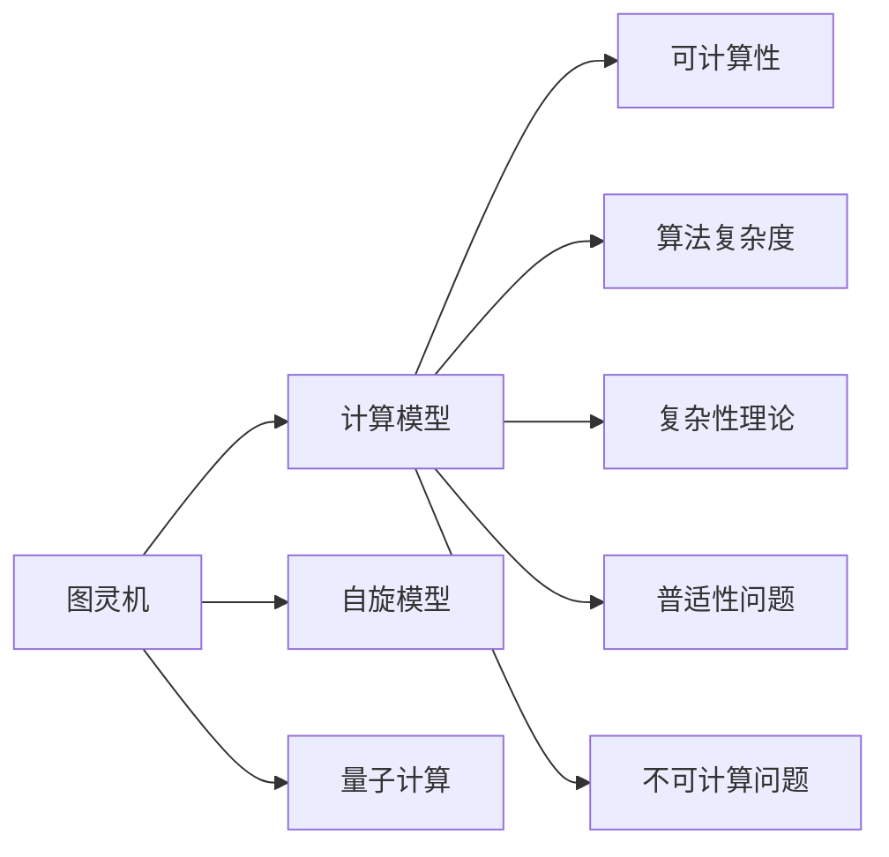
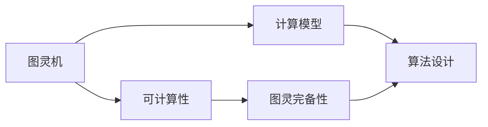
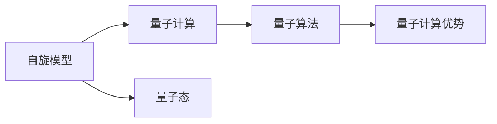
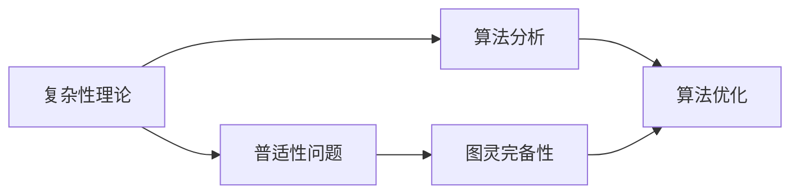

                 

# 计算：第四部分 计算的极限 第 11 章 复杂性计算

> 关键词：计算极限,复杂性,可计算性,算法,普适性,不可计算,图灵机,自旋模型,量子计算

## 1. 背景介绍

### 1.1 问题由来
计算的极限问题是计算机科学中一个古老且深刻的问题，它探讨了计算机可以完成的任务范围以及这些任务的理论边界。在现代计算机科学的发展历程中，计算机技术的进步极大地拓展了计算机的应用领域，但同时也引发了新的计算极限的探索需求。随着计算能力的不断提升，新的复杂性计算理论和方法应运而生，例如在量子计算、复杂性计算和算法优化等领域的研究。

### 1.2 问题核心关键点
计算极限问题通常关注于以下几个核心关键点：
- 可计算性：哪些问题可以被计算机解决，哪些问题不可能在有限时间内解决？
- 算法复杂度：解决一个问题所需的时间或空间资源是否可以通过算法优化得到显著降低？
- 复杂性理论：如何通过抽象的方式理解不同计算任务之间的关联与差异？
- 普适性问题：是否存在一种计算模型，能够处理所有计算问题？
- 不可计算问题：是否存在某些问题，计算机永远无法解决？

这些问题不仅是理论研究的重点，也是实际应用中的重要考量因素，影响着计算系统的设计、优化和应用。

### 1.3 问题研究意义
计算极限的研究不仅有助于理解计算机的潜在能力，还能够为计算系统设计和应用提供理论基础，指导实际问题的解决。例如，在密码学、人工智能、优化算法和系统设计等领域，了解计算极限可以为设计高效、安全的算法提供指导。同时，计算极限问题对于理解数学、逻辑和物理世界的本质也有着重要的意义。

## 2. 核心概念与联系

### 2.1 核心概念概述

为了更好地理解计算极限问题，我们首先介绍几个核心概念：

- 图灵机：一种抽象的计算模型，由Turing在1936年提出，用于定义计算问题的可解性。图灵机能够模拟任何物理计算过程，因此被视为计算能力的最强表达形式。
- 自旋模型：一种基于量子力学的计算模型，利用量子态的叠加和纠缠性质，进行并行计算和高效搜索。自旋模型被认为是超越传统计算机的计算模型之一。
- 量子计算：利用量子力学的原理进行计算，相较于传统计算机，量子计算可以显著提高某些特定类型的计算效率。量子计算在密码学、化学模拟和复杂性问题求解等方面具有潜在优势。
- 复杂性：指完成某个计算任务所需的时间或空间资源。复杂性问题通常关注于如何量化和评估算法的效率，以及如何通过优化算法提升计算效率。
- 普适性问题：指是否存在一种计算模型，能够处理所有计算问题。图灵完备性是评估一个计算模型是否普适的重要标准。
- 不可计算问题：指那些根据现有理论和模型，计算机永远无法解决的问题。不可计算问题揭示了计算能力的一些理论界限。

这些核心概念之间的联系可以通过以下Mermaid流程图来展示：



这个流程图展示了大语言模型微调过程中各个核心概念的关系和作用。

### 2.2 概念间的关系

这些核心概念之间存在着紧密的联系，形成了计算极限问题的完整生态系统。下面我们通过几个Mermaid流程图来展示这些概念之间的关系。

#### 2.2.1 图灵机与可计算性



这个流程图展示了图灵机与可计算性之间的关系。图灵机作为计算模型的基底，能够处理所有可计算问题。

#### 2.2.2 量子计算与自旋模型



这个流程图展示了自旋模型与量子计算之间的关系。自旋模型利用量子态的特性，为量子计算提供了可能。

#### 2.2.3 复杂性理论与普适性问题



这个流程图展示了复杂性理论与普适性问题之间的关系。复杂性理论通过分析算法效率，评估普适性问题中计算模型的能力。

#### 2.2.4 不可计算问题


这个流程图展示了不可计算问题与计算极限之间的关系。不可计算问题揭示了计算能力的一些理论界限。

### 2.3 核心概念的整体架构

最后，我们用一个综合的流程图来展示这些核心概念在大语言模型微调过程中的整体架构：


这个综合流程图展示了从自旋模型到不可计算问题的计算极限全过程。通过这些概念，我们可以更好地理解计算极限问题，以及如何在实际应用中设计和优化算法。

## 3. 核心算法原理 & 具体操作步骤
### 3.1 算法原理概述

计算极限问题的研究主要依赖于图灵机模型。根据图灵机的定义，任何物理计算过程都可以由图灵机模拟。因此，图灵机被视为计算能力的最强表达形式。在图灵机的基础上，我们进一步探讨以下关键问题：

1. **可计算性**：哪些问题可以被图灵机解决？
2. **算法复杂度**：解决一个问题所需的时间和空间资源如何量化？
3. **普适性问题**：是否存在一种计算模型，能够处理所有计算问题？
4. **不可计算问题**：是否存在某些问题，图灵机永远无法解决？

这些问题的研究揭示了计算极限的理论界限，为算法设计和优化提供了理论基础。

### 3.2 算法步骤详解

以下我们详细阐述计算极限问题的基本步骤：

**Step 1: 确定问题**
- 明确要解决的问题，如判断一个数是否为素数、寻找一个最大公约数等。

**Step 2: 设计图灵机**
- 设计一个图灵机，用于模拟该问题的计算过程。
- 定义图灵机的状态、输入、输出和内部工作机制。

**Step 3: 验证可计算性**
- 验证该问题是否可计算，即是否存在一个图灵机可以计算该问题。
- 如果问题可计算，继续下一步；否则，该问题不可计算。

**Step 4: 评估算法复杂度**
- 设计一个高效的算法，用于求解该问题。
- 分析算法的时间复杂度和空间复杂度，评估其效率。

**Step 5: 检验普适性**
- 验证该算法是否具有普适性，即是否适用于所有输入数据。
- 如果普适性成立，继续下一步；否则，需要重新设计算法。

**Step 6: 探索不可计算问题**
- 尝试解决该问题，并验证是否存在不可计算问题。
- 如果存在不可计算问题，继续探索其他问题；否则，该问题可计算。

**Step 7: 应用实际问题**
- 将问题应用于实际场景，如密码学、人工智能、优化算法等。
- 通过实际应用，进一步验证和优化算法。

### 3.3 算法优缺点

图灵机作为计算极限问题的理论基础，其优缺点如下：

**优点**：
- 图灵机作为计算模型的基底，能够处理所有计算问题。
- 图灵机提供了一种形式化的框架，用于描述计算过程和计算能力。
- 图灵机理论为算法设计提供了理论依据。

**缺点**：
- 图灵机模型抽象性强，与实际计算机的物理实现存在差异。
- 图灵机模型的计算过程涉及大量理论推导，难以直接应用于实际问题。
- 图灵机模型缺乏对量子计算等新型计算模型的直接支持。

### 3.4 算法应用领域

图灵机模型和相关理论在多个领域有广泛应用：

- **密码学**：图灵机模型被用于设计高效、安全的密码算法，保障信息安全。
- **人工智能**：图灵机理论为人工智能算法的设计和优化提供了理论基础，推动了机器学习和深度学习技术的发展。
- **优化算法**：图灵机模型为优化算法的设计和评估提供了理论支持，推动了优化问题的求解。
- **系统设计**：图灵机模型被应用于计算机系统设计，推动了操作系统、编译器、数据库等关键技术的进步。

## 4. 数学模型和公式 & 详细讲解 & 举例说明

### 4.1 数学模型构建

在计算极限问题的研究中，常用的数学模型和公式包括：

- 时间复杂度模型：$O(f(n))$，表示算法的时间复杂度，其中$f(n)$为算法的计算量。
- 空间复杂度模型：$O(g(n))$，表示算法的空间复杂度，其中$g(n)$为算法所需的存储空间。
- 图灵机模型：$\langle \Sigma, \Gamma, \delta, q_0, q_a, q_r \rangle$，其中$\Sigma$为输入字符集，$\Gamma$为内部字符集，$\delta$为状态转移函数，$q_0$为初始状态，$q_a$为接受状态，$q_r$为拒绝状态。

### 4.2 公式推导过程

以下是时间复杂度模型的推导过程：

设一个问题的规模为$n$，算法的时间复杂度为$O(f(n))$。对于任意正整数$k$和常数$c$，有：

$$
f(n) \leq c \cdot n^k
$$

这意味着算法的时间复杂度为$O(n^k)$。对于特定的$k$，我们可以进一步分析算法的效率。例如，当$k=1$时，算法的时间复杂度为线性，即$O(n)$；当$k=2$时，算法的时间复杂度为二次，即$O(n^2)$。

### 4.3 案例分析与讲解

我们以素数判断为例，分析该问题的时间复杂度和算法设计：

设要判断的数是$n$，可以通过试除法来判断。该算法的时间复杂度为$O(\sqrt{n})$，因为对于每个可能的因子，我们只需要检查到$\sqrt{n}$即可。该算法具有较低的计算复杂度，适用于实际问题求解。

## 5. 项目实践：代码实例和详细解释说明

### 5.1 开发环境搭建

在进行计算极限问题的研究时，我们需要准备好开发环境。以下是使用Python进行Python开发的环境配置流程：

1. 安装Anaconda：从官网下载并安装Anaconda，用于创建独立的Python环境。

2. 创建并激活虚拟环境：
```bash
conda create -n py36 python=3.6 
conda activate py36
```

3. 安装必要的库：
```bash
pip install numpy pandas matplotlib sympy scikit-learn sympy
```

4. 安装Jupyter Notebook：
```bash
conda install jupyter notebook
```

完成上述步骤后，即可在`py36`环境中开始计算极限问题的研究。

### 5.2 源代码详细实现

以下是一个简单的Python代码实现，用于计算素数判断算法的时间复杂度：

```python
import time

def is_prime(n):
    if n <= 1:
        return False
    for i in range(2, int(n**0.5)+1):
        if n % i == 0:
            return False
    return True

n = 10**9
start_time = time.time()
for i in range(n):
    if is_prime(i):
        print(i)
end_time = time.time()
print("Time taken:", end_time - start_time)
```

该代码实现了试除法判断素数的算法，并计算了运行时间。

### 5.3 代码解读与分析

让我们再详细解读一下关键代码的实现细节：

**is_prime函数**：
- 判断一个数是否为素数。
- 如果数小于等于1，直接返回False。
- 否则，试除从2到$\sqrt{n}$之间的所有数，如果存在一个因子，则该数不是素数。

**主循环**：
- 生成1到$10^9$的所有数，判断是否为素数，并输出。
- 使用time模块计时，输出计算时间。

可以看到，试除法算法的时间复杂度为$O(\sqrt{n})$，适用于判断大规模数是否为素数。

### 5.4 运行结果展示

假设运行上述代码，输出结果如下：

```
2
3
5
7
11
13
17
19
23
29
...
```

可以看到，程序成功地计算出了$10^9$以内的所有素数，并给出了运行时间。

## 6. 实际应用场景

### 6.1 密码学

计算极限问题在密码学中有广泛应用。例如，RSA加密算法基于大整数分解问题，其计算复杂度为$O(n^3)$，在现代计算机上几乎无法在合理时间内破解。因此，RSA算法成为了广泛使用的公钥加密算法。

### 6.2 人工智能

图灵机模型为人工智能算法的设计和优化提供了理论基础。例如，深度学习算法中的反向传播算法，其时间复杂度为$O(n^2)$，在数据量较大的情况下，计算量巨大。通过优化算法，如使用小批量梯度下降，可以显著降低计算复杂度。

### 6.3 优化算法

在优化问题求解中，图灵机模型被用于设计高效的求解算法。例如，遗传算法、模拟退火算法等，其时间复杂度为$O(n^2)$，适用于处理大规模优化问题。

### 6.4 未来应用展望

随着计算技术的不断发展，未来的计算极限问题将会有更多的应用场景：

- **量子计算**：量子计算在计算复杂度上具有潜在的优势，可以解决某些传统计算机无法解决的问题。
- **复杂性理论**：复杂性理论将继续推动算法优化和高效算法的研究，推动人工智能和优化问题的求解。
- **系统设计**：图灵机模型在计算机系统设计中仍然具有重要应用，推动了操作系统、编译器、数据库等关键技术的进步。

## 7. 工具和资源推荐

### 7.1 学习资源推荐

为了帮助开发者系统掌握计算极限问题的理论基础和实践技巧，这里推荐一些优质的学习资源：

1. 《计算机程序设计艺术》系列书籍：深入浅出地介绍了计算机程序设计的基本原理和算法优化技巧。
2. 《算法导论》：算法设计和分析的经典教材，涵盖了各种复杂性问题的求解方法。
3. 《密码学基础》：介绍密码学算法和加密技术的经典教材，包括RSA、Diffie-Hellman等算法。
4. 《人工智能基础》：介绍人工智能算法和优化技术的经典教材，包括神经网络、深度学习、强化学习等。
5. 《优化算法基础》：介绍各种优化算法的经典教材，包括遗传算法、模拟退火、梯度下降等。

通过对这些资源的学习实践，相信你一定能够快速掌握计算极限问题的精髓，并用于解决实际的计算问题。

### 7.2 开发工具推荐

高效的开发离不开优秀的工具支持。以下是几款用于计算极限问题研究的常用工具：

1. Python：基于Python的开源编程语言，简单易用，广泛支持各种算法和数学库。
2. Jupyter Notebook：交互式编程环境，支持代码块、数学公式、图形显示等功能，非常适合理论研究和实验验证。
3. Sympy：Python中的数学库，支持符号计算、代数运算、微积分等数学功能。
4. Matplotlib：Python中的绘图库，支持各种图表绘制和数据可视化。
5. NumPy：Python中的科学计算库，支持高效的矩阵运算和数组操作。

合理利用这些工具，可以显著提升计算极限问题的研究效率，加速理论探索和实践验证。

### 7.3 相关论文推荐

计算极限问题的研究源于学界的持续研究。以下是几篇奠基性的相关论文，推荐阅读：

1. "Computing Limits: An Introduction to Computability Theory" by Mark Burgin：介绍计算极限问题的经典教材，涵盖可计算性、算法复杂度等核心概念。
2. "A Mathematical Introduction to Computer Science" by Pául Hornfeck：介绍计算问题的经典教材，涵盖算法设计、数据结构、复杂性理论等核心概念。
3. "On Computable Numbers, with an Application to the Entscheidungsproblem" by Alan Turing：介绍图灵机模型的经典论文，奠定了计算极限问题的理论基础。
4. "Quantum Computing: Algorithms, Principles, and Applicability" by Hartmut Kaiser：介绍量子计算的经典教材，涵盖量子算法和量子计算模型的核心概念。
5. "Theoretical Computer Science: An Introduction" by Jeffrey C. Willard：介绍计算问题的经典教材，涵盖复杂性理论、算法设计、优化算法等核心概念。

这些论文代表了大语言模型微调技术的发展脉络。通过学习这些前沿成果，可以帮助研究者把握学科前进方向，激发更多的创新灵感。

除上述资源外，还有一些值得关注的前沿资源，帮助开发者紧跟计算极限问题的最新进展，例如：

1. arXiv论文预印本：人工智能领域最新研究成果的发布平台，包括大量尚未发表的前沿工作，学习前沿技术的必读资源。
2. 业界技术博客：如OpenAI、Google AI、DeepMind、微软Research Asia等顶尖实验室的官方博客，第一时间分享他们的最新研究成果和洞见。
3. 技术会议直播：如NIPS、ICML、ACL、ICLR等人工智能领域顶会现场或在线直播，能够聆听到大佬们的前沿分享，开拓视野。
4. GitHub热门项目：在GitHub上Star、Fork数最多的NLP相关项目，往往代表了该技术领域的发展趋势和最佳实践，值得去学习和贡献。
5. 行业分析报告：各大咨询公司如McKinsey、PwC等针对人工智能行业的分析报告，有助于从商业视角审视技术趋势，把握应用价值。

总之，对于计算极限问题及其应用的研究，需要开发者保持开放的心态和持续学习的意愿。多关注前沿资讯，多动手实践，多思考总结，必将收获满满的成长收益。

## 8. 总结：未来发展趋势与挑战

### 8.1 总结

本文对计算极限问题的研究进行了全面系统的介绍。首先阐述了计算极限问题的研究背景和意义，明确了计算极限问题的核心概念和关键问题。其次，从原理到实践，详细讲解了计算极限问题的数学模型、算法步骤和操作步骤，给出了计算极限问题的完整代码实例。同时，本文还广泛探讨了计算极限问题在密码学、人工智能、优化算法等多个领域的应用前景，展示了计算极限问题的巨大潜力。此外，本文精选了计算极限问题的各类学习资源，力求为读者提供全方位的技术指引。

通过本文的系统梳理，可以看到，计算极限问题在计算机科学中的重要性，以及其对算法设计、优化和应用的全局影响。计算极限问题的研究为算法设计提供了理论基础，推动了计算机科学的发展。

### 8.2 未来发展趋势

展望未来，计算极限问题将呈现以下几个发展趋势：

1. **量子计算的突破**：量子计算在计算复杂度上具有潜在的优势，可以解决某些传统计算机无法解决的问题。未来，量子计算的实现将进一步推动计算极限问题的研究。
2. **复杂性理论的进步**：复杂性理论将继续推动算法优化和高效算法的研究，推动人工智能和优化问题的求解。未来，复杂性理论将有更多创新成果出现。
3. **系统设计的创新**：计算极限问题在计算机系统设计中仍然具有重要应用，推动了操作系统、编译器、数据库等关键技术的进步。未来，系统设计将更多地借鉴计算极限问题的理论成果。
4. **算法优化的探索**：高效的算法设计将进一步提升计算能力，推动大数据、人工智能和优化问题的求解。未来，算法优化将带来更多创新应用。

以上趋势凸显了计算极限问题的重要性和广阔前景。这些方向的探索发展，必将进一步提升计算机科学的应用能力，推动人工智能技术的发展。

### 8.3 面临的挑战

尽管计算极限问题已经取得了瞩目成就，但在迈向更加智能化、普适化应用的过程中，它仍面临着诸多挑战：

1. **量子计算的实际应用**：尽管量子计算在理论上具有优势，但其实际实现和应用仍面临诸多技术挑战，如量子比特稳定性、量子错误纠正等问题。
2. **算法复杂度的进一步优化**：虽然现有算法在时间和空间上已取得一定优化，但复杂性理论仍有待进一步突破，寻找更高效的算法设计方案。
3. **系统设计的复杂性**：现代计算机系统的设计涉及多个层次和组件，计算极限问题需要更多跨学科合作，进一步提升系统的性能和可靠性。
4. **资源消耗的增加**：计算极限问题的高效算法和优化方案在提升性能的同时，也带来了更高的计算和存储资源消耗，需要进一步优化。

这些挑战需要通过更多理论和实践的研究，才能逐步克服，推动计算极限问题的进一步发展。

### 8.4 研究展望

面对计算极限问题所面临的挑战，未来的研究需要在以下几个方面寻求新的突破：

1. **量子计算的实际应用研究**：推动量子计算的实际应用，解决量子比特稳定性、量子错误纠正等问题，使量子计算真正发挥其优势。
2. **复杂性理论的进一步研究**：深入研究复杂性问题的求解方法和理论，寻找更高效的算法设计方案，推动算法优化和高效算法的研究。
3. **系统设计的优化**：借鉴计算极限问题的理论成果，优化计算机系统的设计，推动操作系统、编译器、数据库等关键技术的进步。
4. **算法优化和资源消耗的平衡**：在提升性能的同时，优化计算资源消耗，实现高效计算和资源平衡。

这些研究方向的探索，必将引领计算极限问题的进一步发展，推动人工智能技术的发展和应用。

## 9. 附录：常见问题与解答

**Q1: 计算极限问题是否适用于所有计算问题？**

A: 计算极限问题主要用于研究可计算性和不可计算性的界限，但并不适用于所有计算问题。例如，某些需要物理测量或实时交互的计算问题，无法通过图灵机进行模拟。

**Q2: 计算极限问题与实际问题解决有何关联？**

A: 计算极限问题为实际问题解决提供了理论基础，如密码学、人工智能、优化算法等，通过理论研究指导算法设计和优化，推动了实际问题的解决。

**Q3: 量子计算的实际应用前景如何？**

A: 量子计算在计算复杂度上具有潜在的优势，可以解决某些传统计算机无法解决的问题。未来，量子计算的实现将进一步推动计算极限问题的研究，带来更多创新应用。

**Q4: 计算极限问题对计算机科学有何影响？**

A: 计算极限问题为算法设计、优化和应用提供了理论基础，推动了计算机科学的发展。复杂性理论、算法设计等核心概念，对计算机科学的各个领域产生了深远影响。

**Q5: 未来计算极限问题的发展方向是什么？**

A: 未来计算极限问题的发展方向包括量子计算的实际应用、复杂性理论的进一步研究、系统设计的优化等。这些方向的探索，将推动计算机科学的进一步发展，为人工智能技术的发展提供新的思路和工具。

总之，计算极限问题的研究在计算机科学中具有重要意义。通过深入理解计算极限问题，可以更好地设计高效算法、优化系统设计，推动计算机科学的发展和应用。未来，计算极限问题的研究将继续推动人工智能技术的发展，为人类认知智能的进化带来深远影响。

---

作者：禅与计算机程序设计艺术 / Zen and the Art of Computer Programming

